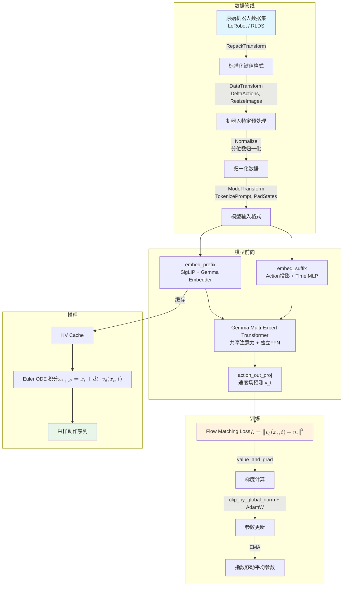
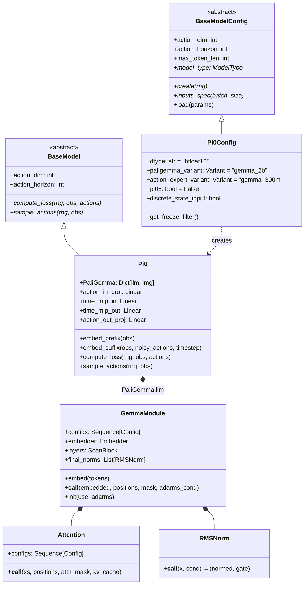
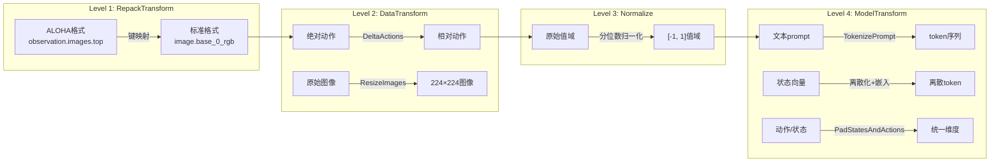
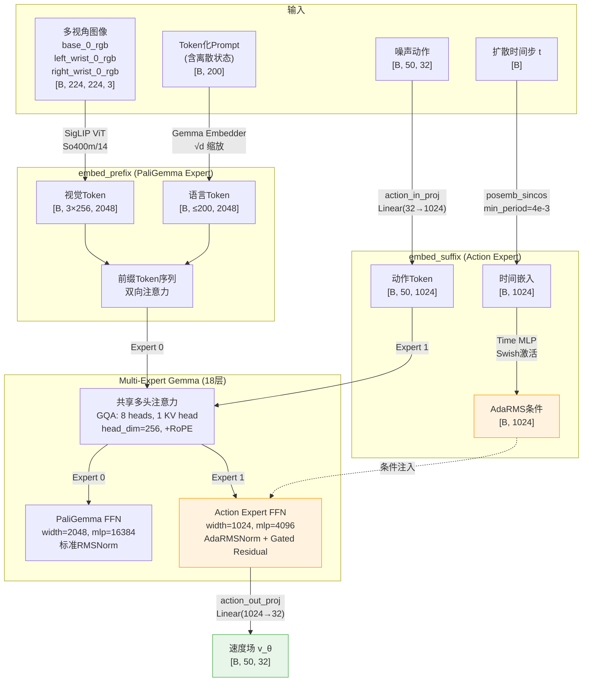
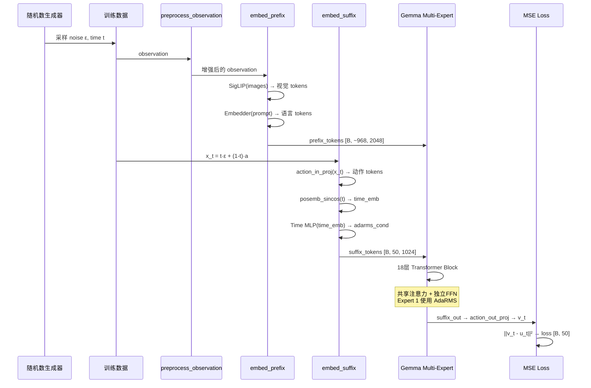
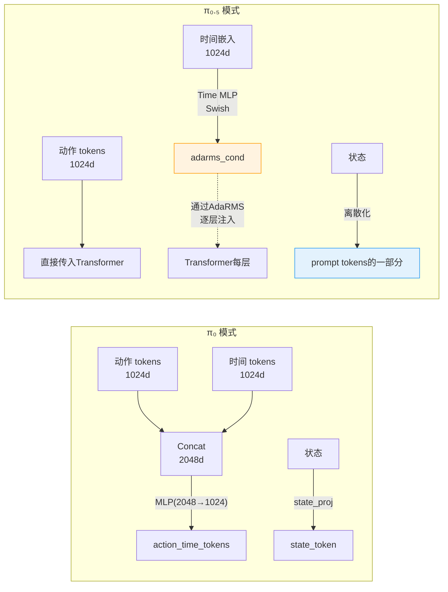
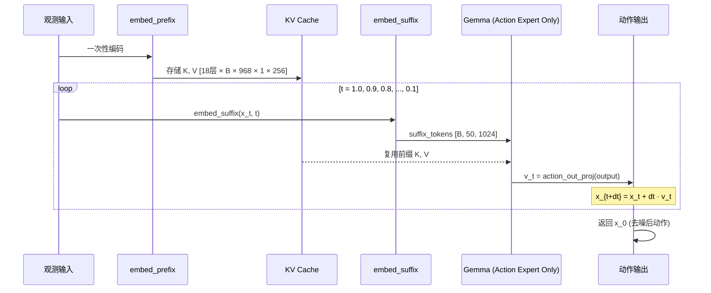
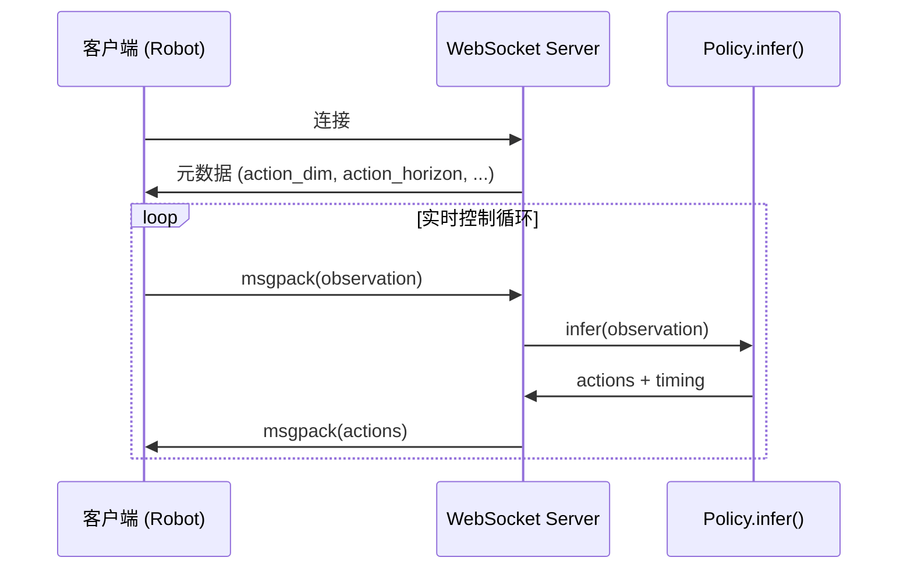

# π₀.₅ JAX 实现深度解析

## 摘要

π₀.₅ (Pi-Zero-Point-Five) 是 Physical Intelligence 提出的增强型视觉-语言-动作 (Vision-Language-Action, VLA) 模型，用于机器人操控任务的端到端学习。相较于前代 π₀，π₀.₅ 引入了两项关键改进：**Adaptive RMSNorm (AdaRMS) 时间步条件注入**与**离散化状态编码**。本文从源码层面对 openpi 代码库中 π₀.₅ 的 JAX/Flax 实现进行系统性解析，涵盖模型架构、数据管线、训练流程、推理部署以及核心技术技巧，力求兼具广度与深度。

---

## 目录

1. [系统总览与架构概述](#1-系统总览与架构概述)
2. [静态结构：类层次与模块组织](#2-静态结构类层次与模块组织)
3. [数据管线：从原始数据到模型输入](#3-数据管线从原始数据到模型输入)
4. [模型架构深度剖析](#4-模型架构深度剖析)
5. [训练流程：Forward 与 Backward](#5-训练流程forward-与-backward)
6. [推理流程：迭代去噪采样](#6-推理流程迭代去噪采样)
7. [核心技术与 Trick 解析](#7-核心技术与-trick-解析)
8. [部署与服务](#8-部署与服务)
9. [总结与展望](#9-总结与展望)

---

## 1. 系统总览与架构概述

### 1.1 全局数据流

π₀.₅ 的完整数据流可概括为：原始机器人数据 → 多级变换管线 → 模型前向计算 → Flow Matching 损失 → 梯度反传 → 参数更新。推理时则是：观测输入 → 前缀编码（KV 缓存）→ 迭代 ODE 求解 → 动作输出。



### 1.2 代码目录结构

```
src/openpi/
├── models/
│   ├── pi0.py              # π₀ / π₀.₅ 模型实现（核心）
│   ├── pi0_config.py       # 配置数据类
│   ├── gemma.py            # Multi-Expert Gemma Transformer
│   ├── siglip.py           # SigLIP 视觉编码器
│   ├── lora.py             # LoRA 低秩适应
│   ├── tokenizer.py        # 分词器（PaliGemma, FAST）
│   └── model.py            # 基类 BaseModel, Observation, Actions
├── training/
│   ├── config.py           # 训练配置注册表
│   ├── optimizer.py        # AdamW + 学习率调度
│   ├── sharding.py         # FSDP 分片策略
│   ├── checkpoints.py      # Orbax 检查点管理
│   └── data_loader.py      # 数据加载器
├── policies/               # 各机器人平台策略封装
├── serving/                # WebSocket 推理服务
├── transforms.py           # 可组合数据变换管线
└── shared/                 # 工具库（归一化、类型检查等）
```

---

## 2. 静态结构：类层次与模块组织

### 2.1 类继承体系



### 2.2 ModelType 枚举与配置分派

```python
# src/openpi/models/model.py:30-35
class ModelType(enum.Enum):
    PI0 = "pi0"
    PI0_FAST = "pi0_fast"
    PI05 = "pi05"       # ← π₀.₅
```

`Pi0Config` 通过 `pi05: bool` 标志位控制两种行为模式。这是一种优雅的**策略模式 (Strategy Pattern)** 变体——同一个 `Pi0` 类通过配置开关产生不同的模型行为：

```python
# src/openpi/models/pi0_config.py:37-41
def __post_init__(self):
    if self.max_token_len is None:
        object.__setattr__(self, "max_token_len", 200 if self.pi05 else 48)
    if self.discrete_state_input is None:
        object.__setattr__(self, "discrete_state_input", self.pi05)
```

当 `pi05=True` 时，`max_token_len` 从 48 扩展到 200（容纳离散化状态 token），`discrete_state_input` 自动启用。

---

## 3. 数据管线：从原始数据到模型输入

### 3.1 四级变换架构

openpi 采用精巧的**四级可组合变换管线**，将异构的机器人数据统一转化为模型所需的标准格式。每一级变换实现 `DataTransformFn` 协议：

```python
# src/openpi/transforms.py:23-36
@runtime_checkable
class DataTransformFn(Protocol):
    def __call__(self, data: DataDict) -> DataDict: ...
```



### 3.2 分位数归一化 vs Z-Score 归一化

π₀.₅ 使用**分位数归一化**而非传统 Z-Score：

```python
# src/openpi/transforms.py:141-145
def _normalize_quantile(self, x, stats: NormStats):
    q01, q99 = stats.q01[..., :x.shape[-1]], stats.q99[..., :x.shape[-1]]
    return (x - q01) / (q99 - q01 + 1e-6) * 2.0 - 1.0
```

数学表达：

$$x_{\text{norm}} = \frac{x - Q_{0.01}}{Q_{0.99} - Q_{0.01} + \epsilon} \times 2 - 1$$

其中 $Q_{0.01}$ 和 $Q_{0.99}$ 分别是第 1 和第 99 百分位数。相比 Z-Score 归一化 $\frac{x-\mu}{\sigma}$，分位数归一化对**离群值更加鲁棒**——机器人数据中的异常关节角度或夹爪力不会过度压缩正常值的动态范围。配置中通过如下逻辑自动选择：

```python
# src/openpi/training/config.py:187
use_quantile_norm = model_config.model_type != ModelType.PI0
```

即 π₀ 使用 Z-Score，π₀.₅ 和 π₀-FAST 使用分位数归一化。

### 3.3 π₀.₅ 的离散状态编码

π₀.₅ 最显著的数据处理创新是将连续状态向量**离散化为文本 token**，作为语言 prompt 的一部分输入模型：

```python
# src/openpi/models/tokenizer.py:22-33
def tokenize(self, prompt: str, state: np.ndarray | None = None):
    cleaned_text = prompt.strip().replace("_", " ").replace("\n", " ")
    if state is not None:
        # π₀.₅ 格式：状态离散化后嵌入prompt
        discretized_state = np.digitize(state, bins=np.linspace(-1, 1, 256 + 1)[:-1]) - 1
        state_str = " ".join(map(str, discretized_state))
        full_prompt = f"Task: {cleaned_text}, State: {state_str};\nAction: "
        tokens = self._tokenizer.encode(full_prompt, add_bos=True)
    else:
        # π₀ 格式：状态作为连续向量单独输入
        tokens = self._tokenizer.encode(cleaned_text, add_bos=True) + \
                 self._tokenizer.encode("\n")
```

**离散化过程**：将归一化到 $[-1, 1]$ 的状态向量的每个维度映射到 $\{0, 1, \ldots, 255\}$ 中的整数 bin：

$$\text{bin}_i = \text{digitize}\left(s_i,\ \text{linspace}(-1, 1, 257)[:-1]\right) - 1$$

**举例**：假设一个 ALOHA 双臂机器人的 14 维状态（左右各 6 关节 + 1 夹爪），归一化后为：

```
state = [0.12, -0.45, 0.78, 0.01, -0.92, 0.33, 0.5, ...]
```

离散化后变为：

```
"Task: pick up the cup, State: 142 70 227 128 10 170 192 ...;\nAction: "
```

这一设计让 VLM backbone（PaliGemma）可以用其**已有的语言理解能力**处理状态信息，而非依赖一个独立的线性投影层。这种设计受到了 RT-2 (Brohan et al., 2023) 中"将机器人动作表示为文本 token"思想的启发，但 π₀.₅ 进一步将状态输入也 token 化，实现了**真正的统一序列建模**。

### 3.4 数据增强

训练时对图像进行在线数据增强（`preprocess_observation` 函数）：

```python
# src/openpi/models/model.py:168-187
if train:
    transforms = []
    if "wrist" not in key:  # 仅对非腕部相机做几何增强
        height, width = image.shape[1:3]
        transforms += [
            augmax.RandomCrop(int(width * 0.95), int(height * 0.95)),
            augmax.Resize(width, height),
            augmax.Rotate((-5, 5)),
        ]
    transforms += [
        augmax.ColorJitter(brightness=0.3, contrast=0.4, saturation=0.5),
    ]
    sub_rngs = jax.random.split(rng, image.shape[0])
    image = jax.vmap(augmax.Chain(*transforms))(sub_rngs, image)
```

值得注意的设计：
- **腕部相机不做几何增强**（RandomCrop, Rotate），因为腕部视角与末端执行器位姿强相关，几何扰动会破坏这种对应关系
- **所有相机都做颜色抖动** (ColorJitter)，提升对光照变化的鲁棒性
- 使用 `augmax` 库在 JAX 中进行向量化增强（`jax.vmap`），避免了 CPU-GPU 数据搬运的开销

---

## 4. 模型架构深度剖析

### 4.1 整体架构

π₀.₅ 由三大组件构成：**SigLIP 视觉编码器**、**PaliGemma 语言模型 (Expert 0)** 和**动作专家 (Expert 1)**。三者通过一个**Multi-Expert Gemma Transformer** 统一处理。



### 4.2 SigLIP 视觉编码器

SigLIP (Sigmoid Loss for Language-Image Pre-training) 是 Google 提出的视觉编码器，相比 CLIP 使用 sigmoid 损失替代 softmax 对比损失，在大批量训练时更稳定。

π₀.₅ 使用 `So400m/14` 变体（约 400M 参数，14×14 patch size），配置为：

```python
# src/openpi/models/pi0.py:81-90
img = nnx_bridge.ToNNX(_siglip.Module(
    num_classes=paligemma_config.width,  # 输出维度匹配 Gemma (2048)
    variant="So400m/14",
    pool_type="none",    # 不池化，保留所有 patch token
    scan=True,           # 使用 nn.scan 减少编译时间
    dtype_mm="bfloat16",
))
```

关键设计：`pool_type="none"` 表示不做全局平均池化，而是将所有空间 token 保留下来——对于 224×224 图像和 14×14 patch，每张图像产生 $\frac{224}{14} \times \frac{224}{14} = 256$ 个 token。三个相机视角共产生 768 个视觉 token。

### 4.3 Multi-Expert Gemma Transformer

这是 π₀.₅ 最核心的架构创新。Gemma 模块支持多个"专家"，它们**共享注意力层的 QKV 投影**但拥有**独立的 FFN 层**。

```python
# src/openpi/models/gemma.py:340-381
class Module(nn.Module):
    configs: Sequence[Config]  # 每个专家一个配置
    embed_dtype: str
    adarms: bool = False       # π₀.₅ 启用

    def setup(self):
        self.embedder = Embedder(
            vocab_size=PALIGEMMA_VOCAB_SIZE,  # 257,152
            embed_dim=self.configs[0].width,   # 2048
        )
        block_cls = nn.remat(  # 激活重计算节省内存
            Block,
            prevent_cse=False,
            static_argnums=(5,),
            policy=jax.checkpoint_policies.nothing_saveable,
        )
        self.layers = nn.scan(  # 层间扫描复用编译
            block_cls,
            variable_axes={"params": 0},
            split_rngs={"params": True, "dropout": True},
            in_axes=(0, nn.broadcast, nn.broadcast, nn.broadcast, nn.broadcast),
            length=self.configs[0].depth,  # 18 层
        )(configs=self.configs, ...)
```

**专家配置**：

| 属性 | PaliGemma (Expert 0) | Action Expert (Expert 1) |
|------|---------------------|------------------------|
| 变体 | `gemma_2b` | `gemma_300m` |
| 宽度 | 2048 | 1024 |
| 深度 | 18 | 18 |
| MLP维度 | 16,384 | 4,096 |
| 注意力头数 | 8 | 8 |
| KV头数 | 1 (GQA) | 1 (GQA) |
| Head维度 | 256 | 256 |
| AdaRMS | 否 | **是** |
| 参数量 | ~2B | ~311M |

**命名约定**的精妙之处——Expert 0 的层没有后缀（如 `attn`, `mlp`），Expert 1 的层带后缀 `_1`（如 `attn_1`, `mlp_1`）：

```python
# src/openpi/models/gemma.py:443-450
def _name(name, i):
    # Expert 0 无后缀，可无缝加载 PaliGemma 预训练权重
    # Expert 1 带后缀，权重从头初始化
    if i == 0:
        return name
    return f"{name}_{i}"
```

这使得 Expert 0 可以直接从 PaliGemma 的预训练 checkpoint 加载权重，而 Expert 1 的权重从随机初始化开始训练——一种巧妙的**渐进式预训练利用**策略。

### 4.4 共享注意力机制

注意力模块是 Multi-Expert 架构的核心枢纽。所有活跃专家的 token 在注意力计算中被**拼接 (concatenate)** 处理，实现了跨专家的信息交互：

```python
# src/openpi/models/gemma.py:157-249
class Attention(nn.Module):
    configs: Sequence[Config]

    @nn.compact
    def __call__(self, xs, positions, attn_mask, kv_cache):
        # 1. 每个专家独立投影 QKV
        qkvs = []
        for i, (x, config) in enumerate(zip(xs, self.configs)):
            if x is None:
                continue
            # GQA: Q 有 N 个头，K/V 只有 K 个头（K << N）
            q = q_einsum("BTD,NDH->BTNH", x)   # [B, T_i, 8, 256]
            k, v = kv_einsum("BSD,2KDH->2BSKH", x)  # [B, T_i, 1, 256]
            qkvs.append((q, k, v))

        # 2. 跨专家拼接
        q, k, v = (jnp.concatenate(y, axis=1) for y in zip(*qkvs))

        # 3. 应用 RoPE
        q = _apply_rope(q, positions=positions)
        q *= config.head_dim ** -0.5  # 缩放因子 1/√d
        k = _apply_rope(k, positions=positions)

        # 4. KV Cache 拼接（推理时使用）
        if kv_cache is not None:
            k = jnp.concatenate([cache_k, k], axis=1)
            v = jnp.concatenate([cache_v, v], axis=1)

        # 5. Grouped Query Attention
        q = rearrange(q, "B T (K G) H -> B T K G H", K=num_kv_heads)
        logits = einsum("BTKGH,BSKH->BKGTS", q, k)  # float32

        # 6. 掩码 + Softmax
        masked_logits = jnp.where(attn_mask, logits, -2.3819763e38)
        probs = jax.nn.softmax(masked_logits, axis=-1)

        # 7. 聚合并按专家切分输出
        encoded = einsum("BKGTS,BSKH->BTKGH", probs, v)
        # ... 按各专家的序列长度切分 encoded ...
```

**信息流动模式**：通过共享注意力，Action Expert 的 token 可以注意到 PaliGemma Expert 的视觉和语言 token（反之亦然，受注意力掩码约束）。这实现了**视觉-语言信息到动作空间的跨模态传递**，但各专家通过独立的 FFN 层保持了自身的**表示特化 (Representational Specialization)**。

### 4.5 Grouped Query Attention (GQA)

π₀.₅ 采用 GQA（8 个 Query 头共享 1 个 KV 头），相比标准多头注意力（MHA），**KV 缓存内存减少至 1/8**，显著降低了推理时的内存占用：

$$\text{Attention}(Q, K, V) = \text{Softmax}\left(\frac{Q \cdot K^\top}{\sqrt{d_h}}\right) \cdot V$$

其中 $Q \in \mathbb{R}^{B \times T \times N_q \times d_h}$，$K, V \in \mathbb{R}^{B \times S \times N_{kv} \times d_h}$，$N_q = 8$，$N_{kv} = 1$。

### 4.6 RoPE 旋转位置编码

```python
# src/openpi/models/gemma.py:424-440
def _apply_rope(x, *, positions, max_wavelength=10_000):
    freq_exponents = (2.0 / x.shape[-1]) * jnp.arange(x.shape[-1] // 2, dtype=jnp.float32)
    timescale = max_wavelength ** freq_exponents
    radians = positions[..., None] / timescale[None, None, :]
    sin, cos = jnp.sin(radians), jnp.cos(radians)
    x1, x2 = jnp.split(x, 2, axis=-1)
    res = jnp.concatenate([x1 * cos - x2 * sin, x2 * cos + x1 * sin], axis=-1)
    return res.astype(x.dtype)
```

RoPE 的数学本质是对 Query/Key 向量施加旋转矩阵 $R_\theta(m)$：

$$R_\theta(m) = \begin{pmatrix} \cos m\theta_1 & -\sin m\theta_1 \\ \sin m\theta_1 & \cos m\theta_1 \\ & & \cos m\theta_2 & -\sin m\theta_2 \\ & & \sin m\theta_2 & \cos m\theta_2 \\ & & & & \ddots \end{pmatrix}$$

其中 $\theta_i = \frac{1}{10000^{2i/d}}$。RoPE 的优势在于：**注意力分数自然编码了相对位置**，即 $q_m^\top k_n$ 仅依赖于 $m-n$ 而非绝对位置。

### 4.7 注意力掩码构造

π₀.₅ 使用 Prefix-LM 风格的注意力模式，这是标准因果注意力和全双向注意力的混合：

```python
# src/openpi/models/pi0.py:19-44
def make_attn_mask(input_mask, mask_ar):
    mask_ar = jnp.broadcast_to(mask_ar, input_mask.shape)
    cumsum = jnp.cumsum(mask_ar, axis=1)
    attn_mask = cumsum[:, None, :] <= cumsum[:, :, None]
    valid_mask = input_mask[:, None, :] * input_mask[:, :, None]
    return jnp.logical_and(attn_mask, valid_mask)
```

通过 `mask_ar` 的累积和 (cumsum) 构造灵活的注意力模式。具体来说：

- **前缀（图像 + 语言 token）**：`mask_ar = [False, False, ..., False]`，cumsum 全为 0，所有前缀 token 之间互相可见（双向注意力）
- **前缀到后缀的边界**：`mask_ar` 第一个后缀 token 为 `True`，cumsum 跳变为 1
- **后缀（动作 token）**：`mask_ar = [True, False, False, ..., False]`，cumsum 保持不变——动作 token 之间互相可见，且都可以看到前缀

```
注意力模式示意（6个前缀token + 4个动作token，✓=可注意，·=不可注意）：

         前缀tokens   动作tokens
         t0 t1 t2 t3 t4 t5 | a0 a1 a2 a3
前 t0    ✓  ✓  ✓  ✓  ✓  ✓ | ·  ·  ·  ·
缀 t1    ✓  ✓  ✓  ✓  ✓  ✓ | ·  ·  ·  ·
   t2    ✓  ✓  ✓  ✓  ✓  ✓ | ·  ·  ·  ·
   t3    ✓  ✓  ✓  ✓  ✓  ✓ | ·  ·  ·  ·
   t4    ✓  ✓  ✓  ✓  ✓  ✓ | ·  ·  ·  ·
   t5    ✓  ✓  ✓  ✓  ✓  ✓ | ·  ·  ·  ·
   ------+--+--+--+--+--+--+--+--+--+--
动 a0    ✓  ✓  ✓  ✓  ✓  ✓ | ✓  ✓  ✓  ✓
作 a1    ✓  ✓  ✓  ✓  ✓  ✓ | ✓  ✓  ✓  ✓
   a2    ✓  ✓  ✓  ✓  ✓  ✓ | ✓  ✓  ✓  ✓
   a3    ✓  ✓  ✓  ✓  ✓  ✓ | ✓  ✓  ✓  ✓
```

这种**非对称注意力**的设计直觉：前缀 token 不应该"看到"动作 token（因为动作是模型需要预测的输出），而动作 token 需要"看到"前缀 token 和所有其他动作 token（动作序列的各时间步之间存在协调关系）。

---

## 5. 训练流程：Forward 与 Backward

### 5.1 Flow Matching 理论基础

π₀.₅ 的训练目标基于 **Conditional Flow Matching** (Lipman et al., 2023)，一种构建连续正规化流 (Continuous Normalizing Flow, CNF) 的高效方法。

核心思想是学习一个**速度场** $v_\theta(x, t)$，使得沿该速度场的 ODE 解能将噪声分布 $p_1 = \mathcal{N}(0, I)$ 映射到目标数据分布 $p_0 = p_{\text{data}}$：

$$\frac{dx}{dt} = v_\theta(x, t), \quad t \in [0, 1]$$

其中 $t=1$ 对应纯噪声，$t=0$ 对应干净数据（注意代码中使用了扩散文献的约定，与原 π₀ 论文相反）。

训练时，使用线性插值定义条件概率路径：

$$x_t = t \cdot \epsilon + (1-t) \cdot a, \quad \epsilon \sim \mathcal{N}(0, I), \quad a \sim p_{\text{data}}$$

对应的目标速度场为：

$$u_t = \epsilon - a$$

训练损失：

$$\mathcal{L}(\theta) = \mathbb{E}_{t, \epsilon, a} \left[ \| v_\theta(x_t, t) - u_t \|^2 \right]$$

### 5.2 Forward Pass 详解

```python
# src/openpi/models/pi0.py:188-214
def compute_loss(self, rng, observation, actions, *, train=False):
    preprocess_rng, noise_rng, time_rng = jax.random.split(rng, 3)

    # Step 1: 图像增强（仅训练时）
    observation = preprocess_observation(preprocess_rng, observation, train=train)

    # Step 2: 采样噪声和时间步
    batch_shape = actions.shape[:-2]                    # (B,)
    noise = jax.random.normal(noise_rng, actions.shape)  # ε ~ N(0,I), [B, 50, 32]
    time = jax.random.beta(time_rng, 1.5, 1, batch_shape) * 0.999 + 0.001  # t ~ Beta(1.5,1)

    # Step 3: 构造噪声动作
    time_expanded = time[..., None, None]               # [B, 1, 1]
    x_t = time_expanded * noise + (1 - time_expanded) * actions  # 线性插值
    u_t = noise - actions                               # 目标速度场

    # Step 4: 前缀编码（视觉 + 语言）
    prefix_tokens, prefix_mask, prefix_ar_mask = self.embed_prefix(observation)

    # Step 5: 后缀编码（动作 + 时间步）
    suffix_tokens, suffix_mask, suffix_ar_mask, adarms_cond = \
        self.embed_suffix(observation, x_t, time)

    # Step 6: 构造注意力掩码
    input_mask = jnp.concatenate([prefix_mask, suffix_mask], axis=1)
    ar_mask = jnp.concatenate([prefix_ar_mask, suffix_ar_mask], axis=0)
    attn_mask = make_attn_mask(input_mask, ar_mask)
    positions = jnp.cumsum(input_mask, axis=1) - 1

    # Step 7: Multi-Expert Transformer 前向
    (prefix_out, suffix_out), _ = self.PaliGemma.llm(
        [prefix_tokens, suffix_tokens],
        mask=attn_mask,
        positions=positions,
        adarms_cond=[None, adarms_cond],  # 仅 Action Expert 使用 AdaRMS
    )

    # Step 8: 提取速度场预测
    v_t = self.action_out_proj(suffix_out[:, -self.action_horizon:])

    # Step 9: MSE 损失
    return jnp.mean(jnp.square(v_t - u_t), axis=-1)  # [B, action_horizon]
```



### 5.3 embed_prefix：视觉-语言编码

```python
# src/openpi/models/pi0.py:105-137
def embed_prefix(self, obs: Observation):
    input_mask, ar_mask, tokens = [], [], []

    # 编码每个相机视角
    for name in obs.images:
        image_tokens, _ = self.PaliGemma.img(obs.images[name], train=False)
        tokens.append(image_tokens)           # [B, 256, 2048]
        input_mask.append(repeat(obs.image_masks[name], "b -> b s", s=256))
        ar_mask += [False] * 256              # 图像token: 双向注意力

    # 编码语言token（含离散状态）
    if obs.tokenized_prompt is not None:
        tokenized_inputs = self.PaliGemma.llm(obs.tokenized_prompt, method="embed")
        tokens.append(tokenized_inputs)       # [B, ≤200, 2048]
        input_mask.append(obs.tokenized_prompt_mask)
        ar_mask += [False] * tokenized_inputs.shape[1]  # 语言token: 双向注意力

    return jnp.concatenate(tokens, 1), jnp.concatenate(input_mask, 1), jnp.array(ar_mask)
```

对于典型的三视角 + 200 token 的配置，前缀总长度约为 $3 \times 256 + 200 = 968$ 个 token。

### 5.4 embed_suffix：动作与时间步编码（π₀.₅ vs π₀）

这是 π₀.₅ 与 π₀ 的关键分歧点：

```python
# src/openpi/models/pi0.py:139-186
def embed_suffix(self, obs, noisy_actions, timestep):
    tokens, input_mask, ar_mask = [], [], []

    if not self.pi05:
        # ═══ π₀ 模式 ═══
        # 状态作为独立的连续token
        state_token = self.state_proj(obs.state)[:, None, :]  # [B, 1, 1024]
        tokens.append(state_token)
        ar_mask += [True]  # 前缀不能注意到状态/动作

    action_tokens = self.action_in_proj(noisy_actions)  # [B, 50, 1024]

    # 时间步编码：正弦-余弦位置编码
    time_emb = posemb_sincos(timestep, 1024, min_period=4e-3, max_period=4.0)

    if self.pi05:
        # ═══ π₀.₅ 模式 ═══
        # 时间步通过 MLP 转化为 AdaRMS 条件向量
        time_emb = nnx.swish(self.time_mlp_in(time_emb))
        time_emb = nnx.swish(self.time_mlp_out(time_emb))
        action_expert_tokens = action_tokens    # 动作token不混入时间信息
        adarms_cond = time_emb                  # 时间信息通过AdaRMS注入
    else:
        # ═══ π₀ 模式 ═══
        # 时间步与动作在特征维度上拼接，再通过MLP混合
        time_tokens = repeat(time_emb, "b emb -> b s emb", s=self.action_horizon)
        action_time_tokens = jnp.concatenate([action_tokens, time_tokens], axis=-1)
        action_time_tokens = nnx.swish(self.action_time_mlp_in(action_time_tokens))
        action_expert_tokens = self.action_time_mlp_out(action_time_tokens)
        adarms_cond = None

    tokens.append(action_expert_tokens)
    ar_mask += [True] + ([False] * (self.action_horizon - 1))
    return jnp.concat(tokens, 1), jnp.concat(input_mask, 1), jnp.array(ar_mask), adarms_cond
```

两种模式的对比：



### 5.5 Backward Pass：梯度计算与参数更新

```python
# scripts/train.py:136-191
def train_step(config, rng, state, batch):
    # 1. 从 TrainState 重建模型
    model = nnx.merge(state.model_def, state.params)
    model.train()  # 设置 deterministic=False

    # 2. 定义损失函数
    def loss_fn(model, rng, observation, actions):
        chunked_loss = model.compute_loss(rng, observation, actions, train=True)
        return jnp.mean(chunked_loss)  # 标量损失

    # 3. 计算梯度（仅对可训练参数）
    train_rng = jax.random.fold_in(rng, state.step)
    diff_state = nnx.DiffState(0, config.trainable_filter)
    loss, grads = nnx.value_and_grad(loss_fn, argnums=diff_state)(
        model, train_rng, observation, actions
    )

    # 4. 优化器更新
    params = state.params.filter(config.trainable_filter)
    updates, new_opt_state = state.tx.update(grads, state.opt_state, params)
    new_params = optax.apply_updates(params, updates)

    # 5. 合并回完整参数
    nnx.update(model, new_params)
    new_params = nnx.state(model)

    # 6. EMA 更新
    new_state = dataclasses.replace(state, step=state.step+1, params=new_params, ...)
    if state.ema_decay is not None:
        new_state = dataclasses.replace(new_state,
            ema_params=jax.tree.map(
                lambda old, new: state.ema_decay * old + (1 - state.ema_decay) * new,
                state.ema_params, new_params
            ),
        )

    # 7. 日志指标
    info = {
        "loss": loss,
        "grad_norm": optax.global_norm(grads),
        "param_norm": optax.global_norm(kernel_params),
    }
    return new_state, info
```

**梯度流向**（反向传播路径）：

$$\frac{\partial \mathcal{L}}{\partial \theta} = \frac{\partial}{\partial \theta} \| v_\theta(x_t, t) - u_t \|^2 = 2 (v_\theta - u_t) \cdot \frac{\partial v_\theta}{\partial \theta}$$

梯度依次通过：`action_out_proj` → Gemma Transformer (18层，含 AdaRMS) → `action_in_proj` / `time_mlp` → SigLIP（如果未冻结）。

### 5.6 冻结策略与 LoRA

通过 `DiffState` 和 `trainable_filter`，可以精确控制哪些参数参与梯度计算：

```python
# src/openpi/models/pi0_config.py:88-117
def get_freeze_filter(self):
    filters = []
    gemma_params_filter = PathRegex(".*llm.*")
    action_expert_params_filter = PathRegex(".*llm.*_1.*")

    if "lora" in self.paligemma_variant:
        filters.append(gemma_params_filter)           # 冻结所有 Gemma 参数
        if "lora" not in self.action_expert_variant:
            filters.append(nnx.Not(action_expert_params_filter))  # 但排除 Action Expert
    # LoRA 参数始终可训练
    if has_lora:
        filters.append(nnx.Not(PathRegex(".*lora.*")))
```

---

## 6. 推理流程：迭代去噪采样

### 6.1 ODE 求解

推理时，从纯噪声 $x_1 \sim \mathcal{N}(0, I)$ 出发，通过 Euler 方法逐步积分到 $x_0$：

```python
# src/openpi/models/pi0.py:216-279
def sample_actions(self, rng, observation, *, num_steps=10, noise=None):
    observation = preprocess_observation(None, observation, train=False)
    dt = -1.0 / num_steps  # 每步时间增量（从 t=1 到 t=0）
    batch_size = observation.state.shape[0]

    if noise is None:
        noise = jax.random.normal(rng, (batch_size, self.action_horizon, self.action_dim))

    # ═══ Step 1: 前缀 KV Cache 预填充 ═══
    prefix_tokens, prefix_mask, prefix_ar_mask = self.embed_prefix(observation)
    prefix_attn_mask = make_attn_mask(prefix_mask, prefix_ar_mask)
    positions = jnp.cumsum(prefix_mask, axis=1) - 1
    _, kv_cache = self.PaliGemma.llm(
        [prefix_tokens, None],  # 仅前缀，Action Expert 不参与
        mask=prefix_attn_mask, positions=positions
    )

    # ═══ Step 2: 迭代去噪 ═══
    def step(carry):
        x_t, time = carry
        suffix_tokens, suffix_mask, suffix_ar_mask, adarms_cond = \
            self.embed_suffix(observation, x_t, jnp.broadcast_to(time, batch_size))

        # 构造注意力掩码：suffix → (cached_prefix + suffix)
        suffix_attn_mask = make_attn_mask(suffix_mask, suffix_ar_mask)
        prefix_attn_mask = repeat(prefix_mask, "b p -> b s p", s=suffix_tokens.shape[1])
        full_attn_mask = jnp.concatenate([prefix_attn_mask, suffix_attn_mask], axis=-1)

        positions = jnp.sum(prefix_mask, -1)[:, None] + jnp.cumsum(suffix_mask, -1) - 1

        (_, suffix_out), _ = self.PaliGemma.llm(
            [None, suffix_tokens],      # 仅 Action Expert
            mask=full_attn_mask,
            positions=positions,
            kv_cache=kv_cache,           # 复用前缀 KV Cache
            adarms_cond=[None, adarms_cond],
        )

        v_t = self.action_out_proj(suffix_out[:, -self.action_horizon:])
        return x_t + dt * v_t, time + dt  # Euler 步进

    def cond(carry):
        _, time = carry
        return time >= -dt / 2  # 鲁棒的浮点终止条件

    x_0, _ = jax.lax.while_loop(cond, step, (noise, 1.0))
    return x_0
```

### 6.2 KV Cache 优化

推理的关键优化在于 **KV Cache 复用**：前缀（视觉 + 语言）在所有去噪步骤中保持不变，因此其 KV 对只需计算一次。



默认 `num_steps=10`，意味着 10 步 Euler 积分。前缀计算（包含 SigLIP 和完整 Transformer 前向）的成本被**摊销到所有去噪步骤上**，推理效率大幅提升。

### 6.3 `jax.lax.while_loop` 的使用

代码使用 `jax.lax.while_loop` 而非 Python for 循环，这是 JAX 的**函数式循环原语**，可以被 XLA 编译为高效的循环指令，避免了逐步 JIT 编译的开销。终止条件 `time >= -dt / 2` 使用了半步偏移来避免浮点精度问题。

---

## 7. 核心技术与 Trick 解析

### 7.1 Adaptive RMSNorm (AdaRMS)

**这是 π₀.₅ 最核心的架构创新。** 标准 RMSNorm 仅有可学习的缩放参数 $\gamma$，而 AdaRMS 根据时间步条件动态生成 scale, shift, gate 三组调制参数：

```python
# src/openpi/models/gemma.py:112-131
class RMSNorm(nn.Module):
    @nn.compact
    def __call__(self, x, cond):
        # RMS 归一化（float32 精度）
        var = jnp.mean(jnp.square(x.astype(jnp.float32)), axis=-1, keepdims=True)
        normed = x * jnp.reciprocal(jnp.sqrt(var + 1e-06))

        if cond is None:
            # 标准 RMSNorm：y = normed * (1 + γ)
            scale = self.param("scale", nn.initializers.zeros_init(), (x.shape[-1],))
            return (normed * (1 + scale)).astype(x.dtype), None

        # ═══ Adaptive RMSNorm ═══
        # 从条件向量生成 3d 维的调制参数
        modulation = nn.Dense(x.shape[-1] * 3,
                              kernel_init=nn.initializers.zeros,  # 零初始化！
                              dtype=x.dtype)(cond)
        scale, shift, gate = jnp.split(modulation[:, None, :], 3, axis=-1)

        normed = normed * (1 + scale) + shift  # 仿射调制
        return normed.astype(x.dtype), gate     # gate 用于残差连接
```

数学表达：

$$\text{AdaRMS}(x, c) = \frac{x}{\text{RMS}(x)} \cdot (1 + \gamma(c)) + \beta(c)$$

其中 $[\gamma(c), \beta(c), g(c)] = W_{\text{mod}} \cdot c + b_{\text{mod}}$，$c$ 是时间步条件向量。

**关键技巧：零初始化**。调制层的权重用 `nn.initializers.zeros` 初始化，这意味着训练初期 $\gamma = 0, \beta = 0, g = 0$，AdaRMS 退化为标准 RMSNorm。这保证了 **PaliGemma 预训练权重在微调初期不会被破坏**。

### 7.2 Gated Residual Connection

AdaRMS 输出的 `gate` 参数被用于控制残差连接的强度：

```python
# src/openpi/models/gemma.py:453-459
def _gated_residual(x, y, gate):
    if x is None:
        return None
    if gate is None:
        return x + y        # 标准残差（π₀ / PaliGemma Expert）
    return x + y * gate     # 门控残差（π₀.₅ Action Expert）
```

标准残差连接：$x' = x + f(x)$

门控残差连接：$x' = x + f(x) \odot g(c)$

这与 DiT (Peebles & Xie, 2023) 中的 adaLN-Zero 技巧一脉相承。门控机制允许模型在训练初期"跳过"Transformer 层（当 $g \approx 0$），然后逐渐学习利用每一层的信息。

### 7.3 Transformer Block 中 AdaRMS 的完整流程

```python
# src/openpi/models/gemma.py:283-333
class Block(nn.Module):
    @nn.compact
    def __call__(self, xs, kv_cache, positions, attn_mask, adarms_cond, deterministic):
        # ═══ Pre-Attention Norm ═══
        pre_attn, gates = [], []
        for i, x in enumerate(xs):
            if x is not None:
                x, gate = RMSNorm(name=_name("pre_attention_norm", i))(x, adarms_cond[i])
            pre_attn.append(x)
            gates.append(gate)

        # ═══ Shared Attention ═══
        post_attn, kv_cache = Attention(configs=self.configs)(pre_attn, positions, attn_mask, kv_cache)

        # ═══ Gated Residual (Attention) ═══
        xs = [_gated_residual(x, y, gate) for x, y, gate in zip(xs, post_attn, gates)]

        # ═══ Pre-FFN Norm ═══
        out, gates = [], []
        for i, (x, config) in enumerate(zip(xs, self.configs)):
            if x is not None:
                x, gate = RMSNorm(name=_name("pre_ffw_norm", i))(x, adarms_cond[i])
                x = FeedForward(features=config.width, hidden_dim=config.mlp_dim)(x)
            out.append(x)
            gates.append(gate)

        # ═══ Gated Residual (FFN) ═══
        xs = [_gated_residual(x, y, gate) for x, y, gate in zip(xs, out, gates)]
        return xs, kv_cache
```

每个 Transformer Block 中 AdaRMS 被使用**两次**（pre-attention 和 pre-FFN），每次都产生一个 gate 用于门控残差。在一个完整的 18 层 Transformer 中，Action Expert 共有 $18 \times 2 = 36$ 个 AdaRMS 调制点。

### 7.4 Beta 分布时间步采样

```python
# src/openpi/models/pi0.py:197
time = jax.random.beta(time_rng, 1.5, 1, batch_shape) * 0.999 + 0.001
```

使用 $\text{Beta}(1.5, 1)$ 分布而非均匀分布 $U(0, 1)$ 采样时间步，概率密度为：

$$p(t) = 1.5 \cdot t^{0.5}, \quad t \in [0, 1]$$

这意味着**训练时更多地采样高噪声水平 ($t \to 1$) 的样本**。

```
概率密度对比：

Beta(1.5, 1)  |                          ████████
              |                    ██████████████
              |              ██████████████████
              |         ████████████████████████
              |    ████████████████████████████
              |████████████████████████████████
              +----------------------------------→ t
              0                                  1

Uniform(0,1)  |████████████████████████████████
              |████████████████████████████████
              +----------------------------------→ t
              0                                  1
```

这种偏斜采样的直觉：高噪声水平（$t$ 接近 1）时的速度场预测更困难（信噪比更低），需要更多的训练样本。乘以 0.999 加 0.001 将 $t$ 限制在 $[0.001, 1.0)$，**避免了 $t=0$（纯数据）和 $t=1$（纯噪声）端点处的数值不稳定性**。

### 7.5 正弦-余弦时间步编码

```python
# src/openpi/models/pi0.py:47-63
def posemb_sincos(pos, embedding_dim, min_period, max_period):
    fraction = jnp.linspace(0.0, 1.0, embedding_dim // 2)
    period = min_period * (max_period / min_period) ** fraction
    sinusoid_input = jnp.einsum("i,j->ij", pos, 1.0 / period * 2 * jnp.pi,
                                 precision=jax.lax.Precision.HIGHEST)
    return jnp.concatenate([jnp.sin(sinusoid_input), jnp.cos(sinusoid_input)], axis=-1)
```

频率在对数空间中均匀分布于 $[\text{min\_period}, \text{max\_period}] = [0.004, 4.0]$：

$$\omega_k = \frac{2\pi}{T_k}, \quad T_k = 0.004 \cdot \left(\frac{4.0}{0.004}\right)^{k/(d/2-1)}, \quad k = 0, \ldots, d/2-1$$

$\text{min\_period} = 0.004$ 对应的频率 $\frac{2\pi}{0.004} = 1571$ rad，足以捕获 $t \in [0, 1]$ 范围内的**细粒度时间差异**。$\text{max\_period} = 4.0$ 对应 $\frac{2\pi}{4} = 1.57$ rad，提供了**粗粒度的全局时间结构**。

### 7.6 EMA (Exponential Moving Average)

```python
# scripts/train.py:169-175
if state.ema_decay is not None:
    new_state = dataclasses.replace(new_state,
        ema_params=jax.tree.map(
            lambda old, new: state.ema_decay * old + (1 - state.ema_decay) * new,
            state.ema_params, new_params
        ),
    )
```

$$\theta_{\text{EMA}}^{(t)} = \alpha \cdot \theta_{\text{EMA}}^{(t-1)} + (1 - \alpha) \cdot \theta^{(t)}$$

π₀.₅ 使用 $\alpha = 0.999$（`pi05_libero` 配置），比常见的 $0.99$ 更保守，意味着 EMA 参数更平滑地追踪训练参数的变化。**推理时使用 EMA 参数而非训练参数**：

```python
# src/openpi/training/checkpoints.py:145-152
def _split_params(state):
    if state.ema_params is not None:
        params = state.ema_params          # 用 EMA 参数做推理
        train_state = replace(state, ema_params=None)
    else:
        params = state.params
        ...
```

EMA 参数通常比训练参数具有更好的泛化性能，因为它相当于对训练轨迹上的参数做了**时间维度的集成 (Temporal Ensemble)**。

### 7.7 梯度裁剪

```python
# src/openpi/training/optimizer.py:76-85
@dataclasses.dataclass(frozen=True)
class AdamW(OptimizerConfig):
    b1: float = 0.9
    b2: float = 0.95      # 比默认 0.999 更激进
    eps: float = 1e-8
    weight_decay: float = 1e-10  # 几乎为零
    clip_gradient_norm: float = 1.0

    def create(self, lr, weight_decay_mask=None):
        tx = optax.adamw(lr, b1=self.b1, b2=self.b2, ...)
        return optax.chain(
            optax.clip_by_global_norm(self.clip_gradient_norm),  # 先裁剪
            tx                                                    # 再更新
        )
```

值得注意的超参数选择：

1. **$\beta_2 = 0.95$**（标准值为 0.999）：更快遗忘历史二阶矩估计，对近期梯度更敏感。这在训练初期（预训练权重 + 新初始化权重混合）可以更快适应新的梯度尺度。

2. **weight_decay ≈ 0**（$10^{-10}$）：注释中解释"改为 0 会导致 OOM"。这可能与 optax 内部在 weight_decay=0 时的代码路径优化有关。实际效果等同于不使用权重衰减。

3. **梯度裁剪在优化器之前**：`optax.chain` 按顺序执行——先裁剪梯度的全局范数到 1.0，再通过 AdamW 更新。这防止了单步梯度爆炸（特别是在混合精度训练中）。

### 7.8 学习率调度

π₀.₅ 的 LIBERO 配置使用**恒定学习率 + 预热**：

```python
# src/openpi/training/config.py:752-757
CosineDecaySchedule(
    warmup_steps=10_000,
    peak_lr=5e-5,
    decay_steps=1_000_000,
    decay_lr=5e-5,   # decay_lr == peak_lr → 无衰减！
)
```

注意 `decay_lr = peak_lr = 5e-5`，实际上余弦衰减退化为常数。学习率曲线：

```
lr
5e-5 |          ████████████████████████████████████
     |        ██
     |      ██
     |    ██
     |  ██
0    |██
     +----+------------------------------------------→ step
          10k                                  1M
```

这种选择暗示 π₀.₅ 的训练更依赖**长时间的稳定学习**，而非通过学习率衰减来精细调参——可能因为模型需要同时学习 VLM 微调和动作预测两个目标。

### 7.9 FSDP 分片策略

```python
# src/openpi/training/sharding.py:48-102
def fsdp_sharding(pytree, mesh, *, min_size_mbytes=4):
    def _shard_arr(kp, array):
        # 标量/向量：复制
        if len(array.shape) < 2:
            return NamedSharding(mesh, PartitionSpec())
        # 小数组 (< 4 MiB)：复制
        if np.prod(array.shape) * np.dtype(array.dtype).itemsize < 4 * 2**20:
            return NamedSharding(mesh, PartitionSpec())
        # 大数组：沿最大可整除维度分片
        axes = np.argsort(array.shape)[::-1]
        for i in axes:
            if array.shape[i] % mesh.shape[FSDP_AXIS] == 0:
                spec = [None] * len(axes)
                spec[i] = FSDP_AXIS
                return NamedSharding(mesh, PartitionSpec(*spec))
        return NamedSharding(mesh, PartitionSpec())  # 无法分片则复制
```

FSDP 策略的设计哲学：
- **4 MiB 阈值**：小参数（如 bias, norm scale）的通信开销大于分片收益
- **最大维度优先**：沿最大维度分片可最小化每个设备上的内存占用
- **可整除性检查**：确保分片后每个设备持有相同大小的切片

### 7.10 激活重计算 (Activation Checkpointing / Rematerialization)

```python
# src/openpi/models/gemma.py:359-364
block_cls = nn.remat(
    Block,
    prevent_cse=False,
    static_argnums=(5,),  # deterministic 参数
    policy=jax.checkpoint_policies.nothing_saveable,
)
```

`policy=nothing_saveable` 是**最激进的**重计算策略——反向传播时不保存任何中间激活值，全部重新计算。这用**额外的前向计算时间换取了大量的内存节省**，对于 18 层 × 2 专家的大模型尤为重要。

结合 `nn.scan` 将 18 层 Transformer Block 编译为一个循环：

```python
self.layers = nn.scan(
    block_cls,
    variable_axes={"params": 0},  # 参数沿层维度堆叠
    split_rngs={"params": True, "dropout": True},
    in_axes=(0, nn.broadcast, nn.broadcast, nn.broadcast, nn.broadcast),
    length=18,
)
```

`nn.scan` + `nn.remat` 的组合实现了**常量内存的多层 Transformer**：无论层数多少，内存占用仅为单层的量级。

### 7.11 LoRA 低秩适应

```python
# src/openpi/models/lora.py:33-65
class Einsum(nn.Module):
    shape: tuple[int, ...]
    lora_config: LoRAConfig | None = None

    def setup(self):
        self.w = self.param("w", self.init_fn, self.shape)
        if config := self.lora_config:
            shape_a, shape_b = list(self.shape), list(self.shape)
            shape_a[config.axes[1]] = config.rank     # 降秩
            shape_b[config.axes[0]] = config.rank     # 降秩
            self.w_a = self.param("lora_a", config.init_fn, shape_a)
            self.w_b = self.param("lora_b", config.init_fn, shape_b)

    def __call__(self, eqn, x):
        result = jnp.einsum(eqn, x, self.w)

        if config := self.lora_config:
            eqn_a, eqn_b = self._make_lora_eqns(eqn)
            lora = jnp.einsum(eqn_a, x, self.w_a)
            lora = jnp.einsum(eqn_b, lora, self.w_b)
            result = result + lora * config.scaling_value  # α/r 缩放
        return result
```

$$y = W x + \frac{\alpha}{r} \cdot B A x$$

其中 $W \in \mathbb{R}^{d \times d}$ 是冻结的预训练权重，$A \in \mathbb{R}^{d \times r}$ 和 $B \in \mathbb{R}^{r \times d}$ 是低秩可训练矩阵。对于 `gemma_2b_lora`（$r=16$），注意力层的可训练参数从 $8 \times 256 \times 2048 = 4.2\text{M}$ 减少到 $2 \times 16 \times 2048 = 65\text{K}$，**减少约 98.5%**。

代码还支持 **Rank-Stabilized LoRA** (rsLoRA)，使用 $\frac{\alpha}{\sqrt{r}}$ 替代 $\frac{\alpha}{r}$，在大秩设置下更稳定。

### 7.12 混合精度训练

模型默认使用 `bfloat16` 精度进行前向和反向传播，但在关键数值敏感的操作中切换到 `float32`：

```python
# RMSNorm: 方差计算用 float32
var = jnp.mean(jnp.square(x.astype(jnp.float32)), axis=-1, keepdims=True)

# 注意力 logits: float32
logits = jnp.einsum("BTKGH,BSKH->BKGTS", q, k, preferred_element_type=jnp.float32)

# RoPE: 内部计算为 float32，输出降回原始 dtype
return res.astype(x.dtype)
```

这种**选择性精度提升**在保持训练速度的同时避免了数值溢出。

### 7.13 缓冲区捐赠 (Buffer Donation)

```python
# scripts/train.py:243-248
ptrain_step = jax.jit(
    functools.partial(train_step, config),
    in_shardings=(...),
    out_shardings=(...),
    donate_argnums=(1,),  # 捐赠 train_state 的输入缓冲区
)
```

`donate_argnums=(1,)` 告诉 XLA 编译器：`train_state` 的输入缓冲区在函数返回后不再使用，可以被原地修改或复用为输出缓冲区。这**消除了 train_state 的一次内存拷贝**，在大模型训练中节省了 GB 级别的 HBM。

---

## 8. 部署与服务

### 8.1 Policy 封装

```python
# src/openpi/policies/policy.py:24-106
class Policy(BasePolicy):
    def __init__(self, model, *, rng, transforms, output_transforms, sample_kwargs, ...):
        self._model = model
        self._input_transform = compose(transforms)
        self._output_transform = compose(output_transforms)
        if not is_pytorch:
            self._sample_actions = nnx_utils.module_jit(model.sample_actions)  # JIT编译

    def infer(self, obs, *, noise=None):
        inputs = self._input_transform(obs)         # 数据变换
        inputs = jax.tree.map(lambda x: jnp.asarray(x)[None, ...], inputs)  # 添加batch维
        observation = Observation.from_dict(inputs)
        outputs = {
            "state": inputs["state"],
            "actions": self._sample_actions(rng, observation, **self._sample_kwargs),
        }
        outputs = jax.tree.map(lambda x: np.asarray(x[0, ...]), outputs)  # 移除batch维
        return self._output_transform(outputs)       # 反变换
```

### 8.2 WebSocket 推理服务器

服务器使用 msgpack 序列化进行低延迟通信：



---

## 9. 总结与展望

### 9.1 π₀.₅ 关键创新总结

| 技术 | 作用 | 实现位置 |
|------|------|---------|
| **AdaRMSNorm** | 时间步条件注入，零初始化保护预训练权重 | `gemma.py:113-131` |
| **离散状态编码** | 统一序列建模，利用 VLM 语言能力 | `tokenizer.py:22-33` |
| **门控残差连接** | 训练初期层跳过，渐进式能力获取 | `gemma.py:453-459` |
| **Beta 分布时间步采样** | 偏向高噪声训练样本 | `pi0.py:197` |
| **Multi-Expert 共享注意力** | 跨模态信息交互 + 表示特化 | `gemma.py:158-249` |
| **GQA** | KV 缓存内存减少 8x | `gemma.py:216-217` |
| **KV Cache 复用** | 推理前缀一次计算 | `pi0.py:233-237` |
| **分位数归一化** | 对离群值鲁棒 | `transforms.py:141-145` |
| **选择性图像增强** | 腕部相机不做几何增强 | `model.py:173-182` |
| **nn.scan + nn.remat** | 常量内存多层 Transformer | `gemma.py:359-381` |
| **EMA** | 参数集成提升泛化 | `train.py:169-175` |
| **Buffer Donation** | 消除大缓冲区拷贝 | `train.py:247` |
| **LoRA / rsLoRA** | 参数高效微调 | `lora.py:33-85` |

### 9.2 设计哲学

π₀.₅ 的整体设计体现了几个深层理念：

1. **渐进式预训练利用**：通过零初始化 AdaRMS、命名约定兼容的权重加载、LoRA 微调，最大程度地保留和利用 PaliGemma 的预训练知识。

2. **模态统一**：将状态离散化为文本 token，使得视觉、语言和状态信息都在同一个 token 空间中处理，是对"everything is a sequence"范式的忠实实践。

3. **计算-内存权衡的精细工程**：从 `nn.remat`（时间换内存）到 `donate_argnums`（消除拷贝），从 GQA（减少 KV 缓存）到 FSDP（分布式内存），每一个层面都经过了仔细的资源优化。

4. **Flow Matching 优于扩散**：相比 DDPM 式的去噪扩散，Flow Matching 提供了更简洁的训练目标（直接回归速度场）和更灵活的推理（Euler 积分步数可调），特别适合连续动作空间的生成。

---

## 附录 A：π₀.₅ 训练配置速查

| 配置名 | 机器人平台 | action_dim | action_horizon | batch_size | lr | EMA | 步数 |
|--------|-----------|-----------|---------------|-----------|-----|-----|------|
| `pi05_aloha` | ALOHA 双臂 | 32 | 50 | 默认 | 默认 | 默认 | 默认 |
| `pi05_droid` | DROID | 32 | 15 | 默认 | 默认 | 默认 | 默认 |
| `pi05_libero` | LIBERO 仿真 | 32 | 10 | 256 | 5e-5 | 0.999 | 30k |
| `pi05_full_droid_finetune` | DROID (全量) | 32 | 16 | 256 | 5e-5 | 默认 | 100k |
| `pi05_aloha_pen_uncap` | ALOHA (笔帽) | 32 | 50 | 64 | 默认 | 默认 | 20k |

## 附录 B：关键文件索引

| 文件路径 | 核心内容 |
|---------|---------|
| `src/openpi/models/pi0.py` | Pi0/Pi0.5 模型：embed_prefix, embed_suffix, compute_loss, sample_actions |
| `src/openpi/models/pi0_config.py` | Pi0Config 数据类，pi05 标志位，冻结过滤器 |
| `src/openpi/models/gemma.py` | Multi-Expert Gemma Transformer，RMSNorm/AdaRMS，Attention，RoPE |
| `src/openpi/models/siglip.py` | SigLIP 视觉编码器 (So400m/14) |
| `src/openpi/models/lora.py` | LoRA/rsLoRA 实现 |
| `src/openpi/models/tokenizer.py` | PaliGemma 分词器，离散状态编码 |
| `src/openpi/models/model.py` | BaseModel, Observation, Actions, 图像增强 |
| `scripts/train.py` | 训练循环：init_train_state, train_step, main |
| `src/openpi/training/config.py` | 训练配置注册表，数据变换工厂 |
| `src/openpi/training/optimizer.py` | AdamW, CosineDecaySchedule, RsqrtDecaySchedule |
| `src/openpi/training/sharding.py` | FSDP 分片策略 |
| `src/openpi/training/checkpoints.py` | Orbax 检查点管理，EMA 参数保存 |
| `src/openpi/transforms.py` | 数据变换管线：Normalize, DeltaActions, TokenizePrompt |
| `src/openpi/policies/policy.py` | Policy 封装，JIT 编译推理 |

---

*本文基于 openpi 代码库 commit `541559a` 进行分析。所有代码引用均指向实际源文件，行号可能因后续更新而变动。*
