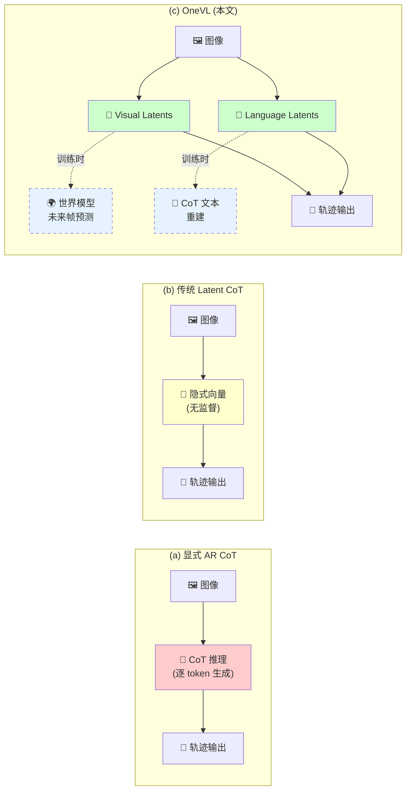
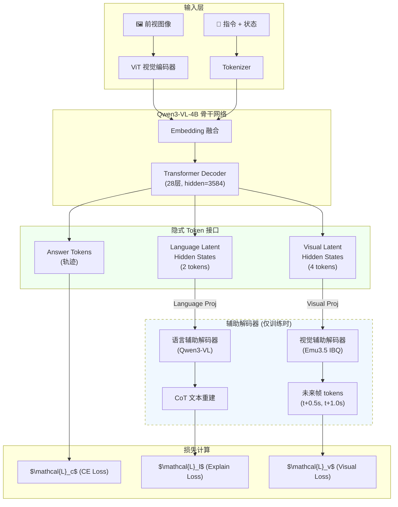
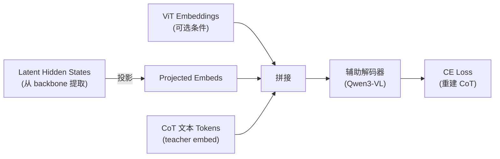
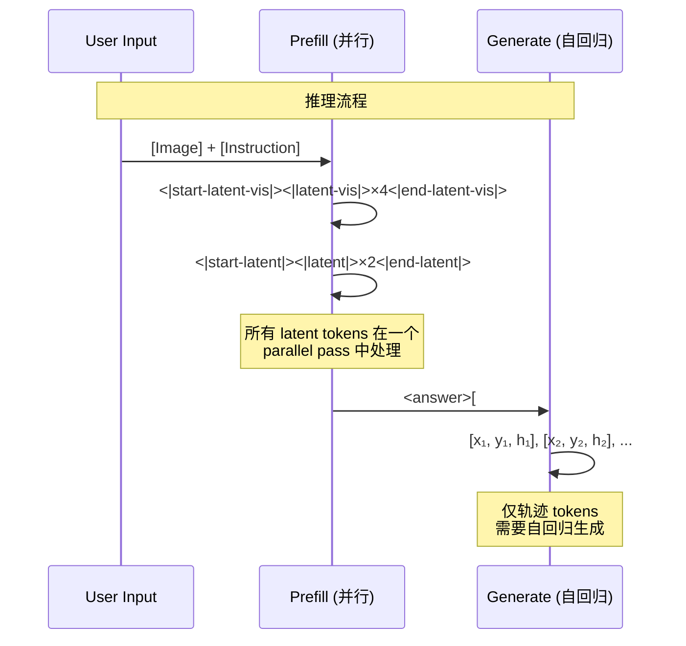
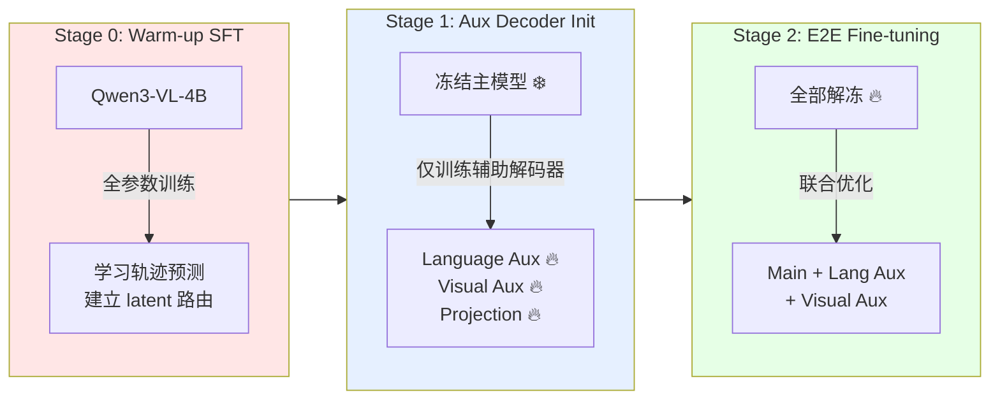
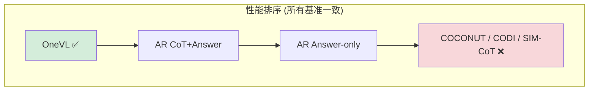
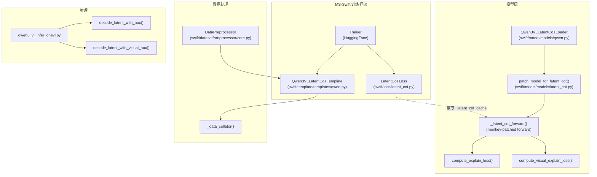
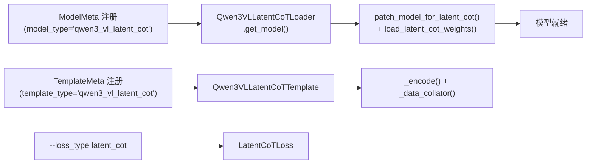
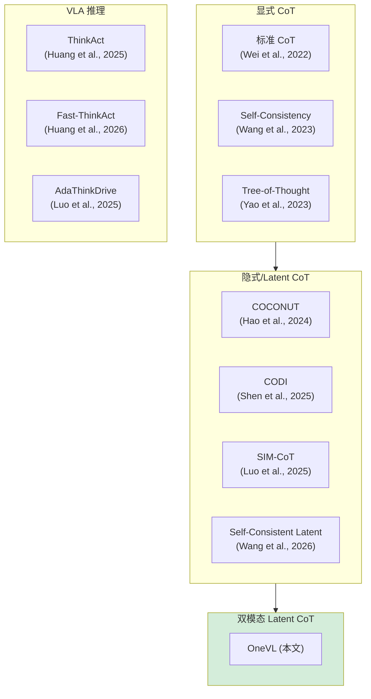

# OneVL: One-Step Latent Reasoning and Planning with Vision-Language Explanation

> **论文深度解读 — 结合代码库的全面分析**
>
> 论文: [arXiv 2604.18486](https://arxiv.org/abs/2604.18486) | 项目主页: [OneVL](https://xiaomi-embodied-intelligence.github.io/OneVL/) | 代码: [OneVL_training](https://github.com/GeorgeLuImmortal/OneVL_training)
>
> 作者: 小米具身智能团队 (Jinghui Lu, Jiayi Guan, Zhijian Huang 等 50+ 位作者)

---

## 目录

1. [引言与动机](#1-引言与动机)
2. [方法详解](#2-方法详解)
3. [三阶段训练流水线](#3-三阶段训练流水线)
4. [数据格式与处理](#4-数据格式与处理)
5. [实验结果与分析](#5-实验结果与分析)
6. [代码架构全景](#6-代码架构全景)
7. [相关工作与对比](#7-相关工作与对比)
8. [局限性与展望](#8-局限性与展望)
9. [核心洞察总结](#9-核心洞察总结)

---

## 1. 引言与动机

### 1.1 问题背景: CoT 推理在自动驾驶中的困境

Chain-of-Thought (CoT) 推理已成为大语言模型 (LLM) 提升复杂推理能力的核心技术。在自动驾驶的 Vision-Language-Action (VLA) 范式中, 显式 CoT 让模型先分析场景 (车道边界、周围车辆、交通信号), 再输出轨迹规划, 显著提升了规划质量。

然而, **自回归 (AR) 生成 CoT 文本引入了严重的推理延迟**, 使实时部署变得不切实际:

| 方法 | NAVSIM 延迟 | 性质 |
|------|-----------|------|
| AR Answer-only | 4.49s | 快但性能受限 |
| AR CoT+Answer | 6.58s | 准确但太慢 (多 47%) |
| **OneVL** | **4.46s** | **又快又准** |

这构成了一个经典的 **速度-质量困境**: 显式 CoT 带来性能提升但引入延迟, Answer-only 快但缺乏推理能力。

### 1.2 现有 Latent CoT 方法为何失败

为解决这一困境, 研究者提出了 Latent CoT — 将推理过程压缩到隐式向量中, 避免逐 token 生成。代表方法包括:

- **COCONUT** (Hao et al., 2024): 将 CoT 推理压缩到 continuous thought tokens
- **CODI** (Shen et al., 2025): 使用 distillation 将显式推理蒸馏到隐式表示
- **SIM-CoT** (Luo et al., 2025): 通过 simulation 学习隐式推理

但这些方法在自动驾驶任务上 **持续低于甚至显式 CoT 和 Answer-only 基线**:

| 方法 | NAVSIM PDM↑ | 相比 AR Answer |
|------|------------|---------------|
| AR Answer | 87.47 | baseline |
| COCONUT | 84.84 | -2.63 |
| CODI | 83.92 | -3.55 |
| SIM-CoT | 84.21 | -3.26 |

### 1.3 OneVL 的核心洞察

OneVL 论文提出了一个深刻的观察:

> **"纯语言的隐式表示压缩的是世界的符号抽象, 而非驱动行驶的因果动力学。"**
>
> *"A latent vector that compresses only language is merely compressing an abstraction of the world, not the underlying physical structure."*

这个洞察可以类比信息论中的 **率失真理论 (Rate-Distortion Theory)**:

$$D(R) = \min_{p(\hat{x}|x): I(X;\hat{X}) \leq R} \mathbb{E}[d(X, \hat{X})]$$

传统 Latent CoT 的压缩目标 (语言) 与下游任务 (物理世界中的轨迹规划) 之间存在 **语义鸿沟 (semantic gap)** — 语言描述了"转弯"、"减速"等抽象概念, 但丢失了道路几何演变、agent 运动模式等 **因果结构**。

OneVL 的解决方案: **引入视觉世界模型作为额外的压缩目标**, 迫使隐式表示同时编码语言语义和物理因果, 从而获得更有意义的压缩。

### 1.4 三种 CoT 范式对比



关键区别:
- **(a)** 可解释但慢 — 每个 CoT token 都需要自回归生成
- **(b)** 快但性能差 — 隐式向量缺乏有效监督, 无法编码有意义的信息
- **(c) OneVL** 快且准 — 双模态辅助解码器提供语义+物理双重监督, 推理时丢弃解码器, latent tokens 通过 prefill 一次性并行处理

---

## 2. 方法详解

### 2.1 整体架构



OneVL 在 **Qwen3-VL-4B-Instruct** (约 40 亿参数的视觉语言模型) 基础上, 通过 **monkey-patching** 方式添加了双模态辅助解码器。代码中采用了一种优雅的设计: 不修改原始模型类, 而是通过 `MethodType` 替换 forward 方法:

```python
# swift/model/models/latent_cot.py:764-765
model._origin_forward_for_latent_cot = model.forward
model.forward = MethodType(_latent_cot_forward, model)
```

### 2.2 双模态隐式 Token 接口

#### 2.2.1 Token 设计

OneVL 定义了 6 个特殊 token, 分为视觉和语言两组:

```python
# swift/model/models/latent_cot.py:26-31
LATENT_TOKEN = '<|latent|>'
START_LATENT_TOKEN = '<|start-latent|>'
END_LATENT_TOKEN = '<|end-latent|>'
LATENT_VIS_TOKEN = '<|latent-vis|>'
START_LATENT_VIS_TOKEN = '<|start-latent-vis|>'
END_LATENT_VIS_TOKEN = '<|end-latent-vis|>'
```

在 assistant response 中, 这些 token 的排列方式为:

```
<|start-latent-vis|><|latent-vis|>×4<|end-latent-vis|><|start-latent|><|latent|>×2<|end-latent|><answer>...</answer>
```

这种设计形成了一个 **信息瓶颈 (Information Bottleneck)**: 模型必须将整个驾驶场景的理解压缩到仅 6 个 token 的隐空间中。根据信息瓶颈原理 (Tishby et al., 2000):

$$\min_{p(z|x)} \left[ I(X; Z) - \beta \cdot I(Z; Y) \right]$$

其中 $X$ 是输入 (图像+指令), $Z$ 是 latent tokens, $Y$ 是下游任务 (轨迹预测)。较少的 token 数量增大了 $I(X;Z)$ 的压力, 迫使模型只保留 **与因果推理最相关的信息**, 从而提升泛化能力。

#### 2.2.2 两种 Tokenization 模式

代码支持两种 latent token 的处理模式, 通过 `LatentCoTConfig` 控制:

```python
# swift/model/models/latent_cot.py:39-57
@dataclass
class LatentCoTConfig:
    c_thought: int = 2                    # 语言 latent token 数
    c_thought_visual: int = 2             # 视觉 latent token 数
    use_original_vocab: bool = False      # 是否使用原始词表模式
    tokens_as_special: bool = True        # 是否作为 special token 添加
    use_separate_visual_latent_tokens: bool = False  # 分离文本/视觉 latent
    latent_use_all_subtokens: bool = False  # 使用所有子 token 进行 mask
    ...
```

**模式 1: Special Token 模式** (`use_original_vocab=False`)

直接向 tokenizer 添加新的 special tokens, 每个 latent marker 对应一个唯一的 token ID:

```python
# swift/model/models/latent_cot.py:59-67
def add_latent_tokens_to_tokenizer(processor, as_special_tokens=True):
    tokenizer = processor.tokenizer if hasattr(processor, 'tokenizer') else processor
    existing_tokens = set(tokenizer.get_vocab().keys())
    new_tokens = [t for t in LATENT_SPECIAL_TOKENS if t not in existing_tokens]
    if new_tokens:
        tokenizer.add_tokens(new_tokens, special_tokens=as_special_tokens)
```

**模式 2: 原始词表模式** (`use_original_vocab=True`)

不添加新 token, 而是利用 tokenizer 对 `<|latent|>` 字符串的自然分词结果 (如 `|`, `latent`, `|`) 进行 **模式匹配** 来定位 latent 区域。这避免了词表碎片化:

```python
# swift/model/models/latent_cot.py:537-549
def find_latent_positions_from_pattern(ids_list, latent_keyword_id, pipe_id):
    """通过 | latent | 子 token 模式查找 <|latent|> 的位置"""
    positions = []
    n = len(ids_list)
    for i in range(1, n - 1):
        if (ids_list[i] == latent_keyword_id          # 'latent' 关键词
                and ids_list[i - 1] == pipe_id         # 左边的 '|'
                and ids_list[i + 1] == pipe_id):       # 右边的 '|'
            positions.append(i)
    return positions
```

视觉 latent 的模式略有不同 — `<|latent-vis|>` 被匹配为 `| latent -vis`:

```python
# swift/model/models/latent_cot.py:621-633
def find_visual_latent_positions_from_pattern(ids_list, latent_keyword_id, pipe_id, vis_suffix_id):
    """通过 | latent -vis 模式查找 <|latent-vis|> 的位置"""
    for i in range(1, n - 1):
        if (ids_list[i] == latent_keyword_id
                and ids_list[i - 1] == pipe_id
                and ids_list[i + 1] == vis_suffix_id):  # '-vis' 后缀
            positions.append(i)
```

实际训练脚本中使用的是 **原始词表模式** 加上 **所有子 token** 的完整配置:

```bash
# run_script/train/navsim/sft_distributed_stage1_vis4_txt2_bs64.sh
export LATENT_COT_USE_ORIGINAL_VOCAB=true
export LATENT_COT_LATENT_USE_ALL_SUBTOKENS=true
export LATENT_COT_USE_SEPARATE_VISUAL_LATENT_TOKENS=true
```

### 2.3 语言辅助解码器

语言辅助解码器的目标是从 language latent 的 hidden states 中 **重建完整的 CoT 推理文本**。这确保了 latent tokens 编码了语义推理信息。

#### 2.3.1 投影层

由于基础模型和辅助解码器的 hidden size 可能不同, 需要通过投影层对齐:

```python
# swift/model/models/latent_cot.py:725-731
latent_proj = nn.Sequential(
    nn.Linear(base_hidden_size, base_hidden_size),   # 3584 → 3584
    nn.GELU(),                                        # 非线性激活
    nn.Linear(base_hidden_size, aux_hidden),           # 3584 → aux_hidden
    nn.LayerNorm(aux_hidden),                          # 层归一化
)
```

这是一个标准的 MLP 投影器, 结构上类似于 LLaVA 中的视觉投影器, 但这里的作用是将 backbone 的隐状态映射到辅助解码器的输入空间。

#### 2.3.2 损失计算

`compute_explain_loss()` 是语言辅助解码器的核心。其计算流程:



关键代码逻辑 (`swift/model/models/latent_cot.py:222-328`):

1. **提取 latent hidden states**: 从 backbone 最后一层获取 latent 位置的隐状态
2. **投影**: 通过 `latent_proj` 映射到辅助解码器空间
3. **构建输入序列**: `[ViT embeddings (可选)] + [latent embeds] + [CoT text embeds]`
4. **前向传播**: 通过辅助解码器获取 logits
5. **计算 CE loss**: 对 CoT 文本部分计算交叉熵, 忽略前缀 (label = -100)

```python
# swift/model/models/latent_cot.py:286-303
parts = []
if vis_embeds is not None:
    parts.append(vis_embeds)           # ViT 视觉条件
parts.append(latent_embeds)            # 投影后的 latent embeddings
parts.append(step_embeds)             # CoT 文本的 embeddings
combined_embeds = torch.cat(parts, dim=0).unsqueeze(0)

# 只在 CoT 文本部分计算 loss
prefix_len = n_vis + len(latent_positions)
labels_explain = torch.full((1, combined_embeds.shape[1]), -100, ...)
labels_explain[0, prefix_len:] = step_tensor  # 仅 CoT 文本有 label
```

损失公式:

$$\mathcal{L}_l = -\frac{1}{|\mathcal{T}|} \sum_{t \in \mathcal{T}} \log p_{\text{aux}}(w_t | \mathbf{z}_l, \mathbf{v}_{\text{ViT}}, w_{<t})$$

其中 $\mathbf{z}_l$ 是投影后的 language latent embeddings, $\mathbf{v}_{\text{ViT}}$ 是可选的 ViT 视觉条件, $w_t$ 是 CoT 文本的第 $t$ 个 token, $\mathcal{T}$ 是有效 token 集合。

### 2.4 视觉辅助解码器 (世界模型)

视觉辅助解码器是 OneVL 最关键的创新 — 它将 latent tokens 的监督从语言抽象扩展到 **物理世界的因果动力学**。

#### 2.4.1 未来帧表示

使用 **Emu3.5 IBQ (Index Backpropagation Quantization) 视觉 tokenizer**, 将未来帧图像编码为离散 visual tokens:

- **码本大小**: 131,072 个离散视觉码 (约 $2^{17}$)
- **预测时间点**: $t+0.5s$ 和 $t+1.0s$ 两帧
- **分辨率**: 每帧 $12 \times 21 = 252$ 个 token

在训练数据中, 这些 token 以特殊格式存储:

```
<|image start|>12*21<|image token|><|visual token 079275|><|visual token 126958|>...
```

#### 2.4.2 损失计算

`compute_visual_explain_loss()` 的结构与语言版本对称 (`swift/model/models/latent_cot.py:331-423`):

```python
# 构建输入: [ViT条件(可选)] + [visual latent embeds] + [future frame token embeds]
parts = []
if vis_embeds is not None:
    parts.append(vis_embeds)
parts.append(latent_embeds)          # 投影后的 visual latent embeddings  
parts.append(target_embeds)          # 未来帧 visual tokens 的 embeddings
combined_embeds = torch.cat(parts, dim=0).unsqueeze(0)
```

损失公式:

$$\mathcal{L}_v = -\frac{1}{|\mathcal{V}|} \sum_{i \in \mathcal{V}} \log p_{\text{vis-aux}}(v_i | \mathbf{z}_v, \mathbf{v}_{\text{ViT}}, v_{<i})$$

其中 $\mathbf{z}_v$ 是投影后的 visual latent embeddings, $v_i$ 是未来帧的第 $i$ 个 visual token。

**为什么视觉监督比语言监督更重要?** 消融实验给出了定量答案:

| 移除组件 | PDM-score 下降 |
|---------|--------------|
| 移除视觉解码器 | -0.87 |
| 移除语言解码器 | -0.31 |

视觉解码器的贡献约为语言解码器的 **2.8 倍**。这验证了论文的核心论点: 对物理因果的压缩比对语言抽象的压缩更有价值。

直觉上, 预测 $t+0.5s$ 和 $t+1.0s$ 的未来帧迫使 latent tokens 编码:
- **道路几何的演变** (弯道、车道变化)
- **其他 agent 的运动预测** (前车加速/减速)
- **场景的三维结构** (透视变化)

这些信息正是安全轨迹规划所必需的因果知识。

### 2.5 总损失函数

训练时的总损失由三部分组成:

$$\mathcal{L} = \mathcal{L}_c + \lambda_l \cdot \mathcal{L}_l + \lambda_v \cdot \mathcal{L}_v$$

其中:
- $\mathcal{L}_c$: 主模型的 CE loss (轨迹 token 的自回归预测)
- $\mathcal{L}_l$: 语言辅助解码器 loss, $\lambda_l = 1.0$
- $\mathcal{L}_v$: 视觉辅助解码器 loss, $\lambda_v = 0.1$

注意 $\lambda_v$ 设为 0.1 而非 1.0 — 这是因为视觉 token 序列远长于 CoT 文本 (每帧 252 个 token × 2 帧 = 504 个 token), 较低的权重避免了视觉 loss 主导训练。

代码中的实现 (`swift/loss/latent_cot.py:30-78`):

```python
class LatentCoTLoss(BaseLoss):
    def __call__(self, outputs, labels, *, num_items_in_batch=None, **kwargs):
        # 从模型缓存中取出辅助 losses
        cache = getattr(raw_model, '_latent_cot_cache', None)
        explain_loss = cache.get('explain_loss', torch.tensor(0.0))
        visual_explain_loss = cache.get('visual_explain_loss', torch.tensor(0.0))
        
        # 计算主 CE loss
        student_ce_loss = per_token.sum() / num_items_in_batch
        
        # 按 micro-batch 比例缩放辅助 losses
        batch_weight = n_valid.float() / num_items_in_batch
        total_loss = student_ce_loss + explain_loss * batch_weight + visual_explain_loss * batch_weight
```

值得注意的是, 辅助 losses 通过 `batch_weight` 进行了 micro-batch 级别的缩放, 这是因为 HuggingFace Trainer 在使用自定义 `compute_loss_func` 时不会自动除以 `gradient_accumulation_steps`。

### 2.6 ViT 视觉条件机制

OneVL 的一个精妙设计是: 辅助解码器可以 **以 ViT 处理后的视觉 embeddings 为条件**, 而不仅仅依赖 latent hidden states。这通过一个 forward pre-hook 实现:

```python
# swift/model/models/latent_cot.py:929-937
def _capture_vit_embeds_hook(module, args, kwargs):
    ie = kwargs.get('inputs_embeds')
    if ie is not None:
        self._captured_vit_embeds = ie.detach()
    return None

_lm = getattr(getattr(self, 'model', None), 'language_model', None)
if _lm is not None:
    _vit_hook_handle = _lm.register_forward_pre_hook(
        _capture_vit_embeds_hook, with_kwargs=True)
```

这个 hook 在 language model 的 forward 之前捕获 `inputs_embeds` — 此时 ViT 已经将图像编码并注入到 token embeddings 中, 因此捕获到的是 **ViT 处理后的完整 embedding 序列**。

随后, 通过 `_extract_visual_embeds()` 提取 image token 位置的 embeddings:

```python
# swift/model/models/latent_cot.py:141-149
def _extract_visual_embeds(student_embeds, batch_idx, input_ids, image_token_id, ...):
    vis_mask = (input_ids[batch_idx] == image_token_id)
    if not vis_mask.any():
        return None
    return student_embeds[batch_idx][vis_mask]
```

提取出的 ViT embeddings 作为前缀拼接在 latent embeddings 之前, 为辅助解码器提供丰富的视觉上下文:

$$\text{input} = [\underbrace{\mathbf{v}_1, ..., \mathbf{v}_n}_{\text{ViT embeddings}}, \underbrace{\mathbf{z}_1, ..., \mathbf{z}_k}_{\text{latent embeddings}}, \underbrace{\mathbf{w}_1, ..., \mathbf{w}_m}_{\text{target embeddings}}]$$

这种设计的意义在于: ViT embeddings 提供了高分辨率的当前场景信息, 辅助解码器可以将其与 latent states 中的压缩信息结合, 更好地重建 CoT 文本或预测未来帧。

### 2.7 Prefill 推理

**推理时, 所有辅助解码器被完全丢弃。** Latent tokens 通过 **prefill** 一次性并行处理, 只有后续的轨迹 tokens 需要自回归生成。



推理脚本 (`run_script/infer/qwen3_vl_infer_onevl.py:711-719`) 构建 prefill 序列:

```python
if args.num_latent_vis > 0:
    latent_block = ("<|start-latent-vis|>" + "<|latent-vis|>" * args.num_latent_vis 
                   + "<|end-latent-vis|><|start-latent|>" + "<|latent|>" * args.num_latent 
                   + "<|end-latent|><answer>[")
```

推理时还支持 **坐标前缀 (coordinate prefill)**: 如果已知前 K 个 ground-truth waypoints, 可以将其预填充到答案前缀中, 类似于 constrained decoding:

```python
if args.prefix_k > 0:
    pts = parse_gt_waypoints(gt_src)
    prefix_piece = format_gt_prefix_points(pts[:k])
    text += prefix_piece  # 如 "[582, 963], [573, 942],"
```

此外, 推理脚本还支持 **可选的辅助解码**, 用于可解释性分析:
- `--decoder_explain`: 使用语言辅助解码器从 latent states 解码 CoT 文本
- `--visual_decoder_explain`: 使用视觉辅助解码器解码未来帧 tokens

解码过程采用 **贪心自回归生成** (非训练时的 teacher-forcing):

```python
# swift/model/models/latent_cot.py 中推理用的 decode_latent_with_aux()
for _ in range(max_explain_tokens):
    logits, past_kv = call_aux_decoder_lm(
        aux_decoder, cur_embeds, use_cache=True, past_key_values=past_kv)
    next_id = logits[:, -1, :].argmax(dim=-1)  # greedy
    if next_id.item() == tokenizer.eos_token_id:
        break
```

---

## 3. 三阶段训练流水线

OneVL 采用 **渐进式对齐 (Progressive Alignment)** 策略, 将训练分为三个阶段。论文强调这是 **绝对必要的** — 消融实验显示直接端到端训练导致性能从 88.84 崩溃到 67.13 (下降 21.71 分)。



### Stage 0: Warm-up SFT

**目的**: 让基础模型学会轨迹预测任务, 建立 latent tokens 的信息路由路径。

```bash
# run_script/train/navsim/sft_distributed_stage0_vis4_txt2_bs64.sh
--model_type qwen3_vl            # 标准 SFT, 无 latent CoT
--train_type full                 # 全参数训练
--learning_rate 4e-5
--num_train_epochs 2
--per_device_train_batch_size 2
--deepspeed zero2
```

此阶段使用标准 `qwen3_vl` 模型类型 (非 `qwen3_vl_latent_cot`), 但数据中已包含 latent token markers, 模型学会在这些位置建立有意义的中间表示。

### Stage 1: Auxiliary Decoder Initialization

**目的**: 在主模型 frozen 的情况下, 训练辅助解码器学会从 latent hidden states 中解码。

```bash
# run_script/train/navsim/sft_distributed_stage1_vis4_txt2_bs64.sh
--model_type qwen3_vl_latent_cot  # 启用 latent CoT 架构
--template qwen3_vl_latent_cot
--learning_rate 1e-4               # 较高学习率, 因为从头训练解码器
--num_train_epochs 1
--freeze_vit true
--freeze_llm true                  # 冻结 backbone
--freeze_aligner true

# 冻结控制
export LATENT_COT_FREEZE_MAIN_MODEL=true    # ❄️ 主模型冻结
export LATENT_COT_FREEZE_AUX_DECODER=false  # 🔥 语言辅助解码器可训练
export LATENT_COT_FREEZE_VISUAL_AUX_DECODER=false  # 🔥 视觉辅助解码器可训练
```

这个阶段的关键设计: **不改变主模型的 latent representations**, 只让辅助解码器适应已有的表示。如果同时训练主模型和辅助解码器, 会出现 **梯度震荡 (gradient shock)** — 两个组件互相拉扯, 导致训练不稳定。

冻结逻辑在 `apply_latent_cot_freeze()` 中实现 (`swift/model/models/latent_cot.py:771-804`):

```python
def apply_latent_cot_freeze(model):
    config = getattr(model, '_latent_cot_config', None)
    if config.freeze_main_model:
        for name, param in model.named_parameters():
            if not name.startswith('_latent_cot_'):  # 保留辅助模块可训练
                param.requires_grad = False
```

### Stage 2: End-to-End Fine-tuning

**目的**: 解冻所有组件, 让辅助解码器的梯度回传到主模型, 形成良性循环。

```bash
# run_script/train/navsim/sft_distributed_stage2_vis4_txt2_bs64.sh
--num_train_epochs 5               # 更多 epochs
--freeze_vit false
--freeze_llm false                  # 解冻 backbone
--freeze_aligner false

export LATENT_COT_FREEZE_MAIN_MODEL=false   # 🔥 全部解冻
export LATENT_COT_FREEZE_AUX_DECODER=false  # 🔥
export LATENT_COT_FREEZE_VISUAL_AUX_DECODER=false  # 🔥
```

在这个阶段, 辅助解码器的梯度通过投影层和 latent positions 传回主模型:

$$\frac{\partial \mathcal{L}}{\partial \theta_{\text{main}}} = \frac{\partial \mathcal{L}_c}{\partial \theta_{\text{main}}} + \lambda_l \frac{\partial \mathcal{L}_l}{\partial \mathbf{z}_l} \cdot \frac{\partial \mathbf{z}_l}{\partial \theta_{\text{main}}} + \lambda_v \frac{\partial \mathcal{L}_v}{\partial \mathbf{z}_v} \cdot \frac{\partial \mathbf{z}_v}{\partial \theta_{\text{main}}}$$

辅助解码器的梯度信号 "教导" 主模型在 latent positions 产生更好的隐状态, 主模型产生更好的隐状态又使辅助解码器能更好地重建 — 形成 **双向强化的良性循环**。

### 为什么三阶段训练如此重要?

| 配置 | PDM-score | 与完整版差距 |
|------|----------|------------|
| OneVL (完整三阶段) | **88.84** | — |
| 跳过分阶段, 直接端到端 | 67.13 | **-21.71** |

下降 21.71 分是灾难性的。原因分析:

1. **优化目标冲突**: 主模型想学习好的轨迹预测, 辅助解码器想学习好的 CoT/未来帧重建。初始阶段两者的梯度方向不一致, 互相干扰。
2. **表示基础缺失**: 辅助解码器需要有意义的 latent states 来训练, 但未经预训练的主模型产生的 latent states 是随机的。
3. **学习率不匹配**: 主模型是大型预训练模型 (需要较小学习率), 辅助解码器是从头初始化的 (需要较大学习率)。分阶段训练自然解决了这个问题。

这种渐进式训练策略在深度学习中有悠久的历史 — 从 Hinton 等人的 **逐层预训练** (2006) 到 CLIP 的 **两阶段对齐**, 本质上都是通过分阶段锁定不同组件来稳定联合优化。

---

## 4. 数据格式与处理

### 4.1 JSONL 数据结构

每条训练样本包含四个关键字段:

```json
{
  "messages": [
    {"role": "user", "content": "<image> is the front view. Command: MOVE FORWARD. Velocity: [9.05, -0.2]. ..."},
    {"role": "assistant", "content": "<|start-latent-vis|><|latent-vis|>×4<|end-latent-vis|><|start-latent|><|latent|>×2<|end-latent|><answer>[4.42, -0.01, 0.0], ...</answer>"}
  ],
  "images": ["path/to/front_camera.jpg"],
  "think_steps": "右侧车道边界靠近不可通行区域, 需稍向左行驶. 前方18.28米处有一辆同向快速行驶的车辆...",
  "future_image_tokens": "<|image start|>12*21<|image token|><|visual token 079275|>..."
}
```

| 字段 | 类型 | 说明 |
|------|------|------|
| `messages` | 对话格式 | 用户指令 + assistant 的 latent+answer 响应 |
| `images` | 图像路径 | 前视摄像头图像 |
| `think_steps` | 纯文本 | CoT 推理的 ground truth (语言辅助解码器的监督信号) |
| `future_image_tokens` | IBQ tokens | 未来帧的离散视觉 tokens (视觉辅助解码器的监督信号) |

用户指令的结构化输入包括:
- **导航命令**: `MOVE FORWARD` / `TURN RIGHT` / `TURN LEFT`
- **当前速度**: `Velocity: [vx, vy]` (m/s)
- **当前加速度**: `Acceleration: [ax, ay]` (m/s²)
- **历史轨迹**: 过去 3 个时间步的 `[x, y, heading]`

### 4.2 Label Masking 机制

OneVL 模板 (`Qwen3VLLatentCoTTemplate`) 的核心职责之一是 **将 latent token 位置的 label 设为 -100**, 使其不参与主模型的 CE loss 计算:

```python
# swift/template/templates/qwen.py:574-602
def _encode(self, inputs):
    encoded = super()._encode(inputs)
    input_ids = encoded['input_ids']
    labels = encoded.get('labels')
    
    if labels is not None and not latent_ce_loss:
        tokenizer = self.tokenizer
        probe_id = tokenizer.convert_tokens_to_ids('<|latent|>')
        
        if probe_id != tokenizer.unk_token_id:
            # Special token 模式: 直接匹配 token ID
            latent_ids = set()
            for tok in self.LATENT_TOKENS:
                tid = tokenizer.convert_tokens_to_ids(tok)
                if tid != tokenizer.unk_token_id:
                    latent_ids.add(tid)
            for i, tid in enumerate(input_ids):
                if tid in latent_ids:
                    labels[i] = -100
        else:
            # 原始词表模式: 通过模式匹配找到 latent 区域并 mask
            self._mask_latent_region_by_pattern(input_ids, labels, tokenizer)
```

**为什么要 mask latent tokens?** 因为 latent tokens 没有"正确答案" — 它们是模型自由学习的中间表示。如果对其计算 CE loss, 模型会被迫预测固定的 token ID (如 `<|latent|>`), 这没有意义且会干扰学习。

但有一个例外: 当 `LATENT_COT_LATENT_CE_LOSS=true` 时, latent tokens **也**参与 CE loss 计算。这在 Stage 1 中使用, 目的是让主模型学会在 latent positions 产生稳定的 token 预测, 为辅助解码器提供可靠的输入。

### 4.3 Data Collator 透传

`think_steps` 和 `future_image_tokens` 是非标准字段, 需要特殊处理才能通过 DataLoader 传递给模型:

```python
# swift/template/templates/qwen.py:623-632
def _data_collator(self, batch, *, padding_to=None):
    latent_fields = {}
    for key in ('think_steps', 'future_image_tokens'):
        values = [b.pop(key, None) for b in batch]  # 先提取
        if any(v is not None for v in values):
            latent_fields[key] = values
    
    res = super()._data_collator(batch, padding_to=padding_to)  # 标准 collate
    res.update(latent_fields)  # 重新注入
    return res
```

这种 "先弹出, 标准处理, 再注入" 的模式避免了在 padding/stacking 时对字符串类型字段的处理问题 — `think_steps` 和 `future_image_tokens` 是文本字符串, 不能进行 tensor 拼接。

### 4.4 数据预处理脚本

项目提供了两个数据转换脚本:

1. **`scripts/convert_navsim_to_latent_cot.py`**: 将原始 NAVSIM 数据转换为 latent CoT 格式
   - 提取 `<think>...</think>` 块作为 `think_steps`
   - 将 `<answer>...</answer>` 保留为答案
   - 生成可配置数量的 latent token markers

2. **`scripts/gen_navsim_latent_datasets.py`**: 批量生成不同 latent token 数量的数据集变体
   - 使用流式处理 (streaming) 以节省内存

---

## 5. 实验结果与分析

### 5.1 四大基准测试

OneVL 在 4 个自动驾驶轨迹预测基准上均取得了 SOTA:

#### NAVSIM (PDM-score ↑)

| 方法 | 模型大小 | PDM-score | 延迟 (s) | 可解释性 |
|------|---------|-----------|---------|---------|
| AdaThinkDrive | 8B | 86.20 | — | Language |
| LaST-VLA | 8B | 87.30 | — | — |
| AR Answer | 4B | 87.47 | 4.49 | — |
| AR CoT+Answer | 4B | 88.29 | 6.58 | Language |
| COCONUT | 4B | 84.84 | 5.93 | — |
| CODI | 4B | 83.92 | 8.62 | — |
| SIM-CoT | 4B | 84.21 | 10.86 | Language |
| **OneVL** | **4B** | **88.84** | **4.46** | **Vision+Language** |

要点:
- 4B 参数的 OneVL **超越了 8B 的 AdaThinkDrive 和 LaST-VLA**
- 延迟 4.46s 与 Answer-only (4.49s) **基本相同**, 甚至略快
- 比 AR CoT 快 **32%** (4.46 vs 6.58)

#### ROADWork (ADE/FDE ↓, 像素)

| 方法 | ADE (px) | FDE (px) | 延迟 (s) |
|------|---------|---------|---------|
| YNet (prior SOTA) | 22.68 | 80.78 | — |
| AR CoT+Answer | 13.18 | 29.98 | 10.74 |
| **OneVL** | **12.49** | **28.80** | **4.71** |

比 AR CoT 快 **2.3×**, 同时精度更高。

#### Impromptu (ADE/FDE ↓, 米)

| 方法 | ADE (m) | FDE (m) | 延迟 (s) |
|------|--------|--------|---------|
| AR CoT+Answer | 1.42 | 3.96 | 6.84 |
| **OneVL** | **1.34** | **3.70** | **4.02** |

比 AR CoT 快 **41%**。

#### Alpamayo-R1 (ADE/FDE ↓, 米)

| 方法 | ADE (m) | FDE (m) | 延迟 (s) |
|------|--------|--------|---------|
| Cosmos-Reason (RL-tuned) | 2.86 | **7.42** | — |
| AR CoT+Answer | 2.99 | 8.54 | 3.51 |
| **OneVL** | **2.62** | 7.53 | **3.23** |

ADE 最优, FDE 与使用 RL 微调的 Cosmos-Reason 接近。

### 5.2 跨基准一致性分析

一个关键观察: **所有先前的 latent CoT 方法在四个基准上都低于 AR Answer-only 基线**, 而 OneVL 在所有基准上都超越了 AR CoT。



这说明 OneVL 的优势不是针对特定数据集的过拟合, 而是 **方法层面的根本改进**。

### 5.3 消融研究

| 配置 | PDM-score | 变化 |
|------|----------|------|
| **OneVL (完整)** | **88.84** | — |
| 去掉语言辅助解码器 | 88.53 | -0.31 |
| 去掉视觉辅助解码器 | 87.97 | -0.87 |
| 去掉三阶段训练 | 67.13 | **-21.71** |

三个关键发现:

1. **视觉辅助解码器 > 语言辅助解码器** (0.87 vs 0.31): 世界模型监督的贡献是语言监督的 2.8 倍
2. **两者互补**: 同时使用时 (0.87 + 0.31 ≈ 1.18 < 实际增益), 说明两者编码了不同维度的信息
3. **三阶段训练是基石**: 移除后性能灾难性下降, 说明稳定的训练流程对信息压缩至关重要

### 5.4 CoT 文本质量

| 方法 | Meta Action Acc.↑ | STS Score↑ | LLM Judge↑ | 平均↑ | 延迟 (s) |
|------|------------------|-----------|-----------|------|---------|
| AR CoT+Answer | **73.20** | **79.75** | **81.86** | **78.27** | 6.58 |
| SIM-CoT | 67.20 | 76.25 | 78.73 | 74.06 | 10.86 |
| **OneVL** (lang. aux.) | 71.00 | 78.26 | 79.13 | 76.13 | **4.46** |

OneVL 恢复了 AR CoT **97.3%** 的文本质量 (76.13/78.27), 同时速度快了 47%。这意味着 latent tokens 确实保留了大部分语义推理信息。

### 5.5 MLP 轻量级变体

论文还提出了一个面向实际部署的 **MLP 头** 变体:

| 配置 | PDM-score | 延迟 | 推理频率 | 相对 AR 延迟 |
|------|----------|------|---------|------------|
| AR CoT+Answer | 88.29 | 6.58s | 0.15 Hz | 100% |
| OneVL (完整) | 88.84 | 4.46s | 0.22 Hz | 67.8% |
| **OneVL (MLP)** | **86.83** | **0.24s** | **4.16 Hz** | **5.4%** |

MLP 变体以仅 **5.4% 的 AR CoT 延迟** 达到 86.83 的 PDM-score, 满足实时驾驶的 4 Hz 需求。这展示了 OneVL 的 latent supervision 即使在极端压缩的 MLP 架构下也能提供有效的特征表示。

---

## 6. 代码架构全景

### 6.1 模块依赖关系



### 6.2 关键文件索引

| 文件 | 职责 | 核心组件 |
|------|------|---------|
| `swift/model/models/latent_cot.py` | 模型补丁与前向传播 | `LatentCoTConfig`, `patch_model_for_latent_cot()`, `_latent_cot_forward()`, `compute_explain_loss()`, `compute_visual_explain_loss()` |
| `swift/loss/latent_cot.py` | 损失计算 | `LatentCoTLoss` — 整合 CE + 语言辅助 + 视觉辅助 loss |
| `swift/template/templates/qwen.py` | 数据模板 | `Qwen3VLLatentCoTTemplate` — label masking, data collator |
| `swift/model/models/qwen.py` | 模型注册 | `Qwen3VLLatentCoTLoader` — 环境变量读取, 模型初始化 |
| `swift/dataset/preprocessor/core.py` | 数据预处理 | `_extra_passthrough_keys` — think_steps 透传 |
| `run_script/infer/qwen3_vl_infer_onevl.py` | 推理流水线 | 完整的 prefill + generate + aux decode |
| `run_script/train/navsim/*.sh` | 训练脚本 | Stage 0/1/2 的超参数配置 |

### 6.3 环境变量配置体系

OneVL 通过环境变量控制几乎所有 latent CoT 参数, 这种设计使得 **训练配置完全在 shell 脚本层面**, 无需修改 Python 代码:

| 环境变量 | 默认值 | 说明 |
|---------|-------|------|
| `LATENT_COT_C_THOUGHT` | 2 | 语言 latent token 数 |
| `LATENT_COT_C_THOUGHT_VISUAL` | 4 (论文) / 2 (代码默认) | 视觉 latent token 数 |
| `LATENT_COT_AUX_MODEL_PATH` | None | 语言辅助解码器路径 |
| `LATENT_COT_VISUAL_AUX_MODEL_PATH` | None | 视觉辅助解码器路径 |
| `LATENT_COT_EXPLAIN_LOSS_WEIGHT` | 1.0 | $\lambda_l$ |
| `LATENT_COT_VISUAL_EXPLAIN_LOSS_WEIGHT` | 0.1 | $\lambda_v$ |
| `LATENT_COT_AUX_VISUAL_CONDITION` | false | 语言辅助解码器是否使用 ViT 条件 |
| `LATENT_COT_VISUAL_AUX_VISUAL_CONDITION` | false | 视觉辅助解码器是否使用 ViT 条件 |
| `LATENT_COT_USE_SEPARATE_VISUAL_LATENT_TOKENS` | false | 是否分离文本/视觉 latent |
| `LATENT_COT_FREEZE_MAIN_MODEL` | false | 冻结主模型 |
| `LATENT_COT_FREEZE_AUX_DECODER` | false | 冻结语言辅助解码器 |
| `LATENT_COT_FREEZE_VISUAL_AUX_DECODER` | false | 冻结视觉辅助解码器 |
| `LATENT_COT_USE_ORIGINAL_VOCAB` | false | 使用原始词表模式 |
| `LATENT_COT_LATENT_USE_ALL_SUBTOKENS` | false | 使用所有子 token |
| `LATENT_COT_LATENT_CE_LOSS` | false | latent token 是否计算 CE loss |

### 6.4 MS-Swift 集成架构

OneVL 训练代码基于 [MS-Swift](https://github.com/modelscope/ms-swift) 框架, 这是一个 ModelScope 维护的大模型训练框架。集成路径:



关键集成点:
- **模型注册**: 通过 `register_model()` 注册新的模型类型
- **模板注册**: 通过 `register_template()` 注册新的数据处理模板
- **损失注册**: 通过 `--loss_type latent_cot` 选择自定义损失函数
- **冻结控制**: 通过 `apply_latent_cot_freeze()` 在 ms-swift 的 `prepare_model` 之后应用 (避免被框架的 `requires_grad_(True)` 覆盖)

---

## 7. 相关工作与对比

### 7.1 CoT 推理方法谱系



### 7.2 与关键方法的对比

**COCONUT (Continuous Thought)**: 使用连续 thought tokens 替代离散 CoT, 但缺乏有效的监督信号。在 NAVSIM 上得分 84.84, 比 AR Answer (87.47) 低 2.63 分。核心问题: continuous thoughts 自由度过高, 无法收敛到有意义的表示。

**CODI (Compressed Distillation)**: 通过知识蒸馏将显式 CoT 压缩到隐式表示。但蒸馏过程中丢失了大量信息, 得分仅 83.92。论文认为: "蒸馏的目标仍然是语言, 因此面临同样的语义鸿沟问题。"

**SIM-CoT (Simulated CoT)**: 模拟显式 CoT 的推理过程但在隐空间中执行。延迟高达 10.86s (比 AR CoT 更慢!), 得分仅 84.21。问题: 模拟过程引入了额外的计算开销, 却没有获得更好的表示。

**ThinkAct / Fast-ThinkAct**: 使用 visual latent planning 的 VLA 推理方法, 但未引入世界模型监督。OneVL 通过视觉辅助解码器提供了更直接的因果压缩目标。

### 7.3 与世界模型的关系

OneVL 的视觉辅助解码器本质上是一个 **精简版世界模型**。与完整世界模型 (如 GAIA-1, DriveDreamer, Cosmos) 的关系:

| 维度 | 完整世界模型 | OneVL 视觉辅助解码器 |
|------|-----------|-------------------|
| 目标 | 生成高质量未来帧 | 提供因果压缩监督 |
| 输出 | 像素级图像 | 离散 visual tokens |
| 推理时角色 | 在线推理组件 | **完全丢弃** |
| 参数量 | 数十亿 | 与主模型共享架构 (~4B) |
| 核心价值 | 模拟未来场景 | 迫使 latent 编码因果结构 |

这是一种创新的 **"训练时世界模型"** 范式 — 世界模型不参与推理, 仅在训练时通过梯度信号塑造 latent 表示。

### 7.4 与 VLA 架构的定位

在更广泛的 VLA 架构谱系中:

- **RT-2** (Google DeepMind): 将动作直接作为 text tokens 生成, 但无推理能力
- **OpenVLA**: 开源 VLA 基线, 同样缺乏显式推理
- **AdaThinkDrive**: 使用 8B 模型 + 显式 CoT, 性能不如 4B 的 OneVL
- **OneVL**: 在 VLA 范式中首次实现 **"推理零成本"** — latent reasoning 不增加推理延迟

---

## 8. 局限性与展望

### 8.1 当前局限

1. **训练内存开销**: 训练时需要同时维护三个 ~4B 参数的模型实例 (主模型 + 语言辅助 + 视觉辅助), 内存约为标准训练的 **3 倍**。虽然 DeepSpeed ZeRO-2 可以缓解, 但仍是一个实际部署限制。

2. **单摄像头限制**: 当前仅使用前视摄像头图像。自动驾驶场景通常需要 6-8 个摄像头的 360° 覆盖。扩展到多摄像头会显著增加 visual token 数量和计算成本。

3. **经验性 Token 数量**: $C_t = 2$ (语言) 和 $C_v = 4$ (视觉) 的选择是经验性的。论文承认 "token 容量权衡的系统性探索留作未来工作"。

4. **轨迹仍为自回归生成**: 虽然 latent tokens 通过 prefill 消除了推理延迟, 但最终的 8 个轨迹 waypoints 仍然需要逐 token 自回归生成。

5. **视觉码本规模**: Emu3.5 IBQ 的 131,072 码字扩展了词表和训练复杂度。

6. **泛化性未充分验证**: 在极端天气、严重遮挡、传感器故障等边缘情况下的鲁棒性未经测试。

### 8.2 未来方向

1. **多摄像头扩展**: 将 360° 场景覆盖纳入 visual latent 的压缩范围, 可能需要引入空间注意力机制在不同视角间共享 latent 表示。

2. **非自回归轨迹解码**: 用 diffusion 或 flow matching 替代自回归轨迹生成, 进一步减少延迟。

3. **Latent Token 缩放法则**: 系统研究 token 数量与性能的关系曲线, 寻找最优的信息瓶颈宽度。

4. **RL/RLHF 集成**: 当前训练完全基于 SFT。引入强化学习 (如 Cosmos-Reason 所做的) 可能进一步提升规划质量。

5. **跨 VLM 迁移**: 验证 dual-modal latent supervision 是否在 InternVL, LLaVA 等其他 VLM backbone 上同样有效。

6. **更高效的视觉 tokenizer**: 探索更紧凑的视觉码本 (如 16K 或 32K 码字) 是否能保持同等的监督效果。

---

## 9. 核心洞察总结

### 洞察 1: 压缩目标决定了压缩质量

> **"更紧致的压缩, 当由语言和世界模型双重监督引导时, 比冗长的逐 token 推理产生更可泛化的表示。"**

这是 OneVL 最深刻的贡献。它挑战了一个隐含假设: "更多的推理 token = 更好的推理"。实际上, **信息瓶颈的质量比宽度更重要** — 6 个精心监督的 latent token 胜过数百个自由生成的 CoT token。

从信息论角度:

$$I(Z; Y_{\text{traj}}) \geq I(Z; Y_{\text{CoT}}) \quad \text{当且仅当} \quad Y_{\text{traj}} \subseteq f(Y_{\text{CoT}})$$

语言 CoT 是轨迹规划的 **充分统计量** 的条件并不总是成立 — 语言描述会丢失精确的几何和动力学信息。视觉世界模型监督直接优化 $I(Z; Y_{\text{traj}})$, 绕过了语言这个"中间人"。

### 洞察 2: 工程实现中的精妙设计

从代码库中可以学到几个工程经验:

1. **Monkey-patching 而非继承**: 通过 `MethodType` 替换 forward, 避免了创建新的模型类和修改模型加载逻辑
2. **环境变量配置**: 将训练配置外化到 shell 脚本, 使实验管理更灵活
3. **先弹出再注入的 collator**: 优雅地处理了混合类型 (tensor + string) 的 batch 数据
4. **Hook 捕获 ViT embeddings**: 使用 PyTorch hook 机制获取中间表示, 无需修改原始前向传播
5. **模型缓存 (`_latent_cot_cache`)**: 通过模型属性而非 output 字段传递辅助 loss, 绕过了 accelerate 的 `convert_to_fp32` 会丢弃动态属性的问题

### 洞察 3: 三阶段训练的普适性

OneVL 的渐进式训练策略不仅适用于 latent CoT, 更是一种通用的 **多目标联合优化范式**:

1. **先稳定主任务** (Stage 0) — 建立可靠的表示基础
2. **再对齐辅助任务** (Stage 1) — 在冻结的表示上训练辅助组件
3. **最后端到端微调** (Stage 2) — 让所有组件协同优化

这种模式在 CLIP (对比预训练 → 线性探测), DALL-E (VQ-VAE → Transformer), 以及近期的 multimodal foundation model 训练中反复出现。OneVL 提供了一个清晰的消融证据 (21.71 分的差距) 证明了这种分阶段策略的必要性。

### 最终评价

OneVL 代表了 **Latent CoT 方法论的一个重要突破**: 它首次证明了隐式推理可以不仅匹配、而且超越显式推理的性能, 同时保持推理速度与无推理基线相当。其核心创新 — 双模态辅助解码器提供语义+物理的双重压缩目标 — 具有超越自动驾驶领域的普适性, 可以扩展到机器人操作、导航、以及任何需要在延迟约束下进行复杂推理的具身智能任务中。

---

> *本笔记基于 OneVL 论文 (arXiv:2604.18486)、项目主页、ArxivLens 分析, 以及 [OneVL_training 代码库](https://github.com/GeorgeLuImmortal/OneVL_training) 的深度阅读整理。*
