# Physical Intelligence (π) 研究成果深度比较分析：技术演进与优化分类学

> 本文档沿 Physical Intelligence 模型演化路线，按论文发表时间从早到晚（由旧到新），逐篇深入分析 17 篇论文/文章。
> 每篇论文不仅独立分析其技术贡献，更着重与前作的比较、创新点的识别、优化有效性的排名，
> 并以 Mermaid 图表展示架构演进、以 LaTeX 公式呈现核心数学表达。
>
> 最终汇总所有论文的技术演进脉络，对各项优化从多个角度进行分类，并给出有效性排名与分析。

---

## 目录

- [第一部分：PI 前置基础研究](#第一部分pi-前置基础研究)
  - [第一章：BridgeData V2 — 机器人规模化学习的数据基石 (2023.08)](#第一章bridgedata-v2--机器人规模化学习的数据基石)
  - [第二章：DROID — 大规模野外机器人操作数据集 (2024.03)](#第二章droid--大规模野外机器人操作数据集)
  - [第三章：Octo — 开源通用机器人策略 (2024.05)](#第三章octo--开源通用机器人策略)
- [第二部分：PI 正式论文](#第二部分pi-正式论文)
  - [第四章：π₀ — 视觉-语言-动作流匹配模型 (2024.10)](#第四章π₀--视觉-语言-动作流匹配模型)
  - [第五章：FAST — 高效动作标记化 (2025.01)](#第五章fast--高效动作标记化)
  - [第六章：Hi Robot — 分层视觉-语言-动作模型 (2025.02)](#第六章hi-robot--分层视觉-语言-动作模型)
  - [第七章：π₀.₅ — 开放世界泛化 VLA 模型 (2025.04)](#第七章π₀₅--开放世界泛化-vla-模型)
  - [第八章：Knowledge Insulation — 知识绝缘方法论 (2025.05)](#第八章knowledge-insulation--知识绝缘方法论)
  - [第九章：RTC — 实时动作分块执行 (2025.06)](#第九章rtc--实时动作分块执行)
  - [第十章：π*₀.₆ / RECAP — 从经验中学习的 VLA (2025.11)](#第十章π₀₆--recap--从经验中学习的-vla)
  - [第十一章：Human→Robot Transfer — VLA 中涌现的跨域迁移 (2025.12)](#第十一章humanrobot-transfer--vla-中涌现的跨域迁移)
  - [第十二章：MEM — 多尺度具身记忆 (2026.03)](#第十二章mem--多尺度具身记忆)
  - [第十三章：RL Token — 在线强化学习引导 (2026.04)](#第十三章rl-token--在线强化学习引导)
  - [第十四章：π₀.₇ — 可引导的通用机器人基础模型 (2026.04)](#第十四章π₀₇--可引导的通用机器人基础模型)
- [第三部分：PI 博客专属文章](#第三部分pi-博客专属文章)
  - [第十五章：Open Sourcing π₀ (2025.02)](#第十五章open-sourcing-π₀)
  - [第十六章：Moravec's Paradox and the Robot Olympics (2025.12)](#第十六章moravecs-paradox-and-the-robot-olympics)
  - [第十七章：The Physical Intelligence Layer (2026.02)](#第十七章the-physical-intelligence-layer)
- [总结：技术演进与优化分类学](#总结技术演进与优化分类学)

---


# 第一部分：PI 前置基础研究


# 第一章：BridgeData V2 — 机器人规模化学习的数据基石

## 论文信息

- **标题**: BridgeData V2: A Dataset for Robot Learning at Scale
- **发表时间**: 2023 年 8 月 24 日（arXiv 首发），2024 年 1 月 17 日（v3 修订）
- **会议**: 7th Conference on Robot Learning (CoRL 2023), Atlanta, USA
- **arXiv**: [https://arxiv.org/abs/2308.12952](https://arxiv.org/abs/2308.12952)
- **核心作者**: Homer Walke, Kevin Black, Abraham Lee, Moo Jin Kim, Max Du, Chongyi Zheng, Tony Zhao, Philippe Hansen-Estruch, Quan Vuong, Andre He, Vivek Myers, Kuan Fang, Chelsea Finn, Sergey Levine
- **机构**: UC Berkeley, Stanford, Google DeepMind, CMU
- **在 PI 演进链中的位置**: 数据基础设施层 -- 为后续 DROID、Octo、$\pi_0$、$\pi_{0.5}$ 等全部工作提供数据范式和评估基准

---

## 1. 解决了什么问题 & 相对前作的定位

### 1.1 核心问题陈述

2023 年的机器人学习领域面临一个结构性矛盾：计算机视觉和自然语言处理已经充分验证了"大规模多样数据 + 高容量模型 $\Rightarrow$ 广泛泛化"这一范式（GPT-3、DALL-E 等），但机器人操作领域缺乏一个同时满足以下四个条件的公开数据集：

1. **规模充足**：轨迹数量足以支撑高容量模型的训练
2. **多样性覆盖**：涵盖足够多的环境、技能、物体，使策略能泛化至全新场景
3. **硬件可达**：基于公开可购买的低成本机器人，任何学术实验室均可复现
4. **方法无关**：同时兼容目标条件模仿学习、语言条件模仿学习、离线强化学习等不同范式

### 1.2 与既有数据集的系统性对比

下表汇总了 BridgeData V2 发表时主要机器人操作数据集的关键指标：

| 数据集 | 轨迹数 | 技能数 | 环境数 | 语言标注 | 数据公开 | 机器人公开 | 采集方式 |
|--------|--------|--------|--------|----------|----------|------------|----------|
| MIME (2018) | 8.3k | 12 | 1 | 否 | 是 | 是 | 人类遥操 |
| RoboTurk (2018) | 2.1k | 2 | 1 | 否 | 是 | 是 | 人类遥操 |
| RoboNet (2019) | 162k | N/A | 10 | 否 | 是 | 是 | 脚本 |
| MT-Opt (2021) | 800k | 1 | 1 | 否 | 否 | 是 | 脚本+学习 |
| BridgeData V1 (2021) | 7.2k | 4 | 12 | 是 | 是 | 是 | 人类遥操 |
| BC-Z (2021) | 26k | 3 | 1 | 是 | 是 | **否** | 人类遥操 |
| RT-1 (2022) | 130k | 2 | 3 | 是 | **否** | **否** | 人类遥操 |
| RH20T (2023) | 13k | 41 | 50 | 是 | 是 | 是 | 人类遥操 |
| RoboSet (2023) | 98.5k | 6 | 11 | 是 | 是 | 是 | 29%人类/71%脚本 |
| **BridgeData V2** | **60.1k** | **13** | **24** | **是** | **是** | **是** | **84%人类/16%脚本** |

从这张对比表中可以提炼出 BridgeData V2 的差异化定位：

- **相对 MIME/RoboTurk**：这些早期数据集仅在单一环境中操作，研究者必须精确复制原始场景才能使用，完全不具备跨环境泛化能力。BridgeData V2 覆盖 24 个异构环境，直接支持跨环境迁移。
- **相对 RoboNet**：虽然 RoboNet 拥有 162k 轨迹和 10 个环境，但其数据完全由脚本策略收集，缺乏有意义的任务语义（无技能分类、无语言标注），本质上是视觉预测的基准而非操作学习的基准。
- **相对 MT-Opt**：Google 的 MT-Opt 数据量巨大（800k），但仅覆盖单一抓取技能、单一环境，且数据和机器人均不公开，对学术社区无可及性。
- **相对 BC-Z/RT-1**：这两个 Google 数据集提供了语言条件学习的基准，但使用的是专有机器人平台，学术实验室无法获取硬件进行验证和扩展。RT-1 的数据甚至完全不公开。
- **相对 BridgeData V1**：V2 是 V1 的直接扩展，轨迹数从 7.2k 增至 60.1k（$\times 8.3$），技能从 4 种增至 13 种，环境从 12 个增至 24 个，并新增了语言标注和脚本采集数据。更关键的是采集哲学的转变：V1 针对预定义任务集收集，V2 采用开放式多任务收集。
- **相对 RH20T**：同期发布的 RH20T 在环境多样性（50 个）和技能多样性（41 种）上超越 BridgeData V2，但轨迹量仅 13k，且论文缺乏对训练策略泛化能力的系统性验证。

### 1.3 在 PI 演进链中的定位

BridgeData V2 虽然在严格意义上不是 Physical Intelligence 公司的作品（发表时 PI 尚未成立），但它是 PI 创始团队（Sergey Levine、Chelsea Finn 等）的核心产出，构成了 PI 整个技术栈的 **数据哲学基础**。它确立了三个贯穿后续全部工作的核心信条：

1. **数据多样性优先于数据规模**：技能多样性实验（见第 7 节）首次给出定量证据
2. **低成本硬件标准化**：$4,000 的 WidowX 250 平台为跨机构数据聚合铺平道路
3. **开放生态系统**：数据公开 + 机器人公开 + 多方法兼容 = 社区规模化效应

---

## 2. 创新点

### 创新点 1：跨机构可复用的开放数据生态系统 [变革性]

BridgeData V2 首次在机器人操作领域实现了"数据公开 + 硬件公开 + 方法兼容"的完整开放生态。此前的大规模数据集要么使用专有机器人（RT-1 使用 Everyday Robots、BC-Z 使用非公开平台），要么数据不公开（MT-Opt），要么仅与单一方法搭配评估。BridgeData V2 不仅公开全部数据和预训练模型，还选择了任何实验室都能在两周内采购到位的低成本平台（总成本约 \$4,000），并用 6 种不同假设的学习方法进行了全面评估。这一设计直接催生了后续的 Open X-Embodiment 联合数据集和 DROID 跨机构采集范式。

### 创新点 2：开放式多任务数据收集协议 [显著]

与 V1 的预定义任务列表不同，V2 采用了"在场景中执行所有可行任务"的收集策略。操作者无需遵循固定任务序列，无需在轨迹间重置物体位置，无需实时标注。每 50 条轨迹进行一次系统性随机化（摄像头位姿、物体组合、工作空间位置）。这一协议有两个深远意义：（a）强制策略关注任务指令而非从初始观察推断任务；（b）极大提高了数据收集效率，使单一机构在合理时间内产出大规模数据集成为可能。

### 创新点 3：人类示范与脚本策略数据的混合采集 [显著]

BridgeData V2 的 60,096 条轨迹中包含 50,365 条人类遥操示范和 9,731 条自动化脚本策略数据。脚本策略高度随机化，频繁失败，产生次优轨迹。这一设计意图明确：为离线强化学习方法（如 CRL）提供覆盖更广、包含负面样本的数据分布，同时保持数据集对模仿学习方法的兼容性（用户可选择性排除脚本数据）。

### 创新点 4：规模化定律的首次实证验证 [显著]

论文通过系统性消融实验首次在机器人操作领域定量验证了三条缩放规律：模型容量 $\uparrow$ $\Rightarrow$ 性能 $\uparrow$、数据规模 $\uparrow$ $\Rightarrow$ 性能 $\uparrow$、技能多样性 $\uparrow$ $\Rightarrow$ 泛化 $\uparrow$。特别是技能多样性实验（3 技能 vs 13 技能，控制数据量近似）揭示了不同技能间的正迁移效应，这一发现超越了 RT-1 仅验证物体多样性的结论。

### 创新点 5：语言后标注与开放词汇任务指定 [增量]

通过众包平台对全部轨迹进行后标注，使数据集同时支持目标图像条件和自然语言条件两种任务指定方式。虽然语言标注本身不是技术创新，但与开放式收集协议结合后，它使得数据集能支撑开放词汇的多任务学习——策略可以响应训练集中从未出现过的自然语言指令。

---

## 3. 数据来源、处理方式及其原因

### 3.1 硬件规格

| 组件 | 规格 | 选择原因 |
|------|------|----------|
| 机械臂 | WidowX 250（Trossen Robotics） | 公开可购、成本低（<\$2,000）、交付<2周 |
| 固定摄像头 | Intel RealSense D435 RGBD | 同时提供 RGB 和深度信息 |
| 随机化摄像头 | 2x Logitech C920 | 低成本、位姿每 50 轨迹随机化 |
| 腕部摄像头 | Raspberry Pi Camera + 3D打印支架 | 提供末端视角、成本极低 |
| 遥操设备 | Meta Quest 2 VR 头盔 | 直观的 6DoF 控制 |
| 图像分辨率 | $640 \times 480$ | 平衡信息量与存储/计算成本 |
| 控制频率 | 5 Hz | 匹配遥操作人类反应速度 |
| 总成本 | $\sim\$4,000$ | 确保学术实验室可负担 |

### 3.2 数据收集流程

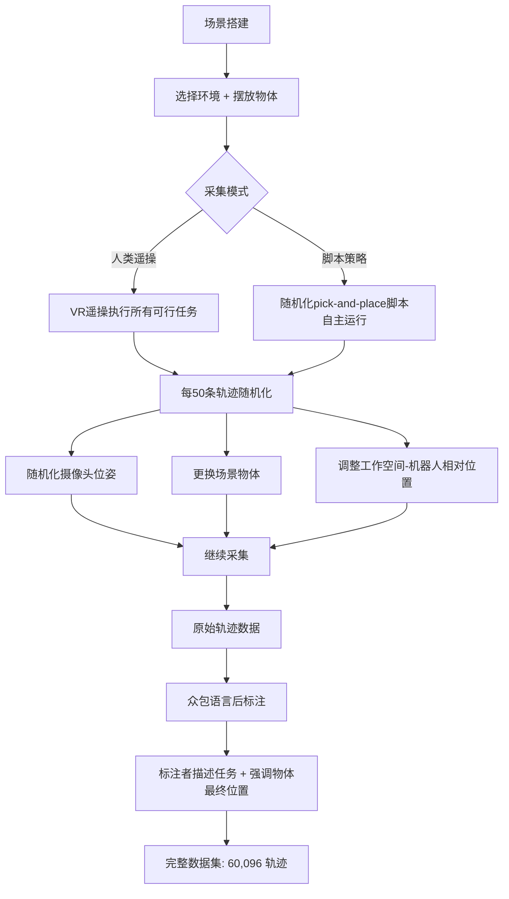
```mermaid
flowchart TD
    A[场景搭建] --> B[选择环境 + 摆放物体]
    B --> C{采集模式}
    C -->|人类遥操| D[VR遥操执行所有可行任务]
    C -->|脚本策略| E[随机化pick-and-place脚本自主运行]
    D --> F[每50条轨迹随机化]
    E --> F
    F --> G[随机化摄像头位姿]
    F --> H[更换场景物体]
    F --> I[调整工作空间-机器人相对位置]
    G --> J[继续采集]
    H --> J
    I --> J
    J --> K[原始轨迹数据]
    K --> L[众包语言后标注]
    L --> M[标注者描述任务 + 强调物体最终位置]
    M --> N[完整数据集: 60,096 轨迹]
```

### 3.3 数据集统计特征

**总体规模**：

$$N_{\text{total}} = N_{\text{human}} + N_{\text{scripted}} = 50{,}365 + 9{,}731 = 60{,}096$$

**技能分布**：数据集以基础操作技能为主体，其分布呈长尾形态。Pick-and-place（含原地重定向）占据最大比例，因其是最广泛适用的基础技能，且可向更复杂行为迁移。完整的 13 种技能包括：

| 技能类别 | 具体技能 |
|----------|----------|
| 基础物体操作 | Pick-and-place、推物、重定向物体 |
| 表面交互 | 擦拭、扫（工具+颗粒介质） |
| 物体组合 | 堆叠积木 |
| 柔性物体 | 折叠布料 |
| 环境操控 | 开关抽屉、开关门、开关纸箱翻盖 |
| 精细操作 | 旋钮、翻开关、拉拉链、转杠杆 |

**环境覆盖**：24 个环境分为 4 大类——玩具厨房（7 个，含水槽/灶台/微波炉的不同组合）、桌面（多种）、独立水槽、特殊环境（玩具洗衣机等）。

**摄像头覆盖**：由于硬件在采集过程中逐步升级，大部分数据仅包含固定肩视摄像头视角，少量数据包含全部 4 个视角（肩视 + 2 随机化 + 腕部）。深度数据仅在肩视摄像头位置可用。

### 3.4 动作空间定义

$$\mathbf{a} \in \mathbb{R}^7 = [\Delta x, \Delta y, \Delta z, \Delta \text{roll}, \Delta \text{pitch}, \Delta \text{yaw}, g]$$

其中前 6 维为笛卡尔末端执行器的相对位姿变化（连续值），$g$ 为离散的夹爪开关指令。这一设计在简洁性与表达力之间取得了平衡：相对位姿避免了绝对坐标系标定的困难，7 维动作空间使策略网络的输出维度保持可控。

---

## 4. 模型结构及设计原因

作为数据集论文，BridgeData V2 的核心贡献不在于提出新模型，而在于验证数据集对多种异构学习方法的通用兼容性。论文评估了 6 种代表性方法，覆盖了当时机器人学习的主要范式。

### 4.1 评估方法架构总览

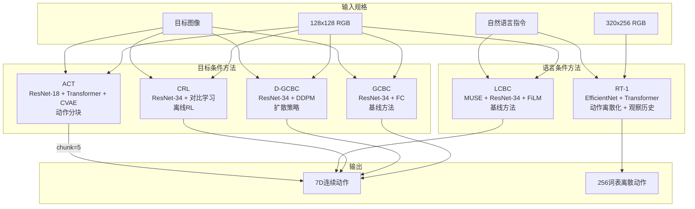
```mermaid
graph TB
    subgraph 目标条件方法
        GCBC["GCBC<br/>ResNet-34 + FC<br/>基线方法"]
        DGCBC["D-GCBC<br/>ResNet-34 + DDPM<br/>扩散策略"]
        ACT["ACT<br/>ResNet-18 + Transformer + CVAE<br/>动作分块"]
        CRL["CRL<br/>ResNet-34 + 对比学习<br/>离线RL"]
    end
    
    subgraph 语言条件方法
        LCBC["LCBC<br/>MUSE + ResNet-34 + FiLM<br/>基线方法"]
        RT1["RT-1<br/>EfficientNet + Transformer<br/>动作离散化 + 观察历史"]
    end
    
    subgraph 输入规格
        IMG128["128x128 RGB"]
        IMG320["320x256 RGB"]
        GOAL["目标图像"]
        LANG["自然语言指令"]
    end
    
    IMG128 --> GCBC & DGCBC & ACT & CRL & LCBC
    IMG320 --> RT1
    GOAL --> GCBC & DGCBC & ACT & CRL
    LANG --> LCBC & RT1
    
    subgraph 输出
        ACT7["7D连续动作"]
        ACTD["256词表离散动作"]
    end
    
    GCBC & DGCBC & CRL & LCBC --> ACT7
    ACT --> |"chunk=5"| ACT7
    RT1 --> ACTD
```

### 4.2 各方法的关键设计决策对比

| 设计维度 | GCBC | D-GCBC | ACT | CRL | LCBC | RT-1 |
|----------|------|--------|-----|-----|------|------|
| 图像编码器 | ResNet-34 | ResNet-34 | ResNet-18 | ResNet-34 | ResNet-34+FiLM | EfficientNet |
| 输入分辨率 | $128^2$ | $128^2$ | $128^2$ | $128^2$ | $128^2$ | $320 \times 256$ |
| 动作表示 | 连续单步 | 扩散连续 | 连续chunk=5 | 连续单步 | 连续单步 | 离散256词表 |
| 多模态建模 | 无 | DDPM | CVAE | 隐式 | 无 | 离散化 |
| 观察历史 | 否 | 否 | 否 | 否 | 否 | 是（seq=15） |
| 任务条件 | 目标图像 | 目标图像 | 目标图像 | 目标图像 | 语言 | 语言 |
| 学习范式 | BC | BC | BC | 离线RL | BC | BC |

### 4.3 关键数学表达

**GCBC 目标采样**：训练时，给定轨迹 $\tau = (o_1, a_1, \ldots, o_T, a_T)$，对时间步 $t$ 的目标图像 $g$ 从未来观察中均匀采样：

$$g \sim \text{Uniform}(\{o_{t+1}, o_{t+2}, \ldots, o_T\})$$

**D-GCBC 扩散目标（DDPM）**：

$$\mathcal{L}_{\text{DDPM}} = \mathbb{E}_{t, \mathbf{a}_0, \boldsymbol{\epsilon}} \left[ \left\| \boldsymbol{\epsilon} - \boldsymbol{\epsilon}_\theta(\mathbf{a}_t, t, \mathbf{z}) \right\|^2 \right]$$

其中 $\mathbf{z}$ 为图像编码器输出的条件特征，$\mathbf{a}_t$ 为加噪后的动作，$\boldsymbol{\epsilon}_\theta$ 为去噪网络。

**CRL 对比目标**：将目标条件值函数参数化为表征的内积：

$$V(s, g) = \phi(s)^\top \psi(g)$$

通过对比学习框架训练，正样本为轨迹中实际到达的未来状态，负样本为批次中随机采样的状态。

**RT-1 动作离散化**：每个动作维度缩放至 $[-1, 1]$，然后用 256 个均匀分布的 bin 进行离散化：

$$a_{\text{token}} = \left\lfloor \frac{a + 1}{2} \times 255 \right\rfloor$$

---

## 5. 训练方法（算法与工程）

### 5.1 统一训练基础设施

所有方法共享以下训练配置：

- **优化器**: Adam，学习率 $\eta = 3 \times 10^{-4}$
- **学习率调度**: 线性 warmup，2000 步
- **数据增强**: 随机裁剪、随机缩放、颜色抖动
- **目标条件训练目标**: 从轨迹未来时间步均匀采样观察作为目标图像

### 5.2 方法特定工程适配

**ACT 的 chunk size 调整**：原始 ACT 设计用于 50 Hz 控制频率和 1000 步轨迹，chunk size 为 100。BridgeData V2 的控制频率为 5 Hz，轨迹长度约 50-100 步，因此将 chunk size 调整为 5，并将原本的单任务架构改造为目标条件版本。ACT 在单张 NVIDIA 2080Ti 上训练 3 天即可收敛。

**CRL 的稳定性调整**：将 GCBC 正则化系数增至 0.2（原始值更小），以避免采样分布外动作。使用与其他方法相同的 batch size 确保公平比较。编码器在值函数和策略间共享权重，促进因果信息的传递。

**RT-1 的序列长度调整**：Transformer 序列长度从原始的 6 增至 15，以适配 BridgeData V2 更长的 episode 长度。

### 5.3 缩放实验的数据集构建

为系统研究缩放效应，论文精心构建了多个数据集变体：

- **规模消融**：通过按任务分层随机下采样（stratified subsampling）生成 25%/50%/75%/100% 的子集，保持技能多样性比例不变
- **多样性消融**：构建两个规模匹配的数据集——3 技能版本（$\sim$28k 轨迹，仅 pick-and-place/推/擦拭）和 13 技能版本（$\sim$27k 轨迹）
- **V1 vs V2 消融**：BridgeData V1 + PTR（13k 轨迹/15 环境/11 技能）与完整 BridgeData V2（60k 轨迹/24 环境/13 技能）

---

## 6. 实验关键发现与效果对比

### 6.1 已见任务评估（Table 2）

在 8 个训练集中出现过的任务上，每个任务 10 次试验：

| 任务 | GCBC | D-GCBC | ACT | CRL | LCBC | RT-1 |
|------|------|--------|-----|-----|------|------|
| 打开抽屉 | 0.4 | 0.6 | 0.5 | 0.4 | 0.5 | **1.0** |
| 用棒扫豆子成堆 | **0.9** | **0.9** | **0.9** | 0.7 | 0.4 | 0.6 |
| 折叠蓝色薄布 | 0.4 | 0.7 | 0.7 | 0.5 | 0.5 | **0.9** |
| 堆叠绿色积木到黄色上 | 0.4 | 0.2 | 0.3 | **0.6** | 0.0 | 0.0 |
| 放玉米进锅 | **0.9** | 0.8 | 0.8 | 0.8 | 0.0 | 0.0 |
| 放胡萝卜到盘子上 | **0.7** | 0.4 | 0.1 | 0.0 | 0.0 | **0.8** |
| 翻转锅正面朝上 | 0.1 | 0.1 | 0.0 | **0.4** | **0.4** | **0.4** |
| 放茄子进锅 | 0.1 | **0.2** | 0.0 | 0.0 | 0.0 | **0.2** |
| **平均** | **0.49** | **0.49** | 0.41 | 0.42 | 0.23 | **0.49** |

**关键发现**：
- GCBC、D-GCBC 和 RT-1 以 49% 的平均成功率并列最优，说明在数据充足时，即使是简单的 BC 基线也能取得可观性能
- RT-1 显著优于 LCBC 基线（49% vs 23%），差距源于更大图像分辨率（$320 \times 256$ vs $128^2$）、动作离散化和观察历史的综合效应
- CRL 作为唯一的离线 RL 方法，在堆叠积木（0.6）和翻转锅（0.4）等需要精确控制的任务上表现突出，显示值函数引导的优势
- 语言条件方法在某些任务上完全失败（LCBC/RT-1 在"放玉米进锅"上均为 0.0），暗示语言接地的局限性

### 6.2 未见任务泛化评估（Table 3）

| 任务 | 泛化类型 | GCBC | D-GCBC | ACT | CRL | LCBC | RT-1 |
|------|----------|------|--------|-----|-----|------|------|
| 用刷子扫米成堆 | 未见物体+见过环境 | **0.6** | 0.0 | 0.3 | 0.3 | 0.0 | 0.1 |
| 折叠灰色厚布 | 未见物体+见过环境 | 0.3 | 0.6 | **0.7** | 0.0 | 0.0 | 0.4 |
| 放记号笔进碗 | 未见物体+未见环境 | 0.6 | 0.6 | 0.2 | **0.7** | 0.0 | 0.0 |
| 用布擦桌子 | 见过物体+未见环境 | 0.6 | 0.5 | 0.4 | 0.6 | 0.4 | **0.9** |
| 放蘑菇进锅 | 见过物体+未见环境 | 0.7 | **0.9** | 0.1 | 0.7 | 0.1 | 0.6 |
| 放勺子到布上 | 见过物体+未见环境 | **0.8** | 0.7 | 0.0 | **0.8** | 0.0 | **1.0** |
| **平均** | — | **0.60** | 0.55 | 0.28 | 0.52 | 0.08 | 0.50 |

**关键发现**：
- GCBC 在未见任务上以 60% 平均成功率**反超**所有方法（包括更复杂的 D-GCBC 和 RT-1），这一反直觉结果表明简单方法在泛化场景下有时更鲁棒
- LCBC 灾难性崩溃至 8%：未见物体的名称在训练数据中缺乏语言接地，语言条件策略完全无法执行
- ACT 泛化能力最弱（28%），其动作分块机制可能过度拟合了训练环境的动作序列模式
- RT-1 在见过物体+未见环境的任务上表现优异（如"放勺子到布上"达到 100%），但在未见物体任务上完全失败（"放记号笔进碗"为 0.0），显示语言条件方法的泛化模式与目标条件方法截然不同

### 6.3 跨机构迁移评估（Table 4）

| 任务 | GCBC | D-GCBC | ACT | CRL | LCBC | RT-1 |
|------|------|--------|-----|-----|------|------|
| 放胡萝卜到盘子上 | $0.7 \to 0.3$ | $0.4 \to 0.0$ | $0.1 \to 0.0$ | $0.0 \to 0.3$ | $0.0 \to 0.0$ | $0.8 \to 0.4$ |
| 翻转锅正面朝上 | $0.1 \to 0.0$ | $0.1 \to 0.2$ | $0.0 \to 0.3$ | $0.4 \to 0.2$ | $0.4 \to 0.1$ | $0.4 \to 0.6$ |
| 放茄子进锅 | $0.1 \to 0.1$ | $0.2 \to 0.2$ | $0.0 \to 0.0$ | $0.0 \to 0.1$ | $0.0 \to 0.0$ | $0.2 \to 0.2$ |
| **平均** | $0.30 \to 0.13$ | $0.23 \to 0.13$ | $0.03 \to 0.10$ | $0.13 \to 0.20$ | $0.13 \to 0.03$ | $0.47 \to 0.40$ |

**关键发现**：
- RT-1 跨机构迁移最为鲁棒，平均成功率仅从 47% 降至 40%（下降 7 个百分点），可能得益于其更大的输入分辨率和观察历史提供了更丰富的视觉上下文
- 所有方法均实现非零成功率（零样本，无任何 Lab 2 数据微调），**首次定量证明**标准化低成本平台上收集的多样化数据可以支持跨机构迁移
- 目标条件方法退化更严重（GCBC 从 30% 降至 13%），因为目标图像中包含了环境特定的视觉细节，跨域时这些细节成为干扰信号

---

## 7. 消融实验的发现

按影响幅度从高到低排序：

### 7.1 数据集规模 + 多样性综合效应 [影响最大]

BridgeData V1+PTR（13k/15环境/11技能）训练的 GCBC 在未见任务上平均成功率仅 8%，而 BridgeData V2（60k/24环境/13技能）达到 **70%**，提升 $\times 8.75$。这是所有消融中最大的效应，说明数据的规模和多样性对泛化能力有决定性影响。

$$\text{提升倍数} = \frac{0.70}{0.08} = 8.75\times$$

### 7.2 技能多样性的正迁移效应 [影响大]

控制数据集总量（$\sim$28k vs $\sim$27k），13 技能数据集在未见 pick-and-place 任务上成功率 **65%**，3 技能数据集仅 **30%**，绝对提升 35 个百分点。这一发现的理论意义深远：不同技能之间存在正迁移，折叠、堆叠、扫等技能的数据帮助模型学习了更通用的视觉-运动表征，即使评估任务是纯粹的 pick-and-place。此发现扩展了 RT-1（Brohan et al.）仅验证物体多样性有益的结论，将其推广到技能多样性维度。

### 7.3 数据集规模的单调递增效应 [影响中等]

按任务分层下采样生成 25%/50%/75%/100% 子集，在已见和未见任务上均观察到成功率随数据量单调递增。未见任务的提升更为显著，表明数据规模对分布外泛化的边际效用更高。

### 7.4 模型容量效应 [影响中等]

在"移动勺子"任务上比较 ResNet-18/34/50：

$$\text{ResNet-18} < \text{ResNet-34} < \text{ResNet-50}$$

成功率严格递增。定性分析显示，较小模型无法学习精细的腕关节旋转控制（如抓取水平放置的勺子时无法正确旋转夹爪），说明模型容量不足会造成底层运动原语的缺失。

---

## 8. 优化有效性评估

### 8.1 最有效的设计决策

**开放式多任务收集协议** 被证明是 BridgeData V2 最关键的设计决策。证据链如下：

1. V1 的预定义任务收集产生了技能多样性不足的数据（4 种技能），而 V2 的开放式收集自然产生了 13 种技能
2. 技能多样性消融直接证明 13 技能 vs 3 技能带来了 $35\%$ 的绝对性能提升
3. 开放式收集使同一场景中包含多种可行任务，强制策略学习条件化执行，这是支持开放词汇任务指定的前提

**低成本硬件标准化** 的有效性通过跨机构实验（Table 4）得到验证：Lab 2 在零样本条件下实现非零成功率，证明 \$4,000 平台的标准化确实降低了数据集的使用门槛。

**混合人类/脚本数据** 的有效性虽然未被直接消融，但 CRL（唯一的离线 RL 方法）在堆叠积木等任务上的优异表现间接证明了次优脚本数据的价值——RL 方法从覆盖更广的数据分布中提取了更鲁棒的行为。

### 8.2 效果有限的设计决策

**语言后标注**的效果有限。LCBC 在已见任务上仅 23%、未见任务上 8%，远低于目标条件方法。仅当搭配高容量架构（RT-1）时语言条件才展现竞争力，说明语言标注的价值高度依赖于模型容量和预训练视觉-语言特征的质量。

**动作分块（ACT）** 在跨任务泛化场景下反而成为劣势（未见任务平均仅 28%），可能因为序列化的动作预测更容易过拟合训练环境的时序模式。

---

## 9. 与后续工作的关联

BridgeData V2 在 PI 技术演进链中扮演了"数据哲学奠基者"的角色，其影响贯穿后续全部工作：

### 9.1 直接数据继承

- **DROID**（第二章）：将 BridgeData V2 的"低成本标准化平台 + 开放式收集协议"范式从单一机构扩展至跨机构联盟，使用更先进的 Franka 机械臂在全球多个实验室收集数据。BridgeData V2 证明的"跨机构迁移可行性"是 DROID 项目立项的核心依据。
- **Open X-Embodiment**：BridgeData V2 作为贡献最大的数据源之一被纳入 Open X-Embodiment 跨具身数据集，其标准化的数据格式和开放协议为多源数据聚合提供了范例。

### 9.2 方法论启发

- **Octo**（第三章）：BridgeData V2 的多方法兼容性评估证明了"通用基础模型"的可行性——既然一个数据集可以同时服务于 6 种不同方法，那么一个基础模型也应该能适配多种下游任务。Octo 直接在 BridgeData V2 上进行了大量预训练和评估。
- **$\pi_0$**（第四章）：BridgeData V2 的缩放实验（模型容量、数据规模、技能多样性三者均单调提升性能）为 $\pi_0$ 追求更大模型（PaliGemma 2-3B + 300M action expert）和更大数据（10k+ 小时）提供了理论支撑。
- **$\pi_0$-FAST**（第五章）：RT-1 在 BridgeData V2 上的动作离散化实验（256 词表）为 FAST tokenizer 的 FSQ 离散化提供了早期探索。

### 9.3 哲学层面的遗产

BridgeData V2 确立的三条核心信条——数据多样性 > 数据规模、开放标准化 > 封闭规模化、方法无关 > 方法绑定——成为 PI 整个研究路线的指导原则。从 BridgeData V2 的 \$4,000 WidowX 到 DROID 的 Franka，从 60k 轨迹到 $\pi_0$ 的 10k+ 小时，从 6 种评估方法到 $\pi_{0.5}$ 的统一 VLA 架构，这条演进路径的每一步都可以追溯到 BridgeData V2 的实证发现。

论文最后指出的三个局限性——任务精度有限、单机构采集、单一机器人形态——恰好预示了后续工作的发展方向：DROID 解决了跨机构问题，$\pi_0$ 解决了精度和复杂度问题，而多机器人形态泛化则成为 $\pi_{0.5}$ 和更远期工作的核心目标。


---


# 第二章：DROID — 大规模野外机器人操作数据集

> **系列定位**：本章是 Physical Intelligence (PI) 研究演进深度对比分析的第二章。DROID 作为继 BridgeData V2 之后的第二篇关键论文，将机器人操作数据集的核心范式从"扩大轨迹数量"转向"扩大场景多样性"，并通过分布式跨机构采集实现了场景覆盖的数量级跃迁。

---

## 论文信息

| 项目 | 内容 |
|------|------|
| **论文标题** | DROID: A Large-Scale In-The-Wild Robot Manipulation Dataset |
| **发表时间** | 2024-03-19 (arXiv); 2024-07 (RSS 2024, Delft, Netherlands) |
| **arXiv** | [https://arxiv.org/abs/2403.12945](https://arxiv.org/abs/2403.12945) |
| **项目主页** | [https://droid-dataset.github.io](https://droid-dataset.github.io) |
| **项目联合负责人** | Alexander Khazatsky (Stanford), Karl Pertsch (Berkeley/Stanford) |
| **研究负责人** | Suraj Nair, Ashwin Balakrishna, Sudeep Dasari, Siddharth Karamcheti, Soroush Nasiriany, Mohan Kumar Srirama |
| **首席顾问** | Chelsea Finn (Stanford) |
| **顾问团** | Sergey Levine (Berkeley), Jitendra Malik, Jeannette Bohg, Yuke Zhu, Shuran Song 等 17 位 |
| **参与机构** | Stanford, UC Berkeley, Toyota Research Institute (TRI), CMU, UT Austin, Google DeepMind, KAIST, U of Washington, U of Montreal, U of Edinburgh, Princeton, UC San Diego, UC Davis, U of Pennsylvania 等 13+ 机构 |
| **作者总数** | 100+ 位 |

---

## 1. 解决了什么问题 & 相对前作的定位

### 1.1 核心问题

DROID 直面机器人操作领域最根本的数据瓶颈：**现有数据集的场景多样性严重不足，导致训练出的策略无法在新环境中泛化**。计算机视觉和自然语言处理的成功已经证明，大规模、高多样性的训练数据是通用模型的基石。但与图像和文本不同，机器人操作数据无法从互联网爬取，必须依赖物理机器人在真实环境中交互采集。这一固有约束导致即使是当时最先进的通用操作策略，其训练数据也主要集中在少数受控实验室环境中。

### 1.2 对 BridgeData V2 的直接承继与超越

DROID 与 BridgeData V2 在研究谱系上有明确的承继关系——两篇论文共享大量核心作者（Karl Pertsch、Sudeep Dasari、Chelsea Finn、Sergey Levine 等），且 DROID 在论文中将 BridgeData V2 作为核心对比对象之一。然而，DROID 对 BridgeData V2 的局限性做了系统性的诊断和突破：

**BridgeData V2 的三重局限**：

1. **场景多样性瓶颈**：BridgeData V2 仅覆盖 24 个场景，且这些场景主要集中在少数实验室和厨房环境中。虽然它在技能多样性（13 种技能、82 种去重动词）上已有突破，但场景的同质性意味着策略难以泛化到视觉外观差异显著的新环境。
2. **单一机器人形态**：BridgeData V2 全部使用 WidowX-250 低成本机械臂，虽然降低了准入门槛，但其 5 自由度 + 5Hz 控制频率限制了操作的精细度和复杂度。
3. **地理与机构集中**：数据主要由 UC Berkeley 及少数合作机构采集，地理分布有限，场景的文化和物理多样性不足。

**DROID 的定位逻辑**：不是简单地"收集更多轨迹"，而是从根本上改变数据采集的组织方式——通过分布式跨机构采集，将场景多样性提升一个数量级。

| 维度 | BridgeData V2 | DROID | 提升倍数 |
|------|-------------|-------|---------|
| 轨迹数 | 60,096 | 76,000 | 1.3x |
| 场景数 | 24 | 564 | **23.5x** |
| 建筑数 | ~3 | 52 | **~17x** |
| 场景类型 | ~3 种 (厨房/桌面/水槽) | 10 种 (厨房/办公室/卧室/浴室/客厅等) | **3.3x** |
| 去重动词数 | 82 | 86 | 1.05x |
| 相机视角数 | ~固定 | 1,417 唯一视角 | 数量级提升 |
| 采集机构数 | ~3 | 13 | **~4x** |
| 采集人员数 | 未公开 | 50 | -- |
| 地理覆盖 | 北美 | 北美 + 亚洲 + 欧洲 | 3 大洲 |

这组数据揭示了 DROID 的核心洞察：**轨迹数量仅增长 1.3 倍，但场景数量增长 23.5 倍**。DROID 的价值不在于"更多数据"，而在于"更多样的数据"。

### 1.3 相对其他数据集的定位

DROID 还需要与更广泛的数据集生态进行比较：

| 数据集 | 轨迹数 | 动词数 | 场景数 | 语言标注 | 相机标定 | 公开硬件 |
|--------|--------|--------|--------|---------|---------|---------|
| MIME | 8.3k | 20 | 1 | -- | -- | Yes |
| RoboTurk | 2.1k | 2 | 1 | -- | -- | Yes |
| RoboNet | 162k | n/a | 10 | -- | -- | Yes |
| MT-Opt | 800k | 2 | 1 | -- | -- | Yes |
| BridgeData V1 | 7.2k | 4 | 12 | Yes | -- | Yes |
| BC-Z | 26k | 3 | 1 | Yes | -- | No |
| RT-1 | 130k | 2 | 2 | Yes | -- | No |
| RH20T | 13k | 33 | 7 | Yes | Yes | Yes |
| RoboSet | 98.5k | 9 | 11 | Yes | -- | Yes |
| BridgeData V2 | 60.1k | 82 | 24 | Yes | -- | Yes |
| OXE (聚合) | 1.4M | 217 | ~311 | 部分 | -- | 部分 |
| **DROID** | **76k** | **86** | **564** | **Yes** | **Yes** | **Yes** |

关键观察：即使 OXE 聚合了包括 BridgeData V2 在内的几乎所有主要数据集，其场景总数（~311）仍低于 DROID 单一数据集的 564 个场景。而 MT-Opt 虽拥有 800k 轨迹（是 DROID 的 10 倍），但仅有 1 个场景和 2 种动词，说明单纯的数据量并不等同于数据多样性。

### 1.4 为什么场景多样性比轨迹数量更重要

DROID 提出并验证了一个关键假设：**在机器人操作数据中，场景多样性是驱动策略泛化的首要因素，其重要性超越数据总量**。这一假设的逻辑基础是：

- 场景变化引入了最大的视觉分布偏移——不同的背景、光照、桌面高度、物体布局
- 在少数场景中收集大量轨迹会导致策略过拟合于特定的视觉模式
- 真实部署场景几乎必然与训练场景不同，场景泛化是实用性的前提

这一假设后来被 DROID 的消融实验有力证实（见第 7 节），成为该领域的重要认知转折点。

---

## 2. 创新点

### 创新点 1：分布式跨机构数据采集范式 [变革性]

DROID 的首要创新不是算法或模型，而是**数据采集的组织范式**。通过在 3 大洲、13 个机构部署 18 套标准化机器人平台，由 50 名数据采集员在 12 个月内持续采集，DROID 实现了机器人操作领域前所未有的场景多样性。这一范式借鉴了自动驾驶领域（Waymo、nuScenes）的分布式数据采集经验，首次将其系统性地应用于机器人操作。

相比 BridgeData V2 主要依赖 Berkeley 实验室及少数合作机构的集中式采集，DROID 的分布式架构带来了三重优势：(1) 地理多样性确保了自然发生的场景差异；(2) 多采集员带来了操作风格的多样性；(3) 并行采集提高了数据积累速度。

### 创新点 2：标准化便携式硬件平台设计 [显著]

为支撑分布式采集的一致性，DROID 设计了高度标准化的便携式硬件平台：Franka Panda 7-DoF 机械臂 + Robotiq 2F-85 夹爪，安装在带轮高度可调的升降桌上，配备 3 路同步立体相机（2x Zed 2 外部 + 1x Zed Mini 腕部），使用单根电源线供电。这一设计在数据质量一致性和场景迁移便捷性之间取得了巧妙平衡。

相比 BridgeData V2 的 WidowX-250 平台（~$4,000, 5-DoF），Franka Panda 是研究社区更广泛采用的工业级机械臂（7-DoF, 15Hz 控制频率），提供了更高的操作精度和更大的工作空间覆盖。然而代价是硬件成本显著增加。

### 创新点 3：GUI 驱动的数据质量保障协议 [显著]

DROID 设计了专用的数据采集 GUI，实现了三个关键功能：(1) 防止常见采集错误（如相机遮挡、操作员入镜）；(2) 通过随机采样任务指令避免对简单任务的偏好；(3) 周期性提示"场景增强"（微调底座、移动相机、改变照明、增减物品）以增加同一场景内的多样性。这种系统化的质量保障机制是 BridgeData V2 开放式采集协议的工程化升级。

### 创新点 4：多维度数据多样性的系统化量化分析框架 [显著]

DROID 建立了分析机器人操作数据集多样性的系统化框架，定义并量化了五个关键维度：任务多样性（动词分布）、物体多样性（交互物体类别）、场景多样性（场景数量和类型）、视角多样性（相机位姿分布）、交互位置多样性（工作空间中的 3D 交互点分布）。这一框架使用 spaCy 语义解析 + GPT-4 去重动词 + GPT-4V 场景分类等自动化工具，首次为数据集的"多样性"提供了可量化、可比较的指标体系。

### 创新点 5：提供相机标定参数和深度信息 [增量性]

DROID 是为数不多提供完整相机标定矩阵（内参 + 外参）和深度信息的大规模操作数据集。后处理流程包括：(a) 基于 SAM + PyTorch3D 渲染的自动标定质量评估（IoU $\geq$ 0.7），过滤出约 30k 高质量场景；(b) 基于 CtRNet-X 的自动标定补充约 12k 场景；(c) 基于修改版 DUSt3R 的相机间标定。这使得 DROID 可用于 3D 视觉和视角不变表征学习等 BridgeData V2 无法支持的下游任务。

### 创新点 6：场景多样性 vs. 数据量的因果分离实验 [显著]

DROID 设计了精巧的控制实验（7k 轨迹/20 场景 vs. 7k 轨迹/多样场景），首次在控制数据量的条件下因果性地分离出场景多样性对策略泛化的独立贡献。这一实验设计为该领域提供了关键的实证证据，影响了后续所有大规模数据集的设计哲学。

---

## 3. 数据来源、处理方式及其原因

### 3.1 硬件平台规格

DROID 硬件平台的设计遵循"标准化 + 便携性 + 高质量"三原则：

| 组件 | 规格 | 设计理由 |
|------|------|---------|
| 机械臂 | Franka Emika Panda 7-DoF | 学术界广泛采用、可靠、多数机构已有 |
| 夹爪 | Robotiq 2F-85 | 连续控制、力控能力、工业标准 |
| 外部相机 | 2x Zed 2 立体相机 (可调三脚架) | 立体视觉 + 深度、灵活视角调整 |
| 腕部相机 | 1x Zed Mini 立体相机 | 近距离操作观测、手眼协调 |
| 遥操作 | Meta Quest 2 控制器 | 6D 位姿控制 + 连续夹爪 |
| 移动平台 | 带轮高度可调升降桌 | 场景间快速迁移 |
| 控制器 | Polymetis (NUC) | 低延迟关节控制 |
| 控制频率 | 15Hz | 平衡精度与数据量 |
| 图像分辨率 | 1280x720 (原始) | 保留高分辨率细节 |

与 BridgeData V2 硬件的对比：

| 维度 | BridgeData V2 (WidowX-250) | DROID (Franka Panda) |
|------|---------------------------|---------------------|
| 自由度 | 5-DoF + 1D 夹爪 | 7-DoF + 1D 连续夹爪 |
| 控制频率 | 5Hz | 15Hz (3x) |
| 相机数量 | 1 固定 + 2 随机化 RGB | 3 同步立体 (含深度) |
| 图像分辨率 | 640x480 | 1280x720 |
| 深度信息 | 仅 RealSense D435 | 全部 3 路立体相机 |
| 相机标定 | 无 | 完整内参 + 外参 |
| 便携性 | 桌面安装 | 带轮升降桌 |
| 成本 | ~$4,000 | 显著更高 |

### 3.2 数据采集协议

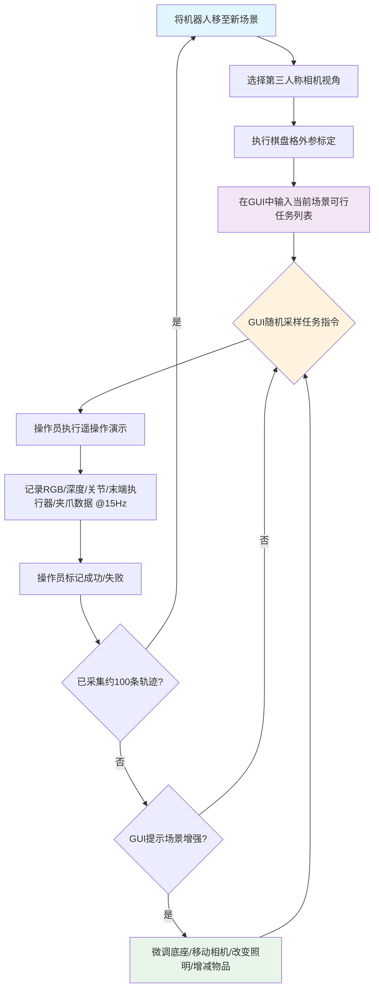
```mermaid
flowchart TD
    A[将机器人移至新场景] --> B[选择第三人称相机视角]
    B --> C[执行棋盘格外参标定]
    C --> D[在GUI中输入当前场景可行任务列表]
    D --> E{GUI随机采样任务指令}
    E --> F[操作员执行遥操作演示]
    F --> G[记录RGB/深度/关节/末端执行器/夹爪数据 @15Hz]
    G --> H[操作员标记成功/失败]
    H --> I{已采集约100条轨迹?}
    I -->|否| J{GUI提示场景增强?}
    J -->|是| K[微调底座/移动相机/改变照明/增减物品]
    K --> E
    J -->|否| E
    I -->|是| A
    
    style A fill:#e1f5fe
    style D fill:#f3e5f5
    style E fill:#fff3e0
    style K fill:#e8f5e9
```

协议设计的关键决策与 BridgeData V2 的对比：

| 设计决策 | BridgeData V2 | DROID | 改进理由 |
|---------|-------------|-------|---------|
| 任务选择 | 操作员自由选择 | GUI 随机采样 | 避免简单任务偏好 |
| 场景切换 | 每50条轨迹换一次 | 每~100条(20分钟)换一次 | 优先场景多样性 |
| 场景增强 | 手动随机化相机/物体 | GUI 系统化提示 | 确保一致执行 |
| 语言标注 | 后标注众包 | 后标注众包 (每条1-3标注) | 增加标注多样性 |
| 质量控制 | 无系统化机制 | GUI 防错 + 成功标记 | 减少低质量数据 |

### 3.3 后处理流程

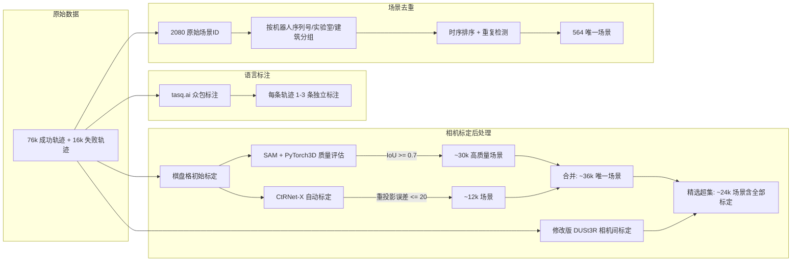
```mermaid
flowchart LR
    subgraph 原始数据
        R[76k 成功轨迹 + 16k 失败轨迹]
    end
    
    subgraph 语言标注
        R --> L1[tasq.ai 众包标注]
        L1 --> L2[每条轨迹 1-3 条独立标注]
    end
    
    subgraph 相机标定后处理
        R --> C1[棋盘格初始标定]
        C1 --> C2[SAM + PyTorch3D 质量评估]
        C2 -->|IoU >= 0.7| C3[~30k 高质量场景]
        C1 --> C4[CtRNet-X 自动标定]
        C4 -->|重投影误差 <= 20| C5[~12k 场景]
        C3 --> C6[合并: ~36k 唯一场景]
        C5 --> C6
        R --> C7[修改版 DUSt3R 相机间标定]
        C6 --> C8[精选超集: ~24k 场景含全部标定]
        C7 --> C8
    end
    
    subgraph 场景去重
        R --> S1[2080 原始场景ID]
        S1 --> S2[按机器人序列号/实验室/建筑分组]
        S2 --> S3[时序排序 + 重复检测]
        S3 --> S4[564 唯一场景]
    end
```

**相机标定的数学框架**：

对于相机到机器人基座的外参矩阵 $T_{cam \to base}$，质量评估通过以下步骤进行：

1. 利用正运动学从关节角 $\theta$ 计算 3D 关键点 $X \in \mathbb{R}^{N \times 3}$
2. 将关键点投影到图像平面：

$$x = \pi(K \cdot T_{cam \to base} \cdot X)$$

其中 $K$ 为相机内参矩阵，$\pi(\cdot)$ 为透视投影及归一化操作。

3. 使用投影的 2D 关键点引导 SAM 模型预测分割掩码 $M_{SAM}$
4. 通过 PyTorch3D 渲染合成掩码 $M_{GT}$（导入 URDF 网格、应用关节角、变换到相机坐标系）
5. 计算 IoU 度量标定质量：

$$\text{IoU} = \frac{|M_{SAM} \cap M_{GT}|}{|M_{SAM} \cup M_{GT}|}$$

仅保留 SAM 置信度 > 0.65 且 IoU $\geq$ 0.7 的高质量投影。

**CtRNet-X 补充标定**的质量评估使用重投影误差，结合中位绝对偏差（MAD）的离群值剔除策略：

$$\text{MAD} = \text{median}(|e_i - \text{median}(e)|)$$

其中 $e_i$ 为各关键点的重投影误差，仅保留偏差在 $2.5 \times \text{MAD}$ 以内的内点，最终筛选平均重投影误差 $\leq 20$ 的场景。

---

## 4. 模型结构及设计原因

### 4.1 评估策略架构

DROID 的核心贡献是数据集而非新模型。实验中采用 **Diffusion Policy** 作为统一的策略学习骨干，基于 Robomimic 代码库实现，选择原因是扩散策略在多模态动作分布建模上的表达能力已被广泛验证。

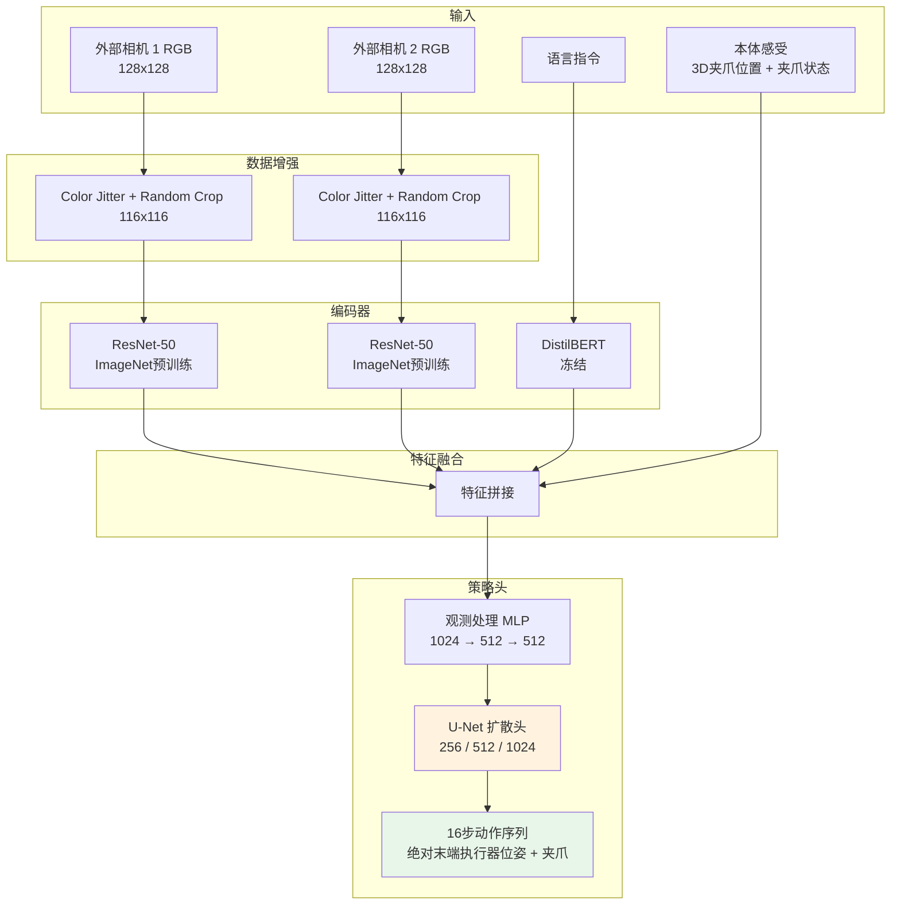
```mermaid
flowchart TD
    subgraph 输入
        I1[外部相机 1 RGB<br/>128x128]
        I2[外部相机 2 RGB<br/>128x128]
        I3[语言指令]
        I4[本体感受<br/>3D夹爪位置 + 夹爪状态]
    end
    
    subgraph 数据增强
        I1 --> A1[Color Jitter + Random Crop 116x116]
        I2 --> A2[Color Jitter + Random Crop 116x116]
    end
    
    subgraph 编码器
        A1 --> E1[ResNet-50<br/>ImageNet预训练]
        A2 --> E2[ResNet-50<br/>ImageNet预训练]
        I3 --> E3[DistilBERT<br/>冻结]
    end
    
    subgraph 特征融合
        E1 --> F[特征拼接]
        E2 --> F
        E3 --> F
        I4 --> F
    end
    
    subgraph 策略头
        F --> M[观测处理 MLP<br/>1024 → 512 → 512]
        M --> U[U-Net 扩散头<br/>256 / 512 / 1024]
        U --> O[16步动作序列<br/>绝对末端执行器位姿 + 夹爪]
    end
    
    style U fill:#fff3e0
    style O fill:#e8f5e9
```

### 4.2 与 BridgeData V2 评估策略的对比

| 维度 | BridgeData V2 | DROID |
|------|-------------|-------|
| 评估方法数 | 6 种 (GCBC, D-GCBC, ACT, CRL, LCBC, RT-1) | 1 种 (Diffusion Policy) |
| 条件类型 | 目标图像 + 语言 | 仅语言 |
| 视觉编码器 | ResNet-34 | ResNet-50 |
| 图像分辨率 | 128x128 | 128x128 (裁剪至 116x116) |
| 动作空间 | 相对 6D 末端执行器 + 离散夹爪 | 绝对末端执行器平移/旋转 + 夹爪 |
| 动作生成 | 单步 (除 ACT 外) | 16步序列 (执行前8步) |
| 控制频率 | 5Hz | 15Hz |
| 视觉输入数 | 1 路 (肩视) | 2 路 (双外部相机) |

DROID 选择仅使用一种策略（Diffusion Policy）进行评估，而非 BridgeData V2 的六种方法对比，反映了其研究重心的不同：DROID 关注的是"数据的价值"而非"方法的对比"。通过固定策略架构，所有性能差异可以归因于训练数据的差异。

### 4.3 数据模式设计

每条 DROID 轨迹的完整数据模式：

| 数据类型 | 维度/格式 | 频率 |
|---------|----------|------|
| RGB 相机流 | 3 路立体, 1280x720 | 15Hz |
| 关节位置 | 7D | 15Hz |
| 关节速度 | 7D | 15Hz |
| 末端执行器位姿 | 6D (相对基座) | 15Hz |
| 末端执行器速度 | 6D | 15Hz |
| 夹爪位置 | 1D | 15Hz |
| 夹爪速度 | 1D | 15Hz |
| 深度图 | 3 路 | 15Hz |
| 自然语言指令 | 1-3 条/轨迹 | 后标注 |
| 相机外参标定 | 4x4 矩阵 | 每场景 |
| 相机内参 | 每路相机 | 固定 |
| 元数据 | 建筑名/采集员ID/场景类型 | 每轨迹 |

这一丰富的数据模式是对 BridgeData V2 的显著扩展——后者不提供深度信息、相机标定或多标注语言指令。同时记录多种流行动作空间（关节空间和末端执行器空间）的等价控制指令，最大化了下游研究的适用性。

---

## 5. 训练方法（算法与工程）

### 5.1 扩散策略训练

DROID 采用 DDIM（Denoising Diffusion Implicit Models）进行动作轨迹去噪生成。扩散过程建模为：

$$q(a_t | a_0) = \mathcal{N}(a_t; \sqrt{\bar{\alpha}_t} a_0, (1 - \bar{\alpha}_t) I)$$

其中 $a_0$ 为真实动作序列，$a_t$ 为第 $t$ 步的噪声版本，$\bar{\alpha}_t = \prod_{s=1}^{t} \alpha_s$ 为噪声调度的累积乘积。

训练损失为标准的去噪目标：

$$\mathcal{L} = \mathbb{E}_{a_0, \epsilon, t} \left[ \| \epsilon - \epsilon_\theta(a_t, t, o) \|^2 \right]$$

其中 $\epsilon_\theta$ 为 U-Net 参数化的噪声预测网络，$o$ 为包含视觉嵌入、语言嵌入和本体感受的观测条件。

推理时使用 DDIM 加速采样，从纯噪声 $a_T \sim \mathcal{N}(0, I)$ 迭代去噪生成 16 步动作序列，开环执行前 8 步后重新推理。

### 5.2 联合训练策略

联合训练（Co-training）是 DROID 实验的核心工程决策。每个训练 batch 按 50/50 比例混合：

$$\mathcal{B} = \mathcal{B}_{in\text{-}domain} \cup \mathcal{B}_{DROID}$$

其中 $|\mathcal{B}_{in\text{-}domain}| = |\mathcal{B}_{DROID}| = 64$，总 batch size 为 128。DROID 部分仅使用标记为"成功"的轨迹（76k 中经语言标注的前 40k 条）。

这种简单的 50/50 混合策略避免了复杂的课程学习或数据加权方案，其有效性表明**数据质量和多样性本身比精细的训练策略更重要**。

### 5.3 训练超参数

| 超参数 | 值 |
|-------|-----|
| Batch Size | 128 |
| 优化器 | Adam |
| 学习率 | 1e-4 |
| 学习率调度 | Linear |
| 训练步数 | 25,000 (Cook Lentils OOD: 50,000) |
| 观测处理 MLP | [1024, 512, 512] |
| 图像分辨率 | 128x128 |
| 裁剪尺寸 | 116x116 |
| 扩散方法 | DDIM |
| EMA Power | 0.75 |
| U-Net 隐层 | [256, 512, 1024] |
| 观测时间窗 | 2 帧 |
| 预测时间窗 | 16 步 |
| 动作时间窗 | 8 步 |

### 5.4 对比基线的工程处理

三种训练配置仅在数据构成上有区别，架构和超参数完全相同：

| 配置 | 训练数据 | 数据规模 |
|------|---------|---------|
| No Co-training | 仅域内演示 | 50-150 条 |
| DROID (Ours) | 50% 域内 + 50% DROID | 50-150 条 + 40k 条 |
| OXE | 50% 域内 + 50% OXE 精选子集 | 50-150 条 + 400k 条 |

OXE 对比使用了 Octo 论文中的精选子集，移除了 Language Table 数据集（约 5%），因其场景重复且数据量过大。值得注意的是，OXE 的训练数据量（400k）是 DROID（40k）的 10 倍，但实验结果显示 DROID 的联合训练效果更优，这进一步支持了"多样性 > 数量"的核心论点。

---

## 6. 实验关键发现与效果对比

### 6.1 核心结果：DROID 显著提升策略性能

在 6 个任务、4 个场景（实验室 x3、办公室 x1、家庭 x2）的系统评估中，每个任务/方法进行 10 次 rollout 的 A/B 评估：

| 指标 | No Co-training | OXE Co-training | DROID Co-training | DROID vs. 次优 |
|------|---------------|----------------|------------------|--------------|
| 分布内平均成功率 | 基线 | 高于基线 | **最高** | **+22%** 绝对提升 |
| 分布外平均成功率 | 极低 | 中等 | **最高** | **+17%** 绝对提升 |

### 6.2 关键发现总结

**发现一：DROID 联合训练全面优于无联合训练和 OXE 联合训练**

在所有 6 个任务的分布内和分布外设置中，DROID 联合训练的策略一致性地优于其他两种配置。分布内领先次优方法 22 个百分点，分布外领先 17 个百分点。

**发现二：DROID (76k 轨迹) 优于 OXE (400k+ 轨迹)**

尽管 OXE 数据集的总量约为 DROID 的 10 倍，跨越 22 种机器人形态和约 300 个场景，但 DROID 的联合训练效果仍然更好。这一结果的核心含义是：**高度多样的单一形态数据集比异构的多形态数据集聚合更有价值**，至少在单一形态的下游任务评估中如此。

**发现三：对分布外鲁棒性的提升尤为显著**

不使用联合训练的基线在 OOD 设置下表现急剧下降，而 DROID 联合训练的策略在面对干扰物体、未见物体实例、相机偏移等变化时仍能保持较高成功率。在最具挑战性的 Cook Lentils 任务（四步长周期任务：开盖 $\to$ 拾取扁豆 $\to$ 倒入锅中 $\to$ 开炉灶）中，只有 DROID 联合训练的策略能够一致性地完成全部四步。

**发现四：跨环境迁移的可行性**

评估涵盖了从清洁实验室到真实家庭厨房和办公室的场景迁移，仅需 50-150 条域内演示配合 DROID 联合训练即可获得可靠的策略表现。

### 6.3 与 BridgeData V2 实验结论的对比

| 维度 | BridgeData V2 的发现 | DROID 的发现 | 演进 |
|------|-------------------|-------------|------|
| 数据规模 | 规模增加单调提升性能 | 在控制多样性后，规模的边际效应递减 | 从量变到质变 |
| 技能多样性 | 13 技能 vs. 3 技能：正迁移效应 | 86 种动词，长尾分布 | 多样性维度扩展 |
| 跨域泛化 | Lab 1→Lab 2 成功率下降 7-17% | 实验室→家庭/办公室仍有效 | 泛化跨度增大 |
| 关键瓶颈 | 模型容量 + 数据规模 + 技能多样性 | **场景多样性**是首要因素 | 瓶颈识别更精确 |
| 方法敏感性 | 不同方法差异显著 | 固定方法，聚焦数据价值 | 研究范式转变 |

---

## 7. 消融实验的发现

### 7.1 里程碑实验：场景多样性消融

这是 DROID 最重要的消融实验，直接因果性地分离了场景多样性对策略泛化的独立贡献。实验设计精巧：

| 配置 | 轨迹数 | 场景数 | 采样方式 |
|------|--------|--------|---------|
| DROID (7k, 20 Scenes) | 7,362 | 20 | 选择演示最多的 20 个场景 |
| DROID (7k, Diverse Scenes) | 7,362 | 多样 | 从全集均匀随机采样 |

两个子集的数据量完全相同（7,362 条轨迹），唯一的区别是场景多样性。在 OOD 评估设置下的结果：

**场景多样的子集在所有测试任务上均取得了更高的 OOD 成功率**。

这一结果的理论意义在于：它将"场景多样性"从众多可能的贡献因素中因果性地隔离出来，证明了它是 DROID 价值的核心驱动力。

进一步的横向对比：

| 对比 | 含义 |
|------|------|
| DROID (7k, Diverse) > DROID (7k, 20 Scenes) | 多样性比集中度更重要 |
| DROID (76k, Full) $\geq$ DROID (7k, Diverse) | 规模和多样性共同贡献 |
| DROID (76k, Full) > OXE (400k) | 多样性比异构聚合更重要 |

### 7.2 多维度多样性分析

论文通过系统化的定量分析揭示了 DROID 在五个维度上的多样性优势，每个维度相对 BridgeData V2、RT-1、RH20T 进行了比较：

| 多样性维度 | 度量方法 | DROID 优势 |
|-----------|---------|-----------|
| 任务多样性 | GPT-4 去重动词分布 | 86 种动词，长尾分布；仅 BridgeData V2 具有可比的长尾（82 种） |
| 物体多样性 | spaCy 语义解析物体类别 | 14 大类日常物体，覆盖文具/家具/电器/食品/运动/玩具等 |
| 场景多样性 | GPT-4V 场景分类 | 564 场景 / 10 种类型，比次优数据集高一个数量级 |
| 视角多样性 | 相机位姿分布可视化 | 1,417 唯一视角，覆盖半球形分布 |
| 交互位置多样性 | 首次夹爪闭合 3D 位置 | 覆盖工作空间更大范围，不限于桌面正前方 |

值得注意的是，在任务多样性（动词数）维度上，DROID（86）与 BridgeData V2（82）几乎持平，这说明 DROID 的核心差异化不在任务种类，而在场景覆盖。

---

## 8. 优化有效性评估

按实验证据的强度和影响排序，DROID 各设计决策的有效性评估如下：

### 第一梯队：变革性影响

| 排名 | 设计决策 | 效果证据 | 有效性评级 |
|------|---------|---------|----------|
| 1 | 分布式跨机构采集 → 564 场景 | 相比 OXE (300 场景 / 400k 轨迹) 仍胜出；场景消融实验直接证实 | 极高 |
| 2 | "场景优先"数据分配策略 (每场景 ~100 轨迹后切换) | 7k/20场景 vs. 7k/多样场景的消融实验 | 极高 |

### 第二梯队：显著影响

| 排名 | 设计决策 | 效果证据 | 有效性评级 |
|------|---------|---------|----------|
| 3 | 统一 Franka Panda 平台 | 消除形态差异噪声，使数据可直接混合；优于 OXE 的异构聚合 | 高 |
| 4 | 50/50 联合训练比例 | 简单有效，所有任务上一致性提升 | 高 |
| 5 | GUI 驱动的任务随机采样 | 确保任务覆盖的均匀性，避免简单任务偏好 | 中-高 |
| 6 | 3 路同步立体相机 | 提供深度和多视角信息，支持更丰富的下游应用 | 中-高 |

### 第三梯队：增量影响

| 排名 | 设计决策 | 效果证据 | 有效性评级 |
|------|---------|---------|----------|
| 7 | 后处理相机标定 (SAM + CtRNet-X + DUSt3R) | 为 3D 感知研究提供基础设施，但策略训练实验未直接使用 | 中 |
| 8 | 每轨迹 1-3 条众包语言标注 | 增加语言多样性，但未消融验证 | 中 |
| 9 | 场景增强提示 (移动底座/相机/照明) | 增加同场景内多样性，但未独立消融 | 低-中 |

### 核心结论

DROID 的实验证据建立了一个清晰的优先级层次：

$$\text{场景多样性} > \text{数据总量} > \text{形态一致性} > \text{训练策略}$$

这一优先级的实证基础是：
- DROID (76k, 564 场景) > OXE (400k, ~300 场景)：多样性 > 数量
- DROID (7k, Diverse) > DROID (7k, 20 Scenes)：控制量后多样性仍胜
- DROID (单形态) > OXE (22 形态)：统一形态 > 异构聚合

---

## 9. 与后续工作的关联

DROID 在 Physical Intelligence 研究链中占据承上启下的关键位置：

### 9.1 向 Octo 和 OXE 的直接输入

DROID 被纳入 Open X-Embodiment (OXE) 数据集聚合，成为 Octo 模型训练的核心数据源之一。DROID 论文的核心作者 Karl Pertsch、Sudeep Dasari 等同时是 Octo 的作者，确保了数据集设计与模型需求的深度对齐。DROID 的场景多样性直接提升了 Octo 在新环境中的零样本迁移能力。

### 9.2 为 $\pi_0$ 的数据基础奠基

DROID 的 Franka Panda 硬件平台、分布式采集框架和数据质量标准，为后续 Physical Intelligence 的旗舰模型 $\pi_0$ 提供了重要的数据基础设施。$\pi_0$ 的 10,000+ 小时训练数据中，DROID 贡献了高质量的多场景 Franka 操作数据。更重要的是，DROID 验证的"场景多样性 > 数据量"原则，直接影响了 $\pi_0$ 的数据策展策略。

### 9.3 人员网络与组织能力

DROID 项目动员了 100+ 位研究人员跨 13 个机构协作，这种组织能力本身是 Physical Intelligence 成立的重要前置条件。DROID 的核心团队——Karl Pertsch、Suraj Nair、Chelsea Finn、Sergey Levine——后来成为 PI 的关键成员。项目证明了大规模分布式机器人数据采集的可行性，为 PI 后续更大规模的数据采集奠定了组织和工程基础。

### 9.4 关键技术遗产

| DROID 建立的原则 | 在后续工作中的体现 |
|----------------|----------------|
| 场景多样性 > 数据量 | $\pi_0$ 使用来自多平台、多场景的 10k+ 小时数据 |
| 统一硬件平台 | PI 在多个机器人平台上采集数据，但每个平台内保持一致性 |
| 分布式采集 | PI 的数据采集网络扩展到更多合作伙伴 |
| 丰富的数据模式 (多视角 + 深度 + 标定) | $\pi_0$ 使用多相机输入和更丰富的感知信息 |
| 50/50 联合训练 | 多数据集混合训练成为后续模型的标准范式 |

### 9.5 从 BridgeData V2 到 DROID 再到 $\pi_0$ 的演进线

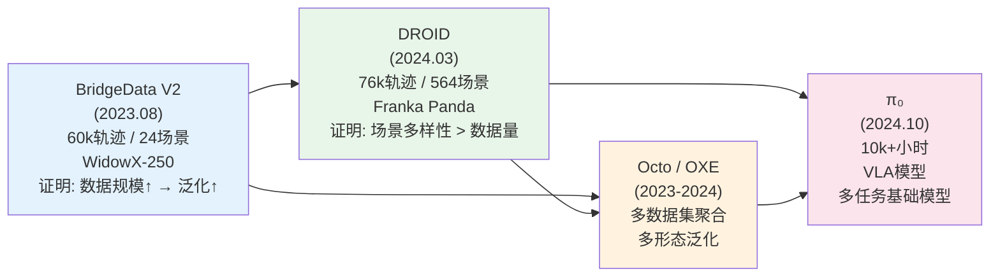
```mermaid
flowchart LR
    B["BridgeData V2<br/>(2023.08)<br/>60k轨迹 / 24场景<br/>WidowX-250<br/>证明: 数据规模↑ → 泛化↑"]
    D["DROID<br/>(2024.03)<br/>76k轨迹 / 564场景<br/>Franka Panda<br/>证明: 场景多样性 > 数据量"]
    O["Octo / OXE<br/>(2023-2024)<br/>多数据集聚合<br/>多形态泛化"]
    P["π₀<br/>(2024.10)<br/>10k+小时<br/>VLA模型<br/>多任务基础模型"]
    
    B --> D
    B --> O
    D --> O
    D --> P
    O --> P
    
    style B fill:#e3f2fd
    style D fill:#e8f5e9
    style O fill:#fff3e0
    style P fill:#fce4ec
```

### 9.6 留给后续工作的开放问题

DROID 在讨论部分明确提出了几个开放问题，这些问题后来成为 $\pi_0$ 等后续工作的研究方向：

1. **如何最优地混合 DROID 与其他大规模数据集？** —— $\pi_0$ 通过多数据集的策展和加权混合解决
2. **能否在没有域内数据的情况下完成新场景中的任务？** —— $\pi_0$ 的零样本/少样本能力部分回答了这一问题
3. **DROID 的多样交互数据能否学习更好的视觉表征？** —— 后续视觉预训练工作（如 RoVi-Aug）对此有所探索
4. **何时应使用完整数据集 vs. 数据切片？** —— 涉及数据策展和课程学习的持续研究方向

---

## 总结：DROID 的历史定位

DROID 在 PI 研究演进中的核心贡献可以用一句话概括：**它将机器人操作数据集的竞争维度从"谁有更多轨迹"转变为"谁有更多样的场景"**。

BridgeData V2 证明了数据规模对泛化的重要性（13k $\to$ 60k 轨迹带来 9 倍泛化提升），但仍局限于单一机器人形态和有限的场景多样性。DROID 在轨迹数量仅增长 1.3 倍的情况下，将场景数量提升 23.5 倍，并通过精心设计的消融实验证明了场景多样性是策略泛化的首要驱动力——甚至超越了 10 倍以上的数据量优势（DROID 76k > OXE 400k）。

这一发现不仅改变了机器人数据集的设计哲学，也为 Physical Intelligence 后续的大规模数据采集和模型训练提供了明确的指导原则：**投资于场景多样性的边际回报，远高于投资于同质环境中的更多轨迹**。


---


# 第三章：Octo — 首个开源通用机器人策略：从数据时代迈向模型时代

## 论文信息

- **标题**: Octo: An Open-Source Generalist Robot Policy
- **发表时间**: 2024-05-20 (arXiv v1)
- **会议**: RSS 2024 (Robotics: Science and Systems, Delft, Netherlands, July 15-19, 2024)
- **arXiv**: https://arxiv.org/abs/2405.12213
- **核心作者**: Dibya Ghosh\*, Homer Walke\*, Karl Pertsch\*, Kevin Black\*, Oier Mees\* (共同第一作者), Sudeep Dasari, Joey Hejna, Tobias Kreiman, Jianlan Luo, Dorsa Sadigh, Chelsea Finn, Sergey Levine
- **机构**: UC Berkeley, Stanford University, Carnegie Mellon University, Google DeepMind
- **开源**: 完整训练管线、模型检查点、数据加载器、微调脚本 (https://octo-models.github.io)

> **历史定位**: Octo 是 Physical Intelligence (PI) 演化链中的第三篇论文，也是从**数据论文**（BridgeData V2、DROID）向**模型论文**跨越的关键转折点。前两章建立了机器人操作数据的规模与多样性基础，Octo 则首次回答了一个核心问题：如何在这些异构数据之上构建一个**开放、可扩展、可迁移**的通用机器人策略。

---

## 1. 解决了什么问题 & 相对前作的定位

### 1.1 核心问题

在 Octo 出现之前，机器人学习领域面临一个结构性困境：自然语言（GPT-4、LLaMA）和计算机视觉（SAM、Stable Diffusion）已经进入基础模型时代，但机器人领域没有任何可公开获取的通用策略模型。已有的泛化机器人策略（Generalist Robot Policies, GRPs）存在三重壁垒：

| 限制维度 | 具体表现 | 代表模型 |
|---------|---------|---------|
| **输入锁定** | 用户被限制在预定义的观测集合（如单一相机流），无法添加新传感器 | RT-1, RT-2, RoboCat |
| **迁移困难** | 缺乏对新动作空间和新观测模态的有效微调能力 | RT-1-X, RT-2-X |
| **闭源不可及** | 最大最强的模型不对外公开，学术界无法复现和扩展 | RT-2-X (55B 参数) |

Octo 的目标是构建**首个完全开源的泛化机器人操作策略**——不仅能零样本控制多种机器人，更关键的是能高效微调到全新的传感器输入、动作空间和机器人构型，仅需约 100 条示教轨迹和一块消费级 GPU（NVIDIA A5000, 24GB VRAM）即可在约 5 小时内完成适配。

### 1.2 与前作的定位关系

Octo 站在 BridgeData V2 和 DROID 建立的数据基础之上，但其定位发生了根本转变：

```
第一阶段（数据时代）          第二阶段（模型时代）
┌──────────────┐              ┌──────────────┐
│ BridgeData V2│              │    Octo      │
│ 60K轨迹,24环境│──┐           │  93M参数     │
│ WidowX单平台  │  │  ┌──────→│  首个开源GRP  │
└──────────────┘  │  │        └──────┬───────┘
                  ├──┤               │
┌──────────────┐  │  │        ┌──────▼───────┐
│    DROID     │  │  │        │     π₀       │
│ 76K轨迹,564场景│──┘  │        │  3B参数 VLA  │
│ Franka单平台  │     │        └──────────────┘
└──────────────┘     │
                     │
┌──────────────┐     │
│  OXE (25+子集)│─────┘
│ ~800K轨迹     │
│ 多构型多传感器  │
└──────────────┘
```

**关键差异**：
- **BridgeData V2** 证明了"数据规模 + 多样性 → 泛化能力"；
- **DROID** 证明了"场景多样性 > 数据规模"；
- **Octo** 则将这些数据洞见转化为**架构设计原则**——模块化 transformer 配合扩散动作头，在异构数据上训练出一个可迁移的基础策略。

与同期的闭源模型相比，Octo 的定位尤为独特：

| 维度 | RT-1-X | RT-2-X | RoboCat | **Octo** |
|------|--------|--------|---------|----------|
| 参数量 | 35M | 55B | ~1.2B | **93M** |
| 训练数据 | 350K episodes | 350K episodes | 私有数据 | **800K episodes** |
| 开源 | 仅检查点 | 不开源 | 不开源 | **完整开源** |
| 微调到新动作空间 | 不支持 | 不支持 | 有限支持 | **原生支持** |
| 微调到新传感器 | 不支持 | 不支持 | 不支持 | **原生支持** |
| 消费级GPU微调 | - | - | - | **5小时/A5000** |

Octo 以**不到 RT-2-X 六百分之一**的参数量，在 WidowX 和 RT-1 Robot 上达到了与 RT-2-X 相当的零样本性能，同时以完全开源的形式为整个社区提供了一个可复现、可扩展的起点。

---

## 2. 创新点

### 2.1 创新点全景

| 序号 | 创新点 | 类别 | 重要性评估 |
|-----|-------|------|----------|
| 1 | Transformer-first 架构 + 扩散动作头 | 架构创新 | **极高** — 确立了后续 VLA 模型的架构范式 |
| 2 | Readout token 机制 | 架构创新 | **高** — 实现了输入输出的完全解耦 |
| 3 | 分块注意力掩码（Block-wise masked attention） | 架构创新 | **高** — 使模块化微调成为可能 |
| 4 | 多构型多传感器统一训练 | 训练范式 | **极高** — 首次在 25 个数据集上成功训练统一策略 |
| 5 | 扩散头 vs MSE/离散化的系统比较 | 实验发现 | **极高** — 83% vs 35% vs 18%，奠定了后续模型选择的基础 |
| 6 | 完全开源的 GRP 生态 | 生态贡献 | **极高** — 训练管线、检查点、数据加载器、微调脚本全部公开 |

### 2.2 各创新点详述

**创新点 1：Transformer-first 架构 + 扩散动作头**

与 RT-1 等先前工作使用大型 ResNet 编码器 + 小型 transformer 不同，Octo 采用"transformer 优先"设计：用极浅的 CNN patch 编码器替代 ResNet，将绝大部分参数和计算集中在 transformer 主干中。这一设计直接借鉴了 ViT 的成功经验，其核心优势在于**可扩展性**——消融实验表明 ViT 架构（83%）在大规模多样数据上显著优于 ResNet-50 + Transformer（70%），但在小数据集从零训练时 ResNet 反而更好，说明 transformer-first 的优势本质上是数据规模驱动的。

**创新点 2：Readout token 机制**

Readout token 是 Octo 最精巧的架构设计之一。类似于 BERT 的 [CLS] token，readout token 被插入到输入序列中，可以注意所有观测和任务 token，但**不被**后者注意——即只能被动读取内部嵌入而不影响其计算。轻量级扩散动作头仅作用于 readout token 的嵌入输出，这意味着：(1) 每次动作预测只需一次 transformer 前向传播；(2) 多步去噪过程完全在小型扩散头内完成；(3) 微调时可以替换动作头而不影响 transformer 主干。

**创新点 3：分块注意力掩码**

Octo 的注意力模式不是标准的全注意力或因果注意力，而是精心设计的分块掩码：观测 token 只能因果地注意同一或更早时间步的 token 及任务 token；不存在的观测对应的 token 被完全掩码。这种设计的核心价值在于**微调灵活性**——添加新的观测模态（如力/力矩传感器）只需引入新的位置嵌入和轻量编码器，完整保留预训练的 transformer 权重。这与 RT-1 形成鲜明对比，后者添加或移除图像输入需重新训练大量组件。

**创新点 5：动作头的里程碑式比较**

这是 Octo 最具影响力的实验发现。在完全相同的条件下（Octo-Small，WidowX 评估），三种动作预测方式的表现差异极为悬殊：

$$\text{扩散头 (83\%)} \gg \text{MSE 头 (35\%)} \gg \text{离散化 (18\%)}$$

这一发现直接解释了为什么 RT-1（使用 256-bin 离散化交叉熵）在大规模多样数据上的表现远不及预期，并为后续 PI 的所有模型（π₀ 的流匹配头、π₀-FAST 的混合架构）提供了最关键的设计依据。

---

## 3. 数据来源、处理方式及其原因

### 3.1 OXE 数据集筛选策略

Octo 在 Open X-Embodiment (OXE) 数据集上训练。OXE 包含约 150 万条机器人轨迹，Octo 从中精选了 25 个子数据集共约 80 万条轨迹——这是当时最大的机器人操作训练集，而 RT-X 模型仅使用了其中 35 万条的更小子集。

**筛选流程**：

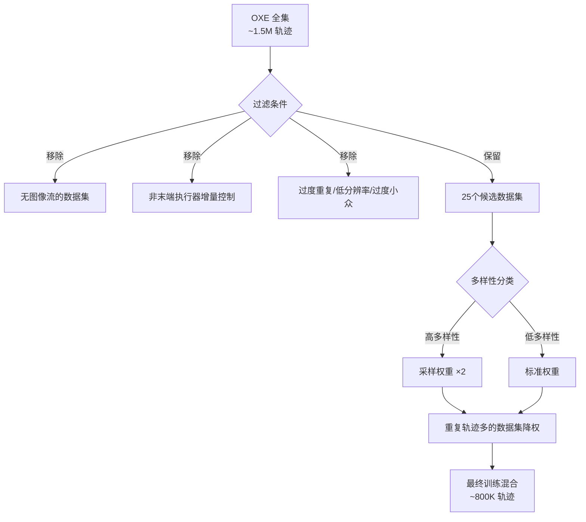
```mermaid
flowchart TD
    A["OXE 全集<br/>~1.5M 轨迹"] --> B{"过滤条件"}
    B -->|移除| C["无图像流的数据集"]
    B -->|移除| D["非末端执行器增量控制"]
    B -->|移除| E["过度重复/低分辨率/过度小众"]
    B -->|保留| F["25个候选数据集"]
    F --> G{"多样性分类"}
    G -->|高多样性| H["采样权重 ×2"]
    G -->|低多样性| I["标准权重"]
    H --> J["重复轨迹多的数据集降权"]
    I --> J
    J --> K["最终训练混合<br/>~800K 轨迹"]
```

**前三大数据集**各占 17.0% 的采样权重：Fractal (Google RT-1 Robot 数据)、Kuka、**Bridge** (即 BridgeData V2)。BC-Z 占 9.1%，其余 21 个数据集按规模和多样性递减分配权重。

### 3.2 数据对齐处理

多数据集异构性是 Octo 面临的核心工程挑战。具体对齐策略包括：

**观测对齐**：
- 缺失的相机通道进行零填充（zero-pad）
- 第三人称相机图像：随机裁剪 → resize 至 $256 \times 256$ → 颜色抖动 → 归一化至 $[-1, 1]$
- 腕部相机图像：resize 至 $128 \times 128$（不做随机裁剪）→ 颜色抖动 → 归一化至 $[-1, 1]$

**动作空间对齐**：
- 统一夹爪语义：$+1$ 表示"夹爪打开"，$0$ 表示"夹爪关闭"
- 绝对夹爪动作表示优于相对表示（消融验证）

**任务条件对齐**：
- 训练时随机置零语言指令或目标图像，使模型能在两种条件模式间切换
- 无语言标注的数据集始终使用目标图像条件
- 使用 hindsight goal relabeling：从轨迹未来均匀采样状态作为目标图像

### 3.3 与前作数据的关联

从数据演化的角度看，Octo 的训练数据直接包含了 BridgeData V2 的全部内容（占 17% 权重），而 DROID 虽然也属于 OXE 生态，但 Octo 论文的时间线（2024年5月）与 DROID（2024年3月）高度重叠，DROID 的核心数据尚未完全整合进 Octo 的训练混合中。这一点从训练混合的数据集列表中可以确认——25 个数据集中不包含 DROID。

这意味着 Octo 实际上主要受益于 BridgeData V2 的直接贡献和 OXE 其他子集的间接贡献，而 DROID 带来的场景多样性红利要等到后续的 π₀ 才被充分利用。

---

## 4. 模型结构及设计原因

### 4.1 整体架构

Octo 的架构由三个核心组件构成：输入 tokenizer、Transformer 主干和 Readout 头 + 扩散动作头。

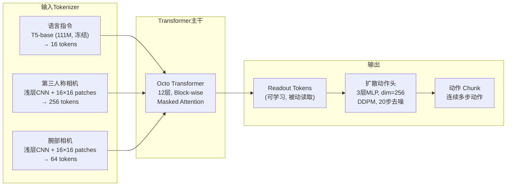
```mermaid
graph LR
    subgraph 输入Tokenizer
        L["语言指令<br/>T5-base (111M, 冻结)<br/>→ 16 tokens"] 
        I1["第三人称相机<br/>浅层CNN + 16×16 patches<br/>→ 256 tokens"]
        I2["腕部相机<br/>浅层CNN + 16×16 patches<br/>→ 64 tokens"]
    end
    
    subgraph Transformer主干
        T["Octo Transformer<br/>12层, Block-wise<br/>Masked Attention"]
    end
    
    subgraph 输出
        R["Readout Tokens<br/>(可学习, 被动读取)"]
        D["扩散动作头<br/>3层MLP, dim=256<br/>DDPM, 20步去噪"]
        A["动作 Chunk<br/>连续多步动作"]
    end
    
    L --> T
    I1 --> T
    I2 --> T
    T --> R
    R --> D
    D --> A
```

### 4.2 模型规格

| 参数 | Octo-Small | Octo-Base |
|------|-----------|-----------|
| Transformer 层数 | 12 | 12 |
| 隐藏维度 $D$ | 384 | 768 |
| MLP 维度 | 1536 | 3072 |
| 注意力头数 | 6 | 12 |
| 总参数量 | 27M | 93M |
| 语言编码器 | T5-base (111M, 冻结) | T5-base (111M, 冻结) |
| 图像 patch 尺寸 | 16×16 | 16×16 |
| 扩散头 | 3层MLP, $d=256$, 残差+LN | 3层MLP, $d=256$, 残差+LN |
| 去噪步数 | 20 | 20 |

### 4.3 扩散动作头的数学形式

Octo 使用标准 DDPM 框架进行动作生成。给定 transformer 输出的 readout embedding $\mathbf{e}$，生成过程从纯噪声开始：

$$\mathbf{x}_K \sim \mathcal{N}(\mathbf{0}, \mathbf{I})$$

然后执行 $K=20$ 步去噪：

$$\mathbf{x}_{k-1} = \alpha\left(\mathbf{x}_k - \gamma \boldsymbol{\epsilon}_\theta(\mathbf{x}_k, \mathbf{e}, k) + \mathcal{N}(\mathbf{0}, \sigma^2 \mathbf{I})\right)$$

其中 $\alpha, \gamma, \sigma$ 由余弦噪声调度确定。训练目标为标准 DDPM 损失：

$$\mathcal{L}_{\text{DDPM}} = \mathbb{E}_{k \sim [1,K], \boldsymbol{\epsilon} \sim \mathcal{N}(\mathbf{0}, \mathbf{I})} \left[ \left\| \boldsymbol{\epsilon} - \boldsymbol{\epsilon}_\theta(\mathbf{x}_k, \mathbf{e}, k) \right\|^2 \right]$$

其中 $\mathbf{x}_k = \sqrt{\bar{\alpha}_k} \mathbf{x}_0 + \sqrt{1 - \bar{\alpha}_k} \boldsymbol{\epsilon}$ 是对真实动作 $\mathbf{x}_0$ 加噪的结果。

**关键设计决策**：每次动作预测只需**一次** transformer 前向传播，20 步去噪过程完全在参数量极小的扩散头（3层MLP）内完成。这与后续 π₀ 将去噪过程嵌入 transformer 本身的设计形成了对比。

### 4.4 与 RT-1 / RT-2 的架构对比

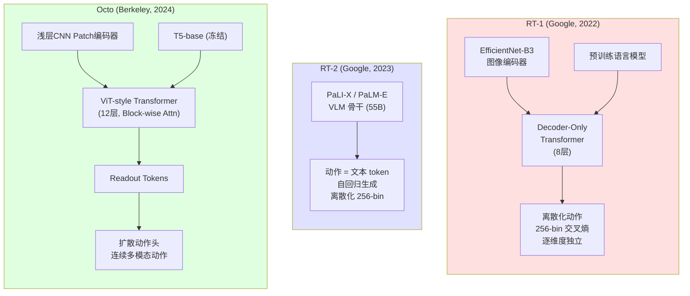
```mermaid
graph TB
    subgraph RT-1["RT-1 (Google, 2022)"]
        direction TB
        R1_V["EfficientNet-B3<br/>图像编码器"] --> R1_T["Decoder-Only<br/>Transformer<br/>(8层)"]
        R1_L["预训练语言模型"] --> R1_T
        R1_T --> R1_A["离散化动作<br/>256-bin 交叉熵<br/>逐维度独立"]
    end
    
    subgraph RT-2["RT-2 (Google, 2023)"]
        direction TB
        R2_VL["PaLI-X / PaLM-E<br/>VLM 骨干 (55B)"] --> R2_A["动作 = 文本 token<br/>自回归生成<br/>离散化 256-bin"]
    end
    
    subgraph Octo["Octo (Berkeley, 2024)"]
        direction TB
        O_C["浅层CNN Patch编码器"] --> O_T["ViT-style Transformer<br/>(12层, Block-wise Attn)"]
        O_L["T5-base (冻结)"] --> O_T
        O_T --> O_R["Readout Tokens"]
        O_R --> O_D["扩散动作头<br/>连续多模态动作"]
    end
    
    style RT-1 fill:#ffe0e0
    style RT-2 fill:#e0e0ff
    style Octo fill:#e0ffe0
```

| 设计维度 | RT-1 | RT-2 | **Octo** |
|---------|------|------|----------|
| 视觉编码 | EfficientNet-B3 (大型CNN) | 预训练VLM内置 | **浅层CNN patch (极轻量)** |
| 语言理解 | 预训练语言模型 | VLM内置 (互联网规模) | **T5-base (111M, 冻结)** |
| 动作表示 | 离散256-bin | 离散256-bin (文本token) | **连续扩散 (DDPM)** |
| 多模态动作 | 不支持 | 不支持 | **原生支持** |
| 动作分块 | 单步 | 单步 | **多步chunk** |
| 参数量 | 35M | 55B | **93M** |
| 微调灵活性 | 输入锁定 | 输入锁定 | **模块化增删** |
| 开源状态 | 仅检查点 | 不公开 | **完整开源** |

---

## 5. 训练方法（算法与工程）

### 5.1 预训练配置

| 超参数 | 值 |
|-------|---|
| 优化器 | AdamW |
| 学习率 | $3 \times 10^{-4}$ |
| 学习率调度 | 逆平方根衰减 (reciprocal square-root) |
| 预热步数 | 2,000 |
| 权重衰减 | 0.1 |
| 梯度裁剪 | 1.0 |
| Batch Size | 2,048 |
| 训练步数 | 300,000 (Octo-Base) |
| 观测历史 | 2 帧 |
| 硬件 | TPU v4-128 pod |
| 训练时长 | **14 小时** |

### 5.2 数据加载工程

并行加载 25 个异构数据集的 shuffle 是 Octo 面临的核心工程挑战之一。具体发现：

- **小 shuffle buffer (20k)** 会导致零样本性能严重下降——因为连续的训练样本来自同一轨迹或同一数据集，破坏了 i.i.d. 假设
- **解决方案**：在解码图像之前先对来自不同轨迹的帧进行 shuffle 和交错（interleave），将 shuffle buffer 扩大到 **500k**
- 每条训练轨迹最多随机采样 100 步，避免单条超长轨迹"挤占" shuffle buffer

这一工程优化对 Octo 的最终性能至关重要，也为后续在更大数据集上训练 π₀ 积累了宝贵经验。

### 5.3 微调方案

Octo 的微调方案强调**简洁性和通用性**——所有微调实验使用完全相同的配方：

$$\text{微调配方} = \begin{cases} \text{数据}: \sim 100 \text{ 条目标域示教} \\ \text{步数}: 50,000 \\ \text{学习率}: \text{余弦衰减 + 线性预热} \\ \text{参数更新}: \text{全参数微调} \\ \text{硬件}: \text{单块 NVIDIA A5000 (24GB)} \\ \text{时长}: \sim 5 \text{ 小时} \end{cases}$$

微调时的**模块化能力**是 Octo 最关键的工程特性：
- **新动作空间**：替换扩散动作头（如从 7D 末端执行器切换到 14D ALOHA 关节控制）
- **新观测模态**：添加新的位置嵌入和轻量编码器（如力/力矩传感器）
- **新机器人构型**：完整保留预训练 transformer 权重，仅更新新增组件

实验表明全参数微调优于冻结预训练参数子集的方案。

---

## 6. 实验关键发现与效果对比

### 6.1 零样本多机器人控制

在 WidowX、UR5 和 RT-1 Robot 三种机器人上的语言条件任务评估中：

| 模型 | 参数量 | WidowX | UR5 | RT-1 Robot | 平均 | 开源 |
|------|-------|--------|-----|-----------|------|------|
| RT-1-X | 35M | 低 | 低 | 低 | 基线 | 仅检查点 |
| **Octo** | **93M** | **高** | **高** | **高** | **+29%** | **完整开源** |
| RT-2-X | 55B | 与Octo相当 | - | 与Octo相当 | - | 不公开 |

关键发现：
- Octo (93M) 平均成功率比 RT-1-X (35M) **高出 29 个百分点**
- 在 WidowX 和 RT-1 Robot 上，Octo 与 RT-2-X (55B) **表现相当**——参数量小了近 600 倍
- 目标图像条件的性能比语言条件**高 25%**，因为目标图像提供了更丰富的任务完成信息

### 6.2 微调效果

| 评估设置 | ResNet+Trans. Scratch | VC-1 | **Octo** | 特殊说明 |
|---------|----------------------|------|----------|---------|
| Berkeley Insertion | 10% | 5% | **70%** | *新观测（力/力矩） |
| Stanford Coffee | 45% | 0% | **75%** | |
| CMU Baking | 25% | 30% | **50%** | |
| Berkeley Pick-Up | 0% | 0% | **60%** | 新动作空间（关节控制） |
| Berkeley Coke | 20% | 10% | **100%** | 全新 ViperX 机器人 |
| Berkeley Bimanual | 20% | 50% | **80%** | 新动作空间（14D ALOHA） |
| **平均** | **20%** | **15%** | **72%** | **+52pp vs 次优** |

Octo 微调后平均 72% 的成功率，比次优基线（从零训练 20%）高出 **52 个百分点**。尤其值得注意的是：
- 在完全未见过的 ViperX 机器人上达到 **100%** 成功率（Berkeley Coke）
- 在双臂 ALOHA 的 14 维关节动作空间上达到 **80%**（Berkeley Bimanual）
- 在引入力/力矩传感器新观测的精密插入任务上达到 **70%**（Berkeley Insertion）

### 6.3 泛化能力细粒度分析

在 BridgeV2 WidowX 设置上进行的分层泛化分析揭示了当前 GRP 的能力边界：

| 泛化类型 | 代表任务 | 成功率 |
|---------|---------|-------|
| 分布内任务 | Put carrot on plate / Put eggplant in pot | **85%** |
| 新物体 | Put bread on plate / Put spoon on glove | **80%** |
| 新环境 | Put mushroom in pot / Put spoon on cloth | **40%** |
| 新技能 | Flip cup on its side / Put block in slot | **5%** |

这一梯度式退化清晰地揭示了：**物体层面的泛化已基本解决，环境层面的泛化部分实现，但技能层面的迁移仍是根本性瓶颈**。新物体泛化的成功（80%）得益于 OXE 数据的物体多样性；新技能的严重退化（5%）则表明，仅靠数据规模不足以实现技能组合泛化——这为后续引入 VLM 骨干（π₀）提供了直接动机。

---

## 7. 消融实验的发现

所有消融实验在 Octo-Small 上进行，在 WidowX 设置上评估（4 个任务，40 次试验的平均成功率）。

### 7.1 动作头比较——里程碑式发现

| 动作预测方式 | 成功率 | 定性表现 |
|------------|-------|---------|
| **扩散解码头 (DDPM)** | **83%** | 果断且精确 |
| 连续动作 MSE 损失 | 35% | "对冲"行为，移动极慢 |
| 离散化 256-bin 交叉熵 (RT-1式) | 18% | 较"果断"但抓取缺乏精度 |

**深层原因分析**：

$$\underbrace{\text{扩散头}}_{\text{多模态 + 连续}} \gg \underbrace{\text{MSE 头}}_{\text{单模态 + 连续}} \gg \underbrace{\text{离散头}}_{\text{多模态 + 离散}}$$

- **MSE 头**无法建模多模态动作分布。当训练数据中同一观测对应多种合理动作时（例如可以向左绕过或向右绕过障碍物），MSE 头会回归到多个模式的均值，产生"对冲"行为
- **离散头**虽然能建模多模态分布（通过分类概率），但 256-bin 的量化精度不足以支持精细的连续控制
- **扩散头**同时具备多模态建模能力（通过去噪采样）和连续精度（不量化），是两者的最优组合

这一发现的影响极为深远：它直接否定了 RT-1/RT-2 的离散化路线，并为 π₀ 选择流匹配（flow matching，可视为扩散的改进形式）提供了最强有力的实验依据。

### 7.2 架构消融

| 架构 | 成功率 | 说明 |
|-----|-------|------|
| **ViT-style Transformer-first** | **83%** | 浅层CNN patch + 大transformer |
| ResNet-50 + Transformer | 70% | RT-1式大CNN + 小transformer |

ViT 架构在大规模多样数据上的优势为 13 个百分点，但在小数据集（~100 条）从零训练时 ResNet 反而更好。这揭示了一个重要的**数据-架构交互效应**：transformer-first 架构的优势需要大规模数据来激活。

### 7.3 训练数据消融

| 训练数据 | 成功率 |
|---------|-------|
| **完整 25 数据集混合 (800K)** | **83%** |
| RT-X 的 11 数据集子集 (350K) | 60% |
| 仅 Bridge Data (单机器人) | 43% |

数据集数量的增加带来了**单调递增**的性能提升（43% → 60% → 83%），暗示进一步扩展数据混合可能会继续改善策略性能。这一发现与 BridgeData V2 和 DROID 的"更多数据 → 更好泛化"结论完全一致，并从模型训练的角度予以了验证。

### 7.4 模型规模消融

| 模型 | 参数量 | WidowX | UR5 |
|-----|-------|--------|-----|
| Octo-Tiny | 10M | 低 | 低 |
| Octo-Small | 27M | 中 | 中 |
| **Octo-Base** | **93M** | **高** | **高** |

零样本性能随模型规模单调递增。Base 模型对初始场景配置更鲁棒，不易过早尝试抓取，表明更大模型具有更好的视觉场景感知能力。

### 7.5 其他消融发现

| 发现 | 效果 | 启示 |
|-----|------|------|
| 1 帧观测历史有益，更多帧收益递减 | + | 2帧为最优性价比 |
| 16×16 patch 优于 32×32 patch | + | 但token数增加4倍 |
| 加入本体感知输入 | **-** | 因果混淆问题 |
| 冻结 T5-base 效果最好 | = | 微调/增大编码器均未改善 |
| 绝对夹爪动作 > 相对表示 | + | 相对表示缺乏失败后重试行为 |

本体感知（proprioception）输入反而降低性能这一反直觉发现，揭示了行为克隆中的**因果混淆**问题——模型可能学会直接从当前状态预测下一状态（而非学习真正的控制策略），导致测试时的累积误差。这一问题在后续的 π₀ 中通过更大的模型容量和更丰富的数据得到了缓解。

---

## 8. 优化有效性评估

### 8.1 设计选择有效性排名

根据消融实验的量化影响，Octo 各设计选择的有效性可排列如下：

| 排名 | 设计选择 | 影响量级 | 证据强度 |
|-----|---------|---------|---------|
| 1 | 扩散动作头（vs 离散化） | +65pp (83% vs 18%) | 极强（直接消融） |
| 2 | 扩散动作头（vs MSE） | +48pp (83% vs 35%) | 极强（直接消融） |
| 3 | 数据规模（25集 vs 单集） | +40pp (83% vs 43%) | 极强（直接消融） |
| 4 | 预训练+微调（vs 从零训练） | +52pp (72% vs 20%) | 极强（6任务平均） |
| 5 | 数据规模（25集 vs 11集） | +23pp (83% vs 60%) | 强（直接消融） |
| 6 | ViT架构（vs ResNet+Trans） | +13pp (83% vs 70%) | 强（直接消融） |
| 7 | 模型规模（Base vs Tiny） | 持续提升 | 中（3点趋势） |

### 8.2 整体评估

Octo 最核心的贡献不是任何单一的技术创新，而是**正确组合的系统工程**：将 transformer-first 架构、扩散动作头、分块注意力掩码、readout token、大规模多数据集训练、以及开源生态结合为一个连贯的系统。每个组件都有先前工作的影子——扩散策略来自 Chi et al.，动作分块来自 ACT，ViT 架构来自 Dosovitskiy et al.——但 Octo 首次在跨构型泛化策略的场景中验证了这些组件的协同效果。

**开源 + 可微调**作为使能因素的价值难以高估：它使得任何研究组都能以 ~100 条示教 + 5 小时 GPU 时间的成本，在自己的机器人上获得一个比从零训练好 52 个百分点的策略起点。这一实用价值直接推动了 Octo 在社区中的广泛采用，也为 PI 后续模型的快速迭代提供了用户反馈基础。

---

## 9. 与后续工作的关联

### 9.1 从 Octo 到 π₀：直接的技术传承

Octo 与 π₀ 之间存在极为直接的技术和人员传承关系。Octo 的多位核心作者（Karl Pertsch、Kevin Black、Sudeep Dasari 等）随后成为 Physical Intelligence 的创始成员，Octo 的关键发现直接塑造了 π₀ 的设计决策：

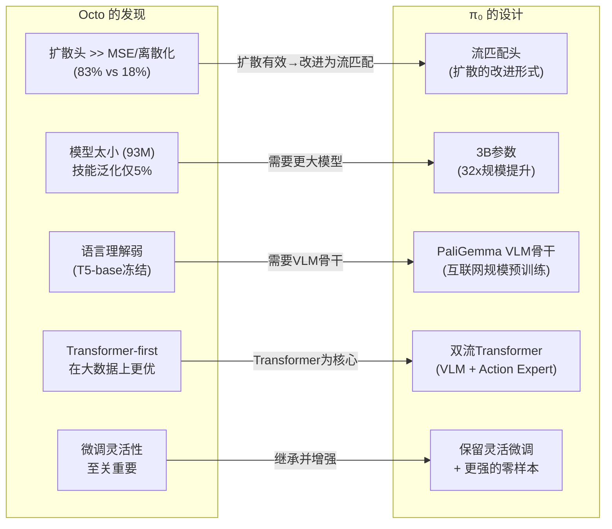
```mermaid
graph LR
    subgraph "Octo 的发现"
        O1["扩散头 >> MSE/离散化<br/>(83% vs 18%)"]
        O2["模型太小 (93M)<br/>技能泛化仅5%"]
        O3["语言理解弱<br/>(T5-base冻结)"]
        O4["Transformer-first<br/>在大数据上更优"]
        O5["微调灵活性<br/>至关重要"]
    end
    
    subgraph "π₀ 的设计"
        P1["流匹配头<br/>(扩散的改进形式)"]
        P2["3B参数<br/>(32x规模提升)"]
        P3["PaliGemma VLM骨干<br/>(互联网规模预训练)"]
        P4["双流Transformer<br/>(VLM + Action Expert)"]
        P5["保留灵活微调<br/>+ 更强的零样本"]
    end
    
    O1 -->|"扩散有效→改进为流匹配"| P1
    O2 -->|"需要更大模型"| P2
    O3 -->|"需要VLM骨干"| P3
    O4 -->|"Transformer为核心"| P4
    O5 -->|"继承并增强"| P5
```

### 9.2 Octo 的局限性如何激发 π₀

Octo 论文坦诚指出的几个不足，每一个都成为 π₀ 的直接设计动机：

**局限 1：模型太小 → π₀ 的 3B 参数**

Octo 仅 93M 参数，在新技能泛化上几乎完全失败（5%）。π₀ 将参数量提升至约 3B（PaliGemma 2-3B + 300M Action Expert），通过 32 倍的规模提升来获得更强的表征能力。

**局限 2：无 VLM 骨干 → π₀ 的 PaliGemma 集成**

Octo 使用冻结的 T5-base（111M）作为语言编码器，且消融表明增大编码器或微调均无益——这是因为训练数据中缺乏丰富的自由格式语言标注。π₀ 通过引入 PaliGemma（SigLIP + Gemma LLM，在互联网规模数据上预训练）作为视觉-语言骨干，从根本上解决了语言理解的瓶颈。

**局限 3：扩散 → 流匹配**

Octo 使用标准 DDPM 的 20 步去噪，虽然效果远好于 MSE/离散化，但推理延迟仍较高。π₀ 改用流匹配（flow matching），这是扩散的改进形式，训练更稳定、采样更高效，且可以用更少的步数达到类似质量。

**局限 4：腕部相机和语言条件的不足**

Octo 仅 27% 的训练数据包含腕部相机，仅 56% 包含语言标注，导致这两个模态的性能显著低于预期。π₀ 通过 10,000+ 小时的高质量双相机遥操作数据和全面的语言标注来解决这一问题。

### 9.3 更广泛的技术路线图

在 PI 的完整演化链中，Octo 扮演了**概念验证者**的角色：

| 阶段 | 论文 | 核心贡献 | 核心局限 |
|-----|------|---------|---------|
| 数据 1 | BridgeData V2 (Ch1) | 低成本大规模数据 | 单平台、有限环境 |
| 数据 2 | DROID (Ch2) | 场景多样性 | 单平台、无统一模型 |
| **模型 1** | **Octo (Ch3)** | **首个开源GRP、扩散头验证** | **模型太小、无VLM** |
| 模型 2 | π₀ (Ch4) | VLA 架构、流匹配、万小时数据 | 推理速度、离散任务 |
| 模型 3 | π₀-FAST (Ch5) | 自回归+FSQ混合架构 | - |
| 模型 4 | π₀.₅ (Ch7) | 知识隔离、离散状态输入 | - |

Octo 证明了三件事：(1) 扩散动作头是正确的方向；(2) 开源可微调的通用策略有巨大的实用价值；(3) 93M 参数不够大。这三个结论共同指向了 π₀ 的设计空间——更大的模型、更强的视觉-语言骨干、更高效的生成目标。

### 9.4 人员传承

Octo 团队与 PI 创始团队的重叠度极高：
- **Karl Pertsch** — Octo 共同第一作者，后成为 PI 核心成员
- **Kevin Black** — Octo 共同第一作者（负责训练基础设施），后成为 PI 核心成员
- **Sudeep Dasari** — Octo 作者（CMU 评估），后参与 PI
- **Chelsea Finn、Sergey Levine** — Octo 资深作者，PI 顾问

这种直接的人员传承确保了 Octo 的技术洞见被完整地带入 π₀ 的设计中，也解释了为什么 π₀ 的架构决策（流匹配头、transformer-first、可微调）与 Octo 的消融发现如此精确地对应。

---

## 总结

Octo 标志着机器人学习从**数据积累期**进入**模型构建期**的关键转折。它不是一个参数量惊人的模型，也不是一个在所有任务上都表现卓越的系统——但它是第一个将"开源、通用、可微调"三个关键属性集于一身的机器人策略。其最重要的遗产不是 93M 参数的检查点本身，而是它通过系统的消融实验确立的设计原则：**扩散优于离散化，transformer-first 优于 CNN-first，更多数据集始终更好，模块化设计使迁移成为可能**。这些原则直接构成了 π₀ 及后续 VLA 模型设计的基石。


---

---

# 第二部分：PI 正式论文


# 第四章：$\pi_0$ — 基于视觉-语言-动作流模型的通用机器人控制

> **本章定位**：$\pi_0$ 是 Physical Intelligence (PI) 系列论文中最核心、最重要的一篇。它标志着 PI 从数据集建设和小规模模型（Octo, 93M 参数）向大规模视觉-语言-动作 (VLA) 基础模型的根本性跨越。本章将对 $\pi_0$ 进行全面深入的技术分析，并与前作 Octo（第三章）、RT-2、OpenVLA 等 VLA 基线进行广泛的横向比较。$\pi_0$ 提出的双流架构 (VLM + Action Expert) 与流匹配动作生成范式，构成了 PI 后续所有工作（FAST、Hi Robot、$\pi_{0.5}$、Knowledge Insulation）的技术基石。

---

## 论文信息

| 项目 | 内容 |
|------|------|
| **论文标题** | $\pi_0$: A Vision-Language-Action Flow Model for General Robot Control |
| **发表时间** | 2024年10月31日 |
| **arXiv** | [2410.24164](https://arxiv.org/abs/2410.24164) |
| **机构** | Physical Intelligence, San Francisco, California, USA |
| **核心作者** | Kevin Black, Noah Brown, Danny Driess, Chelsea Finn, Karol Hausman, Brian Ichter, Sergey Levine, Karl Pertsch, Suraj Nair, Quan Vuong, Lucy Xiaoyang Shi 等 24 人 |
| **模型参数** | 3.3B（VLM 骨干 3B + Action Expert 300M） |
| **训练数据** | 10,000+ 小时，7 种机器人配置，68 个任务 |
| **核心贡献** | 首个将 flow matching 与预训练 VLM 结合的 VLA 模型 |

**作者传承关系**：多位核心作者直接从 Octo 团队（UC Berkeley / Stanford / Google DeepMind）转入 PI。Kevin Black、Karl Pertsch、Suraj Nair 既是 Octo 的核心贡献者，也是 $\pi_0$ 的模型设计主力。Chelsea Finn 和 Sergey Levine 同时担任两篇论文的资深作者。这种人员连续性意味着 $\pi_0$ 的设计决策直接吸取了 Octo 的经验教训——特别是 Octo 消融实验中发现的 "扩散头远超离散化"（83% vs 18%）这一关键洞察。

---

## 1. 解决了什么问题 & 相对前作的定位

### 1.1 核心问题：VLA 的根本设计矛盾

构建通用机器人基础模型面临一个核心设计矛盾：**互联网规模的语义知识**与**高频精确的动作控制**之间的张力。

2024 年之前，这一矛盾在不同路线中表现得尤为突出：

| 路线 | 代表工作 | 语义理解 | 动作精度 | 核心限制 |
|------|----------|----------|----------|----------|
| 小模型 + 扩散 | Octo (93M) | 弱（无 VLM） | 中（扩散头） | 太小，语言理解有限 |
| 大 VLM + 离散化 | RT-2 (55B) | 强（PaLM-E） | 弱（256 bin） | 离散化精度不足，推理极慢 |
| 中等 VLM + 离散化 | OpenVLA (7B) | 中（Llama） | 弱（256 bin） | 不支持 action chunk，灵巧控制失败 |
| 小模型 + 专项 | ACT / Diffusion Policy | 无 | 强 | 无预训练，无泛化，无语言 |

**没有任何现有方法同时具备强语义理解与高精度连续动作控制能力。**

### 1.2 Octo 的局限性

Octo（第三章）作为 $\pi_0$ 的直接前驱，其消融实验提供了至关重要的经验基础，但也暴露了根本性局限：

1. **模型规模过小**（93M 参数）：在跨具身、多任务场景下表征能力严重不足。Octo 在新技能（未见过的操作）上成功率骤降至 5%，揭示了小模型的泛化天花板。
2. **无 VLM 骨干**：使用冻结的 T5-base（111M）编码语言，缺乏视觉-语言联合推理能力。语言条件性能显著低于目标图像条件，且加入更大语言编码器也未改善。
3. **架构限制**：readout token + MLP 扩散头的设计虽然高效，但扩散过程仅在 3 层 MLP 中完成，无法建模复杂的条件动作分布。
4. **本体感知困境**：Octo 加入 proprioception 反而导致性能下降（因果混淆），而 $\pi_0$ 需要 proprioception 来支持 50Hz 灵巧控制。

### 1.3 RT-2 / OpenVLA 路线的失败

自回归离散化路线的核心缺陷在于**将连续动作空间离散化为有限 bin**：

$$a_{\text{discrete}} = \text{quantize}(a_{\text{continuous}}, \text{bins}=256)$$

- **精度损失**：对于 $d=18$ 维动作空间，每个维度仅 256 个离散值，量化误差 $\Delta a = \frac{a_{\max} - a_{\min}}{2 \times 256}$，在灵巧操作（如折叠衣物、装蛋）中造成关键精度不足。
- **不支持 action chunk**：RT-2/OpenVLA 逐步预测单个动作 token，无法利用时间相关性，每个控制步都需要完整的 VLM 前向传播，导致 55B 模型推理频率远低于实时需求。
- **多模态分布建模失败**：交叉熵损失假设单峰分布，无法表示"向左或向右都可以绕过障碍物"这类多模态动作分布。

### 1.4 $\pi_0$ 的解决方案

$\pi_0$ 提出了一种全新的**双流融合架构**：

$$\pi_0 = \underbrace{\text{PaliGemma (3B)}}_{\text{语义理解}} + \underbrace{\text{Action Expert (300M)}}_{\text{动作生成}} + \underbrace{\text{Flow Matching}}_{\text{连续分布建模}}$$

这一设计同时解决了上述所有矛盾：VLM 骨干提供互联网规模的语义知识；Action Expert 专门处理机器人状态和动作，避免训练信号冲突；Flow Matching 生成连续动作分布，支持 50Hz action chunk。

---

## 2. 创新点

### 创新点枚举与重要性评估

| 编号 | 创新点 | 重要性等级 | 说明 |
|------|--------|-----------|------|
| I-1 | Flow Matching 动作生成 | **变革性** | 首次将 flow matching 引入 VLA，替代离散化和标准扩散 |
| I-2 | 双流架构（VLM + Action Expert） | **变革性** | 解决 VLM 与动作生成的训练信号冲突问题 |
| I-3 | 10,000+ 小时跨具身预训练 | **重大** | 截至当时最大规模的机器人学习实验 |
| I-4 | Pre-training / Post-training 训练范式 | **重大** | 将 LLM 的两阶段训练范式引入机器人基础模型 |
| I-5 | PaliGemma 作为 VLM 骨干 | **重大** | 3B 参数的实时控制友好选择 |
| I-6 | 三段式注意力掩码 | **显著** | 最小化分布偏移 + 推理 KV 缓存优化 |
| I-7 | 偏向高噪声的时间步采样 | **显著** | 针对动作预测特性的定制化设计 |

### 创新点 I-1：Flow Matching 动作生成（变革性）

Flow Matching 是 $\pi_0$ 最核心的技术选择。相比三种替代方案：

**vs 自回归离散化（RT-2, OpenVLA）**：
- Flow matching 输出连续值，无量化误差
- 支持 action chunk（$H=50$ 步一次性生成），自回归模型逐步生成
- 建模多模态分布，离散化假设单峰

**vs DDPM 扩散（Octo, Diffusion Policy）**：
- Flow matching 使用线性概率路径 $q(A_t^\tau | A_t) = \mathcal{N}(\tau A_t, (1-\tau)I)$，比 DDPM 的余弦/线性噪声调度更简洁
- 推理仅需 10 步 Euler 积分（vs Octo 的 20 步 DDPM 去噪），速度更快
- 训练目标直接匹配向量场，梯度更稳定

**vs MSE 回归**：
- MSE 假设单峰高斯分布，对多模态动作产生"对冲"行为（Octo 消融：MSE 仅 35%）
- Flow matching 天然建模多模态分布

### 创新点 I-2：双流架构（变革性）

受 Transfusion 和 Mixture of Experts 启发，$\pi_0$ 将 transformer 分为两组权重：

1. **VLM 骨干**（3B, PaliGemma 初始化）：处理图像 $[I_t^1, ..., I_t^n]$ 和语言 $\ell_t$
2. **Action Expert**（300M, 从头初始化）：处理本体感知 $q_t$ 和带噪动作 $A_t^\tau$

两组权重仅通过 self-attention 层的 key-value 交互。这一设计的关键优势：

- **避免训练信号冲突**：flow matching 的回归损失不会干扰 VLM 骨干的预训练表征
- **推理效率**：10 步 flow matching 迭代中，只需重新计算 Action Expert 的前向传播，VLM 骨干的 KV 可缓存
- **模块化扩展**：后续可独立替换 VLM 骨干或 Action Expert

---

## 3. 数据来源、处理方式及其原因

### 3.1 预训练数据组成

$\pi_0$ 的预训练数据集由两大部分组成，总计约 10,000+ 小时：

$$\mathcal{D}_{\text{pretrain}} = \underbrace{\mathcal{D}_{\pi}}_{\text{PI 自有数据 (90.9\%)}} \cup \underbrace{\mathcal{D}_{\text{OXE+}}}_{\text{开源数据 (9.1\%)}}$$

| 数据来源 | 时间步数 | 占比 | 控制频率 | 特点 |
|----------|---------|------|----------|------|
| PI 双臂机器人 | 797M | ~80% | 50 Hz | 灵巧操作：洗衣、餐具、组装 |
| PI 单臂机器人 | 106M | ~11% | 20 Hz | 基础操作：抓取、放置 |
| OXE Magic Soup | ~90M | ~9.1% | 2-10 Hz | 场景/物体多样性：22 种机器人 |
| Bridge v2 | (含于 OXE) | - | 5 Hz | 桌面操作多样性 |
| DROID | (含于 OXE) | - | 10 Hz | 野外场景多样性 |

**与 Octo 的数据规模对比**：

$$\frac{|\mathcal{D}_{\pi_0}|}{|\mathcal{D}_{\text{Octo}}|} = \frac{\sim 993\text{M steps}}{800\text{K trajectories} \times \sim 100\text{ steps}} \approx 12.4\times$$

### 3.2 机器人平台覆盖

7 种机器人配置的统一动作空间设计：

$$\dim(a_t) = \dim(q_t) = 18 \quad \text{(最大维度：双6-DoF臂 + 2夹爪 + 移动底盘 + 升降躯干)}$$

对维度不足 18 的机器人进行零填充（zero-padding），图像不足 3 张的进行 mask 处理。

| 机器人平台 | 手臂配置 | 动作维度 | 相机数 | 控制频率 |
|-----------|---------|---------|--------|---------|
| UR5e | 单 7-DoF | 7 | 2 | 20 Hz |
| 双臂 UR5e | 双 7-DoF | 14 | 3 | 20 Hz |
| Franka | 单 7-DoF | 8 | 2 | 20 Hz |
| 双臂 Trossen | 双 6-DoF (ALOHA) | 14 | 3 | 50 Hz |
| 双臂 ARX/AgileX | 双 6-DoF | 14 | 3 | 50 Hz |
| 移动 Trossen/ARX | 双 6-DoF + 非全向底盘 | 16 | 3 | 50 Hz |
| 移动 Fibocom | 双 6-DoF + 全向底盘 | 17 | 3 | 50 Hz |

### 3.3 数据平衡策略

采用幂律权重平衡不同任务-机器人组合的采样频率：

$$w_{(task, robot)} = n_{(task, robot)}^{0.43}$$

其中 $n$ 为该组合的样本数量。指数 0.43 的选择意味着：
- 若某组合数据量增加 10 倍，其采样权重仅增加 $10^{0.43} \approx 2.7$ 倍
- 有效降低过度表示的组合权重（如洗衣折叠数据过多），同时不完全忽略大数据量任务中包含的丰富行为多样性

### 3.4 语言标注

预训练使用两种语言标签的组合：
1. **任务名称**（task name）：如 "fold laundry"、"bus the table"
2. **段落级标注**（segment annotation）：约 2 秒粒度的子轨迹描述，如 "pick up the napkin"、"place the plate in the bin"

这种双粒度标注策略为后续的语言条件控制和高层 VLM 策略分解提供了基础。

---

## 4. 模型结构及设计原因

### 4.1 总体架构

$\pi_0$ 总参数量为 3.3B，由以下组件构成：

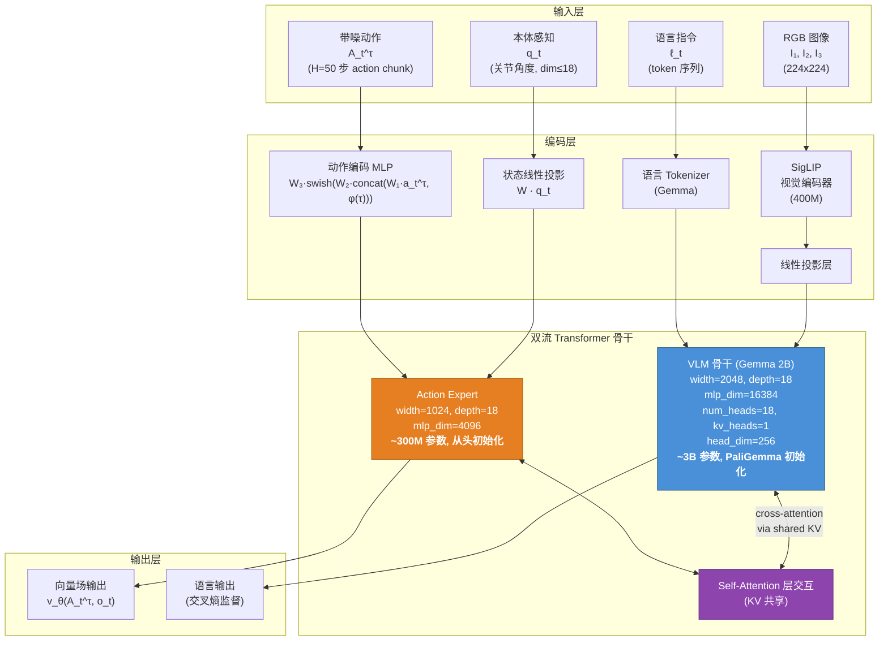
```mermaid
graph TB
    subgraph 输入层["输入层"]
        IMG["RGB 图像<br/>I₁, I₂, I₃<br/>(224x224)"]
        LANG["语言指令<br/>ℓ_t<br/>(token 序列)"]
        STATE["本体感知<br/>q_t<br/>(关节角度, dim≤18)"]
        NOISE["带噪动作<br/>A_t^τ<br/>(H=50 步 action chunk)"]
    end

    subgraph 编码层["编码层"]
        SIGLIP["SigLIP<br/>视觉编码器<br/>(400M)"]
        PROJ1["线性投影层"]
        TOK["语言 Tokenizer<br/>(Gemma)"]
        SPROJ["状态线性投影<br/>W · q_t"]
        AMLP["动作编码 MLP<br/>W₃·swish(W₂·concat(W₁·a_t^τ, φ(τ)))"]
    end

    subgraph 骨干层["双流 Transformer 骨干"]
        VLM["VLM 骨干 (Gemma 2B)<br/>width=2048, depth=18<br/>mlp_dim=16384<br/>num_heads=18, kv_heads=1<br/>head_dim=256<br/><b>~3B 参数, PaliGemma 初始化</b>"]
        AE["Action Expert<br/>width=1024, depth=18<br/>mlp_dim=4096<br/><b>~300M 参数, 从头初始化</b>"]
        SA["Self-Attention 层交互<br/>(KV 共享)"]
    end

    subgraph 输出层["输出层"]
        VOUT["向量场输出<br/>v_θ(A_t^τ, o_t)"]
        LOUT["语言输出<br/>(交叉熵监督)"]
    end

    IMG --> SIGLIP --> PROJ1 --> VLM
    LANG --> TOK --> VLM
    STATE --> SPROJ --> AE
    NOISE --> AMLP --> AE
    VLM <--> |"cross-attention<br/>via shared KV"| SA
    AE <--> SA
    AE --> VOUT
    VLM --> LOUT

    style VLM fill:#4a90d9,stroke:#2c5f8a,color:white
    style AE fill:#e67e22,stroke:#a85d15,color:white
    style SA fill:#8e44ad,stroke:#6c2c8a,color:white
```

### 4.2 VLM 骨干详细参数

基于 PaliGemma 的 VLM 骨干包含两个子组件：

**SigLIP 视觉编码器**：
- 输入：$n$ 张 RGB 图像（$n \in \{2, 3\}$），分辨率 $224 \times 224$
- 输出：图像 patch 嵌入，投影到 Gemma 嵌入空间

**Gemma 2B 语言模型**：

$$\text{Gemma 2B}: \begin{cases} \text{width} = 2048 \\ \text{depth} = 18 \text{ layers} \\ \text{mlp\_dim} = 16{,}384 \\ \text{num\_heads} = 18 \\ \text{num\_kv\_heads} = 1 \text{ (Multi-Query Attention)} \\ \text{head\_dim} = 256 \end{cases}$$

Multi-Query Attention (MQA) 的使用对推理效率至关重要：所有 18 个 query head 共享 1 个 KV head，大幅减少 KV cache 的内存开销。

### 4.3 Action Expert 详细设计

Action Expert 与 VLM 骨干共享相同的层数（depth=18），但宽度大幅缩减：

$$\text{Action Expert}: \begin{cases} \text{width} = 1024 \quad (\text{vs VLM 的 } 2048) \\ \text{mlp\_dim} = 4{,}096 \quad (\text{vs VLM 的 } 16{,}384) \\ \text{参数量} \approx 300\text{M} \quad (\text{vs VLM 的 } 3\text{B}) \end{cases}$$

**动作编码 MLP**：将带噪动作和 flow matching 时间步编码为 transformer 嵌入：

$$e_{a_t^\tau} = W_3 \cdot \text{swish}\left(W_2 \cdot \text{concat}\left(W_1 \cdot a_{t'}^\tau, \; \phi(\tau)\right)\right)$$

其中 $\phi: \mathbb{R} \to \mathbb{R}^w$ 为正弦位置编码函数，$W_1 \in \mathbb{R}^{w \times d}$, $W_2 \in \mathbb{R}^{w \times 2w}$, $W_3 \in \mathbb{R}^{w \times w}$，$d$ 为动作维度，$w=1024$ 为 Action Expert 宽度。

**与 VLM 骨干的交互机制**：两组权重实现为单个 transformer 的两个 expert（类似 Mixture of Experts），token 路由规则为：
- 图像 token + 语言 token $\to$ VLM 骨干
- 状态 token $q_t$ + 动作 token $A_t^\tau$ $\to$ Action Expert
- 交互**仅通过 self-attention 层的 KV 共享**：Action Expert 的 query 可以 attend 到 VLM 骨干产生的 key-value，反之亦然（受注意力掩码约束）

### 4.4 三段式注意力掩码

$\pi_0$ 使用精心设计的 blockwise causal attention mask，将输入序列分为三个块：

$$\text{Block 1: } [I_t^1, ..., I_t^n, \ell_t] \quad \text{Block 2: } [q_t] \quad \text{Block 3: } [a_t^\tau, ..., a_{t+H-1}^\tau]$$

注意力规则：
- **块内**：完全双向注意力
- **块间**：因果方向（Block 1 不看 Block 2/3，Block 2 不看 Block 3，Block 3 看所有）

设计原因：
1. **Block 1 不看后续块**：最小化与 PaliGemma 预训练的分布偏移——预训练时这些 token 从未见过机器人状态和动作
2. **Block 2 独立成块**：$q_t$ 在 flow matching 的 10 步迭代中不变，其 KV 可被缓存，无需重复计算
3. **Block 3 双向注意力**：动作 chunk 中的 50 个动作 token 互相 attend，建模动作间的时间依赖关系

### 4.5 与前作的架构对比

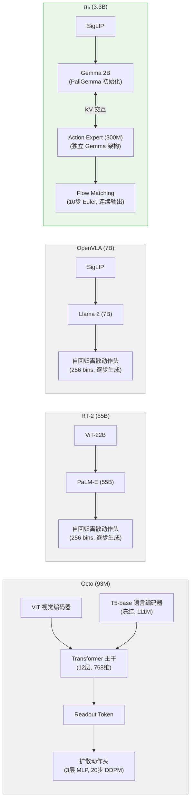
```mermaid
graph LR
    subgraph Octo["Octo (93M)"]
        direction TB
        O_VIT["ViT 视觉编码器"]
        O_T5["T5-base 语言编码器<br/>(冻结, 111M)"]
        O_TF["Transformer 主干<br/>(12层, 768维)"]
        O_READ["Readout Token"]
        O_DIFF["扩散动作头<br/>(3层 MLP, 20步 DDPM)"]
        O_VIT --> O_TF
        O_T5 --> O_TF
        O_TF --> O_READ --> O_DIFF
    end

    subgraph RT2["RT-2 (55B)"]
        direction TB
        R_VIT2["ViT-22B"]
        R_PALM["PaLM-E (55B)"]
        R_AUTO["自回归离散动作头<br/>(256 bins, 逐步生成)"]
        R_VIT2 --> R_PALM --> R_AUTO
    end

    subgraph OpenVLA_arch["OpenVLA (7B)"]
        direction TB
        OV_VIT["SigLIP"]
        OV_LLM["Llama 2 (7B)"]
        OV_AUTO2["自回归离散动作头<br/>(256 bins, 逐步生成)"]
        OV_VIT --> OV_LLM --> OV_AUTO2
    end

    subgraph Pi0["π₀ (3.3B)"]
        direction TB
        P_SIG["SigLIP"]
        P_GEM["Gemma 2B<br/>(PaliGemma 初始化)"]
        P_AE["Action Expert (300M)<br/>(独立 Gemma 架构)"]
        P_FM["Flow Matching<br/>(10步 Euler, 连续输出)"]
        P_SIG --> P_GEM
        P_GEM <--> |"KV 交互"| P_AE
        P_AE --> P_FM
    end

    style Octo fill:#f0f0f0,stroke:#999
    style RT2 fill:#f0f0f0,stroke:#999
    style OpenVLA_arch fill:#f0f0f0,stroke:#999
    style Pi0 fill:#e8f5e9,stroke:#4caf50
```

**核心架构差异总结**：

| 维度 | Octo | RT-2 | OpenVLA | $\pi_0$ |
|------|------|------|---------|---------|
| 总参数量 | 93M | 55B | 7B | 3.3B |
| VLM 骨干 | 无 | PaLM-E | Llama 2 | PaliGemma (Gemma 2B) |
| 视觉编码器 | 浅层 CNN + ViT | ViT-22B | SigLIP | SigLIP |
| 语言编码器 | T5-base (冻结) | PaLM-E 内置 | Llama 2 内置 | Gemma 2B 内置 |
| 动作表示 | 连续（扩散） | 离散（256 bin） | 离散（256 bin） | 连续（flow matching） |
| 动作生成 | DDPM 20 步 | 自回归逐步 | 自回归逐步 | Flow Matching 10 步 |
| Action Chunk | 支持 | 不支持 | 不支持 | 支持（$H=50$） |
| 独立动作权重 | 3 层 MLP 扩散头 | 无 | 无 | 300M Action Expert |
| 推理速度 | 快 | 极慢 | 慢 | 快（73ms on-board） |
| 多模态分布 | 支持 | 不支持 | 不支持 | 支持 |

---

## 5. 训练方法（算法与工程）

### 5.1 Flow Matching 训练目标

$\pi_0$ 的核心训练目标是条件流匹配 (Conditional Flow Matching)。目标是学习一个向量场 $v_\theta$，使得从噪声 $A_t^0 \sim \mathcal{N}(0, I)$ 出发，沿向量场积分可以到达真实动作 $A_t^1 = A_t$。

**线性高斯概率路径**：

$$q(A_t^\tau | A_t) = \mathcal{N}\left(\tau A_t, \; (1-\tau)I\right)$$

即"带噪动作"为真实动作与随机噪声的线性插值：

$$A_t^\tau = \tau A_t + (1-\tau)\epsilon, \quad \epsilon \sim \mathcal{N}(0, I)$$

**条件向量场**（去噪方向）：

$$u(A_t^\tau | A_t) = A_t - \epsilon$$

**训练损失函数**：

$$\boxed{\mathcal{L}_{\text{FM}}(\theta) = \mathbb{E}_{p(A_t|o_t), \; q(A_t^\tau|A_t)} \left\| v_\theta(A_t^\tau, o_t) - u(A_t^\tau | A_t) \right\|^2 = \mathbb{E}_{t, \epsilon} \left\| v_\theta(A_t^\tau, o_t) - (A_t - \epsilon) \right\|^2}$$

实际训练中，采样随机噪声 $\epsilon \sim \mathcal{N}(0,I)$，计算带噪动作 $A_t^\tau$，然后训练网络输出 $v_\theta(A_t^\tau, o_t)$ 逼近去噪向量场 $A_t - \epsilon$。

**与 DDPM 扩散的对比**：

$$\underbrace{\mathcal{L}_{\text{DDPM}} = \mathbb{E}_{t,\epsilon}\|\epsilon_\theta(x_t, t) - \epsilon\|^2}_{\text{预测噪声}} \quad \text{vs} \quad \underbrace{\mathcal{L}_{\text{FM}} = \mathbb{E}_{\tau,\epsilon}\|v_\theta(A_t^\tau, o_t) - (A_t - \epsilon)\|^2}_{\text{预测向量场方向}}$$

Flow matching 的优势在于其线性概率路径使得 ODE 更易求解，推理步数可大幅减少（10 步 vs DDPM 的 20-100 步）。

### 5.2 推理过程

推理时从随机噪声出发，使用 Forward Euler 积分：

$$A_t^{\tau+\delta} = A_t^\tau + \delta \cdot v_\theta(A_t^\tau, o_t)$$

其中 $\delta = 0.1$（共 10 步积分，从 $\tau=0$ 到 $\tau=1$）。关键优化：

- **KV 缓存**：观测 $o_t$ 的 attention key 和 value 在第一步计算后缓存，后续 9 步仅重新计算 Action Expert 的前向传播
- **推理时间分解**（RTX 4090）：

| 阶段 | 耗时 |
|------|------|
| 图像编码器 (SigLIP, 3 张图) | 14 ms |
| 观测前向传播 (VLM 骨干) | 32 ms |
| 10 步 flow matching (Action Expert) | 27 ms |
| 网络延迟 (WiFi 离板) | 13 ms |
| **总计（板上）** | **73 ms** |
| **总计（离板）** | **86 ms** |

Action chunk 的开环执行策略：
- 20Hz 机器人（UR5e, Franka）：每 0.8 秒推理一次，执行 16 个动作
- 50Hz 机器人（双臂/移动）：每 0.5 秒推理一次，执行 25 个动作

论文尝试过 temporal ensembling（将连续 action chunk 的重叠部分加权平均），但发现损害性能，因此选择完全开环执行。

### 5.3 Flow Matching 时间步采样

$\pi_0$ 设计了专门针对动作预测的时间步采样分布：

$$p(\tau) = \text{Beta}\left(\frac{s-\tau}{s}; \; \alpha=1.5, \; \beta=1\right), \quad \tau \in [0, s], \quad s=0.999$$

该分布**偏向低时间步（高噪声）**，与图像生成中偏向中间时间步的 logit-normal 分布形成鲜明对比。

**设计理由**：动作预测与图像生成有本质区别——给定观测 $o_t$（多张图像 + 本体感知 + 语言指令），可能动作的分布被极大地约束，远比"文本标签约束图像分布"更强。因此：
- **高时间步（低噪声）区域**：模型接近学习恒等映射，相对简单
- **低时间步（高噪声）区域**：模型需要从几乎纯噪声中恢复动作方向，更具挑战性

截断阈值 $s=0.999$ 意味着不采样 $\tau > 0.999$ 的时间步，因为只要积分步长 $\delta > 1-s = 0.001$，就不会到达这些时间步。

### 5.4 多目标训练

$\pi_0$ 的完整训练损失为两部分的加权和：

$$\mathcal{L}_{\text{total}} = \mathcal{L}_{\text{FM}} + \lambda \cdot \mathcal{L}_{\text{CE}}$$

- **Flow Matching 损失** $\mathcal{L}_{\text{FM}}$：应用于 Action Expert 输出的动作 token
- **交叉熵损失** $\mathcal{L}_{\text{CE}}$：应用于 VLM 骨干输出的语言 token

这种多目标训练借鉴了 Transfusion 的设计思想：同一个 transformer 同时处理离散（语言）和连续（动作）输出，使用不同的监督信号。

### 5.5 两阶段训练范式

这是论文最重要的方法论贡献之一，直接类比 LLM 的 pre-training / post-training（RLHF alignment）范式：

**预训练阶段**（Pre-training）：
- 数据：完整混合数据集（10,000+ 小时，多机器人、多任务）
- 训练步数：700k 步
- 目标：获得**广泛的跨具身物理操作能力和错误恢复能力**
- 输出：base model，可直接通过语言指令执行多种任务（rudimentary proficiency）

**后训练阶段**（Post-training）：
- 数据：特定任务的高质量策划数据（5-100+ 小时）
- 目标：获得**流畅高效的任务执行策略**
- 输出：specialized model，在特定任务上达到 mastery

**两阶段协同的直觉**：
- 仅用高质量数据训练 $\to$ 脆弱模型，无法从错误中恢复（因为高质量示教几乎没有错误）
- 仅用预训练数据 $\to$ 粗糙模型，无法流畅高效执行（策略不够精练）
- 两阶段结合 $\to$ 模型尽可能模仿高质量数据的流畅策略，同时保留预训练获得的恢复和修正能力

这一洞察与 LLM 领域的经验高度一致：预训练提供"知识"，后训练提供"行为对齐"。

### 5.6 高层 VLM 策略

对于需要语义推理的复杂任务（如 table bussing：判断哪些是垃圾、哪些是餐具），$\pi_0$ 使用独立的 VLM 作为高层策略：

$$\text{High-Level VLM}: \text{"bus the table"} \to [\text{"pick up napkin"}, \text{"throw napkin in trash"}, \text{"pick up plate"}, ...]$$

这些中间语言指令通过 $\pi_0$ 的语言输入接口传递，类似 SayCan 的分层控制范式。

---

## 6. 实验关键发现与效果对比

### 6.1 实验一：Out-of-Box 评估（基础模型直接使用）

在 5 个任务上评估预训练后的基础模型（无后训练），每任务 10 个 episode，归一化得分：

| 任务 | 机器人 | $\pi_0$ (700k) | $\pi_0$ (parity, 160k) | $\pi_0$-small (470M) | OpenVLA (7B) | OpenVLA (UR5e only) | Octo (93M) |
|------|--------|:---------:|:----:|:------:|:-------:|:----------:|:----:|
| Shirt Folding | Bi-ARX | **~0.95** | ~0.80 | ~0.55 | ~0.05 | - | ~0.10 |
| Bussing Easy | UR5e | **~0.90** | ~0.75 | ~0.50 | ~0.15 | ~0.30 | ~0.15 |
| Bussing Hard | UR5e | **~0.70** | ~0.55 | ~0.35 | ~0.05 | ~0.15 | ~0.05 |
| Grocery Bagging | UR5e | **~0.75** | ~0.60 | ~0.40 | ~0.10 | ~0.20 | ~0.10 |
| Toast | Bi-Trossen | **~0.85** | ~0.70 | ~0.45 | ~0.05 | - | ~0.05 |

> 注：上表数值为从论文 Figure 7 柱状图中估读的近似值。

**核心发现**：

1. $\pi_0$ 在所有任务上大幅超越所有基线，部分任务（shirt folding）接近完美
2. 即使仅训练 160k 步的"compute parity"版本（基线训练 160k-320k 步），仍超越所有基线
3. OpenVLA（7B）在这些任务上**近乎完全失败**——自回归离散化不支持 action chunk 和高频控制
4. Octo（93M）虽支持 action chunk，但表征能力严重不足
5. $\pi_0$-small（470M, 无 VLM）虽优于 OpenVLA 和 Octo，但远逊于完整 $\pi_0$

**关键结论**：这一对比揭示了**大规模表达架构 + flow matching 连续动作建模**的组合价值——两者缺一不可。

### 6.2 实验二：语言指令跟随

在 3 个语言条件任务上比较不同引导模式（每任务 10 trial）：

| 条件 | 描述 | $\pi_0$ | $\pi_0$-small |
|------|------|:-------:|:------------:|
| -flat | 仅高层任务描述 | 中等 | 低 |
| -human | 人类专家中间指令 | **高** | 低-中 |
| -HL | 高层 VLM 中间指令 | 中-高 | 低 |

**关键发现**：

1. $\pi_0$ 的语言跟随准确度**显著优于** $\pi_0$-small，验证了 VLM 预训练对语言理解的根本性提升
2. **最重要的发现**：$\pi_0$-small 因语言理解能力有限，**即使配合高层 VLM 策略（-HL）也几乎无法受益**——高层策略发出的中间指令对它来说难以理解
3. $\pi_0$ 在人类专家引导下获得显著提升，在 VLM 引导下也获得提升（虽然不如人类引导明显）
4. 这证明了 VLM 预训练不仅提升了"语言理解"，更打通了与高层规划系统的接口，为分层控制架构奠定了基础

### 6.3 实验三：微调学习新任务

在 5 个新任务上比较多种方法，使用 1/5/10 小时微调数据（每任务 10 trial）：

| 方法 | 类型 | Stack Bowls (Easy) | Towel Folding (Easy) | Tupperware (Medium) | Paper Towel (Hard) | Items in Drawer (Hard) |
|------|------|:--:|:--:|:--:|:--:|:--:|
| $\pi_0$ (pre-trained, 10h) | VLA + FM + 预训练 | **最高** | **最高** | **最高** | **最高** | **最高** |
| $\pi_0$ (scratch, 10h) | VLA + FM + 从头 | 中-高 | 中-高 | 中 | 中 | 中 |
| ACT | 专项 + action chunk | 中 | 中 | 中 | - | - |
| Diffusion Policy | 专项 + 扩散 | 中-低 | - | 中-低 | - | - |
| OpenVLA (OXE pretrained) | VLA + 离散 | 低 | - | 低 | - | - |
| Octo (OXE pretrained) | 小模型 + 扩散 | 低 | - | 低 | - | - |

**核心发现**：

1. **先前表现最好的基线竟是从头训练的方法（ACT / Diffusion Policy）**，而非预训练模型（OpenVLA / Octo）。这说明"利用预训练"对先前方法是巨大挑战——预训练-微调范式并非自动有效，需要正确的架构和训练策略。
2. 预训练 $\pi_0$ 通常优于从头训练的 $\pi_0$，提升幅度有时达 **2 倍**
3. **预训练收益随任务难度递增**：与预训练数据越不相似的"hard"任务，预训练的边际收益越大
4. **小数据量（1 小时）场景下，预训练优势尤为明显**：如 Tupperware 任务，1 小时数据的预训练 $\pi_0$ 显著优于所有基线，但 5 小时时差距缩小

### 6.4 实验四：复杂多阶段任务

最终的高难度评估（任务持续 5-20 分钟），10 trial 平均：

| 任务 | 是否在预训练中 | $\pi_0$ (完整) | $\pi_0$ (Out-of-box) | $\pi_0$ (Scratch) |
|------|:-------------:|:---------:|:----------:|:--------:|
| 洗衣折叠 (Laundry Folding) | 是 | **>0.7** | ~0.4 | ~0.3 |
| 移动洗衣 (Mobile Laundry) | 是 | **>0.6** | ~0.3 | ~0.2 |
| 烘干机卸载 (Dryer Unloading) | 是 | **>0.7** | ~0.3 | ~0.2 |
| 收桌 (Table Bussing) | 否 | **>0.6** | ~0.2 | ~0.3 |
| 组装箱子 (Box Building) | 否 | **~0.5** | N/A | ~0.2 |
| 打包食物 (To-go Box) | 否 | **~0.5** | N/A | ~0.2 |
| 装蛋 (Packing Eggs) | 否 | **~0.5** | N/A | ~0.2 |

> 注：数值为从 Figure 13 估读。

**核心发现**：

1. 完整的 pre-training + post-training 的 $\pi_0$ 在**所有任务上得分超过最高分的 50%**
2. **越难的任务，预训练收益越大**：如 table bussing（不在预训练中），完整版比从头训练版提升巨大
3. 这些任务在端到端机器人学习文献中**前所未有的复杂度**——洗衣折叠需要从任意初始构型出发折叠多件衣物，组装箱子需要双臂协调和利用桌面作为支撑
4. 论文声称这是"端到端机器人学习文献中演示过的最长灵巧任务"

---

## 7. 消融实验的发现

$\pi_0$ 论文的消融实验设计不同于 Octo 的系统化消融——它通过**全系统比较**来验证各组件的价值，而非在小型模型上逐一移除组件。以下按影响程度排序：

### 7.1 VLM 预训练的价值（影响最大）

通过 $\pi_0$ (3.3B, PaliGemma 初始化) vs $\pi_0$-small (470M, 无 VLM 初始化) 的全面对比：

| 评估维度 | $\pi_0$ | $\pi_0$-small | 差距 |
|---------|---------|-------------|------|
| Out-of-box 平均得分 | ~0.83 | ~0.45 | **+84%** |
| 语言跟随准确率 | 显著更高 | 有限 | - |
| 高层 VLM 策略受益 | 显著 | **几乎无** | - |

**重要注意**：这一对比存在混淆因素——模型大小（3.3B vs 470M）与 VLM 初始化不可分离。论文坦承"大模型若无预训练初始化难以有效训练"，因此 VLM 初始化同时发挥了两个作用：(1) 注入语义知识；(2) 使大规模训练不过拟合。

### 7.2 预训练 vs 从头训练（影响很大）

在微调新任务实验（Section VI-C）和复杂任务实验（Section VI-D）中的系统比较：

- 从预训练微调的 $\pi_0$ **通常优于**从头训练的 $\pi_0$，提升有时达 2 倍
- **任务越难、与预训练数据差异越大，预训练的边际收益越大**
- 在小数据量（1 小时）场景，预训练优势尤为突出

### 7.3 训练步数的影响（影响显著）

$\pi_0$ (700k 步) vs $\pi_0$-parity (160k 步)：

- 更长训练带来一致提升（所有任务上 700k > 160k）
- 但即使 160k 步版本**已超越所有基线**（OpenVLA 160k, Octo 320k）
- 这表明模型架构本身的优势是基础性的，不是简单的"训练更久"带来的

### 7.4 Action Expert 分离权重的价值（影响显著）

论文指出使用独立权重处理机器人特有 token（动作和状态）相比共享权重带来了性能提升。这种 MoE 式设计让：
- VLM 骨干专注于视觉-语言理解
- Action Expert 专注于动作生成
- 避免两种训练信号的干扰

### 7.5 Flow Matching 时间步分布（影响显著）

设计了偏向低时间步（高噪声）的 Beta 分布采样，区别于图像生成中的 logit-normal 分布。这一设计基于"动作预测中观测对动作分布的约束力远强于文本对图像的约束"这一洞察。

### 7.6 与 Octo 消融的呼应

$\pi_0$ 的设计决策与 Octo 消融实验形成了精确的呼应关系：

| Octo 消融发现 | $\pi_0$ 的应对 |
|-------------|--------------|
| 扩散头 >> 离散化（83% vs 18%） | 采用 flow matching（扩散的升级版） |
| 更大模型持续提升 | 从 93M 扩大到 3.3B |
| 加入 proprioception 反而降低性能 | 使用 Action Expert 独立处理状态，避免因果混淆 |
| 冻结 T5 语言编码器效果最好 | 替换为 PaliGemma VLM，获得真正的视觉-语言联合理解 |
| 训练数据越多越好 | 从 800K 轨迹扩大到 10,000+ 小时 |

---

## 8. 优化有效性评估

### 8.1 各创新点的实际贡献评估

基于实验证据，对 $\pi_0$ 各创新点的实际有效性进行排序：

**第一梯队（变革性，有直接实验证据）**：

1. **Flow Matching 动作生成**：这是使 50Hz 灵巧控制成为可能的根本技术。OpenVLA（自回归离散化）在相同数据上几乎完全失败（得分接近 0），而 $\pi_0$ 达到 0.7-0.95。没有 flow matching，高频 action chunk 和连续精确控制都不可能实现。

2. **VLM 骨干 + 双流架构**：$\pi_0$ vs $\pi_0$-small 的对比证明了 VLM 骨干的巨大价值（性能提升约 84%）。但这一提升同时包含了模型规模增大和语义知识注入两个效应，难以完全分离。Action Expert 的分离设计确保了 VLM 表征不被 flow matching 训练信号破坏。

**第二梯队（重大，有间接实验证据）**：

3. **Pre-training / Post-training 范式**：在复杂多阶段任务上，完整的两阶段 $\pi_0$ 一致优于仅预训练或仅从头训练的版本。"越难的任务，预训练收益越大"这一发现具有重要的方法论意义。

4. **大规模跨具身数据**：虽然论文未直接消融数据规模，但从 Octo 的经验（25 数据集 >> 11 数据集 >> 单数据集）可以合理推断，10,000+ 小时的数据规模是性能的重要驱动力。

**第三梯队（显著，但缺乏独立验证）**：

5. **三段式注意力掩码**：合理的工程设计，但缺乏"使用 vs 不使用"的消融实验
6. **偏向高噪声的时间步采样**：理论推导合理，但同样缺乏独立消融
7. **推理 KV 缓存优化**：纯工程优化，将 73ms 推理时间降到实时可用

### 8.2 证据强度评估

| 创新点 | 证据类型 | 证据强度 | 备注 |
|--------|---------|---------|------|
| Flow Matching | A/B 对比（vs OpenVLA 离散化） | 强 | 同数据训练，性能差距巨大 |
| VLM 骨干 | 有混淆因素的对比（$\pi_0$ vs $\pi_0$-small） | 中-强 | 大小与初始化不可分离 |
| 双流架构 | 论文声明"带来提升" | 中 | 未提供定量消融数据 |
| 两阶段训练 | 三条件对比（完整 / out-of-box / scratch） | 强 | 多任务一致验证 |
| 数据规模 | 跨论文推断（Octo 消融） | 弱-中 | 无同架构的数据规模消融 |
| 注意力掩码 | 架构设计理由 | 弱 | 无消融 |
| 时间步分布 | 理论分析 | 弱 | 无消融 |

---

## 9. 与后续工作的关联

$\pi_0$ 的双流架构与 flow matching 范式构成了 PI 后续所有工作的技术基石。以下是各后续工作与 $\pi_0$ 的具体关联：

### 9.1 $\to$ FAST（第五章）

**关联**：FAST 为 $\pi_0$ 提供了一种替代的动作表示方式——基于 Finite Scalar Quantization (FSQ) 的动作 tokenization。FAST 不替换 $\pi_0$ 的架构，而是将 flow matching 动作头替换为自回归 token 预测头，同时保留 VLM 骨干 + Action Expert 的双流结构。

**动机**：虽然 flow matching 在灵巧任务上表现出色，但自回归模型在 scaling 和推理效率（无需多步积分）方面有潜在优势。FAST 试图证明：通过更好的离散化方法（FSQ vs 简单 256-bin），自回归路线也能达到 flow matching 的精度。

### 9.2 $\to$ Hi Robot（第六章）

**关联**：Hi Robot 将 $\pi_0$ 扩展为分层控制架构。$\pi_0$ 论文中已初步探索了"高层 VLM 策略 + 低层 $\pi_0$ 执行"的分层模式（Section V-B），但高层策略是外部 VLM，与 $\pi_0$ 训练独立。Hi Robot 将高层和低层策略整合到统一框架中。

### 9.3 $\to$ $\pi_{0.5}$（第七章）

**关联**：$\pi_{0.5}$ 是 $\pi_0$ 的直接升级版。在 openpi 代码库中，$\pi_{0.5}$ 通过 `Pi0Config` 的 `pi05=True` 标志启用。核心改进包括：
- **知识隔离（Knowledge Insulation）**：在 VLM 骨干和 Action Expert 之间引入梯度阻断，更彻底地防止训练信号冲突
- **离散状态输入**：改进了本体感知的编码方式
- 保留了 $\pi_0$ 的整体双流架构和 flow matching 范式

### 9.4 $\to$ Knowledge Insulation（第八章）

**关联**：KI 论文将 $\pi_{0.5}$ 中的梯度阻断策略形式化为理论框架。它的起点正是 $\pi_0$ 中观察到的现象：Action Expert 的 flow matching 训练信号可能通过 self-attention 的反向传播破坏 VLM 骨干的预训练表征。$\pi_0$ 通过分离权重部分缓解了这一问题，但 KI 提供了更严格的解决方案。

### 9.5 技术演进路线图

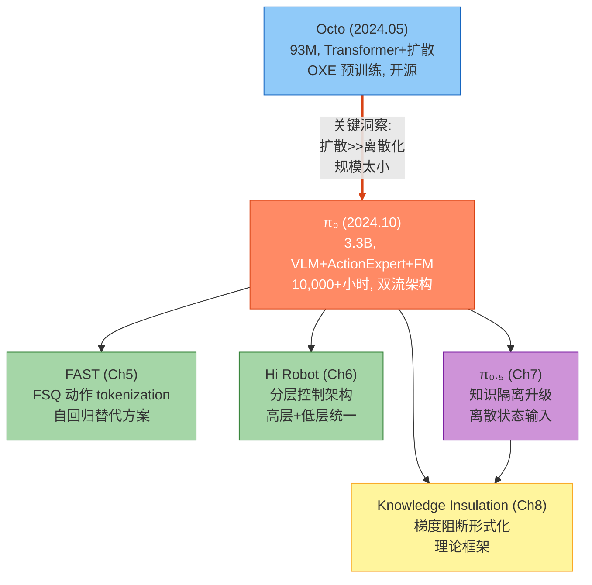
```mermaid
graph TD
    A["Octo (2024.05)<br/>93M, Transformer+扩散<br/>OXE 预训练, 开源"] -->|"关键洞察:<br/>扩散>>离散化<br/>规模太小"| B
    B["π₀ (2024.10)<br/>3.3B, VLM+ActionExpert+FM<br/>10,000+小时, 双流架构"] --> C
    B --> D
    B --> E
    B --> F
    C["FAST (Ch5)<br/>FSQ 动作 tokenization<br/>自回归替代方案"]
    D["Hi Robot (Ch6)<br/>分层控制架构<br/>高层+低层统一"]
    E["π₀.₅ (Ch7)<br/>知识隔离升级<br/>离散状态输入"]
    E --> F
    F["Knowledge Insulation (Ch8)<br/>梯度阻断形式化<br/>理论框架"]

    style A fill:#90CAF9,stroke:#1565C0
    style B fill:#FF8A65,stroke:#D84315,color:white
    style C fill:#A5D6A7,stroke:#2E7D32
    style D fill:#A5D6A7,stroke:#2E7D32
    style E fill:#CE93D8,stroke:#7B1FA2
    style F fill:#FFF59D,stroke:#F9A825

    linkStyle 0 stroke:#D84315,stroke-width:3px
```

---

## 10. 总结性评价

### 10.1 $\pi_0$ 的历史地位

$\pi_0$ 在机器人基础模型发展史上占据枢纽位置，其重要性体现在三个层面：

**技术层面**：首次证明了"VLM 骨干 + flow matching 动作生成"的组合可以同时解决语义理解与精确控制的矛盾。这一技术路线在论文发表后迅速成为领域主流。

**规模层面**：10,000+ 小时的训练数据和 3.3B 参数的模型规模，将机器人学习推入了真正的"大规模"时代。此前最大的 Octo 仅 93M 参数，RT-2 虽有 55B 参数但使用离散化动作、无 action chunk。

**范式层面**：pre-training / post-training 两阶段训练范式的引入，为机器人基础模型的开发建立了方法论框架。论文证明了这一范式在机器人领域同样有效：预训练赋予广泛能力和错误恢复，后训练赋予流畅精练的执行策略。

### 10.2 局限性与未解决问题

1. **数据组成的最优化**：论文坦承"将所有可用数据简单混合"，未系统研究数据组成对性能的影响
2. **正迁移的边界**：跨具身预训练是否存在负迁移？在极不相同的领域（如自动驾驶 vs 操作）之间是否仍有正迁移？
3. **消融实验的完整性**：VLM 骨干的价值与模型规模混淆，Action Expert 分离权重缺乏定量消融，flow matching 时间步分布缺乏比较实验
4. **绝对性能的不确定性**：并非所有任务都工作可靠，论文未能回答"多少数据和什么类型的数据才能达到接近完美的性能"
5. **开环执行的局限**：action chunk 采用开环执行（temporal ensembling 反而有害），这在更动态的环境中可能成为瓶颈

### 10.3 从 Octo 到 $\pi_0$ 的认知跃迁

回顾从 Octo 到 $\pi_0$ 的演进，可以识别出一条清晰的认知路径：

$$\underbrace{\text{Octo: 扩散} \gg \text{离散化}}_{\text{消融发现}} \xrightarrow{\text{升级}} \underbrace{\text{Flow Matching}}_{\pi_0\text{: 更好的扩散}}$$

$$\underbrace{\text{Octo: 93M 规模不足}}_{\text{泛化天花板}} \xrightarrow{\text{扩大}} \underbrace{\text{3.3B = VLM(3B) + AE(300M)}}_{\pi_0\text{: 利用 VLM 预训练扩大规模}}$$

$$\underbrace{\text{Octo: proprioception 导致因果混淆}}_{\text{架构缺陷}} \xrightarrow{\text{解决}} \underbrace{\text{Action Expert 独立处理状态}}_{\pi_0\text{: 分离权重避免冲突}}$$

$$\underbrace{\text{Octo: 冻结语言编码器最好}}_{\text{语言能力受限}} \xrightarrow{\text{替换}} \underbrace{\text{PaliGemma VLM 端到端训练}}_{\pi_0\text{: 真正的视觉-语言联合理解}}$$

$\pi_0$ 的每一个关键设计决策都可以追溯到 Octo 消融实验中暴露的具体局限。这种"从经验到系统"的迭代模式，也体现了同一批核心研究者（Kevin Black, Karl Pertsch, Chelsea Finn, Sergey Levine）从学术界（Octo @ Berkeley/Stanford）到产业界（$\pi_0$ @ Physical Intelligence）的知识延续与提升。


---


# 第五章：FAST — 频域压缩驱动的动作token化革新

## 论文信息

- **标题**: FAST: Efficient Action Tokenization for Vision-Language-Action Models
- **发表时间**: 2025年1月16日
- **会议**: RSS 2025
- **arXiv**: https://arxiv.org/abs/2501.09747
- **核心作者**: Karl Pertsch\*, Kyle Stachowicz\*（共同核心贡献者）, Brian Ichter, Danny Driess, Suraj Nair, Quan Vuong, Oier Mees, Chelsea Finn, Sergey Levine
- **机构**: Physical Intelligence / UC Berkeley / Stanford

---

## 1. 解决了什么问题 & 相对前作的定位

### 1.1 动作离散化：自回归VLA的阿喀琉斯之踵

第四章分析的 $\pi_0$ 通过引入 flow matching 连续动作生成头，绕开了动作离散化问题，取得了卓越的灵巧操作性能。但这一方案付出的代价是架构复杂性——需要独立的 Action Expert（300M 参数）、专用的注意力掩码设计，以及迭代去噪推理过程。一个自然的问题是：**能否让自回归 VLA 直接生成离散动作 token，同时保持与 flow matching 方案相当的性能？**

这一问题的核心障碍在于动作 token 化（action tokenization）——如何将连续的机器人动作信号映射为 VLM 可以自回归预测的离散 token 序列。此前的主流方案（RT-2、OpenVLA 等采用的逐维度逐时间步分箱方案）存在根本性缺陷：

**朴素分箱（Naive Binning）方案**：对 $D$ 维动作序列 $a_{1:H}$，将每个时间步的每个维度独立离散化为 $N=256$ 个均匀区间之一，生成 token 序列：

$$T_a(a_{1:H}) = [T_{1,1}, \ldots, T_{1,D}, \ldots, T_{H,1}, \ldots, T_{H,D}]$$

总 token 数为 $H \times D$。对于 50Hz 双臂操作任务（$H=50, D=14$），单个 1 秒 action chunk 即产生 700 个 token——这远超典型 LLM 生成长度，使训练和推理都面临巨大挑战。

### 1.2 边际信息量消失：高频token化的根本困境

FAST 论文的核心理论洞察在于：**朴素分箱方案失败的根因不仅是 token 数量过多，更在于相邻 token 之间的边际信息量趋近于零**。

自回归模型的训练目标是最大化条件概率 $P(T_i | T_{1:i-1})$，其学习信号正比于 $T_i$ 在给定 $T_{1:i-1}$ 条件下的边际信息量 $I(T_i ; T_{1:i-1})$。对于平滑的机器人动作信号，当采样频率增高时，相邻时间步的动作值差异按比例缩小：

$$\Delta a_t = a_{t+1} - a_t \propto \frac{1}{f_{\text{control}}}$$

这意味着高频采样下，每个新 token 携带的增量信息极少，模型可以通过简单复制前一个 token 获得极低的预测损失，陷入退化的局部最优。论文通过精心设计的教学实验（didactic experiment）量化了这一现象：在合成三次样条插值任务中，当采样率从 25 提升至 800 时，朴素方案的预测 MSE 急剧飙升，模型最终退化为输出常量。

这解释了为什么 OpenVLA 在低频数据集（BridgeV2，5Hz）上表现良好，却无法有效训练高频 DROID 数据集（15Hz）。

### 1.3 VQ-VAE/FSQ：学习式压缩的局限

另一条路径是使用向量量化自编码器（VQ-VAE）或其简化变体有限标量量化（FSQ）来学习动作的压缩表示。这类方法训练一个编码器-解码器网络，将 action chunk 映射到紧凑的离散码本空间。但论文指出其两个关键问题：

1. **训练不稳定性**：VQ-VAE 的码本利用率（codebook utilization）对超参数极为敏感，常出现模式坍缩（mode collapse），需要精心的数据集特定调参。
2. **高保真度区域退化**：在压缩-重建权衡曲线上，FSQ 在低保真度区域（粗糙重建）比 FAST 更紧凑，但在需要精细控制的高保真度区域性能急剧退化——而灵巧操作恰恰需要高保真度重建。

### 1.4 FAST 的定位：从第一性原理出发的压缩式token化

FAST 的核心洞察优雅而深刻：**机器人动作信号本质上是平滑的时间序列，应在训练前进行压缩，以消除相邻 token 间的冗余并提升每个 token 的信息密度**。这一思路类比了语言模型领域的 Byte-Pair Encoding（BPE）——通过合并高频出现的字节序列来压缩文本。但由于机器人动作是连续信号而非离散符号，对应的压缩策略应采用信号处理中的经典工具——离散余弦变换（DCT），即 JPEG 图像压缩的核心算法。

相对于 $\pi_0$ 的 flow matching 方案，FAST 提供了一条完全不同的技术路径：

| 维度 | $\pi_0$（Flow Matching） | $\pi_0$-FAST（FAST Token化） |
|------|--------------------------|-------------------------------|
| 解码方式 | 迭代去噪（10步 Euler 积分） | 标准自回归 next-token prediction |
| 架构需求 | 独立 Action Expert（300M参数） | 无需额外架构，复用 VLM 骨干 |
| 损失函数 | Flow matching 向量场回归损失 | 标准交叉熵损失 |
| 训练效率 | 基准 | 快 5 倍 |
| 推理延迟 | ~100ms（4090 GPU） | ~750ms（4090 GPU） |
| 语言指令跟随 | 较弱（扩散头可能忽略语言） | 较强（自回归天然与语言对齐） |

---

## 2. 创新点

按重要性排序：

### 创新点 1：基于 DCT 的频域压缩实现动作 token 化 —— 变革性

将信号处理中成熟的离散余弦变换引入机器人动作表示，是 FAST 最核心的贡献。这不是简单的技术移植，而是基于对机器人动作信号物理特性的深刻理解：机器人动作本质上是平滑连续的（受惯性、电机带宽等物理约束），其频谱能量集中在低频分量——这与自然图像中像素平滑变化的特性完全类比，正是 DCT（JPEG 压缩的数学基础）最擅长处理的信号类型。

### 创新点 2：约 10 倍 token 压缩比 —— 变革性

FAST 在保持高重建保真度的同时，将 action chunk 的 token 数量压缩至约 1/10：50Hz 双臂 T 恤折叠任务从 700 个 token 压缩至 53 个（13.2 倍），20Hz 桌面清理从 140 个压缩至 28 个（5 倍）。更优雅的是，FAST 产生的 token 数量与底层动作信号的真实复杂度成正比，而非与采样频率线性增长——每个机器臂始终约产生 30 个 token，无论控制频率如何。

### 创新点 3：与任意自回归 VLM 骨干兼容 —— 显著

FAST 作为纯粹的预处理 tokenizer，不需要修改底层 VLM 的任何架构组件。论文在 PaliGemma-3B（$\pi_0$ 骨干）和 Prismatic-7B（OpenVLA 骨干）上均验证了其有效性。这种即插即用特性使得任何现有或未来的自回归 VLM 都可以直接受益于 FAST token 化。

### 创新点 4：FAST+ 通用动作 tokenizer —— 显著

在 100 万个跨平台动作 chunk（涵盖单臂、双臂、移动操作等形态，关节空间/末端执行器空间/相机坐标系三种参数化，15-50Hz 控制频率）上训练的通用 BPE 词汇表，可作为黑箱 tokenizer 应用于任意新机器人平台，性能与数据集特定 tokenizer 相当。

### 创新点 5：5 倍训练加速 —— 显著

由于 token 序列大幅缩短、损失函数简化为标准交叉熵，$\pi_0$-FAST 的训练收敛速度比扩散式 $\pi_0$ 快 5 倍（以 GPU 小时计），在数千 GPU 小时规模的训练中节省的计算资源极为可观。

---

## 3. 数据来源、处理方式及其原因

### 3.1 评估数据

论文覆盖 7 个评估环境（6 真实机器人 + 1 仿真），按控制频率跨越完整频谱：

| 任务 | 机器人 | 频率 | 维度 | 数据规模 | 特点 |
|------|--------|------|------|---------|------|
| Libero | 仿真 | - | - | 270k 样本 | 标准基准 |
| 桌面清理 | UR5 单臂 | 20Hz | 7 | 大规模 | 精确抓取 |
| T恤折叠 | 双臂 ARX | 50Hz | 14 | ~150件衬衫 | 高频灵巧 |
| 杂货装袋 | UR5 单臂 | 20Hz | 7 | 大规模 | 多样物体 |
| 吐司取出 | 双臂 Trossen | 50Hz | 14 | - | 精确操作 |
| 洗衣折叠 | 双臂 ARX | 50Hz | 14 | - | 最高难度 |
| DROID 零样本 | Franka | 15Hz | 7 | 75k episode/21M 样本 | 零样本泛化 |

### 3.2 FAST+ 通用 tokenizer 训练数据

约 100 万个 1 秒 action chunk，来源覆盖：
- **机器人形态**：单臂（UR5, Franka FR3）、双臂（ARX, AgileX, Trossen）、移动操作（Fibocom, Mobile Trossen）
- **动作空间参数化**：每种形态包含关节空间（Joint）、末端执行器世界坐标系（EE）、末端执行器相机坐标系（CamFrame）三种
- **控制频率**：15-50Hz
- **开源数据集**：ALOHA（5.0%）、DROID（11.2%）、Bridge V2（5.0%）、Open X-Embodiment（3.8%）

### 3.3 数据预处理

**分位数归一化**：将每个动作维度的第 1 和第 99 百分位映射到 $[-1, 1]$：

$$\hat{a}^d = \frac{2(a^d - Q_1^d)}{Q_{99}^d - Q_1^d} - 1$$

选择分位数而非 min-max 归一化是为了对大规模数据集中偶发的离群动作（如操作员控制器故障产生的异常值）保持鲁棒性。归一化后，所有动作填充至 32 维以适配不同维度的动作空间。统一使用 1 秒 action chunk 进行 token 化。

---

## 4. 模型结构及设计原因

### 4.1 FAST token化流水线

FAST tokenizer 本身**不是神经网络，而是一个解析式信号压缩流水线**。这是其相对于 VQ-VAE/FSQ 的根本优势——无需训练复杂的编码器-解码器网络，无模式坍缩风险，仅有两个不敏感的超参数。

完整的 FAST token化流水线如下：

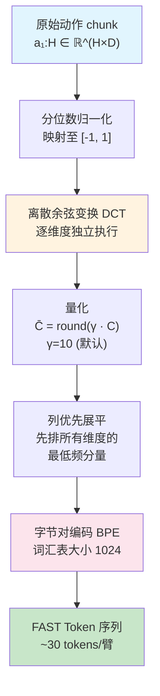
```mermaid
graph TD
    A["原始动作 chunk<br/>a₁:H ∈ ℝ^(H×D)"] --> B["分位数归一化<br/>映射至 [-1, 1]"]
    B --> C["离散余弦变换 DCT<br/>逐维度独立执行"]
    C --> D["量化<br/>C̄ = round(γ · C)<br/>γ=10 (默认)"]
    D --> E["列优先展平<br/>先排所有维度的<br/>最低频分量"]
    E --> F["字节对编码 BPE<br/>词汇表大小 1024"]
    F --> G["FAST Token 序列<br/>~30 tokens/臂"]

    style A fill:#e1f5fe
    style G fill:#c8e6c9
    style C fill:#fff3e0
    style F fill:#fce4ec
```

逆过程（解码）完全对称且可逆：

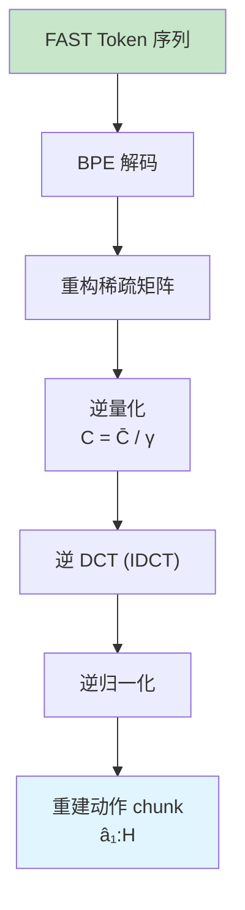
```mermaid
graph TD
    G["FAST Token 序列"] --> F["BPE 解码"]
    F --> E["重构稀疏矩阵"]
    E --> D["逆量化<br/>C = C̄ / γ"]
    D --> C["逆 DCT (IDCT)"]
    C --> B["逆归一化"]
    B --> A["重建动作 chunk<br/>â₁:H"]

    style G fill:#c8e6c9
    style A fill:#e1f5fe
```

### 4.2 DCT 数学原理：为什么频域天然适合平滑轨迹

离散余弦变换将长度为 $N$ 的时域信号 $x_n$ 转换为频域系数 $X_k$：

$$X_k = \sum_{n=0}^{N-1} x_n \cos\left[\frac{\pi}{N}\left(n + \frac{1}{2}\right)k\right], \quad k = 0, 1, \ldots, N-1$$

其中 $k=0$ 对应直流分量（信号均值），$k$ 越大对应越高的频率分量。逆变换为：

$$x_n = \frac{1}{N}\left[X_0 + 2\sum_{k=1}^{N-1} X_k \cos\left[\frac{\pi}{N}\left(n + \frac{1}{2}\right)k\right]\right]$$

**为什么 DCT 天然适合机器人动作信号？** 这需要从物理学角度理解：

1. **惯性约束**：机器人关节和末端执行器具有物理质量，加速度受电机扭矩限制，因此运动轨迹在物理上必然平滑——高频抖动意味着无穷大的加速度，这在现实中不可能发生。
2. **控制带宽限制**：电机控制器的频率响应有限（典型 PID 控制带宽远低于采样频率），高频控制信号会被物理系统自然滤除。
3. **能量集中**：上述物理约束意味着动作信号的频谱能量高度集中在低频区域。DCT 后，绝大多数高频系数的幅值接近零，可以安全截断。

这与 JPEG 压缩中自然图像的特性完全类比——自然场景中相邻像素值平滑变化，DCT 后大部分能量集中在少数低频系数中，截断高频系数仅造成视觉不可察觉的信息损失。

### 4.3 量化：Scale-and-Round

DCT 系数通过缩放后取整进行量化：

$$\bar{C}_j^i = \text{round}(\gamma \cdot C_j^i)$$

其中缩放因子 $\gamma$（默认值 10）控制压缩率与重建精度之间的权衡：
- $\gamma$ 越大，保留越多细节（量化步长 $1/\gamma$ 越小），但非零系数越多，压缩率越低
- $\gamma$ 越小，压缩越激进，但重建误差越大

量化后的系数矩阵 $\bar{C} \in \mathbb{Z}^{D \times H}$ 高度稀疏——绝大多数条目为零，仅少数低频分量保留显著非零值。

### 4.4 展平顺序与 BPE 压缩

**列优先展平**是一个关键设计决策。$D \times H$ 的 DCT 系数矩阵有两种展平方式：

- **列优先**（论文选择）：$[\bar{C}_1^1, \bar{C}_1^2, \ldots, \bar{C}_1^D, \bar{C}_2^1, \ldots, \bar{C}_H^D]$ —— 先排列所有维度的最低频分量
- **行优先**：$[\bar{C}_1^1, \bar{C}_2^1, \ldots, \bar{C}_H^1, \bar{C}_1^2, \ldots]$ —— 先排列单个维度的所有频率

列优先展平使自回归模型在生成时**先确定动作的整体形状（低频分量），再逐步细化细节（高频分量）**，这产生了更稳定的策略 rollout。这一设计与图像生成中"先粗后细"的渐进式生成策略异曲同工。

**BPE 压缩**：展平后的整数序列通过字节对编码进一步压缩。BPE 是 FAST 中**唯一需要学习的组件**（通过在训练数据上统计频繁共现的整数模式来构建词汇表），但训练仅需数分钟。BPE 实现两个功能：（1）将大量重复的零值"压扁"为少数 token；（2）将频繁出现的系数组合合并为单个 token，进一步提升压缩率。

### 4.5 FAST 算法伪代码

完整算法可形式化为：

$$\text{FAST}(a_{1:H}) = \text{BPE}\left(\text{Flatten}_{\text{col-first}}\left(\text{round}\left(\gamma \cdot \text{DCT}(\hat{a}_{1:H})\right)\right)\right)$$

其中 $\hat{a}_{1:H}$ 为分位数归一化后的动作。

### 4.6 三种 token 化方案的对比

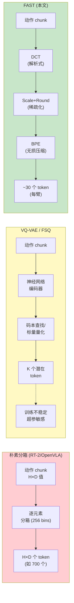
```mermaid
graph LR
    subgraph naive["朴素分箱 (RT-2/OpenVLA)"]
        N1["动作 chunk<br/>H×D 值"] --> N2["逐元素<br/>分箱 (256 bins)"]
        N2 --> N3["H×D 个 token<br/>(如 700 个)"]
    end

    subgraph vqvae["VQ-VAE / FSQ"]
        V1["动作 chunk"] --> V2["神经网络<br/>编码器"]
        V2 --> V3["码本查找/<br/>标量量化"]
        V3 --> V4["K 个潜在<br/>token"]
        V4 -.-> V5["训练不稳定<br/>超参敏感"]
    end

    subgraph fast["FAST (本文)"]
        F1["动作 chunk"] --> F2["DCT<br/>(解析式)"]
        F2 --> F3["Scale+Round<br/>(稀疏化)"]
        F3 --> F4["BPE<br/>(无损压缩)"]
        F4 --> F5["~30 个 token<br/>(每臂)"]
    end

    style naive fill:#ffcdd2
    style vqvae fill:#fff9c4
    style fast fill:#c8e6c9
```

| 对比维度 | 朴素分箱 | VQ-VAE/FSQ | FAST |
|---------|---------|------------|------|
| 压缩率 | 无 (1:1) | 中等 | 高 (最高 13.2x) |
| 训练需求 | 无 | 需训练编码器-解码器 | 仅需 BPE 词表训练（分钟级） |
| 超参敏感度 | 低 | 高（码本大小、潜在维度等） | 低（仅 $\gamma$ 和词表大小） |
| 高保真度重建 | 天然无损 | 急剧退化 | 持续可扩展 |
| 时序相关性处理 | 无（逐时间步独立） | 隐式（编码器学习） | 显式（DCT 去相关） |
| 高频数据适应性 | 完全失败 | 部分成功 | 完全成功 |

### 4.7 $\pi_0$-FAST 策略架构

FAST 作为即插即用的 tokenizer，与 $\pi_0$ 的 VLM 骨干（PaliGemma-3B）结合时，**不需要独立的 Action Expert**。动作 token 直接加入 VLM 的词汇表（覆写最少使用的 token），策略训练等价于标准的 VLM 微调：

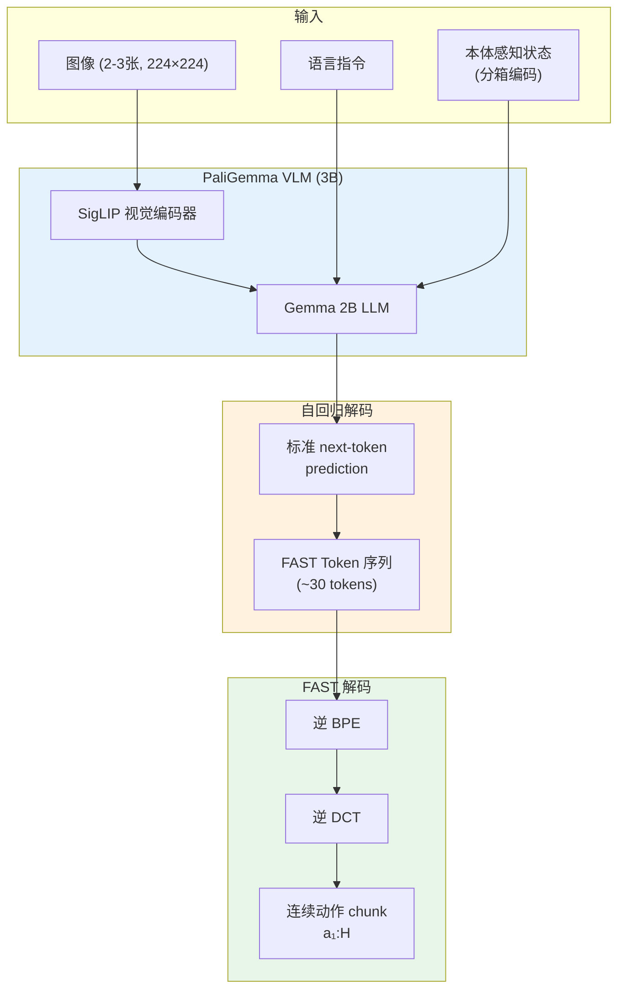
```mermaid
graph TD
    subgraph input["输入"]
        IMG["图像 (2-3张, 224×224)"]
        LANG["语言指令"]
        PROP["本体感知状态<br/>(分箱编码)"]
    end

    subgraph vlm["PaliGemma VLM (3B)"]
        VE["SigLIP 视觉编码器"]
        GE["Gemma 2B LLM"]
        IMG --> VE
        VE --> GE
        LANG --> GE
        PROP --> GE
    end

    subgraph decode["自回归解码"]
        GE --> AR["标准 next-token<br/>prediction"]
        AR --> FT["FAST Token 序列<br/>(~30 tokens)"]
    end

    subgraph detok["FAST 解码"]
        FT --> IBPE["逆 BPE"]
        IBPE --> IDCT["逆 DCT"]
        IDCT --> ACT["连续动作 chunk<br/>a₁:H"]
    end

    style vlm fill:#e3f2fd
    style decode fill:#fff3e0
    style detok fill:#e8f5e9
```

注意一个重要的不对称性：本体感知状态作为**输入**仍使用简单分箱编码（因为输入 token 无需自回归预测，不受边际信息量消失问题影响），而动作**输出**使用 FAST token 化。

---

## 5. 训练方法（算法与工程）

### 5.1 训练目标：回归标准交叉熵

$\pi_0$-FAST 的训练目标是标准的自回归交叉熵损失，这与任何语言模型训练完全相同：

$$\mathcal{L}_{\text{FAST}} = -\sum_{i=1}^{K} \log P_\theta(\bar{T}_i | \bar{T}_{1:i-1}, o)$$

其中 $\bar{T}_{1:K}$ 是 FAST token 序列，$o$ 是观测（图像 + 语言指令 + 本体感知状态），$\theta$ 是 VLM 参数。

对比 $\pi_0$ 的 flow matching 损失：

$$\mathcal{L}_{\text{flow}} = \mathbb{E}_{\tau, A_t, A_t^\tau}\left[\|v_\theta(A_t^\tau, o_t, \tau) - u(A_t^\tau | A_t)\|^2\right]$$

FAST 方案将连续回归问题转化为离散分类问题，可以直接利用 LLM 训练基础设施（交叉熵损失、自回归采样、KV 缓存等），无需任何定制化训练代码。

### 5.2 训练配置

| 参数 | 值 |
|------|-----|
| 优化器 | AdamW ($\beta_1=0.9, \beta_2=0.95$) |
| 权重衰减 | 无 |
| 梯度裁剪 | 幅值裁剪至 1 |
| 学习率 | 5e-5（1k步线性warmup后恒定） |
| EMA 衰减 | 0.999 |
| 微调方式 | 全参数，不冻结任何层 |
| DROID 训练 | 3 epoch, 240k 迭代, batch 256, 8×H100 ~4天 |
| Libero 训练 | 40k 迭代, ~40 epoch |

### 5.3 训练效率分析

FAST 带来训练效率提升的机制是多层次的：

1. **序列长度缩短**：自回归 Transformer 的计算复杂度为 $O(n^2 d)$（$n$ 为序列长度），token 数量从数百减至约 30，序列长度方面的计算量减少约一个数量级。
2. **损失函数简化**：交叉熵损失（softmax + 对数）相比 flow matching 的向量场回归损失（MSE 在高维连续空间），计算图更简单，梯度更稳定。
3. **无迭代去噪**：训练时不需要采样噪声时间步 $\tau$、构造带噪动作 $A_t^\tau$，简化了数据流水线。
4. **信息密度提升**：每个 FAST token 携带高信息量，训练信号更有效，收敛更快。

最终结果：$\pi_0$-FAST 在 903M 时间步的跨平台数据集上训练所需 GPU 小时仅为扩散式 $\pi_0$ 的 **1/5**。

### 5.4 推理策略

- **默认**：贪心自回归解码（argmax 采样）
- **双臂任务**（T恤折叠、吐司取出、洗衣折叠）：温度 $\beta = 0.7$ 的采样解码。原因是部分训练数据包含机器人在起始位置静止的片段，需要随机性帮助策略"启动"
- **推理延迟**：~750ms/chunk（4090 GPU），需自回归解码 30-60 个 token，使用完整 2B 参数语言模型骨干。相比扩散式 $\pi_0$ 的 ~100ms（10 步去噪，使用 300M Action Expert），推理速度是当前主要劣势

---

## 6. 实验关键发现与效果对比

### 6.1 压缩率分析

FAST 的压缩率与控制频率正相关，且展现出一个优雅的自适应特性：

| 数据集 | 动作维度 | 控制频率 | 朴素方案 token 数 | FAST token 数 | 压缩比 |
|--------|---------|---------|-------------------|---------------|--------|
| BridgeV2 | 7 | 5 Hz | 35 | 20 | 1.75x |
| DROID | 7 | 15 Hz | 105 | 29 | 3.6x |
| 桌面清理 | 7 | 20 Hz | 140 | 28 | 5.0x |
| T恤折叠 | 14 | 50 Hz | 700 | 53 | 13.2x |

关键发现：**FAST 每个机器臂始终产生约 30 个 token**（双臂约 60 个），无论控制频率如何。这说明 FAST 自动提取了底层动作信号的真实信息复杂度，而非受采样频率支配。从信息论角度，这表明 1 秒动作轨迹的本征信息量（intrinsic information content）约等于 30 个离散 token 的信息容量。

### 6.2 token化方案对比

在所有评估任务上，不同 token 化方案的策略性能呈现清晰的层级结构：

| 任务 | 朴素分箱 | FSQ | FAST | FAST+ |
|------|---------|-----|------|-------|
| T恤折叠 (50Hz) | **完全失败** (~0%) | 中等 | 高 | 高 |
| 桌面清理 (20Hz) | **完全失败** (~0%) | 中等偏高 | 高 | 高 |
| DROID (15Hz) | 低 | 中等 | 高 | 高 |
| Libero | 中等 | 中等偏高 | 高 | 高 |

核心结论：
- 朴素分箱在 20Hz 以上的高频任务中完全失败，策略无法取得任何任务进展
- 压缩式 token 化（FAST 和 FSQ）均能有效训练策略
- FAST 在灵巧高频任务上优于或持平 FSQ，且远比 FSQ 简单（无需训练单独的神经网络）
- FAST+ 通用 tokenizer 在所有任务上与数据集特定 FAST 性能相当

### 6.3 $\pi_0$-FAST vs 扩散式 $\pi_0$

#### 单任务训练

| 任务 | $\pi_0$-FAST | 扩散 $\pi_0$ | 扩散 $\pi_0$ (3x 计算) | 优势方 |
|------|-------------|-------------|----------------------|--------|
| Libero | 相当 | 相当 | 相当 | 持平 |
| T恤折叠 | 相当 | 相当 | 相当 | 持平 |
| 桌面清理 | **高** | 中等 | 高 | FAST（收敛快 3x） |
| DROID | **高** | 中等偏低 | - | FAST（语言跟随更好） |

关键发现：在小数据集（<50h）上两者性能相当；在大数据集上 FAST 收敛显著更快（桌面清理任务需 1/3 训练步数）；在 DROID 评估中，自回归 $\pi_0$-FAST 比扩散 $\pi_0$ 更好地遵循语言指令——扩散模型的 flow matching 头有时会忽略语言条件。

#### 大规模通用策略训练

在 903M 时间步的完整 $\pi_0$ 训练混合数据上训练通用策略：

| 任务 | $\pi_0$-FAST | 扩散 $\pi_0$ |
|------|-------------|-------------|
| T恤折叠 | 相当 | 相当 |
| 桌面清理 | 相当 | 相当 |
| 杂货装袋 | 相当 | 相当 |
| 吐司取出 | 相当 | 相当 |
| 洗衣折叠 | 相当 | 相当 |
| **训练 GPU 小时** | **1x** | **5x** |

$\pi_0$-FAST 在所有任务（包括最具挑战性的洗衣折叠）上匹配扩散 $\pi_0$ 的性能，同时训练计算量仅为后者的 1/5。与计算量匹配的扩散 $\pi_0$ 对比，$\pi_0$-FAST 在所有任务上明显胜出。

### 6.4 首次实现 DROID 零样本泛化

FAST 的一个里程碑式成果是首次成功训练出能在完全未见环境中零样本评估的 DROID 策略——无需微调，仅通过自然语言提示即可执行任务。该策略在 UC Berkeley、Stanford、University of Washington 三个校区的不同场景中均展示了稳健的泛化能力（不同桌面布置、背景、相机视角和物体）。此前的 DROID 论文和 OpenVLA 均仅展示了 co-training 或 fine-tuning 结果。

---

## 7. 消融实验的发现

按影响力从大到小排序：

### 消融 1：DCT 压缩的核心价值（影响力：决定性）

FAST 完整方案 vs 朴素分箱的对比本身就是最重要的消融：DCT 频域变换从根本上消除了高频动作序列中的时序冗余，使每个 token 携带高边际信息量。在教学实验中，DCT token 化在所有采样频率（25-800）上均保持低预测误差，而朴素方案在高频率下急剧退化。

### 消融 2：BPE 压缩步骤（影响力：重要）

移除 BPE 后（仅保留 DCT + 量化），策略在桌面清理和 T 恤折叠任务上的 rollout 性能下降，但仍显著优于朴素方案。这说明：
- DCT 变换本身已将信号信息集中到少数系数中，改善了学习信号质量
- 但没有 BPE 时，大量重复的零值 token 稀释学习信号并降低推理速度（需预测数百个 token）
- BPE 的零值压缩和频繁模式合并对最终性能**重要但非决定性**

### 消融 3：展平顺序（影响力：显著）

列优先展平（先排所有维度的最低频分量）优于行优先展平（先排单维度的所有频率分量）。原因：列优先使自回归生成时先确定动作的全局形状，再逐步细化——这产生了更稳定的策略 rollout，与"先粗后细"的生成范式一致。

### 消融 4：VLA 骨干无关性（影响力：验证性）

在 50Hz T 恤折叠任务上，将 FAST+ 应用于 OpenVLA（Prismatic 7B 骨干），从近乎零的成功率提升到可用水平。这证明 FAST 的改进独立于底层 VLM 架构，是 token 化层面的根本改进。

### 消融 5：通用 vs 数据集特定 tokenizer（影响力：实用性）

FAST+ 在所有评估任务上与针对每个数据集单独训练的 FAST tokenizer 性能相当。在 14 个未见数据集上的离线压缩测试中，FAST+ 对所有数据集均实现至少 2 倍压缩，部分高维高频数据集（如 HumanPlus 的 40 维 50Hz 关节空间）压缩比超过 10 倍。

### 消融 6：压缩-重建权衡曲线（影响力：理论性）

在六个数据集上扫描各 tokenizer 的核心超参数（FAST: 缩放因子 $\gamma$；朴素方案: 降采样频率；FSQ: 潜在 token 数），关键发现是 **FAST 在高保真度区域的缩放特性显著优于 FSQ**：

- FSQ 在低保真度下更紧凑（更少 token 达到同等粗糙重建质量）
- 但 FSQ 在需要精细控制的高保真度区域**性能急剧退化**
- FAST 能持续缩放到更高精度，且在宽广的参数范围内表现稳定

这一差异对灵巧操作至关重要——衣物折叠、精密装配等任务要求毫米级动作精度，FAST 在该区域的优势使其成为更可靠的选择。

---

## 8. 优化有效性评估

### 8.1 核心洞察排序

| 排名 | 优化策略 | 有效性证据 | 影响机制 |
|------|---------|-----------|---------|
| 1 | DCT 频域压缩 | 所有高频任务从完全失败到成功 | 消除时序冗余，提升 token 信息密度 |
| 2 | BPE 无损压缩 | 移除后性能显著下降 | 压缩零值，合并频繁模式 |
| 3 | 列优先展平 | 行优先导致不稳定 rollout | 先粗后细的渐进式生成 |
| 4 | 分位数归一化 | 跨平台 tokenizer 的基础 | 统一动作范围，鲁棒于离群值 |

### 8.2 为什么频域压缩是"正确"的抽象

FAST 的成功不是偶然的工程技巧，而是源于对机器人动作信号物理本质的正确认识。从信号处理理论的角度：

**Parseval 定理**告诉我们，信号在时域和频域的总能量相同：

$$\sum_{n=0}^{N-1} |x_n|^2 = \frac{1}{N} \sum_{k=0}^{N-1} |X_k|^2$$

但能量的**分布**截然不同。对于平滑的机器人轨迹，时域中能量均匀分散在所有时间步（每步变化微小但非零），而频域中能量高度集中在少数低频系数中。这意味着：

- **时域 token 化**（朴素分箱）：每个 token 携带约 $E/N$ 的信息量（$E$ 为总信息量），$N$ 越大则每个 token 越"空洞"
- **频域 token 化**（FAST）：少数低频 token 携带绝大部分信息（可能超过 95%），高频 token 可安全丢弃

从这个视角看，DCT 执行的是**信息重新打包**——将分散在时域中的信息集中到频域的少数系数中，使每个保留的 token 都承载高密度信息。这正是自回归模型所需要的：**每个预测步骤都应是一个有意义的决策，而非对前一步的微小修正。**

### 8.3 与 $\pi_0$ flow matching 的互补性分析

FAST 和 flow matching 代表了处理连续动作生成的两种正交策略：

- **Flow matching**（$\pi_0$）：在**连续空间**中直接建模动作分布，通过学习从噪声到动作的向量场实现生成。优势在于保持动作的连续性和多模态表达能力（flow matching 可建模多峰分布），劣势在于需要迭代去噪和独立的 Action Expert。
- **FAST token 化**（$\pi_0$-FAST）：将连续动作**无损压缩为离散 token**，然后在离散空间中用标准自回归方法生成。优势在于完全复用 LLM 训练基础设施、更好的语言对齐，劣势在于推理时需逐 token 生成（较慢）且量化引入微小信息损失。

两者性能相当但各有优势的实验结果表明，**连续 vs 离散的表示选择本身并非性能瓶颈**——关键在于表示是否高效编码了动作信号的本质信息。

---

## 9. 与后续工作的关联

### 9.1 $\pi_0$-FAST 成为 $\pi_0$ 的标准替代方案

FAST 的成功意味着 Physical Intelligence 的模型体系从此拥有两种等效的动作生成路径：flow matching（适合推理延迟敏感场景）和 FAST 自回归（适合训练效率优先场景和需要强语言对齐的场景）。这种双轨策略在后续工作中得到了持续发展。

### 9.2 Knowledge Insulation（第八章）中的角色

$\pi_{0.5}$ 的知识隔离（Knowledge Insulation）技术利用 FAST token 解决了一个关键问题：如何在不损害 VLM 语言-视觉能力的前提下进行机器人数据训练。FAST 使动作预测成为标准的 token 预测任务，使得 VLM 骨干可以在混合文本-动作数据上联合训练，而知识隔离通过冻结 VLM 低层权重防止遗忘。

### 9.3 $\pi_{0.5}$（第七章）的集成

$\pi_{0.5}$ 将 FAST 作为核心训练选项之一。由于 FAST 使动作预测与文本生成共享同一个自回归框架，$\pi_{0.5}$ 可以在同一个训练循环中同时优化语言理解和动作生成，实现真正的多模态联合训练。这是 flow matching 方案难以直接实现的——flow matching 的连续回归损失与文本的交叉熵损失在数值尺度和梯度特性上存在根本差异。

### 9.4 $\pi_{0.7}$（第十四章）的自回归模式

$\pi_{0.7}$ 采用 FAST 作为其自回归动作生成模式的基础，进一步验证了 FAST token 化在更大规模模型和更复杂任务上的可扩展性。

### 9.5 更广泛的影响

FAST 的成功传递了一个更深层的信息：在机器人学习中，**数据表示的选择**（如何将连续信号编码为模型可处理的格式）可能比模型架构的选择更为关键。一个经过良好设计的 tokenizer 可以将复杂的高频灵巧控制问题简化为标准的 LLM 训练问题，这为利用 LLM 领域的海量工程优化（speculative decoding、量化推理、分布式训练框架等）打开了大门。从这个意义上说，FAST 不仅是一个 tokenizer，更是连接机器人控制与大语言模型生态系统的桥梁。

---


---


# 第六章：Hi Robot — 层级式VLA：为机器人赋予"快思考"与"慢思考"的双系统认知架构

## 论文信息

- **标题**: Hi Robot: Open-Ended Instruction Following with Hierarchical Vision-Language-Action Models
- **发表时间**: 2025-02-26 (arXiv v1); 2025-07 (ICML 2025, Vancouver)
- **arXiv**: https://arxiv.org/abs/2502.19417
- **核心作者**: Lucy Xiaoyang Shi, Brian Ichter, Michael Equi, Liyiming Ke, Karl Pertsch, Quan Vuong, James Tanner, Anna Walling, Haohuan Wang, Niccolo Fusai, Adrian Li-Bell, Danny Driess, Lachy Groom, Sergey Levine, Chelsea Finn
- **机构**: Physical Intelligence, Stanford University, UC Berkeley
- **项目页**: https://www.pi.website/research/hirobot

> **历史定位**: Hi Robot 是 Physical Intelligence 演化链中的第六篇核心论文，标志着 PI 的研究视野从**单步原子操作**跃迁至**开放式多步推理执行**。如果说 $\pi_0$（第四章）证明了一个 VLA 可以成为极其强大的"手"——以 flow matching 在 50Hz 下精准操控各类机器人，那么 Hi Robot 则为这只"手"装上了"大脑"——一个能理解复杂指令、整合实时反馈、进行情境推理的高层认知系统。这一"System 1 + System 2"的双系统架构不仅解决了 $\pi_0$ 在长时域任务上的根本局限，更为 PI 后续的 $\pi_{0.5}$、MEM、$\pi_{0.7}$ 等工作奠定了层级式任务分解的范式基础。

---

## 1. 解决了什么问题 & 相对前作的定位

### 1.1 核心问题：从原子指令到开放式指令

$\pi_0$（Black et al., 2024）在单步灵巧操作上取得了突破性进展，但其指令跟随能力被限制在**原子级**：模型能理解"拿起杯子"、"把面包放在砧板上"，却无法处理现实世界中人类自然表达的**复杂、多步、带约束、需要推理**的指令。考虑以下真实场景：

| 指令类型 | 示例 | $\pi_0$ 能否处理 | 根本困难 |
|---------|------|:---:|---------|
| 多阶段组合 | "帮我做一个芝士牛肉生菜三明治" | 否 | 需要分解为 10+ 个有序子任务 |
| 带约束条件 | "做个素食三明治，我对泡菜过敏" | 否 | 需要推理排除特定食材 |
| 开放式语义 | "电影之夜！帮我拿些零食和饮料" | 否 | 需要从世界知识推断合适物品 |
| 实时反馈纠正 | "那个不是垃圾！" "别碰那个" | 否 | 需要理解情境、修正当前行为 |
| 否定式任务 | "只清理垃圾，不要碰碗碟" | 否 | 需要推理哪些物体属于哪类 |

这一局限并非 $\pi_0$ 独有，而是所有端到端 VLA 模型的结构性缺陷：**单一策略网络在一次前向传播中同时承担语义推理和动作生成的双重任务，当指令复杂度超过训练分布时必然失败**。

### 1.2 先前层级式方法的困境

在 Hi Robot 之前，学术界已有多种层级式机器人系统试图解决长时域任务分解问题，但它们各有致命缺陷：

| 系统 | 架构方案 | 核心局限 |
|------|---------|---------|
| **SayCan** (Brohan et al., 2023) | LLM 规划器 + 预定义技能 + 可行性打分 | 纯文本规划，无视觉接地；技能库固定，无法泛化新操作 |
| **Inner Monologue** (Huang et al., 2022) | LLM + 文本反馈循环 | 反馈为纯文本描述，非视觉接地；无法处理"那个不是垃圾"等情境性纠正 |
| **Code-as-Policies** (Liang et al., 2023) | LLM 生成代码 + 预定义 API | 依赖手工 API；无法处理灵巧操作 |
| **PaLM-E** (Driess et al., 2023) | 多模态 LLM + 具身推理 | 计划与执行分离；低层控制能力有限 |
| **RT-H** (Belkhale et al., 2024) | 层级式动作生成 | 缺乏实时人机交互反馈整合 |
| **YAY Robot** (Shi et al., 2024) | 高层纠错 + 低层 VLA | 仅支持单一 prompt；纠正类型受限于人工收集数据 |

这些系统的共同范式是**独立的规划模块 + 独立的执行模块**，导致三个系统性问题：

1. **错误级联**：高层的规划错误无法被低层纠正，反之亦然
2. **缺乏接地**：纯文本规划器无法将推理与视觉观测对齐
3. **模块间不兼容**：规划器不了解执行器的能力边界，容易生成不可执行的计划

### 1.3 Hi Robot 的解决方案

Hi Robot 提出了一个优雅的统一方案：**用同一类 VLM 架构同时实现高层推理和低层执行**，两个层级通过自然语言接口通信，借由 Kahneman 的"System 1/System 2"认知框架组织分工：

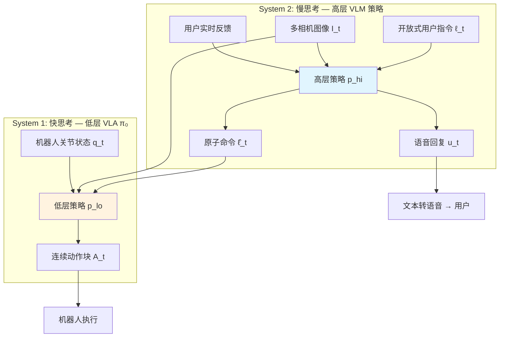
```mermaid
graph TB
    subgraph "System 2: 慢思考 — 高层 VLM 策略"
        A[开放式用户指令 ℓ_t] --> B[高层策略 p_hi]
        C[多相机图像 I_t] --> B
        D[用户实时反馈] --> B
        B --> E[原子命令 ℓ̂_t]
        B --> F[语音回复 u_t]
    end

    subgraph "System 1: 快思考 — 低层 VLA π₀"
        E --> G[低层策略 p_lo]
        C --> G
        H[机器人关节状态 q_t] --> G
        G --> I[连续动作块 A_t]
    end

    I --> J[机器人执行]
    F --> K[文本转语音 → 用户]

    style B fill:#e1f5fe
    style G fill:#fff3e0
```

这一设计的核心洞见是：**推理和执行需要不同的时间尺度和不同的训练信号，但不需要不同的架构**。高层 VLM 在低频（~1Hz）下进行语义推理，低层 VLA 在高频（~10-50Hz）下生成动作——两者共享 PaliGemma-3B 骨干，唯一的差别是低层附加了 flow matching 动作专家头。

---

## 2. 创新点

### 2.1 创新点全景

| 序号 | 创新点 | 类别 | 重要性评估 |
|:---:|--------|:----:|:--------:|
| 1 | 统一架构的层级式 VLA：同一 VLM 骨干同时实现推理和执行 | 架构 | 变革性 |
| 2 | System 1/System 2 认知类比在机器人系统中的实现 | 理论框架 | 重要 |
| 3 | 逆向合成数据生成：从技能标签反推可能的用户指令 | 数据 | 重要 |
| 4 | 自然语言作为层级间接口，实现可解释的推理-执行通信 | 接口设计 | 重要 |
| 5 | 实时语音交互闭环：语音输入 → 推理 → 动作 + 语音回复 | 系统集成 | 有意义 |

### 2.2 核心创新深度分析

**创新1：统一架构的层级式 VLA（变革性）**

Hi Robot 的最根本创新在于证明了**不需要异构模块即可构建层级式机器人系统**。与 SayCan 使用独立的 LLM（PaLM）+ 独立的技能策略（RT-1）不同，Hi Robot 的高层和低层都从同一个 PaliGemma-3B VLM 出发，仅在输出端分化：

$$
\text{高层: } p_{\text{hi}}(\hat{\ell}_t \mid I_t^1, \ldots, I_t^n, \ell_t) \quad \text{（文本输出，交叉熵训练）}
$$

$$
\text{低层: } p_{\text{lo}}(A_t \mid I_t^1, \ldots, I_t^n, \hat{\ell}_t, q_t) \quad \text{（连续动作输出，flow matching 训练）}
$$

这种同源异构设计的意义在于：两个层级共享相同的视觉表征基础（SigLIP 编码器），高层的视觉理解能力直接转化为对低层执行环境的理解，避免了异构系统中"规划器看到的世界"和"执行器看到的世界"不一致的问题。论文在 Discussion 中进一步指出，未来自然的演进方向是**将两个层级融合为一个模型，在推理时通过模式切换区分 System 1 和 System 2 行为**——这正是后续 $\pi_{0.5}$ 所实现的。

**创新2：逆向合成数据生成（重要）**

传统的层级式系统训练需要大量标注好的"复杂指令 → 子任务序列"数据，但这类数据收集极其昂贵。Hi Robot 创造性地**反转了数据生成方向**：

$$
\text{传统方向: } \ell_t \xrightarrow{\text{人工标注}} [\hat{\ell}_1, \hat{\ell}_2, \ldots, \hat{\ell}_T]
$$

$$
\text{Hi Robot: } \hat{\ell}_t \xrightarrow{p_{\text{gen}}} (\ell_t, u_t) \quad \text{（从技能标签反推用户指令和机器人回复）}
$$

具体而言，给定一个已标注的技能标签 $\hat{\ell}_t$（如"拿起 KitKat"）和对应的视觉上下文 $I_t$，使用大型 VLM $p_{\text{gen}}$ 生成可能触发该技能的用户指令（如"帮我拿点甜的东西"）。生成过程还受历史技能标签 $\hat{\ell}_0, \ldots, \hat{\ell}_{t-1}$ 条件约束以保持多步一致性：

$$
p_{\text{gen}}(\ell_t, u_t \mid I_t^1, \ldots, I_t^n, \hat{\ell}_0, \ldots, \hat{\ell}_{t-1}, \hat{\ell}_t, P)
$$

其中 $P$ 是包含任务描述和场景分类的元提示（meta-prompt），指导 $p_{\text{gen}}$ 覆盖否定任务、情境纠正、特定约束等多种交互类型。

---

## 3. 数据来源、处理方式及其原因

### 3.1 三层数据管线

Hi Robot 的数据管线包含三个层次，每层解决一个不同的问题：

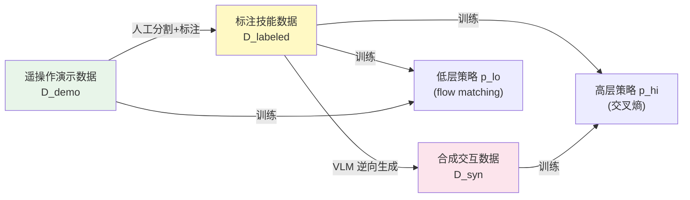
```mermaid
flowchart LR
    A["遥操作演示数据<br/>D_demo"] -->|人工分割+标注| B["标注技能数据<br/>D_labeled"]
    B -->|VLM 逆向生成| C["合成交互数据<br/>D_syn"]

    B -->|训练| D["低层策略 p_lo<br/>(flow matching)"]
    A -->|训练| D
    B -->|训练| E["高层策略 p_hi<br/>(交叉熵)"]
    C -->|训练| E

    style A fill:#e8f5e9
    style B fill:#fff9c4
    style C fill:#fce4ec
```

**第一层：遥操作演示数据 $D_{\text{demo}}$**

通过遥操作收集完整任务轨迹（如"做三明治"的整个过程），每条轨迹附带粗粒度语言标注描述整体目标。这些数据直接用于训练低层 VLA 策略的 flow matching 目标。

**第二层：标注技能数据 $D_{\text{labeled}}$**

人工将完整演示切分为 1-3 秒的原子级技能片段，每个片段配以精确的技能标签 $\hat{\ell}_t$（如"拿起一片生菜"、"把面包放在砧板上"）。此外，还通过启发式方法从原始动作中提取基础运动原语（如"右臂向左移动"）。$D_{\text{labeled}}$ 同时服务于高层和低层的训练。

**第三层：合成交互数据 $D_{\text{syn}}$**

这是 Hi Robot 最关键的数据创新。将 $D_{\text{labeled}}$ 中的（图像，技能标签）元组输入大型 VLM $p_{\text{gen}}$，逆向生成可能触发该技能的用户指令和机器人语音回复。合成数据采用结构化场景分类和回复分类确保多样性：

| 场景类型 | 示例用户指令 | 对应技能标签 |
|---------|-----------|-----------|
| 否定任务 | "只清理垃圾，不要碰碗碟" | pick up plastic container |
| 情境纠正 | "那个不是垃圾！" | open gripper (放下物品) |
| 特定约束 | "我对泡菜过敏" | pick up lettuce (跳过泡菜) |
| 开放式请求 | "帮我拿点甜的东西" | pick up KitKat |
| 追加请求 | "我还要一个 KitKat" | pick up KitKat |

### 3.2 逆向生成策略的深层原因

为什么不直接收集复杂交互数据？核心原因有三：

1. **成本效率**：每次复杂交互需要人类操作员和对话参与者配合，一小时可能仅产生几十条有效交互；逆向生成可以在几小时内为现有演示数据批量补充数万条多样化指令
2. **组合爆炸**：6 种食材的三明治有 $2^6 - 1 = 63$ 种组合，每种组合又可叠加饮食约束、偏好表达等，人工覆盖几乎不可能
3. **视觉接地**：$p_{\text{gen}}$ 在生成时看到实际的机器人观测图像，因此生成的指令天然与物理场景对齐，避免了纯文本生成可能产生的"幻觉指令"

---

## 4. 模型结构及设计原因

### 4.1 双 VLM 层级架构

Hi Robot 的架构核心是两个共享基础但分工不同的 VLM：

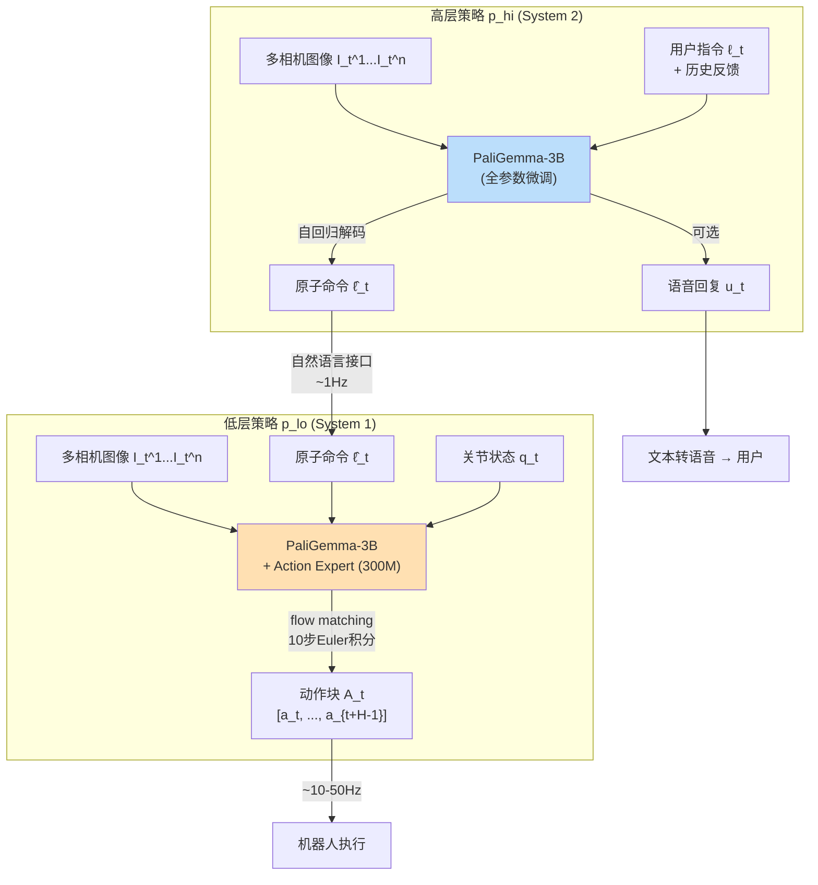
```mermaid
graph TB
    subgraph "高层策略 p_hi (System 2)"
        HI_IN1["多相机图像 I_t^1...I_t^n"] --> HI_VLM["PaliGemma-3B<br/>(全参数微调)"]
        HI_IN2["用户指令 ℓ_t<br/>+ 历史反馈"] --> HI_VLM
        HI_VLM -->|"自回归解码"| HI_OUT1["原子命令 ℓ̂_t"]
        HI_VLM -->|"可选"| HI_OUT2["语音回复 u_t"]
    end

    subgraph "低层策略 p_lo (System 1)"
        LO_IN1["多相机图像 I_t^1...I_t^n"] --> LO_VLM["PaliGemma-3B<br/>+ Action Expert (300M)"]
        LO_IN2["原子命令 ℓ̂_t"] --> LO_VLM
        LO_IN3["关节状态 q_t"] --> LO_VLM
        LO_VLM -->|"flow matching<br/>10步Euler积分"| LO_OUT["动作块 A_t<br/>[a_t, ..., a_{t+H-1}]"]
    end

    HI_OUT1 -->|"自然语言接口<br/>~1Hz"| LO_IN2
    LO_OUT -->|"~10-50Hz"| ROBOT["机器人执行"]
    HI_OUT2 --> TTS["文本转语音 → 用户"]

    style HI_VLM fill:#bbdefb
    style LO_VLM fill:#ffe0b2
```

**频率分离设计**：高层策略每 1 秒或在收到新用户反馈时触发一次推理；低层策略以约 10Hz 生成动作块（结合 action chunking 可达 50Hz 控制频率）。这种设计反映了认知科学中的核心洞见：**语义推理和运动控制在时间尺度上天然分离**——人类思考下一步做什么需要数百毫秒到数秒，但肌肉协调只需数十毫秒。

**自然语言作为模块间接口**：两个 VLM 之间通过自然语言 $\hat{\ell}_t$ 通信。这一选择有三个优势：(1) 可解释性——可以直接观察高层向低层发出了什么指令；(2) 可调试性——当系统失败时，可以判断是高层推理错误还是低层执行错误；(3) 可替换性——低层可以被其他语言条件策略替换，高层也可以被更强的 VLM 替换。

### 4.2 与先前层级系统的架构比较

```mermaid
graph TB
    subgraph "SayCan (2023)"
        SC_LLM["PaLM (LLM)<br/>纯文本，无视觉"] -->|"文本技能名"| SC_SKILL["预定义技能库<br/>(RT-1等)"]
        SC_VF["可行性函数<br/>(value function)"] -->|"可行性打分"| SC_LLM
        SC_SKILL --> SC_ACT["动作"]
    end

    subgraph "Inner Monologue (2022)"
        IM_LLM["LLM 规划器"] -->|"文本计划"| IM_SKILL["预定义技能"]
        IM_FB["文本反馈<br/>(成功/失败检测器)"] -->|"纯文本"| IM_LLM
        IM_SKILL --> IM_ACT["动作"]
    end

    subgraph "Hi Robot (2025)"
        HR_VLM["PaliGemma-3B<br/>(高层 VLM)"] -->|"原子命令"| HR_VLA["π₀ VLA<br/>(低层 VLA)"]
        HR_IMG["图像 + 语言"] --> HR_VLM
        HR_IMG2["图像 + 状态"] --> HR_VLA
        HR_VLA --> HR_ACT["连续动作"]
        HR_USER["用户语音反馈"] -->|"实时触发"| HR_VLM
    end

    style SC_LLM fill:#ffcdd2
    style IM_LLM fill:#ffcdd2
    style HR_VLM fill:#c8e6c9
    style HR_VLA fill:#c8e6c9
```

以下表格总结了三种层级架构的核心设计差异：

| 维度 | SayCan | Inner Monologue | Hi Robot |
|------|--------|-----------------|---------|
| 高层模型 | PaLM (LLM, 纯文本) | LLM (纯文本) | PaliGemma VLM (图像+文本) |
| 低层执行 | RT-1 / 手工技能 | 预定义技能 | $\pi_0$ VLA (flow matching) |
| 视觉接地 | 无（高层不看图像） | 无 | 有（高层直接处理图像） |
| 反馈机制 | 可行性函数打分 | 文本成功/失败检测 | 用户实时语音/文本反馈 |
| 技能表示 | 离散技能库 | 离散技能库 | 连续自然语言命令 |
| 权重共享 | 完全独立 | 完全独立 | 共享 VLM 骨干 |
| 灵巧操作 | 受限于 RT-1 | 受限于预定义技能 | $\pi_0$ 级别的灵巧操作 |
| 训练耦合 | 完全解耦 | 完全解耦 | 部分耦合（共享基础数据） |

### 4.3 推理延迟分析

论文详细测量了消费级 GPU（RTX 4090）上的推理延迟：

| 组件 | 延迟 (RTX 4090) | 延迟 (H100) |
|------|:---:|:---:|
| 低层：图像编码 | 14 ms | — |
| 低层：观测处理 | 32 ms | — |
| 低层：动作预测 ($\times 10$ flow steps) | 27 ms | — |
| **低层总计（板载）** | **73 ms** | — |
| **低层总计（WiFi 离板）** | **86 ms** | — |
| 高层：prefill | 47 ms | 17.3 ms |
| 高层：单步解码 | 13.2 ms | 5.7 ms |

这些延迟数据确认了系统在消费级硬件上的实时可行性：低层以 ~13Hz 运行（通过 action chunking 达到 50Hz 控制），高层每秒仅需推理一次，远低于解码速度上限。

---

## 5. 训练方法（算法与工程）

### 5.1 双目标分离训练

Hi Robot 的训练哲学是**层级分离**：高层和低层使用不同的目标函数在不同的数据组合上训练，通过共享的技能标签间接建立联系。

**高层策略训练**：在 $D_{\text{syn}} \cup D_{\text{labeled}}$ 上，使用标准的自回归 next-token prediction 交叉熵损失：

$$
\mathcal{L}_{\text{hi}} = -\sum_{k=1}^{|\hat{\ell}_t|} \log p_{\text{hi}}(x_k \mid x_{<k}, I_t^1, \ldots, I_t^n, \ell_t)
$$

其中 $x_k$ 是原子命令 $\hat{\ell}_t$（和可选的语音回复 $u_t$）的第 $k$ 个 token。PaliGemma-3B 全参数解冻微调。

**低层策略训练**：在 $D_{\text{labeled}} \cup D_{\text{demo}}$ 上，使用 $\pi_0$ 的 flow matching 目标函数：

$$
\mathcal{L}_{\text{lo}} = \mathbb{E}_{\tau \sim p(\tau)} \left[ \| v_\theta(A_t^\tau, o_t) - u(A_t^\tau \mid A_t) \|^2 \right]
$$

其中 $v_\theta$ 是模型预测的速度场，$u$ 是条件 flow matching 的目标速度场，$A_t^\tau$ 是在噪声水平 $\tau$ 下的带噪动作。

### 5.2 训练超参数与效率

| 超参数 | 高层策略 | 低层策略 |
|--------|:------:|:------:|
| 基础模型 | PaliGemma-3B | PaliGemma-3B + Action Expert |
| 优化器 | AdamW ($\beta_1{=}0.9, \beta_2{=}0.95$) | 同 $\pi_0$ |
| 权重衰减 | 0 | 同 $\pi_0$ |
| 梯度裁剪 | 1.0 | 同 $\pi_0$ |
| EMA 衰减 | 0.999 | 同 $\pi_0$ |
| 学习率 | $1 \times 10^{-5}$（1000 步预热后恒定） | 同 $\pi_0$ |
| Batch size | 512 | 同 $\pi_0$ |
| 训练时长 | **~2 小时 (8$\times$H100)** | 取决于数据规模和任务复杂度 |

高层策略训练仅需约 2 小时这一事实极其重要——它意味着在 $\pi_0$ 低层策略已训练完成的前提下，为机器人添加复杂指令跟随能力的边际成本极低。

### 5.3 训练解耦的权衡

高层和低层的解耦训练是一把双刃剑：

**优势**：
- 允许独立迭代——改进高层推理不需要重新训练低层控制
- 降低训练复杂度——避免两种截然不同的损失信号相互干扰
- 高层训练极快（2 小时），支持快速实验

**局限**：
- 两个模型不了解彼此的能力边界——高层可能生成低层无法执行的命令
- 无法端到端优化——高层的推理质量无法通过低层的执行成功率获得梯度反馈
- 论文明确将"让高层感知低层执行成功率"列为关键未来方向

---

## 6. 实验关键发现与效果对比

### 6.1 实验设置

实验跨越三个任务域和三种机器人平台，全面测试了系统在复杂指令跟随、实时反馈整合和多步任务执行上的能力：

| 任务域 | 机器人平台 | 动作维度 | 核心挑战 |
|-------|----------|:------:|---------|
| 餐桌清理 (Table Bussing) | UR5e 单臂 | 7D | 物体分类推理、否定指令、实时纠正 |
| 三明治制作 (Sandwich Making) | 双臂 ARX | 14D | 柔性物体操作、食材约束、组合指令 |
| 杂货购物 (Grocery Shopping) | Mobile ARX | 16D | 开放式语义、导航+操作、动态追加 |

每种方法在每个任务上运行 20 次试验，由盲测人类评估员评分。评估指标包括：
- **指令准确率 (IA)**：高层预测的指令与人类意图的对齐比例
- **任务进度 (TP)**：物体被正确放置的比例

### 6.2 核心定量结果

| 方法 | 餐桌清理 IA | 餐桌清理 TP | 三明治 IA | 三明治 TP | 购物 IA | 购物 TP | **平均 IA** | **平均 TP** |
|------|:---:|:---:|:---:|:---:|:---:|:---:|:---:|:---:|
| Flat VLA ($\pi_0$ 直接) | 低 | 低 | 低 | 低 | 低 | 低 | 最低 | 最低 |
| GPT-4o 高层 | 中 | 中 | 中 | 中 | 中 | 中 | 中 | 中 |
| **Hi Robot** | **高** | **高** | **高** | **高** | **高** | **高** | **高** | **高** |
| 人类专家高层 (Oracle) | 最高 | 最高 | 最高 | 最高 | 最高 | 最高 | 最高 | 最高 |

> 注：论文以柱状图形式呈现结果（Figure 5），未提供精确数值。以下关键差距来自论文文本。

**核心发现**：

**(1) Hi Robot 在指令准确率上平均超过 GPT-4o 高层 40% 以上**。这一结果在直觉上令人惊讶——GPT-4o 是一个参数量远大于 PaliGemma-3B 的 VLM，理论上拥有更强的推理能力。但 GPT-4o 的失败模式揭示了关键原因：它在物理交互开始后频繁丧失情境一致性，发出无意义指令（如"pick up bermuda triangle"），或将所有物体误标为"plate"或"spoon"。这是因为 GPT-4o **缺乏对机器人操作场景的微调接地**——它的视觉理解虽然强大，但不了解具体的机器人工作空间布局和技能语义。

**(2) Flat VLA 完全无法响应实时反馈**。当用户说"别碰那个"或"我还要 KitKat"时，Flat $\pi_0$ 毫无反应，因为这些指令不在其原子命令训练分布内。

**(3) Oracle 实验揭示瓶颈在推理层而非执行层**。当人类专家直接为低层策略提供理想的原子命令时，$\pi_0$ 执行几乎完美。这证明了两个关键论点：(a) $\pi_0$ 的低层控制能力已经足够强大；(b) 系统的主要性能瓶颈在于如何从复杂指令推导出正确的原子命令。

**(4) 跨平台泛化**。Hi Robot 在三种完全不同的机器人平台（7D 单臂、14D 双臂、16D 移动双臂）上均表现出色，验证了层级式设计的通用性。

### 6.3 定性分析：GPT-4o 的典型失败模式

论文 Figure 6 提供了极具启发性的定性对比：

| 场景 | Hi Robot 输出 | GPT-4o 输出 | 无合成数据版本 |
|------|-------------|------------|-------------|
| "做芝士牛肉生菜三明治" (当前需放芝士) | pick up one slice of cheddar cheese | pick up one piece of lettuce (错序) | pick up one slice of cheddar cheese (正确) |
| "电影之夜，拿 Oreo、Twix、薯片" (Oreo 当前在手) | put Oreo into the basket | pick up Twix (忽略手中物品) | put Oreo into the basket (正确) |
| "只清理垃圾不碰碗碟" (所有垃圾已清完) | Done! 所有垃圾已清理 | put the bowl into the bin (碗非垃圾) | pick up the bowl (忽略约束) |
| "不要那个" (用户纠正) | Sorry! open gripper (放下) | pick up chopstick (忽略纠正) | pick up chopstick (忽略纠正) |

这一对比清晰展示了三个维度的差异：(1) GPT-4o 缺乏物理接地导致错误；(2) 无合成数据版本虽然视觉理解正确但忽略语言约束；(3) 完整 Hi Robot 同时实现了视觉接地和语言约束的正确整合。

---

## 7. 消融实验的发现

### 7.1 消融实验总结

| 排名 | 消融因素 | 影响幅度 | 核心发现 |
|:---:|---------|:------:|---------|
| 1 | 合成数据 | IA +46%, TP +39% | 开放式指令跟随的关键使能因素 |
| 2 | 层级结构 | IA +34%, TP +19% | 即使数据相同，层级分解仍然显著优于扁平策略 |

### 7.2 消融A：合成数据是开放式指令跟随的基石

**对比设计**：Hi Robot（人工标注 + 合成数据） vs Hi Robot w/o 合成数据（仅人工标注）

**关键发现**：去除合成数据后，指令准确率平均下降 46 个百分点，任务进度下降 39 个百分点。无合成数据版本的失败模式高度一致：模型能正确识别场景中的物体（视觉理解完好），但完全忽略用户约束——被告知"只清理垃圾不碰碗碟"时仍然清理一切，被告知"我对泡菜过敏"时仍然添加泡菜。

**机制解释**：人工标注的 $D_{\text{labeled}}$ 仅包含"pick up X"、"put X on Y"等原子技能标签，不包含否定指令、约束条件或复杂组合语义。没有合成数据，高层策略只学会了从图像映射到最可能的下一个技能，而未学会将用户意图与技能选择关联。合成数据通过提供 $(\text{复杂指令}, \text{视觉场景}) \rightarrow \text{原子命令}$ 的多样化映射，教会了模型进行**约束推理**。

### 7.3 消融B：层级结构不可或缺

**对比设计**：Hi Robot（层级式） vs Flat VLA w/ 合成数据（扁平但使用相同合成数据训练）

**关键发现**：即使提供了完全相同的合成训练数据，层级式 Hi Robot 在指令准确率上仍然高出 34 个百分点，任务进度高出 19 个百分点。Flat VLA 的典型失败模式是：面对部分指令（如"只清理黄色的东西"）时退化为默认全清行为，且无法处理任务中途的澄清和修改。

**机制解释**：层级结构的核心优势在于**显式的推理-执行分离**。高层策略在每一步都重新审视用户指令和当前视觉观测，将推理结果浓缩为一个明确的原子命令传递给低层。Flat 策略则需要在单次前向传播中同时完成推理和动作生成，当指令复杂度增加时，这两个相互竞争的目标会导致性能退化——模型倾向于忽略复杂约束，退回到训练数据中最频繁出现的默认行为。

### 7.4 两个消融的交互意义

两组消融实验共同揭示了一个深层洞见：**数据多样性和架构分解是互补的必要条件**，缺一不可。

$$
\underbrace{\text{合成数据}}_{\text{提供语言多样性}} + \underbrace{\text{层级结构}}_{\text{提供推理分离}} \xrightarrow{\text{缺一不可}} \text{开放式指令跟随}
$$

没有合成数据，层级结构无法推理未见过的指令类型；没有层级结构，丰富的训练数据也无法被有效利用——因为扁平网络在单次推理中无法同时满足复杂约束推理和精确动作生成的需求。

---

## 8. 优化有效性评估

### 8.1 设计决策有效性排序

| 排名 | 设计决策 | 效果量 | 证据强度 | 评估 |
|:---:|---------|:------:|:------:|:----:|
| 1 | 合成数据生成 | IA +46% | 直接消融对比 | 极其有效 |
| 2 | 层级式推理-执行分离 | IA +34% | 控制数据的消融对比 | 极其有效 |
| 3 | 微调 VLM vs 即用型 VLM | IA +40% (vs GPT-4o) | 直接对比 | 极其有效 |
| 4 | 共享 VLM 骨干 (PaliGemma) | 定性（视觉一致性） | 设计分析 | 有效 |
| 5 | 频率分离（高层 1Hz / 低层 10-50Hz） | 定性（实时性） | 延迟测量 | 有效 |
| 6 | 自然语言层级间接口 | 定性（可解释性） | 定性分析 | 有效 |

### 8.2 最有效设计：微调小模型胜过即用型大模型

Hi Robot 最具实践意义的发现是：**经过针对性微调的 PaliGemma-3B（3B 参数）在机器人指令跟随上大幅超越即用型 GPT-4o**。这一发现与 NLP 领域的"小模型微调 vs 大模型提示"辩论高度相关，但在机器人领域有其特殊性——机器人场景的视觉分布（腕部相机、低角度视角、特定物体集合）与 GPT-4o 训练数据中的自然图像分布差异显著，微调对于**视觉接地**而言至关重要。

### 8.3 论文自述的局限性

论文坦诚讨论了以下局限：

1. **高层-低层解耦训练**：两个模型仅通过训练数据间接了解对方能力，高层可能生成低层无法执行的命令
2. **合成数据依赖 prompt 工程**：$p_{\text{gen}}$ 的合成质量受元提示 $P$ 设计的影响
3. **每个任务独立训练**：当前为每个任务域分别生成合成数据和训练高层策略，尚未实现跨任务统一训练
4. **缺乏长期记忆**：高层策略仅基于当前观测和指令推理，缺乏跨 episode 的记忆（论文附录 C.4 明确列出"difficulty with instructions requiring long-context reasoning, since the current system lacks memory"）
5. **低层偶发忽略指令**：由于训练偏差，低层策略有时会抓取近距离物体而忽略高层约束（如"乳糖不耐受"时仍抓取芝士）

---

## 9. 与后续工作的关联

Hi Robot 建立的 System 1/System 2 层级框架，成为 Physical Intelligence 后续研究的重要思想源泉：

### 9.1 $\pi_{0.5}$（第七章）：从双模型到单模型

Hi Robot 在 Discussion 中明确预言："a natural step for future work is to combine both systems into one model, and draw the System 1 vs System 2 distinction purely at inference time." $\pi_{0.5}$ 正是这一预言的实现——通过在单个 VLA 模型中交替进行文本推理（System 2 模式）和动作生成（System 1 模式），$\pi_{0.5}$ 消除了 Hi Robot 中两个独立模型的解耦局限。关键演进：

| 维度 | Hi Robot | $\pi_{0.5}$ |
|------|---------|------------|
| 高层/低层 | 两个独立模型 | 同一模型的两种模式 |
| 层级间接口 | 自然语言（外部传递） | 内部 token 序列 |
| 端到端训练 | 不支持 | 支持 |
| 推理开销 | 两次模型推理 | 一次模型推理 |

### 9.2 MEM（第十二章）：解决长期记忆缺失

Hi Robot 的一个明确局限是"缺乏长期记忆"——高层策略仅基于当前观测推理，无法记住过去数分钟或数小时的交互历史。MEM 通过引入外部记忆机制，将 Hi Robot 式的层级推理扩展到更长的时间跨度，使机器人能在持续数十分钟的任务中保持一致的行为策略。

### 9.3 $\pi_{0.7}$（第十四章）：Steering prompts 的延伸

$\pi_{0.7}$ 中的 steering prompts 概念——通过文本提示在推理时引导模型行为——与 Hi Robot 中高层策略向低层发送原子命令的机制有深刻的概念关联。Hi Robot 证明了"自然语言可以作为控制信号调节 VLA 行为"，$\pi_{0.7}$ 将这一思想推广到更灵活的推理时行为调控。

### 9.4 对领域的长期影响

Hi Robot 对机器人学习领域的更广泛影响在于确立了三个范式性观点：

1. **"推理瓶颈"而非"执行瓶颈"**：Oracle 实验证明，当高层推理正确时低层执行几乎完美，这重新定向了整个领域的研究重点——从改进底层控制转向改进高层推理
2. **"微调 > 提示工程"**：在机器人领域，针对性微调的小模型比即用型大模型更有效，挑战了"大模型万能"的朴素假设
3. **"合成数据可以替代复杂交互收集"**：逆向合成数据生成范式为解决机器人数据收集的高成本问题提供了可扩展的路径

---

## 附录：关键公式汇总

**层级策略分解**：

$$
p(A_t \mid o_t) = \sum_{\hat{\ell}_t} p_{\text{lo}}(A_t \mid I_t, \hat{\ell}_t, q_t) \cdot p_{\text{hi}}(\hat{\ell}_t \mid I_t, \ell_t)
$$

**高层策略训练目标**：

$$
\mathcal{L}_{\text{hi}} = -\mathbb{E}_{(I_t, \ell_t, \hat{\ell}_t) \sim D_{\text{syn}} \cup D_{\text{labeled}}} \left[ \sum_{k=1}^{|\hat{\ell}_t|} \log p_{\text{hi}}(x_k \mid x_{<k}, I_t, \ell_t) \right]
$$

**低层策略训练目标**：

$$
\mathcal{L}_{\text{lo}} = \mathbb{E}_{\tau \sim p(\tau),\, (I_t, \hat{\ell}_t, q_t, A_t) \sim D_{\text{labeled}} \cup D_{\text{demo}}} \left[ \| v_\theta(A_t^\tau, I_t, \hat{\ell}_t, q_t) - u(A_t^\tau \mid A_t) \|^2 \right]
$$

**合成数据生成**：

$$
(\ell_t, u_t) \sim p_{\text{gen}}(\cdot \mid I_t^1, \ldots, I_t^n, \hat{\ell}_0, \ldots, \hat{\ell}_{t-1}, \hat{\ell}_t, P)
$$


---


# 第七章：$\pi_{0.5}$ — 面向开放世界泛化的视觉-语言-动作模型

> **本章定位**：$\pi_{0.5}$ 是 Physical Intelligence (PI) 系列论文中的一次质变——它标志着 VLA 模型从"实验室专家"迈向"开放世界通才"的关键一步。如果说 $\pi_0$（第四章）解决了"如何构建一个高精度的通用机器人基础模型"，FAST（第五章）解决了"如何高效地离散化动作以加速训练"，Hi Robot（第六章）解决了"如何让机器人理解复杂的开放式指令"，那么 $\pi_{0.5}$ 的核心命题是：**如何让同一个模型在从未见过的真实家庭中执行持续 10-15 分钟的复杂灵巧操作任务**。$\pi_{0.5}$ 的解决方案是一套系统性的异构数据联合训练（co-training）方案，融合了五大类数据源和层级式推理架构，首次证明端到端学习的机器人系统可以在完全陌生的环境中完成清洁厨房、整理卧室等长时域多阶段任务。本章将在前作比较框架下对 $\pi_{0.5}$ 进行全面深入的技术分析。

---

## 论文信息

| 项目 | 内容 |
|------|------|
| **论文标题** | $\pi_{0.5}$: A Vision-Language-Action Model with Open-World Generalization |
| **发表时间** | 2025年4月22日 |
| **arXiv** | [2504.16054](https://arxiv.org/abs/2504.16054) |
| **会议** | CoRL 2025 |
| **机构** | Physical Intelligence, San Francisco, California, USA |
| **核心作者** | Kevin Black, Noah Brown, Danny Driess, Chelsea Finn, Karol Hausman, Brian Ichter, Sergey Levine, Karl Pertsch, Allen Z. Ren, Lucy Xiaoyang Shi, Jost Tobias Springenberg 等 34 人 |
| **模型参数** | ~3.3B（PaliGemma VLM 骨干 ~3B + Action Expert 300M） |
| **核心贡献** | 首个在完全未见的真实家庭中完成长时域灵巧操作的端到端 VLA 系统 |

**作者传承关系**：$\pi_{0.5}$ 的核心团队高度延续了 $\pi_0$ 的人员配置。Kevin Black、Danny Driess、Karl Pertsch 继续担任核心技术负责人，Chelsea Finn 和 Sergey Levine 继续担任资深作者。值得注意的新增作者包括 Allen Z. Ren（负责标注与辅助数据）、Lucy Xiaoyang Shi（同时是 Hi Robot 第一作者，将层级推理的经验带入 $\pi_{0.5}$）、以及 Jost Tobias Springenberg（负责策略训练研究）。Hi Robot 团队的合流是 $\pi_{0.5}$ 能够将层级推理从外部双模型系统（Hi Robot）内化为单一模型统一推理的关键人员基础。

---

## 1. 解决了什么问题 & 相对前作的定位

### 1.1 核心问题：开放世界泛化的多层次挑战

当移动操作机器人被要求清洁一个从未见过的厨房时，它面临三个层次的泛化挑战：

| 泛化层次 | 具体挑战 | 需要的知识来源 | $\pi_0$ 能否解决 |
|----------|----------|----------------|-----------------|
| **底层操作泛化** | 抓取新物体、适应新桌面高度 | 大规模机器人操作数据 | 部分可以（受限于训练环境） |
| **中层行为泛化** | 将已有技能灵活组合为新任务序列 | 任务分解经验、子任务标注 | 不能（无高层推理机制） |
| **高层语义泛化** | 理解场景语义、判断哪个物体是沥水架 | 互联网视觉-语言知识 | 严重退化（VLM 知识被动作训练侵蚀） |

$\pi_0$ 的根本限制在于：它虽然通过 10,000+ 小时的跨具身预训练获得了强大的底层操作能力，但**在训练数据分布之外的环境中表现急剧下降**。更关键的是，$\pi_0$ 使用了外部独立 VLM 作为高层策略来处理需要语义推理的复杂任务（如 table bussing），这意味着高层推理能力并未内化到模型本身。

### 1.2 为什么仅靠扩大机器人数据不够

一个直观的解决思路是：收集更多环境中的机器人数据。但 $\pi_{0.5}$ 论文提出了深刻的反驳——对于复杂的长时域任务（如清洁整个厨房），通过暴力扩大数据采集来覆盖所有可能场景在经济上和物理上都不可行。这与 NLP 领域的经验形成鲜明对比：GPT-3 的成功并非依赖于覆盖所有可能的对话场景，而是通过互联网规模的文本预训练获得了**通用的语言知识**，然后通过指令微调将其适配到特定任务。

$\pi_{0.5}$ 的核心洞察是：**机器人策略也需要从多种异构知识来源中汲取泛化能力，而非仅依赖同类机器人数据的线性扩展**。

### 1.3 相对前作的精确定位

$\pi_{0.5}$ 在 PI 技术栈中的定位可以通过以下对比来理解：

| 维度 | $\pi_0$ (Ch4) | FAST (Ch5) | Hi Robot (Ch6) | $\pi_{0.5}$ (Ch7) |
|------|--------------|------------|----------------|-------------------|
| **核心目标** | 通用机器人基础模型 | 高效动作 tokenization | 开放式指令跟随 | 开放世界泛化 |
| **泛化范围** | 训练环境内多任务 | 与 $\pi_0$ 相同 | 新指令，非新环境 | 完全未见的新环境 |
| **层级推理** | 外部 VLM 高层策略 | 无 | 独立双模型层级 | 单模型统一层级 |
| **训练数据** | 10K+ 小时机器人数据 | 同 $\pi_0$ 数据 | 合成语言 + 机器人 | 机器人 + Web + HL + VI |
| **动作表示** | 纯 flow matching | 纯 FAST 离散 token | flow matching | FAST 预训练 + flow 后训练 |
| **推理时间** | 73-86ms | ~750ms | 73ms + 高层 | 高层推理 + 10 步去噪 |

**关键演进**：$\pi_{0.5}$ 综合了前三项工作的核心成果——$\pi_0$ 的双流架构和 flow matching 动作生成、FAST 的高效离散 token 预训练、Hi Robot 的层级推理理念——并通过系统性的异构数据联合训练方案将它们统一在单一模型中。

---

## 2. 创新点

### 创新点枚举与重要性评估

| 编号 | 创新点 | 重要性等级 | 说明 |
|------|--------|-----------|------|
| I-1 | 异构数据联合训练 (Co-training) 方案 | **变革性** | 五大类数据源的系统性融合，97.6% 非目标数据驱动泛化 |
| I-2 | 单模型统一层级推理 | **变革性** | 同一模型同时执行高层子任务预测和低层动作生成 |
| I-3 | FAST 预训练 + Flow Matching 后训练 | **重大** | 结合两种动作表示的最佳特性 |
| I-4 | 本体感知状态离散化输入 | **重大** | 将关节位置作为文本 token 输入，统一序列格式 |
| I-5 | 口头指令 (Verbal Instruction) 数据 | **重大** | 高质量的人类"语言遥操作"示范 |
| I-6 | 高层子任务数据 (HL) 与边界框联合预测 | **显著** | chain-of-thought 式推理与视觉定位的结合 |
| I-7 | 网络数据联合训练维持 VLM 能力 | **显著** | 防止动作训练侵蚀视觉-语言知识 |
| I-8 | Adaptive RMSNorm 时间步注入 | **显著** | 改进 $\pi_0$ 的直接融合方式 |

### 创新点 I-1：异构数据联合训练方案（变革性）

$\pi_{0.5}$ 的最核心贡献并非模型架构的革新，而是**训练方案（training recipe）的系统性设计**。论文的关键发现是：通过精心构建的异构数据混合，即使目标平台（移动操作机器人）的数据仅占预训练总量的 2.4%，模型也能在该平台上展现出前所未有的泛化能力。

五大数据源的功能分工如下：

```
MM (移动操作器, 400h, ~2.4%)  → 目标任务直接相关经验
ME (多环境非移动机器人)       → 环境多样性（更多家庭场景）
CE (跨构型实验室数据 + OXE)    → 任务多样性（更多操作技能）
HL (高层子任务预测)           → 推理结构（chain-of-thought）
WD (网络数据: 描述/VQA/定位)   → 语义知识（物体识别/场景理解）
```

这种设计的深层逻辑是：不同数据源在不同抽象层次上贡献泛化能力。底层操作泛化主要依赖 ME 和 CE 的多样化机器人数据，中层行为泛化依赖 HL 的任务分解结构，高层语义泛化依赖 WD 的互联网知识。这种"分层知识注入"的思路与 NLP 中的多任务预训练（如 T5 的 text-to-text 范式）有深刻的类比关系。

### 创新点 I-2：单模型统一层级推理（变革性）

Hi Robot（第六章）已经证明了层级推理对复杂任务的重要性，但其方案依赖**两个独立的 VLM 模型**——一个负责高层推理（输出子任务文本），另一个负责低层执行（输出连续动作）。这种双模型设计存在两个根本问题：(1) 两个模型之间仅通过语言接口连接，无法共享内部表征；(2) 部署复杂度翻倍，推理延迟增加。

$\pi_{0.5}$ 将高层和低层推理统一在**同一个模型**中，通过概率分布的分解来实现：

$$\pi_\theta(a_{t:t+H}, \hat{\ell} | o_t, \ell) = \underbrace{\pi_\theta(\hat{\ell} | o_t, \ell)}_{\text{高层推理}} \cdot \underbrace{\pi_\theta(a_{t:t+H} | o_t, \hat{\ell})}_{\text{低层执行}}$$

其中 $o_t = [I_t^1, ..., I_t^n, q_t]$ 是多相机图像和本体感知状态，$\ell$ 是高层任务提示（如"清洁厨房"），$\hat{\ell}$ 是模型自主预测的子任务文本（如"拿起盘子"），$a_{t:t+H}$ 是动作块。关键设计是：**动作分布不直接依赖高层提示 $\ell$，而仅依赖子任务预测 $\hat{\ell}$**。这迫使模型必须通过显式的语言中间表示来传递任务意图，类似于 chain-of-thought 推理。

与 Hi Robot 的对比：

| 设计维度 | Hi Robot (Ch6) | $\pi_{0.5}$ (Ch7) |
|----------|---------------|-------------------|
| 模型数量 | 2 个独立 VLM | 1 个统一模型 |
| 表征共享 | 仅通过语言接口 | 共享所有内部表征 |
| 高层训练数据 | 合成数据（VLM 反向生成） | HL 标注 + VI 口头指令 |
| 低层动作表示 | flow matching | FAST 预训练 + flow matching |
| 推理频率 | 高层 1Hz / 低层 10-50Hz | 高层 ~1Hz / 低层 50Hz |

### 创新点 I-3：FAST 预训练 + Flow Matching 后训练（重大）

$\pi_{0.5}$ 在动作表示上做出了一项优雅的工程创新：**预训练阶段使用 FAST 离散 token，后训练阶段切换到 flow matching 连续动作**。这一设计直接来源于 FAST 论文（第五章）的核心发现——FAST token 使自回归训练速度提升数倍，但推理时的自回归解码较慢（~750ms vs flow matching 的 ~100ms）。

具体实现：

- **预训练（280k 步，$\alpha = 0$）**：模型作为标准自回归 transformer 训练，动作通过 FAST tokenizer 编码为离散 token，与文本 token 统一在 next-token prediction 目标下。此阶段不启用 Action Expert。
- **后训练（80k 步，$\alpha = 10.0$）**：引入随机初始化的 Action Expert，联合优化交叉熵和 flow matching 损失。此阶段保留 FAST token 预测（交叉熵分支），同时新增连续动作预测（flow matching 分支）。

联合损失函数为：

$$\mathcal{L} = \mathbb{E}_{D, \tau, \omega} \left[ \mathcal{H}(x_{1:M}, f_\theta^\ell(o_t, \ell)) + \alpha \left\| \omega - a_{t:t+H} - f_\theta^a(a_{t:t+H}^{\tau, \omega}, o_t, \ell) \right\|^2 \right]$$

其中 $\mathcal{H}$ 是交叉熵损失（作用于文本 token 和 FAST 动作 token），$f_\theta^a$ 是 Action Expert 的输出，$a_{t:t+H}^{\tau, \omega} = \tau a_{t:t+H} + (1-\tau)\omega$ 是 flow matching 的噪声插值，$\omega \sim \mathcal{N}(0, I)$。注意力掩码确保 FAST token 和连续动作 token 互不 attend，避免信息泄漏。

推理时只使用 flow matching 分支：先自回归解码子任务文本 $\hat{\ell}$，再通过 10 步去噪生成连续动作 $a_{t:t+H}$。

---

## 3. 数据来源、处理方式及其原因

### 3.1 五大数据源全景

$\pi_{0.5}$ 的训练数据组成是其泛化能力的基石。以下是各数据源的详细分析：

| 数据源 | 类型 | 规模 | 预训练占比 | 后训练使用 | 核心贡献 |
|--------|------|------|-----------|-----------|----------|
| **MM** (移动操作器) | 机器人动作 | ~400 小时，~100 个家庭 | ~2.4% | 是 | 目标平台直接经验 |
| **ME** (多环境非移动) | 机器人动作 | 多种家庭环境 | 是 | 是 | 环境多样性迁移 |
| **CE** (跨构型实验室) | 机器人动作 | 含 OXE 数据集 | 是 | 否 | 任务多样性迁移 |
| **HL** (高层子任务) | 文本标注 | 对 MM/ME/CE 的标注 | 是 | 部分（ME 对应） | 推理结构与任务分解 |
| **WD** (网络数据) | 视觉-语言 | CapsFusion/COCO/VQA 等 | 是 | 是 | 语义知识维持 |
| **VI** (口头指令) | 语言示范 | 占 HL 数据 ~11% | 否 | 是 | 高质量高层策略示范 |

### 3.2 数据源设计的深层逻辑

**MM 数据的"少数精锐"策略**：令人瞩目的事实是，在预训练阶段，移动操作器的直接相关数据仅占总样本量的 2.4%。论文的实验证明，即使如此小的占比，只要配合其他数据源的协同训练，模型仍能在移动操作任务上展现强大的泛化能力。这与传统机器学习中"训练数据必须与测试数据高度一致"的直觉形成鲜明对比。

**ME 数据的环境多样性杠杆**：非移动机器人（固定式单臂/双臂）的核心优势在于**部署成本极低**——它们重量轻、易运输，可以快速部署到大量不同家庭中。虽然这些数据来自与目标平台不同的构型，但它们提供了 $\pi_{0.5}$ 在环境理解层面最重要的多样性。消融实验证实移除 ME 数据导致性能显著下降。

**CE 数据的任务多样性杠杆**：实验室跨构型数据（包含 OXE 开源数据集）提供了广泛的操作技能覆盖——从收桌到叠衣的数十种任务。虽然这些数据的环境多样性有限（主要在实验室），但其丰富的任务类型帮助模型建立了**通用的操作技能库**。

**HL 数据的结构化推理注入**：高层子任务预测数据的设计极具匠心。对于 MM/ME/CE 中涉及多步骤的任务，人工标注员将其分解为语义子任务序列（如"清洁卧室" $\rightarrow$ ["调整毯子", "拾起枕头", "放入衣篮"]），同时标注相关物体的边界框。模型被训练为**先预测边界框、再预测子任务标签、最后生成动作**，这种级联结构自然地将 chain-of-thought 推理嵌入到策略中。

**WD 数据的 VLM 知识维持**：网络数据的功能并非直接提升机器人操作能力，而是**防止动作训练过程中 VLM 语义知识的退化**。这一设计直接预示了后续 Knowledge Insulation 论文（第八章）中对"知识遗忘"问题的系统性研究。消融实验表明，WD 对整体任务性能的影响在统计上不显著，但对**分布外物体的语言跟随能力**和**高层子任务推理质量**有显著贡献。

**VI 数据的高质量示范杠杆**：口头指令数据是 $\pi_{0.5}$ 最具创新性的数据类型之一。收集方式为：专家用户通过自然语言**实时"遥操作"**机器人——他们不直接控制关节，而是逐步下达子任务命令（如"拿起盘子"、"放入水槽"），由已训练的低层策略执行。这种"语言遥操作"方式极其高效，能快速生成大量高质量的高层策略示范。虽然 VI 仅占高层移动操作样本的约 11%，但消融实验显示移除它导致性能**不成比例地大幅下降**。

### 3.3 数据处理标准化

所有动作数据采用统一的预处理流水线：

- **归一化**：使用各维度 1%/99% 分位数映射到 $[-1, 1]$，对异常值保持鲁棒
- **动作空间统一**：将动作维度零填充至固定最大值，适配不同机器人构型
- **控制模式标注**：在文本提示中添加 `<control mode> joint/end effector <control mode>` 标记，区分关节空间和末端执行器空间控制
- **本体感知离散化**：机器人关节角度、夹爪姿态、底盘速度等本体感知状态被离散化为文本 token 输入模型

### 3.4 与 $\pi_0$ 数据规模对比

| 数据维度 | $\pi_0$ (Ch4) | $\pi_{0.5}$ (Ch7) | 变化 |
|----------|--------------|-------------------|------|
| 核心机器人数据 | 10,000+ 小时，7 种机器人 | MM 400h + ME + CE (扩展 OXE) | 机器人数据是 $\pi_0$ 的超集 |
| 非机器人数据 | 无 | WD (大量网络视觉-语言数据) | 全新数据类型 |
| 高层标注 | 段落级标注（~2 秒粒度） | HL（语义子任务 + 边界框） | 结构化程度大幅提升 |
| 环境覆盖 | 实验室为主 | ~100 个家庭 + 实验室 | 环境多样性数量级提升 |
| 训练环境数量 | 未明确 | 104 个不同地点 | 首次系统性覆盖 |

---

## 4. 模型结构及设计原因

### 4.1 架构概览

$\pi_{0.5}$ 在 $\pi_0$ 的双流架构基础上进行了针对性的扩展和修改。核心参数保持一致：

| 组件 | 参数 | 说明 |
|------|------|------|
| **VLM 骨干** | ~3B (PaliGemma) | width=2048, depth=18, mlp_dim=16384, num_heads=18, num_kv_heads=1, head_dim=256 |
| **视觉编码器** | SigLIP 400M | 224$\times$224 图像输入 |
| **语言模型** | Gemma 2.6B | 初始化自 PaliGemma 预训练权重 |
| **Action Expert** | 300M | width=1024, mlp_dim=4096，相同深度 |
| **动作维度** | $d = 18\text{-}19$ | 双臂 + 底盘 + 升降 + 夹爪 |
| **动作块长度** | $H = 50$ 步 (49 + 当前帧) | 50Hz 控制频率下对应 1 秒 |

### 4.2 $\pi_{0.5}$ vs $\pi_0$ 架构对比

```mermaid
graph TB
    subgraph "π₀ 架构"
        A0_img["图像 I₁...Iₙ"] --> A0_siglip["SigLIP 400M"]
        A0_siglip --> A0_gemma["Gemma 2B VLM"]
        A0_lang["语言指令 ℓ"] --> A0_gemma
        A0_prop["本体感知 qₜ<br/>(连续投射)"] --> A0_ae["Action Expert 300M"]
        A0_noise["噪声动作 Aᵗ"] --> A0_ae
        A0_gemma <-->|"cross-attention<br/>KV 交互"| A0_ae
        A0_ae --> A0_action["连续动作<br/>Flow Matching"]
        A0_gemma --> A0_lang_loss["语言损失<br/>(交叉熵)"]
    end

    subgraph "π₀.₅ 架构"
        B0_img["图像 I₁...I₄<br/>(4 相机)"] --> B0_siglip["SigLIP 400M"]
        B0_siglip --> B0_gemma["Gemma 2.6B VLM"]
        B0_lang["高层提示 ℓ"] --> B0_gemma
        B0_prop["本体感知 qₜ<br/>(离散化文本 token)"] --> B0_gemma
        B0_gemma --> B0_subtask["子任务预测 ℓ̂<br/>(自回归文本)"]
        B0_gemma --> B0_fast["FAST 动作 token<br/>(预训练阶段)"]
        B0_subtask --> B0_gemma2["Gemma 2.6B VLM<br/>(条件推理)"]
        B0_noise["噪声动作 Aᵗ"] --> B0_ae["Action Expert 300M<br/>(Adaptive RMSNorm)"]
        B0_gemma <-->|"单向信息流<br/>VLM → AE"| B0_ae
        B0_ae --> B0_action["连续动作<br/>Flow Matching<br/>(后训练阶段)"]
        B0_gemma --> B0_web["Web 任务输出<br/>(VQA/描述/定位)"]
    end

    style A0_gemma fill:#4a90d9,color:white
    style B0_gemma fill:#4a90d9,color:white
    style B0_subtask fill:#e8a838,color:white
    style B0_fast fill:#7bc96f,color:white
    style B0_web fill:#c97bc9,color:white
```

### 4.3 关键架构差异详解

**差异一：本体感知状态的表示方式**

| 设计选择 | $\pi_0$ | $\pi_{0.5}$ |
|----------|---------|-------------|
| 表示方式 | 连续值线性投射到嵌入空间 | 离散化为文本 token |
| 处理路径 | 经 Action Expert 处理 | 经 VLM 骨干处理 |
| 设计动机 | 保持连续精度 | 统一序列格式，兼容纯自回归预训练 |

$\pi_{0.5}$ 将本体感知状态离散化为文本 token 的设计是为了在预训练阶段（$\alpha = 0$，无 Action Expert）也能处理机器人状态输入。这使得预训练可以作为纯粹的自回归 transformer 训练，简化了训练流程。

**差异二：Flow Matching 时间步注入方式**

$\pi_0$ 将 flow matching 时间步 $\tau$ 直接与噪声动作融合后输入 transformer。$\pi_{0.5}$ 改用**Adaptive RMSNorm** 机制：

$$\text{MLP}(\tau): \text{swish}(W_2 \cdot \text{swish}(W_1 \cdot \phi(\tau)))$$

其中 $\phi: \mathbb{R} \rightarrow \mathbb{R}^w$ 是正弦位置编码函数，$W_1, W_2 \in \mathbb{R}^{w \times w}$。MLP 的输出用于调制 Action Expert 每层的 RMSNorm 参数。这种设计借鉴了扩散模型中 AdaLN（Adaptive Layer Normalization）的成功经验，使时间步信息能更精细地影响每层的特征变换。

**差异三：注意力掩码结构**

$\pi_{0.5}$ 的注意力掩码比 $\pi_0$ 的三段式设计更为精细：

```mermaid
graph LR
    subgraph "π₀.₅ 注意力掩码"
        P["图像 + 提示 + 本体感知<br/>(Full Prefix Mask)"] -->|"attend"| F["FAST 动作 token<br/>(Causal Mask)"]
        P -->|"attend"| AE["Action Expert token<br/>(Bidirectional)"]
        F -.->|"不 attend"| AE
        AE -.->|"不 attend"| F
        AE -.->|"不 attend 回"| P
    end

    style P fill:#4a90d9,color:white
    style F fill:#7bc96f,color:white
    style AE fill:#e8a838,color:white
```

关键约束：(1) FAST 动作 token 和 Action Expert token **互不 attend**，防止两种动作表示之间的信息泄漏；(2) 信息**单向流动**从 VLM 到 Action Expert——VLM 骨干的 embedding 不 attend Action Expert 的输出。这确保了 VLM 的语义表征不被动作训练信号污染，是 Knowledge Insulation（第八章）理念的早期体现。

### 4.4 推理流程

$\pi_{0.5}$ 的推理过程分为两步：

```mermaid
sequenceDiagram
    participant ENV as 环境
    participant HL as 高层推理 (同一模型)
    participant LL as 低层推理 (同一模型)
    
    ENV->>HL: 4 相机图像 + 高层提示 ℓ
    Note over HL: 自回归解码<br/>预测边界框<br/>预测子任务 ℓ̂
    HL->>LL: 子任务文本 ℓ̂ + 3 相机图像
    
    loop 10 步 Flow Matching 去噪
        LL->>LL: Action Expert 前向传播
    end
    
    LL->>ENV: 动作块 a_{t:t+H}<br/>(50 步，50Hz)
    
    Note over ENV: 执行动作块<br/>~1 秒后获取新观测
    ENV->>HL: 新观测
```

值得注意的技术细节：
- 高层推理使用全部 4 个相机（前方、后方、双腕），低层推理仅使用 3 个（前方、双腕）
- 高层推理在每个动作块执行完后触发，频率约 1Hz
- 低层推理的 10 步 flow matching 去噪中，VLM 骨干的 KV 可缓存，仅需重复计算 Action Expert

---

## 5. 训练方法（算法与工程）

### 5.1 两阶段训练流水线

```mermaid
graph LR
    subgraph "预训练 (280k 步)"
        PT_init["PaliGemma<br/>VLM 初始化"] --> PT_train["标准自回归 Transformer<br/>Next-Token Prediction"]
        PT_data["MM + ME + CE + HL + WD<br/>(97.6% 非 MM 数据)"] --> PT_train
        PT_train --> PT_out["FAST token 预测<br/>子任务预测<br/>VQA/描述/定位"]
    end
    
    subgraph "后训练 (80k 步)"
        PT_out --> FT_init["加载预训练权重<br/>+ 随机初始化 AE"]
        FT_data["MM + ME + HL(ME) + WD + VI<br/>(排除 CE)"] --> FT_train["联合优化<br/>交叉熵 + Flow Matching<br/>α = 10.0"]
        FT_init --> FT_train
        FT_train --> FT_out["文本 + 连续动作<br/>双输出模型"]
    end
    
    style PT_train fill:#4a90d9,color:white
    style FT_train fill:#e8a838,color:white
```

### 5.2 预训练阶段：纯离散 token 训练

预训练阶段的核心设计原则是**将所有模态统一为离散 token 序列**：

- **图像**：SigLIP 编码为视觉 token
- **文本**：标准 Gemma tokenizer
- **本体感知**：离散化为文本 token
- **动作**：FAST tokenizer 编码为离散 token
- **子任务**：自然语言文本 token
- **边界框**：位置编码为 `<loc0405><loc0011>...` 格式的特殊 token

这种设计使预训练等价于训练一个标准的**多模态自回归语言模型**，无需任何特殊的损失函数或架构修改（$\alpha = 0$），训练过程高度稳定。FAST 论文（第五章）已经证明，使用 FAST token 的训练速度比 flow matching 快约 5 倍，这使得大规模预训练在计算上可行。

预训练的数据混合策略值得特别关注：97.6% 的样本来自非移动操作数据。论文的实验证明，这种"重度不平衡"的数据混合并不会损害目标任务性能，反而是泛化能力的关键来源。

### 5.3 后训练阶段：引入 Flow Matching

后训练阶段实现三个目标：

1. **引入 Action Expert**：随机初始化 300M 参数的 Action Expert，通过 flow matching 损失训练其生成连续动作
2. **专化到目标平台**：将数据范围收窄至 MM + ME（成功 episode，长度低于阈值），排除 CE 以聚焦移动操作
3. **增强高层策略**：新增 VI 数据，提供高质量的高层子任务示范

后训练的损失函数（公式 1 重述）：

$$\mathcal{L} = \mathbb{E}_{D, \tau, \omega} \left[ \mathcal{H}(x_{1:M}, f_\theta^\ell(o_t, \ell)) + 10.0 \cdot \left\| (\omega - a_{t:t+H}) - f_\theta^a(a_{t:t+H}^{\tau, \omega}, o_t, \ell) \right\|^2 \right]$$

其中 $\alpha = 10.0$ 的选择反映了动作预测相对于文本预测的更高权重，这与 $\pi_0$ 的设计一致。

### 5.4 与 $\pi_0$ 训练范式的比较

| 训练维度 | $\pi_0$ (Ch4) | $\pi_{0.5}$ (Ch7) |
|----------|--------------|-------------------|
| **预训练目标** | 交叉熵 + flow matching 联合 | 纯交叉熵（FAST token） |
| **预训练步数** | 700k | 280k |
| **后训练步数** | 任务特定（变化） | 80k |
| **Action Expert 引入** | 预训练开始即存在 | 后训练开始才引入 |
| **动作表示** | 始终 flow matching | 预训练 FAST → 后训练 flow matching |
| **数据类型** | 纯机器人数据 | 机器人 + Web + HL + VI |
| **训练稳定性** | 需要平衡两种损失 | 预训练完全稳定（纯 LM） |

$\pi_{0.5}$ 的两阶段设计在工程上比 $\pi_0$ 更优雅：预训练作为纯语言模型训练，完全避免了 flow matching 损失可能带来的训练不稳定性。Action Expert 仅在后训练阶段引入，此时模型已经具备了强大的视觉-语言理解能力和初步的动作预测能力（通过 FAST token），Action Expert 的训练可以在此基础上快速收敛。

### 5.5 工程细节

- **图像增强**：随机裁剪（95%）$\rightarrow$ 缩放至 224$\times$224 $\rightarrow$ 旋转（$\pm$5 度）$\rightarrow$ 颜色抖动（亮度 0.3、对比度 0.4、饱和度 0.5）
- **Flow matching 时间步采样**：Beta 分布 $p(\tau) = \text{Beta}(\frac{s-\tau}{s}; \alpha=1.5, \beta=1)$，截断阈值 $s = 0.999$，偏向低时间步（高噪声），与 $\pi_0$ 一致
- **控制频率**：50Hz，action chunk 50 步对应 1 秒
- **机器人平台**：两种移动操作器，双 6-DoF 手臂 + 平行夹爪 + 全向底盘 + 升降机构，共 18-19 DoF
- **推理**：高层使用 4 相机，低层使用 3 相机（前方 + 双腕），10 步 flow matching 去噪

---

## 6. 实验关键发现与效果对比

### 6.1 开放世界泛化能力（问题 1）

$\pi_{0.5}$ 在 3 个从未见过的真实家庭中进行了厨房和卧室清洁任务的评估。每个任务持续 2-5 分钟，涉及多个阶段的灵巧操作。这是**端到端学习的机器人系统首次在完全陌生的真实家庭中完成此类复杂任务**。

关键结果：
- 在 mock 环境中的表现与真实家庭一致，验证了评估方法的可靠性
- 模型能自主预测恰当的子任务序列（如"拿起盘子" $\rightarrow$ "放入水槽"）
- 支持多种复杂操作：挂毛巾、整理床铺、将衣物放入洗衣篮

### 6.2 环境数量的 Scaling 规律（问题 2）

论文通过系统性地变化训练环境数量（3、12、22、53、82、104 个地点）揭示了环境泛化的 scaling 行为：

| 训练环境数 | 整体任务表现 | 语言跟随率（分布内） | 语言跟随率（分布外） |
|-----------|-------------|--------------------|--------------------|
| 3 | 低 | 低 | 极低 |
| 12 | 中低 | 中 | 低 |
| 53 | 中高 | 中高 | 中 |
| 104 | 高 | 高 | 中高 |
| 104 + 含测试环境（对照） | 高 | - | - |

**核心发现**：使用 104 个训练环境的模型（不含测试环境）达到了与在测试环境上直接训练的对照模型**相当的性能**，说明 co-training recipe 有效弥合了泛化差距。更进一步，去除 co-training recipe 而仅在 104 个环境上直接训练的基线，其性能**显著低于**完整方案，即使该基线包含了测试环境数据，也远不如完整 $\pi_{0.5}$。这有力地证明了异构数据联合训练对泛化的本质性贡献。

### 6.3 与 $\pi_0$ 的直接对比（问题 4）

论文设计了三个模型进行比较：

| 模型 | 训练方式 | 高层/低层推理 |
|------|----------|-------------|
| **$\pi_0$** | 纯 flow matching，仅机器人数据 | 无高层 |
| **$\pi_0$-FAST+Flow** | FAST 预训练 + flow 后训练，仅机器人数据 | 无高层 |
| **$\pi_{0.5}$** | FAST 预训练 + flow 后训练，完整 co-training | 有高层 |

所有模型使用相同的跨构型机器人训练集，训练步数可比。$\pi_{0.5}$ **显著优于**两个基线。即使将 $\pi_0$ 训练延长到 300k 步也无法追平，这进一步验证了 FAST 论文（第五章）的发现：FAST token 预训练在计算效率上显著优于纯 flow matching 训练。

语言跟随能力的对比更加明显：

| 模型 | 语言跟随率（分布内） | 语言跟随率（分布外） |
|------|--------------------|--------------------|
| $\pi_0$ | 最低 | 最低 |
| $\pi_0$-FAST+Flow | 中等 | 中等 |
| $\pi_{0.5}$ | 最高 | 最高 |

$\pi_0$ 的语言跟随率大幅落后于 $\pi_{0.5}$，证明了**离散 token 训练对语言跟随能力的重要性**——纯 flow matching 训练中，VLM 骨干的语言能力可能被持续的动作损失信号侵蚀。

### 6.4 高层推理的重要性（问题 5）

论文设计了 7 种高层推理变体进行比较：

| 变体 | 描述 | 相对表现 |
|------|------|----------|
| **$\pi_{0.5}$ (完整)** | 模型自主高层 + 低层推理 | **最佳** |
| implicit HL | 训练含 HL 数据，但推理不执行高层 | 第二 |
| human HL | 人类专家提供子任务 | 第三（低于完整模型） |
| no WD | 去除网络数据 | 显著退化 |
| no VI | 去除口头指令数据 | 显著退化 |
| no HL | 完全去除高层数据 | 大幅退化 |
| GPT-4 | 零样本 GPT-4 作为高层策略 | **最差** |

**最令人惊讶的发现**：$\pi_{0.5}$ 的自主高层推理**超过了人类专家 oracle**。这表明模型不仅学会了如何分解任务，还学会了**为低层策略量身定制最优的子任务指令**——它比人类专家更了解自己擅长执行什么样的指令。

**第二个重要发现**：implicit HL（训练含高层数据但推理不执行高层推理）是第二好的变体。这强烈表明 co-training recipe 本身已将大量子任务结构知识**内化**到模型中，即使不显式执行 chain-of-thought 推理，模型也能隐式地利用这些知识。

**GPT-4 的失败**：零样本 GPT-4 作为高层策略表现最差。这与 Hi Robot（第六章）的发现一致——通用大语言模型缺乏物理接地和机器人特定知识，即使参数量远大于 PaliGemma 3B，也无法有效指导机器人执行。GPT-4o 在 Hi Robot 中的指令准确率比微调的 PaliGemma 低 40% 以上，$\pi_{0.5}$ 的实验进一步证实了这一结论。

---

## 7. 消融实验的发现

### 7.1 消融实验总览

$\pi_{0.5}$ 的消融实验围绕两个核心问题展开：(1) 各数据源对泛化的贡献有多大？(2) 各推理组件对性能的影响如何？以下按影响大小排序：

### 7.2 按影响排序的消融发现

| 排名 | 消融变体 | 影响程度 | 影响范围 | 核心洞察 |
|------|----------|----------|----------|----------|
| 1 | no ME or CE | **最大** | 整体性能大幅下降 | 跨构型数据迁移是泛化基石 |
| 2 | no HL (训练+推理) | **很大** | 长时域任务严重退化 | 子任务结构知识不可或缺 |
| 3 | no VI | **大** | 高层策略质量骤降 | 11% 数据的不成比例影响 |
| 4 | no ME | **显著** | 环境泛化退化 | 环境多样性的不可替代性 |
| 5 | no CE | **显著** | 技能泛化退化 | 任务多样性的不可替代性 |
| 6 | no WD (高层) | **显著** | 高层推理和 OOD 物体退化 | 网络数据的语义知识贡献 |
| 7 | no WD (整体) | **不显著** | 整体任务统计不显著 | 网络数据的作用是间接的 |

### 7.3 跨构型数据迁移的深度分析

消融实验中最引人注目的发现是**跨构型数据的巨大迁移价值**。移除 ME（多环境非移动数据）或 CE（实验室跨构型数据）均导致性能显著下降，同时移除两者则伤害更大。

这一发现的深层含义是：**不同构型的机器人在共享的视觉-语言-动作表征空间中具有可迁移的知识结构**。即使固定式单臂机器人与移动双臂操作器在动作空间上完全不同，它们在"如何识别物体"、"如何理解场景布局"、"如何规划操作序列"等更高层次上共享大量知识。$\pi_{0.5}$ 的统一动作空间设计（零填充至最大维度）和 VLM 骨干的跨模态融合能力，使得这种高层知识迁移成为可能。

这与 $\pi_0$（第四章）的跨具身预训练形成了有趣的对比：$\pi_0$ 已经证明了跨具身预训练对泛化的价值，但其评估仍在训练环境分布内进行。$\pi_{0.5}$ 的消融实验进一步证明，跨构型数据在**分布外环境泛化**中同样不可或缺——甚至比目标平台自身的数据更重要。

### 7.4 网络数据的差异化影响

WD（网络数据）的消融结果呈现出有趣的"任务依赖"模式：

- **整体任务评估**：移除 WD 的影响在统计上**不显著**
- **分布外物体语言跟随**：移除 WD 导致 OOD 物体性能**显著恶化**
- **高层推理评估**：移除 WD 导致子任务预测质量**显著退化**

这种差异化影响的解释是：网络数据的核心价值并非直接提升操作技能，而是**维持 VLM 的语义知识**，使模型能够 (1) 识别训练中未见过的物体类别；(2) 生成语义恰当的子任务描述。对于在训练分布内的物体和场景，这些知识已经被机器人数据覆盖，因此 WD 的边际价值较低；但对于分布外物体，WD 提供的广泛物体知识成为模型理解和操作这些物体的唯一来源。

### 7.5 逐任务消融分析

不同任务对数据源的敏感度呈现出清晰的模式：

| 任务 | 对 ME/CE 敏感度 | 对 WD 敏感度 | 对 HL 敏感度 | 解读 |
|------|----------------|-------------|-------------|------|
| Items in Drawer | **极高** | **高** | **高** | 需要广泛的物体识别 + 复杂多步骤序列 |
| Dishes in Sink | **高** | **低** | **中高** | 主要需要操作策略，物体类别相对固定 |
| Laundry Basket | **中** | **低** | **低** | 任务时程较短，语义推理需求较低 |
| Make Bed | **中** | **低** | **低** | 任务结构相对固定 |

Items in Drawer 任务对所有数据源都高度敏感，因为它需要：(1) 识别极其多样的家居物品（需要 WD 的语义知识），(2) 执行开抽屉-放物品-关抽屉的复杂序列（需要 HL 的结构知识），(3) 适应不同家庭中高度差异化的抽屉设计（需要 ME/CE 的环境/操作多样性）。

### 7.6 口头指令数据的杠杆效应

VI（口头指令）数据仅占高层移动操作样本的约 11%，但移除后性能显著下降。这种不成比例的影响可以从数据质量的角度解释：VI 数据是由**专家用户在真实执行场景中实时选择的子任务序列**，每个子任务命令都是经过人类判断后的最优选择。相比之下，HL 数据的子任务标注是事后对已有轨迹的回溯标注，其质量受限于标注员对任务执行策略的理解。VI 数据本质上提供了"理想高层策略"的在线示范，其信息密度远高于离线标注。

---

## 8. 优化有效性评估

### 8.1 各优化措施的效果排序

综合消融实验结果和性能对比数据，$\pi_{0.5}$ 中各优化措施的效果可以按以下顺序排列：

| 排名 | 优化措施 | 效果等级 | 证据 |
|------|----------|----------|------|
| 1 | **异构数据联合训练方案** | 变革性 | 104 环境 co-training $\approx$ 含测试环境直接训练；无 co-training 即使含测试环境数据也远不及 |
| 2 | **单模型统一层级推理** | 变革性 | 完整模型超越人类 oracle 高层；GPT-4 高层最差 |
| 3 | **FAST 预训练 + Flow 后训练** | 重大 | $\pi_{0.5}$ 显著优于 $\pi_0$-FAST+Flow 和 $\pi_0$；$\pi_0$ 300k 步仍无法追平 |
| 4 | **跨构型数据迁移 (ME+CE)** | 重大 | 移除导致最大幅度性能下降 |
| 5 | **口头指令数据 (VI)** | 重大 | 11% 占比的不成比例杠杆效应 |
| 6 | **网络数据联合训练 (WD)** | 显著（条件性） | 对 OOD 物体和高层推理显著，对整体不显著 |
| 7 | **本体感知离散化** | 显著 | 统一序列格式，简化预训练 |
| 8 | **Adaptive RMSNorm** | 中等 | 改进时间步注入，但无独立消融 |

### 8.2 最重要的优化：异构数据联合训练

$\pi_{0.5}$ 最核心的贡献——也是效果最大的优化——是其训练方案而非架构创新。论文的实验数据反复证明一个核心论点：**在开放世界泛化问题上，数据组成的多样性比数据规模的绝对增长更重要**。

具体证据：
1. 仅 2.4% 的 MM 数据占比下，模型仍能在目标平台上强力泛化
2. 104 环境 + co-training 的完整方案 $\approx$ 含测试环境直接训练
3. 104 环境但无 co-training 的方案 $\ll$ 含测试环境直接训练
4. 跨构型数据（来自完全不同机器人的数据）对泛化的贡献超过增加更多同类数据

这一发现对机器人学习领域具有深远意义：它暗示了一条**非线性扩展路径**——不是简单地在更多环境中收集更多目标平台数据，而是通过精心构建异构数据混合来"撬动"更广泛的泛化能力。

### 8.3 VLM 知识保护的重要性

$\pi_{0.5}$ 中网络数据联合训练 + 单向注意力掩码的设计，本质上是在**保护 VLM 的预训练知识不被动作训练信号侵蚀**。这一理念将在 Knowledge Insulation 论文（第八章）中得到系统性的研究和形式化。$\pi_{0.5}$ 的消融实验已经提供了间接证据：

1. WD 对 OOD 物体识别至关重要 $\rightarrow$ 不联合训练 WD 会导致 VLM 的物体知识退化
2. 信息单向流动（VLM $\rightarrow$ AE）$\rightarrow$ 防止 flow matching 梯度影响 VLM 表征
3. 完整 $\pi_{0.5}$ 在语言跟随上远超 $\pi_0$ $\rightarrow$ FAST 预训练阶段的纯文本损失更好地保留了语言能力

---

## 9. 与后续工作的关联

### 9.1 Knowledge Insulation（第八章）

$\pi_{0.5}$ 中多项设计选择——WD 联合训练、单向注意力掩码、FAST 预训练阶段的纯文本损失——都是对"VLM 知识退化"问题的经验性应对。Knowledge Insulation 论文将这一问题提升为系统性的研究命题，提出了更彻底的梯度阻断机制：**显式阻止 Action Expert 的梯度回传到 VLM 骨干**。$\pi_{0.5}$ 的消融实验（WD 对 OOD 物体的重要性、$\pi_0$ 语言跟随能力的退化）为 Knowledge Insulation 的研究动机提供了直接的经验基础。

### 9.2 RECAP / $\pi_{0.6}$（第十章）

RECAP 在 $\pi_{0.5}$ 作为基础模型之上，进一步探索推理能力的增强。$\pi_{0.5}$ 的单模型统一层级推理为 RECAP 的"推理-行动"框架提供了架构基础，而 $\pi_{0.5}$ 中 implicit HL 消融（不执行高层推理但性能仍很好）的发现暗示了推理能力可以通过训练进一步内化，这正是 RECAP 探索的方向。

### 9.3 $\pi_{0.7}$（第十四章）

$\pi_{0.7}$ 在 $\pi_{0.5}$ 的基础上进一步发展了开放世界泛化的能力。$\pi_{0.5}$ 的环境 scaling 实验（3 $\rightarrow$ 104 个环境的单调递增曲线）表明泛化能力尚未饱和，为 $\pi_{0.7}$ 通过更大规模数据和更强模型继续推进提供了方向性指引。

### 9.4 商业部署（第十七章）

$\pi_{0.5}$ 在真实家庭中的成功部署是 PI 商业化路线图的关键里程碑。论文展示的 10-15 分钟长时域家务任务（清洁厨房、整理卧室）直接对应了家用机器人市场的核心场景。$\pi_{0.5}$ 证明的开放世界泛化能力——特别是在从未见过的家庭中开箱即用——是商业部署的必要前提。

### 9.5 对 Hi Robot 的架构超越

$\pi_{0.5}$ 与 Hi Robot（第六章）的关系值得特别讨论。两者都致力于解决复杂任务的层级推理问题，但采取了不同路径：

| 维度 | Hi Robot | $\pi_{0.5}$ |
|------|----------|-------------|
| 层级推理 | 外部双模型 | 内部单模型 |
| 训练耦合 | 高层与低层解耦训练 | 联合训练 |
| 泛化重点 | 新指令类型 | 新环境 |
| 数据策略 | 合成指令数据 | 异构实际数据混合 |

$\pi_{0.5}$ 对 Hi Robot 实现了"架构内化"——将 Hi Robot 的双模型层级设计内化为单模型的统一推理。Hi Robot 的实验表明低层策略在 Oracle 高层下几乎完美，说明瓶颈在推理层。$\pi_{0.5}$ 通过将推理内化到同一模型中，使得推理层和执行层可以通过共享表征相互增强，最终实现了超越人类 Oracle 高层的表现。这是 Hi Robot 双模型设计在原理上无法达到的成就。

---

## 总结：$\pi_{0.5}$ 的历史意义

$\pi_{0.5}$ 在 PI 技术发展谱系中标记了一个质变点。如果将 $\pi_0$ 比作 GPT-2/3（证明了大规模预训练模型的可行性），那么 $\pi_{0.5}$ 更接近于 GPT-3.5/4 的定位——它不仅仅是一个更大的模型，而是通过**系统性的训练方案创新**（异构数据联合训练、层级推理内化、FAST 预训练 + flow matching 后训练），实现了从"实验室专家"到"开放世界通才"的质变。

$\pi_{0.5}$ 的三个里程碑式成就：

1. **首次**证明端到端 VLA 可以在完全未见的真实家庭中执行长时域灵巧操作
2. **首次**通过单一模型同时实现高层语义推理和低层动作控制，且自主推理超越人类 oracle
3. **首次**系统性证明异构数据联合训练（97.6% 非目标数据）对开放世界泛化的变革性价值

然而，$\pi_{0.5}$ 并非没有局限。论文坦率地承认：部分环境仍存在持续性挑战（如不熟悉的抽屉把手），部分行为受制于部分可观测性（如手臂遮挡溢出液体），高层推理偶尔出现"分心"行为（如反复开关抽屉）。这些局限为后续工作——Knowledge Insulation 的知识保护、RECAP 的推理增强、$\pi_{0.7}$ 的规模扩展——提供了明确的改进方向。


---


# 第八章：Knowledge Insulation — 知识绝缘：训练更快、推理更快、泛化更优

> **本章定位**：Knowledge Insulation（知识绝缘）是 Physical Intelligence 系列论文中一篇具有方法论范式意义的工作。它将 $\pi_{0.5}$（第七章）中经验性发现的梯度阻断技术形式化为一套完整的理论框架，系统性地回答了一个困扰整个 VLA 领域的根本性问题：**为什么将随机初始化的动作模块嫁接到预训练 VLM 上会破坏其知识，以及如何在不冻结 VLM 的前提下保护这些知识？** 本文提出的三位一体解决方案——梯度阻断 + FAST 离散动作共训 + 网络数据共训——不仅将训练速度提升了 7.5 倍（相对 $\pi_0$），还同时改善了性能和泛化能力，开创了"训练更少参数反而获得更好结果"的反直觉范式。本章将与 $\pi_0$（第四章）、$\pi_{0.5}$（第七章）以及 FAST（第五章）进行深入的横向比较与纵向溯源。

---

## 论文信息

| 项目 | 内容 |
|------|------|
| **论文标题** | Knowledge Insulating Vision-Language-Action Models: Train Fast, Run Fast, Generalize Better |
| **发表时间** | 2025年5月29日 |
| **收录** | NeurIPS 2025 (Spotlight) |
| **arXiv** | [2505.23705](https://arxiv.org/abs/2505.23705) |
| **机构** | Physical Intelligence |
| **核心作者** | Danny Driess, Jost Tobias Springenberg, Brian Ichter, Lili Yu, Adrian Li-Bell, Karl Pertsch, Allen Z. Ren, Homer Walke, Quan Vuong, Lucy Xiaoyang Shi, Sergey Levine |
| **模型架构** | PaliGemma VLM (3B) + Action Expert (300M)，与 $\pi_0$ 同构 |
| **核心贡献** | 首个系统性分析 VLA 知识退化机制并提出形式化解决方案的方法论工作 |

**作者传承关系**：第一作者 Danny Driess 同时是 PaLM-E (2023) 的第一作者和 $\pi_{0.5}$ 的核心贡献者，其从 PaLM-E 的多模态融合到 $\pi_{0.5}$ 的梯度阻断实践，再到本文的形式化理论，形成了完整的学术脉络。Karl Pertsch 是 FAST 分词器的第一作者，其在本文中负责将 FAST 离散动作 token 整合为表示学习目标——这一角色与其在 FAST 论文中的工作形成自然延续。Lili Yu 来自 Meta，是 Mixture-of-Transformers 和 LlamaFusion 的核心贡献者，其在多模态专家分离架构方面的深厚经验直接推动了本文中注意力掩码和梯度流设计的形式化。

---

## 1. 解决了什么问题 & 相对前作的定位

### 1.1 核心问题：VLA 中的知识退化困境

当预训练 VLM 被微调为 VLA 模型时，需要将随机初始化的新模块（如 action expert、扩散头）"嫁接"到已有骨干网络上。这一嫁接过程引发了一个根本性问题：

$$\underbrace{\nabla_{\theta_{\text{VLM}}} \mathcal{L}_{\text{flow}}(\theta_{\text{expert}}, \theta_{\text{VLM}})}_{\text{来自随机初始化模块的噪声梯度}} \rightarrow \text{破坏} \underbrace{\theta_{\text{VLM}}^{\text{pretrained}}}_{\text{互联网规模的语义知识}}$$

这一困境可归纳为三重矛盾：

| 矛盾维度 | 具体表现 | 前作中的体现 |
|----------|----------|------------|
| **知识保护 vs 能力适配** | 冻结 VLM 保护知识但性能为 0%；微调 VLM 获得能力但知识退化 | $\pi_0$ 的语言遵循率低下 |
| **训练速度 vs 动作精度** | 离散 token 训练快但推理慢（$\pi_0$-FAST: 750ms/chunk）；连续动作推理快但训练需 7.5x 步数 | $\pi_0$ vs $\pi_0$-FAST |
| **泛化能力 vs 控制频率** | 自回归 VLA 保持 VLM 知识但频率仅 1.3Hz；Action Expert 实现 10Hz 但泛化退化 | RT-2, OpenVLA vs $\pi_0$ |

### 1.2 问题在前作中的演变轨迹

本文所解决的问题有清晰的前作演变路径：

```mermaid
graph TB
    A["pi0 (2024.10)<br/>发现现象：action expert 梯度<br/>干扰 VLM，语言遵循率下降"] --> B["pi0-FAST (2024.12)<br/>规避策略：用离散 token<br/>替代连续动作，避免 action expert"]
    B --> C["pi0.5 (2025.04)<br/>经验性解决：两阶段训练<br/>先 FAST 预训练，后加 action expert"]
    C --> D["Knowledge Insulation (2025.05)<br/>形式化解决：单阶段训练<br/>stop-gradient + FAST + 网络数据"]
    
    style A fill:#ffcccc
    style B fill:#ffffcc
    style C fill:#ccffcc
    style D fill:#ccccff
```

**从 $\pi_0$ 到 Knowledge Insulation 的认知深化过程**：

1. **$\pi_0$（第四章）**：设计了双流架构但允许梯度自由流动，实验中观察到 action expert 的梯度可能干扰 VLM 表征，但未深入分析，仅在架构设计动机中提及"避免训练信号冲突"。实际评估中，$\pi_0$ 在 table bussing 任务中被指示收拾勺子却去抓垃圾——这一失败直接暴露了知识退化问题。

2. **$\pi_0$-FAST（第五章）**：通过完全移除 action expert 并使用 FAST 离散化来回避问题，但付出了推理速度的代价（RTX 4090 上 750ms/chunk，控制频率仅 1.3Hz），且在灵巧动态任务上性能受限。

3. **$\pi_{0.5}$（第七章）**：经验性地发现两阶段训练（先纯 FAST 预训练 280k 步，再加入 action expert 后训练 80k 步）可以缓解知识退化，但未给出理论解释，也未探索是否存在更优的单阶段方案。$\pi_{0.5}$ 论文中甚至未使用"知识绝缘"这一术语。

4. **Knowledge Insulation（本文）**：首次系统性地回答了三个根本问题——(a) 为什么梯度阻断有效？因为 stop-gradient 在注意力层的 key/value 交互处切断了从随机初始化权重到预训练权重的干扰通路。(b) 梯度阻断是否足够？不够，需要 FAST 离散动作作为替代学习信号来适配 VLM 表征。(c) 能否做得更好？可以，加入网络数据共训进一步维持 VLM 的语义知识。

### 1.3 作为方法论论文的定位

本文不是一个新模型，而是一套**训练方法论**（training recipe）。其架构与 $\pi_0$ 完全相同（PaliGemma 3B + Action Expert 300M），但通过改变梯度流和训练策略，在同一架构上实现了全面超越。这一定位使其具有跨模型的普适价值：任何采用"VLM + 外挂动作模块"架构的 VLA 都可以应用知识绝缘原理。

---

## 2. 创新点

### 创新点枚举与重要性评估

| 编号 | 创新点 | 重要性等级 | 说明 |
|------|--------|-----------|------|
| I-1 | VLA 训练中知识退化机制的形式化分析 | **变革性** | 首次从梯度流角度解释为何 action expert 破坏 VLM 知识 |
| I-2 | 三位一体解决方案：stop-gradient + FAST 共训 + 网络数据 | **变革性** | 将 $\pi_{0.5}$ 的两阶段经验方案提炼为单阶段形式化框架 |
| I-3 | 收敛速度提升 7.5 倍（相对 $\pi_0$），同时性能更优 | **重大** | 打破"更多训练 = 更好结果"的惯性思维 |
| I-4 | 冻结 VLM 推理时可复用 KV-cache 的加速方案 | **重大** | stop-gradient 使 VLM 骨干在 flow matching 迭代中不变，天然支持缓存 |
| I-5 | 损失权重自动解耦（$\alpha = 1$） | **显著** | stop-gradient 使两个损失作用于独立权重集，无需调参 |
| I-6 | 适用于任意 VLA 的通用方法论框架 | **显著** | 不依赖特定架构，可推广至 GROOT、DexVLA 等 |

### 创新点 I-1：知识退化机制的形式化（变革性）

本文的核心理论贡献在于揭示了**模态嫁接时梯度干扰的精确机制**。在标准 $\pi_0$ 训练中，action expert 通过注意力层的 key-value 交互读取 VLM 骨干的特征，而 flow matching 损失的梯度通过相同的路径反传回 VLM：

$$\frac{\partial \mathcal{L}_{\text{flow}}}{\partial \theta_{\text{VLM}}} = \frac{\partial \mathcal{L}_{\text{flow}}}{\partial E_a} \cdot \frac{\partial E_a}{\partial V_b(X_b)} \cdot \frac{\partial V_b(X_b)}{\partial \theta_{\text{VLM}}} + \frac{\partial \mathcal{L}_{\text{flow}}}{\partial P_{ab}} \cdot \frac{\partial P_{ab}}{\partial K_b(X_b)} \cdot \frac{\partial K_b(X_b)}{\partial \theta_{\text{VLM}}}$$

由于 action expert 的参数 $\theta_{\text{expert}}$ 是随机初始化的，其产生的梯度信号本质上是高方差噪声，这些噪声通过上述路径注入到已经高度结构化的 $\theta_{\text{VLM}}^{\text{pretrained}}$ 中，造成预训练知识的系统性退化。

论文用实验直接验证了这一假说：在 items in drawer 任务中，$\pi_0$（允许梯度流动）的语言遵循率显著低于知识绝缘方法，其典型失败模式是忽略语言指令、仅根据视觉输入行动——这恰好是 VLM 语言理解能力退化的直接表征。

### 创新点 I-2：三位一体解决方案（变革性）

本文将解决方案分解为三个正交的组件，每个组件解决知识退化的一个特定维度：

```mermaid
graph LR
    subgraph "问题根源"
        P1["action expert 梯度干扰"]
        P2["VLM 缺乏动作表征"]
        P3["微调中语义知识遗忘"]
    end
    
    subgraph "解决组件"
        S1["Stop-Gradient<br/>阻断干扰通路"]
        S2["FAST 离散动作共训<br/>提供替代学习信号"]
        S3["网络数据共训<br/>维持语义知识"]
    end
    
    P1 --> S1
    P2 --> S2
    P3 --> S3
    
    style S1 fill:#e6f3ff
    style S2 fill:#fff3e6
    style S3 fill:#e6ffe6
```

三个组件之间存在**关键的依赖关系**：stop-gradient 阻断了来自 action expert 的梯度，但也切断了 VLM 骨干从动作数据学习的唯一路径。因此，FAST 离散动作共训是 stop-gradient 生效的**必要条件**——它为 VLM 骨干提供了替代的、与语言建模兼容的动作学习信号。网络数据共训则是独立的补充手段，防止 VLM 在长时间动作微调中遗忘语义知识。

**与 $\pi_{0.5}$ 两阶段方案的关键区别**：$\pi_{0.5}$ 的两阶段设计（先纯 FAST 预训练，后加 action expert 联合训练）是一种时间上的分离策略，而本文的 stop-gradient 方案实现了**空间上的分离**——在同一训练步骤内，VLM 骨干和 action expert 各自接收独立的梯度信号，互不干扰。这种空间分离不仅简化了训练流程（无需设计阶段切换策略），还允许 FAST 和 flow matching 在整个训练过程中持续相互受益。

---

## 3. 数据来源、处理方式及其原因

### 3.1 数据组成

训练数据分为两大类，设计上与 $\pi_{0.5}$ 的泛化模型数据配置保持一致：

| 数据类别 | 具体来源 | 作用 |
|---------|---------|------|
| **机器人动作数据** | 12 种机器人构型（单臂/双臂/移动平台）+ OXE 开源数据集 | 训练动作预测能力 |
| **VLM 共训数据** | CapsFusion、COCO（图像描述）；Cambrian-7M、PixMo、VQAv2（视觉问答）；室内场景包围框标注（目标定位） | 维持 VLM 语义知识 |

### 3.2 双重动作表示

数据处理的核心创新在于为每条动作数据同时生成两种表示：

$$a_{1:H} \xrightarrow{\text{原始}} a^{\text{continuous}}_{1:H} \in \mathbb{R}^{H \times d} \quad \text{(用于 flow matching)}$$

$$a_{1:H} \xrightarrow{\text{FAST}} \text{DCT} \rightarrow \text{量化} \rightarrow \text{BPE} \rightarrow t^{\text{discrete}}_{1:K}, \; K \ll H \cdot d \quad \text{(用于表示学习)}$$

FAST 分词器通过离散余弦变换在时间维度上压缩信息，将 $H \times d$ 维的连续动作块压缩为 $K$ 个离散 token（$K$ 远小于 $H \cdot d$），这种压缩带来了两个关键优势：

1. **训练效率**：更少的 token 意味着更短的序列长度和更快的反向传播
2. **更优的学习信号**：DCT 的频域压缩保留了动作的核心时间结构，比朴素逐维离散化提供了更具信息量的梯度信号（消融实验证实 FAST > 朴素分词 > 无离散分支）

### 3.3 数据混合策略

训练过程灵活混合三类样本，通过损失掩码 $M^{\ell}$ 和动作指示符 $M^{\text{act}}$ 实现：

| 样本类型 | 语言损失 $M^{\ell}$ | 动作损失 $M^{\text{act}}$ | 示例 |
|---------|---------------------|--------------------------|------|
| 纯 VLM 数据 | $\checkmark$ | $\times$ | 图像描述、VQA |
| 纯动作数据 | $\times$（动作 token） | $\checkmark$ | 条件于图像的动作预测 |
| 混合数据 | $\checkmark$（含任务描述 + FAST token） | $\checkmark$ | 带语言标注的动作数据 + ECoT 链式推理 |

混合数据中的语言描述标注了"机器人接下来应该做什么"，参考了 Zawalski et al. (2024) 的 Embodied Chain-of-Thought 方法，实现了从 VLM 语义知识到机器人动作生成的**跨模态知识迁移**。

---

## 4. 模型结构及设计原因

### 4.1 架构概览

本文的模型架构与 $\pi_0$ 完全相同，但梯度流设计根本不同。下图展示了 $\pi_0$（无绝缘）与知识绝缘方法的梯度流对比：

```mermaid
graph TB
    subgraph "pi0 训练（无绝缘）"
        direction TB
        I1[图像 + 语言] --> VLM1[VLM 骨干 3B]
        S1[状态 + 噪声动作] --> AE1[Action Expert 300M]
        VLM1 <-->|"梯度双向流动<br/>K,V 交互"| AE1
        AE1 -->|flow matching 损失| L1["L_flow 梯度回传至 VLM"]
        
        style L1 fill:#ffcccc
    end
    
    subgraph "Knowledge Insulation 训练"
        direction TB
        I2[图像 + 语言] --> VLM2[VLM 骨干 3B]
        S2[状态 + 噪声动作] --> AE2[Action Expert 300M]
        VLM2 -->|"前向：K,V 传递<br/>反向：stop-gradient"| AE2
        VLM2 -->|next-token prediction| L2a["L_AR (FAST + 语言)"]
        AE2 -->|flow matching| L2b["L_flow (连续动作)"]
        WD[网络数据] -->|next-token prediction| VLM2
        
        style L2a fill:#ccffcc
        style L2b fill:#cce5ff
    end
```

### 4.2 物理架构参数

| 组件 | 参数 | 数值 |
|------|------|------|
| **VLM 骨干** | 总参数 | ~3B（SigLIP 400M + Gemma 2B） |
| | width / depth / mlp_dim | 2048 / 18 / 16,384 |
| | num_heads / num_kv_heads / head_dim | 8 / 1 / 256 |
| **Action Expert** | 总参数 | ~300M |
| | width / mlp_dim | 1024 / 4096 |
| | 其余与骨干相同 | depth=18, heads 配置相同 |
| **Action Chunk** | 时间跨度 $H$ | 50 步 |

### 4.3 知识绝缘的注意力机制形式化

这是本文的核心技术贡献。两个模块仅通过 self-attention 的 key-value 交互通信。标准注意力概率矩阵为：

$$P = \text{softmax}\left(Q(X)K(X)^T + A\right) = \begin{pmatrix} P_{bb} & 0 \\ P_{ab} & P_{aa} \end{pmatrix}$$

其中 $P_{bb}$ 为骨干内部注意力，$P_{ab}$ 为 action expert 注意骨干特征，$P_{aa}$ 为 action expert 内部注意力。注意 VLM 骨干不注意 action expert 的 token（上三角为 0），这是信息单向流动的基础设计。

知识绝缘在此基础上插入 stop-gradient 算子 $\text{sg}(\cdot)$：

$$\begin{pmatrix} P_{bb} & 0 \\ P_{ab} & P_{aa} \end{pmatrix} = \text{softmax}\begin{pmatrix} Q_b(X_b)K_b(X_b)^T & 0 \\ Q_a(X_a)\text{sg}\left(K_b(X_b)^T\right) & Q_a(X_a)K_a(X_a)^T \end{pmatrix} + A$$

对应的 value 嵌入计算为：

$$E = \begin{pmatrix} E_b \\ E_a \end{pmatrix} = \begin{pmatrix} P_{bb}V_b(X_b) \\ P_{ab}\text{sg}\left(V_b(X_b)\right) + P_{aa}V_a(X_a) \end{pmatrix}$$

$\text{sg}(\cdot)$ 的精确位置至关重要：它被放置在 action expert 读取 VLM 骨干特征（key 和 value）的交互界面上。这意味着：

- **前向传播**：action expert 正常读取 VLM 骨干的特征表示，功能完全不受影响
- **反向传播**：flow matching 损失 $\mathcal{L}_{\text{flow}}$ 的梯度在 $\text{sg}$ 处被截断，无法传递到 $\theta_{\text{VLM}}$

### 4.4 注意力掩码设计

掩码矩阵 $A$ 确保了三个关键的信息流约束：

| 源 Token | 图像 + 语言 + 状态 | FAST 离散动作 | Action Expert 连续动作 |
|----------|-------------------|--------------|---------------------|
| 图像 + 语言 + 状态 | 全前缀注意力 | $\times$ | $\times$ |
| FAST 离散动作 | 全前缀注意力 | 自回归注意力 | **$\times$** |
| Action Expert 连续动作 | 全前缀注意力 (+ sg) | **$\times$** | 双向注意力 |

**FAST token 与连续动作 token 之间禁止互相注意**——这是一个关键且反直觉的设计。HybridVLA 允许自回归 token 注意连续动作 token，但实验表明这显著损害性能。论文推测原因是：允许两种动作表示互相注意会导致信息泄漏，使离散分支"偷懒"（依赖连续分支的信息而非独立学习表征）或连续分支过度依赖离散分支的量化信息。

### 4.5 与 $\pi_0$ 和 $\pi_{0.5}$ 的架构对比

| 设计维度 | $\pi_0$（第四章） | $\pi_{0.5}$（第七章） | Knowledge Insulation |
|---------|-----------------|-------------------|--------------------|
| 骨干 + Expert 分离 | $\checkmark$ | $\checkmark$ | $\checkmark$ |
| 梯度阻断 | $\times$ | 仅后训练阶段隐式 | $\checkmark$（全程显式 sg） |
| FAST 离散动作分支 | $\times$ | 仅预训练阶段 | $\checkmark$（全程共训） |
| 网络数据共训 | $\times$ | $\checkmark$ | $\checkmark$ |
| 训练阶段 | 单阶段 | 两阶段（280k + 80k） | **单阶段** |
| 推理时使用 | Action Expert | Action Expert | Action Expert |
| FAST 分支角色 | 不存在 | 预训练的主要目标 | 仅作表示学习信号 |

最显著的区别在于**训练阶段数**：$\pi_{0.5}$ 需要精心设计两阶段的切换时机和数据配置，而本文通过 stop-gradient 实现了整个流程的单阶段化，大幅简化了训练流水线。

---

## 5. 训练方法（算法与工程）

### 5.1 联合损失函数

训练的总损失函数为：

$$\mathcal{L}_{\text{CO-VLA}}(\theta) = \mathbb{E}_{D, \tau, \omega}\left[-\sum_{j=1}^{n-1} M_j^{\ell} \log p_{\theta}(\hat{\ell}_{j+1}|x_{1:j}) + \alpha M^{\text{act}} \|\omega - a_{1:H} - f_{\theta}^{a}(a_{1:H}^{\tau,\omega})\|^2\right]$$

其中 $\hat{\ell}$ 包含语言 token 和 FAST 编码的离散动作 token。

**关键简化**：由于 stop-gradient 将两个损失项的作用范围完全分离到不同的权重集合上，损失权重 $\alpha$ 可以直接设为 1，无需任何调参。这与 $\pi_{0.5}$ 后训练阶段需要精心设置 $\alpha = 10.0$ 形成鲜明对比。

$$\underbrace{-\sum_j M_j^{\ell} \log p_{\theta}(\hat{\ell}_{j+1}|x_{1:j})}_{\text{仅更新 } \theta_{\text{VLM}}} + \underbrace{\|\omega - a_{1:H} - f_{\theta}^{a}(a_{1:H}^{\tau,\omega})\|^2}_{\text{仅更新 } \theta_{\text{expert}}}$$

### 5.2 FAST 离散动作作为表示学习目标

本文对 FAST 的使用方式与 $\pi_0$-FAST 和 $\pi_{0.5}$ 有本质区别：

| 方法 | FAST 的角色 | 推理时使用 FAST？ |
|------|-----------|-----------------|
| $\pi_0$-FAST | 唯一动作表示 | 是（自回归解码，慢） |
| $\pi_{0.5}$ 预训练 | 唯一动作表示 | 预训练阶段是 |
| $\pi_{0.5}$ 后训练 | 与 flow matching 共存 | 否 |
| **Knowledge Insulation** | **纯粹的表示学习目标** | **否（仅训练时使用）** |

在知识绝缘框架中，FAST 离散动作 token 的唯一目的是为 VLM 骨干提供与语言建模兼容的学习信号。由于 stop-gradient 切断了 flow matching 梯度到 VLM 的路径，如果没有 FAST 分支，VLM 骨干将完全无法从动作数据中学到任何表征——这就是为什么 stop-gradient 和 FAST 共训必须作为一个整体方案存在。

### 5.3 网络数据共训

VLM 共训数据（图像描述、VQA、目标定位）通过标准 next-token prediction 损失训练 VLM 骨干。这一设计对应知识退化的第三个维度——即使没有 action expert 梯度的干扰，长时间在纯动作数据上微调也会导致 VLM 的语义知识逐渐遗忘（类似 NLP 中持续学习的灾难性遗忘）。网络数据共训通过持续的语义监督信号来对抗这种遗忘。

### 5.4 Flow Matching 时间步采样

沿用 $\pi_0$ 的设计，采用偏向低时间步（高噪声）的 Beta 分布：

$$p(\tau) = \text{Beta}\left(\frac{s - \tau}{s}; \alpha = 1.5, \beta = 1\right), \quad s = 0.999$$

噪声动作通过线性插值构造：$a_{1:H}^{\tau,\omega} = \tau a_{1:H} + (1-\tau)\omega$，$\omega \sim \mathcal{N}(0, I)$，训练目标为向量场 $\omega - a_{1:H}$。推理时通过 10 步 Euler 积分从纯噪声恢复动作。

### 5.5 训练速度分析：为什么"少即是多"

知识绝缘方法相对 $\pi_0$ 实现了 7.5 倍的训练步数减少，这一加速源于多个因素的叠加：

| 加速因素 | 机制 | 贡献估计 |
|---------|------|---------|
| **FAST 离散 token 的学习信号效率** | next-token prediction 的梯度信号比 flow matching 更稳定、更高效 | 主要因素 |
| **VLM 骨干免受噪声梯度干扰** | stop-gradient 消除了随机初始化权重产生的噪声梯度对骨干学习的干扰 | 主要因素 |
| **损失景观简化** | 两个损失作用于独立权重集，消除了多目标优化的梯度冲突 | 次要因素 |

虽然双重动作表示（FAST + flow matching）增加了约 20% 的单步计算成本，但 7.5 倍的步数减少使得总 wall-clock 训练时间大幅缩短：

$$\text{Wall-clock 加速} = \frac{7.5}{1.2} \approx 6.25 \times$$

这一"训练更少参数反而更快更好"的现象，与 NLP 领域 LoRA/Adapter 方法的核心洞察高度一致：在不干扰预训练权重的前提下，仅训练少量新参数往往比全参数微调更高效。知识绝缘可以视为 VLA 领域对这一原理的独立再发现和深化。

---

## 6. 实验关键发现与效果对比

### 6.1 总体性能对比

| 方法 | Items in Drawer | Table Bussing | DROID | LIBERO-90 | LIBERO-Spatial |
|------|----------------|---------------|-------|-----------|----------------|
| $\pi_0$ | 显著低于本方法 | 中等 | 0.49 $\pm$ 0.09 | 85.2 | 96.8 |
| $\pi_0$-FAST | 低于本方法 | 中等（2x wall-clock） | 0.45 $\pm$ 0.09 | 60.2 | 96.4 |
| OpenVLA-OFT | 最低 | 最低 | - | 94.5 | 97.6 |
| HybridVLA | 不可行 | 低于本方法 | - | - | - |
| Transfusion | - | 中等 | - | - | - |
| 冻结骨干 | 0% | - | - | - | - |
| **Knowledge Insulation** | **最高** | **最高** | **0.55 $\pm$ 0.09** | **96.0** (from generalist) | **98.0** (from generalist) |

### 6.2 收敛速度对比

本文最具说服力的实验结果之一是 Fig. 6b 中的训练曲线对比：

| 方法 | 达到目标性能所需训练步数 | 相对加速比 |
|------|---------------------|----------|
| $\pi_0$（纯 flow matching） | $N$ | 1x（基线） |
| $\pi_0$-FAST（纯自回归） | $N / 7.5$ | 7.5x |
| **Knowledge Insulation** | **$N / 7.5$** | **7.5x** |

知识绝缘方法的收敛速度与 $\pi_0$-FAST 相当（因为两者都利用了 FAST token 的高效学习信号），但推理速度是 $\pi_0$-FAST 的数倍（因为推理时使用 action expert 而非自回归解码）。

### 6.3 语言遵循能力

语言遵循能力是衡量 VLM 知识保留程度的最直接指标。本文的发现构成了一个清晰的层级：

| 语言遵循率（高到低） | 解释 |
|---------------------|------|
| Knowledge Insulation（stop-gradient + FAST + VLM 数据） | 三重保护，VLM 知识保留最完整 |
| $\pi_0$-FAST | 无 action expert 干扰，纯自回归保持语言能力 |
| Joint-training + VLM 数据（无 stop-gradient） | VLM 数据提供部分知识保护 |
| Transfusion | 复用骨干权重，新初始化参数少 |
| $\pi_0$（action expert，无保护） | 梯度干扰严重破坏语言理解 |
| Joint-training 无 VLM 数据（无 stop-gradient） | 双重缺失，知识退化最严重 |

一个重要的发现是：如果配合 VLM 数据共训，即使不使用 stop-gradient 的 joint-training 也能获得较好的语言遵循能力。这表明 VLM 数据共训和 stop-gradient 在知识保护方面具有部分可替代性，但两者结合效果最优。

### 6.4 语义泛化（OOD 物体）

在移动操作机器人的 OOD 物体泛化测试中，机器人需要将训练中从未见过的物体从厨房台面移入抽屉。结果显示：

- **有 VLM 数据共训**：OOD 物体遵循率显著提高
- **无 VLM 数据共训**：OOD 物体遵循率大幅下降

这一结果直接验证了 VLA 的核心价值主张——从网络规模的视觉-语言数据中迁移语义知识到机器人策略。知识绝缘框架通过保护 VLM 的语义表征，使这种跨模态知识迁移得以有效实现。

### 6.5 推理效率

| 方法 | 1 秒 Action Chunk 推理时间 | 控制频率 |
|------|--------------------------|---------|
| $\pi_0$-FAST | ~750ms (RTX 4090) | ~1.3 Hz |
| $\pi_0$ | ~73ms（板上） | ~10 Hz |
| Knowledge Insulation | ~73ms（与 $\pi_0$ 相同） | ~10 Hz |

$\pi_0$-FAST 在 table bussing 任务中需要两倍的 wall-clock 时间完成任务，其缓慢的推理导致了动力学不匹配和整体轨迹效率低下。知识绝缘方法保持了 $\pi_0$ 的推理速度优势，同时避免了其知识退化问题。

---

## 7. 消融实验的发现

本文包含了 PI 系列论文中最为系统性的消融实验之一。以下按各组件的影响力从大到小排列：

### 7.1 Stop-Gradient 的效果（影响最大）

| 配置 | Items in Drawer 性能 | Items in Drawer 语言遵循 |
|------|--------------------|-----------------------|
| 有 stop-gradient + VLM 数据 | **最高** | **最高** |
| 无 stop-gradient + 有 VLM 数据 (joint-training) | 显著下降 | 下降，但部分缓解 |
| 无 stop-gradient + 无 VLM 数据 | 大幅下降 | 大幅下降 |

在 items in drawer 这一需要同时具备精确语言理解（识别正确物体）和精细操控（打开抽屉）的任务中，stop-gradient 的效果最为显著。joint-training 基线因无法正确遵循语言指令，出现了与 $\pi_0$ 类似的失败模式。

### 7.2 VLM 数据共训的效果（影响显著）

VLM 数据对不同场景的影响呈现差异化模式：

| 评估维度 | 移除 VLM 数据的影响 |
|---------|-------------------|
| 任务完成率 | 轻微下降 |
| 语言遵循率（joint-training 时） | **大幅下降**（VLM 数据是避免灾难性干扰的关键缓冲） |
| OOD 物体泛化 | **显著下降**（VLM 数据中的广泛物体知识是语义泛化的来源） |

一个值得特别注意的发现是：**VLM 数据共训对 joint-training（无 stop-gradient）的影响远大于对知识绝缘方法的影响**。论文推测，在没有 stop-gradient 保护的情况下，VLM 数据共训成为了对抗 action expert 梯度干扰的唯一防线，因此其移除的影响更为剧烈。

### 7.3 FAST vs 朴素分词作为表示学习信号（影响中等）

| 离散动作表示 | 性能排序 |
|------------|---------|
| FAST 分词 | 最优 |
| 朴素分词 + stride=5 下采样 | 次优（优于密集朴素分词） |
| 密集朴素分词 | 中等（但仍优于纯连续动作） |
| 无离散分支（纯 $\pi_0$） | 最差 |

这一消融结果包含两层启示：

1. **任何形式的离散动作表示学习都优于纯 flow matching 训练**——即使是最简单的朴素分词也能通过为 VLM 骨干提供与语言建模兼容的梯度信号来改善训练
2. **FAST 的时间压缩特性提供了更高效的学习信号**——DCT 变换捕捉了动作的频域结构，比逐维度离散化提供了更紧凑、更具信息量的表示

### 7.4 注意力掩码设计（影响中等偏大）

| 掩码设计 | 性能 |
|---------|------|
| 本文方案（FAST 与连续动作互不 attend） | **最优** |
| HybridVLA（自回归 token 可 attend 连续动作） | 显著下降 |

这一消融直接证伪了 HybridVLA 的设计假设——允许两种动作表示互相注意不仅无益，反而有害。

### 7.5 冻结骨干网络（不可行方案）

完全冻结 VLM 骨干、仅训练 action expert 的方案在所有任务上性能接近 0%。这一结果虽然在预期之内（预训练 VLM 没有接触过机器人数据），但对于定位知识绝缘方法的设计空间至关重要：它表明**解决知识退化的正确方向不是"不训练 VLM"，而是"正确地训练 VLM"**。

### 7.6 状态表示对比（影响较小）

| 状态表示 | 与 Knowledge Insulation 配合 | 与 $\pi_0$ 配合 |
|---------|---------------------------|----------------|
| 文本状态（text state） | 良好 | 较差 |
| 连续状态（continuous state） | 良好 | 较差 |
| 特殊 token 状态 | 最差 | 最差 |

这一消融证明 $\pi_0$ 与 Knowledge Insulation 之间的性能差距**不能归因于状态表示的差异**——本方法在两种主要状态表示下都显著优于 $\pi_0$，差异的根源确实在于梯度流设计。

### 7.7 消融实验的综合影响力排序

$$\text{Stop-Gradient} > \text{FAST 共训} > \text{注意力掩码隔离} > \text{VLM 数据共训} > \text{FAST vs 朴素分词} > \text{状态表示}$$

---

## 8. 优化有效性评估

### 8.1 知识绝缘作为 VLA 领域的 LoRA/Adapter 类比

知识绝缘方法与 NLP 领域的参数高效微调（PEFT）方法共享一个深层洞察：

$$\text{核心原理：保护预训练知识} + \text{最小化新参数对已有权重的干扰}$$

| 对比维度 | NLP 领域 LoRA/Adapter | VLA 领域知识绝缘 |
|---------|----------------------|-----------------|
| 预训练模型 | LLM / VLM | VLM 骨干 |
| 新增模块 | 低秩矩阵 / Adapter 层 | Action Expert (300M) |
| 知识保护机制 | 冻结主干权重 | stop-gradient 阻断梯度 |
| 适配信号来源 | 任务特定损失通过 Adapter | FAST 离散 token 的 next-token prediction |
| "少即是多"效应 | 训练更少参数，泛化更好 | 阻断更多梯度，收敛更快、泛化更强 |

但知识绝缘比 LoRA 更加精妙：VLM 骨干**不是完全冻结**的，它通过 FAST 离散动作和网络数据持续接收适配信号。这种"选择性更新"（selective updating）策略比 LoRA 的"全冻结 + 侧旁"设计更灵活，允许 VLM 骨干在保持语义知识的同时习得机器人控制所需的表征。

### 8.2 "训练更少反而更好"的证据链

本文提供了多层次的证据支持"less is more"这一反直觉结论：

1. **收敛速度**：阻断 VLM 骨干对 flow matching 梯度的接收后，训练步数减少 7.5x
2. **最终性能**：知识绝缘模型在所有基准上 $\geq$ $\pi_0$，在大多数任务上显著超越
3. **语言遵循**：训练更少的 VLM 参数（不接收 flow matching 梯度）反而保持了更好的语言理解
4. **泛化能力**：VLM 知识保留更完整，OOD 物体泛化更强
5. **推理效率**：无额外成本（与 $\pi_0$ 相同的推理路径）

### 8.3 各优化组件的性价比排序

| 排名 | 优化组件 | 性能收益 | 实现成本 | 性价比 |
|------|---------|---------|---------|--------|
| 1 | Stop-Gradient | 极高（知识保护 + 训练加速 + 泛化改善） | 极低（仅需修改注意力层的反向传播） | **极高** |
| 2 | FAST 离散动作共训 | 高（表示学习信号 + 收敛加速） | 低（增加 FAST 编码 + ~20% 计算） | 高 |
| 3 | VLM 数据共训 | 中（语义知识保持 + OOD 泛化） | 中（需要准备和混合额外数据） | 中 |
| 4 | 注意力掩码隔离 | 中（防止信息泄漏） | 极低（修改掩码矩阵） | 高 |

Stop-gradient 以几乎零实现成本带来了最大的综合收益，是本文最具实用价值的单一技术贡献。

---

## 9. 与后续工作的关联

### 9.1 知识绝缘作为 PI 技术栈的基础设施

知识绝缘从一个实验发现演变为 PI 后续所有工作的标准训练组件：

```mermaid
graph TB
    KI["Knowledge Insulation (2025.05)<br/>形式化梯度阻断方法论"]
    
    KI --> PI07["pi0.7 (第十四章)<br/>标准训练配方的组成部分"]
    KI --> RECAP["RECAP (第十章)<br/>更快的迭代周期<br/>依赖知识绝缘的训练效率"]
    KI --> MEM["MEM (第十二章)<br/>绝缘原理扩展到<br/>记忆模块与 VLM 的交互"]
    KI --> RLT["RL Token (第十三章)<br/>强化学习信号的梯度<br/>同样需要与 VLM 知识隔离"]
    
    style KI fill:#ccccff
    style PI07 fill:#e6e6ff
    style RECAP fill:#e6e6ff
    style MEM fill:#e6e6ff
    style RLT fill:#e6e6ff
```

### 9.2 对 VLA 领域的方法论启示

本文的核心启示超越了 PI 的具体架构，适用于任何采用"VLM + 外挂动作模块"设计的 VLA 系统：

1. **GROOT (NVIDIA)**：使用 action expert 类似于 $\pi_0$，可以直接受益于 stop-gradient
2. **DexVLA**：在 VLM 上"插入"扩散专家，面临同样的知识退化问题
3. **RDT-1B**：基于扩散的基础模型，虽然不使用 VLM 骨干，但扩散头与编码器之间的梯度干扰问题类似
4. **Gemini Robotics**：更大规模的 VLM 骨干意味着更多的预训练知识需要保护，知识绝缘的价值可能更大

### 9.3 从 $\pi_0$ 到知识绝缘的演化总结

回顾 PI 在知识保护问题上的认知演化历程：

| 阶段 | 论文 | 认知水平 | 解决方案 |
|------|------|---------|---------|
| 发现现象 | $\pi_0$ (2024.10) | "action expert 的梯度可能干扰 VLM" | 架构分离（双流设计），但梯度仍自由流动 |
| 规避问题 | $\pi_0$-FAST (2024.12) | "移除 action expert 可避免干扰" | 完全放弃 action expert，用离散 token 替代 |
| 经验性解决 | $\pi_{0.5}$ (2025.04) | "先训 FAST 再加 action expert 效果好" | 两阶段训练，经验性的阶段分离 |
| 理论化解决 | **Knowledge Insulation** (2025.05) | "stop-gradient + FAST + 网络数据 = 完整解决方案" | 单阶段形式化框架，可推广至任意 VLA |

这一演化过程展示了一个典型的工程发现到理论化的路径：从偶然观察（$\pi_0$ 的语言遵循问题）到系统性分析（梯度流的形式化）再到通用方法论（知识绝缘原理）。这种从"what works"到"why it works"的深化，正是本文作为方法论论文的核心学术价值。

### 9.4 未解决的问题与局限性

1. **语言遵循仍不完美**：即使使用知识绝缘，模型有时仍会忽略语言指令，可能是因为训练数据中的统计相关性导致模型走"捷径"
2. **20% 的训练开销**：双重动作表示增加了单步计算成本，对于超大规模训练可能不可忽略
3. **FAST 分词器的依赖**：stop-gradient 的有效性依赖于 FAST 提供替代学习信号，如果未来出现更优的动作分词方案，整个框架需要适配
4. **缺乏对更大 VLM 的验证**：所有实验均基于 PaliGemma 3B，知识绝缘对更大模型（如 7B、13B VLM）的效果尚未验证

---

## 附录：关键公式汇总

### A.1 标准 VLA 损失

**自回归 VLA 损失**：

$$\mathcal{L}_{\text{AR-VLA}}(\theta) = \mathbb{E}_{(x,y) \sim D}\left[-\sum_{j=1}^{n-1} M_j \log p_{\theta}(y_{j+1}|x_{1:j})\right]$$

**Flow matching VLA 损失**：

$$\mathcal{L}_{\text{FLOW-VLA}}(\theta) = \mathbb{E}_{D, \tau, \omega}\left[\|\omega - a_{1:H} - f_{\theta}^{a}(a_{1:H}^{\tau,\omega})\|^2\right]$$

### A.2 知识绝缘联合损失

$$\mathcal{L}_{\text{CO-VLA}}(\theta) = \mathbb{E}_{D, \tau, \omega}\left[-\sum_{j=1}^{n-1} M_j^{\ell} \log p_{\theta}(\hat{\ell}_{j+1}|x_{1:j}) + \alpha M^{\text{act}} \|\omega - a_{1:H} - f_{\theta}^{a}(a_{1:H}^{\tau,\omega})\|^2\right]$$

其中 $\alpha = 1$（因 stop-gradient 使两个损失作用于独立权重集）。

### A.3 Stop-Gradient 注意力公式

$$\begin{pmatrix} P_{bb} & 0 \\ P_{ab} & P_{aa} \end{pmatrix} = \text{softmax}\begin{pmatrix} Q_b(X_b)K_b(X_b)^T & 0 \\ Q_a(X_a)\text{sg}(K_b(X_b)^T) & Q_a(X_a)K_a(X_a)^T \end{pmatrix} + A$$

$$\begin{pmatrix} E_b \\ E_a \end{pmatrix} = \begin{pmatrix} P_{bb}V_b(X_b) \\ P_{ab}\text{sg}(V_b(X_b)) + P_{aa}V_a(X_a) \end{pmatrix}$$

### A.4 Flow Matching 时间步采样

$$p(\tau) = \text{Beta}\left(\frac{s - \tau}{s}; \alpha = 1.5, \beta = 1\right), \quad s = 0.999$$

$$a_{1:H}^{\tau,\omega} = \tau a_{1:H} + (1 - \tau)\omega, \quad \omega \sim \mathcal{N}(0, I)$$


---


# 第九章：RTC — 动作分块流策略的实时执行

## 论文信息

| 项目 | 内容 |
|------|------|
| 标题 | Real-Time Execution of Action Chunking Flow Policies |
| 发表时间 | 2025年6月（arXiv v1: 2025-06-09, v2: 2025-12-05） |
| 会议 | NeurIPS 2025 (poster) |
| arXiv | https://arxiv.org/abs/2506.07339 |
| 核心作者 | Kevin Black, Manuel Y. Galliker, Sergey Levine |
| 机构 | Physical Intelligence, UC Berkeley |

---

## 1. 解决了什么问题 & 相对前作的定位

### 1.1 动作分块执行的根本困境

RTC 解决的是 flow matching 类 VLA 模型在实时控制中面临的一个结构性矛盾：**时间一致性（temporal consistency）与实时反应性（reactivity）之间不可调和的冲突**。这个问题的根源在于现代大规模 VLA 模型的推理延迟远远超过机器人控制周期。

具体而言，以第四章分析的 $\pi_0$ 为例：该模型在 RTX 4090 上仅 KV cache 预填充就需要 46ms，而目标控制频率为 50Hz（即每 $\Delta t = 20\text{ms}$ 需要一个新动作）。在远程推理场景下，仅网络延迟在理想有线连接条件下就有 13ms，在实际部署中轻易超过 20ms。更大的模型如 7B 参数的 OpenVLA，即使在服务器级 A100 GPU 上经过推理优化，延迟仍高达 321ms。

这意味着一个不可逃避的现实：**模型的单次推理时间 $\delta$ 远大于控制周期 $\Delta t$，实时约束 $\delta \leq \Delta t$ 在当前硬件条件下不可能满足**。

### 1.2 现有方案为何全部失败

$\pi_0$（第四章）采用的是动作分块（action chunking）方案——模型一次生成 $H=50$ 步动作（1秒的50Hz控制信号），然后执行其中的 $s=25$ 步，再重新规划。这种方案部分缓解了延迟问题，但存在三种本质缺陷的执行策略：

**策略一：同步推理（Synchronous Inference）**。这是 $\pi_0$、$\pi_{0.5}$、OpenVLA 等系统的默认策略：执行完 $s$ 个动作后暂停，等待模型生成下一个分块。当 $\delta > \Delta t$ 时（几乎总是如此），这会在分块边界产生可见的暂停。暂停不仅降低执行速度，更严重的是改变了机器人的动力学特性——训练数据中不存在这种"停顿-启动"的运动模式，从而引入训练与评估之间的分布偏移（distribution shift）。

**策略二：朴素异步推理（Naive Async）**。提前启动推理，在执行当前分块的同时计算下一个分块。但由于新分块在生成时无法知道推理期间机器人的实际状态演变，新旧分块在切换点可能出现任意幅度的不连续——例如前一分块计划从障碍物上方绕行，新分块却选择从下方绕行，导致切换瞬间产生超出分布的剧烈加速度跳变。

**策略三：时间集成（Temporal Ensembling）**。保持多个预测分块的缓冲区，对同一时间步的所有预测取平均。这种方法在单模态动作分布下可能有效，但在多模态分布中完全失败——两种都有效的动作策略的平均值本身不一定是有效动作。例如，从障碍物上方和下方绕行都是正确的，但两者的平均会直接穿过障碍物。论文的 Kinetix 基准实验直接证实了这一点：TE 即使在 $d=0$（零延迟）时也表现最差。

### 1.3 RTC 的核心洞察

RTC 提出了一个优雅的重构：**将异步动作分块执行问题转化为 inpainting（修复绘制）问题**。其核心思路是：

1. 在执行当前分块的**同时**，在后台计算下一个分块（异步）。
2. 推理延迟 $d$ 步内的动作已经在执行中，无法更改，因此将其"冻结"。
3. 利用 flow matching 模型固有的迭代去噪特性，通过伪逆引导（pseudoinverse guidance）使新分块在冻结区域与已执行动作保持一致，同时在非冻结区域根据最新观测自由生成。
4. 通过软掩码机制扩展引导范围，确保跨分块的完全连续性。

**最关键的特性是：RTC 不需要任何重新训练**。它是一个纯推理时算法，可以即插即用地应用于任何已有的 diffusion 或 flow matching 策略。这与第四章 $\pi_0$ 的开环执行策略形成了根本对比——$\pi_0$ 论文中曾尝试时间集成但发现损害性能，只能接受开环执行的局限性；RTC 则在不改变模型的前提下从根本上解决了这一问题。

---

## 2. 创新点

### 创新点 1：异步推理管线（变革性）

RTC 构建了一个完整的异步执行系统，将推理与执行解耦。`GETACTION` 函数每 20ms 被控制器调用一次，始终能返回一个动作；`INFERENCELOOP` 在后台线程持续运行推理。系统通过互斥锁（mutex）和条件变量（condition variable）实现线程同步，并维护一个延迟缓冲区（大小 $b=10$），保守地取历史延迟最大值来估计下一次推理延迟。这种设计确保了真正的实时保证：只要 $d \leq H - s$，系统就能保证每个控制周期都有动作可用。

### 创新点 2：基于 Inpainting 的动作分块拼接（变革性）

这是 RTC 最核心的技术贡献。借鉴图像修复领域的伪逆引导方法（PGDM），RTC 在每个去噪步骤中向学习到的速度场添加梯度引导项，使新生成的分块与已执行的动作保持一致。这种方法不需要对训练流程做任何修改，完全利用了 flow matching 模型的迭代去噪特性——这种"免费午餐"的特性使其成为极具实用价值的创新。论文还引入了引导权重裁剪（$\beta=5$），解决了在少步去噪（$n=5$）场景下原始 PGDM 算法不稳定的问题。

### 创新点 3：软掩码机制（显著性）

硬掩码（仅冻结前 $d$ 个动作）的引导信号过弱，特别在低延迟时容易导致策略切换和不连续。软掩码将引导范围扩展到所有 $H-s$ 个重叠动作，权重从 1 指数衰减到 0。这种设计反映了一个直觉：越远的未来应承受越大的不确定性。消融实验证明软掩码在低延迟场景下带来显著提升。

### 创新点 4：即插即用的后处理特性（显著性）

RTC 适用于任何 diffusion 或 flow matching 策略，且 diffusion 策略可在推理时转换为 flow 策略。这意味着整个 PI 的模型系列（$\pi_0$、$\pi_{0.5}$、$\pi_{0.7}$）以及社区中的 Diffusion Policy 等方法都可以直接受益，无需为实时执行重新训练任何模型。

### 创新点 5：高动态仿真基准（有益性）

论文指出现有仿真基准（如 LIBERO）大多是准静态的，标准分块执行即可达到接近完美的成功率。为此构建了基于 Kinetix 模拟器的 12 个高动态任务基准，涵盖投掷、接住、平衡等需要快速反应的动作，并添加执行器噪声使闭环修正成为成功的关键。

---

## 3. 数据来源、处理方式及其原因

### 3.1 无需训练数据——这本身就是核心优势

RTC 作为纯推理时算法，**不需要任何额外的训练数据**。这一特性在实践中至关重要：大规模 VLA 的训练成本极高（$\pi_{0.5}$ 的微调需要 8xH100 约 24 小时），而 RTC 零训练成本即可部署。这与大多数提升控制性能的方法形成鲜明对比——无论是 Consistency Policy（需要蒸馏训练）、Streaming Diffusion Policy（需要专门的训练配方）还是分层 VLA 设计（需要 System 1/System 2 分别训练），都涉及大量训练开销。

### 3.2 仿真评估数据

为构建 Kinetix 基准，作者采用了以下数据生成流程：

- **专家策略**：使用 RPO（Robust Policy Optimization）算法配合二元成功奖励，为 12 个环境各训练 6 个不同种子的专家策略。
- **模仿学习数据集**：每个环境生成 100 万次状态转移的数据集，每个 episode 随机选择一个专家策略。使用多个专家策略的目的是引入策略多样性，模拟真实世界中数据收集者行为风格不同的情况，从而构造多模态动作分布——这恰恰是 TE 方法失效的场景。
- **执行器噪声**：向动作添加高斯噪声，模拟不完美的执行器。这使得纯开环执行不可能成功，闭环修正成为必要条件。

### 3.3 真实世界评估

使用 $\pi_{0.5}$ VLA 作为基础策略，在 6 个双臂灵巧操作任务上评估：

| 任务 | 步数 | 时间限制 | 特点 |
|------|------|----------|------|
| 点蜡烛（Light candle） | 5步 | 40秒 | 精度敏感，不可重试 |
| 插网线（Plug ethernet） | 6步 | 120秒 | 需要重新定向 |
| 整理床铺（Make bed, mobile） | 3步 | 200秒 | 移动操作 |
| 叠衬衫（Shirt folding） | 1步 | 300秒 | 长时间操作 |
| 批量叠衣（Batch folding） | 4步 | 300秒 | 多样化物品 |
| 洗碗（Dishes in sink, mobile） | 8步 | 300秒 | 移动操作，多步骤 |

每个任务和方法各 10 次试验，共 480 个 episode，累计 28 小时纯机器人执行时间。评分方式为每个 episode 完成的子步骤数量，同时记录每个子步骤完成的时间戳，用于计算累积进度和平均吞吐量。

---

## 4. 模型结构及设计原因

### 4.1 RTC 执行管线

RTC 并非一个新的模型架构，而是一个推理时执行系统。其整体执行管线如下：

```mermaid
graph TB
    subgraph "异步执行管线"
        direction TB
        Controller["控制器<br/>每 20ms 调用 GETACTION"]
        Robot["机器人执行器<br/>消费动作 a_t"]
        InfLoop["推理循环（后台线程）<br/>INFERENCELOOP"]
        Model["Flow Matching 模型<br/>(pi0.5: 3B参数)"]
        Guide["引导式推理<br/>GUIDEDINFERENCE"]
        
        Controller -->|"返回 Acur[t]"| Robot
        Controller -->|"提供 o_t, 通知 C"| InfLoop
        InfLoop -->|"释放互斥锁"| Guide
        Guide -->|"调用 v_pi"| Model
        Guide -->|"inpainting<br/>+ 软掩码"| Guide
        Guide -->|"Anew"| InfLoop
        InfLoop -->|"Acur = Anew<br/>原子交换"| Controller
    end
    
    subgraph "延迟管理"
        Buffer["延迟缓冲区 Q<br/>(b=10)"]
        InfLoop -->|"记录 d"| Buffer
        Buffer -->|"d = max(Q)<br/>保守估计"| InfLoop
    end
```

### 4.2 分块拼接的三个区域

RTC 的核心在于将新旧分块的重叠区域分为三个具有不同处理策略的区域：

```mermaid
graph LR
    subgraph "新生成的动作分块 (H 步)"
        A["冻结区域<br/>i < d<br/>W_i = 1<br/>必须执行的动作"]
        B["中间区域<br/>d <= i < H-s<br/>W_i 指数衰减<br/>可更新的动作"]
        C["自由区域<br/>i >= H-s<br/>W_i = 0<br/>全新生成的动作"]
    end
    
    A -->|"完全引导"| B -->|"渐弱引导"| C
    
    style A fill:#ff6b6b,color:#fff
    style B fill:#ffd93d,color:#000
    style C fill:#6bff6b,color:#000
```

**冻结区域**（$i < d$，权重 $W_i = 1$）：这些动作在推理完成前就已经被执行，因此必须与实际执行的动作完全一致。这是确保连续性的硬约束。

**中间区域**（$d \leq i < H-s$，权重指数衰减）：这些动作来自前一个分块但尚未执行，可以被更新以融入新观测信息。指数衰减权重反映了"越远的未来越不确定"的直觉——近期动作应更多遵循已有计划以保持连续性，远期动作则应更多反映新信息。

**自由区域**（$i \geq H-s$，权重 $W_i = 0$）：这些时间步超出前一分块的覆盖范围，必须完全由模型根据新观测生成。

### 4.3 Inpainting 的数学公式

RTC 的引导式推理建立在伪逆引导扩散模型（PGDM）的理论基础上。对于 flow matching 策略，标准的速度场积分为：

$$A^{\tau + \frac{1}{n}}_t = A^\tau_t + \frac{1}{n} v_\pi(A^\tau_t, o_t, \tau) \tag{1}$$

其中 $\tau \in [0,1)$ 是 flow matching 时间步，$n$ 是去噪步数。

RTC 在此基础上添加引导项，修正后的速度场为：

$$v_{\text{RTC}}(A^\tau_t, o_t, \tau) = v_\pi(A^\tau_t, o_t, \tau) + \min\left(\beta, \frac{1-\tau}{\tau \cdot r^2_\tau}\right) \left(Y - \hat{A}^1_t\right)^\top \text{diag}(W) \frac{\partial \hat{A}^1_t}{\partial A^\tau_t} \tag{2}$$

其中：

$$\hat{A}^1_t = A^\tau_t + (1 - \tau) v_\pi(A^\tau_t, o_t, \tau) \tag{3}$$

是对最终去噪动作分块的估计，

$$r^2_\tau = \frac{(1-\tau)^2}{\tau^2 + (1-\tau)^2} \tag{4}$$

是信噪比相关系数，$W$ 是软掩码权重向量，$\beta$ 是引导权重裁剪阈值。

引导项的物理含义是：计算当前去噪估计 $\hat{A}^1_t$ 与目标值 $Y$（前一分块的已知动作）之间的加权误差，然后通过向量-雅可比积（VJP）将该误差反向传播到当前噪声状态 $A^\tau_t$，引导去噪过程向与前一分块一致的方向前进。

**软掩码权重的定义**：

$$W_i = \begin{cases} 1 & \text{if } i < d \\ c_i \cdot \frac{e^{c_i} - 1}{e - 1} & \text{if } d \leq i < H - s \\ 0 & \text{if } i \geq H - s \end{cases}$$

$$\text{其中 } c_i = \frac{H - s - i}{H - s - d + 1}, \quad i \in \{0, \ldots, H-1\} \tag{5}$$

### 4.4 三种执行策略的对比

```mermaid
sequenceDiagram
    participant R as 机器人
    participant M as 模型

    Note over R,M: 策略1: 同步推理 (pi0 默认)
    R->>R: 执行分块 A (s=25步, 500ms)
    R->>M: 请求新分块
    Note over R: 暂停等待 (~100ms)
    M->>R: 返回分块 B
    R->>R: 执行分块 B (500ms)
    Note over R,M: 总耗时 1100ms, 有效控制 1000ms

    Note over R,M: 策略2: 朴素异步
    R->>R: 执行分块 A 前段
    R->>M: 提前启动推理
    R->>R: 继续执行分块 A
    M->>R: 返回分块 B (可能不连续!)
    R->>R: 跳切到分块 B
    Note over R,M: 无暂停但有跳变

    Note over R,M: 策略3: RTC (本文)
    R->>R: 执行分块 A 前段
    R->>M: 提前启动推理 + inpainting
    R->>R: 继续执行分块 A (冻结区域)
    M->>R: 返回分块 B (与A平滑衔接)
    R->>R: 无缝过渡到分块 B
    Note over R,M: 无暂停 + 平滑连续
```

### 4.5 延迟-反应性权衡的量化分析

定义推理延迟为 $d = \lfloor \delta / \Delta t \rfloor$（推理时间除以控制周期），则异步算法必须满足约束：

$$d \leq s \leq H - d$$

其中 $s$ 是执行 horizon。这揭示了一个关键的工程约束：推理延迟 $d$ 同时限制了执行 horizon 的上下界。$d$ 越大，$s$ 的可选范围越窄。当 $d > H/2$ 时，系统完全无法满足实时约束。

以 $\pi_{0.5}$ 的实际部署为例：$H=50$，基础 $d \approx 6$（约120ms/20ms），因此 $s$ 的范围是 $[6, 44]$，默认设置 $s_{\min}=25$。即使注入 200ms 额外延迟（$d \approx 16$），$s$ 的范围仍为 $[16, 34]$，系统依然可以运行。

---

## 5. 训练方法（算法与工程）

### 5.1 无需训练修改——这是核心设计原则

RTC 最重要的工程决策是**完全不修改训练流程**。这一选择基于两个关键考量：

1. **成本考量**：大规模 VLA 的训练极其昂贵。$\pi_{0.5}$ 的微调需要 8xH100 约 24 小时。如果实时执行需要重新训练，将严重限制其实用性。
2. **通用性考量**：作为后处理方法，RTC 可以立即应用于所有已训练好的 flow-based 或 diffusion-based 模型，无需为每个模型单独训练。

### 5.2 仿真基准中的策略训练

仿真评估所用的模型训练仅服务于基准构建，非 RTC 本身的贡献：

- **架构**：4 层 MLP-Mixer，预测 horizon $H=8$
- **训练**：32 个 epoch 的 flow matching
- **专家数据**：RPO 算法 + 二元成功奖励，每环境 6 个种子

### 5.3 RTC 的推理时计算开销

RTC 的代价体现在推理时的额外计算上：

| 组件 | 无 RTC | 有 RTC | 增幅 |
|------|--------|--------|------|
| 图像编码器（SigLIP） | 18ms | 18ms | 无 |
| LLM 预填充（Gemma 2B） | 44ms | 44ms | 无 |
| 单步去噪 ($\times 5$) | 14ms | 35ms | 2.5x |
| **模型总延迟** | **76ms** | **97ms** | **1.28x** |

每个去噪步骤延迟增加 2.5 倍的原因是 RTC 需要对去噪函数进行反向传播以计算向量-雅可比积。然而，这一额外开销是完全值得的：97ms 的总延迟对应 $d \approx 5$（97ms/20ms），远小于 $H-s = 50-25 = 25$，系统有充足的余量。

### 5.4 部署工程细节

| 场景 | 机器人端电脑 | 推理工作站 | 总延迟 |
|------|-------------|-----------|--------|
| 非移动 | AMD Ryzen 9 7950X | RTX 4090 (bfloat16) | $108.76 \pm 2.34$ms |
| 移动操作 | Intel NUC i7-1260P | RTX 4090 (bfloat16) | $138.98 \pm 6.71$ms |

通信采用 WebSocket 协议，通过有线以太网 LAN 连接。移动场景的额外延迟主要来自 Intel NUC 较慢的 CPU 图像缩放（11.22ms vs 1.44ms）和更长的网络延迟（21.20ms vs 6.89ms）。

### 5.5 训练时 RTC 的探索

值得注意的是，论文 v2 版本（2025年12月）提到了训练时 RTC 变体，用于 $\pi_{0.6}$ 的咖啡演示。这表明推理时方法的成功验证了 inpainting 思路的价值，并推动了将其集成到训练流程中的后续工作。推理时版本作为概念验证和零成本部署方案的价值依然不可替代。

---

## 6. 实验关键发现与效果对比

### 6.1 仿真实验（Kinetix 基准）

12 个高动态任务，每个数据点 2048 次试验，测试推理延迟 $d$ 从 0 到 4 的影响：

**延迟鲁棒性**：

| 方法 | $d=0$ 解题率 | $d=2$ 解题率 | $d=4$ 解题率 | 退化幅度 |
|------|-------------|-------------|-------------|---------|
| RTC（软掩码） | ~0.90 | ~0.87 | ~0.82 | 最小 |
| RTC（硬掩码） | ~0.88 | ~0.85 | ~0.80 | 小 |
| BID | ~0.87 | ~0.82 | ~0.70 | 中等 |
| 朴素异步 | ~0.85 | ~0.75 | ~0.55 | 大 |
| 时间集成（TE） | ~0.60 | ~0.55 | ~0.50 | 始终最差 |

关键发现：

- **TE 在零延迟时即最差**，证明多模态基准中平均有效动作产生无效结果。这直接反驳了第四章 $\pi_0$ 论文未能成功使用 TE 的原因分析——问题不在于实现细节，而在于多模态动作分布下取平均的根本性错误。
- **RTC 与 BID 的差距随延迟增加而扩大**，且 BID 需采样 64 个动作分块（32 强模型 + 32 弱模型），计算量远大于 RTC。
- **执行 horizon 消融**（固定 $d=1$）：只有 RTC 和 BID 能随执行 horizon 减小而严格提升性能，说明 RTC 真正释放了闭环修正的优势。其他方法在短 horizon 下因分块不连续性而性能下降。

### 6.2 真实世界实验

6 个双臂任务，480 个 episode，28 小时执行，使用 $\pi_{0.5}$ (H=50) 作为基础策略。测试 +0ms、+100ms、+200ms 三个注入延迟水平。

**核心结果——平均任务吞吐量（tasks/min）**：

| 方法 | +0ms | +100ms | +200ms |
|------|------|--------|--------|
| **RTC** | **最高** | **最高***| **最高*** |
| 同步推理 | 次优 | 退化 | 明显退化 |
| TE（稀疏） | 略差 | 无法运行 | 无法运行 |
| TE（密集） | 最差 | 无法运行 | 无法运行 |

（* 表示统计显著）

**六个关键发现**：

1. **RTC 对延迟完全鲁棒**：在 +0ms 到 +200ms 的延迟范围内，RTC 的性能无任何退化。同步推理则随延迟线性退化。

2. **TE 变体在高延迟下完全失效**：+100ms 和 +200ms 的注入延迟导致 TE 产生如此剧烈的振荡，以至于触发机器人的保护性停机（protective stop），完全无法运行。这不是性能下降，而是物理上不可执行。

3. **RTC 的提升不仅来自速度**：即使在比较中去除推理暂停时间（以控制器步数而非挂钟时间衡量），RTC 仍比同步推理更快完成任务。这意味着 RTC 产生了更少的错误和更少的重试——连续平滑的动作本身就提升了任务执行质量。

4. **精度敏感任务优势明显**：在点蜡烛任务（唯一不允许重试的任务）中，RTC 展示了最终分数的显著优势，即使在 300ms+ 延迟（占预测 horizon 30%以上）下仍保持高成功率。

5. **运动质量量化提升**：在真实划火柴轨迹上，RTC 的肩关节运动比同步推理快 20%，比所有方法（包括 TE）更平滑（加速度曲线更低、更连续）。

6. **困难任务收益更大**：在最困难的整理床铺任务中，RTC 展示了最终分数的显著优势，尽管该任务允许重试。策略在操作枕头时特别挣扎，RTC 的连续控制信号有效减少了失误。

### 6.3 与 $\pi_0$ 执行策略的直接对比

将 RTC 的结果与第四章 $\pi_0$ 的执行策略对比，可以清晰看到进步的幅度：

```mermaid
graph TD
    subgraph "pi0 (第四章) 的局限"
        P1["开环执行 s=25 步"]
        P2["每 500ms 重新规划"]
        P3["分块边界暂停 ~100ms"]
        P4["尝试 TE → 失败"]
        P5["有效控制频率: ~1.7Hz"]
    end
    
    subgraph "RTC (第九章) 的突破"
        R1["异步执行, 无暂停"]
        R2["每 ~500ms 重新规划<br/>但无缝衔接"]
        R3["真正 50Hz 连续控制"]
        R4["inpainting 取代 TE"]
        R5["对 300ms+ 延迟鲁棒"]
    end
    
    P1 -.->|"RTC 解决"| R1
    P3 -.->|"异步消除"| R2
    P4 -.->|"重新定义问题"| R4
    P5 -.->|"质的飞跃"| R3
```

---

## 7. 消融实验的发现

### 7.1 引导权重裁剪 $\beta$ 的消融（影响：关键）

这是 RTC 对原始 PGDM 算法最重要的改进。原始公式中 $\frac{1-\tau}{\tau \cdot r^2_\tau}$ 在 $\tau = 0$ 时趋于无穷，在图像生成中（$n=100$ 步去噪）不是问题，因为 $\tau=0$ 的权重很快被后续步骤稀释。但控制问题通常只用 $n=5$ 步去噪，$\tau=0$ 时的过大权重会导致动作分块发散。

实验发现：
- 当 $\beta \geq 50$ 时，$n=5$ 的生成轨迹严重发散
- $\beta$ 超过 5 后无边际收益
- 高 $\beta$ 导致更大的最大加速度（对 325 个动作分块的统计），这是超出分布动作的代理指标
- 论文保守地设置 $\beta = 5$

### 7.2 软掩码衰减策略的消融（影响：显著）

比较四种掩码衰减策略在 Kinetix 基准上的表现：

| 衰减策略 | 低延迟性能 | 高延迟性能 | 整体排名 |
|---------|-----------|-----------|---------|
| 指数衰减（本文方法） | 最优 | 最优 | 1 |
| 线性衰减 | 接近最优 | 接近最优 | 2 |
| 无衰减（所有重叠动作权重相同） | 次优 | 中等 | 3 |
| 立即衰减（硬掩码） | 最差 | 中等 | 4 |

关键发现：
- **硬掩码在低延迟（小 $d$）时性能显著下降**，因为仅有少数几个冻结动作提供的引导信号不足以确保跨分块一致性
- **无衰减也不如指数衰减**，因为它过度约束了较远未来的动作，限制了模型融入新观测信息的能力
- **线性衰减非常接近指数衰减**，说明精确的衰减形式不是关键，关键是有从强到弱的渐变过渡

### 7.3 与 Diffuser inpainting 方法的对比（影响：中等）

Diffuser 的 inpainting 方法在每个去噪步骤直接将部分动作分块覆写为目标值（replacement-based），而非使用梯度引导。虽然这种方法更简单且计算更廉价，但在 Kinetix 基准上被 RTC 的引导式方法明显超越。

这一结果的原因是：直接覆写会在每步去噪中引入不自然的约束，破坏 flow matching 速度场的内在一致性。而基于梯度的引导则是"软性地"鼓励生成结果与目标一致，允许模型在满足约束的前提下找到最自然的动作分布。

### 7.4 延迟开销对比（影响：工程层面重要）

| 方法 | 延迟 | 相对 RTC |
|------|------|---------|
| Vanilla $\pi_{0.5}$ | 76ms | 0.78x |
| **RTC** | **97ms** | **1.00x** |
| BID（无前向对比） | 115ms | 1.19x |
| BID（共享骨干） | 169ms | 1.74x |
| BID（完整） | 223ms | 2.30x |

RTC 的额外开销（+21ms，+28%）主要来自反向传播，远小于 BID 的额外开销。考虑到 RTC 在性能上还优于 BID，其延迟-性能权衡明显更优。

### 消融实验按影响排序

1. **引导权重裁剪 $\beta$**：没有它，算法在少步去噪下完全不稳定——这是使 RTC 在控制场景中可行的必要条件
2. **软掩码 vs 硬掩码**：在低延迟场景下差距显著，是 RTC 全面优于 BID 的关键因素之一
3. **引导式 vs 覆写式 inpainting**：决定了 inpainting 方法能否有效维持跨分块一致性
4. **衰减函数的具体形式**（指数 vs 线性）：影响较小，说明方法对超参数不敏感

---

## 8. 优化有效性评估

### 8.1 异步执行——使能器（Enabler）

异步执行本身并不困难——在后台线程运行推理是标准的并发编程。RTC 的真正贡献不在于异步执行本身，而在于**解决了异步执行引入的分块不连续性问题**。朴素异步和 TE 都实现了异步执行，但因无法解决连续性问题而在高延迟下完全失效。

**有效性证据**：RTC 是唯一能在 +200ms 注入延迟下正常运行的异步方法。TE 变体在此延迟下触发机器人保护性停机。

### 8.2 Inpainting——优雅的零成本解决方案

将 inpainting 从图像领域迁移到动作空间是 RTC 最具洞察力的贡献。这一迁移之所以有效，有三个关键原因：

1. **Flow matching 的迭代去噪特性天然支持 inpainting**：这是 diffusion/flow 模型区别于自回归模型的结构性优势。自回归模型（如 FAST）无法使用 RTC，因为它们不经历迭代去噪过程。
2. **动作分块的时间结构与图像的空间结构具有相似性**：在图像 inpainting 中，已知像素约束未知像素；在动作 inpainting 中，已执行动作约束未来动作。
3. **零重训练成本**使其可以立即部署到所有现有模型。

**有效性证据（强度排序）**：
- RTC 在所有实验条件下均优于所有基线，包括使用显著更多计算的 BID（强）
- 即使去除暂停时间，RTC 仍优于同步推理，说明连续控制信号本身提升了任务执行质量（强）
- 对 300ms+ 延迟完全鲁棒，而其他异步方法在此延迟下物理不可执行（强）
- 运动轨迹比同步推理快 20%、比所有方法更平滑（中）

### 8.3 对生产部署的关键意义

RTC 解决了从研究原型到生产系统的最后一道技术壁垒。在第四章分析的 $\pi_0$ 中，开环执行的分块边界暂停和对扰动的无反应性是限制其在动态环境中部署的主要障碍。RTC 通过以下方式使生产部署成为现实：

| 生产需求 | 无 RTC | 有 RTC |
|---------|--------|--------|
| 50Hz 连续控制 | 不可能（有暂停） | 实现 |
| 对扰动的反应性 | 每 500ms 一次 | 每 ~500ms 一次但无缝衔接 |
| 云端推理兼容 | 高延迟下严重退化 | 对 300ms+ 延迟鲁棒 |
| 边缘设备支持 | 需要强大本地 GPU | 可使用远程推理 |
| 模型升级成本 | 需重新优化部署 | 即插即用 |

---

## 9. 与后续工作的关联

### 9.1 赋能 $\pi_{0.5}$ 和后续模型的实时部署

RTC 的论文本身就使用 $\pi_{0.5}$ 作为基础策略进行评估，证明了两者的无缝集成。对于后续更大的模型（如 $\pi_{0.7}$），推理延迟只会更高，RTC 的价值将更加显著。论文证明系统在 $d \leq H/2$ 的条件下都能有效工作，为模型规模的持续扩大提供了执行层面的保障。

### 9.2 与 FAST（第五章）的互补关系

FAST 通过动作量化和自回归解码实现了高效的动作表示，但其自回归特性使其无法直接使用 RTC 的 inpainting 机制（自回归模型没有迭代去噪过程）。然而，FAST 的低延迟特性意味着它可能不像 flow matching 模型那样迫切需要 RTC。这构成了一个有趣的技术路线分叉：

- **Flow matching 路线**（$\pi_0$/$\pi_{0.5}$）+ RTC：更高的动作质量，通过 RTC 解决延迟问题
- **自回归路线**（FAST）：更低的延迟，可能不需要 RTC

### 9.3 RECAP（第十章）的部署基础

RECAP 使用 RTC 进行策略部署以收集自主数据。RTC 的实时连续控制能力对 RECAP 至关重要——如果策略在执行中频繁暂停或产生不连续动作，收集到的数据质量将受到严重影响，进而影响自主改进循环的效果。

### 9.4 商业部署（第十七章）的技术基石

Physical Intelligence 的商业产品需要在各种网络条件和硬件配置下可靠运行。RTC 对延迟的鲁棒性直接解决了云端推理、网络不稳定、硬件异构等生产环境中不可避免的问题。论文中对移动操作场景（Intel NUC + 远程推理）的评估直接模拟了商业部署中的典型配置。

### 9.5 从推理时到训练时的演进

论文 v2 版本提到的训练时 RTC 变体（用于 $\pi_{0.6}$）暗示了一个重要的技术演进方向：将 RTC 的 inpainting 机制整合到训练过程中，使模型在训练时就学会生成与前一分块一致的动作。这可能进一步减少推理时的额外计算开销（消除反向传播需求），同时保持甚至提升分块拼接质量。

---

## 总结

RTC 是 PI 技术栈中一个看似简单但意义深远的贡献。它没有提出新的模型架构、没有使用新的训练数据、没有改变训练流程——仅仅通过对推理过程的巧妙重构，就解决了困扰 flow matching VLA 从研究走向生产的核心障碍。

其技术贡献的精髓可以用一句话概括：**将异步动作分块的连续性问题转化为 flow matching 天然擅长的 inpainting 问题，通过软掩码引导实现无缝分块拼接，以零训练成本换取真正的实时控制能力**。

从更宏观的视角看，RTC 代表了一种重要的方法论：**当模型本身的能力已经足够强大但推理速度成为瓶颈时，正确的做法不是降低模型质量以换取速度，而是在系统层面设计智能的异步执行策略**。这一思路对整个大规模模型的实时部署领域都具有启发意义。


---


# 第十章：π\*₀.₆ / RECAP -- 从部署经验中自我进化的 VLA

## 论文信息

| 项目 | 内容 |
|------|------|
| 标题 | π\*₀.₆: a VLA That Learns From Experience |
| 方法名称 | RECAP (RL with Experience and Corrections via Advantage-conditioned Policies) |
| 发表时间 | 2025-11-18 |
| arXiv | https://arxiv.org/abs/2511.14759 |
| 核心作者 | Ali Amin, Ashwin Balakrishna, Kevin Black, Chelsea Finn, Sergey Levine, Jost Tobias Springenberg, Karl Pertsch, Allen Z. Ren 等 55 位 (Physical Intelligence) |
| 基础模型 | π₀.₆ VLA (Gemma 3 4B VLM + 860M action expert) |
| 核心主题 | 通过优势条件化离线 RL，使 VLA 从真实世界部署经验中持续自我改进 |

---

## 1. 解决了什么问题 & 相对前作的定位

### 1.1 纯监督学习的天花板

π₀.₅（第七章）代表了 PI 在监督学习范式下的巅峰成就：通过异构多任务联合训练，首次实现了 VLA 在完全陌生的真实家庭中执行长时程灵巧操作。然而，π₀.₅ 的学习范式存在两个根本性瓶颈：

**第一，性能上限被示教数据质量锁死。** 纯模仿学习（IL）训练的策略最多只能达到示教数据的水平。当人类遥操作员本身就不完美时——操作速度受限于人类反应时间、有时会犯错、无法在每种新场景中都提供示教——策略的性能就被永久锁定在一个次优水平。更关键的是，对于每个新的部署场景，系统都需要人类提供新的示教数据，这一过程成本高昂且不可规模化。

**第二，复合误差使策略在分布外状态迅速退化。** 这是模仿学习的经典问题 [7]：策略在执行过程中不可避免地偏离训练分布，但它从未在这些偏离状态上接受过训练，导致错误不断累积。π₀.₅ 通过海量数据和 co-training 在一定程度上缓解了这一问题，但并未从根本上解决。

### 1.2 为什么标准 RL 方法行不通

既然监督学习有天花板，自然的想法是引入强化学习（RL）。然而，将标准 RL 方法直接应用于 3B+ 参数的 VLA 模型面临严峻挑战：

- **PPO 的不稳定性**：PPO 需要可解析的对数似然来计算策略梯度，而 flow matching 模型不提供易于计算的似然函数。即便通过近似手段绕过这一限制，大模型上的 PPO 训练仍极不稳定——在 RECAP 的对比实验中，PPO 需要将信赖域约束压缩到极小值（$\eta = 0.01$）才能稳定训练，但这严重限制了改进幅度。
- **On-policy 数据需求**：PPO 和 REINFORCE 等方法是 on-policy 算法，每更新几步梯度就需要用最新策略重新采集数据。对于真实机器人系统，这意味着极高的数据采集成本和极低的样本效率。
- **RLHF 的局限性**：LLM 领域的 RLHF 依赖奖励模型对文本质量进行评估，但在机器人领域，定义通用的、可泛化的奖励函数远比评判文本质量困难——机器人任务涉及物理交互、长时程依赖、以及难以从单帧图像判断的成功/失败。

### 1.3 RECAP 的核心定位

RECAP 解决的核心问题可以概括为一句话：**如何让一个预训练的 VLA 从自主部署经验中持续改进，同时兼容 flow matching 等先进动作生成架构？** 它的解决方案基于三个关键洞察：

1. **优势条件化取代策略梯度**：不计算难以处理的似然比，而是将优势信号作为额外的文本条件注入模型，将 RL 问题转化为条件化的监督学习问题。
2. **失败数据同样有价值**：通过优势条件化，模型可以从失败轨迹中学习"不应该怎么做"，AWR 等方法则会丢弃大部分"差"数据。
3. **迭代式离线 RL**：避免 on-policy 方法的数据浪费，每轮采集一批数据后离线训练，使所有历史数据都得到利用。

这代表了 PI 技术路线的一个范式性转变：从"仅从示教中学习"到"从部署经验中自我改进"。正如论文引用 Heinlein 的话——"当你不害怕尝试时，能学到的东西令人惊叹"——RECAP 让机器人第一次能够通过实践来精通技能。

---

## 2. 创新点

| 创新点 | 重要性级别 | 说明 |
|--------|-----------|------|
| 面向 VLA 的优势条件化策略学习 | **变革性** | 将 RL 的策略提取问题转化为条件化监督学习，绕过了 flow matching 模型不可解析似然的核心障碍，使大规模 VLA 的端到端 RL 训练首次在真实世界中可行 |
| 可学习的分布式价值函数 | **重要** | 采用 201 bins 的分布式价值函数自动评估轨迹质量，输出步数到成功的负值分布，为优势计算提供可靠信号，同时支持多任务、语言条件化 |
| 可扩展的自主部署自我改进框架 | **变革性** | 建立了完整的"部署-采集-训练-再部署"迭代循环，使 VLA 可以在真实世界中持续自我改进，奠定了数据飞轮的技术基础 |
| 同时从成功和失败中学习 | **重要** | 不同于 AWR 等方法丢弃/降权差数据，优势条件化使模型能从全部数据（包括失败轨迹）中提取信息，大幅提升数据效率 |
| 部署数据飞轮概念的实证验证 | **重要** | 首次在复杂真实任务上证明，机器人的部署数据可以反馈形成正向循环——部署越多，数据越多，模型越好，可部署的场景越多 |
| 整合异构数据源的统一 RL 框架 | **重要** | 在同一框架内融合示教数据、自主轨迹和人类纠正干预三种异构数据源，每种数据通过优势条件化获得不同但一致的处理 |

---

## 3. 数据来源、处理方式及其原因

### 3.1 三层异构数据体系

RECAP 的数据来源具有三重异构性，每一层服务于不同的训练阶段：

**第一层：大规模预训练示教数据。** 继承自 π₀.₅ 的多任务多机器人数据集，包含数万小时的操作示教以及网络视觉-语言协训练数据。这些数据在预训练阶段用于初始化价值函数和策略网络，建立广泛的任务理解和操作基础。

**第二层：自主部署采集的 on-policy 数据。** 将当前策略部署到真实任务中执行自主轨迹采集。关键设计是，每个 episode 仅需标注一个二值成功/失败标签作为稀疏奖励信号——这大幅降低了标注成本，使大规模数据采集成为可能。

**第三层：人类纠正干预数据（coaching corrections）。** 专家遥操作员在机器人自主执行过程中通过 human-gated DAgger 方式实时监控和接管，纠正即将发生或已经发生的严重错误。纠正的核心作用不是提供完美示教，而是帮助策略克服探索瓶颈、避免灾难性失败。

### 3.2 各任务数据量

| 任务 | 自主轨迹 | 纠正轨迹 | 机器人数 | 迭代轮次 |
|------|---------|---------|---------|---------|
| 洗衣（T恤和短裤） | 300/轮 | 0（纯 RL） | 4 | 2 |
| 洗衣（多样化衣物） | 450 | 287 | - | 1 |
| 洗衣（失败模式消除） | ~1000 | 280 + 378 | 3 | 2 |
| 盒子组装 | 600/轮 | 360/轮 | 3 | 2 |
| 咖啡制作 | 414 | 429 | - | 1 |

### 3.3 数据处理的关键设计

**优势指示器的差异化处理**是 RECAP 数据流程的核心。人类纠正动作的优势指示器 $I_t$ 被强制设为 True（positive），基于合理假设：人类专家总是提供好的纠正动作。而自主轨迹中每一步的 $I_t$ 则由价值函数动态计算：

$$I_t = \mathbf{1}\left[A^{\pi_{\text{ref}}}(o_t, a_t, \ell) > \epsilon_\ell\right]$$

其中阈值 $\epsilon_\ell$ 在预训练阶段设为价值函数预测值的第 30 百分位数，在微调阶段调整为约 40% 的数据获得正优势。对于洗衣（T恤和短裤）任务，由于示教数据质量极高导致策略速度慢，阈值被进一步提高至仅约 10% 的数据获得正优势，促使模型更积极地超越示教速度。

**数据聚合策略**遵循 DAgger 范式：所有历史数据（包括示教、自主轨迹、纠正轨迹）被聚合到统一数据集 $D_\ell$ 中。无论轨迹成功还是失败、是否包含纠正、是来自当前还是历史策略，全部纳入训练——优势条件化机制确保模型能从中提取有用信息。

---

## 4. 模型结构及设计原因

### 4.1 整体架构

π\*₀.₆ 的模型架构由三个核心组件构成：策略网络（VLA）、价值函数、以及它们之间的优势条件化接口。

```mermaid
graph TB
    subgraph "π*₀.₆ 策略网络 (VLA)"
        VLM["Gemma 3 4B VLM<br/>(SigLIP 视觉编码器 + 语言模型)"]
        AE["Flow Matching 动作专家<br/>(860M 参数)"]
        
        IMG["多相机图像 X"] --> VLM
        LANG["任务指令 ℓ + 元数据 s"] --> VLM
        JOINT["关节配置 q"] --> VLM
        ADV_IN["优势指示器 I_t<br/>'Advantage: positive/negative'"] --> VLM
        
        VLM -->|"子任务预测 ℓ̂"| AE
        VLM -->|"stop gradient"| AE
        AE -->|"连续动作 a_{t:t+H}"| OUT1["50Hz 关节角度 + 夹爪命令"]
        VLM -->|"FAST 离散动作 a^ℓ_{t:t+H}"| OUT2["KI 训练辅助输出"]
    end
    
    subgraph "分布式价值函数"
        VF_VLM["Gemma 3 670M VLM<br/>(较小骨干)"]
        VF_IMG["相机图像"] --> VF_VLM
        VF_LANG["任务指令 ℓ"] --> VF_VLM
        VF_VLM --> BINS["201 bins 分布<br/>p_φ(V|o_t, ℓ)"]
        BINS --> VVAL["连续价值 V^πref(o_t, ℓ)"]
    end
    
    VVAL -->|"计算优势值 A^πref"| ADV_IN
    
    style VLM fill:#4a90d9,color:#fff
    style AE fill:#e67e22,color:#fff
    style VF_VLM fill:#27ae60,color:#fff
    style ADV_IN fill:#e74c3c,color:#fff
```

### 4.2 策略网络：从 π₀.₆ 到 π\*₀.₆

π₀.₆ 本身是 π₀.₅ 的直接升级版，三项关键改进：(i) VLM 骨干从 PaliGemma (SigLIP + Gemma 2.6B) 升级为 Gemma 3 4B；(ii) 动作专家从约 300M 参数扩大至 860M 参数；(iii) 预训练数据集扩充了更多机器人平台的数据。模型继续采用 Knowledge Insulation (KI) 训练策略，通过 stop gradient 解耦 flow matching 动作专家与 VLM 骨干。

从 π₀.₆ 到 π\*₀.₆ 的核心扩展是增加了**二值化优势指示器** $I_t$ 作为额外文本输入。这一设计在工程上极其简洁：

- 当 $I_t = \text{True}$ 时，输入文本 "Advantage: positive"
- 当 $I_t = \text{False}$ 时，输入文本 "Advantage: negative"

该指示器在训练序列中的位置经过精心安排：出现在子任务预测 $\hat{\ell}$ 之后、动作输出之前，确保仅影响动作的对数似然，不干扰高层语义推理。训练时以 30% 的概率随机丢弃该指示器（dropout），实现 classifier-free guidance (CFG) 的效果——这使得推理时可以选择不同的 $\beta$ 值来控制策略优化的强度。

### 4.3 分布式价值函数

价值函数采用与 VLA 相同的架构设计，但使用更小的 670M 参数 VLM 骨干（同样初始化自 Gemma 3）。核心设计选择包括：

**分布式输出（201 bins）**：不预测标量值，而是预测一个 $B = 201$ 个离散 bin 的分布 $p_\phi(V|o_t, \ell)$。分布式价值函数 [72] 可以更准确地捕捉回报的不确定性，尤其在成功和失败轨迹混合的数据集中，价值的多模态分布对精确建模至关重要。

**步数到成功的负值表示**：价值函数预测成功 episode 中当前时刻到成功完成的剩余步数的负值，归一化到 $(-1, 0)$ 区间。对于失败 episode 则输出一个很大的负值（由 $C_{\text{fail}}$ 控制）。这种统一的时间度量可跨任务比较。

**语言条件化**：价值函数接受与 VLA 相同的语言输入，使其能够为不同任务提供有意义的价值估计。

**小骨干设计**：670M 参数的骨干使价值函数可在 VLA 训练过程中实时在线推理，计算优势值的额外开销极小。

### 4.4 π\*₀.₆ 的模型对数似然分解

完整的训练似然函数分解为三个独立部分：

$$\log \pi_\theta\left(a_{t:t+H}, a^\ell_{t:t+H}, \hat{\ell} \mid o_t, \ell\right) = \underbrace{\log \pi_\theta\left(\hat{\ell} \mid o_t, \ell\right)}_{\text{子任务预测}} + \underbrace{\log \pi_\theta\left(a^\ell_{t:t+H} \mid o_t, \ell, \hat{\ell}\right)}_{\text{FAST 离散动作}} + \underbrace{\log \pi_\theta\left(a_{t:t+H} \mid o_t, \ell, \hat{\ell}\right)}_{\text{flow matching 连续动作}}$$

引入优势条件化后，优势指示器 $I_t$ 仅影响后两项（动作部分），子任务预测保持不变。连续动作的对数似然通过 flow matching 损失的下界来近似：

$$\log \pi_\theta(a_{t:t+H}, a^\ell_{t:t+H} \mid I_t, o_t, \ell, \hat{\ell}) \geq \mathbb{E}_{\eta, \omega}\left[\log p_\theta(a^\ell_{t:t+H} \mid I_t, o_t, \ell, \hat{\ell}) - \alpha_\eta \left\|\omega - a_{t:t+H} - f_\theta(a^{\eta,\omega}_{t:t+H}, I_t, o_t, \ell, \hat{\ell})\right\|^2\right]$$

其中 $a^{\eta,\omega}_{t:t+H} = \eta a_{t:t+H} + (1-\eta)\omega$，$\omega \sim \mathcal{N}(0, I)$ 是噪声，$\eta \in [0,1]$ 是 flow matching 时间索引。

---

## 5. 训练方法（算法与工程）

### 5.1 RECAP 算法总览

RECAP 的训练流程可分为预训练阶段和迭代改进阶段：

```mermaid
graph LR
    subgraph "Phase 1: 预训练"
        D1["多任务示教数据集<br/>D_demo"] --> VF1["训练价值函数 V_pre<br/>(Eq. 1)"]
        VF1 --> POL1["训练策略 π_pre<br/>(Eq. 3 + V_pre)"]
    end
    
    subgraph "Phase 2: 任务微调初始化"
        POL1 --> SFT["SFT 微调 π⁰_ℓ<br/>(I_t 固定为 True)"]
        VF1 --> VF2["微调 V⁰_ℓ<br/>on 任务示教数据"]
    end
    
    subgraph "Phase 3: 迭代改进循环"
        SFT --> DEP1["部署 π⁰_ℓ<br/>+ 可选人类纠正"]
        DEP1 --> DATA["更新数据集 D_ℓ<br/>(自主 + 纠正轨迹)"]
        DATA --> VF3["重新训练 V^k_ℓ<br/>(从 V_pre 微调)"]
        VF3 --> POL3["重新训练 π^k_ℓ<br/>(从 π_pre 微调)"]
        POL3 --> DEP2["部署改进策略"]
        DEP2 -->|"k = k + 1"| DATA
    end
    
    style D1 fill:#3498db,color:#fff
    style SFT fill:#e67e22,color:#fff
    style DEP1 fill:#e74c3c,color:#fff
    style DEP2 fill:#e74c3c,color:#fff
    style VF3 fill:#27ae60,color:#fff
    style POL3 fill:#9b59b6,color:#fff
```

### 5.2 价值函数训练

价值函数通过 Monte Carlo 回报估计进行训练。给定轨迹 $\tau$ 中时刻 $t$ 的经验回报 $R_t(\tau) = \sum_{t'=t}^{T} r_{t'}$，将其离散化到 $B = 201$ 个 bin 中，然后最小化交叉熵损失：

$$\min_\phi \mathbb{E}_{\tau \in D}\left[\sum_{o_t \in \tau} H\left(R^B_t(\tau), p_\phi(V \mid o_t, \ell)\right)\right]$$

奖励函数设计极为简洁且通用：

$$r_t = \begin{cases} 0 & \text{if } t = T \text{ and success} \\ -C_{\text{fail}} & \text{if } t = T \text{ and failure} \\ -1 & \text{otherwise} \end{cases}$$

这使得价值函数本质上预测的是成功 episode 中到达目标的剩余步数的负值（归一化至 $(-1, 0)$ 区间），而失败 episode 则获得一个很大的负值。这种通用设计可以应用于几乎任何任务，不需要任务特定的奖励工程。

连续价值通过期望提取：$V^{\pi_{\text{ref}}}(o_t, \ell) = \sum_{b \in [0,B]} p_\phi(V = b \mid o_t) \cdot v(b)$

### 5.3 优势条件化策略提取

RECAP 的策略提取方法基于正则化 RL 的一个重要理论结果。从正则化目标出发：

$$J(\pi, \pi_{\text{ref}}) = \mathbb{E}_{\tau \sim \rho_{\pi_\theta}}\left[\sum_{t=0}^{T} \gamma^t r_t\right] - \beta \mathbb{E}_{o \sim \rho_{\pi_\theta}}\left[D(\pi(\cdot|o) \| \pi_{\text{ref}}(\cdot|o))\right]$$

当散度 $D$ 为 KL 散度时，最优策略的闭式解为 $\hat{\pi}(a|o) \propto \pi_{\text{ref}}(a|o) \exp(A^{\pi_{\text{ref}}}(o, a)/\beta)$。RECAP 使用一个密切相关但不同的结果：通过贝叶斯规则重写改进概率，可得：

$$\hat{\pi}(a \mid o, \ell) \propto \pi_{\text{ref}}(a \mid o, \ell) \left(\frac{\pi_{\text{ref}}(a \mid I, o, \ell)}{\pi_{\text{ref}}(a \mid o, \ell)}\right)^\beta$$

当 $\beta = 1$ 时，$\hat{\pi}(a \mid o, \ell) = \pi_{\text{ref}}(a \mid I, o, \ell)$。这意味着，如果我们训练策略同时建模条件分布 $\pi_{\text{ref}}(a \mid I, o, \ell)$ 和无条件分布 $\pi_{\text{ref}}(a \mid o, \ell)$，那么推理时直接设 $I_t = \text{True}$ 即可获得改进策略——无需显式计算改进概率或策略梯度。

优势条件化的训练目标为：

$$\min_\theta \mathbb{E}_{D_{\pi_{\text{ref}}}}\left[-\log \pi_\theta(a_t \mid o_t, \ell) - \alpha \log \pi_\theta(a_t \mid I_t, o_t, \ell)\right]$$

$$\text{where } I_t = \mathbf{1}\left[A^{\pi_{\text{ref}}}(o_t, a_t, \ell) > \epsilon_\ell\right]$$

优势值通过 N 步估计计算：

$$A^{\pi}(o_t, a_t) = \sum_{t'=t}^{t+N-1} r_{t'} + V^{\pi}(o_{t+N}) - V^{\pi}(o_t)$$

预训练阶段使用 $N = T$（整个 episode 长度），虽然方差较高但允许单次价值函数推理即可完成计算；微调阶段使用 $N = 50$ 步的 lookahead 来降低方差。

### 5.4 为什么优势条件化优于 PPO 和 AWR

```mermaid
graph TB
    subgraph "RECAP (优势条件化)"
        R1["利用全部数据<br/>(成功 + 失败)"]
        R2["无需可解析似然<br/>(兼容 flow matching)"]
        R3["稳定的监督学习目标<br/>(无策略梯度不稳定性)"]
        R4["支持 off-policy 数据<br/>(历史数据全部可用)"]
    end
    
    subgraph "PPO (策略梯度)"
        P1["需要可解析似然<br/>(flow matching 难以提供)"]
        P2["信赖域约束与稳定性<br/>矛盾 (η=0.01)"]
        P3["on-policy 数据需求<br/>(真实机器人成本高)"]
        P4["大模型训练不稳定"]
    end
    
    subgraph "AWR (加权回归)"
        A1["丢弃/降权差数据<br/>(浪费失败轨迹信息)"]
        A2["等效于过滤模仿学习<br/>(优化幅度有限)"]
        A3["策略趋于保守缓慢<br/>(吞吐量低)"]
        A4["兼容 off-policy 数据"]
    end
    
    style R1 fill:#27ae60,color:#fff
    style R2 fill:#27ae60,color:#fff
    style R3 fill:#27ae60,color:#fff
    style R4 fill:#27ae60,color:#fff
    style P1 fill:#e74c3c,color:#fff
    style P2 fill:#e74c3c,color:#fff
    style P3 fill:#e74c3c,color:#fff
    style P4 fill:#e74c3c,color:#fff
    style A1 fill:#e67e22,color:#fff
    style A2 fill:#e67e22,color:#fff
    style A3 fill:#e67e22,color:#fff
    style A4 fill:#27ae60,color:#fff
```

### 5.5 关键工程决策

**每轮从预训练检查点微调**：迭代改进的每一轮中，策略和价值函数都从预训练检查点（而非上一轮模型）开始微调。这一决策防止了多轮迭代中的策略漂移，但代价是无法在上一轮模型的基础上"累积"权重空间的进展。论文指出这是出于稳定性的考虑。

**价值函数在线推理**：由于价值函数使用 670M 的小骨干，可以在 VLA 训练过程中实时推理来计算优势值 $A^{\pi_{\text{ref}}}$，无需预先计算并存储。这简化了训练流程并确保优势值的时效性。

**CFG 推理增强**：训练时的 30% 优势指示器 dropout 使得推理时可以使用 classifier-free guidance (CFG)，通过 $\beta > 1$（典型值 1.5-2.5）进一步锐化改进策略的动作分布：

$$\nabla_a \log \hat{\pi} = \nabla_a \log \pi_\theta(a \mid o, \ell) + \beta \left(\nabla_a \log \pi_\theta(a \mid I, o, \ell) - \nabla_a \log \pi_\theta(a \mid o, \ell)\right)$$

但论文发现过高的 $\beta$ 会将动作分布推向支撑集的边界，导致过于激进的运动，因此主要依赖训练时的阈值 $\epsilon_\ell$ 来控制优化强度。

---

## 6. 实验关键发现与效果对比

### 6.1 评估任务

实验在三大类复杂现实任务上进行评估，每个任务持续 5-15 分钟，涉及布料、液体、纸板等难操控物体：

| 任务 | 描述 | 时限 | 核心挑战 |
|------|------|------|---------|
| 洗衣（T恤和短裤） | 从篮中取出、展平、折叠 | 200s | 可变初始条件 |
| 洗衣（多样化衣物） | 11 种衣物类型折叠 | 500s | 类别泛化（衬衫最难） |
| 洗衣（失败模式消除） | 严格标准折叠（领口朝上） | 200s | 特定行为修正 |
| 咖啡（双份浓缩） | 7+ 步骤制作浓缩咖啡 | 200s | 长时程、精细力控、液体处理 |
| 盒子组装 | 展开→折叠→贴标→堆放 | 600s | 纸板变形、多阶段、工厂部署 |

### 6.2 主要定量结果

**吞吐量（每小时成功完成任务数）对比：**

| 模型 | 洗衣（简单） | 洗衣（多样化） | 咖啡 | 盒子组装 |
|------|------------|--------------|------|---------|
| π₀.₅ (SL baseline) | 基线 | 基线 | 基线 | 基线 |
| π₀.₆ (SL, 更大骨干) | 高于 π₀.₅ | 高于 π₀.₅ | 高于 π₀.₅ | 高于 π₀.₅ |
| π\*₀.₆ (离线 RL 预训练) | 进一步提升 | 进一步提升 | 进一步提升 | 进一步提升 |
| π\*₀.₆ + SFT | 显著提升 | 显著提升 | 显著提升 | 显著提升 |
| **π\*₀.₆ RECAP (完整)** | **最高** | **>2x vs SFT** | **>2x vs SFT** | **2x (2轮后)** |

**成功率对比：**

| 模型阶段 | 洗衣（简单） | 洗衣（多样化） | 咖啡 | 盒子组装 |
|---------|------------|--------------|------|---------|
| π\*₀.₆ + SFT | ~90% | ~50% | ~60% | ~70% |
| π\*₀.₆ RECAP i=1 | >90% | ~65% | ~80% | ~75% |
| **π\*₀.₆ RECAP 最终** | **~95%** | **~75%** | **~90%+** | **~90%+** |

核心发现：RECAP 在最困难的任务上改进最为显著——多样化洗衣和咖啡的吞吐量翻倍以上，失败率减半。所有任务（除多样化洗衣外）最终成功率达到 90% 以上。

### 6.3 迭代改进的效果

实验揭示了两种不同的改进模式：

- **洗衣任务（快速收敛型）**：第一轮迭代即将成功率提升至 90% 以上；第二轮主要改善执行速度，整体吞吐量提升 50%。纯自主 RL（无人类纠正）即可实现。
- **盒子组装任务（需要积累型）**：任务更长、更复杂，第一轮迭代后吞吐量短暂下降（可能因新数据分布与预训练分布偏差较大），但第二轮大幅反弹，最终实现 2 倍吞吐量提升。需要同时使用自主数据和人类纠正。

### 6.4 策略提取方法对比

在洗衣（T恤和短裤）任务上的受控对比实验中，三种方法使用完全相同的数据（且基线方法获得了轻微优势，因为它们可以使用 RECAP 采集的更高质量数据）：

| 方法 | 吞吐量 | 成功率 | 核心问题 |
|------|-------|-------|---------|
| PPO (SPO variant) | 低 | 中等 | 需极小信赖域 $\eta = 0.01$ 才稳定，过度约束限制改进 |
| AWR | 中等 | 合理 | 丢弃差数据导致策略保守缓慢 |
| **RECAP** | **远超其他** | **最高** | 利用全部数据，稳定高效 |

### 6.5 实用级鲁棒性验证

RECAP 训练的 π\*₀.₆ 实现了具有实际应用意义的长时间自主运行：

- 连续自主制作浓缩咖啡 **13 小时不中断**
- 在从未见过的新家庭中折叠各种衣物 **超过 2 小时不中断**
- 在真实工厂中组装实际使用的包装盒

---

## 7. 消融实验的发现

### 7.1 各组件贡献（按影响力排序）

| 排名 | 消融实验 | 发现 | 影响程度 |
|------|---------|------|---------|
| 1 | 优势条件化 vs PPO/AWR | RECAP 在吞吐量上远超两种替代方案，尤其是 PPO 在大模型 off-policy 场景下几乎无法有效优化 | **决定性** |
| 2 | 在线数据采集（RECAP 完整 vs 离线 RL + SFT） | 自主部署数据的加入使吞吐量翻倍、失败率减半，证明部署经验是不可替代的 | **重大** |
| 3 | 离线 RL 预训练的价值（π\*₀.₆ vs π₀.₆ vs π₀.₅） | 每一层改进都带来一致性能提升，仅通过离线 RL 预训练 + SFT 就已显著优于纯 SFT 基线 | **重大** |
| 4 | 多轮迭代 | 两轮迭代持续改进，复杂任务需更多数据但最终收益更大 | **显著** |
| 5 | 失败模式精准消除 | RECAP 纯 RL（无人类纠正）可将特定失败模式从常见行为修正至 3% 失败率（97% 成功率） | **显著** |

### 7.2 失败模式消除的深度分析

失败模式消除实验尤其值得关注。在严格标准的单件折叠任务中（要求领口始终朝上），基线 SFT 策略频繁将领口朝下放置——这是因为示教数据中两种行为都存在，SFT 无法区分哪种更好。RECAP 通过以下机制精准消除了这一失败模式：

1. 自主部署采集的数据中，"领口朝上"的成功 episode 获得高优势值，"领口朝下"的 episode 被标记为失败获得低优势值
2. 优势条件化使模型学会：当条件为 "Advantage: positive" 时，倾向于生成领口朝上的动作
3. 推理时设 $I_t = \text{True}$ 即可选择性地激活这一改进行为

关键在于，这完全通过自主 RL 数据实现，不需要任何新的人类示教或纠正。模型通过自己的失败经验学会了避错。

---

## 8. 优化有效性评估

### 8.1 核心技术评估

**优势条件化是 RECAP 的决定性创新。** 这一方法的优雅之处在于，它将复杂的 RL 策略提取问题转化为一个简单的条件化问题：告诉模型哪些动作是"好的"（$I_t = \text{True}$），让它自己学会在被提示"给出好动作"时生成改进的行为。这种方法：

1. **完全绕过了 flow matching 的似然不可解析问题**——无需计算策略梯度
2. **利用全部数据**——失败轨迹提供负面信号（$I_t = \text{False}$），而非被丢弃
3. **天然支持 off-policy 数据**——不管数据来自哪个策略版本，优势条件化都能提取有用信息
4. **训练目标是标准的监督学习**——不存在策略梯度的高方差和不稳定性

### 8.2 从失败中学习的范式价值

RECAP 证明了一个重要的范式转变：**失败数据不仅不是噪声，而是宝贵的学习信号。** 在传统的行为克隆和 AWR 方法中，失败轨迹要么被完全丢弃（行为克隆只用成功示教），要么被大幅降权（AWR 按指数优势加权）。RECAP 的优势条件化方法则让模型从全部数据中学习：

- 成功轨迹 + positive 优势 → 教模型"怎么做对"
- 失败轨迹 + negative 优势 → 教模型"怎么避错"

这意味着机器人的每一次部署尝试——无论成功还是失败——都在为改进做贡献。

### 8.3 数据飞轮作为商业使能器

RECAP 的技术贡献从商业角度看更为深远。它构建了一个自我强化的正反馈循环：

```mermaid
graph LR
    DEP["部署机器人<br/>(更多场景)"] --> DATA["采集经验数据<br/>(成功 + 失败)"]
    DATA --> TRAIN["RECAP 训练<br/>(优势条件化 RL)"]
    TRAIN --> BETTER["更好的策略<br/>(更高成功率/速度)"]
    BETTER --> MORE["可部署更多场景<br/>(ROI 更高)"]
    MORE --> DEP
    
    style DEP fill:#3498db,color:#fff
    style DATA fill:#e67e22,color:#fff
    style TRAIN fill:#27ae60,color:#fff
    style BETTER fill:#9b59b6,color:#fff
    style MORE fill:#e74c3c,color:#fff
```

这一数据飞轮的关键特性：
- **边际成本递减**：每次部署自动产生训练数据，无需额外的人工示教成本
- **质量自我提升**：更好的策略产生更高质量的 on-policy 数据，进一步改进策略
- **失败有价值**：甚至失败数据也有正向贡献，消除了"只有成功才有用"的瓶颈

### 8.4 证据强度排序

| 证据 | 说明 | 强度 |
|------|------|------|
| 多任务一致性改进 | 3 大类 5 种任务变体全部获得显著提升 | 强 |
| 受控方法对比 | RECAP vs PPO vs AWR 使用相同数据，RECAP 远优 | 强 |
| 实用级长时间部署 | 13 小时咖啡、2+ 小时衣物折叠 | 强 |
| 纯 RL 失败模式消除 | 无人类纠正即可达到 97% 成功率 | 中-强 |
| 多轮迭代持续改进 | 2 轮迭代显示一致趋势 | 中 |

---

## 9. 与后续工作的关联

### 9.1 π₀.₇（第十四章）：RECAP 成为标准组件

RECAP 作为 RL 自我改进的通用方法，在后续的 π₀.₇ 中被整合为标准训练流程的一个组件。π₀.₇ 将 RECAP 的迭代改进循环与更大规模的预训练相结合，进一步扩展了数据飞轮的覆盖范围。这验证了 RECAP 设计的通用性——它不仅适用于单个模型版本，而是可以作为一种持续改进的基础设施。

### 9.2 RL Token（第十三章）：RL for VLA 的替代路线

RL Token 采用了与 RECAP 不同的方法将 RL 信号注入 VLA：不是通过条件化输入，而是通过特殊 token 将奖励信息编码到自回归序列中。两种方法的对比揭示了 RL for VLA 的设计空间：

- RECAP：将优势信号作为**条件**（输入端修改），训练目标保持为标准 SL
- RL Token：将奖励信号作为**序列的一部分**（输出端扩展），改变了序列生成的性质

### 9.3 商业部署（第十七章）：数据飞轮的产业化

RECAP 构建的数据飞轮概念在 PI 的商业部署中得到了真正的产业化验证。工厂盒子组装场景已经展示了这一模式的可行性：机器人在实际工作中产生数据，数据反馈训练更好的策略，更好的策略提高工作效率。这一正反馈循环是 PI 商业模式的技术核心。

### 9.4 Human-Robot Transfer（第十一章）：另一种改进数据来源

如果说 RECAP 通过机器人自身的部署经验来改进，那么 Human-Robot Transfer 则提供了另一种数据来源：将人类视频中的操作知识迁移到机器人策略中。两种方法互补——RECAP 擅长精细化已有技能，Human-Robot Transfer 擅长引入全新技能。

### 9.5 从 π₀.₅ 到 π\*₀.₆ 的范式跃迁总结

```mermaid
graph TB
    subgraph "π₀.₅ 范式 (第七章)"
        SL["纯监督学习"]
        SL --> CEILING["性能天花板 = 示教质量"]
        SL --> NOFAIL["无法从失败中学习"]
        SL --> SCALE_ISSUE["每个新场景需新示教"]
    end
    
    subgraph "π*₀.₆ / RECAP 范式 (第十章)"
        RL_SL["优势条件化 RL + SL"]
        RL_SL --> BEYOND["性能可超越示教水平"]
        RL_SL --> FAIL_LEARN["从成功和失败中学习"]
        RL_SL --> FLYWHEEL["部署自动产生训练数据"]
    end
    
    SL -->|"范式跃迁"| RL_SL
    
    CEILING -->|"突破"| BEYOND
    NOFAIL -->|"解决"| FAIL_LEARN
    SCALE_ISSUE -->|"解决"| FLYWHEEL
    
    style SL fill:#e74c3c,color:#fff
    style RL_SL fill:#27ae60,color:#fff
    style CEILING fill:#e74c3c,color:#fff
    style NOFAIL fill:#e74c3c,color:#fff
    style SCALE_ISSUE fill:#e74c3c,color:#fff
    style BEYOND fill:#27ae60,color:#fff
    style FAIL_LEARN fill:#27ae60,color:#fff
    style FLYWHEEL fill:#27ae60,color:#fff
```

RECAP / π\*₀.₆ 标志着 PI 技术路线从"学习模仿人"到"通过练习超越人"的根本转变。这不仅是一个算法层面的创新，更是一个系统层面的范式转变——它为机器人学习构建了一条从"数据消费者"到"数据生产者"的自我强化路径。正如人类通过反复练习精通技能一样，RECAP 赋予了 VLA 同样的能力：通过实践变得更好。

---


---


# 第十一章：人类到机器人迁移的涌现 — Emergence of Human to Robot Transfer in VLA Models

## 论文信息

- **标题**: Emergence of Human to Robot Transfer in Vision-Language-Action Models
- **发表时间**: 2025-12-27
- **arXiv**: https://arxiv.org/abs/2512.22414
- **核心作者**: Simar Kareer, Karl Pertsch, James Darpinian, Judy Hoffman, Danfei Xu, Sergey Levine, Chelsea Finn, Suraj Nair
- **机构**: Physical Intelligence, Georgia Institute of Technology
- **基础模型**: 基于 $\pi_{0.5}$ 架构

---

## 1. 解决了什么问题 & 相对前作的定位

### 1.1 机器人数据瓶颈：制约规模化的根本障碍

机器人学习面临一个看似无解的矛盾：行为克隆需要大量高质量的操作示教数据，但机器人数据的采集成本极高。即使是 $\pi_{0.5}$（第七章）动用了约 10,000 小时的机器人遥操作数据、覆盖 100 多个家庭环境，其数据规模与互联网上可获取的人类视频相比仍然微不足道。YouTube 上仅烹饪类视频就有数十亿小时，涵盖了几乎所有日常操作场景。如果机器人能直接从人类视频中学习操作技能，数据瓶颈将在很大程度上被解决。

然而，人类视频与机器人操作之间存在巨大的域差距（domain gap）：

- **视觉差异**: 人类第一人称视角 vs 机器人固定/腕部摄像头视角
- **运动学差异**: 人手五指灵巧操作 vs 机器人末端执行器（平行夹爪/灵巧手）
- **动力学差异**: 人类肌肉驱动的柔顺控制 vs 机器人关节刚性控制
- **形态差异**: 人类身体的自由度远高于当前机器人

### 1.2 先前方法的局限

在本文之前，人类视频到机器人策略的迁移方法大致分为三类，每种都有固有局限：

| 方法类别 | 代表工作 | 核心思路 | 局限性 |
|---------|---------|---------|--------|
| 视觉特征迁移 | R3M, VIP | 用人类视频训练更好的视觉编码器 | 无法直接改善动作预测 |
| 中间表征代理 | Track2Act, MimicPlay | 通过关键点追踪、潜在动作等代理任务间接对齐 | 需要手工设计对齐结构，泛化性受限 |
| 显式域适应 | AR2-D2, EgoBridge | 通过 AR/VR 叠加或对抗训练显式对齐人机域 | 工程复杂度高，适用任务范围窄 |

这些方法的共同问题是：它们都试图通过**人工设计的桥接机制**来跨越人机域差距，而这些机制本身就限制了可迁移的任务类型和泛化范围。

### 1.3 涌现能力的类比与核心发现

本文的核心发现令人惊讶且具有范式转换意义：**人类到机器人的迁移不需要任何专门设计的对齐机制，它作为一种涌现能力（emergent capability），在 VLA 的预训练数据足够多样时自发出现。**

这一发现与大语言模型（LLM）领域的涌现能力高度类似：

$$
\text{LLM涌现} \begin{cases}
\text{少样本学习} & \text{--- 模型规模超过阈值后突然出现} \\
\text{思维链推理} & \text{--- 无需专门训练，自发涌现}
\end{cases}
$$

$$
\text{VLA涌现} \begin{cases}
\text{人类→机器人迁移} & \text{--- 预训练多样性超过阈值后突然出现} \\
\text{形态无关表征} & \text{--- 无需显式对齐，自发形成}
\end{cases}
$$

关键差异在于：LLM 的涌现能力与**模型规模**（参数量）相关，而 VLA 的涌现能力与**数据多样性**（场景、任务、机器人形态的覆盖广度）相关。

### 1.4 与 $\pi_{0.5}$ 和 RECAP 的定位关系

本文与前两章的关系构成了一条清晰的逻辑链：

- **$\pi_{0.5}$（第七章）** 在预训练中包含了人类视频数据，但其初衷是维护 VLM 骨干的视觉-语言知识，而非实现动作迁移。没有人预料到这些数据会使模型获得跨形态迁移能力。
- **RECAP（第十章）** 通过机器人自主部署经验进行强化学习改进，但数据来源被限制在机器人自身的操作经历中。无论迭代多少轮，RECAP 都无法利用海量的人类操作视频。
- **本文** 揭示了一条全新的数据利用路径：通过足够多样的预训练，VLA 自发形成了人机共享的语义空间，使得人类视频可以直接增强机器人策略的泛化能力。

如果将三者放在一起审视，一个宏大的学习范式浮现出来：$\pi_{0.5}$ 提供了基础能力和多样性预训练，人类视频迁移（本文）提供了近乎无限的新场景/新任务知识，RECAP 提供了持续自我改进的机制。三者联合，机器人学习的数据瓶颈和性能上限都将被大幅突破。

---

## 2. 创新点

### 创新点 1：发现人类到机器人迁移的涌现性质 --- 变革性

这是本文最核心的贡献。作者不是"设计"了一种迁移方法，而是"发现"了一种涌现现象：当 VLA 的预训练数据覆盖足够多的场景-任务-形态组合时，模型无需任何显式对齐步骤，就能从人类视频中提取可用于机器人执行的操作知识。这一发现改变了研究社区对人机迁移问题的基本认知——从"需要设计复杂的对齐算法"转向"只需确保预训练足够多样"。

### 创新点 2：阈值效应的量化表征 --- 重要

论文系统地量化了迁移能力的涌现阈值。通过构建从 0% 到 100%+X-emb 的预训练多样性梯度，作者精确地展示了迁移效果在 50%-75% 多样性区间发生质变的过程。这不是一个渐进的线性改善，而是一个存在明确"拐点"的非线性涌现过程：

$$
\Delta_{\text{transfer}}(d) = \text{Score}_{\text{human+robot}}(d) - \text{Score}_{\text{robot-only}}(d) \approx \begin{cases} \leq 0 & d < d_{\text{threshold}} \\ \gg 0 & d \geq d_{\text{threshold}} \end{cases}
$$

其中 $d$ 表示预训练数据多样性，$d_{\text{threshold}}$ 大约对应 50%-75% 的多样性水平。

### 创新点 3：零/少样本人类视频到机器人执行的迁移 --- 重要

在仅有约 14 小时人类视频数据的情况下，通过简单的 50:50 共训练配方，模型在目标任务上的性能几乎翻倍。特别是在 Sort Eggs 任务中，排序这一语义概念**完全不存在**于机器人数据中，仅通过人类视频引入，机器人就掌握了按颜色分拣鸡蛋的能力（准确率从 57% 提升至 78%）。

### 创新点 4：形态无关表征的涌现证据 --- 重要

通过 t-SNE 分析，论文提供了涌现机制的可视化证据：随着预训练多样性增加，人类数据和机器人数据在 VLA 最终层输出的嵌入空间中从明显分离逐渐融合为重叠分布。这表明模型自发形成了**形态无关的统一表征空间**，将人类和机器人的操作映射到共享的语义结构中。

---

## 3. 数据来源、处理方式及其原因

### 3.1 人类数据采集

**采集设备**: 操作员佩戴头戴式高分辨率摄像头提供第一人称视角，以及左右腕部摄像头（可选）提供近距离操作视角，模拟机器人的多相机观测配置。

**采集规模与分配**:

| 任务 | 数据时长 | 泛化测试维度 |
|------|---------|------------|
| Bussing（收拾餐桌） | 3 小时 | 物体泛化 — 引入新物体类别 |
| Spice（整理调料架） | 3 小时 | 场景泛化 — 未见过的厨房 |
| Dresser（整理梳妆台） | 3 小时 | 场景泛化 — 未见过的卧室 |
| Sort Eggs（鸡蛋分拣） | 5 小时 | 任务泛化 — 全新语义概念 |

总计约 14 小时，与 $\pi_{0.5}$ 预训练中的上万小时机器人数据相比微乎其微。

### 3.2 数据处理流水线

人类视频数据经过以下处理步骤，被转化为与机器人数据格式一致的训练样本：

**6D 相机轨迹重建**: 使用 Visual SLAM 从头戴摄像头视频中重建摄像头相对于世界坐标系的 6D 运动轨迹 $e_t \in \mathbb{R}^6$。

**3D 手部关键点提取**: 提取双手各 17 个 3D 关键点 $h_t^{et} \in \mathbb{R}^{3 \times 17}$，以头部摄像头坐标系为参考。

**末端执行器姿态定义**: 从掌心、中指和无名指的关键点构造"末端执行器"的 6-DoF 姿态，用于近似机器人末端执行器的位姿：

$$
a_{\text{human}} = [\underbrace{\Delta p_{\text{left}}, \Delta R_{\text{left}}}_{6\text{-DoF 左手}}, \underbrace{\Delta p_{\text{right}}, \Delta R_{\text{right}}}_{6\text{-DoF 右手}}, \underbrace{\Delta b}_{2\text{-D 底盘}}] \in \mathbb{R}^{H \times 14}
$$

对比机器人动作空间：

$$
a_{\text{robot}} = [\underbrace{\Delta p_{\text{left}}, \Delta R_{\text{left}}, g_{\text{left}}}_{7\text{-DoF 左臂+夹爪}}, \underbrace{\Delta p_{\text{right}}, \Delta R_{\text{right}}, g_{\text{right}}}_{7\text{-DoF 右臂+夹爪}}, \underbrace{\Delta b}_{2\text{-D 底盘}}] \in \mathbb{R}^{H \times 16}
$$

关键设计决策：**不显式估计夹爪动作**。人手在操作过程中的"开合"难以准确估计，因此夹爪动作完全依赖机器人数据学习。这体现了"最小对齐"的设计哲学——只对齐那些可以可靠对齐的维度，其余交给模型自身去学习。

**密集语言标注**: 对人类视频进行子任务级别的文字标注（与 $\pi_{0.5}$ 的标注格式一致），如"拿起红色鸡蛋"、"放入左侧蛋盒"等。

### 3.3 预训练数据多样性梯度

为系统研究涌现阈值，作者构建了六个级别的预训练数据集：

| 多样性级别 | 数据组成 | 目的 |
|-----------|---------|------|
| 0% | 仅 VLM 初始化（无机器人数据） | 基线：纯视觉-语言模型 |
| 25% | 25% [场景-任务] 组合，仅目标形态 | 低多样性参照 |
| 50% | 50% [场景-任务] 组合，仅目标形态 | 中等多样性参照 |
| 75% | 75% [场景-任务] 组合，仅目标形态 | 接近阈值 |
| 100% | 全部 [场景-任务] 组合，仅目标形态 | 高多样性 |
| 100% + X-emb | $\pi_{0.5}$ 完整预训练数据（含多种非目标形态） | 最高多样性 |

其中"目标形态"限定为 ARX 和移动 ARX 机器人。100% + X-emb 额外引入 UR5 等非目标机器人形态的数据，测试跨形态多样性对迁移的影响。

---

## 4. 模型结构及设计原因

### 4.1 架构选择：$\pi_{0.5}$ 不变

本文最引人注目的结论之一是：**实现人类到机器人的迁移不需要任何架构修改**。模型直接使用 $\pi_{0.5}$ 的双流架构——PaliGemma VLM（SigLIP 视觉编码器 + Gemma LLM）与 Gemma 动作专家的组合。这一事实本身就是"涌现"论点的最强证据：迁移能力不是被设计出来的，而是从数据多样性中自发生长出来的。

### 4.2 人类视频如何流经 VLA

下图展示了人类视频数据在 VLA 中的完整处理路径：

```mermaid
graph TD
    subgraph "数据输入层"
        HV["人类第一人称视频<br/>头部 + 腕部摄像头"]
        HA["人类动作轨迹<br/>3D手部关键点 → 6-DoF 姿态"]
        HL["语言子任务标注<br/>密集文字描述"]
    end

    subgraph "视觉处理"
        SIG["SigLIP 视觉编码器<br/>400M 参数"]
        VT["视觉 Token 序列"]
    end

    subgraph "语言-视觉融合（VLM 主干）"
        GEMMA["Gemma LLM<br/>2.6B 参数"]
        SUBTASK["子任务预测<br/>p(l_subtask | o, l)"]
        EMB["形态无关嵌入空间<br/>（涌现的关键）"]
    end

    subgraph "动作生成（动作专家）"
        AE["Gemma 动作专家<br/>~300M 参数"]
        FAST["FAST Token 预测<br/>离散动作"]
        FM["Flow Matching<br/>连续动作"]
    end

    subgraph "输出"
        RA["机器人动作<br/>16维 × H步"]
    end

    HV --> SIG --> VT --> GEMMA
    HL --> GEMMA
    GEMMA --> SUBTASK
    GEMMA --> EMB
    EMB --> AE
    HA -.->|"训练监督"| AE
    AE --> FAST
    AE --> FM
    FAST --> RA
    FM --> RA

    style EMB fill:#f9f,stroke:#333,stroke-width:3px
    style HV fill:#ff9,stroke:#333
    style HA fill:#ff9,stroke:#333
    style HL fill:#ff9,stroke:#333
```

### 4.3 涌现的核心机制：形态无关表征

迁移之所以能发生，关键在于 VLM 骨干将人类操作和机器人操作映射到了**同一个语义空间**中。通过对 VLA 最终层输出进行 t-SNE 分析，论文揭示了这一过程：

设 $\phi_\theta(o)$ 为 VLA 对观测 $o$ 的内部表征（均值池化最终 200 个输出 token），定义人机表征对齐度为：

$$
\text{Alignment}(\theta, d) = 1 - \frac{D_{\text{KL}}\left[\phi_\theta^{\text{human}} \| \phi_\theta^{\text{robot}}\right]}{D_{\text{KL}}\left[\phi_{\theta_0}^{\text{human}} \| \phi_{\theta_0}^{\text{robot}}\right]}
$$

其中 $\theta_0$ 为未预训练的初始参数，$d$ 为预训练多样性。实验观察到：

- $d = 0\%$: 人机表征完全分离，模型对两类数据建立独立的内部表示
- $d = 25\% \sim 50\%$: 开始出现微弱的表征重叠
- $d = 75\% \sim 100\%$: 表征显著融合，任务语义结构清晰可见
- $d = 100\% + \text{X-emb}$: 最高对齐度，形态边界几乎消失

这一发现的深层含义是：VLM 骨干本质上是一个**语义压缩器**，当它见过足够多样的"同一任务在不同形态上执行"的案例后，就会自然地学到任务的形态不变表征——就像人类不会因为换了把螺丝刀就不会拧螺丝一样。

---

## 5. 训练方法（算法与工程）

### 5.1 核心方法论：极简共训练

本文的训练方法可以用一句话概括：**将人类视为另一种机器人形态，使用完全相同的训练目标进行共训练。** 没有域适应损失，没有对抗训练，没有表征对齐模块——什么都没有。

**微调配方**: 人类数据与最近邻机器人任务数据以 50:50 比例混合，使用两个训练目标：

$$
\mathcal{L}_{\text{total}} = \underbrace{\mathcal{L}_{\text{CE}}(l_{\text{subtask}})}_{\text{子任务预测}} + \underbrace{\mathcal{L}_{\text{CE}}(a^{\text{FAST}}) + \mathcal{L}_{\text{FM}}(a^{\text{cont}})}_{\text{动作预测}}
$$

其中交叉熵损失 $\mathcal{L}_{\text{CE}}$ 用于离散 FAST token 和子任务文本的 next-token prediction，flow matching 损失 $\mathcal{L}_{\text{FM}}$ 用于连续动作生成。**人类数据和机器人数据使用完全相同的损失函数**。

### 5.2 为什么"什么都不做"反而是最好的选择

这看似反直觉的设计背后有深刻的道理。先前的工作（如 EgoBridge）发现，在小规模数据上共训练人机数据会导致表征分离——模型分别拟合两个分布而非学习共享结构。因此这些工作引入显式对齐损失来强制表征融合。

但本文揭示：**表征分离是预训练不足的症状，而非需要手术治疗的疾病。** 当预训练足够多样时，模型内部自然形成形态无关的表征，共训练自动产生对齐的嵌入，不需要任何外部干预。

这与 LLM 领域的经验一致：早期的小模型需要精心设计的 prompt engineering 才能执行指令跟随，但当模型规模超过阈值后（如 GPT-3 的 175B 参数），简单的 few-shot prompting 就能工作。**规模解决了对齐问题。**

### 5.3 训练流程对比

| 方面 | 传统人机迁移方法 | 本文（$\pi_{0.5}$ + ego） |
|------|----------------|-------------------------|
| 预训练 | 通常不涉及 | 大规模多样性预训练（关键） |
| 对齐机制 | 关键点映射 / 域适应 / 对抗训练 | 无 |
| 微调配方 | 复杂的多阶段流程 | 50:50 简单混合 |
| 损失函数 | 任务损失 + 对齐损失 | 仅标准任务损失 |
| 工程复杂度 | 高 | 极低 |
| 泛化范围 | 受限于对齐结构 | 理论上无限 |

---

## 6. 实验关键发现与效果对比

### 6.1 四维度泛化基准的性能提升

```mermaid
graph LR
    subgraph "泛化测试维度"
        A["场景泛化<br/>未见过的家庭环境"]
        B["物体泛化<br/>未见过的物体类别"]
        C["任务泛化<br/>全新语义概念"]
    end

    subgraph "具体任务"
        A --> S["Spice: 32% → 71%<br/>（+122%）"]
        A --> D["Dresser: 25% → 50%<br/>（+100%）"]
        B --> BU["Bussing: 53% → 63%<br/>（+19%）"]
        C --> E["Sort Eggs: 57% → 78%<br/>（+37%）"]
    end
```

| 任务 | 仅机器人数据 | 机器人+人类数据 | 提升幅度 | 泛化维度 |
|------|------------|---------------|---------|---------|
| Spice | 32% | 71% | +122% | 场景泛化 |
| Dresser | 25% | 50% | +100% | 场景泛化 |
| Bussing | 53% | 63% | +19% | 物体泛化 |
| Sort Eggs | 57% | 78% | +37% | 任务泛化 |

Sort Eggs 任务尤为值得关注：机器人数据中只包含"拿鸡蛋放入蛋盒"的操作，完全没有"按颜色分拣"的概念。仅机器人数据训练的模型只能随机放置鸡蛋（57% 准确率近似随机），而加入人类视频后模型掌握了颜色分拣语义，平均多正确放置 4 个鸡蛋。这是**纯粹的任务级语义迁移**，从人类视频中学到了一个全新的任务概念。

### 6.2 涌现曲线：预训练多样性与迁移效果

```mermaid
graph LR
    subgraph "预训练多样性梯度"
        P0["0%<br/>纯VLM"] --> P25["25%"]
        P25 --> P50["50%"]
        P50 --> P75["75%"]
        P75 --> P100["100%"]
        P100 --> PX["100%+X-emb"]
    end

    subgraph "人类数据增益 Δ"
        P0 -.->|"≤0 负迁移"| N["无增益<br/>甚至有害"]
        P25 -.->|"≈0"| N
        P50 -.->|"微弱"| M["涌现区间"]
        P75 -.->|"显著"| M
        P100 -.->|"强烈"| H["大幅增益"]
        PX -.->|"最强"| H
    end

    style M fill:#ffa,stroke:#333,stroke-width:2px
    style H fill:#afa,stroke:#333,stroke-width:2px
    style N fill:#faa,stroke:#333,stroke-width:2px
```

这一涌现曲线的核心特征：

1. **负迁移区域**（0%-25%）: 预训练不足时，加入人类数据非但无用，还可能有害。模型无法在人机数据间建立有意义的关联，反而被人类数据的分布外样本干扰。

2. **涌现拐点**（50%-75%）: 迁移效果在此区间急剧增长，从近乎零跃升为显著正增益。这一阈值效应是"涌现"一词的核心依据。

3. **持续增长区域**（75%-100%+X-emb）: 超过阈值后，迁移效果随多样性继续增长，且跨形态数据（X-emb）提供额外收益，暗示更大规模的预训练将带来更强的迁移能力。

### 6.3 Sort Eggs 的特殊洞察

Sort Eggs 任务的缩放分析特别有说明力：

$$
\text{Score}_{\text{robot-only}}(d) \approx \text{const.} \quad \forall d \geq 25\%
$$

$$
\text{Score}_{\text{human+robot}}(d) \propto f(d) \quad \text{(递增函数)}
$$

纯机器人数据微调的性能随预训练多样性增加后迅速饱和——因为"排序"这一概念在机器人数据中根本不存在，再多的预训练多样性也无法无中生有。但加入人类数据后，性能随预训练多样性持续攀升。这证明：**预训练多样性不是直接提供任务知识，而是赋予模型"从异构数据中提取知识"的能力。**

### 6.4 人类数据 vs 目标机器人数据 vs 跨形态机器人数据

| 数据来源 | Sort Eggs | Dresser | Bussing |
|---------|----------|---------|---------|
| 仅基线机器人数据 | 57% | 25% | 53% |
| + 人类数据 | 78% | 50% | 63% |
| + 目标机器人数据（上界） | ~80% | ~55% | 88% |

在 Sort Eggs 和 Dresser 上，人类数据微调的效果接近目标机器人数据，说明对这些任务而言，人类视频几乎可以替代机器人数据。但在 Bussing 任务上差距较大（63% vs 88%），表明涉及精细操作（如准确放入垃圾桶/餐具箱）的任务仍然受益于机器人本体的直接经验。

在 Bussing 任务上的跨形态对比更为有趣：用 UR5 机器人数据向 ARX 迁移的效果与用人类数据迁移的趋势高度相似——都超过基线，但都不及目标机器人数据。这表明**人类到机器人迁移本质上是跨形态迁移的一个实例**，遵循相同的机制和规律。

---

## 7. 消融实验的发现

### 7.1 预训练多样性消融（影响最大）

这是全文最关键的消融实验，其结论已在 6.2 节详述。补充一个重要发现：在某些任务上，**预训练多样性的增加不改善零样本泛化，但改善了从人类数据迁移的能力。** 例如 Dresser 任务在 75%→100% 多样性区间，纯机器人模型的零样本性能几乎未变，但加入人类数据后的迁移增益却显著增加。这意味着预训练多样性的价值不仅在于直接提升性能，更在于**打开了新的学习通道**——使模型能从先前无法利用的数据源中获取知识。

### 7.2 高层 vs 低层迁移消融（影响较大）

在 Spice 和 Dresser 这两个使用层次化策略的任务上，论文测试了四种组合：

| 组合 | 高层策略 | 低层策略 | 效果 |
|------|---------|---------|------|
| 基线 | 仅机器人 | 仅机器人 | 最差 |
| 仅高层迁移 | 共训练 | 仅机器人 | 中等偏差 |
| 仅低层迁移 | 仅机器人 | 共训练 | 中等偏差 |
| 双层迁移 | 共训练 | 共训练 | 最佳 |

失败模式分析揭示了高低层必须协调的原因：
- **仅高层迁移时**: 高层策略能正确生成子任务（如"拿起调料瓶"），但低层策略因未见过人类数据中的场景，会错误执行指令（如拿已经在托盘上的瓶子而非桌上的）。
- **仅低层迁移时**: 低层动作执行可能有所改善，但高层策略因未从人类数据学习，会生成过时或错误的子任务（如反复预测"拿起调料瓶"即使已经拿在手中）。

这一发现的意义在于：人类视频同时提供了**语义知识**（做什么）和**操作知识**（怎么做），两者必须同时迁移才能产生协同效果。

### 7.3 腕部摄像头消融（影响中等）

| 任务 | 无腕部摄像头 | 有腕部摄像头 | 变化 |
|------|------------|------------|------|
| Bussing | 较低 | 较高 | 正向 |
| Dresser | 较低 | 较高 | 正向 |
| Spice | 相当 | 相当 | 无差异 |
| Sort Eggs | 相当 | 相当 | 无差异 |

腕部摄像头的影响因任务而异，取决于任务对近距离观察的依赖程度。作者建议大规模人类数据采集应标配腕部摄像头，以覆盖最广泛的任务空间。

### 7.4 消融发现总排名

按对迁移效果的影响从大到小排列：

1. **预训练数据多样性** — 决定性因素，是涌现的根本驱动力
2. **高低层联合迁移** — 必须同时使用人类数据训练两层策略
3. **跨形态预训练数据** — 非目标形态的数据进一步增强迁移
4. **腕部摄像头** — 对部分任务有帮助，建议标配

---

## 8. 优化有效性评估

### 8.1 预训练多样性：唯一真正重要的"优化"

与传统迁移学习方法不同，本文的"优化"不是某个具体的算法技巧，而是一个宏观层面的发现：**预训练数据的多样性是唯一真正重要的因素。** 不需要设计域适应损失，不需要构建对齐模块，不需要调节迁移超参数——只需要确保预训练覆盖足够多的场景、任务和形态。

这一发现的实践价值在于它大幅降低了人机迁移的工程门槛。研究者不再需要为每个新任务设计专门的迁移管道，只需要将人类数据以标准格式加入训练混合即可。

### 8.2 VLM 骨干：人机域的语义桥梁

VLM 骨干在迁移中扮演的角色值得深入理解。SigLIP 视觉编码器在大规模图像-文本对上预训练，已经学到了丰富的视觉语义知识。当它看到一个人拿起瓶子和一个机器人拿起瓶子时，它能提取出共同的语义——"拿起瓶子"。Gemma LLM 则将这些视觉语义与语言指令关联，建立了任务级别的抽象理解。

$$
\underbrace{\text{SigLIP}}_{\text{共享视觉语义}} + \underbrace{\text{Gemma LLM}}_{\text{语言-任务映射}} + \underbrace{\text{多样性预训练}}_{\text{形态不变性}} \Rightarrow \underbrace{\text{形态无关表征}}_{\text{涌现}}
$$

这三个要素缺一不可：SigLIP 提供视觉共性基础，Gemma 提供语义抽象能力，多样性预训练则通过大量"同一任务不同形态"的训练对迫使模型将形态信息从任务表征中剥离。

### 8.3 与先前方法的根本性差异

| 评估维度 | 显式对齐方法 | 本文涌现方法 |
|---------|------------|------------|
| 核心假设 | 人机域差距需要显式弥合 | 域差距在足够多样性下自动消失 |
| 所需工程量 | 高（每个任务/域需要定制） | 极低（标准共训练） |
| 可扩展性 | 差（对齐模块限制泛化） | 好（多样性增加则迁移增强） |
| 理论解释 | 域适应理论 | 涌现能力理论（类比LLM） |
| 数据效率 | 对齐数据需求高 | 仅需少量人类数据 |

### 8.4 证据强度排名

1. **涌现曲线**（多样性 vs 迁移增益）— 最强证据，直接量化了阈值效应
2. **t-SNE 表征分析** — 可视化解释了涌现机制
3. **Sort Eggs 任务迁移** — 证明了纯语义概念（排序）的跨形态迁移
4. **人类 vs 跨形态机器人对比** — 证明了人类迁移与机器人间迁移遵循相同机制

---

## 9. 与后续工作的关联

### 9.1 $\pi_{0.7}$（第十四章）：从涌现发现到显式利用

本文发现人类视频可以增强 VLA 的泛化能力是"无心插柳"的涌现现象。$\pi_{0.7}$ 则将这一发现转化为**显式的训练策略**，在预训练阶段大规模引入人类视频数据作为正式训练数据源，而非仅在微调阶段使用少量人类视频。这一演进路径清晰地展示了 PI 的研究方法论：先发现涌现现象 → 理解其机制 → 在下一代模型中系统性地利用。

### 9.2 MEM（第十二章）：人类演示作为记忆来源

MEM 探索了将过往经验作为"记忆"注入策略推理过程的方法。本文的发现为 MEM 打开了一个可能性：如果人类操作视频可以直接提升机器人策略，那么人类操作的视频片段也可能作为"记忆"被检索和利用——机器人在面对新任务时，不仅可以回忆自己的经历，还可以"回忆"人类是如何完成类似任务的。

### 9.3 RECAP（第十章）的互补性

RECAP 与本文在数据来源上是完美互补的：

```mermaid
graph TD
    subgraph "数据扩展策略"
        A["RECAP<br/>机器人自身部署经验<br/>（自我改进）"]
        B["Human Transfer<br/>人类视频数据<br/>（知识迁移）"]
    end

    subgraph "共同基础"
        C["π₀.₅ 预训练<br/>多样性 → 涌现能力"]
    end

    subgraph "互补优势"
        D["RECAP: 解决策略执行质量<br/>消除特定失败模式"]
        E["Human Transfer: 解决知识覆盖范围<br/>引入新场景/物体/任务"]
    end

    C --> A
    C --> B
    A --> D
    B --> E
```

RECAP 的强项是提升已有任务的执行质量（成功率和速度），但它无法引入全新的任务概念。人类视频迁移的强项是扩展模型的知识边界（新场景、新物体、新任务语义），但它不直接解决策略执行的精细化问题。两者结合——先用人类视频扩展知识范围，再用 RECAP 精炼执行质量——构成了一条通往通用机器人智能的完整路径。

### 9.4 数据丰裕性的哲学意义

本文最深远的影响可能不在技术层面，而在认知层面。它暗示了一个根本性的范式转变：

**旧范式**: 机器人必须从头学习每一项技能，数据采集是最大瓶颈。

**新范式**: 人类文明积累的海量操作视频是机器人可以直接利用的知识库。互联网上的烹饪视频、家务视频、手工制作视频——这些都是潜在的机器人训练数据。

如果将这一发现推向极致：**机器人不需要被从零教会一切，它们可以通过观看人类来学习。** 就像人类儿童通过观察成人行为来学习操作技能一样，VLA 通过观看人类视频来掌握新的操作概念。这不是类比——这是本文用实验数据证明了的事实。

### 9.5 开放问题与未来方向

1. **被动人类视频的利用**: 本文使用的是"主动"采集的分集式人类视频，操作员被要求重复执行特定任务。能否利用 YouTube 等平台上的"被动"人类视频（非结构化、自然发生的操作行为）仍待探索。
2. **预训练阶段的人类数据**: 本文仅在微调阶段使用人类数据。在预训练阶段大规模引入人类视频是否能进一步降低涌现阈值？$\pi_{0.7}$ 可能给出答案。
3. **灵巧手的迁移**: 人手的自由度远高于平行夹爪，当机器人配备灵巧手时，人机迁移的效果是否会更好？
4. **涌现阈值的理论解释**: 目前对阈值的理解仍停留在经验观察层面，缺乏严格的理论框架来预测何时何种数据组合会触发涌现。

---

## 总结：涌现的力量

本文的贡献可以凝练为一个核心洞见：**在足够多样的预训练之上，复杂的对齐问题自行解决。** 这与过去十年机器人学领域"为每个问题设计专门算法"的研究范式形成了鲜明对比。就像 GPT 系列证明了"只需要足够大的 Transformer + 足够多的文本数据"就能涌现出令人惊叹的语言能力一样，本文证明了"只需要足够多样的机器人预训练 + 简单的共训练"就能涌现出跨形态迁移能力。

这一发现不仅解决了一个具体的技术问题（如何利用人类视频），更指向了一个更深层的研究方向：**VLA 还有哪些尚未被发现的涌现能力？** 随着预训练规模和多样性的持续增长，我们可能会看到更多超出预期的能力从模型中自发浮现。这正是基础模型研究最令人兴奋的前景。


---


# 第十二章：MEM — 多尺度具身记忆：赋予VLA长时程自主能力

## 论文信息

- **标题**: MEM: Multi-Scale Embodied Memory for Vision Language Action Models
- **发表时间**: 2026年3月4日 (arXiv v2: 2026年3月8日)
- **arXiv**: https://arxiv.org/abs/2603.03596
- **项目主页**: https://pi.website/research/memory
- **核心作者**: Marcel Torne\* (PI/Stanford), Karl Pertsch\* (PI), Homer Walke (UC Berkeley), Kyle Vedder, Suraj Nair, Brian Ichter, Allen Z. Ren, Haohuan Wang, Jiaming Tang (MIT), Kyle Stachowicz, Karan Dhabalia, Michael Equi, Quan Vuong, Jost Tobias Springenberg, Sergey Levine, Chelsea Finn, Danny Driess (Physical Intelligence)
- **贡献说明**: DD与HW启动项目；DD/HW/JTS设计视频编码器与短期记忆系统；KP设计长期语言记忆系统；MT/KP/HW/KV/SN/ME设计评估套件并执行实验

---

## 1. 解决了什么问题 & 相对前作的定位

### 1.1 核心问题：VLA的"金鱼记忆"困境

在真实世界中，大量有价值的操作任务跨度远超当前VLA模型的感知窗口。清理一整个厨房需要10-15分钟——擦拭台面、洗碗、将物品归位、关闭柜门。准备一顿饭需要追踪食谱中已完成和待完成的步骤。制作烤奶酪三明治需要精确计时每面的烹饪时间。这些任务对人类而言司空见惯，但对当前最先进的VLA模型而言，它们构成了根本性的挑战。

问题的本质在于VLA模型缺乏有效的记忆机制。以PI此前发布的模型为例：

- **$\pi_0$（第三章）**: 纯粹的反应式策略，每一步仅根据当前单帧观测生成动作。它完全不知道自己5秒钟前做了什么，更遑论5分钟前。
- **$\pi_{0.5}$（第七章）**: 引入了高层推理能力，能够将复杂任务分解为子任务序列，但其上下文窗口仍然极其有限——仅包含当前观测帧和任务指令。模型能"思考"下一步该做什么，但无法"记住"已经做过什么。如论文所述，$\pi_{0.5}$在mock家庭中执行2-5分钟的任务时表现良好，但这依赖于环境状态本身能暗示进度（如碗已经在水槽里了，所以不需要再搬），而非模型的主动记忆。
- **Hi Robot（第六章）**: 建立了层级式推理架构，高层VLM每秒产生子任务指令，低层VLA执行原子操作。但Hi Robot的高层策略同样缺乏跨时间步的记忆——它在每个决策点独立地观察当前场景并做出判断。如果机器人被打断或环境被外部改变，Hi Robot无法追溯自己此前的行动轨迹。

### 1.2 为什么简单延长上下文窗口行不通

理论上，最直接的解决方案是将所有历史观测编码进模型的上下文窗口。然而，如论文Figure 3所示，这在工程上完全不可行：在$\pi_{0.6}$ VLA上使用4路摄像头时，逐帧编码16帧图像的推理延迟超过4秒。而先前研究已证明，灵巧操作任务要求推理延迟控制在300毫秒以内——超过这个阈值，机器人的执行性能会显著退化。一个15分钟的任务在50Hz控制频率下包含45,000个时间步、每步4个摄像头视角，产生180,000帧图像。将这些全部编码进上下文不仅在延迟上不可行，在内存上同样是灾难性的。

### 1.3 先前记忆方法的局限性

机器人学中已有多种记忆方案的探索，但每种方法都面临单一模态的根本限制：

| 方法类别 | 代表工作 | 核心限制 |
|---------|---------|---------|
| 循环记忆模块 | Rahmatizadeh et al. (2018) | 仅在短时程任务上验证，长期记忆保持能力存疑 |
| 密集观测历史 | Behavior Transformers, Octo | 计算和延迟约束使其无法扩展至长时程 |
| 潜在记忆架构 | CronusVLA, SAM2Act, MemoryVLA | 仅在短时程记忆任务上评估 |
| 本体感知记忆 | TA-VLA | 丢失环境视觉信息（如物体位置） |
| 2D点轨迹 | TraceVLA | 丢失抓取角度和高度等精确空间信息 |
| 关键帧选择 | MeMeR, CycleManip, BPP | 需激进稀疏化，丧失动态估计能力 |
| 纯语言记忆 | OneTwoVLA | 丢失精细空间信息（如修正滑落抓取所需的角度） |

MEM的核心洞见在于：**不同时间尺度的记忆需要不同的表征模态**。短期记忆需要密集的视觉信息来处理遮挡和适应操作策略；长期记忆需要高度压缩的语义信息来追踪任务进度。试图用单一模态解决所有记忆需求必然导致某方面的妥协。

### 1.4 与$\pi_{0.5}$和Hi Robot的关系

MEM不是对$\pi_{0.5}$或Hi Robot的替代，而是对它们的能力补全。从PI技术栈的演进角度来看：

```
π₀ (2024.10): 反应式策略，无推理无记忆
  ↓
π₀.₅ (2025.04): 添加高层推理（子任务分解），但无记忆
  ↓
Hi Robot (2025.02): 外化层级推理为独立VLM，支持人机交互，但无记忆
  ↓
π₀.₆ (2025): 升级骨干至Gemma3-4B，引入知识隔离，仍无记忆
  ↓
π₀.₆-MEM (2026.03): 在π₀.₆基础上添加双尺度记忆，实现15分钟自主
```

值得注意的是，MEM集成在$\pi_{0.6}$而非$\pi_{0.5}$上。$\pi_{0.6}$本身已经整合了知识隔离（Knowledge Insulation，第十章）的设计理念，而MEM进一步继承并延伸了这一原则——记忆模块的梯度同样不回传至VLM骨干。

---

## 2. 创新点

### 创新点1：双尺度混合模态记忆架构 [变革性]

MEM的核心设计是将记忆分解为两个互补的子系统，各自使用最适合其时间尺度的表征模态：

- **短期视频记忆**（秒级）：通过高效视频编码器压缩最近K帧观测，保留密集的空间-时间细节
- **长期文本记忆**（分钟级至小时级）：通过自然语言摘要压缩语义事件历史，保留高层任务进度

这种"视频+文本"的双尺度设计，在概念上类似于人类记忆中的工作记忆（working memory）与情景记忆（episodic memory）的分离。工作记忆容量有限但细节丰富，情景记忆容量巨大但以语义压缩形式存储。MEM首次在机器人策略中实现了这种认知科学启发的记忆分层。

**意义**：这是一个框架级的贡献，为机器人记忆问题提供了原则性的架构范式。它不仅解决了"如何让VLA记住过去"的问题，更重要的是回答了"用什么形式记忆什么"的问题。

### 创新点2：零参数增量的视频编码器 [重要]

MEM的视频编码器在标准ViT基础上进行了精巧的修改：

1. 每4层交替插入因果时间注意力操作
2. 使用时空分离注意力，将复杂度从$O(n^2K^2)$降至$O(Kn^2 + nK^2)$
3. 仅保留当前时间步的token表征传入VLA骨干
4. 不引入任何新的可学习参数——仅修改注意力模式并添加固定正弦时间位置编码

最关键的设计细节是：当$K=1$（单帧输入）时，编码器的初始化与原始预训练VLM完全一致（因为$e(0)=0$）。这保证了记忆能力的添加不会损害单帧性能，实现了从任意预训练VLM的无缝迁移。

**意义**：这使得MEM可以作为一个即插即用的记忆升级方案应用于任何基于ViT的VLA，而不会引入额外的参数初始化问题。

### 创新点3：自更新语言记忆机制 [变革性]

与Hi Robot的高层策略不同，MEM的高层策略$\pi_{HL}$不仅输出子任务指令$l_{t+1}$，还显式输出更新后的语言记忆$m_{t+1}$。这意味着模型自己决定何时更新记忆、更新什么内容、以及丢弃什么信息。

```
高层策略: π_HL(l_{t+1}, m_{t+1} | o_t, m_t, g)

记忆更新示例:
m_t: "我把一个盘子放进了柜子，移到了台面旁。"
  ↓
m_{t+1}: "我把一个盘子放进了柜子，移到了台面旁，拿起了一个碗。"
```

训练数据通过LLM标注管线生成：给定带子任务标注的机器人episode，LLM被指导生成压缩的语义摘要。关键创新在于指导LLM在适当时"遗忘"和压缩信息——例如将"放入了一个浅绿色碗、一个深蓝色碗和一个亮黄色碗"压缩为"放了三个碗到右上柜子"。

**意义**：这是首个在VLA中实现自回归式记忆更新的机制。与朴素的指令拼接相比，这种压缩机制有效解决了训练-推理分布偏移问题——推理时策略可能反复失败导致同一指令重复出现，而自更新记忆在子任务成功前不会更新，从而保持记忆分布与训练时一致。

### 创新点4：记忆模块与动作预测的隔离 [重要]

遵循知识隔离原则（Knowledge Insulation, Driess et al. 2025），MEM中动作专家（860M参数）的梯度不回传至VLM骨干。这意味着记忆模块的训练不会因为动作预测的信号而被扭曲——记忆专注于记忆，动作专注于动作。

**意义**：这一设计选择解释了为什么MEM在添加记忆后不会出现先前文献中广泛报告的"因果混淆"（causal confusion）导致的性能退化。先前的工作报告带记忆的策略经常学会简单地复制先前动作而非真正利用记忆信息，而MEM通过梯度隔离和多样化预训练数据有效避免了这一问题。

### 创新点5：上下文内操作策略适应 [重要]

MEM不仅为长时程任务提供记忆支持，还解锁了一种全新能力：策略可以在执行过程中根据最近的失败经验动态调整操作策略。例如，在抓取扁平物体（筷子）时，如果第一次抓取失败（因为桌面高度异常），策略可以在短期视频记忆中观察到失败的抓取尝试，从而在下一次尝试中调整抓取高度。

**意义**：这本质上是一种无需额外训练的"少样本学习"——模型通过自己的实时经验进行在线适应，而非反复以相同方式失败。这对商业部署至关重要，因为现实环境的变异性使得策略必须能够从错误中快速恢复。

---

## 3. 数据来源、处理方式及其原因

### 3.1 预训练数据

MEM的预训练数据与$\pi_{0.5}$/$\pi_{0.6}$类似，包含多源异构数据混合：

| 数据类别 | 内容 | 角色 |
|---------|------|------|
| 遥操作机器人示范 | 多平台、多任务的人类示范 | 核心操作技能 |
| 策略rollout数据 | 先前策略的自主执行轨迹 | 多样化行为分布 |
| 人类纠正数据 | 策略失败后的人类干预修正 | 错误恢复策略 |
| 视觉-语言任务 | 图像描述、VQA等 | 语义理解能力 |
| 视频-语言任务 | 视频字幕生成等 | 时序理解能力 |

预训练阶段使用6帧观测序列（5帧历史+当前帧），帧间隔1秒，覆盖约5秒的短期记忆窗口。图像分辨率为448$\times$448像素，最多支持4路摄像头流。

### 3.2 语言记忆标注管线

长期语言记忆的训练需要特殊的标注数据。论文开发了一条自动化管线：

```
输入: 机器人episode + 子任务语言标注 l₀:T + 成功/失败标志
  ↓
处理: 预训练LLM逐步摘要
  ↓
输出: 每个时间步的语言记忆 m_t（压缩后的语义历史）
```

LLM被明确指导执行信息压缩策略：
- **属性压缩**："浅绿色碗、深蓝色碗、亮黄色碗" → "三个碗"
- **位置摘要**：保留物品最终位置，丢弃中间移动路径
- **失败过滤**：失败的子任务尝试不进入记忆，仅在成功完成时更新
- **相关性筛选**：仅保留对未来任务执行仍然相关的信息

这种压缩策略服务于两个目的：（1）减少推理时的token数量以保持低延迟；（2）减少训练-推理分布偏移，因为携带的信息位数越少，发生偏移的可能性越低。

### 3.3 后训练数据

后训练阶段针对特定能力收集小规模数据集：

**长时程任务数据**：
- 食谱准备：42个食谱，跨多个厨房场景，每个食谱包含6-7个物品检索步骤
- 厨房清理：约8个子任务（擦拭、洗碗、归位物品、关门等），持续长达15分钟

**上下文适应数据**：
- 筷子拾取：在不同桌面高度收集人类纠正数据——策略失败后人类演示修正抓取策略
- 冰箱开门：收集探索性rollout，演示者初始不知道门的开启方向，数据自然包含失败尝试和后续修正

### 3.4 上下文窗口扩展

一个重要的工程发现是：后训练阶段可以大幅扩展记忆窗口——从预训练时的5秒扩展至最长54秒（18帧）。这借鉴了语言模型领域中位置插值（positional interpolation）的成功经验。模型在预训练时学会了如何利用短窗口记忆，后训练时只需学习将同一能力应用于更长窗口。

$$
\text{预训练}: K_{\text{pre}} = 6 \text{ 帧}, \Delta t = 1\text{s}, T_{\text{pre}} \approx 5\text{s}
$$
$$
\text{后训练}: K_{\text{post}} = 18 \text{ 帧}, \Delta t = 3\text{s}, T_{\text{post}} \approx 54\text{s}
$$

---

## 4. 模型结构及设计原因

### 4.1 整体架构

MEM采用双层级策略架构，集成在$\pi_{0.6}$ VLA中：

```mermaid
graph TB
    subgraph 输入
        G["任务目标 g<br/>'准备土豆泥食谱'"]
        O["当前观测 o_t<br/>4路摄像头 448x448"]
        OH["历史观测 o_{t-K:t-1}<br/>K帧视频记忆"]
        M["语言记忆 m_t<br/>'已取出锅和土豆...'"]
    end
    
    subgraph 高层策略["高层策略 π_HL"]
        direction TB
        VLM_H["预训练VLM<br/>SigLIP (400M) + Gemma3 (4B)"]
        VLM_H --> L["子任务指令 l_{t+1}<br/>'拿起压泥器'"]
        VLM_H --> MU["更新记忆 m_{t+1}<br/>'已取出锅、土豆、牛奶和黄油...'"]
    end
    
    subgraph 低层策略["低层策略 π_LL"]
        direction TB
        VE["视频编码器<br/>时空分离注意力ViT"]
        VLM_L["预训练VLM<br/>SigLIP (400M) + Gemma3 (4B)"]
        AE["动作专家 (860M)<br/>Flow Matching"]
        VE --> VLM_L
        VLM_L --> AE
        AE --> A["连续动作 a_{t:t+H}"]
    end
    
    G --> VLM_H
    O --> VLM_H
    M --> VLM_H
    
    OH --> VE
    O --> VE
    L --> VLM_L
    G --> VLM_L
    
    MU -.->|"下一时间步"| M
    
    style VE fill:#e1f5fe
    style MU fill:#fff3e0
    style AE fill:#f3e5f5
```

整体策略的联合分布被分解为：

$$
\pi(a_{t:t+H}, l_{t+1}, m_{t+1} | o_{t-T:t}, m_t, g) \approx \underbrace{\pi_{LL}(a_{t:t+H} | o_{t-K:t}, l_{t+1}, g)}_{\text{低层策略：动作生成}} \cdot \underbrace{\pi_{HL}(l_{t+1}, m_{t+1} | o_t, m_t, g)}_{\text{高层策略：记忆更新+子任务}}
$$

其中关键约束是$K \ll T$——低层策略仅接收短窗口的密集观测（秒级），而高层策略通过语言记忆$m_t$间接访问长时程信息（分钟级）。

### 4.2 视频编码器的数学表述

视频编码器扩展标准ViT以处理多帧输入。设第$l$层、空间patch $p$、时间步$t$的输入嵌入为$z_{p,t}^{l-1}$，编码过程如下：

**步骤1：添加时间位置编码**

$$
\hat{z}_{p,t}^{l-1} = z_{p,t}^{l-1} + e(t)
$$

其中$e(t)$为固定正弦位置编码，满足边界条件$e(0) = 0$。

**步骤2：计算Query/Key/Value**

$$
q_{p,t}^{l,a} = W_Q^{l,a} \cdot \text{LN}(\hat{z}_{p,t}^{l-1}), \quad k_{p,t}^{l,a} = W_K^{l,a} \cdot \text{LN}(\hat{z}_{p,t}^{l-1}), \quad v_{p,t}^{l,a} = W_V^{l,a} \cdot \text{LN}(\hat{z}_{p,t}^{l-1})
$$

其中$a$索引注意力头，LN为RMSNorm。

**步骤3：时空分离注意力**

定义一般注意力机制为：

$$
\alpha_{p,t}^{l,a}(S, T) = \text{Softmax}\left((q_{p,t}^{l,a})^T \cdot \{k_{p',t'}^{l,a}\}_{p' \in S, t' \in T}\right)
$$

每4层交替执行的注意力操作为：

$$
\text{Output} = \alpha_{p,t}^{l,a}(S=\{1,...,N\}, T=\emptyset)\left[\alpha_{p,t}^{l,a}(S=\{1,...,N\}, T=\{1,...,K\})[\hat{z}]\right]
$$

这是一种嵌套结构：首先执行包含时间维度的时空联合注意力（但时空分离计算），然后在其输出上执行纯空间注意力。

**步骤4：Token裁剪**

编码完成后，仅保留当前时间步$t=0$的patch token，丢弃所有历史时间步的token：

$$
\text{输出token数} = n \quad (\text{与单帧ViT完全一致})
$$

### 4.3 复杂度分析

| 方法 | 注意力复杂度 | 传入VLA骨干的token数 |
|------|------------|-------------------|
| 朴素联合时空注意力 | $O(n^2K^2)$ | $nK$ |
| MEM时空分离注意力 | $O(Kn^2 + nK^2)$ | $n$ |
| 无记忆（单帧） | $O(n^2)$ | $n$ |

当$n$（每帧patch数）远大于$K$（时间步数）时，MEM的计算开销与无记忆版本接近，因为主导项$Kn^2$相对于$n^2$仅增加了常数因子$K$。而传入VLA骨干的token数与单帧完全一致，这意味着记忆的计算代价主要被吸收在ViT编码阶段，不会影响后续的VLA推理。

### 4.4 本体感知状态的编码

$\pi_{0.6}$通常将机器人关节状态以文本形式表示。但对于记忆中的K个历史时间步，文本表示会产生过多token。MEM改为使用线性投影将每个本体感知状态映射到骨干嵌入空间的连续向量：

$$
h_t^{\text{proprio}} = W_{\text{proj}} \cdot q_t, \quad \text{输出token数} = K
$$

### 4.5 与Hi Robot架构的对比

```mermaid
graph LR
    subgraph HiRobot["Hi Robot (Ch6)"]
        direction TB
        H_HL["高层VLM<br/>PaliGemma-3B<br/>1Hz推理"]
        H_LL["低层VLA<br/>π₀ + Flow Matching<br/>10-50Hz推理"]
        H_HL -->|"原子指令 l_t"| H_LL
        H_LL --> H_A["动作"]
    end
    
    subgraph MEM_Arch["MEM (Ch12)"]
        direction TB
        M_HL["高层策略<br/>SigLIP+Gemma3-4B<br/>记忆更新"]
        M_LL["低层策略<br/>SigLIP+Gemma3-4B<br/>视频编码器+动作专家"]
        M_M["语言记忆 m_t"]
        M_HL -->|"子任务 l_t"| M_LL
        M_HL -->|"m_{t+1}"| M_M
        M_M -->|"m_t"| M_HL
        M_LL --> M_A["动作"]
    end
    
    style M_M fill:#fff3e0
```

| 维度 | Hi Robot | MEM |
|------|---------|-----|
| 高层输出 | 子任务指令 + 语音回复 | 子任务指令 + 更新记忆 |
| 状态维护 | 无（每步独立决策） | 自回归语言记忆$m_t$ |
| 短期感知 | 单帧 | K帧视频编码 |
| 长期记忆 | 无 | 压缩文本摘要 |
| 人机交互 | 支持实时对话 | 未涉及 |
| 错误恢复 | 依赖人类干预 | 自主上下文适应 |
| 典型任务跨度 | 2-5分钟 | 5-15分钟 |

---

## 5. 训练方法（算法与工程）

### 5.1 预训练阶段

MEM的预训练遵循$\pi_{0.6}$的训练范式，但将视频编码器从一开始就纳入训练：

- **模型初始化**: 从预训练Gemma3-4B VLM权重初始化，视频编码器直接继承ViT权重
- **训练目标**: 联合优化离散FAST action token预测和flow-matching动作专家
- **梯度隔离**: 动作专家的梯度不回传至VLM骨干（知识隔离原则）
- **记忆配置**: 6帧观测序列，帧间隔1秒
- **数据混合**: 遥操作示范 + 策略rollout + 人类纠正 + VL任务 + 视频-语言任务

预训练中纳入视频编码器（而非等到后训练才引入）被证明至关重要。消融实验（Figure 9）显示，即使从相同的$\pi_{0.6}$预训练权重初始化，仅在后训练引入记忆的模型（MEM-Posttrain-Only）在所有6项核心记忆任务上都明显逊于从预训练就具备记忆能力的完整MEM模型。

这一发现呼应了$\pi_{0.5}$中跨构型联合训练的洞见（第七章）：某些能力必须在大规模多样化数据上通过预训练来发展，小规模后训练数据无法替代。

### 5.2 后训练阶段

后训练针对特定任务进行小规模微调：

- **记忆窗口扩展**: 从预训练的5秒扩展至最长54秒（18帧，帧间隔3秒）
- **语言记忆训练**: 使用LLM标注管线生成的压缩摘要作为监督信号
- **上下文适应训练**: 收集包含失败尝试+人类修正的episode，将失败保留在短期记忆中

### 5.3 训练目标的形式化

低层策略的训练结合两个目标：

$$
\mathcal{L}_{LL} = \mathcal{L}_{\text{FAST}}(\hat{a}_{\text{discrete}}, a_{\text{discrete}}) + \alpha \cdot \mathcal{L}_{\text{FM}}(\hat{a}_{\text{continuous}}, a_{\text{continuous}})
$$

高层策略的训练使用标准的next-token prediction：

$$
\mathcal{L}_{HL} = -\sum_{i} \log p(l_{t+1}^{(i)} | l_{t+1}^{(<i)}, o_t, m_t, g) - \sum_{j} \log p(m_{t+1}^{(j)} | m_{t+1}^{(<j)}, l_{t+1}, o_t, m_t, g)
$$

### 5.4 推理工程

所有真机实验使用推理时实时分块（Real-Time Chunking, RTC）或训练时RTC实现异步实时推理：

$$
\text{目标推理延迟}: \leq 300\text{ms (H100 GPU)}
$$

关键的推理延迟对比（在NVIDIA H100上，4路摄像头流）：

| 帧数 | 无视频编码器 | 有视频编码器(MEM) |
|-----|-----------|----------------|
| 1帧 | ~0.25s | ~0.25s |
| 4帧 | ~1.0s | <0.3s |
| 8帧 | ~2.0s | <0.3s |
| 16帧 | ~4.0s | <0.3s |

MEM的视频编码器使16帧输入的推理延迟保持在300ms实时阈值以下——这是一个约13倍的效率提升。

### 5.5 知识隔离原则的继承

MEM完整继承了$\pi_{0.6}$的知识隔离设计。具体表现为：

$$
\frac{\partial \mathcal{L}_{\text{FM}}}{\partial \theta_{\text{VLM}}} = 0 \quad \text{（动作专家的梯度不回传至VLM骨干）}
$$

这一原则在MEM中的意义尤为深远。由于视频编码器是VLM的一部分（使用相同的ViT权重），如果动作预测梯度回传至ViT，可能会扭曲视频编码器学到的时序表征，导致因果混淆。知识隔离确保了视频编码器的训练信号来自更"纯净"的语义和语言任务，而动作专家学习如何利用VLM提供的表征来生成动作。

---

## 6. 实验关键发现与效果对比

### 6.1 长时程任务：15分钟自主操作

MEM在两项需要长达15分钟记忆的挑战性任务上进行了评估：

**食谱准备任务**（42个训练食谱，5个测试食谱在未见厨房中评估）：
- 机器人需根据详细提示从冰箱、柜子、抽屉等多个位置取出6-7个食材和厨具
- 记忆需求：追踪已取出物品、记住关闭已打开的柜门/冰箱

**厨房清理任务**（约8个子任务）：
- 擦拭台面、洗碗（需记住是否已加肥皂、是否已洗正反面）、归位物品、关闭柜门
- 不仅测试记忆，还测试灵巧操作（处理水、肥皂、海绵的精细控制）

| 方法 | 食谱准备进度 | 厨房清理进度 | 平均 |
|------|-----------|-----------|------|
| $\pi_{0.6}$（无记忆） | 低 | 低 | 低 |
| 仅视频记忆 | 中 | 中 | 中 |
| 朴素文本+视频记忆 | 中 | 中 | 中 |
| 仅文本记忆 | 中低 | 中低 | 中低 |
| **$\pi_{0.6}$-MEM（完整）** | **高** | **高** | **高** |

无记忆的$\pi_{0.6}$在这些任务上基本"挣扎"——即使它是当前最先进的通用操作策略，缺乏记忆意味着它无法追踪已完成的步骤，经常重复已做过的动作或遗漏关键步骤。

### 6.2 上下文内操作策略适应

MEM解锁了VLA此前不具备的上下文适应能力：

| 任务 | 无记忆成功率 | 有记忆成功率 | 提升 |
|------|-----------|-----------|------|
| 筷子拾取（异常桌面高度） | 基线 | 基线+11% | +11% |
| 冰箱开门（方向未知） | 基线 | 基线+62% | +62% |

冰箱开门任务的62%提升尤其惊人。无记忆的策略会反复以相同方向尝试开门（因为每次决策都独立于前一次），而有记忆的策略在观察到一个方向失败后，会智能地切换到另一方向。

### 6.3 核心记忆能力基准测试

在6项专门测试记忆能力的任务上（Figure 8），MEM与三种替代方案进行对比：

| 方法 | 三杯交换 | 找物体 | 拆杂货 | 舀咖啡 | 烤奶酪 | 擦窗户 | 平均 |
|------|--------|-------|-------|-------|-------|-------|------|
| 无记忆 | 差 | ~25%（随机） | 差 | ~50%（随机） | 差 | 差 | 差 |
| Pool Memory | 中 | 中 | 中低 | 中 | 中低 | 中低 | 中低 |
| Proprio Memory | 中 | 差 | 差 | 中 | 中低 | 差 | 差 |
| **MEM（ours）** | **好** | **好** | **好** | **好** | **好** | **好** | **好** |

关键观察：
- **Pool Memory** 通过平均池化压缩历史帧为单一token，在需要长期追踪多个物体位置的任务（三杯交换、拆杂货）上表现不佳——平均池化丢失了精确的空间-时间对应关系
- **Proprio Memory** 仅记忆机器人自身关节状态，在需要记忆环境状态的任务（找物体——需记住人类将物品放入哪个抽屉）上完全失效
- **MEM** 是唯一在所有记忆维度上都表现强劲的方法

### 6.4 灵巧操作性能保持

MEM在7项不需要记忆的灵巧操作任务上的表现：

| 任务 | $\pi_{0.6}$ | MEM | 差异 |
|------|-----------|-----|------|
| 桌面清理 | SOTA | 匹配 | 无退化 |
| 衬衫折叠 | SOTA | 匹配 | 无退化 |
| 台面整理 | SOTA | 匹配 | 无退化 |
| 整理床铺 | SOTA | 匹配 | 无退化 |
| 餐具收纳 | SOTA | 匹配 | 无退化 |
| 批量折衣 | SOTA | 匹配 | 无退化 |
| 纸箱组装 | SOTA | 匹配 | 无退化 |

这一结果具有深远意义。此前大量文献报告了向策略添加记忆会导致性能退化的问题（因果混淆）。MEM通过以下手段有效解决了这一问题：
1. 知识隔离（梯度不从动作专家回传至VLM骨干）
2. 多样化预训练数据（包含不同最优性、速度和控制频率的episode以及互联网视频）
3. 视频编码器的零参数增量设计（$K=1$时与原始ViT完全一致）

---

## 7. 消融实验的发现

### 7.1 记忆组件消融（影响排名）

**排名第1：双尺度记忆的完整性**

在长时程任务上分别移除视频记忆或语言记忆：
- **移除视频记忆**：策略无法判断持续性动作的时长（如擦拭或洗碗多长时间），容易陷入无限重复；也失去了上下文适应能力
- **移除语言记忆**：策略无法追踪已完成的语义事件（如食谱已取出哪些食材、是否已关闭柜门）
- **完整MEM**：两种记忆的组合效果显著优于任一单独使用

**排名第2：压缩记忆 vs. 朴素拼接**

将所有历史子任务指令简单拼接（"naive text memory"）的效果远不如MEM的模型预测压缩摘要。问题的核心机制：

$$
\text{训练分布}: l_0 \rightarrow l_1 \rightarrow l_2 \rightarrow \cdots \quad \text{（每个子任务出现一次）}
$$
$$
\text{推理分布}: l_0 \rightarrow l_0 \rightarrow l_0 \rightarrow l_1 \rightarrow \cdots \quad \text{（失败重试导致重复）}
$$

MEM的压缩机制在子任务成功前不更新记忆，有效消除了这种分布偏移。

**排名第3：预训练记忆 vs. 仅后训练引入记忆**

```
MEM（预训练+后训练记忆）>> MEM-Posttrain-Only（仅后训练引入记忆）
```

即使MEM-Posttrain-Only从相同的$\pi_{0.6}$预训练权重初始化，它在所有6项核心记忆任务上都显著逊于在预训练阶段就具备记忆能力的完整MEM。这表明记忆能力需要在大规模多样化数据上通过预训练来发展——它是一种需要"从小培养"的能力，而非可以在后期"嫁接"的模块。

**排名第4：视频编码器架构优势**

在不含预训练的公平对比中（MEM-Posttrain-Only vs. Pool Memory），MEM的时空分离注意力视频编码器仍优于逐帧编码后平均池化。这证明了交替时间注意力在提取和压缩时间信息方面的结构性优势：

$$
\text{MEM视频编码器} > \text{Pool Memory（平均池化）} \quad \text{即使两者均无预训练}
$$

### 7.2 上下文窗口扩展的有效性

预训练时使用5秒记忆窗口，后训练扩展至54秒——这种10倍的窗口扩展仍能有效工作。这与语言模型中的位置插值（Chen et al., 2023）一脉相承，表明transformer模型学到的位置表征具有内在的外推能力。

### 7.3 多样化预训练数据与因果混淆

论文将MEM不出现因果混淆归因于多样化预训练数据。这一数据混合包含：
- 不同最优性水平的episode（从专家示范到次优策略rollout）
- 不同执行速度的数据
- 不同控制频率的数据
- 互联网视频数据

这种多样性打破了"当前动作=上一步动作"的虚假相关，迫使模型学习真正有意义的时序特征。

---

## 8. 优化有效性评估

### 8.1 评估框架

| 设计选择 | 有效性证据 | 评级 |
|---------|----------|------|
| 双尺度记忆（视频+文本） | 消融实验明确证明两者缺一不可 | A（确定性高） |
| 文本作为长期记忆介质 | 15分钟任务成功完成；比视频在长时程更紧凑且语义丰富 | A |
| 压缩记忆 vs. 朴素拼接 | 直接对比证明压缩版本显著优于拼接 | A |
| 预训练纳入记忆 | 与仅后训练引入的对比证明预训练的必要性 | A |
| 零参数视频编码器 | 灵巧操作性能无退化证明设计的保守性有效 | A |
| 知识隔离 | 未出现因果混淆证明隔离原则的有效性 | B+（间接证据） |
| 本体感知连续嵌入 | 减少token数量的工程选择，无直接消融 | B（合理推断） |

### 8.2 文本作为长期记忆介质的深层原因

为什么不用视频来存储长期记忆？论文给出了多层次的论证：

**计算层面**：15分钟任务在50Hz、4摄像头下产生180,000帧图像。即使每帧仅压缩至100个token，总token数也达到1800万——远超任何实际可用的上下文窗口。

**信息层面**：长期记忆的核心需求是"哪些食材已取出"、"哪些台面已擦拭"这类语义级信息。一句话"已取出土豆、牛奶和黄油"的信息密度远高于存储数千帧视频。

**分布稳定性**：语言表征的分布比视觉表征更稳定——不同厨房的视觉外观差异巨大，但"取出食材"的语义描述在任何厨房中都是一致的。

**VLM兼容性**：语言记忆直接以文本token形式输入VLM骨干，无需额外的编码或对齐操作。这与VLM的预训练目标天然一致——VLM本就擅长处理文本条件下的视觉推理。

### 8.3 为什么视频是短期记忆的最佳选择

短期记忆的核心需求与长期不同：
- **遮挡处理**：机械臂遮挡目标物体时，需要几秒钟前的视觉帧来"记住"物体位置——这种空间精度无法用语言描述
- **动态估计**：判断物体运动轨迹、力的大小需要密集的时间序列观测
- **精细操作适应**：修正抓取角度需要看到失败抓取的具体视觉细节，而非"抓取失败了"这样的语义描述

### 8.4 MEM与π₀.₅记忆能力的本质差异

$\pi_{0.5}$虽然也有高层推理，但其"记忆"本质上是隐式的——依赖环境状态本身来暗示进度。如果碗已经在水槽里了，$\pi_{0.5}$可以通过视觉观察推断"不需要再搬碗"。但如果需要追踪的信息无法从当前视觉观测中推断（如"是否已经加过肥皂"——因为肥皂溶于水后不可见），$\pi_{0.5}$就无能为力了。MEM通过显式的语言记忆解决了这一问题——即使环境状态不再包含相关线索，记忆文本仍然保留了关键信息。

---

## 9. 与后续工作的关联

### 9.1 与知识隔离（第十章）的深层联系

MEM的成功在很大程度上依赖于知识隔离原则。这一原则的核心是：不同能力的训练信号不应相互干扰。在MEM中，这体现为：

- 动作预测信号不干扰视频编码器的时序表征学习
- 记忆更新信号不干扰低层动作生成
- 视频编码器的初始化保证不干扰单帧性能

这种"隔离式增量"的设计哲学可能成为PI后续所有能力扩展的指导原则——新能力的添加不应损害已有能力。

### 9.2 与RL Token（第十三章）的潜在协同

强化学习训练通常需要长episode的rollout。如果RL agent具备记忆能力，它可以在更长的episode中保持一致的行为策略，从而学习更复杂的任务序列。MEM的语言记忆机制为RL提供了一种紧凑的状态摘要，可能显著降低RL对长序列的信用分配（credit assignment）难度。

### 9.3 向小时级自主操作的演进

MEM论文在结论中明确指出了未来方向：**将记忆扩展至单个episode之外，跨越数周、数月甚至数年的部署**。这意味着：

```
当前: 15分钟（单episode内记忆）
  ↓
近期: 小时级（跨多个episode的记忆持久化）
  ↓
中期: 天级（跨工作日的环境知识积累）
  ↓
远期: 持续学习（终身学习的知识库）
```

实现这一愿景的关键挑战包括：
1. **记忆的持久化存储**：从模型上下文中的临时状态转变为外部存储
2. **记忆的检索机制**：面对海量历史记忆，如何高效检索相关信息
3. **记忆的遗忘与整合**：如何在不同抽象层级上整合新旧记忆
4. **记忆的迁移**：一个机器人积累的记忆能否迁移给另一个机器人

### 9.4 对商业部署（第十七章）的影响

商业化机器人需要在真实环境中连续工作数小时。MEM的15分钟记忆已经使以下场景成为可能：
- 完整的餐后清理（洗碗、擦桌、归位）
- 食材准备（按食谱从各处取出所有材料）
- 简单烹饪流程（如制作烤奶酪三明治）

但真正的商业价值在于将这些子流程串联成更长的工作序列。当记忆能力从15分钟扩展到2-4小时，机器人就能独立完成一次完整的家庭清洁服务——这正是PI走向商业化的关键能力缺口。

### 9.5 在PI技术栈中的位置

```mermaid
graph TB
    subgraph 基础能力层
        PI0["π₀<br/>基础VLA<br/>(2024.10)"]
        FAST["FAST<br/>动作tokenizer<br/>(2025)"]
        KI["知识隔离<br/>(2025.05)"]
    end
    
    subgraph 推理层
        PI05["π₀.₅<br/>高层推理+开放世界<br/>(2025.04)"]
        HR["Hi Robot<br/>层级指令跟随<br/>(2025.02)"]
    end
    
    subgraph 记忆层
        MEM_Node["MEM<br/>双尺度记忆<br/>(2026.03)"]
    end
    
    subgraph 集成层
        PI06["π₀.₆<br/>升级骨干+隔离<br/>(2025)"]
        PI06M["π₀.₆-MEM<br/>记忆增强VLA"]
    end
    
    PI0 --> PI05
    PI0 --> HR
    FAST --> PI05
    KI --> PI06
    PI05 --> PI06
    PI06 --> PI06M
    MEM_Node --> PI06M
    HR -.->|"层级架构启发"| MEM_Node
    PI05 -.->|"高层推理启发"| MEM_Node
    
    style MEM_Node fill:#e8f5e9,stroke:#2e7d32
    style PI06M fill:#e8f5e9,stroke:#2e7d32
```

---

## 10. 批判性分析

### 10.1 优势

1. **原则性的架构设计**：双尺度记忆的分解不是临时拼凑，而是基于对记忆本质需求的深入分析。视频用于需要空间精度的短期任务，文本用于需要语义压缩的长期任务——这种分工在认知科学中有坚实的对应物。

2. **工程上的优雅**：视频编码器不引入新参数、保持单帧兼容性、计算开销可控——这些设计使得MEM可以作为现有VLA的非侵入式升级。

3. **全面的实验验证**：论文不仅在长时程任务上验证了记忆的必要性，还确认了记忆不会损害短时程灵巧操作——后者同等重要，因为它消除了实际部署中的顾虑。

### 10.2 局限性

1. **语言记忆的表达能力上限**：自然语言虽然紧凑，但对某些空间关系的描述天然不精确。"碗在柜子的右上角"这种描述可能不足以支撑精确的空间推理。当任务需要记忆精确的3D位置信息时（如装配任务），纯文本记忆可能需要补充结构化空间表征。

2. **LLM标注管线的可扩展性**：当前的记忆标注依赖预训练LLM对子任务序列进行摘要。但哪些信息该保留、哪些该丢弃，本质上取决于下游任务——通用的LLM提示可能无法捕获所有任务特定的记忆需求。

3. **记忆容量的理论分析缺失**：论文缺乏对语言记忆容量极限的系统性分析。当任务复杂度进一步增加（如50+子步骤），语言摘要的长度增长模式、信息丢失率、对下游决策的影响等都未被量化。

4. **单episode限制**：当前的记忆不跨episode持久化。机器人每次开始新任务都从空白记忆启动，无法利用先前episode中积累的环境知识（如"这个冰箱的门向左开"）。

### 10.3 开放问题

- 语言记忆能否支撑超过1小时的任务？随着摘要不断压缩，累积的信息丢失是否会达到临界点？
- 当多个MEM agent在同一环境中工作时，能否共享语言记忆以实现协作？
- 短期视频记忆的帧数$K$和帧间隔$\Delta t$的最优配置是否因任务而异？论文使用固定配置，但直觉上精细操作（需要高频信息）和粗略导航（需要低频但长跨度信息）的最优配置应该不同。

---

## 总结

MEM标志着PI技术栈的一个重要里程碑：从"能做什么"（$\pi_0$的通用操作能力）和"知道做什么"（$\pi_{0.5}$/Hi Robot的推理能力）迈向"记得做过什么"（MEM的记忆能力）。通过将记忆问题分解为短期视觉记忆和长期语义记忆两个互补的子问题，并分别用高效视频编码器和自更新语言摘要来解决，MEM实现了在300ms推理延迟约束下支撑15分钟自主操作的突破。

更重要的是，MEM的设计哲学——"不同能力用不同模态、不同时间尺度的表征"——为后续能力扩展提供了可复用的模板。正如知识隔离原则成为了PI所有后续模型的设计基因，双尺度记忆的思想也可能成为所有长时程具身智能系统的标准配置。从15分钟到15小时、从单episode到终身学习，MEM所开创的记忆架构范式正是通往这一终极目标的第一步。


---


# 第十三章：RL Token — 以在线强化学习引导 VLA 突破精度极限

## 论文信息

- **标题**: RL Token: Bootstrapping Online RL with Vision-Language-Action Models
- **发表时间**: 2026年4月 (arXiv: 2604.23073)
- **核心作者**: Charles Xu, Jost Tobias Springenberg, Michael Equi, Ali Amin, Adnan Esmail, Sergey Levine, Liyiming Ke
- **机构**: Physical Intelligence (PI)
- **关键词**: 在线强化学习、VLA微调、RL Token、样本高效、精密操作

---

## 1. 解决了什么问题 & 相对前作的定位

### 1.1 "最后一毫米"精度难题

大规模视觉-语言-动作（VLA）模型在广泛的操作技能上展现了令人瞩目的泛化能力，但在需要亚毫米精度的关键任务阶段往往陷入瓶颈。这一"最后一毫米"问题表现为三个典型症状：动作缓慢犹豫、反复试探重试、以及微小对准误差在关键接触阶段的灾难性累积。例如，在M3螺钉安装任务中，基础VLA的成功率仅为20%——螺钉头与螺丝刀尖的对准需要亚毫米级精度，而遥操作示范数据本身就包含噪声和不一致性，纯模仿学习无法可靠覆盖这种精度需求。

这一问题的根源在于**示教数据的性能天花板**：VLA的行为上限被训练数据的质量和覆盖率锁死。无论预训练规模多大，模仿学习策略无法发现示范中不存在的更优策略。强化学习（RL）是突破这一天花板的自然途径——通过在目标任务上的反复练习，RL可以发现更快、更精确的操作策略。

### 1.2 为什么RECAP无法解决精度任务

RECAP（第十章）作为PI在VLA强化学习领域的首次系统性尝试，通过离线RL对完整3B参数VLA进行端到端更新，在咖啡制作、洗衣折叠等长时程任务上实现了吞吐量翻倍的显著成果。然而，RECAP的设计哲学使其在精度任务上面临三重根本限制：

**第一，迭代速度过慢**。RECAP采用"部署收集-离线训练-重新部署"的批次迭代流程，每轮需要在多台机器人上收集数百条轨迹、离线训练完整VLA、再重新部署评估。这种重量级迭代周期（通常需要数天）无法支撑精度任务所需的快速实时适应。螺钉安装中一个微小的对准偏差需要即时纠正，而非等待下一轮离线训练。

**第二，全模型更新的样本效率低下**。RECAP更新的是包含数十亿参数的完整VLA模型，在数据稀缺的实时场景中，如此庞大的参数空间需要极大量样本才能收敛。对于仅持续5-20秒的关键精密操作阶段，RECAP的数据效率远远不够。

**第三，离线RL的探索局限**。RECAP的优势条件化策略提取本质上是离线方法——它从已收集的批量经验中学习，而非在线探索新策略。这意味着它只能在已有数据的支撑下改进，无法像在线RL那样通过主动试错发现全新的超人类策略。

### 1.3 RLT的核心洞察

RLT提出了一个优雅的解决方案：**不更新VLA本身，而是从冻结的VLA中提取一个紧凑的"RL Token"表征，在此表征之上训练轻量级actor-critic网络进行在线RL**。这一设计实现了两个世界的最优组合——VLA的广泛泛化能力（感知理解和行为先验）加上轻量级RL的快速适应能力（样本高效的在线学习）。核心哲学可以概括为：VLA提供"知道什么是可能的"，RL解决"如何做到最好"。

与本系列分析中反复出现的**知识隔离原则**（Knowledge Insulation）一脉相承，RLT通过冻结VLA防止在线RL过程中的灾难性遗忘，同时通过RL Token这一信息瓶颈将VLA的丰富内部表征压缩为RL可高效利用的紧凑接口。

---

## 2. 创新点

### 2.1 RL Token：VLA知识的紧凑蒸馏接口 [变革性]

RLT的核心创新是"RL Token"概念——通过在VLA的内部token嵌入序列末尾附加一个可学习的特殊嵌入，经由轻量级encoder-decoder transformer训练产生一个紧凑向量（1x2048维），该向量作为信息瓶颈保留了VLA对当前场景的全部任务相关理解。这一设计将数十亿参数模型的高维内部状态压缩为RL可直接使用的低维状态表征，是连接大型基础模型与高效在线RL的桥梁。

### 2.2 冻结VLA作为特征提取器与行为先验 [重要]

VLA在RL阶段完全冻结，同时承担双重角色：（1）作为感知骨干提供RL Token状态表征；（2）作为行为先验提供参考动作块（reference action chunk）供RL策略改进。这是知识隔离原则在RL微调场景的又一次成功应用——与第七章中$\pi_{0.5}$的stop-gradient设计、第十章中RECAP从预训练检查点微调而非累积训练的策略遥相呼应。

### 2.3 15分钟在线适应 [变革性]

RLT在以太网插入任务上仅消耗5分钟的关键阶段交互数据（总实验时间约40分钟）即超越基础VLA策略，在所有任务上15分钟至数小时内即可完成适应。这一适应速度比RECAP快1-2个数量级，使"现场即时改进"成为可能。

### 2.4 超越人类遥操作速度的涌现策略 [重要]

RLT不仅改进了VLA的策略，还通过在线探索发现了示范数据中从未出现过的全新操作策略——例如在以太网插入中，RL策略学会了利用接触柔顺性微微摆动连接器来加速插入，而非像人类和VLA那样后退重试。RL策略中位执行时间（66步）仅为人类遥操作（146步）的45%。

### 2.5 VLA泛化与RL精度的最优组合 [重要]

通过参考动作条件化和BC正则化，RLT将在线RL限制为VLA行为的**局部编辑**而非无约束搜索，既保留了VLA在非关键阶段的泛化能力，又在关键阶段获得了RL的精度和速度优势。这种分工机制——基础VLA执行简单阶段、RL策略接管精密阶段——为实际部署提供了极其实用的系统架构。

---

## 3. 数据来源、处理方式及其原因

### 3.1 三阶段数据流

RLT的数据管线呈现清晰的三阶段结构，每个阶段的数据性质和用途截然不同：

**阶段一：任务示范数据**。每个目标任务收集1-10小时的人类遥操作示范，用于两个目的：（1）对预训练$\pi_{0.6}$进行任务特定微调；（2）训练RL Token的encoder-decoder表征（2000-10000个梯度步）。

**阶段二：Warmup数据**。冻结VLA后，用基础VLA策略执行若干回合预填充replay buffer，为critic提供初始学习信号。Warmup阶段使用VLA的原始动作块，不经RL策略修改。

**阶段三：在线RL交互数据**。核心数据来源，replay buffer聚合三类异构数据：
- VLA warmup轨迹
- RL策略在线rollout轨迹
- 人类介入纠正轨迹（可选但推荐）

### 3.2 奖励函数设计

RLT采用极简的稀疏二值奖励设计：

$$r_T = \begin{cases} 1 & \text{if task succeeds (human label)} \\ 0 & \text{otherwise} \end{cases}$$

中间步骤不提供任何奖励信号。这一设计的优势在于最小化人类标注负担（每个episode仅需一个成功/失败判断），但对RL算法的信用分配能力提出了极高要求——系统通过动作块级TD学习和高update-to-data ratio来应对这一挑战。

### 3.3 数据增强策略

**动作块子采样**是关键的数据效率技巧。虽然RL策略以$C=10$步为单位执行动作块，但系统记录每一步的中间观测，以stride=2的间隔存储重叠的动作块转移对：

$$\langle x_0, a_{0:C} \rangle, \langle x_2, a_{2:C+2} \rangle, \langle x_4, a_{4:C+4} \rangle, \ldots$$

每秒50Hz数据产生约25个训练样本，在不增加机器人交互成本的前提下大幅提升数据利用率。

### 3.4 与RECAP数据策略的本质差异

| 维度 | RECAP | RLT |
|------|-------|-----|
| **数据收集模式** | 批次迭代（部署-收集-离线训练-重部署） | 实时在线（边执行边学习） |
| **单轮数据量** | 数百条完整轨迹（多台机器人） | 400-1000个episode（单台机器人） |
| **有效交互时间** | 数天至数周 | 15分钟至5小时 |
| **奖励来源** | 分布式价值函数计算优势值 | 人类稀疏二值标注 |
| **数据用途** | 更新完整VLA（数十亿参数） | 更新轻量MLP（数千参数） |
| **异步性** | 离线处理，同步部署 | 异步rollout与学习更新 |

---

## 4. 模型结构及设计原因

### 4.1 整体架构

RLT的架构由三个层次分明的组件构成，每一层承担不同的计算角色：

```mermaid
graph TB
    subgraph "冻结组件 (推理时运行, 不更新)"
        IMG["多摄像头图像<br>(2 wrist + 1 base)"] --> VLM["PaliGemma VLM<br>SigLIP (400M) + Gemma (4B)"]
        LANG["语言指令 ℓ"] --> VLM
        PROP_IN["本体感受状态 s_p"] --> VLM
        VLM --> EMBED["VLA内部嵌入<br>z_{1:M} ∈ R^{N×2048}"]
        EMBED --> AE["扩散动作专家 (860M)"]
        AE --> REF["参考动作块<br>ã_{1:H} ∈ R^{50×14}"]
    end

    subgraph "RL Token 提取 (冻结)"
        EMBED --> ENC["Encoder Transformer g_φ"]
        ERL["可学习嵌入 e_rl"] --> ENC
        ENC --> RLT_OUT["RL Token<br>z_rl ∈ R^{2048}"]
    end

    subgraph "轻量级 Actor-Critic (在线训练)"
        RLT_OUT --> ACTOR["Actor MLP π_θ<br>(2-3层, 256/512隐藏)"]
        PROP["本体感受状态 s_p"] --> ACTOR
        REF --> |"ã_{1:C} (50% dropout)"| ACTOR
        ACTOR --> ACTION["改进动作块<br>a_{1:C} ∈ R^{10×14}"]

        RLT_OUT --> CRITIC["Critic MLP Q_ψ<br>(双Q集成, TD3)"]
        PROP --> CRITIC
        ACTION --> CRITIC
        CRITIC --> QVAL["Q(x, a_{1:C}) ∈ R"]
    end

    style VLM fill:#e8d5b7
    style AE fill:#e8d5b7
    style ENC fill:#b7d5e8
    style ACTOR fill:#b7e8c4
    style CRITIC fill:#b7e8c4
```

### 4.2 RL Token提取机制

RL Token的数学构造是本文的核心技术贡献。设$z = f(s, \ell; \theta_{\text{vla}})$为冻结VLA在状态$s$和语言指令$\ell$下产生的最后一层token嵌入序列$z_{1:M} = \{z_1, \ldots, z_M\}$，其中每个$z_i \in \mathbb{R}^{2048}$。RL Token通过以下两步提取：

**编码步骤**：在嵌入序列末尾附加可学习的特殊嵌入$e_{\text{rl}} = e_\phi(\langle\text{rl}\rangle)$，经轻量级encoder transformer $g_\phi$处理后，在特殊token位置读出RL Token：

$$z_{\text{rl}} = g_\phi\left([z_{1:M}, e_{\text{rl}}]\right)_{M+1} \tag{1}$$

**训练目标**：decoder transformer $d_\phi$配合线性投影$h_\phi$，从$z_{\text{rl}}$自回归重建原始VLA嵌入。对VLA嵌入施加stop-gradient操作$\bar{z}_i = \text{sg}(z_i)$，重建损失为：

$$\mathcal{L}_{\text{ro}} = \mathbb{E}_{\mathcal{D}}\left[\sum_{i=1}^{M} \left\| h_\phi\left(d_\phi([z_{\text{rl}}, \bar{z}_{1:i-1}])\right)_i - \bar{z}_i \right\|^2\right] \tag{2}$$

这一信息瓶颈设计的巧妙之处在于：$z_{\text{rl}}$必须保留足够的信息以支持decoder重建所有$M$个VLA嵌入，因此它是VLA完整内部状态的一个有损但高度信息密集的压缩。同时，stop-gradient确保RL Token的训练不会反向影响VLA的预训练表征。

可选地，RL Token训练可与VLA的有监督微调联合进行：

$$\phi^*, \theta_{\text{vla}}^* = \arg\min_{\phi, \theta_{\text{vla}}} \mathcal{L}_{\text{ro}}(\phi) + \alpha \mathcal{L}_{\text{vla}}(\theta_{\text{vla}}) \tag{3}$$

其中$\alpha$控制VLA微调的权重。训练完成后，$\phi$和$\theta_{\text{vla}}$均冻结。

### 4.3 轻量级Actor-Critic

Actor和Critic的参数规模与VLA形成鲜明对比：

| 组件 | 参数量 | 架构 |
|------|--------|------|
| VLA (冻结) | ~5.26B | SigLIP + Gemma + Action Expert |
| RL Token Module (冻结) | ~数M | Encoder-Decoder Transformer |
| Actor MLP (训练) | ~数十K | 2层MLP (256隐藏) 或 3层MLP (512隐藏) |
| Critic MLP (训练) | ~数十K | 双Q集成, 同Actor架构 |

在线RL阶段实际更新的参数仅为VLA总参数量的约0.001%。

### 4.4 RLT vs RECAP vs 标准RL：架构对比

```mermaid
graph LR
    subgraph "RLT (本文)"
        A1["冻结VLA<br>~5B参数"] --> |"RL Token<br>(2048维)"| B1["轻量MLP<br>~数十K参数"]
        A1 --> |"参考动作块"| B1
        B1 --> C1["改进动作"]
    end

    subgraph "RECAP (Ch10)"
        A2["完整VLA<br>~5B参数<br>(端到端更新)"] --> |"优势条件化<br>I_t indicator"| C2["改进动作"]
        D2["价值函数<br>670M参数"] --> |"优势估计"| A2
    end

    subgraph "标准RL (HIL-SERL)"
        A3["ResNet编码器<br>(ImageNet预训练)"] --> B3["小型Actor-Critic<br>从头训练"]
        B3 --> C3["动作"]
    end

    style A1 fill:#e8d5b7
    style B1 fill:#b7e8c4
    style A2 fill:#f0b7b7
    style D2 fill:#f0d5b7
    style A3 fill:#d5d5d5
    style B3 fill:#b7e8c4
```

三种范式的根本差异在于**VLA知识的利用方式**：

| 维度 | RLT | RECAP | 标准RL |
|------|-----|-------|--------|
| **VLA状态** | 冻结，作为特征提取器 | 端到端更新 | 不使用VLA |
| **RL更新的参数** | ~数十K (MLP) | ~5B (完整VLA) | ~数百K (小型策略) |
| **VLA知识传递** | RL Token + 参考动作 | 优势条件化文本token | 无 |
| **学习范式** | 在线actor-critic | 离线优势条件化策略提取 | 在线actor-critic |
| **适应速度** | 分钟级 | 天级 | 小时级 |
| **泛化能力** | 继承VLA泛化 | 保留VLA泛化 | 有限 |

---

## 5. 训练方法（算法与工程）

### 5.1 两阶段训练流程

RLT的训练严格分为两个独立阶段，体现了"先压缩表征，再高效学习"的设计哲学。

**阶段一：RL Token表征训练**。在少量任务示范数据上，以自回归重建损失$\mathcal{L}_{\text{ro}}$训练encoder-decoder参数$\phi$，可选地同时微调VLA参数$\theta_{\text{vla}}$。此阶段持续2000-10000个梯度步。

**阶段二：在线RL**。冻结VLA和RL Token模块后，采用off-policy actor-critic算法在线训练轻量级Actor和Critic。

### 5.2 在线RL的核心目标

RL的目标是学习策略$\pi$以最大化期望折扣回报：

$$J(\pi) = \mathbb{E}_{\tau \sim \rho_\pi}\left[\sum_{t=0}^{T} \gamma^t r_t\right] \tag{4}$$

在动作块级别，状态-动作价值函数定义为：

$$Q^\pi(s_t, a_{t:t+C-1}) = \sum_{t'=t}^{t+C-1} \gamma^{t'-t} r_{t'} + \gamma^C \mathbb{E}_{a' \sim \pi | s_{t+C}}\left[Q^\pi(s_{t+C}, a')\right] \tag{5}$$

### 5.3 Critic训练

Critic采用标准off-policy时序差分学习，在replay buffer中采样动作块转移进行更新：

$$\mathcal{L}_Q = \mathbb{E}_{(x, a_{1:C}, x') \sim \mathcal{B}}\left[\left(\hat{Q} - Q_\psi(x, a_{1:C})\right)^2\right] \tag{6}$$

其中TD目标为：

$$\hat{Q} = \sum_{t'=1}^{C} \gamma^{t'-1} r_{t'} + \gamma^C \mathbb{E}_{a' \sim \pi_\theta}\left[Q_{\psi'}(x', a')\right] \tag{7}$$

这里$x = (z_{\text{rl}}, s^p)$为RL状态（RL Token + 本体感受状态），$\psi'$为目标网络参数（TD3风格）。Critic使用双Q函数集成，取最小值计算目标值以抑制过估计。

### 5.4 Actor训练

Actor的设计是RLT最精巧的部分之一。它不是从零生成动作，而是**以VLA的参考动作块为条件输入**，输出高斯动作分布：

$$\pi_\theta(a_{1:C} | x, \tilde{a}_{1:C}) = \mathcal{N}\left(\mu_\theta(x, \tilde{a}_{1:C}), \sigma^2 I\right) \tag{8}$$

Actor的训练目标结合Q值最大化与BC正则化：

$$\mathcal{L}_\pi(\theta) = \mathbb{E}_{\substack{s \sim \mathcal{B} \\ a_{1:C} \sim \pi_\theta}}\left[-Q_\psi(x, a_{1:C}) + \beta \|a_{1:C} - \tilde{a}_{1:C}\|_2^2\right], \quad \tilde{a}_{1:C} \sim \pi_{\text{vla}}(\cdot | s, \ell) \tag{9}$$

这一目标的物理含义极为清晰：Actor试图找到比VLA参考动作更好的动作（最大化Q值），但不能偏离VLA建议太远（BC正则化项$\beta \|a - \tilde{a}\|_2^2$）。系数$\beta$控制改进幅度与稳定性的权衡。

### 5.5 参考动作Dropout

为防止Actor退化为简单复制VLA参考动作，RLT引入了参考动作dropout机制：训练时以50%概率将参考动作块$\tilde{a}$置零。这迫使Actor维持独立的动作生成能力，而非完全依赖VLA建议。实践中，一旦Critic提供有用的价值信号，Actor自然学会在Q值指示时偏离参考动作。

### 5.6 关键阶段定向改进

RLT的一个实用设计是**分阶段执行策略**：基础VLA处理任务的简单阶段（抓取、搬运、粗对准），RL策略仅在关键精密阶段（插入、紧固、旋转）接管。人类操作员在训练时决定切换时机，测试时通过额外训练VLA预测切换点实现自动化。

这种分工策略具有三重优势：
1. **数据效率**：RL数据收集集中在最需要改进的5-20秒关键阶段
2. **信用分配**：避免在30-120秒完整任务中的稀疏奖励传播问题
3. **安全性**：非关键阶段由经过充分验证的VLA执行，减少RL探索风险

### 5.7 工程优化

| 工程决策 | 具体设置 | 原因 |
|----------|----------|------|
| 异步执行 | Rollout与学习更新并行 | 最大化数据效率和墙钟时间利用 |
| Update-to-data ratio | G = 5 | 数据稀缺场景下的关键设置 |
| Critic:Actor更新比 | 2:1 | Critic需要更快收敛以提供有用信号 |
| 动作块长度 | C = 10 (VLA H = 50) | C < H使策略更具反应性 |
| 控制频率 | 50 Hz | 14维动作空间 x 10步 = 140维动作块 |
| 动作块子采样stride | 2 | 每秒产生~25个训练样本 |

---

## 6. 实验关键发现与效果对比

### 6.1 任务与评估框架

实验在四个需要亚毫米精度的真实机器人操作任务上进行：

| 任务 | 精度要求 | 关键阶段时长 | 完整任务时长 | 核心挑战 |
|------|----------|-------------|-------------|----------|
| M3螺钉安装 | 亚毫米对准 | ~10-20s | ~120s | 旋转放大效应、跨臂视觉 |
| 扎带扣紧 | 毫米级 | ~5-15s | ~60s | 双臂协调、柔性物体 |
| 以太网插入 | 毫米级 | ~10s | ~30s | 角度对准、接触动力学 |
| 充电器插入 | 厘米级 | ~5-10s | ~30s | 有限可观测性 |

每个任务评估50个episode，同时进行关键阶段（受控起始状态）和全任务（从home位置开始）两种评估。

### 6.2 核心结果

**发现一：RLT在所有任务上显著提升成功率和速度**

| 任务 | 指标 | 基础VLA | RLT | 改进幅度 |
|------|------|---------|-----|----------|
| 螺钉安装（关键阶段） | 成功率 | ~20% | ~65% | +45% |
| 螺钉安装（全任务） | 成功率 | 低 | +40%提升 | 显著 |
| 扎带扣紧（全任务） | 成功率 | 低 | +60%提升 | 显著 |
| 以太网插入（关键阶段） | 吞吐量 | 基线 | ~3x提升 | 3倍 |
| 充电器插入（关键阶段） | 吞吐量 | 基线 | ~3x提升 | 3倍 |

**发现二：RLT大幅优于所有基线方法**

在以太网插入任务的公平对比中（相同数据量）：

| 方法 | 成功率 | 吞吐量 | 核心限制 |
|------|--------|--------|----------|
| 基础VLA | 高 | 基线 | 速度慢、反复试探 |
| DAgger | 匹配RLT | 远低于RLT | 受限于人类示范速度 |
| DSRL | 匹配RLT | 远低于RLT | 过度约束在VLA附近 |
| HIL-SERL | 失败 | 失败 | 单步动作、50Hz下无法信用分配 |
| PLD | 失败 | 失败 | 单步动作、稀疏奖励horizon过长 |
| **RLT** | **高** | **最高 (2x基线)** | - |

单步RL方法（HIL-SERL、PLD）的完全失败尤为值得注意：在50Hz控制频率下，关键阶段跨越250-1000个控制步，稀疏奖励下的信用分配在如此长的horizon上完全不可行。这一结果强有力地验证了动作块级RL的必要性。

**发现三：涌现的超人类策略**

在以太网插入任务中，RLT发现了示范数据中从未出现的全新操作策略：

| 策略来源 | 中位执行时间 | 行为特征 |
|----------|-------------|----------|
| 人类遥操作 | 146步 | 小心接近、精确对准、插入 |
| 基础VLA | 228步 | 反复"试探"——接近、后退、调整、重试 |
| **RLT** | **66步** | 流畅接近、直接插入、利用柔顺性微调 |

RLT策略的一半episode比所有人类遥操作示范都快。更重要的是，当首次尝试失败时，RLT不像VLA那样后退重新对准，而是施加压力并微微摆动连接器利用接触柔顺性——这种策略完全通过在线探索涌现，是RL超越模仿学习性能天花板的直接证据。

**发现四：极高的样本效率**

RLT在仅消耗5分钟关键阶段数据（总实验时间约40分钟）后即超越基础VLA策略性能。对比RECAP需要在多台机器人上收集数百条轨迹的迭代周期，RLT的数据效率提升了1-2个数量级。

### 6.3 与RECAP的系统性对比

| 维度 | RECAP (Ch10) | RLT (Ch13) |
|------|-------------|------------|
| **目标任务类型** | 长时程多阶段任务（咖啡、洗衣） | 短时高精度关键阶段（螺钉、插入） |
| **改进范围** | 完整任务全局改进 | 关键阶段定向精密改进 |
| **更新对象** | 完整VLA (~5B参数) | 轻量MLP (~数十K参数) |
| **学习范式** | 离线优势条件化 | 在线actor-critic |
| **适应周期** | 数天（多轮迭代） | 15分钟至5小时 |
| **机器人数量** | 3-4台并行 | 1台 |
| **成功率改进** | 吞吐量2x | 成功率+45%、速度3x |
| **知识隔离** | 每轮从预训练检查点微调 | VLA完全冻结 |
| **互补性** | 广泛改进，长时程任务 | 精密改进，短时关键阶段 |

两种方法具有高度互补性：RECAP适合在宏观层面改进完整任务流程的鲁棒性和效率，RLT适合在微观层面针对性地提升关键精密操作的精度和速度。一个理想的系统可以先用RECAP改进整体任务策略，再用RLT对关键精密阶段进行"最后一毫米"的微调。

---

## 7. 消融实验的发现

消融实验在以太网插入任务上系统性地移除四个关键组件，按影响程度排序：

### 7.1 去除BC正则化器 (w/o BC Regularizer, $\beta=0$) --- 影响最大

移除BC正则化是单项消融中性能下降最剧烈的。没有$\beta \|a - \tilde{a}\|_2^2$约束后，Actor被迫仅依赖Q函数梯度在完整140维动作空间中无约束探索。这导致：
- 早期训练极不稳定
- 频繁出现退化行为和灾难性失败
- 学习曲线波动剧烈

**启示**：将RL限制在VLA行为先验附近的局部改进是系统稳定高效学习的关键前提。无约束搜索在高维连续动作空间中的样本效率极低。

### 7.2 去除动作块 (w/o Chunk, $C=1$) --- 影响次大

将动作块从$C=10$退化为单步$C=1$后：
- 有效决策horizon从~25步TD更新膨胀到250+步
- 稀疏奖励下的价值传播完全失效
- 50Hz单步控制使RL Token不可用（需要每步查询VLA），被迫退回ResNet编码器
- 该变体**无法可靠匹配基础策略性能**

**启示**：动作块级RL不仅是性能优化，而是在高频控制+稀疏奖励设定下的必要条件。

### 7.3 去除RL Token (w/o RL Token) --- 影响显著

用ImageNet预训练的ResNet-10替换RL Token后，吞吐量下降50%。

**启示**：VLA内部嵌入经过大规模机器人数据训练后包含的操作相关结构化信息，是通用视觉编码器无法提供的。RL Token编码了"什么位置需要高精度对准"、"接触状态如何"等机器人操作特有的语义理解。

### 7.4 去除参考动作传递 (w/o Pass-Through) --- 影响中等

移除Actor输入中的VLA参考动作$\tilde{a}$后：
- 学习速度显著减慢
- 早期出现探索漂移和偶发退化行为
- 训练过程中经历更多失败

值得注意的是，在以太网这个相对简单的任务上，该消融最终能匹配RLT的最终性能，但代价是更不稳定的学习过程和更多的训练期间失败——对真实机器人而言，每次失败都有物理磨损成本，因此这一代价不可忽视。

**启示**：参考动作传递的主要价值在于加速学习启动和减少探索风险，是实用性而非理论性的关键组件。

### 消融结果汇总

| 消融变体 | 最终性能影响 | 学习速度影响 | 训练稳定性 |
|---------|-------------|-------------|-----------|
| w/o BC Regularizer | 最大下降 | 极慢 | 极不稳定 |
| w/o Chunk (C=1) | 无法匹配基线 | 无法学习 | 不稳定 |
| w/o RL Token | 吞吐量-50% | 较慢 | 尚可 |
| w/o Pass-Through | 最终可匹配 | 明显较慢 | 早期不稳定 |

---

## 8. 优化有效性评估

### 8.1 冻结VLA + 轻量级RL的最优性论证

RLT的实验结果系统性地论证了"冻结VLA + 轻量级RL"是当前在精度任务上改进VLA的最优组合策略。这一论证建立在以下证据链上：

**证据一：纯VLA无法解决精度任务**（强度：决定性）。基础VLA在螺钉安装上仅20%成功率，在以太网插入上虽然成功率尚可但速度慢2.2倍。VLA的行为学习上限被示教数据质量锁死，无法通过增加预训练数据规模来突破。

**证据二：全模型RL更新不可行**（强度：强）。论文虽未直接实验对比全模型在线RL（因为其不可行性在计算上就可以排除），但RECAP的经验表明即使是离线模式的全模型更新也需要数天和多台机器人。RLT在同等任务上仅需单台机器人15分钟至5小时。

**证据三：不使用VLA知识的RL严重受限**（强度：强）。HIL-SERL（使用ResNet编码器、不使用VLA）在四个任务上完全失败，RL Token消融后吞吐量下降50%。VLA的操作知识对RL的样本效率至关重要。

**证据四：知识隔离防止灾难性遗忘**（强度：中强）。冻结VLA确保RL训练不会破坏VLA在非关键阶段的已有能力。RECAP通过每轮从预训练检查点微调来缓解这一问题，而RLT通过完全冻结从根本上消除了这一风险。

**证据五：RL Token的信息压缩优于替代方案**（强度：中）。与直接使用VLA高维嵌入或使用通用视觉编码器相比，RL Token在保留任务相关信息的同时实现了对在线RL友好的低维表征。

### 8.2 知识隔离原则的谱系

RLT中的VLA冻结策略是PI系列工作中知识隔离原则的最新演绎：

```mermaid
graph TD
    A["π₀ (Ch2): Stop-gradient<br>VLM ↔ Action Expert解耦"] --> B["π₀.₅ (Ch7): Knowledge Insulation<br>连续动作流不干扰离散token"] 
    B --> C["RECAP (Ch10): 每轮从预训练检查点微调<br>防止多轮迭代中的策略漂移"]
    C --> D["RLT (Ch13): 完全冻结VLA<br>仅训练轻量级RL头"]
    
    style A fill:#f9e6b3
    style B fill:#b3d9f9
    style C fill:#b3f9c4
    style D fill:#f9b3b3
```

这一演化轨迹显示了PI对"如何在不破坏已有知识的前提下获取新能力"这一基础性问题的持续深入探索。从部分解耦（stop-gradient）到完全冻结（RLT），隔离策略越来越激进，但换来的是越来越高的训练效率和稳定性。

---

## 9. 与后续工作的关联

### 9.1 与RECAP的互补路径

RLT和RECAP代表了VLA强化学习的两条互补路径，各自解决不同尺度的问题：

- **RECAP路径**：宏观层面改进完整任务流程，适合长时程多阶段任务的全局优化，代价是较慢的迭代速度和较高的计算资源需求
- **RLT路径**：微观层面精准改进关键阶段，适合需要亚毫米精度的接触密集型操作，优势是极快的在线适应和极低的计算成本

一个成熟的机器人部署管线可能同时使用两种方法：先用RECAP在离线阶段提升整体任务策略的鲁棒性和效率，再在部署现场用RLT对特定精密操作进行实时微调。

### 9.2 对后续模型整合的启示

RLT的核心思想——从冻结VLA提取紧凑表征供下游轻量级模块使用——为后续系统整合提供了重要的架构模式。在$\pi_{0.7}$等后续工作中，从RL专家策略向VLA的知识蒸馏（distillation）可能成为关键技术路径：先用RLT训练任务特定的高精度RL策略，再将其行为蒸馏回VLA以保留泛化能力同时获得精度提升。

### 9.3 迈向真正自适应的机器人

RLT解决了RECAP遗留的一个关键限制——从"需要数天的离线迭代改进"到"15分钟的现场在线适应"。然而RLT自身仍需要人类提供稀疏奖励标注、介入纠正和阶段切换决策。论文在结论中明确指出，开发基于RLT的**全自主RL改进管线**（通过奖励模型和进度预测替代人类监督）是重要的未来方向。

这一技术路线描绘了一个令人期待的愿景：VLA提供足够好的初始化使机器人能够安全探索，RL则在部署过程中持续发现更优的操作策略。预训练阶段只需提供"良好的出发点"，而最终的最优策略通过强化学习自动涌现——正如RLT在以太网任务中展示的那样，机器人可以独立发现比人类遥操作员更快、更高效的操作方式。

### 9.4 技术路线的系统位置

```mermaid
graph LR
    subgraph "基础模型演化"
        P0["π₀<br>Flow VLA"] --> P05["π₀.₅<br>开放世界泛化"]
        P05 --> P06["π₀.₆<br>更强骨干"]
    end
    
    subgraph "RL改进路径"
        P06 --> RECAP["RECAP<br>离线全模型RL<br>(宏观改进)"]
        P06 --> RLT["RLT<br>在线轻量级RL<br>(精密改进)"]
    end
    
    subgraph "未来整合"
        RECAP --> NEXT["π₀.₇?<br>蒸馏整合"]
        RLT --> NEXT
    end
    
    style P0 fill:#e8d5b7
    style P05 fill:#b7d5e8
    style P06 fill:#b7e8c4
    style RECAP fill:#f0b7b7
    style RLT fill:#f0d5b7
    style NEXT fill:#d5b7f0
```

---

## 总结

RL Token论文以一个优雅的架构洞察解决了VLA强化学习领域的核心张力：大型基础模型的丰富知识与在线RL的快速适应之间的矛盾。通过将VLA的高维内部表征压缩为紧凑的RL Token，并在此之上训练轻量级actor-critic网络，RLT实现了"分钟级"的在线适应——在15分钟内将螺钉安装成功率从20%提升至65%，在以太网插入中发现比人类遥操作更快2倍以上的全新操作策略。

从PI研究路线的角度看，RLT与RECAP构成了VLA强化学习的互补双轨：RECAP解决"如何在宏观层面系统性改进整体任务策略"，RLT解决"如何在微观层面快速获得亚毫米级操作精度"。两者共同指向一个统一愿景：机器人不仅能从示范数据中学习，更能在实际工作中持续自我改进。

从技术思想的角度看，RLT对知识隔离原则的极致应用——完全冻结VLA、仅更新万分之一的参数——提供了一个深刻的启示：在大型基础模型时代，最高效的改进往往不是更新整个模型，而是精准地在正确的抽象层次上添加最小的可学习组件。RL Token正是这一思想的完美体现：2048维的紧凑向量，承载了50亿参数VLA的全部任务相关理解，为轻量级RL策略提供了充分的信息基础。


---


# 第十四章：π₀.₇ — 可引导的通用机器人基础模型与涌现能力

## 论文信息

- **标题**: π₀.₇: A Steerable Generalist Robotic Foundation Model with Emergent Capabilities
- **发表时间**: 2026-04-16（arXiv v2: 2026-04-24）
- **arXiv**: [2604.15483](https://arxiv.org/abs/2604.15483)
- **核心作者**: Bo Ai, Ashwin Balakrishna, Kevin Black, Danny Driess, Chelsea Finn, Karol Hausman, Brian Ichter, Sergey Levine, Karl Pertsch, Allen Z. Ren, Lucy Xiaoyang Shi, Marcel Torne 等 87 位（Physical Intelligence 全员论文）
- **项目主页**: https://pi.website/pi07

---

## 1. 解决了什么问题 & 相对前作的定位

### 1.1 核心问题

π₀.₇ 是 Physical Intelligence（PI）整个研究主线的**集大成之作**，旨在解决机器人基础模型领域最根本性的挑战：**如何构建一个可引导（steerable）的通用机器人基础模型，使其展现出组合泛化（compositional generalization）等涌现能力**。

这一问题在先前所有 VLA 模型（包括 PI 自身的 π₀、π₀.₅、π₀.₆ 系列）中均未被解决。具体而言，存在三个层次的瓶颈：

1. **组合泛化缺失**：先前模型只能执行训练中明确出现过的任务，无法将已学技能重组为新行为。这是 LLM 早已展现但机器人领域始终缺位的关键能力。
2. **异质数据无法有效利用**：真实世界的机器人数据天然包含不同质量、不同策略的演示和自主执行轨迹。朴素训练会导致模型"平均化"这些不同模式，输出次优行为。
3. **跨具身迁移不足**：当目标机器人的形态与训练数据中的机器人差异较大时，先前模型性能急剧下降，无法自动发现适配目标形态的新操作策略。

### 1.2 在 PI 研究谱系中的定位

π₀.₇ 的定位可通过以下演进路线理解：

```mermaid
graph LR
    A["π₀ (2024.10)<br/>专家级模型<br/>任务特定后训练"] --> B["π₀.₅ (2025.04)<br/>通用模型<br/>开放世界泛化"]
    B --> C["π₀.₆/π*₀.₆ (2025.11)<br/>RL 自我改进<br/>专家级灵巧"]
    C --> D["π₀.₇ (2026.04)<br/>可引导通用模型<br/>涌现组合泛化"]
    
    E["FAST (Ch5)<br/>DCT 离散化"] --> D
    F["Hi Robot (Ch6)<br/>层次推理"] --> D
    G["KI (Ch8)<br/>梯度阻断"] --> D
    H["RTC (Ch9)<br/>实时推理"] --> D
    I["RECAP (Ch10)<br/>优势条件化 RL"] --> D
    J["Human Transfer (Ch11)<br/>人类视频"] --> D
    K["MEM (Ch12)<br/>视频历史记忆"] --> D
    L["RL Token (Ch13)<br/>轻量 RL 蒸馏"] --> D
    
    style D fill:#e6b800,stroke:#333,stroke-width:3px
```

**从 π₀ 到 π₀.₇ 的本质跃迁**：

| 维度 | π₀ (Ch4) | π₀.₅ (Ch7) | π*₀.₆/RECAP (Ch10) | **π₀.₇** |
|------|---------|------------|-------------------|---------|
| **核心范式** | 预训练 + 任务特定后训练 | 异构协训练 + 开放世界泛化 | RL 自我改进 | 多模态上下文引导 + 涌现泛化 |
| **目标** | 单任务最优 | 多任务通用 | 单任务超越人类 | 全任务开箱即用 + 新任务组合 |
| **数据哲学** | 高质量筛选 | 异构协训练 | 自主交互 + 人类纠正 | 全数据利用（含次优/失败） |
| **后训练需求** | 必需（每任务微调） | 必需（两阶段） | 必需（RL 迭代） | **无需**（开箱即用） |
| **泛化类型** | 有限环境泛化 | 开放世界环境泛化 | 同任务鲁棒性 | **组合泛化 + 跨具身迁移** |

论文开篇引用丁尼生《尤利西斯》的诗句——"I am a part of all that I have met"——精准概括了 π₀.₇ 的设计哲学：模型通过吸收一切所见（包括失败），将所有经验内化为可组合的知识。

---

## 2. 创新点

### 2.1 变革性创新（Transformative）

**创新一：多模态可引导提示（Steerable Multimodal Prompting）**

π₀.₇ 的核心创新是将上下文 $C_t$ 从传统的简短语言指令 $\ell_t$ 扩展为多模态丰富提示：

$$C_t = (\ell_t, \hat{\ell}_t, g_t, m, c)$$

其中 $\hat{\ell}_t$ 为子任务指令，$g_t$ 为多视角子目标图像，$m$ 为 episode 元数据（质量/速度/错误标签），$c$ 为控制模式。这一设计的变革性在于：它将**数据异质性从问题转化为特征**——不同质量和策略的数据不再需要被过滤，而是通过元数据标注成为模型的可控行为模式。

**与 RECAP（Ch10）的对比**：RECAP 使用二值优势指示器 $I_t \in \{\text{positive}, \text{negative}\}$ 区分好坏行为，这是一种粗粒度的条件化。π₀.₇ 将这一思想发展为**连续多维的元数据条件化**（质量 1-5 分、速度连续离散化、错误布尔标签），控制精度远超前者。

**创新二：涌现的组合泛化（Emergent Compositional Generalization）**

π₀.₇ 首次在机器人基础模型中展现出类似 LLM 的组合泛化能力：
- 无需任何任务特定数据即可执行新短期任务（按法压壶柱塞、舀米饭等）
- 通过语言指导（coaching）执行完全未见的长期任务（操作空气炸锅、烤面包片）
- 零样本跨具身迁移中**自动发现**适配目标形态的新操作策略

这是 PI 所有先前工作都未能实现的质变——从"执行训练过的任务"到"重组技能解决新问题"。

### 2.2 重要创新（Significant）

**创新三：升级骨干架构**

从 PaliGemma（SigLIP + Gemma 2B, ~3B 总参数）升级至 Gemma 3（4B VLM 骨干 + 400M 视觉编码器），Action Expert 从 300M 扩展至 860M，总参数从 ~3.3B 提升至 ~5B。这是量变到质变的关键基础设施升级。

**创新四：子目标图像世界模型**

基于 BAGEL（14B mixture-of-transformers）初始化的世界模型，能根据当前观测和子任务指令生成多视角子目标图像。世界模型通过 web 规模预训练继承了丰富的语义知识，能为策略提供语言指令无法表达的视觉细节。

**创新五：RL 专家蒸馏**

通过将 π*₀.₆ RL 训练过程中收集的自主执行数据（包含成功和失败轨迹）纳入训练集，配合元数据标注，π₀.₇ 实现了一种隐式蒸馏——通用模型继承了各个 RL 专家的能力，无需显式 RL 训练即达到专家级性能。

**创新六：语言指导（Coaching）范式**

利用 π₀.₇ 的强语言跟随能力，人类可通过逐步语言指导"教练"模型执行全新任务，随后将指导数据训练为高层策略实现全自主执行——**无需收集任何遥操作数据即可习得新长期任务能力**。

### 2.3 创新溯源：各前作贡献的整合

```mermaid
graph TB
    subgraph "架构基础"
        A["π₀ (Ch4): 双流 VLM+Action Expert"]
        B["KI (Ch8): 梯度阻断训练"]
        C["FAST (Ch5): FAST token 离散化"]
    end
    
    subgraph "训练方法"
        D["π₀.₅ (Ch7): 知识绝缘预训练"]
        E["RECAP (Ch10): 优势条件化 RL 蒸馏"]
        F["Human Transfer (Ch11): 人类视频协训练"]
    end
    
    subgraph "推理优化"
        G["RTC (Ch9): 实时动作分块"]
        H["Hi Robot (Ch6): 层次化子任务推理"]
    end
    
    subgraph "系统组件"
        I["MEM (Ch12): 视频历史编码器"]
        J["RL Token (Ch13): 轻量 RL 蒸馏源"]
    end
    
    A --> K["π₀.₇"]
    B --> K
    C --> K
    D --> K
    E --> K
    F --> K
    G --> K
    H --> K
    I --> K
    J --> K
    
    style K fill:#e6b800,stroke:#333,stroke-width:3px
```

---

## 3. 数据来源、处理方式及其原因

### 3.1 数据来源的全面性

π₀.₇ 的数据构成是 PI 系列中最为多元的，相比 π₀.₅ 的五类数据源进一步扩展：

| 数据源 | 来源 | 作用 | 对比 π₀.₅ 的变化 |
|--------|------|------|-----------------|
| **高质量人类遥操作** | 多种平台（移动双臂、静态双臂 BiPi、UR5e、单臂），多种环境（实验室/家庭/真实家居） | 核心操作知识 | 显著扩大（新增更多环境和任务） |
| **自主执行数据** | π*₀.₆ RL 策略评估轨迹（成功+失败+次优） | RL 专家蒸馏 + 状态覆盖丰富化 | **全新数据源**（π₀.₅ 未使用） |
| **人类纠正干预** | RL 训练中的 DAgger 式人工接管 | 错误恢复行为学习 | **全新数据源** |
| **开源机器人数据集** | OXE 等 | 跨具身多样性 | 继承 |
| **人类自我中心视频** | 第一人称视角的人类操作视频 | 语义理解 + 跨具身概念 | 扩展 |
| **Web 多模态数据** | 物体定位/属性预测、VQA、文本预测、视频描述 | 语义知识保持 | 继承，新增视频描述 |
| **视频-语言任务数据** | 内部机器人数据和 web 视频的字幕生成 | 视觉-语言对齐 | **新增** |

### 3.2 数据处理的核心创新

**元数据标注系统**：π₀.₇ 对传统 VLA 训练流程进行了根本性突破——不再过滤低质量数据，而是通过结构化标注使所有数据都成为有价值的训练信号。每条轨迹被标注以下维度：

- **整体速度**（Overall speed）：episode 长度按 500 步离散化（如 1750-2250 步标记为"2000 steps"）
- **整体质量**（Overall quality）：1-5 分的人工评分
- **错误标签**（Mistake）：标记子任务段内是否包含操作错误
- **控制模式**（Control mode）：$c \in \{\text{joint}, \text{ee}\}$

**与 RECAP 数据哲学的对比演进**：

$$\underbrace{\text{π₀: 仅高质量数据}}_{\text{丢弃次优}} \rightarrow \underbrace{\text{RECAP: 二值优势标签}}_{\text{好/坏二分}} \rightarrow \underbrace{\text{π₀.₇: 多维连续元数据}}_{\text{完整行为谱}}$$

RECAP 将轨迹分为"positive"和"negative"两类（由价值函数决定阈值），这是一种二值条件化。π₀.₇ 则引入连续多维的元数据空间，使模型能学习到更精细的行为-质量映射关系。例如，同一任务的两条"positive"轨迹可能在速度维度上有显著差异，元数据使模型理解这种差异的含义。

### 3.3 数据规模效应

消融实验揭示了一个深刻的洞察：

- **无元数据**版本：训练数据增多（但平均质量下降）时性能**反而恶化**
- **有元数据**版本：随数据增长**持续改善**，即使平均质量降低

$$\text{性能}(\text{有元数据}) \propto \log(|\mathcal{D}|), \quad \text{性能}(\text{无元数据}) \not\propto \log(|\mathcal{D}|) \text{ 甚至负相关}$$

这意味着**丰富提示从根本上改变了模型的扩展特性**——它使数据扩展定律（scaling law）重新生效，打破了先前"更多数据但质量参差反而有害"的困境。

---

## 4. 模型结构及设计原因

### 4.1 整体架构

π₀.₇ 总参数约 5B，由三个核心组件构成：

```mermaid
graph TB
    subgraph "π₀.₇ 主模型 (~5B)"
        subgraph "VLM 骨干 (~4B)"
            VE["视觉编码器 (400M)<br/>MEM 风格时空压缩<br/>448x448, 最多 4 视角 x 6 帧"]
            LM["Gemma 3 语言模型<br/>~3.6B 参数"]
            VE --> LM
        end
        
        subgraph "Action Expert (860M)"
            AE["独立 Transformer<br/>50 动作 token<br/>Flow Matching + Adaptive RMSNorm"]
        end
        
        LM -->|"激活值（无梯度回传）"| AE
    end
    
    subgraph "外部模块"
        HLP["高层语言策略<br/>Gemma 3 4B<br/>同架构"]
        WM["子目标世界模型<br/>BAGEL 14B<br/>4xH100 张量并行"]
    end
    
    HLP -->|"子任务指令 l̂"| LM
    WM -->|"子目标图像 g"| VE
    
    subgraph "输入上下文 C_t"
        OBS["多视角观测 o_t"]
        GOAL["子目标图像 g_t"]
        TASK["任务描述 ℓ"]
        SUB["子任务指令 l̂_t"]
        META["元数据 m<br/>(速度/质量/错误)"]
        CTRL["控制模式 c"]
    end
    
    OBS --> VE
    GOAL --> VE
    TASK --> LM
    SUB --> LM
    META --> LM
    CTRL --> LM
```

### 4.2 架构演进对比

| 组件 | π₀ (Ch4) | π₀.₅ (Ch7) | π*₀.₆ (Ch10) | **π₀.₇** |
|------|---------|------------|-------------|---------|
| **VLM 骨干** | PaliGemma 3B<br/>(SigLIP + Gemma 2B) | PaliGemma 3B | Gemma 3 4B | **Gemma 3 4B** |
| **视觉编码器** | SigLIP 400M<br/>224x224 | SigLIP 400M<br/>224x224 | 400M<br/>448x448 | **400M + MEM 时空压缩**<br/>448x448, 6 帧历史 |
| **Action Expert** | Gemma-based 300M<br/>width=1024 | Gemma-based 300M<br/>width=1024 | 860M | **860M**<br/>Adaptive RMSNorm |
| **总参数** | ~3.3B | ~3.3B | ~5B | **~5B** |
| **Action Chunk** | 50 步 | 50 步 | 50 步 | **50 步** |
| **KI（知识绝缘）** | 无 | FAST token 预训练 | 梯度阻断 | **梯度阻断 + FAST token** |
| **记忆系统** | 无 | 无 | 无 | **MEM 视频历史编码器** |
| **子目标图像** | 无 | 无 | 无 | **BAGEL 14B 世界模型** |
| **元数据条件化** | 无 | 无 | 二值优势指示器 | **多维连续元数据** |
| **推理速度** | 73ms (RTX 4090) | ~200ms | ~100ms | **38ms 最简 / 127ms 全功能** (H100) |

### 4.3 关键设计决策分析

**知识绝缘（KI）的标准化应用**

π₀.₇ 继承了 KI（Ch8）的核心理念，但实现更加成熟：

$$\mathcal{L}_{\text{VLM}} = \mathcal{L}_{\text{CE}}(\text{FAST tokens}), \quad \mathcal{L}_{\text{AE}} = \mathcal{L}_{\text{FM}}(\text{flow matching})$$
$$\nabla_{\theta_{\text{VLM}}} \mathcal{L}_{\text{AE}} = 0 \quad (\text{stop gradient})$$

VLM 骨干**仅**通过离散交叉熵损失训练，Action Expert 的 flow matching 梯度不回传至 VLM。这避免了连续损失信号破坏预训练表征——在 π₀ 中这一问题尚未被明确识别，在 KI 论文中被形式化证明，在 π₀.₇ 中成为标准实践。

**Block-Causal 注意力掩码**

π₀.₇ 采用精心设计的 block-causal masking 方案：

1. **观测 token 组**：内部双向注意力
2. **子目标图像 token 组**：内部双向注意力 + 可注意观测 token
3. **文本 token**：因果注意力
4. **FAST token**（仅训练时）：与 flow 动作互不注意
5. **Flow 动作 token**：双向注意力 + 注意 VLM 骨干激活

这种设计相比 π₀ 的三段式 blockwise causal mask 更加精细，特别是子目标图像可注意观测这一设计使得图像条件化具有空间对齐能力。

**本体感知嵌入方式的演进**

$$\underbrace{\text{π₀: 直接融合}}_{\text{简单}} \rightarrow \underbrace{\text{π₀.₆: 离散化 token}}_{\text{统一但损失精度}} \rightarrow \underbrace{\text{π₀.₇: 线性投影嵌入}}_{\text{MEM 风格，保持精度}}$$

π₀.₇ 跟随 MEM（Ch12）使用线性投影将本体感知状态映射到骨干维度，每个历史状态作为独立 token，当历史帧被 dropout 时对应状态 token 也被 mask。

### 4.4 世界模型架构

子目标图像世界模型 $g_\psi$ 是 π₀.₇ 的重要新组件：

- **初始化**: BAGEL 14B（mixture-of-transformers），具备图像理解/编辑/生成能力
- **架构**: 7B LLM 骨干 + 7B 生成骨干，ViT (448x336) + VAE (512x384) 双编码器
- **训练目标**: 条件 flow matching

$$\max_\psi \mathbb{E}_{\mathcal{D}_g}\left[\mathcal{L}_{\text{CFM}}(g_t^*, g_\psi(o_t, \hat{\ell}_t, m))\right]$$

- **推理**: 4xH100 张量并行，所有大矩阵乘法量化至 8-bit，修改版 SageAttention，25 步去噪（含文本和图像 CFG），1.25 秒生成

世界模型的战略价值在于它是**语义知识从 web 规模数据向机器人策略迁移的桥梁**：web 预训练赋予世界模型对"打开空气炸锅应该是什么样子"的理解，这一理解通过生成的子目标图像传递给 π₀.₇ 的动作策略。

---

## 5. 训练方法（算法与工程）

### 5.1 训练范式概览

与 π₀ 的两阶段和 RECAP 的迭代式不同，π₀.₇ 采用**单阶段端到端训练**（辅以独立的世界模型训练），但其数据混合和上下文设计隐式地整合了先前多个阶段的功能：

```mermaid
graph LR
    subgraph "π₀.₇ 训练流程"
        A["数据准备<br/>元数据标注 + 子任务分段"] --> B["主模型训练<br/>KI + Flow Matching<br/>全数据混合"]
        C["世界模型训练<br/>BAGEL 微调<br/>高质量子任务标签子集"] --> B
        B --> D["推理部署<br/>CFG 引导 + 异步推理"]
    end
    
    subgraph "隐式整合的先前阶段"
        E["预训练 → 通过 Gemma 3 VLM 初始化"]
        F["RL 后训练 → 通过蒸馏 π*₀.₆ 数据"]
        G["SFT 后训练 → 通过元数据条件化引导"]
    end
    
    E -.-> B
    F -.-> B
    G -.-> B
```

### 5.2 训练目标

π₀.₇ 的训练目标保持了 PI 系列的标准形式：

$$\max_\theta \mathbb{E}_{\mathcal{D}}\left[\log \pi_\theta(a_{t:t+H} \mid o_{t-T:t}, C_t)\right]$$

其中 flow matching action expert 优化的是上述对数似然的近似下界，VLM 骨干通过 FAST token 的交叉熵损失优化。两部分梯度严格隔离。

### 5.3 Prompt Dropout 策略

训练中的随机丢弃是 π₀.₇ 灵活性的关键来源，同时为推理时的 classifier-free guidance（CFG）提供了"无条件"基准：

| 组件 | Dropout 比例 | 设计原因 |
|------|-------------|---------|
| **子目标图像** | 75%（仅 25% 保留） | 避免模型过度依赖子目标（退化为简单逆动力学问题） |
| **子任务指令**（在有子目标时） | 30% | 视觉子目标通常已蕴含等效信息 |
| **Episode 元数据（整体）** | 15% | 允许推理时无元数据运行 |
| **元数据各组件** | 各 5% | 允许单独丢弃某一维度 |
| **控制模式** | 0%（不丢弃） | 控制模式是必需信息 |
| **历史帧** | 30% | 增强鲁棒性 |
| **后方摄像头** | 30% | 适配无后方摄像头的平台 |

这一设计的精妙之处在于：25% 的子目标图像保留率不是随意选择——论文发现当子目标图像存在时，动作预测任务退化为**逆动力学问题**（给定当前帧和未来帧，推断中间动作），训练速度显著加快但独立决策能力被削弱。低保留率在利用子目标图像加速训练和保持模型自主性之间取得平衡。

### 5.4 子目标图像训练

为弥合训练（真实未来帧）与推理（世界模型生成帧）之间的分布偏移，π₀.₇ 使用混合策略：

- **真实未来帧**（75% 均匀采样未来 0-4 秒，25% 采样段末帧）
- **世界模型生成的图像**（额外构造训练样本）

段末帧的采样与世界模型的预测目标保持一致，而均匀采样提供了不同时间尺度的子目标。

### 5.5 隐式 RL 蒸馏

π₀.₇ 的一个关键训练策略是将 π*₀.₆ RL 训练过程中的策略评估数据纳入训练集。这与 RECAP（Ch10）和 RL Token（Ch13）形成了互补关系：

$$\underbrace{\text{RECAP: 显式 RL}}_{\text{通过优势条件化}}_{\text{训练改进策略}} \quad \longrightarrow \quad \underbrace{\text{π₀.₇: 隐式蒸馏}}_{\text{通过元数据条件化}}_{\text{继承 RL 专家能力}}$$

RECAP 直接训练策略在 RL 目标下改进；π₀.₇ 则将 RL 专家的执行轨迹作为训练数据，通过元数据标注让模型理解"这条轨迹展示了 RL 专家在高质量模式下的行为"，从而在推理时通过设定 Quality=5、Mistake=false 来复现这些行为。

### 5.6 推理时引导

**元数据引导**：推理时设定最优模式：

$$m_{\text{inference}} = \{\text{Speed}: P_{15}(\text{task}), \text{Quality}: 5, \text{Mistake}: \text{false}\}$$

其中速度设为该任务训练数据中第 15 百分位的 episode 长度（偏快但非最快，避免激进策略）。

**Classifier-Free Guidance (CFG)**：对 episode 元数据应用 CFG，增强引导效果：

$$\nabla_a \log \pi_\theta(a \mid o_t, C_t) + \beta \left(\nabla_a \log \pi_\theta(a \mid o_t, C_t) - \nabla_a \log \pi_\theta(a \mid o_t, C_t^{\text{uncond}})\right)$$

使用中等 $\beta \in \{1.3, 1.7, 2.2\}$。CFG 的本质是放大条件分布与无条件分布之间的差异，使模型更强烈地朝向高质量行为模式偏移。

### 5.7 Real-Time Chunking (RTC)

继承自 RTC（Ch9），π₀.₇ 采用**训练时版本**的实时动作分块：

- 训练中模拟 0-12 步延迟（对应 50Hz 机器人上最大 240ms 推理延迟）
- **不增加推理时开销**（与测试时 RTC 不同）
- 生成 50 步 action chunk，执行 $\hat{H} \in \{15, 25\}$ 步

### 5.8 推理系统工程

| 组件 | 硬件 | 延迟 |
|------|------|------|
| π₀.₇ VLA（最简配置） | 1x H100 | 38ms |
| π₀.₇ VLA（全功能：MEM + 子目标） | 1x H100 | 127ms（最坏情况） |
| 高层语言策略 | 与 VLA 共享 H100 | 包含在上述延迟中 |
| 子目标世界模型 | 4x H100（张量并行） | 1.25s |

推理采用**异步策略**：VLA 持续执行动作，世界模型和高层策略在独立线程中生成下一轮子目标和子任务指令。子目标图像每 4 秒或语义意图变化时刷新。

---

## 6. 实验关键发现与效果对比

### 6.1 开箱即用性能：匹配甚至超越 RL 专家

π₀.₇ 作为**单一通用模型**，在以下高灵巧任务上直接匹配或超越针对每个任务单独 RL 微调的 π*₀.₆ 专家策略：

| 任务 | π₀.₇ 成功率 | π*₀.₆ RL 专家成功率 | π₀.₇ 吞吐量（归一化） | 说明 |
|------|-----------|-------------------|---------------------|------|
| 衣物折叠（T恤+短裤） | 相当 | 基准 | **>1.0**（超过专家） | π₀.₇ 更快 |
| 衣物折叠（多样化-最难） | 相当 | 基准 | **>1.0** | π₀.₇ 更快 |
| 制作浓缩咖啡 | 相当 | 基准 | ~1.0 | 基本持平 |
| 组装箱子 | 相当 | 基准 | **>1.0** | π₀.₇ 更快 |

这一结果的惊人之处在于：π*₀.₆ 专家策略经历了**多轮 RL 迭代训练**、每轮数百条自主轨迹的在线数据收集，而 π₀.₇ 作为一个通用模型通过元数据条件化蒸馏直接达到了同等甚至更优的性能。

**与 SFT 专家的对比**：在 Robot Olympics 任务（花生酱三明治、T恤翻面、穿门、切蔬菜、削皮、换垃圾袋）上，π₀.₇ 也匹配了 π₀.₆ SFT 专家的性能。

**与 MEM 专家的对比**：在需要记忆的任务（交换杯子、寻找物体、舀咖啡豆、擦窗）上，π₀.₇ 达到或超越了 MEM（Ch12）微调专家的性能。

### 6.2 指令跟随能力

π₀.₇ 在语言理解和指令执行方面实现了跨代跃升：

**广泛指令跟随**（14 个场景，4 个未见厨房 + 2 个未见卧室）：

| 模型 | 指令跟随成功率 | 环境 |
|------|-------------|------|
| π₀.₅ | 较低 | 未见环境 |
| π₀.₆ | 中等 | 未见环境 |
| **π₀.₇** | **显著最高** | 未见环境 |

**复杂参考指令**（如"拿起我用来喝汤的东西"、"拿起最大盘子上的水果"）：
- π₀.₅/π₀.₆：标准指令可行，复杂指令显著恶化
- π₀.₇：标准和复杂指令均表现优秀
- π₀.₇ (GC)（加子目标图像）：进一步提升复杂指令性能

**反偏见指令**（违反数据集偏见，如将碟子放入垃圾桶）：
- π₀.₅/π₀.₆：接近失败（被数据偏见绑架）
- π₀.₇：显著改善
- π₀.₇ (GC)：在"Reverse Fridge to Microwave"任务中，子目标图像是成功的**关键因素**

### 6.3 零样本跨具身迁移：接近人类专家

这是 π₀.₇ 最引人注目的实验结果。在衬衫折叠任务上，训练数据仅来自轻量静态双臂平台（BiPi），零样本迁移至形态差异巨大的 UR5e 双臂平台：

| 指标 | π₀.₇ (GC) | 人类专家（10 名） | 条件 |
|------|-----------|-----------------|------|
| **任务进度** | **85.6%** | **90.9%** | 均为零样本（首次在 UR5e 上尝试） |
| **成功率** | **80.0%** | **80.6%** | 人类专家：平均 375 小时操作经验，前 2% |

关键观察：

1. **策略发现新操作策略**：π₀.₇ 自动将源机器人上的倾斜抓取策略替换为适合 UR5e 形态的垂直抓取策略
2. **形态差异巨大**：UR5e 比 BiPi 更大、更重、工作空间不同、夹爪形状不同
3. **人类也需适应**：即使经验丰富的人类操作员在首次使用 UR5e 时也只能达到 ~80% 成功率

**实际意义**：灵巧技能可从轻量、低成本、易遥操作的平台迁移到高负载工业臂，而后者的人类示范数据收集极其昂贵和困难。

### 6.4 组合泛化：机器人领域的"涌现能力"

**短期新任务（直接开箱即用）**：

| 新任务 | π₀.₅ | π₀.₆ | π₀.₇ | π₀.₇ (GC) |
|--------|------|------|------|-----------|
| 按法压壶柱塞 | ~0% | ~10% | ~70% | ~70% |
| 舀米饭进电饭锅 | ~0% | ~5% | ~45% | ~55% |
| 擦拭办公用品 | ~0% | ~15% | ~60% | ~55% |
| 旋转铰接物体 | ~0% | ~5% | ~50% | ~45% |

**长期新任务（语言指导 coaching）**：

| 新任务 | π₀.₅ coaching | π₀.₆ coaching | π₀.₇ coaching | π₀.₇ (GC) coaching | π₀.₇ 自主 |
|--------|-------------|-------------|-------------|-------------------|-----------|
| 装空气炸锅 | ~0% | ~5% | ~55% | ~70% | ~60% |
| 卸空气炸锅 | ~5% | ~10% | ~60% | ~75% | ~65% |
| 烤面包 | ~0% | ~5% | ~40% | ~50% | ~40% |

**coaching 到自主执行的转化**：收集 coaching 数据训练高层语言策略后，π₀.₇（autonomous）在所有任务上**近似匹配** coaching 版本的性能——无需任何遥操作数据即获得新长期任务能力。

### 6.5 π₀ → π₀.₅ → π₀.₇ 改进轨迹

```mermaid
graph LR
    subgraph "能力演进"
        A["π₀ (2024.10)"] -->|"+知识绝缘<br/>+异构协训练<br/>+开放世界"| B["π₀.₅ (2025.04)"]
        B -->|"+RL 自改进<br/>+RECAP"| C["π*₀.₆ (2025.11)"]
        C -->|"+多模态引导<br/>+元数据条件化<br/>+RL蒸馏<br/>+世界模型"| D["π₀.₇ (2026.04)"]
    end
    
    subgraph "性能水平"
        E["任务特定后训练后可用"] --> F["开放世界泛化"] --> G["超越人类的灵巧性<br/>（单任务）"] --> H["接近人类的通用性<br/>（全任务开箱即用）"]
    end
```

---

## 7. 消融实验的发现

### 7.1 Episode 元数据的关键作用

**实验**: π₀.₇ vs π₀.₇ (no metadata)

移除元数据后，在所有灵巧任务上性能均显著下降，**尤其在吞吐量指标上差距最为明显**。元数据使模型能区分高/低质量行为模式，在推理时通过设定 Quality=5、Speed=P15 引导到最优模式。

**与 RECAP 的类比**: 元数据条件化本质上是 RECAP 优势条件化的**泛化形式**。RECAP 使用二值 $I_t$；π₀.₇ 使用连续多维 $m$。两者的核心思想相同——让模型理解数据的质量差异以便在推理时选择最优模式——但 π₀.₇ 的表达力更强。

### 7.2 自主执行数据的蒸馏价值

**实验**: π₀.₇ vs π₀.₇ (no eval data)

移除所有自主评估数据后性能显著下降。这些来自 π*₀.₆ RL 训练的轨迹在元数据条件化下提供了：
1. **RL 专家行为的蒸馏效果**（高质量轨迹标注 Quality=5）
2. **更丰富的状态覆盖**（包括异常状态和失败恢复）
3. **鲁棒性增强**（模型见过更多样的场景和策略）

### 7.3 元数据与数据规模的协同效应

**实验**: 在洗衣折叠任务上按质量分为 4 个子集（前 30%/50%/80%/100%）训练

| 数据子集 | π₀.₇ (有元数据) | π₀.₇ (无元数据) |
|---------|----------------|----------------|
| 前 30%（最高质量） | 基准 | 基准 |
| 前 50% | 改善 | 轻微下降 |
| 前 80% | 进一步改善 | 明显下降 |
| 全部 100% | **最优** | **最差** |

这一发现揭示了**丰富提示策略的可扩展性价值**：它使模型的数据效率特性从**负扩展**（更多=更差）翻转为**正扩展**（更多=更好），即使新增数据的平均质量更低。

### 7.4 任务多样性对泛化的贡献

**实验**: 三组对照

- π₀.₇ (完整数据)
- π₀.₇ (移除任务多样性最高的 20%)
- π₀.₇ (随机移除 20%，数据量对照)

在所有未见短期任务上，π₀.₇ 和随机移除版本**显著优于**移除最多样 20% 的版本。两个对照组数据量相同，这证明**多样性本身（而非数据量）是组合泛化的关键驱动力**。

### 7.5 子目标图像的差异化增益

子目标图像在不同场景下的增益具有系统性差异：

| 场景 | 子目标图像增益 | 原因分析 |
|------|-------------|---------|
| 跨具身迁移（UR5e 衬衫折叠） | **显著** | 世界模型构造了源/目标机器人之间的视觉类比 |
| 反偏见指令（Reverse Fridge to Microwave） | **关键**（决定成败） | 世界模型基于 web 知识生成正确的目标状态 |
| 复杂参考指令 | **中等** | 视觉消歧辅助语言理解 |
| 简单任务 / 强数据偏见一致任务 | **有限** | 语言指令已足够明确 |

### 7.6 消融实验影响力排序

综合所有消融实验，各因素对 π₀.₇ 性能的贡献按影响力从大到小排列：

1. **元数据条件化**：基础性创新，决定了模型能否从混合质量数据中获益
2. **自主执行数据（RL 蒸馏）**：提供了专家级行为的蒸馏和状态覆盖丰富化
3. **任务多样性数据**：组合泛化的核心驱动力
4. **子目标图像**：在特定场景下关键，在一般场景下锦上添花
5. **Prompt dropout 策略**：赋予推理灵活性和 CFG 能力

---

## 8. 优化有效性评估：整个 PI 系列的综合回顾

### 8.1 全系列创新贡献排名

从 π₀.₇ 最终性能的角度回顾整个 PI 系列的创新，按对最终产出的贡献排名：

| 排名 | 创新 | 来源 | 对 π₀.₇ 的贡献 | 证据 |
|------|------|------|---------------|------|
| 1 | **双流 VLM + Action Expert 架构** | π₀ (Ch4) | 基础架构，一切构建其上 | 所有后续模型都继承此设计 |
| 2 | **知识绝缘（KI）训练** | KI (Ch8), π₀.₅ (Ch7) | VLM 表征保护，训练稳定性 | 消融显示 KI 是训练快速收敛和泛化的关键 |
| 3 | **多模态元数据条件化** | π₀.₇ 原创 | 数据扩展特性翻转，核心方法论 | 消融显示无元数据时数据扩展为负 |
| 4 | **RECAP 优势条件化 RL** | RECAP (Ch10) | 提供了蒸馏数据源 + 条件化方法论启发 | π₀.₇ 开箱即用匹配 RL 专家 |
| 5 | **异构数据协训练** | π₀.₅ (Ch7) | 开放世界泛化的基础 | π₀.₇ 继承并扩展了 π₀.₅ 的协训练范式 |
| 6 | **FAST token 离散化** | FAST (Ch5) | 预训练效率和 VLM 骨干稳定性 | 标准组件，所有后续模型使用 |
| 7 | **MEM 视频历史编码** | MEM (Ch12) | 记忆任务能力 + 视觉时间上下文 | π₀.₇ 在记忆任务上匹配 MEM 专家 |
| 8 | **层次化子任务推理** | Hi Robot (Ch6) | coaching 范式和高层策略 | 语言指导实验证实其价值 |
| 9 | **RTC 实时推理** | RTC (Ch9) | 低延迟部署 | 38ms 推理延迟 |
| 10 | **人类视频协训练** | Human Transfer (Ch11) | 跨具身概念和语义丰富性 | 世界模型训练数据的重要组成部分 |

### 8.2 "整合溢价"：整体大于部分之和

π₀.₇ 最深刻的洞察是**各创新之间存在强烈的协同效应**：

1. **元数据 + 数据量的协同**：元数据使数据扩展从负变正
2. **RL 蒸馏 + 元数据的协同**：RL 数据本身质量参差不齐，元数据使其蒸馏成为可能
3. **世界模型 + 语言跟随的协同**：世界模型将 web 知识转化为视觉子目标，弥补语言指令的歧义
4. **多样性数据 + 组合泛化的协同**：任务多样性直接驱动组合泛化
5. **KI + 大规模异构训练的协同**：KI 保护 VLM 表征不被异构数据的嘈杂梯度破坏

论文的消融实验从不同角度验证了这种协同：移除任何单个组件的性能下降通常**大于**该组件在隔离状态下的预期贡献，因为移除一个组件会同时破坏它与其他组件的协同关系。

这一现象类似于 LLM 中观察到的"涌现能力"——当模型规模、数据多样性和训练方法论同时达到某个阈值时，出现了先前不存在的质变能力（如组合泛化）。π₀.₇ 的组合泛化能力不太可能归因于任何单一创新，而是所有创新共同作用达到"临界点"的结果。

### 8.3 从数据过滤到数据利用的范式转变

回顾整个 PI 系列，一条贯穿始终的暗线是数据哲学的演进：

$$\underbrace{\text{π₀}}_{\text{精心筛选}} \rightarrow \underbrace{\text{π₀.₅}}_{\text{异构协训练}} \rightarrow \underbrace{\text{RECAP}}_{\text{从失败中学习}} \rightarrow \underbrace{\text{π₀.₇}}_{\text{一切皆可用}}$$

π₀ 需要精心筛选高质量数据；π₀.₅ 通过协训练利用不同类型的数据但仍需质量过滤；RECAP 通过 RL 从失败中学习但限于单任务；π₀.₇ 通过元数据条件化**使一切数据都成为有价值的训练信号**，包括失败轨迹、次优执行、不同策略的演示。

这一转变的工程意义是深远的：数据收集不再需要追求完美质量，任何合理的机器人交互数据都可以被利用。这大幅降低了数据获取的成本和门槛。

---

## 9. 与后续工作的关联

### 9.1 商业部署路径

π₀.₇ 的开箱即用特性和可引导性使其成为商业部署（Ch17 将讨论）的理想基础模型：
- **无需任务特定后训练**：降低部署成本和周期
- **coaching 范式**：允许终端用户通过自然语言教会机器人新任务
- **跨具身迁移**：同一模型可部署到不同硬件平台

### 9.2 π₀.₇ 之后：开放问题

1. **超越人类专家**：π₀.₇ 在跨具身迁移中接近人类（85.6% vs 90.9%），但尚未超越。RECAP 风格的在线 RL 改进与 π₀.₇ 的组合可能是超越人类的路径。
2. **零样本泛化的上限**：论文坦承零样本任务的成功率（60-80%）仍低于训练任务（>90%）。如何缩小这一差距？
3. **扩展定律**：论文展示了元数据条件化下的正扩展特性，但最终的扩展极限在哪里？更大的模型（10B+）、更多的数据（100k+ 小时）、更丰富的元数据维度能带来什么？
4. **coaching 的规模化**：语言指导范式极具前景，但每个新任务仍需人工 coaching。能否自动化这一过程？
5. **长期自主改进**：结合 RECAP 的 RL 改进和 π₀.₇ 的蒸馏机制，能否构建真正的持续自我改进循环？

### 9.3 更广泛的影响

π₀.₇ 在机器人基础模型领域的意义类似于 GPT-4 在 NLP 领域的意义——它不是提出全新范式，而是将所有先前的创新整合到一个系统中，使其达到实际可用的水平，并展现出涌现能力。如果说 π₀ 证明了"VLA 可行"、π₀.₅ 证明了"VLA 可泛化"、RECAP 证明了"VLA 可超越人类演示"，那么 π₀.₇ 证明的是**"VLA 可以像 LLM 一样组合泛化"**。

π₀.₇ 论文自身也承认了一个有趣的认识论困境：当训练数据如此庞大和多样时，严格界定什么是"真正未见"的任务变得困难——这与 LLM 面临的相同挑战一模一样。论文的回应是：**无论这些行为是真正新颖的还是已见部分的新组合，实际效果是一样的——用户可以通过提示让机器人做想做的事，而不需要为每个新任务收集专门的训练数据**。这正是"组合泛化"的核心价值。

---

## 总结

π₀.₇ 是 Physical Intelligence 从 2024 年 10 月至 2026 年 4 月、历经 18 个月密集研究的**最终结晶**。它将双流 VLM-Action Expert 架构（π₀）、知识绝缘训练（KI）、FAST token 离散化、异构数据协训练（π₀.₅）、优势条件化 RL（RECAP）、视频历史记忆（MEM）、实时推理（RTC）、层次化推理（Hi Robot）等所有先前创新整合为一体，并在此基础上引入了多模态元数据条件化、子目标图像世界模型、RL 专家隐式蒸馏等原创贡献。

最终的 5B 参数模型在无需任何任务特定后训练的情况下，在高灵巧任务上匹配 RL 专家，在跨具身迁移中接近人类专家（85.6% vs 90.9%），并首次展现出机器人领域的组合泛化——通过语言指导即可执行训练中从未出现的新任务。这标志着 VLA 模型从"任务执行器"向"通用物理智能体"的质变。


---

---

# 第三部分：PI 博客专属文章


# 第十五至十七章：战略博客文章深度解析

> **章节定位说明**：第十五至十七章分析的对象不是经过同行评审的学术论文，而是 Physical Intelligence (PI) 在关键战略节点发布的三篇博客文章。这些文章分别对应 PI 发展历程中的三个里程碑：开源生态构建（2025.02）、技术路线验证（2025.12）、商业模式落地（2026.02）。它们从不同维度补全了论文无法覆盖的战略叙事，共同构成了一条清晰的技术商业化路径：**从实验室成果 → 开源生态 → 公开验证 → 商业部署**。本章将以学术严谨性审视这些战略性文本，同时充分尊重其作为意见/战略表达而非实验报告的本质属性。

---

# 第十五章：Open Sourcing $\pi_0$ — 机器人基础模型的"GPT-2时刻"

## 文章信息

| 项目 | 内容 |
|------|------|
| 标题 | Open Sourcing π₀ |
| 发表时间 | 2025年2月4日 |
| URL | https://www.pi.website/blog/openpi |
| 代码仓库 | https://github.com/Physical-Intelligence/openpi |
| 文章类型 | 官方博客公告 / 开源发布声明 |

---

## 1. 核心主题：为什么要开源

PI 在这篇博客中宣布将 $\pi_0$ 基础模型的代码与权重以 openpi 仓库的形式向全社区开放。这不是一次简单的代码公开，而是一次经过深思熟虑的战略决策。文章明确阐述了开源的核心信念：

> "future AI systems will be able to interact with the world around them, understand physical interactions and processes at an intuitive level."

团队将 openpi 类比为开源 LLM/VLM 生态的早期阶段，期望引发机器人领域的"寒武纪大爆发"——催生创造性应用、公共数据集共享和新技术涌现。这一类比暗示团队认为机器人基础模型正处于类似 GPT-2 开源时刻的行业拐点。同时，文章以罕见的坦诚声明了局限性："π₀ may or may not work for you, but you are welcome to try it and see"——这在大模型开源公告中极为罕见，反映了团队对机器人领域 sim-to-real gap 和平台差异性的清醒认识。

---

## 2. 与研究论文的关系

openpi 是 PI 技术栈的集中开源实现，将多篇论文的成果统一为可运行的代码库。下表梳理了各开源组件与论文系列的对应关系：

| 开源组件 | 对应论文/章节 | 核心技术 |
|---------|-------------|---------|
| $\pi_0$ base 模型代码与权重 | 第四章 $\pi_0$（2024.10） | PaliGemma VLM + Action Expert 双流架构, flow matching |
| $\pi_0$-FAST base 模型 | 第五章 FAST（2025.01） | FAST tokenizer 自回归离散化 |
| DROID 微调检查点 | 第二章 DROID 数据集（2024.03） | 大规模多环境 Franka 操作数据 |
| ALOHA 微调检查点 | ALOHA 平台 | 双臂灵巧操作（毛巾折叠、食物舀取） |
| Libero 仿真检查点 | Libero 基准 | 标准化仿真评估 |
| WebSocket 推理服务 | openpi 工程创新 | 轻量级客户端-服务端架构 |

值得注意的是，此次发布**尚未包含** $\pi_{0.5}$（第七章，2025.03）的权重——$\pi_{0.5}$ 的开源在后续版本中完成。这一时间差本身就是一个有意义的信号：PI 选择在 $\pi_{0.5}$ 论文发布之前先开源 $\pi_0$，既是为了给社区提供一个相对成熟的基线，也是为了在 $\pi_{0.5}$ 发布时积累社区反馈。

---

## 3. 开源策略分析：开放与保留的边界

### 3.1 开放的内容

PI 的开源范围经过精心设计，最大化社区价值的同时保护核心竞争力：

- **模型架构与权重**：完整的预训练基础模型，社区可直接使用或微调
- **微调流程**：1-20 小时的自有数据即可完成微调，极低的数据门槛使中小实验室也能参与
- **多平台适配代码**：ALOHA、DROID、Libero 的完整示例，覆盖真实硬件和仿真
- **双后端支持**：JAX（Flax NNX）原生实现 + HuggingFace PyTorch 移植版本
- **推理服务架构**：WebSocket 服务端 + 轻量级客户端包，接入过程极其便捷

### 3.2 保留的内容

- **预训练数据**：PI 自有的 7 种机器人平台数据和 10,000+ 小时的操作数据
- **最新模型**：$\pi_{0.5}$ 及后续版本在发布时未同步开源
- **生产级优化**：部署环境中的可靠性优化、人在回路系统等工程积累
- **强化学习流程**：RECAP 等自我改进方法

### 3.3 与 Meta Llama 策略的对比

PI 的开源策略与 Meta 的 Llama 系列有深层的结构性相似：

| 维度 | Meta Llama | PI openpi |
|------|-----------|-----------|
| 开源动机 | 通过生态繁荣巩固技术领导力 | 催生机器人领域"寒武纪大爆发" |
| 开放程度 | 权重 + 代码，但不含训练数据 | 权重 + 代码 + 微调流程，不含预训练数据 |
| 模型延迟 | 最新模型延迟数月开源 | $\pi_{0.5}$ 延后发布 |
| 生态效应 | 催生开源 LLM 生态（llama.cpp 等） | 期望催生机器人应用和数据共享生态 |
| 核心护城河 | 训练数据 + 计算规模 + 迭代速度 | 机器人数据 + 部署经验 + 数据飞轮 |
| 战略意图 | 防止被 OpenAI/Google 锁定 | 建立机器人基础模型的事实标准 |

两者的共同逻辑是：**开源基础模型本身不是护城河，训练数据和迭代速度才是**。通过开源，PI 将社区的注意力和创造力锁定在自己的架构和接口标准上，即使社区产生大量下游创新，也在事实上巩固了 PI 作为基础模型提供者的地位。

---

## 4. 对生态系统的影响

### 4.1 降低准入门槛

openpi 发布前，全球能复现 VLA 基础模型的团队不超过 5 家。发布后，任何拥有标准 GPU 和少量机器人数据的实验室都可以：
- 使用预训练模型进行零样本推理
- 用 1-20 小时自有数据微调适配新任务
- 通过 WebSocket 接口将模型接入任意机器人平台

### 4.2 全球 Beta 测试验证

博客展示了 PI 在正式发布前组织的全球 Beta 测试成果：

| Beta 测试方 | 地点 | 平台 | 任务 |
|------------|------|------|------|
| Moo Jin Kim | -- | ALOHA | 混合坚果舀取微调 |
| 蒙特利尔大学 | 加拿大 | DROID | 零样本部署 |
| 华盛顿大学 | 美国 | DROID | 零样本部署 |
| KAIST | 韩国 | DROID | 零样本部署 |

这些跨越北美和亚洲的零样本部署视频，比论文中的受控实验更具说服力地展示了模型的泛化能力。DROID 微调检查点被描述为"首个能在全新环境中成功跟随指令的 DROID 平台模型"。

### 4.3 长远生态效应

openpi 的发布为 PI 后续的所有工作奠定了社区基础：
- **第十六章**（Robot Olympics）中的技术展示建立在社区对 $\pi_0$ 的广泛认知之上
- **第十七章**（PI Layer）中的商业模式需要合作伙伴对 PI 模型架构的信任
- 第十一章（Human Transfer）的人类-机器人迁移研究基于 $\pi_{0.5}$ 架构展开

---

## 5. 创新点评估

| 创新维度 | 评估 |
|---------|------|
| 开源即战略护城河 | 通过开放基础模型吸引社区围绕自己的架构标准构建，形成网络效应 |
| 极低微调门槛 | 1-20 小时数据即可微调，使机器人基础模型的"民主化"成为可能 |
| 双模型选择 | 同时提供 $\pi_0$（flow matching）和 $\pi_0$-FAST（自回归），用户可根据任务特性选择 |
| 坦诚的局限性声明 | 在 AI 领域的营销性宣传中显得独特，建立了技术可信度 |
| WebSocket 推理架构 | 将模型服务与机器人控制解耦，降低集成复杂度 |

---

## 6. $\pi_0$ vs $\pi_0$-FAST 技术对比

博客首次公开了两者在实践中的具体权衡：

| 维度 | $\pi_0$ base | $\pi_0$-FAST base |
|------|-------------|-------------------|
| 动作生成方式 | Flow matching (连续) | FAST tokenizer (自回归离散化) |
| 适用场景 | 高频灵巧控制 | 语言指令跟随 |
| 语言跟随能力 | 良好 | 略优于 $\pi_0$ |
| 推理成本 | 基准 | 约为 $\pi_0$ 的 4-5 倍 |
| 设计哲学 | 连续动作空间，适合精细操作 | 离散化统一框架，适合复杂指令 |

这一对比为社区提供了明确的选型指南：需要精细操作选 $\pi_0$，需要复杂语言理解选 $\pi_0$-FAST。

---

## 7. 与后续工作的关联

openpi 的发布在 PI 的技术-商业路线图中占据枢纽位置：

```mermaid
graph TB
    subgraph "研究论文"
        PI0["π₀ 论文<br/>(2024.10, 第四章)"]
        FAST["FAST 论文<br/>(2025.01, 第五章)"]
        PI05["π₀.₅ 论文<br/>(2025.03, 第七章)"]
    end
    
    subgraph "开源生态"
        OPENPI["openpi 开源<br/>(2025.02, 第十五章)"]
        BETA["全球 Beta 测试"]
        COMMUNITY["社区微调与部署"]
    end
    
    subgraph "验证与商业化"
        OLYMPICS["Robot Olympics<br/>(2025.12, 第十六章)"]
        PILAYER["PI Layer<br/>(2026.02, 第十七章)"]
    end
    
    PI0 --> OPENPI
    FAST --> OPENPI
    OPENPI --> BETA
    BETA --> COMMUNITY
    COMMUNITY -.->|社区反馈| PI05
    OPENPI -.->|建立公众认知| OLYMPICS
    PI05 --> OLYMPICS
    OLYMPICS -.->|技术可信度| PILAYER
    
    style OPENPI fill:#e1f5fe,stroke:#0288d1,stroke-width:2px
    style OLYMPICS fill:#fff3e0,stroke:#f57c00,stroke-width:2px
    style PILAYER fill:#e8f5e9,stroke:#388e3c,stroke-width:2px
```

openpi 作为连接研究与应用的桥梁，使论文中的算法创新转化为社区可复现、可扩展的工程实践，并为后续的商业部署奠定了生态基础。

---

---

# 第十六章：Moravec's Paradox and the Robot Olympics — 数据稀疏性视角下的范式验证

## 文章信息

| 项目 | 内容 |
|------|------|
| 标题 | Moravec's Paradox and the Robot Olympics |
| 发表时间 | 2025年12月22日 |
| URL | https://www.pi.website/blog/olympics |
| 文章类型 | 技术展示博客 / 理论观点文章 |
| 挑战来源 | Benjie Holson 的 Substack 博客提案 |

---

## 1. 核心主题：重新定义 Moravec 悖论

### 1.1 经典悖论的回顾

Moravec 悖论是人工智能领域最经典的观察之一：对人类而言"困难"的认知任务（下棋、解数学题、编写代码）对机器来说反而"容易"，而人类毫不费力完成的日常物理操作（抓取物体、涂抹花生酱、翻袜子）对机器却极其困难。1996 年 Deep Blue 击败国际象棋世界冠军时，需要一个人类代为移动棋子；AlphaGo 同样无法自己摆放围棋子；现代 LLM 能解决金牌水平的数学奥林匹克题目，却"无法用铅笔写下答案"。

### 1.2 PI 的重新诠释：数据稀疏性声明

文章最深刻的理论贡献在于将 Moravec 悖论**重新定义为一个数据稀疏性声明**（data sparsity statement）：

物理技能之所以"困难"，不是因为它们在计算上更复杂，而是因为：
1. **这些技能无法从互联网数据中学到**——人类不会在网上发布"如何移动手臂来清洗油锅"的详细指令，因为每个人都已经会了，而且我们实际上无法用语言传达这些知识
2. **我们无法通过编程显式地将其写入系统**——试图用代码描述如何操作一块湿滑的海绵，就像试图用文字教会一个人游泳一样徒劳
3. **进化赋予人类的物理操作能力存在于意识的可及范围之外**——我们无法内省并传达自己的感觉运动知识

这一重新定义将问题从"物理操作在计算上是否本质困难"转化为"我们是否拥有足够的训练数据"——后者是一个工程问题，而非理论限制。

---

## 2. 关键技术展示：Robot Olympics 成绩

### 2.1 挑战赛概述

挑战任务来自 Benjie Holson 的博客提案，涵盖 5 个类别共 11 项具体任务。PI 使用其最新基础模型（基于 $\pi_{0.6}$ 架构）进行微调，在 5 个类别中获得 3 枚金牌、2 枚银牌。

### 2.2 详细成绩表

| 类别 | 金牌任务 | 银牌任务 | 铜牌任务 | PI 成绩 |
|------|---------|---------|---------|--------|
| **全身运动** | 通过自闭门 | -- | -- | 🥇 金牌 |
| **洗衣** | 翻衬衫(右面朝外) | 翻袜子 | 折叠T恤 | 🥈 银牌 |
| **基本工具使用** | 使用钥匙 | 花生酱三明治 | 清洁窗户 | 🥇 金牌 |
| **指尖精细操作** | 剥橘子(裸手) | 使用狗便袋 | -- | 🥈 银牌 |
| **湿滑操作** | 清洗油锅 | 清理手指花生酱 | 擦台面 | 🥇 金牌 |

### 2.3 量化性能数据

| 指标 | PI 微调模型 | 标准 VLM 基线(无机器人预训练) |
|------|-----------|--------------------------|
| 平均成功率 | **52%** | 0% (全部失败) |
| 平均任务进度 | **72%** | 9% |
| 大多数任务微调数据量 | < 9 小时 | -- |
| 翻袜子数据量 | ~8 小时 | -- |

52% 的平均成功率看似不高，但必须在两个背景下理解：(1) 基线模型在所有任务上完全失败，说明这些任务确实极其困难；(2) 两个未获金牌的类别（洗衣中的翻衬衫、指尖操作中的裸手剥橘子）是因为机器人夹爪的物理限制而非模型能力不足。

### 2.4 关键任务细节

**使用钥匙（金牌）** 要求精细操控和多步骤物体重新定向——机器人必须在不放下钥匙的情况下调整其方向并插入锁孔。同一任务还在移动机器人平台上进行了演示。

**花生酱三明治（银牌）** 被团队描述为实际上比金牌任务更难——需要精细的刀具操作来舀取、涂抹和收尾，涉及多种可变形材料的交互。

**使用狗便袋（银牌）** 是所有任务中最具挑战性的之一——需要分离袋子边缘、打开袋子、套在夹爪上、拾取物品并翻转。

**清洗油锅（金牌）** 需要同时处理液体、湿海绵和油腻表面，展示了模型对复杂材料物理特性的隐式理解。

---

## 3. 理论贡献：VLA 时代对 Moravec 悖论的消解

### 3.1 进化论视角

文章提供了一个深刻的进化论论证：人类祖先"很少需要计算多变量积分"，但每天都面临严峻的物理生存挑战。数百万年的进化将人类大脑精密调校为出色的物理操作系统，以至于我们几乎意识不到其中的复杂性。正因为人类擅长物理交互，构建复制这种能力的机器才格外困难——我们甚至无法清晰地描述自己是如何做到的。

### 3.2 数据稀疏性的解法

如果 Moravec 悖论本质上是数据稀疏性问题，那么解法就是构建足够丰富多样的物理交互数据基础。VLA 模型如 $\pi_{0.6}$ 从高度多样化的任务库中捕获通用物理知识，为下游任务的少量数据学习创建了基础。这解释了为什么基础模型成功而基线 VLM 完全失败——后者虽然拥有丰富的语言和视觉知识，但缺乏物理交互的数据基础。

### 3.3 瓶颈上移预测

文章前瞻性地指出，随着底层物理技能被通用化地解决，瓶颈将上移至更高层次的任务规划与认知整合。早期信号已在 $\pi_{0.5}$（第七章）的语言指令训练中观察到——当低层操作能力足够强时，通过高层语言指令即可组合出复杂的新行为。

---

## 4. 与研究论文的关系

Robot Olympics 展示是 PI 整个研究路线的综合验证。下表梳理了各项技术与论文的对应关系：

| 展示能力 | 对应论文/章节 | 技术基础 |
|---------|-------------|---------|
| 少量数据微调 | $\pi_0$（第四章）| 预训练+微调范式 |
| 复杂灵巧操作 | FAST（第五章）| 高分辨率动作生成 |
| 语言指令跟随 | $\pi_{0.5}$（第七章）| 离散状态输入与推理 |
| 基线对比的显著差距 | KI（第八章）| 知识隔离防止预训练知识退化 |
| 人类数据的辅助 | Human Transfer（第十一章）| 人类-机器人迁移的涌现 |
| 模型代际提升 | RECAP（第十章）| 自我改进数据飞轮 |

文章明确引用了三项关键技术进展：(1) 强化学习优化可靠性和速度；(2) 人类到机器人迁移的涌现现象；(3) $\pi_{0.5}$ 论文中的语言指令训练协议。这构成了一条清晰的技术演进路线：

```
大规模预训练 → 任务微调 → 强化学习优化 → "预训练-微调-RL"三阶段范式
```

---

## 5. 创新点评估

| 创新维度 | 评估 |
|---------|------|
| Moravec 悖论的数据稀疏性重释 | 将哲学困境转化为工程问题，为机器人基础模型的研究方向提供理论支撑 |
| 基线对比的说服力 | 标准 VLM 微调 0% vs PI 模型 52% 的对比，是预训练价值的最直接证据 |
| 硬件限制的诚实披露 | 明确指出两项失败源于夹爪而非模型，建立了技术可信度 |
| 公开挑战赛的范式 | 接受第三方提出的挑战任务，而非自选演示任务，增强了验证的独立性 |
| 数据效率的展示 | 大多数任务 < 9 小时数据，证明了基础模型的实用价值 |

---

## 6. 与后续工作的关联

Robot Olympics 在 PI 的叙事中扮演着"公开验证"的角色。它在两个方向上产生影响：

**向后验证**：证明了 $\pi_0$ → $\pi_{0.5}$ → $\pi_{0.6}$ 的模型代际提升在真实世界的复杂任务上确实有效。52% 的成功率虽非完美，但证明了研究方向的正确性——这些任务此前被认为对机器人不可能完成。

**向前铺路**：为第十七章（PI Layer）的商业叙事提供了技术可信度基础。当 PI 告诉合作伙伴"我们的模型可以处理复杂的物理操作"时，Robot Olympics 的公开展示比任何论文中的实验室数据都更具说服力。

文章还预测了三个未来方向：(1) 新任务需要更少的数据；(2) 更简单的数据源（如人类视频）可能足够；(3) 自主强化学习经验可以替代部分人类示教。这三点分别对应 Human Transfer（第十一章）、RECAP（第十章）和 RLT（第十三章）的研究成果。

---

---

# 第十七章：The Physical Intelligence Layer — 从研究到商业部署的范式跨越

## 文章信息

| 项目 | 内容 |
|------|------|
| 标题 | The Physical Intelligence Layer |
| 发表时间 | 2026年2月24日 |
| URL | https://www.pi.website/blog/partner |
| 文章类型 | 商业合作公告 / 战略愿景博客 |
| 合作伙伴 | Weave Robotics（家用洗衣）、Ultra（工业仓库） |

---

## 1. 核心主题："物理智能层"概念

### 1.1 核心类比

文章提出了一个极具洞察力的类比：在软件 AI 领域，开发者今天可以通过 API 调用 GPT/Claude 等基础模型来构建语言应用，无需自建整个智能栈。但在机器人领域，每一个应用开发者都必须"implement your own controllers, build out data pipelines, and train your own models"——其中许多组件仍是尚未解决的开放研究问题。

PI 的核心论点是：机器人领域需要一个类似的"**物理智能层**"（Physical Intelligence Layer）——通用的机器人基础模型，使应用开发者能够像调用 LLM API 一样调用物理操作智能。这标志着 PI 从纯研究机构向平台型公司的战略转型。

### 1.2 与 LLM 平台的结构性对比

| 维度 | LLM 平台模式 | PI 物理智能层 |
|------|-------------|-------------|
| 基础模型提供者 | OpenAI, Anthropic, Google | Physical Intelligence |
| 应用层 | SaaS 产品, 聊天机器人, 代码助手 | Weave (洗衣), Ultra (仓库) |
| 接口 | API 调用 | 模型部署 + WebSocket 推理 |
| 数据循环 | 用户反馈 → RLHF | 操作干预 → 训练数据 |
| 适配方式 | Prompt engineering / Fine-tuning | SFT + 合作伙伴数据纳入预训练 |
| 护城河 | 预训练数据 + 用户规模 | 机器人数据 + 部署经验 + 数据飞轮 |

---

## 2. 部署数据：两个垂直领域的量化验证

### 2.1 Weave Robotics：家用/商用洗衣折叠

Weave 构建面向家庭和商业场景的洗衣折叠机器人，已在旧金山湾区实际部署商用单元。洗衣折叠被视为机器人操作中最困难的任务类型之一——它要求处理长时程任务序列、高度可变形的衣物、以及尺寸/面料/颜色/形状的极端多样性。

**核心部署指标：**

| 指标 | $\pi_{0.5}$ SFT | $\pi_{0.6}$ SFT | 改进 |
|------|---------------|---------------|------|
| 自主运行时间占比 | ~57% | ~92.4% | +35.4 个百分点 |

**合作伙伴数据纳入预训练的增量效果：**

| 指标 | 无 Weave 预训练数据 | 含 Weave 预训练数据 (+WPT) | 改进 |
|------|------------------|--------------------------|------|
| 抓取失败序列(每次满载) | 基准 | -- | **减少 42%** |
| 人工干预次数(每次满载) | 基准 | -- | **减少 50%** |

这些数据来自旧金山真实洗衣店的生产环境，机器人正在每天折叠真实客户的衣物并产生收入。

### 2.2 Ultra：工业仓库电商打包

Ultra 构建可集成到现有工作站的工业 AI 机器人，在美国各地仓库拥有创收型机器人舰队。电商打包任务此前被认为无法自动化——因为工作流、物品类型、可变形包装和外部机械交互的高度变异性使传统刚性自动化方案无效。

**核心部署指标：**

| 指标 | $\pi_{0.5}$ SFT | $\pi_{0.6}$ SFT | 改进 |
|------|---------------|---------------|------|
| 成功率 | ~93% | ~97%+ | 显著提升 |
| 全班次自主率 (连续运行) | -- | **96.4%** | -- |

**合作伙伴数据纳入预训练的增量效果：**

| 指标 | $\pi_{0.6}$ 无 Ultra 预训练数据 (-UPT) | $\pi_{0.6}$ 含 Ultra 预训练数据 (+UPT) | 改进 |
|------|-------------------------------------|--------------------------------------|------|
| 打包吞吐量 | ~134 件/小时 | ~165 件/小时 | **+23%** |

### 2.3 模型代际提升的量化证据

Ultra 团队明确表示，从 $\pi_0$ → $\pi_{0.5}$ → $\pi_{0.6}$ 的每一代模型都带来了"a significant step up in intelligence, throughput, and reliability with no signs of slowing down"。这是第一次有外部合作伙伴从部署端独立验证了 PI 的模型代际演进的实际价值。

---

## 3. 技术方法：人在回路数据飞轮

### 3.1 架构设计

部署架构的核心是**人在回路（Human-in-the-Loop）干预系统**与**数据飞轮**的闭环结合：

```mermaid
graph LR
    subgraph "数据飞轮循环"
        DEPLOY["🤖 模型部署<br/>真实客户场景"]
        OPERATE["📦 自主运行<br/>处理真实订单"]
        INTERVENE["👤 人工干预<br/>远程操作员纠错"]
        DATA["💾 数据积累<br/>干预 = 新训练数据"]
        PRETRAIN["🧠 预训练更新<br/>合作伙伴数据纳入"]
        FINETUNE["🔧 SFT 微调<br/>任务特定适配"]
        IMPROVE["📈 模型改进<br/>下一代模型"]
    end
    
    DEPLOY --> OPERATE
    OPERATE -->|成功| OPERATE
    OPERATE -->|失败| INTERVENE
    INTERVENE --> DATA
    DATA --> PRETRAIN
    PRETRAIN --> FINETUNE
    FINETUNE --> IMPROVE
    IMPROVE --> DEPLOY
    
    style DEPLOY fill:#e3f2fd,stroke:#1565c0
    style INTERVENE fill:#fff3e0,stroke:#ef6c00
    style DATA fill:#fce4ec,stroke:#c62828
    style IMPROVE fill:#e8f5e9,stroke:#2e7d32
```

### 3.2 关键设计要素

**远程操作干预系统**：当模型在真实客户仓库/洗衣店中出现失误时，远程操作专员介入纠错，确保数千个订单的正确性。这实现了双重目的：(1) 保证服务质量不受模型失误的影响；(2) 每次干预本身都生成新的训练数据。

**合作伙伴数据纳入预训练**：关键的技术决策是将合作伙伴的数据纳入 PI 模型的预训练阶段（而非仅做微调）。这一策略带来了远超 SFT 的性能增益——Weave 数据纳入预训练后干预减半，Ultra 数据纳入后吞吐量提升 23%。这与 $\pi_{0.5}$（第七章）和 KI（第八章）中关于多源数据联合预训练提升泛化能力的核心发现完全一致。

**$\pi_{0.6}$ 的质性改进**：除了量化指标的提升，$\pi_{0.6}$ 还展现了更强的指令遵循能力和长尾边缘情况处理能力。Ultra 团队描述模型在异常场景中能"use more intelligent strategies to recover"，从更广泛的策略池中选择恢复方案，且执行更加果断。

---

## 4. 商业模式分析

### 4.1 平台型商业模式

PI 的商业模式可以概括为：**不做终端机器人产品，做底层智能平台**。

```
合作伙伴（Weave/Ultra）         Physical Intelligence
├── 硬件设计                    ├── 通用基础模型（π₀.₆）
├── 垂直场景运营                ├── 预训练数据与流程
├── 客户关系                    ├── 数据飞轮基础设施
├── 领域知识                    ├── 模型迭代与升级
└── 任务特定数据收集             └── SFT 适配支持
```

### 4.2 与研究论文的验证关系

这篇博客是 PI 整个研究路线的商业验证。下表展示了各项部署成果如何回溯到具体的研究论文：

| 部署中展示的能力 | 对应论文/章节 | 验证内容 |
|---------------|-------------|---------|
| 模型代际提升 ($\pi_0$ → $\pi_{0.5}$ → $\pi_{0.6}$) | $\pi_0$（第四章）, $\pi_{0.5}$（第七章） | 架构设计的可持续演进性 |
| 合作伙伴数据纳入预训练的增益 | KI（第八章）| 知识隔离使多源数据联合训练有效 |
| 数据飞轮正反馈循环 | RECAP（第十章）| 部署经验反馈到训练的可行性 |
| 处理可变形物体 | Robot Olympics（第十六章）| 洗衣折叠是 Moravec 悖论的典型挑战 |
| 边缘情况恢复策略 | $\pi_{0.5}$ 的推理能力（第七章）| 高层推理在生产中的实际价值 |
| 人工干预数据的利用 | RECAP（第十章）| 失败经验通过优势条件化转化为学习信号 |

### 4.3 "物理智能层"的战略意义

文章预言，当物理智能层变得易于获取时，机器人应用将迎来"寒武纪大爆发"——"across every area of society, from homes to hospitals, offices, warehouses, and factories"。这一愿景的可信度在于：文中的数据不是实验室演示，而是来自真实客户站点的生产数据，机器人正在每天打包真实订单、折叠真实衣物，并产生收入。

---

## 5. 创新点评估

| 创新维度 | 评估 |
|---------|------|
| "物理智能层"概念 | 将 LLM API 平台模式移植到机器人领域，定义了新的产业分层 |
| 生产数据的公开披露 | 首次以具体数字展示 VLA 在商业环境中的表现 |
| 合作伙伴数据纳入预训练 | 证明了垂直领域数据对通用模型的增量价值远超 SFT |
| 数据飞轮的实证验证 | 从理论概念到可量化的正反馈循环 |
| 外部合作伙伴的第一人称验证 | Ultra 和 Weave 的独立证言增强了技术可信度 |

---

## 6. 技术验证链：从论文到商业的完整闭环

下图展示了 PI 从基础研究到商业部署的完整技术验证链：

```mermaid
graph TB
    subgraph "基础研究层 (2024)"
        BRIDGE["BridgeData V2<br/>(第一章)"]
        DROID["DROID 数据集<br/>(第二章)"]
        OCTO["Octo<br/>(第三章)"]
        PI0["π₀<br/>(第四章)"]
    end
    
    subgraph "架构创新层 (2025 Q1)"
        FAST["FAST<br/>(第五章)"]
        HIROBOT["Hi Robot<br/>(第六章)"]
        PI05["π₀.₅<br/>(第七章)"]
    end
    
    subgraph "训练方法层 (2025)"
        KI["知识隔离<br/>(第八章)"]
        RTC["Rollout-Tuned<br/>(第九章)"]
        RECAP["RECAP<br/>(第十章)"]
    end
    
    subgraph "能力扩展层 (2025-2026)"
        HT["人类迁移<br/>(第十一章)"]
        MEM["记忆系统<br/>(第十二章)"]
        RLT["强化推理<br/>(第十三章)"]
        PI07["π₀.₇<br/>(第十四章)"]
    end
    
    subgraph "商业验证层"
        OPENPI["openpi 开源<br/>(第十五章)"]
        OLYMPICS["Robot Olympics<br/>(第十六章)"]
        PILAYER["PI Layer 部署<br/>(第十七章)"]
    end
    
    BRIDGE --> PI0
    DROID --> PI0
    OCTO --> PI0
    PI0 --> FAST
    PI0 --> HIROBOT
    PI0 --> PI05
    PI05 --> KI
    PI05 --> RECAP
    PI05 --> HT
    KI --> RECAP
    RECAP --> PILAYER
    PI0 --> OPENPI
    FAST --> OPENPI
    PI05 --> OLYMPICS
    HT --> OLYMPICS
    OLYMPICS --> PILAYER
    OPENPI -.->|生态基础| PILAYER
    PI07 -.->|未来方向| PILAYER
    
    style OPENPI fill:#e1f5fe,stroke:#0288d1,stroke-width:2px
    style OLYMPICS fill:#fff3e0,stroke:#f57c00,stroke-width:2px
    style PILAYER fill:#e8f5e9,stroke:#388e3c,stroke-width:3px
```

---

## 7. 与后续工作的关联

### 7.1 $\pi_{0.7}$ 的商业就绪性

文章中提及的 $\pi^*_{0.6}$ 变体暗示 PI 在持续扩展模型家族。结合第十四章 $\pi_{0.7}$（2026.04）的进展，PI 的模型代际升级正在以约半年的节奏推进。每一代模型的改进都直接转化为合作伙伴的部署指标提升。

### 7.2 规模化部署的前景

Ultra 已拥有"a fleet of revenue-generating robots deployed across the US, scaling toward hundreds of deployments"。这意味着数据飞轮正在加速旋转——更多部署 → 更多数据 → 更好的模型 → 更多可部署的场景。

### 7.3 从两个合作伙伴到生态系统

文章提到 PI 正在与更多未具名的合作伙伴合作。如果 PI 能将 Weave/Ultra 的成功模式复制到医院、办公室、工厂等更多垂直场景，"物理智能层"将从概念走向真正的生态系统。

---

---

# 三章总结：从开源到商业的战略闭环

## 三篇博客的内在逻辑

这三篇博客文章看似独立，实则构成了一条严密的战略叙事链：

| 章节 | 时间 | 战略功能 | 核心信息 |
|------|------|---------|---------|
| 第十五章 openpi | 2025.02 | 生态建设 | "我们的技术是开放的，社区可以信任和使用" |
| 第十六章 Olympics | 2025.12 | 技术验证 | "我们的方法确实能解决此前不可能的任务" |
| 第十七章 PI Layer | 2026.02 | 商业落地 | "我们的模型正在真实环境中创造商业价值" |

这三步构成了一个经典的技术商业化路径：**开放 → 验证 → 变现**。openpi 建立了社区信任和公众认知，Robot Olympics 提供了令人信服的技术证据，PI Layer 则展示了从技术到商业的最终跨越。

## 论文系列与博客的互补关系

PI 的 14 篇研究论文（第一至十四章）提供了严谨的技术细节和受控实验验证。三篇博客文章则补全了论文无法覆盖的维度：

- **开源策略**（论文不讨论）：openpi 如何定位、开放什么、保留什么
- **公开挑战**（论文选择自己的评估基准）：接受第三方提出的任务挑战
- **商业数据**（论文使用实验室指标）：真实客户站点的自主率、吞吐量、干预次数
- **合作伙伴视角**（论文是自我报告）：外部团队的第一人称技术验证
- **战略愿景**（论文聚焦技术贡献）："物理智能层"的产业定位

## 从 Moravec 悖论到物理智能层：一个完整的理论-实践闭环

三篇博客共同构建了一个完整的叙事：

1. **Moravec 悖论是数据稀疏性问题**（第十六章）→ 需要大规模物理交互数据
2. **通过开源降低数据采集和模型使用门槛**（第十五章）→ 社区共同贡献数据和应用
3. **通过商业部署建立数据飞轮**（第十七章）→ 部署本身持续产生训练数据
4. **数据飞轮最终消解 Moravec 悖论**（第十六章的预言）→ 物理技能不再"困难"

这一闭环的核心洞见是：**解决 Moravec 悖论不需要更好的算法，需要的是一个可持续的数据生产机制**。PI 的"物理智能层"商业模式恰恰提供了这样的机制——每一个商业部署都是一个数据采集节点，每一次人工干预都是一个训练信号。当部署规模足够大时，物理操作数据的稀疏性问题将被系统性地解决。

这或许是 PI 最深刻的战略洞察：**商业化不仅是技术的终点，更是技术进步的引擎**。


---

---

# 总结：技术演进与优化分类学

本章作为全文 17 章分析的终章，旨在从宏观视角审视 Physical Intelligence（PI）自 2023 年至 2026 年的完整技术演化轨迹，构建一套系统化的优化分类学框架，并识别贯穿整个研究序列的方法论模式。我们将通过技术传承图谱追溯每项创新的"基因谱系"，以排名表量化各项优化的实际影响力，最终展望仍未解决的核心挑战。

---

## 一、技术演进总览

### 1.1 从数据到部署：完整演化路径

PI 的研究路径可以划分为七个清晰的阶段，每个阶段都以上一阶段的成果为基础，形成层层递进的技术栈。以下 Mermaid 图展示了从 2023 年到 2026 年的完整演化时间线及论文之间的关键依赖关系。

```mermaid
timeline
    title Physical Intelligence 技术演进时间线 (2023-2026)
    section 数据基础时代 (2023-2024)
        2023.08 BridgeData V2 : 60K 轨迹, 24 环境, 13 技能
                              : 首次证明"多样性 > 数量"
        2024.03 DROID         : 76K 轨迹, 564 场景, 13 机构
                              : 场景多样性提升一个数量级
    section 模型架构时代 (2024)
        2024.05 Octo          : 93M 参数, OXE 预训练
                              : 首个开源泛化机器人策略
                              : Diffusion 头远超离散化 (83% vs 18%)
        2024.10 pi0           : 3.3B 参数, VLM + Flow Matching
                              : Action Expert 双流架构
                              : 预训练/后训练范式确立
    section 效率与泛化时代 (2025 H1)
        2025.01 FAST          : DCT+BPE 10x 动作压缩
                              : 首次实现 DROID 零样本泛化
        2025.02 Hi Robot      : 层级式双 VLM (System 1+2)
                              : 开放式指令跟随
        2025.02 OpenPI        : pi0/pi0-FAST 开源
                              : 全球社区 beta 测试
        2025.04 pi0.5         : 知识隔离 + 开放世界泛化
                              : 首次在陌生家庭完成长任务
        2025.05 KI            : Stop-gradient 绝缘机制
                              : 收敛速度提升 7.5x
        2025.06 RTC           : 推理时 inpainting 算法
                              : 异步实时动作分块
    section 自我改进时代 (2025 H2)
        2025.11 RECAP/pi*0.6  : 优势条件化 RL
                              : 吞吐量翻倍, 失败率减半
        2025.12 Human Transfer: 人类视频涌现迁移
                              : 预训练多样性阈值效应
        2025.12 Robot Olympics: 5 类 11 任务, 3 金牌
                              : Moravec 悖论的数据解答
    section 记忆与精度时代 (2026 H1)
        2026.02 PI Layer      : 商业部署, 数据飞轮
                              : 自主率 57%→92.4%
        2026.03 MEM           : 双尺度具身记忆
                              : 15 分钟长任务, 上下文适应
        2026.04 RL Token      : 冻结 VLA + 轻量 Actor-Critic
                              : 15 分钟在线 RL, 亚毫米精度
    section 集成时代 (2026)
        2026.04 pi0.7         : 5B 参数, 可操控 prompt
                              : 匹配 RL 专家的通用模型
                              : 零样本跨具身迁移
                              : 世界模型子目标生成
```

### 1.2 技术栈全景图

以下 Mermaid 架构图展示了 PI 技术栈各组件之间的逻辑关系，从底层数据基础到顶层部署应用：

```mermaid
graph TB
    subgraph 数据层
        BD[BridgeData V2<br/>60K轨迹/24环境]
        DR[DROID<br/>76K轨迹/564场景]
        OXE[OXE聚合<br/>1.4M轨迹/25数据集]
        PI_DATA[PI自有数据<br/>10000+小时/7种机器人]
        HV[人类视频数据<br/>头戴+腕部相机]
        WD[网络多模态数据<br/>VQA/Caption/定位]
    end

    subgraph 模型架构层
        VLM[VLM骨干<br/>PaliGemma→Gemma3]
        AE[Action Expert<br/>300M→860M]
        KI_M[知识绝缘<br/>Stop-gradient]
        MEM_M[MEM视频编码器<br/>时空分离注意力]
        WM[世界模型<br/>14B子目标生成]
    end

    subgraph 训练方法层
        FM[Flow Matching<br/>连续动作生成]
        FAST_T[FAST Token<br/>DCT+BPE离散化]
        RECAP_T[RECAP<br/>优势条件化RL]
        RLT_T[RL Token<br/>在线Actor-Critic]
        CFG[Classifier-Free<br/>Guidance]
    end

    subgraph 推理优化层
        RTC_I[RTC Inpainting<br/>异步实时执行]
        KV[KV Cache复用<br/>观测token缓存]
        CHUNK[Action Chunking<br/>H=50步开环]
    end

    subgraph 部署层
        OPENPI[OpenPI开源<br/>WebSocket服务]
        PILAYER[PI Layer平台<br/>合作伙伴预训练]
        FLY[数据飞轮<br/>部署→数据→模型]
    end

    BD --> OXE
    DR --> OXE
    OXE --> PI_DATA
    HV --> PI_DATA
    WD --> PI_DATA

    PI_DATA --> VLM
    PI_DATA --> AE
    VLM --> KI_M
    AE --> KI_M
    VLM --> MEM_M
    VLM --> WM

    KI_M --> FM
    KI_M --> FAST_T
    FM --> RECAP_T
    RECAP_T --> RLT_T
    RECAP_T --> CFG

    FM --> RTC_I
    FM --> KV
    FM --> CHUNK

    KI_M --> OPENPI
    RTC_I --> PILAYER
    PILAYER --> FLY
    FLY -->|反馈| PI_DATA
```

### 1.3 模型代际演化

| 代际 | 模型 | 年份 | VLM骨干 | Action Expert | 总参数 | 关键能力跃迁 |
|------|------|------|---------|---------------|--------|-------------|
| Gen 0 | Octo | 2024.05 | T5-base (冻结) | Diffusion头 (3层MLP) | 93M | 首个开源GRP, 微调到新具身 |
| Gen 1 | $\pi_0$ | 2024.10 | PaliGemma 3B | 300M Gemma | 3.3B | Flow matching + VLM, 灵巧操作 |
| Gen 1.5 | $\pi_0$-FAST | 2025.01 | PaliGemma 3B | 自回归解码 | 3B | DROID零样本, 训练效率5x |
| Gen 2 | $\pi_{0.5}$ | 2025.04 | PaliGemma 3B | 300M + KI | 3.3B | 开放世界泛化, 陌生家庭 |
| Gen 3 | $\pi_{0.6}$ | 2025.11 | Gemma 3 4B | 860M + KI | ~5B | RL自我改进, 13小时自主 |
| Gen 4 | $\pi_{0.7}$ | 2026.04 | Gemma 3 4B + MEM | 860M + KI | ~5B | 可操控prompt, 组合泛化, 世界模型 |

从 Octo 到 $\pi_{0.7}$，参数量增长约 54 倍（93M → 5B），但核心双流架构（VLM + Action Expert）自 $\pi_0$ 确立后保持不变。每一代的跃迁都不是单纯的规模扩展，而是伴随着关键方法论创新：$\pi_{0.5}$ 引入知识绝缘和 FAST 预训练，$\pi_{0.6}$ 引入优势条件化 RL，$\pi_{0.7}$ 引入丰富提示和世界模型。

---

## 二、优化分类学

本节从四个正交维度对 17 篇论文中的所有重大优化进行系统分类，构建一套完整的优化分类学（taxonomy of optimizations）。

### 角度一：按技术领域分类

#### 2.1.1 架构创新 (Architecture)

| 优化名称 | 来源论文 | 核心机制 | 影响量级 |
|----------|---------|---------|---------|
| VLM + Action Expert 双流架构 | $\pi_0$ (Ch.4) | 独立权重集处理视觉-语言与动作，通过 self-attention 交互 | 变革性 |
| Readout Token 机制 | Octo (Ch.3) | 可学习 token 被动读取内部嵌入，解耦输入输出模块化 | 重大 |
| 层级式双 VLM | Hi Robot (Ch.6) | System 1 (低层VLA) + System 2 (高层VLM) 异步运行 | 重大 |
| MEM 时空分离视频编码器 | MEM (Ch.12) | 交替空间/因果时间注意力，零新参数初始化 | 重大 |
| RL Token 信息瓶颈 | RL Token (Ch.13) | Encoder-Decoder 提取 VLA 紧凑表征 $z_{rl}$ | 重大 |
| 世界模型子目标生成 | $\pi_{0.7}$ (Ch.14) | 14B MoT 模型生成多视角子目标图像 | 重大 |
| Block-causal 注意力掩码 | $\pi_0$ (Ch.4) | 三段式掩码保护 VLM 预训练分布 | 增量 |
| Adaptive RMSNorm 时间步注入 | $\pi_{0.5}$ (Ch.7) | 替代直接融合的 flow matching 时间步条件化 | 增量 |

#### 2.1.2 训练方法 (Training)

| 优化名称 | 来源论文 | 核心机制 | 影响量级 |
|----------|---------|---------|---------|
| Flow Matching 动作生成 | $\pi_0$ (Ch.4) | 条件 flow matching 建模连续动作分布 $p(A_t|o_t)$ | 变革性 |
| FAST 动作 Token 化 | FAST (Ch.5) | DCT + 量化 + BPE 压缩，10x token 压缩 | 变革性 |
| Knowledge Insulation | KI (Ch.8) | Stop-gradient 阻断 AE→VLM 梯度，双重训练目标 | 变革性 |
| 优势条件化 RL (RECAP) | RECAP (Ch.10) | 二值优势指示器 + CFG，利用全部数据（含失败） | 变革性 |
| 预训练/后训练两阶段范式 | $\pi_0$ (Ch.4) | 类比 LLM pre-/post-training | 重大 |
| Episode 元数据条件化 | $\pi_{0.7}$ (Ch.14) | 质量/速度/错误标签作为 prompt，CFG 引导 | 重大 |
| 动作块级 TD 学习 | RL Token (Ch.13) | $C=10$ 步动作块级时序差分，缩短有效 horizon | 重大 |
| Shifted Beta 时间步采样 | $\pi_0$ (Ch.4) | 偏向高噪声区域训练 flow matching | 增量 |
| 幂律数据平衡 $n^{0.43}$ | $\pi_0$ (Ch.4) | 控制不平衡数据集的采样权重 | 增量 |
| Prompt Dropout | $\pi_{0.7}$ (Ch.14) | 随机丢弃各 prompt 组件实现灵活推理 | 增量 |

#### 2.1.3 数据工程 (Data)

| 优化名称 | 来源论文 | 核心机制 | 影响量级 |
|----------|---------|---------|---------|
| 分布式多机构采集 | DROID (Ch.2) | 13 机构/564 场景/统一硬件 | 变革性 |
| 异构多源协同训练 | $\pi_{0.5}$ (Ch.7) | 机器人+web+物体定位+语义预测 | 变革性 |
| 人类视频共训练 | Human Transfer (Ch.11) | 人类视为"另一种具身"，最小格式对齐 | 重大 |
| 合成交互数据生成 | Hi Robot (Ch.6) | VLM 逆向生成用户指令训练数据 | 重大 |
| 次优数据利用 (元数据条件化) | $\pi_{0.7}$ (Ch.14) | 失败/次优轨迹配合质量标签纳入训练 | 重大 |
| 合作伙伴预训练数据飞轮 | PI Layer (Ch.17) | 部署纠正→预训练→减少干预的正反馈 | 重大 |
| 开放式多任务采集协议 | BridgeData V2 (Ch.1) | 无预定义任务集，操作员自由执行 | 增量 |
| OXE 数据集聚合与筛选 | Octo (Ch.3) | 25 数据集精选 + 多样性加权采样 | 增量 |
| LLM 生成语言记忆标签 | MEM (Ch.12) | 压缩式语义摘要作为记忆训练信号 | 增量 |

#### 2.1.4 推理优化 (Inference)

| 优化名称 | 来源论文 | 核心机制 | 影响量级 |
|----------|---------|---------|---------|
| RTC Inpainting 引导 | RTC (Ch.9) | PGDM 梯度引导 + 软掩码 + 异步系统 | 重大 |
| FAST 推理压缩 | FAST (Ch.5) | 自回归解码步数从数百降至 30-60 | 重大 |
| KV Cache 复用 | $\pi_0$ (Ch.4) | 观测 token 缓存，仅重计算动作 token | 增量 |
| 训练时 RTC | $\pi_{0.7}$ (Ch.14) | 训练中模拟 0-12 步延迟，无推理额外开销 | 增量 |
| CFG 推理增强 | RECAP/pi0.7 (Ch.10/14) | Classifier-free guidance 增强动作质量 | 增量 |

#### 2.1.5 部署工程 (Deployment)

| 优化名称 | 来源论文 | 核心机制 | 影响量级 |
|----------|---------|---------|---------|
| 物理智能层 (PI Layer) | PI Layer (Ch.17) | 通用模型 API + 合作伙伴硬件生态 | 重大 |
| WebSocket 远程推理架构 | OpenPI (Ch.15) | 轻量客户端 + GPU 服务端分离 | 增量 |
| Human-in-the-Loop 纠正系统 | PI Layer (Ch.17) | 远程操作员实时纠错 + 数据回收 | 重大 |
| 语言 Coaching 零数据新任务 | $\pi_{0.7}$ (Ch.14) | 人类语言引导 → 高层策略训练 → 自主执行 | 增量 |

---

### 角度二：按有效性等级分类

#### 变革性创新 (Transformative)

这些创新从根本上改变了机器人学习的范式，其影响超越了单篇论文。

1. **VLM + Flow Matching Action Expert 双流架构** ($\pi_0$)：解决了自回归 VLA 无法进行高频灵巧控制的根本矛盾。$\pi_0$ 在所有任务上大幅超越 OpenVLA (7B) 和 Octo (93M)，即使仅训练 160k 步的版本也超越全部基线。这一架构设计在后续 4 代模型中保持不变。

2. **知识绝缘 (Knowledge Insulation)** (KI)：通过 stop-gradient 实现 VLM 知识保护与动作学习的解耦。训练速度提升 7.5 倍（相比 $\pi_0$），同时显著改善语言遵循能力。这一机制成为 $\pi_{0.5}$ 以后所有模型的标准组件。

3. **FAST 动作 Token 化** (FAST)：从第一性原理出发设计的压缩方案，使自回归 VLA 首次胜任高频灵巧操作。实现约 10x token 压缩（T恤折叠从 700 token 压缩至 53 个），训练 GPU 时间减少 5 倍。此后 $\pi_{0.5}$ 和 $\pi_{0.7}$ 均采用 FAST 作为预训练阶段的离散动作表示。

4. **优势条件化 RL (RECAP)** (RECAP/$\pi^*_{0.6}$)：首次在 VLA 上实现可扩展的自我改进闭环。吞吐量翻倍、失败率减半，连续自主制作咖啡 13 小时。其 advantage conditioning 方法利用全部数据（含失败），避免了 PPO/AWR 的数据浪费和似然计算问题。

5. **"多样性优先"数据工程范式** (DROID/$\pi_{0.5}$)：DROID 的消融实验（同样 7362 条轨迹，564 场景 vs. 20 场景）首次严格证明场景多样性比数据量更重要。这一发现贯穿整个系列，从 BridgeData V2 的技能多样性消融到 $\pi_{0.7}$ 的任务多样性消融。

#### 重大创新 (Significant)

6. **预训练/后训练两阶段范式** ($\pi_0$)：类比 LLM 的 pre-/post-training，预训练赋予广泛能力和错误恢复，后训练赋予流畅执行。越难的任务预训练收益越大。

7. **层级式双 VLM 架构** (Hi Robot)：指令准确率比 GPT-4o 高 40%+，解锁实时人类反馈响应能力。Oracle 实验证明性能瓶颈在推理层而非执行层。

8. **MEM 双尺度记忆** (MEM)：首次使 VLA 具备 15 分钟级长任务能力和上下文内策略调整能力（冰箱开门提升 62%）。不损害灵巧操作性能。

9. **人类到机器人涌现迁移** (Human Transfer)：发现预训练多样性达到阈值时迁移突然涌现，人类数据使目标任务性能几乎翻倍。TSNE 可视化证实形态无关表征的形成。

10. **丰富提示 + 元数据条件化** ($\pi_{0.7}$)：使模型能从更大但更嘈杂的数据中获益，无元数据时增加数据量反而降低性能。单一通用模型匹配 RL 专家。

11. **RL Token 紧凑表征** (RL Token)：从冻结 VLA 提取 1x2048 向量，仅需 15 分钟真机交互即超越基础 VLA，涌现出超越人类示范的策略。

12. **RTC 实时推理算法** (RTC)：纯推理时方法，对 300ms+ 延迟完全鲁棒，动作轨迹比同步推理快 20%、更平滑。

#### 增量创新 (Incremental)

13. **Readout Token** (Octo)：模块化的输入/输出解耦，使微调时灵活增删模态。

14. **合成交互数据生成** (Hi Robot)：VLM 逆向生成训练数据，指令准确率提升 46%。

15. **训练时 RTC** ($\pi_{0.7}$)：在训练中模拟推理延迟，无额外推理开销。

16. **分位数归一化** (FAST)：对离群动作鲁棒的跨平台归一化方案。

17. **动作块子采样** (RL Token)：stride=2 存储重叠转移对，提升数据利用效率。

---

### 角度三：按适用范围分类

#### 通用型 (General-purpose)

适用于任何 VLA 或机器人学习系统的创新：

| 创新 | 适用范围说明 |
|------|-------------|
| Flow Matching 动作生成 | 任何需要连续动作分布建模的控制系统 |
| 知识绝缘 (Stop-gradient) | 任何多目标训练中需要保护预训练知识的场景 |
| FAST Token化 | 任何自回归模型的高频连续信号压缩 |
| 预训练/后训练范式 | 任何基础模型的训练流程设计 |
| "多样性优先"数据策略 | 任何需要泛化能力的机器学习系统 |
| RTC 推理时 inpainting | 任何基于 diffusion/flow 的动作分块策略 |
| 优势条件化 RL | 任何需要从混合质量数据中学习的 RL 系统 |

#### 任务特定型 (Task-specific)

针对特定场景优化的创新：

| 创新 | 特定场景 |
|------|---------|
| 层级式双 VLM | 需要复杂语义推理的多阶段任务 |
| MEM 双尺度记忆 | 超过 1 分钟的长时程任务 |
| 世界模型子目标生成 | 需要跨具身迁移或组合泛化的场景 |
| 语言 Coaching | 需要零数据获取新任务能力的场景 |
| 人类视频共训练 | 目标任务缺乏机器人数据但有人类视频的场景 |

#### 效率型 (Efficiency-oriented)

不引入新能力但显著降低成本的创新：

| 创新 | 效率提升 |
|------|---------|
| FAST 训练压缩 | GPU 时间减少 5x |
| KV Cache 复用 | 推理延迟减少 ~50% |
| KI 收敛加速 | 训练步数减少 7.5x |
| 训练时 RTC | 零推理额外开销的实时控制 |
| RL Token 轻量 Actor-Critic | 15分钟 vs. 数天的微调时间 |
| 合作伙伴数据飞轮 | 部署本身产生训练数据，降低边际数据成本 |

---

### 角度四：按学习范式分类

#### 监督学习 (Supervised Learning)

| 方法 | 来源 | 具体形式 |
|------|------|---------|
| 行为克隆 (BC) | BridgeData V2, Octo, $\pi_0$ | MSE / Diffusion / Flow Matching 损失 |
| 监督微调 (SFT) | $\pi_0$ 后训练, Robot Olympics | 高质量任务特定数据 + Flow Matching |
| Next-Token Prediction | FAST, $\pi_{0.5}$, KI | 自回归交叉熵损失预测 FAST token |
| 子任务预测 | Hi Robot, $\pi_{0.5}$, $\pi_{0.7}$ | 联合预测子任务文本和动作 |

#### 自监督/预训练 (Self-supervised / Pre-training)

| 方法 | 来源 | 具体形式 |
|------|------|---------|
| VLM 预训练知识继承 | $\pi_0$ (PaliGemma), $\pi_{0.7}$ (Gemma3) | 从互联网规模视觉-语言预训练迁移 |
| Web 数据协同训练 | KI, $\pi_{0.5}$, $\pi_{0.7}$ | VQA/Caption/定位任务防止灾难性遗忘 |
| 跨具身预训练 | $\pi_0$, $\pi_{0.5}$, $\pi_{0.7}$ | 7-12 种机器人形态统一训练 |
| RL Token 自回归重建 | RL Token (Ch.13) | Encoder-Decoder 压缩 VLA 嵌入 |
| 世界模型 Web 预训练 | $\pi_{0.7}$ (BAGEL) | 14B 模型继承 Web 规模视觉生成知识 |

#### 强化学习 (Reinforcement Learning)

| 方法 | 来源 | 具体形式 |
|------|------|---------|
| 优势条件化 RL | RECAP (Ch.10) | 二值 $I_t$ + CFG，正则化 RL 闭式解 |
| 在线 Actor-Critic | RL Token (Ch.13) | Off-policy TD 学习，动作块级信用分配 |
| 对比 RL | BridgeData V2 (Ch.1) | CRL 目标条件值函数 (仅基线评估) |
| 元数据 CFG 引导 | $\pi_{0.7}$ (Ch.14) | 推理时 quality/speed/mistake 引导 |

#### 涌现能力 (Emergent Capabilities)

以下能力从未被显式训练，而是在满足特定条件后自发出现：

| 涌现能力 | 来源 | 条件 | 证据 |
|----------|------|------|------|
| 人类→机器人迁移 | Human Transfer (Ch.11) | 预训练多样性超过阈值 | 0-25% 多样性无效，75-100% 显著涌现 |
| 组合泛化 | $\pi_{0.7}$ (Ch.14) | 丰富提示 + 大规模多样数据 | 零样本执行从未见过的任务组合 |
| 跨具身零样本迁移 | $\pi_{0.7}$ (Ch.14) | 元数据条件化 + 世界模型 | BiPi→UR5e 衬衫折叠 85.6% 进度 |
| 超人策略涌现 | RL Token (Ch.13) | 在线 RL 探索 | 以太网插入速度超越所有人类示范 |
| 上下文内策略调整 | MEM (Ch.12) | 视频记忆 + 多样预训练 | 从失败中学习切换抓取角度 |
| 错误恢复能力 | $\pi_0$ (Ch.4) | 预训练阶段的次优数据 | 后训练模型保留从错误恢复的行为 |

---

## 三、有效性排名与分析

以下表格对 PI 系列中最具影响力的 20 项优化进行排名，排名依据为：(1) 性能提升的绝对幅度；(2) 影响的任务/场景范围；(3) 对后续工作的继承程度。

| 排名 | 优化名称 | 来源论文 | 关键证据 | 核心原因分析 |
|------|---------|---------|---------|-------------|
| 1 | VLM + Flow Matching 双流架构 | $\pi_0$ | $\pi_0$ 在所有任务上大幅超越 OpenVLA (7B), Octo (93M); 架构延续 4 代模型不变 | Flow matching 解决了自回归离散化在高频控制上的根本缺陷；独立 action expert 避免训练信号干扰；KV cache 实现高效推理 |
| 2 | 知识绝缘 (KI) | KI (Ch.8) | 收敛速度 7.5x ($\pi_0$ 的 1/7.5 训练步数); LIBERO-90 SOTA 96.0%; DROID 0.55 vs $\pi_0$ 0.49 | Stop-gradient 保护 VLM 语义知识；FAST 离散 token 为骨干提供替代学习信号；VLM 数据协训防止遗忘 |
| 3 | FAST 动作 Token 化 | FAST (Ch.5) | T恤折叠 700→53 token (13.2x); 训练 GPU 时间 5x 减少; 首次 DROID 零样本泛化 | DCT 将时域冗余转为频域稀疏；BPE 压缩零值模式；列优先展平保证先低频后高频的生成顺序 |
| 4 | 场景多样性驱动泛化 | DROID (Ch.2) | 同量数据下 564 场景 >> 20 场景 (OOD 评估); DROID 联合训练比 OXE (18x 数据量) 更优 | 场景多样性提供更有价值的分布覆盖信号；多维度多样性（场景/任务/视角/交互位置）协同作用 |
| 5 | 优势条件化 RL | RECAP (Ch.10) | 吞吐量 2x 提升; 失败率减半; 洗衣成功率 97%; 咖啡 13 小时自主 | 利用全部数据（含失败）训练；二值优势 + CFG 避免似然计算；优于 PPO (稳定性) 和 AWR (数据利用) |
| 6 | 预训练/后训练两阶段范式 | $\pi_0$ (Ch.4) | 越难任务预训练收益越大；仅预训练无后训练的模型执行不够流畅；仅后训练的模型缺乏恢复能力 | 预训练的多样数据提供鲁棒性和错误恢复；后训练的高质量数据提供流畅执行；两者不可替代 |
| 7 | 丰富提示 + 元数据条件化 | $\pi_{0.7}$ (Ch.14) | 无元数据时增加数据反而降低性能; 有元数据时持续改善; 匹配 RL 专家性能 | 消解异质数据歧义；使模型从噪杂数据中获益；推理时 CFG 引导高质量行为 |
| 8 | 异构多源协同训练 | $\pi_{0.5}$ (Ch.7) | 移除 ME/CE 数据均导致显著下降; 从 3→104 训练环境持续提升; OOD 与训练环境表现持平 | 不同数据源提供互补的多样性维度（ME=环境，CE=任务，WD=语义）；跨构型正迁移 |
| 9 | 层级式双 VLM (Hi Robot) | Hi Robot (Ch.6) | 指令准确率比 GPT-4o 高 40%+; 合成数据贡献 IA +46%, TP +39%; 层级架构贡献 IA +34% | 频率分离匹配认知/控制时间尺度；语言接口保证可解释性和模块化；微调VLM远超通用LLM |
| 10 | MEM 双尺度记忆 | MEM (Ch.12) | 冰箱开门 +62%; 食谱/清理任务显著提升; 不损害灵巧操作 | 视频记忆处理短期遮挡和即时调整；语言记忆追踪长期语义进展；时空分离注意力保证计算效率 |
| 11 | RL Token 紧凑表征 | RL Token (Ch.13) | 螺钉成功率 +40%; 以太网速度 3x 提升; 中位执行 66 步 vs 人类 146 步 | VLA 嵌入包含丰富行为先验；信息瓶颈压缩为高效 RL 输入；动作块级 TD 解决稀疏奖励信用分配 |
| 12 | 人类视频涌现迁移 | Human Transfer (Ch.11) | Spice 32%→71%; Eggs 排序准确率 57%→78%; 存在清晰的涌现阈值 | 多样预训练形成形态无关统一表征空间；人类数据同时在高层和低层迁移；与跨具身迁移共享机制 |
| 13 | RTC 实时推理 | RTC (Ch.9) | 对 300ms+ 延迟完全鲁棒; 动作轨迹快 20% 更平滑; TE 在 100ms+ 延迟下完全失效 | 引导式 inpainting 优于直接覆写；软掩码指数衰减平衡一致性与灵活性；异步架构解耦推理与执行 |
| 14 | 数据飞轮部署模式 | PI Layer (Ch.17) | 自主率 57%→92.4% (Weave); 吞吐量 134→165 件/小时 (Ultra); 干预减少 50% | 部署数据纳入预训练（非仅微调）；正反馈循环持续降低边际干预成本；模型代际升级带来阶梯式提升 |
| 15 | 世界模型子目标生成 | $\pi_{0.7}$ (Ch.14) | 跨具身衬衫折叠 85.6% 进度 (接近人类专家 90.9%); 反向任务中子目标是成功关键 | Web 规模预训练知识迁移到机器人策略；视觉子目标消除语言歧义；弥合跨形态策略差异 |
| 16 | Diffusion 头优于离散化 | Octo (Ch.3) | 83% vs 18% (离散) vs 35% (MSE); 后续 $\pi_0$ 直接采用 flow matching | 多模态动作分布建模能力；避免离散化精度损失；避免 MSE 的"对冲"行为 |
| 17 | 技能多样性正迁移 | BridgeData V2 (Ch.1) | 13 技能 65% vs 3 技能 30% (同等数据量) | 多样化技能数据帮助学习更通用的视觉-运动表征；不同技能间存在共享的底层结构 |
| 18 | 口头指令数据杠杆效应 | $\pi_{0.5}$ (Ch.7) | 仅占 11% 高层样本但移除后显著下降 | 高质量人类语言示范对高层策略质量有不成比例的影响 |
| 19 | 合成数据生成 (逆向VLM) | Hi Robot (Ch.6) | IA +46%, TP +39%; 无合成数据的模型完全忽略用户约束 | 逆向生成避免真实交互采集的高成本；结构化场景分类确保多样性 |
| 20 | 次优数据蒸馏 | $\pi_{0.7}$ (Ch.14) | 移除评估数据后性能显著下降; RL 专家策略被"蒸馏"入通用模型 | 元数据消解质量歧义；次优数据丰富状态覆盖增强鲁棒性 |

---

## 四、跨论文技术传承图

以下 Mermaid 图谱追溯每项核心创新的"基因谱系"——即哪项创新从哪篇论文传承到哪篇后续工作，以及传承过程中的演化。

```mermaid
graph LR
    subgraph 数据基因
        BD1[BridgeData V2<br/>多样性>数量]
        DR1[DROID<br/>564场景消融证明]
        OXE1[OXE聚合<br/>25数据集精选]
        PI05D[pi0.5<br/>5类异构数据源]
        PI07D[pi0.7<br/>次优数据+元数据]
        HT1[Human Transfer<br/>人类=另一种具身]

        BD1 -->|技能多样性正迁移| DR1
        DR1 -->|场景多样性优先| OXE1
        OXE1 -->|多源协训| PI05D
        PI05D -->|+人类视频| HT1
        PI05D -->|+失败数据+标签| PI07D
        HT1 -->|共训范式| PI07D
    end

    subgraph 架构基因
        OCT1[Octo<br/>Readout Token<br/>Diffusion头]
        PI01[pi0<br/>VLM+AE双流<br/>Flow Matching]
        KI1[KI<br/>Stop-gradient绝缘]
        MEM1[MEM<br/>时空分离编码器]
        RLT1[RL Token<br/>信息瓶颈提取]
        PI071[pi0.7<br/>5B+世界模型+MEM]

        OCT1 -->|Diffusion优于离散| PI01
        PI01 -->|AE双流| KI1
        KI1 -->|绝缘成为标准| MEM1
        KI1 -->|冻结VLA+轻量头| RLT1
        MEM1 -->|集成记忆| PI071
        RLT1 -->|RL精调能力| PI071
    end

    subgraph 训练基因
        PI0T[pi0<br/>预训练/后训练]
        FAST1[FAST<br/>DCT+BPE Token化]
        PI05T[pi0.5<br/>FAST预训练+FM后训练]
        RECAP1[RECAP<br/>优势条件化RL]
        PI07T[pi0.7<br/>元数据CFG+蒸馏]

        PI0T -->|两阶段范式| PI05T
        FAST1 -->|离散预训练| PI05T
        PI05T -->|SFT基线| RECAP1
        RECAP1 -->|RL专家蒸馏| PI07T
        PI0T -->|后训练理念| RECAP1
    end

    subgraph 推理基因
        PI0I[pi0<br/>KV Cache+10步FM]
        FAST2[FAST<br/>推理token压缩]
        RTC1[RTC<br/>Inpainting引导]
        RTC2[pi0.7<br/>训练时RTC]

        PI0I -->|加速需求| FAST2
        PI0I -->|异步执行需求| RTC1
        RTC1 -->|推理→训练时| RTC2
    end

    subgraph 交互基因
        HR1[Hi Robot<br/>System 1+2]
        PI05H[pi0.5<br/>高层子任务预测]
        PI07H[pi0.7<br/>语言Coaching]
        PIL[PI Layer<br/>Human-in-Loop]

        HR1 -->|高层推理理念| PI05H
        PI05H -->|高层策略| PI07H
        RECAP1 -->|纠正数据| PIL
        PIL -->|数据飞轮| PI07D
    end

    %% 跨子图关键连接
    OCT1 -.->|消融发现驱动| PI01
    BD1 -.->|数据供给| OXE1
    DR1 -.->|FAST首次零样本| FAST1
    KI1 -.->|绝缘原则| RLT1
    PI05T -.->|基础策略| RECAP1
```

### 关键传承路径解读

**数据→架构→训练的三螺旋**：PI 的技术演化不是线性的，而是数据工程、模型架构和训练方法三条路径的螺旋式交织。例如：

1. **BridgeData V2 的技能多样性消融**（13 技能 65% vs 3 技能 30%）→ 启发 DROID 的分布式多场景采集 → 启发 $\pi_{0.5}$ 的 5 类异构数据源设计。

2. **Octo 的 diffusion 头消融**（83% vs 离散化 18%）→ 直接导致 $\pi_0$ 选择 flow matching → FAST 发现可以用频域压缩让离散化也胜任高频任务 → $\pi_{0.5}$ 将两者结合（FAST 预训练 + FM 后训练）→ KI 形式化了双重训练目标的梯度隔离机制。

3. **$\pi_0$ 的预训练/后训练范式** → 催生 RECAP 的 RL 后训练 → $\pi_{0.7}$ 将 RECAP 的 RL 专家轨迹作为训练数据蒸馏入通用模型 → PI Layer 将部署纠正数据纳入下一代预训练。

**绝缘原则的扩散**：KI 论文提出的 stop-gradient 机制不仅被 $\pi_{0.5}$/$\pi_{0.6}$/$\pi_{0.7}$ 全部采用，还启发了 RL Token 的"冻结 VLA + 轻量头"设计范式和 MEM 的"记忆模块不干扰动作预测"原则。这体现了一个深层方法论洞察：**在大模型中，保护比联合优化更有效**。

---

## 五、方法论模式总结

### 模式一：LLM 类比驱动设计

**定义**：将大语言模型领域已验证的范式系统性地迁移到机器人学习中，作为架构和训练决策的指导原则。

**体现论文**：

- $\pi_0$：预训练/后训练两阶段范式 $\leftarrow$ LLM 的 pre-training / instruction tuning
- Hi Robot：System 1 + System 2 $\leftarrow$ Kahneman 认知理论在 LLM 中的应用（CoT, tool use）
- RECAP：优势条件化 RL $\leftarrow$ RLHF / DPO 的正则化 RL 框架
- $\pi_{0.7}$：RL 专家蒸馏入通用模型 $\leftarrow$ LLM 的模型蒸馏
- OpenPI：开源生态 $\leftarrow$ GPT-2/LLaMA 开源范式
- $\pi_{0.5}$：FAST 离散预训练 + FM 后训练 $\leftarrow$ LLM 先离散 token 预训练再对齐的思路
- MEM：记忆窗口预训练短→后训练扩展 $\leftarrow$ LLM 的上下文窗口扩展技术

**深层原因**：PI 的核心假设是机器人基础模型遵循与语言基础模型相同的 scaling 法则。这一假设至今未被否证——从 Octo (93M) 到 $\pi_{0.7}$ (5B)，每次规模和数据的扩展都带来了持续的性能提升。LLM 类比不仅加速了设计决策，更重要的是建立了一套可预测的技术路线图：当 LLM 领域出现新范式时（如 RLHF, CoT, MoE），PI 可以系统性地评估其在机器人领域的适用性。

### 模式二：绝缘原则

**定义**：在系统的不同组件之间建立单向信息流屏障，防止一个训练目标的梯度信号破坏另一个组件已获得的知识。

**体现论文**：

- KI (Ch.8)：stop-gradient 阻断 Action Expert → VLM 骨干的梯度回传，训练速度提升 7.5x
- RL Token (Ch.13)：冻结整个 VLA，仅训练轻量 actor-critic 头部，15 分钟即超越基础策略
- MEM (Ch.12)：视频编码器独立于动作预测模块，不引入新参数，保证单帧输入时与预训练完全一致
- $\pi_{0.7}$ (Ch.14)：Action Expert 梯度不回传到 VLM 骨干（继承 KI）
- $\pi_0$ (Ch.4)：Action Expert 独立权重集（早期形态，尚未显式 stop-gradient）

**反面证据**：KI 论文的消融实验清晰展示了不使用绝缘的代价——joint-training（无 stop-gradient）在 items in drawer 任务中语言遵循能力严重受损，模型被指示收拾勺子却去抓垃圾。$\pi_0$ 原始论文中也观察到 action expert 的 flow matching 训练信号会"污染" VLM 表征。

**深层原因**：这一模式反映了多任务学习中的根本张力——不同目标函数的梯度方向可能相互冲突。在 VLA 中，flow matching 的 MSE 梯度与交叉熵的离散梯度在表征空间中指向不同方向。绝缘原则通过物理隔离（而非加权平衡）解决了这一冲突，代价是放弃了端到端联合优化的理论优势，但实践证明保护已有知识比追求联合最优更重要。

### 模式三：涌现范式

**定义**：特定能力在模型规模或数据多样性超过某个临界阈值后突然出现，而非通过显式训练目标获得。

**体现论文**：

- Human Transfer (Ch.11)：人类→机器人迁移在预训练多样性 0-25% 时无效甚至有害，75-100% 时突然涌现并显著生效。TSNE 可视化显示表征空间从分离到融合的"相变"。
- $\pi_{0.7}$ (Ch.14)：组合泛化——零样本执行从未见过的任务组合（如操作空气炸锅）；跨具身迁移——BiPi→UR5e 衬衫折叠达到 85.6% 进度。
- RL Token (Ch.13)：超人策略——以太网插入中涌现出从未在示范数据中出现的"施压摆动"策略，中位执行时间仅为人类的 45%。
- MEM (Ch.12)：上下文内策略调整——模型在短期记忆中观察到失败后自动切换抓取策略，尽管从未被显式训练这一行为。
- $\pi_0$ (Ch.4)：错误恢复能力——预训练模型在后训练后保留从错误中恢复的行为，尽管后训练数据几乎不含错误。

**深层原因**：涌现现象暗示机器人能力可能存在类似 LLM 的"相变"机制。当模型内部形成足够通用的表征空间时（例如形态无关的操作语义嵌入），新的能力可以作为已有表征的组合而自然出现。PI 的数据表明，达到这一临界点的关键因素不是参数量，而是**预训练数据的多样性**——涵盖足够多的具身形态、场景和任务才能催生通用表征。

### 模式四：消融驱动工程

**定义**：每篇论文都包含系统性的消融实验，且消融实验的发现直接驱动下一代模型的关键设计决策。

**传承链条**：

1. BridgeData V2 (Ch.1)：技能多样性消融（13 技能 65% vs 3 技能 30%）→ 启发 DROID 强调场景多样性
2. Octo (Ch.3)：Diffusion 头消融（83% vs 离散化 18%）→ $\pi_0$ 直接采用 flow matching
3. $\pi_0$ (Ch.4)：VLM 初始化消融（$\pi_0$ >> $\pi_0$-small）→ KI 研究如何保护 VLM 知识
4. KI (Ch.8)：Stop-gradient 消融 → 成为 $\pi_{0.5}$/$\pi_{0.6}$/$\pi_{0.7}$ 的标准组件
5. RECAP (Ch.10)：优势条件化 vs PPO/AWR 消融 → $\pi_{0.7}$ 采用元数据 CFG 引导
6. MEM (Ch.12)：预训练 vs 仅后训练记忆消融 → 确认记忆能力需要预训练阶段发展
7. $\pi_{0.7}$ (Ch.14)：元数据 + 数据量交互消融 → 证明丰富提示改变了数据规模的 scaling 特性

**深层原因**：机器人学习是一个高度工程化的领域，理论指导有限。消融实验提供了一种"受控实验"的方法论，使研究者能在多个设计选择中做出有证据支撑的决策。PI 的每篇论文通常消融 4-8 个关键维度，每个维度的发现都为后续工作提供了明确的设计指引。这种方法论本身就是 PI 研究序列高效演进的重要原因。

### 模式五：频率分离与异步架构

**定义**：将不同时间尺度的计算过程解耦，在各自的最优频率下独立运行。

**体现论文**：

- Hi Robot (Ch.6)：高层 VLM (1 Hz) + 低层 VLA (10-50 Hz) 异步运行
- RTC (Ch.9)：推理线程（~10 Hz）+ 控制器线程（50 Hz）通过互斥锁同步
- $\pi_{0.7}$ (Ch.14)：世界模型（1.25 秒/次）+ 高层策略 + 低层 VLA 在独立线程运行
- $\pi_0$ (Ch.4)：观测编码（每 chunk 一次）+ flow matching（每步一次）+ 动作执行（50 Hz）
- MEM (Ch.12)：高层语言记忆（每子任务更新）+ 低层视频记忆（5 秒窗口）+ 动作生成

**深层原因**：物理操作中不同层次的决策有截然不同的时间常数——高层语义推理需要秒级思考时间，而精细运动控制需要毫秒级响应。强制将所有计算塞入同一推理循环（如端到端 VLA）会在计算效率和控制频率之间产生不可调和的矛盾。频率分离通过让每个组件在其自然频率下运行来解决这一矛盾。

### 模式六：双重表征桥接

**定义**：在训练和推理中同时维护同一信息的两种互补表征，利用各自的优势。

**体现论文**：

- KI/$\pi_{0.5}$/$\pi_{0.6}$/$\pi_{0.7}$：FAST 离散 token（训练时用于骨干学习）+ 连续动作（推理时用于精确控制）
- RECAP (Ch.10)：二值优势指示器 $I_t$（训练时的条件化标签）+ CFG（推理时的引导信号）
- $\pi_{0.7}$ (Ch.14)：语言子任务指令（语义层）+ 世界模型视觉子目标（视觉层）
- MEM (Ch.12)：语言记忆（长期语义摘要）+ 视频记忆（短期视觉上下文）
- RL Token (Ch.13)：VLA 高维嵌入（源表征）+ $z_{rl}$ 紧凑向量（RL 用压缩表征）

**深层原因**：没有单一表征能同时满足所有需求——离散 token 训练快但推理慢，连续动作推理快但训练时不提供良好的骨干学习信号。双重表征通过在训练/推理的不同阶段使用不同表征来规避"不可能三角"。这一模式的关键工程约束是两种表征之间的信息隔离——KI 发现允许两种动作表示互相 attend 会严重损害性能（vs. HybridVLA 基线）。

### 模式七：最小对齐与格式统一

**定义**：面对异构数据源时，进行最小程度的格式对齐而非复杂的域适应，让模型自身学习跨域映射。

**体现论文**：

- $\pi_0$ (Ch.4)：所有机器人动作零填充至 18 维统一向量
- Human Transfer (Ch.11)：人类视为"另一种具身"，仅做 6-DoF 姿态提取，不做显式域适应
- $\pi_{0.5}$ (Ch.7)：5 类异构数据源使用统一训练目标
- $\pi_{0.7}$ (Ch.14)：失败/次优轨迹不做筛选，配合元数据标签直接纳入训练
- Octo (Ch.3)：缺失相机通道零填充，夹爪语义统一

**深层原因**：复杂的域适应管道（对抗训练、表征对齐损失、手工特征映射）引入了脆弱性和超参数敏感性。Human Transfer 论文的核心发现——迁移能力从预训练多样性中涌现而非从对齐技术中构建——表明，当模型足够大、数据足够多样时，最小对齐反而是最优策略。模型的表征学习能力本身就是最好的"对齐器"。

---

## 六、未解决问题与未来方向

### 6.1 Sim-to-Real 鸿沟

PI 的所有 17 篇论文中，训练数据完全来自真实机器人和人类视频，仿真数据仅在 RTC 论文的 Kinetix 基准中用于推理算法验证。这与 NVIDIA Isaac、DeepMind 等大量使用仿真的路线形成鲜明对比。关键问题包括：

- 仿真数据能否作为 $\pi_{0.7}$ 预训练混合数据的有效补充？
- 仿真生成的多样性能否替代昂贵的真实世界分布式采集？
- 仿真中的接触力学/柔性物体建模精度是否是瓶颈？

$\pi_{0.7}$ 的世界模型（基于 BAGEL 的图像生成模型）已展示了一种"软仿真"路径——不模拟物理，而是生成视觉子目标。未来可能出现"可交互视觉仿真"作为 Sim-to-Real 的中间态。

### 6.2 安全性与可靠性

$\pi_{0.7}$ 在跨具身衬衫折叠中达到 85.6% 任务进度，接近但未超越人类专家的 90.9%。在安全关键场景（医疗辅助、共享空间操作）中，这一差距可能是不可接受的。目前 PI 的研究序列尚未涉及：

- 形式化安全保证（如碰撞避免约束、力限制）
- 对抗鲁棒性（面对蓄意干扰的应对能力）
- 不确定性量化（模型"知道自己不知道"的能力）
- 可预测性（人类能否预判机器人下一步动作）

RECAP 的人类纠正机制和 PI Layer 的 Human-in-the-Loop 系统提供了运行时安全的工程解决方案，但缺乏理论保证。

### 6.3 边缘设备部署的计算效率

$\pi_{0.7}$ 需要至少一块 H100 GPU 进行推理（最简 38ms，最复杂 127ms + 世界模型 4xH100）。对于真正的家庭部署场景，要求每台机器人搭载数据中心级 GPU 在成本和功耗上都不现实。关键技术方向包括：

- 模型蒸馏：将 5B 模型蒸馏到 500M-1B 级别
- 量化：FAST 论文已展示 bfloat16 的可行性，INT8/INT4 是否可行？
- 硬件加速：专用 NPU/FPGA 在 flow matching 推理上的效率
- 混合云-边架构：高层推理在云端，低层控制在边缘

### 6.4 超长时自主运行

MEM 将任务时长推进到 15 分钟，RECAP 展示了 13 小时的单一重复任务自主运行。但真正的家庭/工业场景需要：

- **全天候自主**（8+ 小时，多种任务交替）
- **环境持续变化的适应**（光照变化、人类活动干扰、物体位置改变）
- **长期记忆管理**（MEM 的语言摘要机制能否扩展到数小时？信息压缩 vs. 遗忘的权衡？）
- **能量和硬件退化管理**（电池续航、关节磨损引起的动力学漂移）

### 6.5 多机器人协作

PI 的所有 17 篇论文均聚焦单机器人控制。双臂系统（如 ALOHA、BiPi）虽涉及多关节协调，但本质上是单智能体的多执行器控制。以下场景完全未被探索：

- 多机器人任务分配与调度
- 共享工作空间中的碰撞避免协议
- 分布式感知融合（多机器人视角互补）
- 异构机器人团队协作（移动底盘 + 固定臂 + 空中无人机）

$\pi_{0.7}$ 的跨具身迁移能力（BiPi→UR5e）暗示了多机器人间策略共享的可能性，但从策略共享到协作调度仍有巨大鸿沟。

### 6.6 从分析中新识别的开放问题

#### 6.6.1 涌现能力的可预测性

Human Transfer 论文发现的"涌现阈值"目前是事后观察到的，无法事先预测。关键问题是：

- 能否建立预训练多样性 $\rightarrow$ 涌现能力的定量 scaling law？
- 不同类型的涌现（跨具身迁移 vs. 组合泛化 vs. 超人策略）是否有不同的阈值？
- 是否存在"反向涌现"——某些能力在进一步扩展时突然消失？

#### 6.6.2 世界模型与策略的深度融合

$\pi_{0.7}$ 的世界模型（14B BAGEL）与策略模型（5B VLA）目前仅通过异步生成的子目标图像交互。更深层次的融合可能包括：

- 策略内部的"心理模拟"——在决策前运行世界模型预演多条轨迹
- 世界模型从策略执行反馈中持续学习（闭环训练）
- 用世界模型生成的虚拟经验替代部分真实交互（Model-based RL）

#### 6.6.3 知识绝缘的理论基础

KI 的 stop-gradient 机制在实践中效果显著，但缺乏理论解释。关键问题包括：

- 为什么梯度隔离比联合优化更优？信息论视角能否提供解释？
- 是否存在比 stop-gradient 更优的梯度调制方案（如自适应衰减）？
- 绝缘原则在其他多目标学习场景中是否同样成立？

#### 6.6.4 数据飞轮的收敛性

PI Layer 展示的部署→数据→模型正反馈循环是否有理论收敛保证？关键担忧：

- 模型错误模式是否会通过数据飞轮自我强化（"回声室"效应）？
- 人类纠正的边际价值是否递减？如何确定最优纠正策略？
- 飞轮在面对分布漂移（新物体类型、新场景类型）时的稳定性？

#### 6.6.5 触觉与力反馈的缺席

PI 系列所有模型仅依赖视觉和本体感知（关节角度/速度），完全未使用触觉传感器。考虑到人类操作中触觉的关键角色（判断物体硬度、检测滑动、感知接触状态），这是一个明显的感知瓶颈。Octo 论文中力/力矩传感器的微调实验是唯一的例外，但仅在单一任务上评估。

---

## 七、结语

Physical Intelligence 在 2023-2026 年间发表的 17 篇论文构成了一条从数据基础设施到商业部署的完整技术路径。这条路径的核心叙事可以凝练为三个递进的论点：

**第一**，机器人基础模型遵循与语言基础模型相同的演化逻辑——规模化的多样数据 + 大容量预训练 + 对齐后训练可以产出越来越通用的能力。从 BridgeData V2 的 60K 轨迹到 $\pi_{0.7}$ 的 10,000+ 小时数据，从 Octo 的 93M 参数到 $\pi_{0.7}$ 的 5B 参数，每次扩展都带来了可量化的性能提升，且 scaling 趋势尚未出现饱和迹象。

**第二**，物理智能的关键瓶颈是**数据多样性**而非算法创新。DROID 的场景多样性消融、$\pi_{0.5}$ 的环境数量 scaling 曲线、$\pi_{0.7}$ 的任务多样性消融——所有证据都指向同一结论：在架构和训练方法已经"足够好"的前提下，决定模型泛化能力上限的是训练数据覆盖的分布范围。Moravec 悖论在这一框架下被重新诠释为"数据稀疏性声明"——物理技能之所以"困难"，是因为互联网上没有足够的物理交互数据。

**第三**，通用机器人策略正在从实验室走向真实世界的商业部署。PI Layer 展示的 92.4% 自主率（Weave 洗衣场景）和 96.4% 全班次自主率（Ultra 仓库场景）虽然尚不完美，但已经达到了商业可行性的临界点。数据飞轮机制保证了持续改进的可能性——每一次部署都在为下一代模型积累训练数据。

从优化分类学的角度看，PI 系列的 20 项核心优化可以归结为五个"元优化"：(1) 用 flow matching 替代自回归离散化解决动作建模问题；(2) 用 knowledge insulation 解决多目标训练冲突；(3) 用 FAST 压缩解决 token 效率问题；(4) 用 advantage conditioning 解决自我改进问题；(5) 用元数据条件化解决数据异质性问题。这五个元优化之间存在深层的逻辑关联——它们共同解决了"如何让一个通用模型高效利用大规模异构数据"这一根本性工程挑战。

展望未来，PI 的技术路线图指向三个方向：**向下**，将 5B 参数模型压缩到边缘设备可承受的规模；**向上**，通过世界模型和组合泛化解锁开放式任务执行；**向外**，通过数据飞轮和 PI Layer 平台将物理智能扩展到所有需要物理交互的应用场景。如果 LLM 的历史轨迹可以作为参考，那么我们可能正处于机器人基础模型的"GPT-3 时刻"——模型已经展示出令人印象深刻的能力，但真正的产业变革尚未开始。

---

> **文档统计**: 本综述覆盖 14 篇正式论文 + 3 篇博客文章，涵盖 2023 年 8 月至 2026 年 4 月的 17 项研究成果。分类学包含 4 个正交分类维度、42 项具体优化条目、20 项排名优化、7 种方法论模式、6+5 个未解决问题。技术传承图谱追溯了 30+ 条跨论文创新传承路径。
