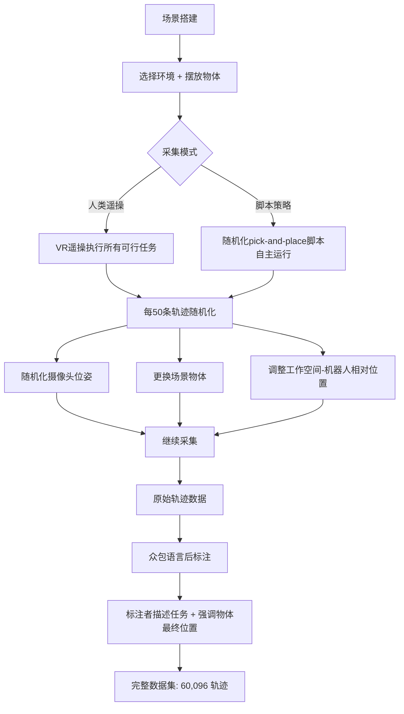
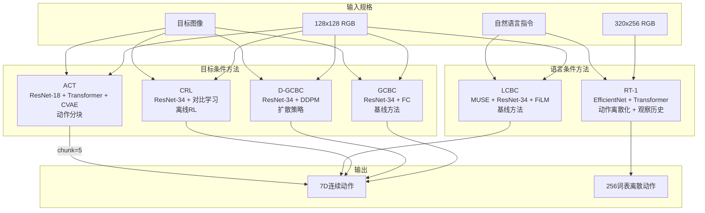

# 第一章：BridgeData V2 — 机器人规模化学习的数据基石

## 论文信息

- **标题**: BridgeData V2: A Dataset for Robot Learning at Scale
- **发表时间**: 2023 年 8 月 24 日（arXiv 首发），2024 年 1 月 17 日（v3 修订）
- **会议**: 7th Conference on Robot Learning (CoRL 2023), Atlanta, USA
- **arXiv**: [https://arxiv.org/abs/2308.12952](https://arxiv.org/abs/2308.12952)
- **核心作者**: Homer Walke, Kevin Black, Abraham Lee, Moo Jin Kim, Max Du, Chongyi Zheng, Tony Zhao, Philippe Hansen-Estruch, Quan Vuong, Andre He, Vivek Myers, Kuan Fang, Chelsea Finn, Sergey Levine
- **机构**: UC Berkeley, Stanford, Google DeepMind, CMU
- **在 PI 演进链中的位置**: 数据基础设施层 -- 为后续 DROID、Octo、$\pi_0$、$\pi_{0.5}$ 等全部工作提供数据范式和评估基准

---

## 1. 解决了什么问题 & 相对前作的定位

### 1.1 核心问题陈述

2023 年的机器人学习领域面临一个结构性矛盾：计算机视觉和自然语言处理已经充分验证了"大规模多样数据 + 高容量模型 $\Rightarrow$ 广泛泛化"这一范式（GPT-3、DALL-E 等），但机器人操作领域缺乏一个同时满足以下四个条件的公开数据集：

1. **规模充足**：轨迹数量足以支撑高容量模型的训练
2. **多样性覆盖**：涵盖足够多的环境、技能、物体，使策略能泛化至全新场景
3. **硬件可达**：基于公开可购买的低成本机器人，任何学术实验室均可复现
4. **方法无关**：同时兼容目标条件模仿学习、语言条件模仿学习、离线强化学习等不同范式

### 1.2 与既有数据集的系统性对比

下表汇总了 BridgeData V2 发表时主要机器人操作数据集的关键指标：

| 数据集 | 轨迹数 | 技能数 | 环境数 | 语言标注 | 数据公开 | 机器人公开 | 采集方式 |
|--------|--------|--------|--------|----------|----------|------------|----------|
| MIME (2018) | 8.3k | 12 | 1 | 否 | 是 | 是 | 人类遥操 |
| RoboTurk (2018) | 2.1k | 2 | 1 | 否 | 是 | 是 | 人类遥操 |
| RoboNet (2019) | 162k | N/A | 10 | 否 | 是 | 是 | 脚本 |
| MT-Opt (2021) | 800k | 1 | 1 | 否 | 否 | 是 | 脚本+学习 |
| BridgeData V1 (2021) | 7.2k | 4 | 12 | 是 | 是 | 是 | 人类遥操 |
| BC-Z (2021) | 26k | 3 | 1 | 是 | 是 | **否** | 人类遥操 |
| RT-1 (2022) | 130k | 2 | 3 | 是 | **否** | **否** | 人类遥操 |
| RH20T (2023) | 13k | 41 | 50 | 是 | 是 | 是 | 人类遥操 |
| RoboSet (2023) | 98.5k | 6 | 11 | 是 | 是 | 是 | 29%人类/71%脚本 |
| **BridgeData V2** | **60.1k** | **13** | **24** | **是** | **是** | **是** | **84%人类/16%脚本** |

从这张对比表中可以提炼出 BridgeData V2 的差异化定位：

- **相对 MIME/RoboTurk**：这些早期数据集仅在单一环境中操作，研究者必须精确复制原始场景才能使用，完全不具备跨环境泛化能力。BridgeData V2 覆盖 24 个异构环境，直接支持跨环境迁移。
- **相对 RoboNet**：虽然 RoboNet 拥有 162k 轨迹和 10 个环境，但其数据完全由脚本策略收集，缺乏有意义的任务语义（无技能分类、无语言标注），本质上是视觉预测的基准而非操作学习的基准。
- **相对 MT-Opt**：Google 的 MT-Opt 数据量巨大（800k），但仅覆盖单一抓取技能、单一环境，且数据和机器人均不公开，对学术社区无可及性。
- **相对 BC-Z/RT-1**：这两个 Google 数据集提供了语言条件学习的基准，但使用的是专有机器人平台，学术实验室无法获取硬件进行验证和扩展。RT-1 的数据甚至完全不公开。
- **相对 BridgeData V1**：V2 是 V1 的直接扩展，轨迹数从 7.2k 增至 60.1k（$\times 8.3$），技能从 4 种增至 13 种，环境从 12 个增至 24 个，并新增了语言标注和脚本采集数据。更关键的是采集哲学的转变：V1 针对预定义任务集收集，V2 采用开放式多任务收集。
- **相对 RH20T**：同期发布的 RH20T 在环境多样性（50 个）和技能多样性（41 种）上超越 BridgeData V2，但轨迹量仅 13k，且论文缺乏对训练策略泛化能力的系统性验证。

### 1.3 在 PI 演进链中的定位

BridgeData V2 虽然在严格意义上不是 Physical Intelligence 公司的作品（发表时 PI 尚未成立），但它是 PI 创始团队（Sergey Levine、Chelsea Finn 等）的核心产出，构成了 PI 整个技术栈的 **数据哲学基础**。它确立了三个贯穿后续全部工作的核心信条：

1. **数据多样性优先于数据规模**：技能多样性实验（见第 7 节）首次给出定量证据
2. **低成本硬件标准化**：$4,000 的 WidowX 250 平台为跨机构数据聚合铺平道路
3. **开放生态系统**：数据公开 + 机器人公开 + 多方法兼容 = 社区规模化效应

---

## 2. 创新点

### 创新点 1：跨机构可复用的开放数据生态系统 [变革性]

BridgeData V2 首次在机器人操作领域实现了"数据公开 + 硬件公开 + 方法兼容"的完整开放生态。此前的大规模数据集要么使用专有机器人（RT-1 使用 Everyday Robots、BC-Z 使用非公开平台），要么数据不公开（MT-Opt），要么仅与单一方法搭配评估。BridgeData V2 不仅公开全部数据和预训练模型，还选择了任何实验室都能在两周内采购到位的低成本平台（总成本约 \$4,000），并用 6 种不同假设的学习方法进行了全面评估。这一设计直接催生了后续的 Open X-Embodiment 联合数据集和 DROID 跨机构采集范式。

### 创新点 2：开放式多任务数据收集协议 [显著]

与 V1 的预定义任务列表不同，V2 采用了"在场景中执行所有可行任务"的收集策略。操作者无需遵循固定任务序列，无需在轨迹间重置物体位置，无需实时标注。每 50 条轨迹进行一次系统性随机化（摄像头位姿、物体组合、工作空间位置）。这一协议有两个深远意义：（a）强制策略关注任务指令而非从初始观察推断任务；（b）极大提高了数据收集效率，使单一机构在合理时间内产出大规模数据集成为可能。

### 创新点 3：人类示范与脚本策略数据的混合采集 [显著]

BridgeData V2 的 60,096 条轨迹中包含 50,365 条人类遥操示范和 9,731 条自动化脚本策略数据。脚本策略高度随机化，频繁失败，产生次优轨迹。这一设计意图明确：为离线强化学习方法（如 CRL）提供覆盖更广、包含负面样本的数据分布，同时保持数据集对模仿学习方法的兼容性（用户可选择性排除脚本数据）。

### 创新点 4：规模化定律的首次实证验证 [显著]

论文通过系统性消融实验首次在机器人操作领域定量验证了三条缩放规律：模型容量 $\uparrow$ $\Rightarrow$ 性能 $\uparrow$、数据规模 $\uparrow$ $\Rightarrow$ 性能 $\uparrow$、技能多样性 $\uparrow$ $\Rightarrow$ 泛化 $\uparrow$。特别是技能多样性实验（3 技能 vs 13 技能，控制数据量近似）揭示了不同技能间的正迁移效应，这一发现超越了 RT-1 仅验证物体多样性的结论。

### 创新点 5：语言后标注与开放词汇任务指定 [增量]

通过众包平台对全部轨迹进行后标注，使数据集同时支持目标图像条件和自然语言条件两种任务指定方式。虽然语言标注本身不是技术创新，但与开放式收集协议结合后，它使得数据集能支撑开放词汇的多任务学习——策略可以响应训练集中从未出现过的自然语言指令。

---

## 3. 数据来源、处理方式及其原因

### 3.1 硬件规格

| 组件 | 规格 | 选择原因 |
|------|------|----------|
| 机械臂 | WidowX 250（Trossen Robotics） | 公开可购、成本低（<\$2,000）、交付<2周 |
| 固定摄像头 | Intel RealSense D435 RGBD | 同时提供 RGB 和深度信息 |
| 随机化摄像头 | 2x Logitech C920 | 低成本、位姿每 50 轨迹随机化 |
| 腕部摄像头 | Raspberry Pi Camera + 3D打印支架 | 提供末端视角、成本极低 |
| 遥操设备 | Meta Quest 2 VR 头盔 | 直观的 6DoF 控制 |
| 图像分辨率 | $640 \times 480$ | 平衡信息量与存储/计算成本 |
| 控制频率 | 5 Hz | 匹配遥操作人类反应速度 |
| 总成本 | $\sim\$4,000$ | 确保学术实验室可负担 |

### 3.2 数据收集流程

### 3.3 数据集统计特征

**总体规模**：

$$N_{\text{total}} = N_{\text{human}} + N_{\text{scripted}} = 50{,}365 + 9{,}731 = 60{,}096$$

**技能分布**：数据集以基础操作技能为主体，其分布呈长尾形态。Pick-and-place（含原地重定向）占据最大比例，因其是最广泛适用的基础技能，且可向更复杂行为迁移。完整的 13 种技能包括：

| 技能类别 | 具体技能 |
|----------|----------|
| 基础物体操作 | Pick-and-place、推物、重定向物体 |
| 表面交互 | 擦拭、扫（工具+颗粒介质） |
| 物体组合 | 堆叠积木 |
| 柔性物体 | 折叠布料 |
| 环境操控 | 开关抽屉、开关门、开关纸箱翻盖 |
| 精细操作 | 旋钮、翻开关、拉拉链、转杠杆 |

**环境覆盖**：24 个环境分为 4 大类——玩具厨房（7 个，含水槽/灶台/微波炉的不同组合）、桌面（多种）、独立水槽、特殊环境（玩具洗衣机等）。

**摄像头覆盖**：由于硬件在采集过程中逐步升级，大部分数据仅包含固定肩视摄像头视角，少量数据包含全部 4 个视角（肩视 + 2 随机化 + 腕部）。深度数据仅在肩视摄像头位置可用。

### 3.4 动作空间定义

$$\mathbf{a} \in \mathbb{R}^7 = [\Delta x, \Delta y, \Delta z, \Delta \text{roll}, \Delta \text{pitch}, \Delta \text{yaw}, g]$$

其中前 6 维为笛卡尔末端执行器的相对位姿变化（连续值），$g$ 为离散的夹爪开关指令。这一设计在简洁性与表达力之间取得了平衡：相对位姿避免了绝对坐标系标定的困难，7 维动作空间使策略网络的输出维度保持可控。

---

## 4. 模型结构及设计原因

作为数据集论文，BridgeData V2 的核心贡献不在于提出新模型，而在于验证数据集对多种异构学习方法的通用兼容性。论文评估了 6 种代表性方法，覆盖了当时机器人学习的主要范式。

### 4.1 评估方法架构总览

### 4.2 各方法的关键设计决策对比

| 设计维度 | GCBC | D-GCBC | ACT | CRL | LCBC | RT-1 |
|----------|------|--------|-----|-----|------|------|
| 图像编码器 | ResNet-34 | ResNet-34 | ResNet-18 | ResNet-34 | ResNet-34+FiLM | EfficientNet |
| 输入分辨率 | $128^2$ | $128^2$ | $128^2$ | $128^2$ | $128^2$ | $320 \times 256$ |
| 动作表示 | 连续单步 | 扩散连续 | 连续chunk=5 | 连续单步 | 连续单步 | 离散256词表 |
| 多模态建模 | 无 | DDPM | CVAE | 隐式 | 无 | 离散化 |
| 观察历史 | 否 | 否 | 否 | 否 | 否 | 是（seq=15） |
| 任务条件 | 目标图像 | 目标图像 | 目标图像 | 目标图像 | 语言 | 语言 |
| 学习范式 | BC | BC | BC | 离线RL | BC | BC |

### 4.3 关键数学表达

**GCBC 目标采样**：训练时，给定轨迹 $\tau = (o_1, a_1, \ldots, o_T, a_T)$，对时间步 $t$ 的目标图像 $g$ 从未来观察中均匀采样：

$$g \sim \text{Uniform}(\{o_{t+1}, o_{t+2}, \ldots, o_T\})$$

**D-GCBC 扩散目标（DDPM）**：

$$\mathcal{L}_{\text{DDPM}} = \mathbb{E}_{t, \mathbf{a}_0, \boldsymbol{\epsilon}} \left[ \left\| \boldsymbol{\epsilon} - \boldsymbol{\epsilon}_\theta(\mathbf{a}_t, t, \mathbf{z}) \right\|^2 \right]$$

其中 $\mathbf{z}$ 为图像编码器输出的条件特征，$\mathbf{a}_t$ 为加噪后的动作，$\boldsymbol{\epsilon}_\theta$ 为去噪网络。

**CRL 对比目标**：将目标条件值函数参数化为表征的内积：

$$V(s, g) = \phi(s)^\top \psi(g)$$

通过对比学习框架训练，正样本为轨迹中实际到达的未来状态，负样本为批次中随机采样的状态。

**RT-1 动作离散化**：每个动作维度缩放至 $[-1, 1]$，然后用 256 个均匀分布的 bin 进行离散化：

$$a_{\text{token}} = \left\lfloor \frac{a + 1}{2} \times 255 \right\rfloor$$

---

## 5. 训练方法（算法与工程）

### 5.1 统一训练基础设施

所有方法共享以下训练配置：

- **优化器**: Adam，学习率 $\eta = 3 \times 10^{-4}$
- **学习率调度**: 线性 warmup，2000 步
- **数据增强**: 随机裁剪、随机缩放、颜色抖动
- **目标条件训练目标**: 从轨迹未来时间步均匀采样观察作为目标图像

### 5.2 方法特定工程适配

**ACT 的 chunk size 调整**：原始 ACT 设计用于 50 Hz 控制频率和 1000 步轨迹，chunk size 为 100。BridgeData V2 的控制频率为 5 Hz，轨迹长度约 50-100 步，因此将 chunk size 调整为 5，并将原本的单任务架构改造为目标条件版本。ACT 在单张 NVIDIA 2080Ti 上训练 3 天即可收敛。

**CRL 的稳定性调整**：将 GCBC 正则化系数增至 0.2（原始值更小），以避免采样分布外动作。使用与其他方法相同的 batch size 确保公平比较。编码器在值函数和策略间共享权重，促进因果信息的传递。

**RT-1 的序列长度调整**：Transformer 序列长度从原始的 6 增至 15，以适配 BridgeData V2 更长的 episode 长度。

### 5.3 缩放实验的数据集构建

为系统研究缩放效应，论文精心构建了多个数据集变体：

- **规模消融**：通过按任务分层随机下采样（stratified subsampling）生成 25%/50%/75%/100% 的子集，保持技能多样性比例不变
- **多样性消融**：构建两个规模匹配的数据集——3 技能版本（$\sim$28k 轨迹，仅 pick-and-place/推/擦拭）和 13 技能版本（$\sim$27k 轨迹）
- **V1 vs V2 消融**：BridgeData V1 + PTR（13k 轨迹/15 环境/11 技能）与完整 BridgeData V2（60k 轨迹/24 环境/13 技能）

---

## 6. 实验关键发现与效果对比

### 6.1 已见任务评估（Table 2）

在 8 个训练集中出现过的任务上，每个任务 10 次试验：

| 任务 | GCBC | D-GCBC | ACT | CRL | LCBC | RT-1 |
|------|------|--------|-----|-----|------|------|
| 打开抽屉 | 0.4 | 0.6 | 0.5 | 0.4 | 0.5 | **1.0** |
| 用棒扫豆子成堆 | **0.9** | **0.9** | **0.9** | 0.7 | 0.4 | 0.6 |
| 折叠蓝色薄布 | 0.4 | 0.7 | 0.7 | 0.5 | 0.5 | **0.9** |
| 堆叠绿色积木到黄色上 | 0.4 | 0.2 | 0.3 | **0.6** | 0.0 | 0.0 |
| 放玉米进锅 | **0.9** | 0.8 | 0.8 | 0.8 | 0.0 | 0.0 |
| 放胡萝卜到盘子上 | **0.7** | 0.4 | 0.1 | 0.0 | 0.0 | **0.8** |
| 翻转锅正面朝上 | 0.1 | 0.1 | 0.0 | **0.4** | **0.4** | **0.4** |
| 放茄子进锅 | 0.1 | **0.2** | 0.0 | 0.0 | 0.0 | **0.2** |
| **平均** | **0.49** | **0.49** | 0.41 | 0.42 | 0.23 | **0.49** |

**关键发现**：
- GCBC、D-GCBC 和 RT-1 以 49% 的平均成功率并列最优，说明在数据充足时，即使是简单的 BC 基线也能取得可观性能
- RT-1 显著优于 LCBC 基线（49% vs 23%），差距源于更大图像分辨率（$320 \times 256$ vs $128^2$）、动作离散化和观察历史的综合效应
- CRL 作为唯一的离线 RL 方法，在堆叠积木（0.6）和翻转锅（0.4）等需要精确控制的任务上表现突出，显示值函数引导的优势
- 语言条件方法在某些任务上完全失败（LCBC/RT-1 在"放玉米进锅"上均为 0.0），暗示语言接地的局限性

### 6.2 未见任务泛化评估（Table 3）

| 任务 | 泛化类型 | GCBC | D-GCBC | ACT | CRL | LCBC | RT-1 |
|------|----------|------|--------|-----|-----|------|------|
| 用刷子扫米成堆 | 未见物体+见过环境 | **0.6** | 0.0 | 0.3 | 0.3 | 0.0 | 0.1 |
| 折叠灰色厚布 | 未见物体+见过环境 | 0.3 | 0.6 | **0.7** | 0.0 | 0.0 | 0.4 |
| 放记号笔进碗 | 未见物体+未见环境 | 0.6 | 0.6 | 0.2 | **0.7** | 0.0 | 0.0 |
| 用布擦桌子 | 见过物体+未见环境 | 0.6 | 0.5 | 0.4 | 0.6 | 0.4 | **0.9** |
| 放蘑菇进锅 | 见过物体+未见环境 | 0.7 | **0.9** | 0.1 | 0.7 | 0.1 | 0.6 |
| 放勺子到布上 | 见过物体+未见环境 | **0.8** | 0.7 | 0.0 | **0.8** | 0.0 | **1.0** |
| **平均** | — | **0.60** | 0.55 | 0.28 | 0.52 | 0.08 | 0.50 |

**关键发现**：
- GCBC 在未见任务上以 60% 平均成功率**反超**所有方法（包括更复杂的 D-GCBC 和 RT-1），这一反直觉结果表明简单方法在泛化场景下有时更鲁棒
- LCBC 灾难性崩溃至 8%：未见物体的名称在训练数据中缺乏语言接地，语言条件策略完全无法执行
- ACT 泛化能力最弱（28%），其动作分块机制可能过度拟合了训练环境的动作序列模式
- RT-1 在见过物体+未见环境的任务上表现优异（如"放勺子到布上"达到 100%），但在未见物体任务上完全失败（"放记号笔进碗"为 0.0），显示语言条件方法的泛化模式与目标条件方法截然不同

### 6.3 跨机构迁移评估（Table 4）

| 任务 | GCBC | D-GCBC | ACT | CRL | LCBC | RT-1 |
|------|------|--------|-----|-----|------|------|
| 放胡萝卜到盘子上 | $0.7 \to 0.3$ | $0.4 \to 0.0$ | $0.1 \to 0.0$ | $0.0 \to 0.3$ | $0.0 \to 0.0$ | $0.8 \to 0.4$ |
| 翻转锅正面朝上 | $0.1 \to 0.0$ | $0.1 \to 0.2$ | $0.0 \to 0.3$ | $0.4 \to 0.2$ | $0.4 \to 0.1$ | $0.4 \to 0.6$ |
| 放茄子进锅 | $0.1 \to 0.1$ | $0.2 \to 0.2$ | $0.0 \to 0.0$ | $0.0 \to 0.1$ | $0.0 \to 0.0$ | $0.2 \to 0.2$ |
| **平均** | $0.30 \to 0.13$ | $0.23 \to 0.13$ | $0.03 \to 0.10$ | $0.13 \to 0.20$ | $0.13 \to 0.03$ | $0.47 \to 0.40$ |

**关键发现**：
- RT-1 跨机构迁移最为鲁棒，平均成功率仅从 47% 降至 40%（下降 7 个百分点），可能得益于其更大的输入分辨率和观察历史提供了更丰富的视觉上下文
- 所有方法均实现非零成功率（零样本，无任何 Lab 2 数据微调），**首次定量证明**标准化低成本平台上收集的多样化数据可以支持跨机构迁移
- 目标条件方法退化更严重（GCBC 从 30% 降至 13%），因为目标图像中包含了环境特定的视觉细节，跨域时这些细节成为干扰信号

---

## 7. 消融实验的发现

按影响幅度从高到低排序：

### 7.1 数据集规模 + 多样性综合效应 [影响最大]

BridgeData V1+PTR（13k/15环境/11技能）训练的 GCBC 在未见任务上平均成功率仅 8%，而 BridgeData V2（60k/24环境/13技能）达到 **70%**，提升 $\times 8.75$。这是所有消融中最大的效应，说明数据的规模和多样性对泛化能力有决定性影响。

$$\text{提升倍数} = \frac{0.70}{0.08} = 8.75\times$$

### 7.2 技能多样性的正迁移效应 [影响大]

控制数据集总量（$\sim$28k vs $\sim$27k），13 技能数据集在未见 pick-and-place 任务上成功率 **65%**，3 技能数据集仅 **30%**，绝对提升 35 个百分点。这一发现的理论意义深远：不同技能之间存在正迁移，折叠、堆叠、扫等技能的数据帮助模型学习了更通用的视觉-运动表征，即使评估任务是纯粹的 pick-and-place。此发现扩展了 RT-1（Brohan et al.）仅验证物体多样性有益的结论，将其推广到技能多样性维度。

### 7.3 数据集规模的单调递增效应 [影响中等]

按任务分层下采样生成 25%/50%/75%/100% 子集，在已见和未见任务上均观察到成功率随数据量单调递增。未见任务的提升更为显著，表明数据规模对分布外泛化的边际效用更高。

### 7.4 模型容量效应 [影响中等]

在"移动勺子"任务上比较 ResNet-18/34/50：

$$\text{ResNet-18} < \text{ResNet-34} < \text{ResNet-50}$$

成功率严格递增。定性分析显示，较小模型无法学习精细的腕关节旋转控制（如抓取水平放置的勺子时无法正确旋转夹爪），说明模型容量不足会造成底层运动原语的缺失。

---

## 8. 优化有效性评估

### 8.1 最有效的设计决策

**开放式多任务收集协议** 被证明是 BridgeData V2 最关键的设计决策。证据链如下：

1. V1 的预定义任务收集产生了技能多样性不足的数据（4 种技能），而 V2 的开放式收集自然产生了 13 种技能
2. 技能多样性消融直接证明 13 技能 vs 3 技能带来了 $35\%$ 的绝对性能提升
3. 开放式收集使同一场景中包含多种可行任务，强制策略学习条件化执行，这是支持开放词汇任务指定的前提

**低成本硬件标准化** 的有效性通过跨机构实验（Table 4）得到验证：Lab 2 在零样本条件下实现非零成功率，证明 \$4,000 平台的标准化确实降低了数据集的使用门槛。

**混合人类/脚本数据** 的有效性虽然未被直接消融，但 CRL（唯一的离线 RL 方法）在堆叠积木等任务上的优异表现间接证明了次优脚本数据的价值——RL 方法从覆盖更广的数据分布中提取了更鲁棒的行为。

### 8.2 效果有限的设计决策

**语言后标注**的效果有限。LCBC 在已见任务上仅 23%、未见任务上 8%，远低于目标条件方法。仅当搭配高容量架构（RT-1）时语言条件才展现竞争力，说明语言标注的价值高度依赖于模型容量和预训练视觉-语言特征的质量。

**动作分块（ACT）** 在跨任务泛化场景下反而成为劣势（未见任务平均仅 28%），可能因为序列化的动作预测更容易过拟合训练环境的时序模式。

---

## 9. 与后续工作的关联

BridgeData V2 在 PI 技术演进链中扮演了"数据哲学奠基者"的角色，其影响贯穿后续全部工作：

### 9.1 直接数据继承

- **DROID**（第二章）：将 BridgeData V2 的"低成本标准化平台 + 开放式收集协议"范式从单一机构扩展至跨机构联盟，使用更先进的 Franka 机械臂在全球多个实验室收集数据。BridgeData V2 证明的"跨机构迁移可行性"是 DROID 项目立项的核心依据。
- **Open X-Embodiment**：BridgeData V2 作为贡献最大的数据源之一被纳入 Open X-Embodiment 跨具身数据集，其标准化的数据格式和开放协议为多源数据聚合提供了范例。

### 9.2 方法论启发

- **Octo**（第三章）：BridgeData V2 的多方法兼容性评估证明了"通用基础模型"的可行性——既然一个数据集可以同时服务于 6 种不同方法，那么一个基础模型也应该能适配多种下游任务。Octo 直接在 BridgeData V2 上进行了大量预训练和评估。
- **$\pi_0$**（第四章）：BridgeData V2 的缩放实验（模型容量、数据规模、技能多样性三者均单调提升性能）为 $\pi_0$ 追求更大模型（PaliGemma 2-3B + 300M action expert）和更大数据（10k+ 小时）提供了理论支撑。
- **$\pi_0$-FAST**（第五章）：RT-1 在 BridgeData V2 上的动作离散化实验（256 词表）为 FAST tokenizer 的 FSQ 离散化提供了早期探索。

### 9.3 哲学层面的遗产

BridgeData V2 确立的三条核心信条——数据多样性 > 数据规模、开放标准化 > 封闭规模化、方法无关 > 方法绑定——成为 PI 整个研究路线的指导原则。从 BridgeData V2 的 \$4,000 WidowX 到 DROID 的 Franka，从 60k 轨迹到 $\pi_0$ 的 10k+ 小时，从 6 种评估方法到 $\pi_{0.5}$ 的统一 VLA 架构，这条演进路径的每一步都可以追溯到 BridgeData V2 的实证发现。

论文最后指出的三个局限性——任务精度有限、单机构采集、单一机器人形态——恰好预示了后续工作的发展方向：DROID 解决了跨机构问题，$\pi_0$ 解决了精度和复杂度问题，而多机器人形态泛化则成为 $\pi_{0.5}$ 和更远期工作的核心目标。
