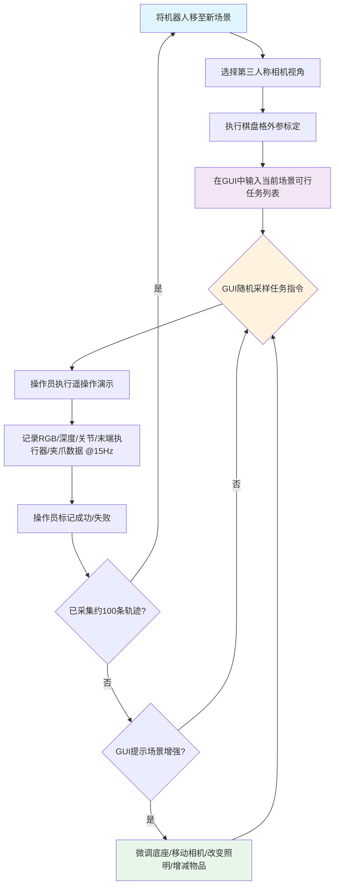
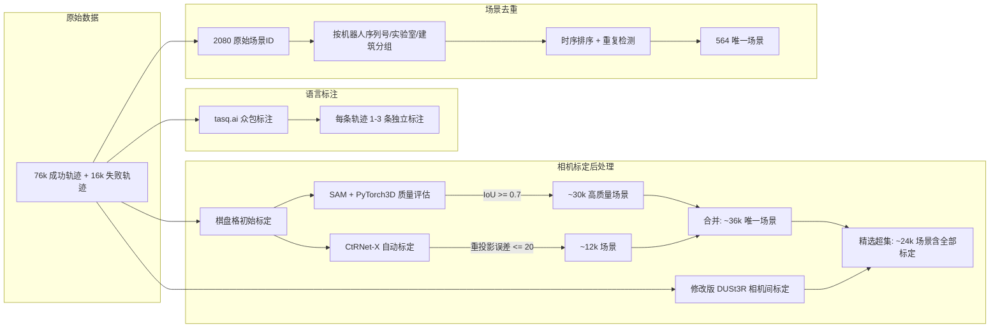
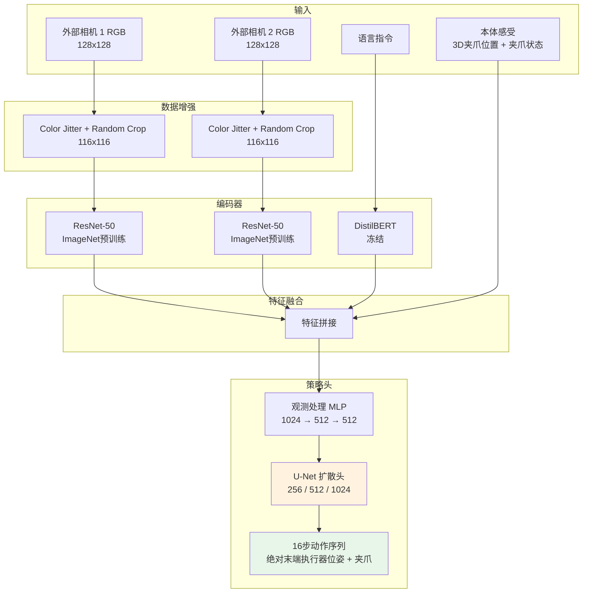
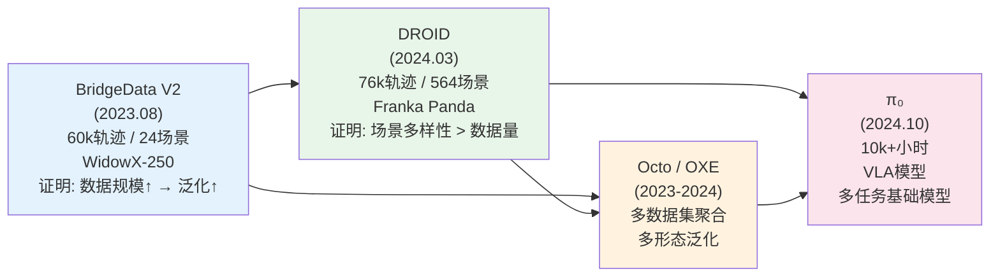

# 第二章：DROID — 大规模野外机器人操作数据集

> **系列定位**：本章是 Physical Intelligence (PI) 研究演进深度对比分析的第二章。DROID 作为继 BridgeData V2 之后的第二篇关键论文，将机器人操作数据集的核心范式从"扩大轨迹数量"转向"扩大场景多样性"，并通过分布式跨机构采集实现了场景覆盖的数量级跃迁。

---

## 论文信息

| 项目 | 内容 |
|------|------|
| **论文标题** | DROID: A Large-Scale In-The-Wild Robot Manipulation Dataset |
| **发表时间** | 2024-03-19 (arXiv); 2024-07 (RSS 2024, Delft, Netherlands) |
| **arXiv** | [https://arxiv.org/abs/2403.12945](https://arxiv.org/abs/2403.12945) |
| **项目主页** | [https://droid-dataset.github.io](https://droid-dataset.github.io) |
| **项目联合负责人** | Alexander Khazatsky (Stanford), Karl Pertsch (Berkeley/Stanford) |
| **研究负责人** | Suraj Nair, Ashwin Balakrishna, Sudeep Dasari, Siddharth Karamcheti, Soroush Nasiriany, Mohan Kumar Srirama |
| **首席顾问** | Chelsea Finn (Stanford) |
| **顾问团** | Sergey Levine (Berkeley), Jitendra Malik, Jeannette Bohg, Yuke Zhu, Shuran Song 等 17 位 |
| **参与机构** | Stanford, UC Berkeley, Toyota Research Institute (TRI), CMU, UT Austin, Google DeepMind, KAIST, U of Washington, U of Montreal, U of Edinburgh, Princeton, UC San Diego, UC Davis, U of Pennsylvania 等 13+ 机构 |
| **作者总数** | 100+ 位 |

---

## 1. 解决了什么问题 & 相对前作的定位

### 1.1 核心问题

DROID 直面机器人操作领域最根本的数据瓶颈：**现有数据集的场景多样性严重不足，导致训练出的策略无法在新环境中泛化**。计算机视觉和自然语言处理的成功已经证明，大规模、高多样性的训练数据是通用模型的基石。但与图像和文本不同，机器人操作数据无法从互联网爬取，必须依赖物理机器人在真实环境中交互采集。这一固有约束导致即使是当时最先进的通用操作策略，其训练数据也主要集中在少数受控实验室环境中。

### 1.2 对 BridgeData V2 的直接承继与超越

DROID 与 BridgeData V2 在研究谱系上有明确的承继关系——两篇论文共享大量核心作者（Karl Pertsch、Sudeep Dasari、Chelsea Finn、Sergey Levine 等），且 DROID 在论文中将 BridgeData V2 作为核心对比对象之一。然而，DROID 对 BridgeData V2 的局限性做了系统性的诊断和突破：

**BridgeData V2 的三重局限**：

1. **场景多样性瓶颈**：BridgeData V2 仅覆盖 24 个场景，且这些场景主要集中在少数实验室和厨房环境中。虽然它在技能多样性（13 种技能、82 种去重动词）上已有突破，但场景的同质性意味着策略难以泛化到视觉外观差异显著的新环境。
2. **单一机器人形态**：BridgeData V2 全部使用 WidowX-250 低成本机械臂，虽然降低了准入门槛，但其 5 自由度 + 5Hz 控制频率限制了操作的精细度和复杂度。
3. **地理与机构集中**：数据主要由 UC Berkeley 及少数合作机构采集，地理分布有限，场景的文化和物理多样性不足。

**DROID 的定位逻辑**：不是简单地"收集更多轨迹"，而是从根本上改变数据采集的组织方式——通过分布式跨机构采集，将场景多样性提升一个数量级。

| 维度 | BridgeData V2 | DROID | 提升倍数 |
|------|-------------|-------|---------|
| 轨迹数 | 60,096 | 76,000 | 1.3x |
| 场景数 | 24 | 564 | **23.5x** |
| 建筑数 | ~3 | 52 | **~17x** |
| 场景类型 | ~3 种 (厨房/桌面/水槽) | 10 种 (厨房/办公室/卧室/浴室/客厅等) | **3.3x** |
| 去重动词数 | 82 | 86 | 1.05x |
| 相机视角数 | ~固定 | 1,417 唯一视角 | 数量级提升 |
| 采集机构数 | ~3 | 13 | **~4x** |
| 采集人员数 | 未公开 | 50 | -- |
| 地理覆盖 | 北美 | 北美 + 亚洲 + 欧洲 | 3 大洲 |

这组数据揭示了 DROID 的核心洞察：**轨迹数量仅增长 1.3 倍，但场景数量增长 23.5 倍**。DROID 的价值不在于"更多数据"，而在于"更多样的数据"。

### 1.3 相对其他数据集的定位

DROID 还需要与更广泛的数据集生态进行比较：

| 数据集 | 轨迹数 | 动词数 | 场景数 | 语言标注 | 相机标定 | 公开硬件 |
|--------|--------|--------|--------|---------|---------|---------|
| MIME | 8.3k | 20 | 1 | -- | -- | Yes |
| RoboTurk | 2.1k | 2 | 1 | -- | -- | Yes |
| RoboNet | 162k | n/a | 10 | -- | -- | Yes |
| MT-Opt | 800k | 2 | 1 | -- | -- | Yes |
| BridgeData V1 | 7.2k | 4 | 12 | Yes | -- | Yes |
| BC-Z | 26k | 3 | 1 | Yes | -- | No |
| RT-1 | 130k | 2 | 2 | Yes | -- | No |
| RH20T | 13k | 33 | 7 | Yes | Yes | Yes |
| RoboSet | 98.5k | 9 | 11 | Yes | -- | Yes |
| BridgeData V2 | 60.1k | 82 | 24 | Yes | -- | Yes |
| OXE (聚合) | 1.4M | 217 | ~311 | 部分 | -- | 部分 |
| **DROID** | **76k** | **86** | **564** | **Yes** | **Yes** | **Yes** |

关键观察：即使 OXE 聚合了包括 BridgeData V2 在内的几乎所有主要数据集，其场景总数（~311）仍低于 DROID 单一数据集的 564 个场景。而 MT-Opt 虽拥有 800k 轨迹（是 DROID 的 10 倍），但仅有 1 个场景和 2 种动词，说明单纯的数据量并不等同于数据多样性。

### 1.4 为什么场景多样性比轨迹数量更重要

DROID 提出并验证了一个关键假设：**在机器人操作数据中，场景多样性是驱动策略泛化的首要因素，其重要性超越数据总量**。这一假设的逻辑基础是：

- 场景变化引入了最大的视觉分布偏移——不同的背景、光照、桌面高度、物体布局
- 在少数场景中收集大量轨迹会导致策略过拟合于特定的视觉模式
- 真实部署场景几乎必然与训练场景不同，场景泛化是实用性的前提

这一假设后来被 DROID 的消融实验有力证实（见第 7 节），成为该领域的重要认知转折点。

---

## 2. 创新点

### 创新点 1：分布式跨机构数据采集范式 [变革性]

DROID 的首要创新不是算法或模型，而是**数据采集的组织范式**。通过在 3 大洲、13 个机构部署 18 套标准化机器人平台，由 50 名数据采集员在 12 个月内持续采集，DROID 实现了机器人操作领域前所未有的场景多样性。这一范式借鉴了自动驾驶领域（Waymo、nuScenes）的分布式数据采集经验，首次将其系统性地应用于机器人操作。

相比 BridgeData V2 主要依赖 Berkeley 实验室及少数合作机构的集中式采集，DROID 的分布式架构带来了三重优势：(1) 地理多样性确保了自然发生的场景差异；(2) 多采集员带来了操作风格的多样性；(3) 并行采集提高了数据积累速度。

### 创新点 2：标准化便携式硬件平台设计 [显著]

为支撑分布式采集的一致性，DROID 设计了高度标准化的便携式硬件平台：Franka Panda 7-DoF 机械臂 + Robotiq 2F-85 夹爪，安装在带轮高度可调的升降桌上，配备 3 路同步立体相机（2x Zed 2 外部 + 1x Zed Mini 腕部），使用单根电源线供电。这一设计在数据质量一致性和场景迁移便捷性之间取得了巧妙平衡。

相比 BridgeData V2 的 WidowX-250 平台（~$4,000, 5-DoF），Franka Panda 是研究社区更广泛采用的工业级机械臂（7-DoF, 15Hz 控制频率），提供了更高的操作精度和更大的工作空间覆盖。然而代价是硬件成本显著增加。

### 创新点 3：GUI 驱动的数据质量保障协议 [显著]

DROID 设计了专用的数据采集 GUI，实现了三个关键功能：(1) 防止常见采集错误（如相机遮挡、操作员入镜）；(2) 通过随机采样任务指令避免对简单任务的偏好；(3) 周期性提示"场景增强"（微调底座、移动相机、改变照明、增减物品）以增加同一场景内的多样性。这种系统化的质量保障机制是 BridgeData V2 开放式采集协议的工程化升级。

### 创新点 4：多维度数据多样性的系统化量化分析框架 [显著]

DROID 建立了分析机器人操作数据集多样性的系统化框架，定义并量化了五个关键维度：任务多样性（动词分布）、物体多样性（交互物体类别）、场景多样性（场景数量和类型）、视角多样性（相机位姿分布）、交互位置多样性（工作空间中的 3D 交互点分布）。这一框架使用 spaCy 语义解析 + GPT-4 去重动词 + GPT-4V 场景分类等自动化工具，首次为数据集的"多样性"提供了可量化、可比较的指标体系。

### 创新点 5：提供相机标定参数和深度信息 [增量性]

DROID 是为数不多提供完整相机标定矩阵（内参 + 外参）和深度信息的大规模操作数据集。后处理流程包括：(a) 基于 SAM + PyTorch3D 渲染的自动标定质量评估（IoU $\geq$ 0.7），过滤出约 30k 高质量场景；(b) 基于 CtRNet-X 的自动标定补充约 12k 场景；(c) 基于修改版 DUSt3R 的相机间标定。这使得 DROID 可用于 3D 视觉和视角不变表征学习等 BridgeData V2 无法支持的下游任务。

### 创新点 6：场景多样性 vs. 数据量的因果分离实验 [显著]

DROID 设计了精巧的控制实验（7k 轨迹/20 场景 vs. 7k 轨迹/多样场景），首次在控制数据量的条件下因果性地分离出场景多样性对策略泛化的独立贡献。这一实验设计为该领域提供了关键的实证证据，影响了后续所有大规模数据集的设计哲学。

---

## 3. 数据来源、处理方式及其原因

### 3.1 硬件平台规格

DROID 硬件平台的设计遵循"标准化 + 便携性 + 高质量"三原则：

| 组件 | 规格 | 设计理由 |
|------|------|---------|
| 机械臂 | Franka Emika Panda 7-DoF | 学术界广泛采用、可靠、多数机构已有 |
| 夹爪 | Robotiq 2F-85 | 连续控制、力控能力、工业标准 |
| 外部相机 | 2x Zed 2 立体相机 (可调三脚架) | 立体视觉 + 深度、灵活视角调整 |
| 腕部相机 | 1x Zed Mini 立体相机 | 近距离操作观测、手眼协调 |
| 遥操作 | Meta Quest 2 控制器 | 6D 位姿控制 + 连续夹爪 |
| 移动平台 | 带轮高度可调升降桌 | 场景间快速迁移 |
| 控制器 | Polymetis (NUC) | 低延迟关节控制 |
| 控制频率 | 15Hz | 平衡精度与数据量 |
| 图像分辨率 | 1280x720 (原始) | 保留高分辨率细节 |

与 BridgeData V2 硬件的对比：

| 维度 | BridgeData V2 (WidowX-250) | DROID (Franka Panda) |
|------|---------------------------|---------------------|
| 自由度 | 5-DoF + 1D 夹爪 | 7-DoF + 1D 连续夹爪 |
| 控制频率 | 5Hz | 15Hz (3x) |
| 相机数量 | 1 固定 + 2 随机化 RGB | 3 同步立体 (含深度) |
| 图像分辨率 | 640x480 | 1280x720 |
| 深度信息 | 仅 RealSense D435 | 全部 3 路立体相机 |
| 相机标定 | 无 | 完整内参 + 外参 |
| 便携性 | 桌面安装 | 带轮升降桌 |
| 成本 | ~$4,000 | 显著更高 |

### 3.2 数据采集协议

协议设计的关键决策与 BridgeData V2 的对比：

| 设计决策 | BridgeData V2 | DROID | 改进理由 |
|---------|-------------|-------|---------|
| 任务选择 | 操作员自由选择 | GUI 随机采样 | 避免简单任务偏好 |
| 场景切换 | 每50条轨迹换一次 | 每~100条(20分钟)换一次 | 优先场景多样性 |
| 场景增强 | 手动随机化相机/物体 | GUI 系统化提示 | 确保一致执行 |
| 语言标注 | 后标注众包 | 后标注众包 (每条1-3标注) | 增加标注多样性 |
| 质量控制 | 无系统化机制 | GUI 防错 + 成功标记 | 减少低质量数据 |

### 3.3 后处理流程

**相机标定的数学框架**：

对于相机到机器人基座的外参矩阵 $T_{cam \to base}$，质量评估通过以下步骤进行：

1. 利用正运动学从关节角 $\theta$ 计算 3D 关键点 $X \in \mathbb{R}^{N \times 3}$
2. 将关键点投影到图像平面：

$$x = \pi(K \cdot T_{cam \to base} \cdot X)$$

其中 $K$ 为相机内参矩阵，$\pi(\cdot)$ 为透视投影及归一化操作。

3. 使用投影的 2D 关键点引导 SAM 模型预测分割掩码 $M_{SAM}$
4. 通过 PyTorch3D 渲染合成掩码 $M_{GT}$（导入 URDF 网格、应用关节角、变换到相机坐标系）
5. 计算 IoU 度量标定质量：

$$\text{IoU} = \frac{|M_{SAM} \cap M_{GT}|}{|M_{SAM} \cup M_{GT}|}$$

仅保留 SAM 置信度 > 0.65 且 IoU $\geq$ 0.7 的高质量投影。

**CtRNet-X 补充标定**的质量评估使用重投影误差，结合中位绝对偏差（MAD）的离群值剔除策略：

$$\text{MAD} = \text{median}(|e_i - \text{median}(e)|)$$

其中 $e_i$ 为各关键点的重投影误差，仅保留偏差在 $2.5 \times \text{MAD}$ 以内的内点，最终筛选平均重投影误差 $\leq 20$ 的场景。

---

## 4. 模型结构及设计原因

### 4.1 评估策略架构

DROID 的核心贡献是数据集而非新模型。实验中采用 **Diffusion Policy** 作为统一的策略学习骨干，基于 Robomimic 代码库实现，选择原因是扩散策略在多模态动作分布建模上的表达能力已被广泛验证。

### 4.2 与 BridgeData V2 评估策略的对比

| 维度 | BridgeData V2 | DROID |
|------|-------------|-------|
| 评估方法数 | 6 种 (GCBC, D-GCBC, ACT, CRL, LCBC, RT-1) | 1 种 (Diffusion Policy) |
| 条件类型 | 目标图像 + 语言 | 仅语言 |
| 视觉编码器 | ResNet-34 | ResNet-50 |
| 图像分辨率 | 128x128 | 128x128 (裁剪至 116x116) |
| 动作空间 | 相对 6D 末端执行器 + 离散夹爪 | 绝对末端执行器平移/旋转 + 夹爪 |
| 动作生成 | 单步 (除 ACT 外) | 16步序列 (执行前8步) |
| 控制频率 | 5Hz | 15Hz |
| 视觉输入数 | 1 路 (肩视) | 2 路 (双外部相机) |

DROID 选择仅使用一种策略（Diffusion Policy）进行评估，而非 BridgeData V2 的六种方法对比，反映了其研究重心的不同：DROID 关注的是"数据的价值"而非"方法的对比"。通过固定策略架构，所有性能差异可以归因于训练数据的差异。

### 4.3 数据模式设计

每条 DROID 轨迹的完整数据模式：

| 数据类型 | 维度/格式 | 频率 |
|---------|----------|------|
| RGB 相机流 | 3 路立体, 1280x720 | 15Hz |
| 关节位置 | 7D | 15Hz |
| 关节速度 | 7D | 15Hz |
| 末端执行器位姿 | 6D (相对基座) | 15Hz |
| 末端执行器速度 | 6D | 15Hz |
| 夹爪位置 | 1D | 15Hz |
| 夹爪速度 | 1D | 15Hz |
| 深度图 | 3 路 | 15Hz |
| 自然语言指令 | 1-3 条/轨迹 | 后标注 |
| 相机外参标定 | 4x4 矩阵 | 每场景 |
| 相机内参 | 每路相机 | 固定 |
| 元数据 | 建筑名/采集员ID/场景类型 | 每轨迹 |

这一丰富的数据模式是对 BridgeData V2 的显著扩展——后者不提供深度信息、相机标定或多标注语言指令。同时记录多种流行动作空间（关节空间和末端执行器空间）的等价控制指令，最大化了下游研究的适用性。

---

## 5. 训练方法（算法与工程）

### 5.1 扩散策略训练

DROID 采用 DDIM（Denoising Diffusion Implicit Models）进行动作轨迹去噪生成。扩散过程建模为：

$$q(a_t | a_0) = \mathcal{N}(a_t; \sqrt{\bar{\alpha}_t} a_0, (1 - \bar{\alpha}_t) I)$$

其中 $a_0$ 为真实动作序列，$a_t$ 为第 $t$ 步的噪声版本，$\bar{\alpha}_t = \prod_{s=1}^{t} \alpha_s$ 为噪声调度的累积乘积。

训练损失为标准的去噪目标：

$$\mathcal{L} = \mathbb{E}_{a_0, \epsilon, t} \left[ \| \epsilon - \epsilon_\theta(a_t, t, o) \|^2 \right]$$

其中 $\epsilon_\theta$ 为 U-Net 参数化的噪声预测网络，$o$ 为包含视觉嵌入、语言嵌入和本体感受的观测条件。

推理时使用 DDIM 加速采样，从纯噪声 $a_T \sim \mathcal{N}(0, I)$ 迭代去噪生成 16 步动作序列，开环执行前 8 步后重新推理。

### 5.2 联合训练策略

联合训练（Co-training）是 DROID 实验的核心工程决策。每个训练 batch 按 50/50 比例混合：

$$\mathcal{B} = \mathcal{B}_{in\text{-}domain} \cup \mathcal{B}_{DROID}$$

其中 $|\mathcal{B}_{in\text{-}domain}| = |\mathcal{B}_{DROID}| = 64$，总 batch size 为 128。DROID 部分仅使用标记为"成功"的轨迹（76k 中经语言标注的前 40k 条）。

这种简单的 50/50 混合策略避免了复杂的课程学习或数据加权方案，其有效性表明**数据质量和多样性本身比精细的训练策略更重要**。

### 5.3 训练超参数

| 超参数 | 值 |
|-------|-----|
| Batch Size | 128 |
| 优化器 | Adam |
| 学习率 | 1e-4 |
| 学习率调度 | Linear |
| 训练步数 | 25,000 (Cook Lentils OOD: 50,000) |
| 观测处理 MLP | [1024, 512, 512] |
| 图像分辨率 | 128x128 |
| 裁剪尺寸 | 116x116 |
| 扩散方法 | DDIM |
| EMA Power | 0.75 |
| U-Net 隐层 | [256, 512, 1024] |
| 观测时间窗 | 2 帧 |
| 预测时间窗 | 16 步 |
| 动作时间窗 | 8 步 |

### 5.4 对比基线的工程处理

三种训练配置仅在数据构成上有区别，架构和超参数完全相同：

| 配置 | 训练数据 | 数据规模 |
|------|---------|---------|
| No Co-training | 仅域内演示 | 50-150 条 |
| DROID (Ours) | 50% 域内 + 50% DROID | 50-150 条 + 40k 条 |
| OXE | 50% 域内 + 50% OXE 精选子集 | 50-150 条 + 400k 条 |

OXE 对比使用了 Octo 论文中的精选子集，移除了 Language Table 数据集（约 5%），因其场景重复且数据量过大。值得注意的是，OXE 的训练数据量（400k）是 DROID（40k）的 10 倍，但实验结果显示 DROID 的联合训练效果更优，这进一步支持了"多样性 > 数量"的核心论点。

---

## 6. 实验关键发现与效果对比

### 6.1 核心结果：DROID 显著提升策略性能

在 6 个任务、4 个场景（实验室 x3、办公室 x1、家庭 x2）的系统评估中，每个任务/方法进行 10 次 rollout 的 A/B 评估：

| 指标 | No Co-training | OXE Co-training | DROID Co-training | DROID vs. 次优 |
|------|---------------|----------------|------------------|--------------|
| 分布内平均成功率 | 基线 | 高于基线 | **最高** | **+22%** 绝对提升 |
| 分布外平均成功率 | 极低 | 中等 | **最高** | **+17%** 绝对提升 |

### 6.2 关键发现总结

**发现一：DROID 联合训练全面优于无联合训练和 OXE 联合训练**

在所有 6 个任务的分布内和分布外设置中，DROID 联合训练的策略一致性地优于其他两种配置。分布内领先次优方法 22 个百分点，分布外领先 17 个百分点。

**发现二：DROID (76k 轨迹) 优于 OXE (400k+ 轨迹)**

尽管 OXE 数据集的总量约为 DROID 的 10 倍，跨越 22 种机器人形态和约 300 个场景，但 DROID 的联合训练效果仍然更好。这一结果的核心含义是：**高度多样的单一形态数据集比异构的多形态数据集聚合更有价值**，至少在单一形态的下游任务评估中如此。

**发现三：对分布外鲁棒性的提升尤为显著**

不使用联合训练的基线在 OOD 设置下表现急剧下降，而 DROID 联合训练的策略在面对干扰物体、未见物体实例、相机偏移等变化时仍能保持较高成功率。在最具挑战性的 Cook Lentils 任务（四步长周期任务：开盖 $\to$ 拾取扁豆 $\to$ 倒入锅中 $\to$ 开炉灶）中，只有 DROID 联合训练的策略能够一致性地完成全部四步。

**发现四：跨环境迁移的可行性**

评估涵盖了从清洁实验室到真实家庭厨房和办公室的场景迁移，仅需 50-150 条域内演示配合 DROID 联合训练即可获得可靠的策略表现。

### 6.3 与 BridgeData V2 实验结论的对比

| 维度 | BridgeData V2 的发现 | DROID 的发现 | 演进 |
|------|-------------------|-------------|------|
| 数据规模 | 规模增加单调提升性能 | 在控制多样性后，规模的边际效应递减 | 从量变到质变 |
| 技能多样性 | 13 技能 vs. 3 技能：正迁移效应 | 86 种动词，长尾分布 | 多样性维度扩展 |
| 跨域泛化 | Lab 1→Lab 2 成功率下降 7-17% | 实验室→家庭/办公室仍有效 | 泛化跨度增大 |
| 关键瓶颈 | 模型容量 + 数据规模 + 技能多样性 | **场景多样性**是首要因素 | 瓶颈识别更精确 |
| 方法敏感性 | 不同方法差异显著 | 固定方法，聚焦数据价值 | 研究范式转变 |

---

## 7. 消融实验的发现

### 7.1 里程碑实验：场景多样性消融

这是 DROID 最重要的消融实验，直接因果性地分离了场景多样性对策略泛化的独立贡献。实验设计精巧：

| 配置 | 轨迹数 | 场景数 | 采样方式 |
|------|--------|--------|---------|
| DROID (7k, 20 Scenes) | 7,362 | 20 | 选择演示最多的 20 个场景 |
| DROID (7k, Diverse Scenes) | 7,362 | 多样 | 从全集均匀随机采样 |

两个子集的数据量完全相同（7,362 条轨迹），唯一的区别是场景多样性。在 OOD 评估设置下的结果：

**场景多样的子集在所有测试任务上均取得了更高的 OOD 成功率**。

这一结果的理论意义在于：它将"场景多样性"从众多可能的贡献因素中因果性地隔离出来，证明了它是 DROID 价值的核心驱动力。

进一步的横向对比：

| 对比 | 含义 |
|------|------|
| DROID (7k, Diverse) > DROID (7k, 20 Scenes) | 多样性比集中度更重要 |
| DROID (76k, Full) $\geq$ DROID (7k, Diverse) | 规模和多样性共同贡献 |
| DROID (76k, Full) > OXE (400k) | 多样性比异构聚合更重要 |

### 7.2 多维度多样性分析

论文通过系统化的定量分析揭示了 DROID 在五个维度上的多样性优势，每个维度相对 BridgeData V2、RT-1、RH20T 进行了比较：

| 多样性维度 | 度量方法 | DROID 优势 |
|-----------|---------|-----------|
| 任务多样性 | GPT-4 去重动词分布 | 86 种动词，长尾分布；仅 BridgeData V2 具有可比的长尾（82 种） |
| 物体多样性 | spaCy 语义解析物体类别 | 14 大类日常物体，覆盖文具/家具/电器/食品/运动/玩具等 |
| 场景多样性 | GPT-4V 场景分类 | 564 场景 / 10 种类型，比次优数据集高一个数量级 |
| 视角多样性 | 相机位姿分布可视化 | 1,417 唯一视角，覆盖半球形分布 |
| 交互位置多样性 | 首次夹爪闭合 3D 位置 | 覆盖工作空间更大范围，不限于桌面正前方 |

值得注意的是，在任务多样性（动词数）维度上，DROID（86）与 BridgeData V2（82）几乎持平，这说明 DROID 的核心差异化不在任务种类，而在场景覆盖。

---

## 8. 优化有效性评估

按实验证据的强度和影响排序，DROID 各设计决策的有效性评估如下：

### 第一梯队：变革性影响

| 排名 | 设计决策 | 效果证据 | 有效性评级 |
|------|---------|---------|----------|
| 1 | 分布式跨机构采集 → 564 场景 | 相比 OXE (300 场景 / 400k 轨迹) 仍胜出；场景消融实验直接证实 | 极高 |
| 2 | "场景优先"数据分配策略 (每场景 ~100 轨迹后切换) | 7k/20场景 vs. 7k/多样场景的消融实验 | 极高 |

### 第二梯队：显著影响

| 排名 | 设计决策 | 效果证据 | 有效性评级 |
|------|---------|---------|----------|
| 3 | 统一 Franka Panda 平台 | 消除形态差异噪声，使数据可直接混合；优于 OXE 的异构聚合 | 高 |
| 4 | 50/50 联合训练比例 | 简单有效，所有任务上一致性提升 | 高 |
| 5 | GUI 驱动的任务随机采样 | 确保任务覆盖的均匀性，避免简单任务偏好 | 中-高 |
| 6 | 3 路同步立体相机 | 提供深度和多视角信息，支持更丰富的下游应用 | 中-高 |

### 第三梯队：增量影响

| 排名 | 设计决策 | 效果证据 | 有效性评级 |
|------|---------|---------|----------|
| 7 | 后处理相机标定 (SAM + CtRNet-X + DUSt3R) | 为 3D 感知研究提供基础设施，但策略训练实验未直接使用 | 中 |
| 8 | 每轨迹 1-3 条众包语言标注 | 增加语言多样性，但未消融验证 | 中 |
| 9 | 场景增强提示 (移动底座/相机/照明) | 增加同场景内多样性，但未独立消融 | 低-中 |

### 核心结论

DROID 的实验证据建立了一个清晰的优先级层次：

$$\text{场景多样性} > \text{数据总量} > \text{形态一致性} > \text{训练策略}$$

这一优先级的实证基础是：
- DROID (76k, 564 场景) > OXE (400k, ~300 场景)：多样性 > 数量
- DROID (7k, Diverse) > DROID (7k, 20 Scenes)：控制量后多样性仍胜
- DROID (单形态) > OXE (22 形态)：统一形态 > 异构聚合

---

## 9. 与后续工作的关联

DROID 在 Physical Intelligence 研究链中占据承上启下的关键位置：

### 9.1 向 Octo 和 OXE 的直接输入

DROID 被纳入 Open X-Embodiment (OXE) 数据集聚合，成为 Octo 模型训练的核心数据源之一。DROID 论文的核心作者 Karl Pertsch、Sudeep Dasari 等同时是 Octo 的作者，确保了数据集设计与模型需求的深度对齐。DROID 的场景多样性直接提升了 Octo 在新环境中的零样本迁移能力。

### 9.2 为 $\pi_0$ 的数据基础奠基

DROID 的 Franka Panda 硬件平台、分布式采集框架和数据质量标准，为后续 Physical Intelligence 的旗舰模型 $\pi_0$ 提供了重要的数据基础设施。$\pi_0$ 的 10,000+ 小时训练数据中，DROID 贡献了高质量的多场景 Franka 操作数据。更重要的是，DROID 验证的"场景多样性 > 数据量"原则，直接影响了 $\pi_0$ 的数据策展策略。

### 9.3 人员网络与组织能力

DROID 项目动员了 100+ 位研究人员跨 13 个机构协作，这种组织能力本身是 Physical Intelligence 成立的重要前置条件。DROID 的核心团队——Karl Pertsch、Suraj Nair、Chelsea Finn、Sergey Levine——后来成为 PI 的关键成员。项目证明了大规模分布式机器人数据采集的可行性，为 PI 后续更大规模的数据采集奠定了组织和工程基础。

### 9.4 关键技术遗产

| DROID 建立的原则 | 在后续工作中的体现 |
|----------------|----------------|
| 场景多样性 > 数据量 | $\pi_0$ 使用来自多平台、多场景的 10k+ 小时数据 |
| 统一硬件平台 | PI 在多个机器人平台上采集数据，但每个平台内保持一致性 |
| 分布式采集 | PI 的数据采集网络扩展到更多合作伙伴 |
| 丰富的数据模式 (多视角 + 深度 + 标定) | $\pi_0$ 使用多相机输入和更丰富的感知信息 |
| 50/50 联合训练 | 多数据集混合训练成为后续模型的标准范式 |

### 9.5 从 BridgeData V2 到 DROID 再到 $\pi_0$ 的演进线

### 9.6 留给后续工作的开放问题

DROID 在讨论部分明确提出了几个开放问题，这些问题后来成为 $\pi_0$ 等后续工作的研究方向：

1. **如何最优地混合 DROID 与其他大规模数据集？** —— $\pi_0$ 通过多数据集的策展和加权混合解决
2. **能否在没有域内数据的情况下完成新场景中的任务？** —— $\pi_0$ 的零样本/少样本能力部分回答了这一问题
3. **DROID 的多样交互数据能否学习更好的视觉表征？** —— 后续视觉预训练工作（如 RoVi-Aug）对此有所探索
4. **何时应使用完整数据集 vs. 数据切片？** —— 涉及数据策展和课程学习的持续研究方向

---

## 总结：DROID 的历史定位

DROID 在 PI 研究演进中的核心贡献可以用一句话概括：**它将机器人操作数据集的竞争维度从"谁有更多轨迹"转变为"谁有更多样的场景"**。

BridgeData V2 证明了数据规模对泛化的重要性（13k $\to$ 60k 轨迹带来 9 倍泛化提升），但仍局限于单一机器人形态和有限的场景多样性。DROID 在轨迹数量仅增长 1.3 倍的情况下，将场景数量提升 23.5 倍，并通过精心设计的消融实验证明了场景多样性是策略泛化的首要驱动力——甚至超越了 10 倍以上的数据量优势（DROID 76k > OXE 400k）。

这一发现不仅改变了机器人数据集的设计哲学，也为 Physical Intelligence 后续的大规模数据采集和模型训练提供了明确的指导原则：**投资于场景多样性的边际回报，远高于投资于同质环境中的更多轨迹**。
