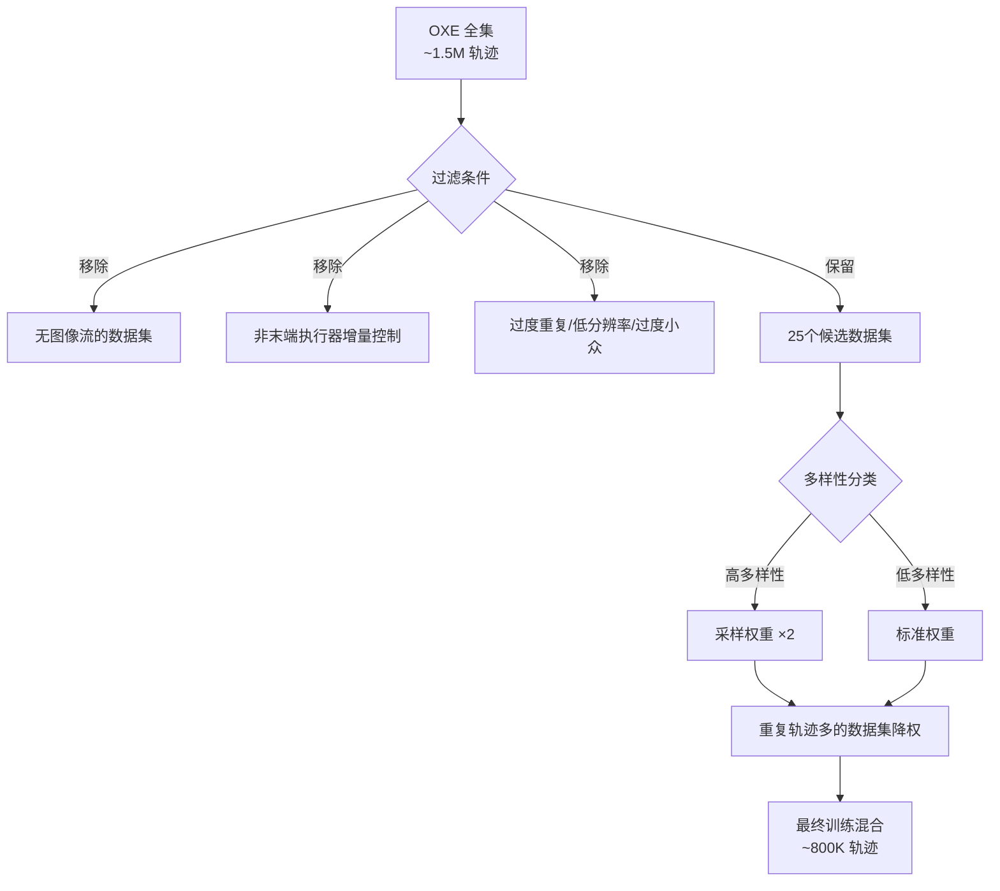
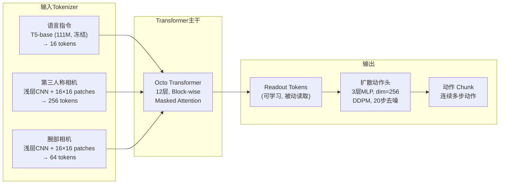
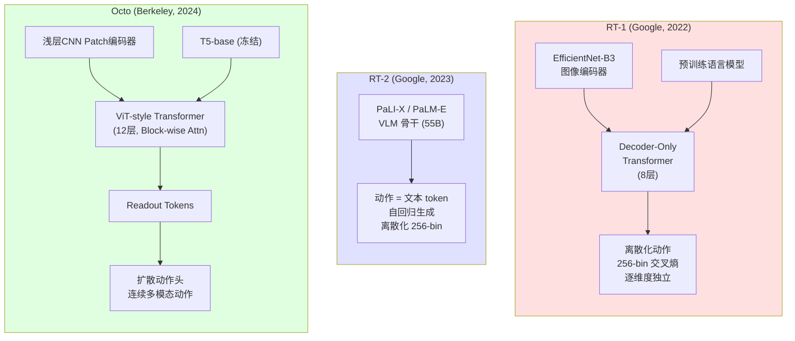
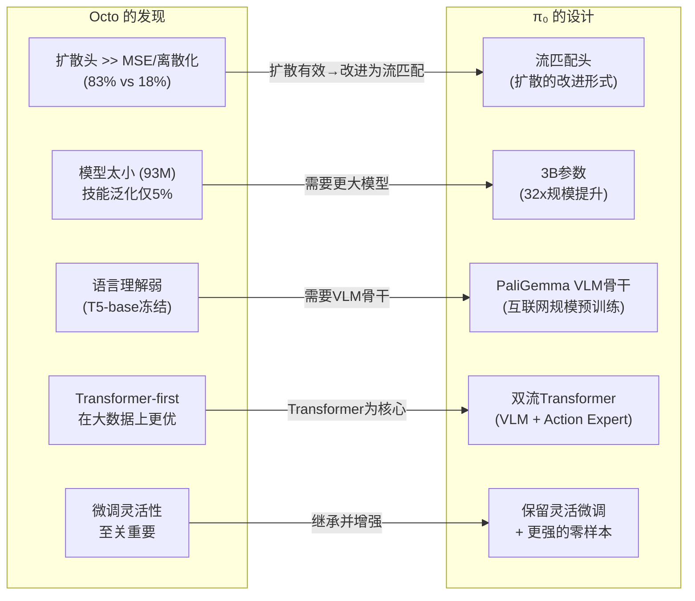

# 第三章：Octo — 首个开源通用机器人策略：从数据时代迈向模型时代

## 论文信息

- **标题**: Octo: An Open-Source Generalist Robot Policy
- **发表时间**: 2024-05-20 (arXiv v1)
- **会议**: RSS 2024 (Robotics: Science and Systems, Delft, Netherlands, July 15-19, 2024)
- **arXiv**: https://arxiv.org/abs/2405.12213
- **核心作者**: Dibya Ghosh\*, Homer Walke\*, Karl Pertsch\*, Kevin Black\*, Oier Mees\* (共同第一作者), Sudeep Dasari, Joey Hejna, Tobias Kreiman, Jianlan Luo, Dorsa Sadigh, Chelsea Finn, Sergey Levine
- **机构**: UC Berkeley, Stanford University, Carnegie Mellon University, Google DeepMind
- **开源**: 完整训练管线、模型检查点、数据加载器、微调脚本 (https://octo-models.github.io)

> **历史定位**: Octo 是 Physical Intelligence (PI) 演化链中的第三篇论文，也是从**数据论文**（BridgeData V2、DROID）向**模型论文**跨越的关键转折点。前两章建立了机器人操作数据的规模与多样性基础，Octo 则首次回答了一个核心问题：如何在这些异构数据之上构建一个**开放、可扩展、可迁移**的通用机器人策略。

---

## 1. 解决了什么问题 & 相对前作的定位

### 1.1 核心问题

在 Octo 出现之前，机器人学习领域面临一个结构性困境：自然语言（GPT-4、LLaMA）和计算机视觉（SAM、Stable Diffusion）已经进入基础模型时代，但机器人领域没有任何可公开获取的通用策略模型。已有的泛化机器人策略（Generalist Robot Policies, GRPs）存在三重壁垒：

| 限制维度 | 具体表现 | 代表模型 |
|---------|---------|---------|
| **输入锁定** | 用户被限制在预定义的观测集合（如单一相机流），无法添加新传感器 | RT-1, RT-2, RoboCat |
| **迁移困难** | 缺乏对新动作空间和新观测模态的有效微调能力 | RT-1-X, RT-2-X |
| **闭源不可及** | 最大最强的模型不对外公开，学术界无法复现和扩展 | RT-2-X (55B 参数) |

Octo 的目标是构建**首个完全开源的泛化机器人操作策略**——不仅能零样本控制多种机器人，更关键的是能高效微调到全新的传感器输入、动作空间和机器人构型，仅需约 100 条示教轨迹和一块消费级 GPU（NVIDIA A5000, 24GB VRAM）即可在约 5 小时内完成适配。

### 1.2 与前作的定位关系

Octo 站在 BridgeData V2 和 DROID 建立的数据基础之上，但其定位发生了根本转变：

```
第一阶段（数据时代）          第二阶段（模型时代）
┌──────────────┐              ┌──────────────┐
│ BridgeData V2│              │    Octo      │
│ 60K轨迹,24环境│──┐           │  93M参数     │
│ WidowX单平台  │  │  ┌──────→│  首个开源GRP  │
└──────────────┘  │  │        └──────┬───────┘
                  ├──┤               │
┌──────────────┐  │  │        ┌──────▼───────┐
│    DROID     │  │  │        │     π₀       │
│ 76K轨迹,564场景│──┘  │        │  3B参数 VLA  │
│ Franka单平台  │     │        └──────────────┘
└──────────────┘     │
                     │
┌──────────────┐     │
│  OXE (25+子集)│─────┘
│ ~800K轨迹     │
│ 多构型多传感器  │
└──────────────┘
```

**关键差异**：
- **BridgeData V2** 证明了"数据规模 + 多样性 → 泛化能力"；
- **DROID** 证明了"场景多样性 > 数据规模"；
- **Octo** 则将这些数据洞见转化为**架构设计原则**——模块化 transformer 配合扩散动作头，在异构数据上训练出一个可迁移的基础策略。

与同期的闭源模型相比，Octo 的定位尤为独特：

| 维度 | RT-1-X | RT-2-X | RoboCat | **Octo** |
|------|--------|--------|---------|----------|
| 参数量 | 35M | 55B | ~1.2B | **93M** |
| 训练数据 | 350K episodes | 350K episodes | 私有数据 | **800K episodes** |
| 开源 | 仅检查点 | 不开源 | 不开源 | **完整开源** |
| 微调到新动作空间 | 不支持 | 不支持 | 有限支持 | **原生支持** |
| 微调到新传感器 | 不支持 | 不支持 | 不支持 | **原生支持** |
| 消费级GPU微调 | - | - | - | **5小时/A5000** |

Octo 以**不到 RT-2-X 六百分之一**的参数量，在 WidowX 和 RT-1 Robot 上达到了与 RT-2-X 相当的零样本性能，同时以完全开源的形式为整个社区提供了一个可复现、可扩展的起点。

---

## 2. 创新点

### 2.1 创新点全景

| 序号 | 创新点 | 类别 | 重要性评估 |
|-----|-------|------|----------|
| 1 | Transformer-first 架构 + 扩散动作头 | 架构创新 | **极高** — 确立了后续 VLA 模型的架构范式 |
| 2 | Readout token 机制 | 架构创新 | **高** — 实现了输入输出的完全解耦 |
| 3 | 分块注意力掩码（Block-wise masked attention） | 架构创新 | **高** — 使模块化微调成为可能 |
| 4 | 多构型多传感器统一训练 | 训练范式 | **极高** — 首次在 25 个数据集上成功训练统一策略 |
| 5 | 扩散头 vs MSE/离散化的系统比较 | 实验发现 | **极高** — 83% vs 35% vs 18%，奠定了后续模型选择的基础 |
| 6 | 完全开源的 GRP 生态 | 生态贡献 | **极高** — 训练管线、检查点、数据加载器、微调脚本全部公开 |

### 2.2 各创新点详述

**创新点 1：Transformer-first 架构 + 扩散动作头**

与 RT-1 等先前工作使用大型 ResNet 编码器 + 小型 transformer 不同，Octo 采用"transformer 优先"设计：用极浅的 CNN patch 编码器替代 ResNet，将绝大部分参数和计算集中在 transformer 主干中。这一设计直接借鉴了 ViT 的成功经验，其核心优势在于**可扩展性**——消融实验表明 ViT 架构（83%）在大规模多样数据上显著优于 ResNet-50 + Transformer（70%），但在小数据集从零训练时 ResNet 反而更好，说明 transformer-first 的优势本质上是数据规模驱动的。

**创新点 2：Readout token 机制**

Readout token 是 Octo 最精巧的架构设计之一。类似于 BERT 的 [CLS] token，readout token 被插入到输入序列中，可以注意所有观测和任务 token，但**不被**后者注意——即只能被动读取内部嵌入而不影响其计算。轻量级扩散动作头仅作用于 readout token 的嵌入输出，这意味着：(1) 每次动作预测只需一次 transformer 前向传播；(2) 多步去噪过程完全在小型扩散头内完成；(3) 微调时可以替换动作头而不影响 transformer 主干。

**创新点 3：分块注意力掩码**

Octo 的注意力模式不是标准的全注意力或因果注意力，而是精心设计的分块掩码：观测 token 只能因果地注意同一或更早时间步的 token 及任务 token；不存在的观测对应的 token 被完全掩码。这种设计的核心价值在于**微调灵活性**——添加新的观测模态（如力/力矩传感器）只需引入新的位置嵌入和轻量编码器，完整保留预训练的 transformer 权重。这与 RT-1 形成鲜明对比，后者添加或移除图像输入需重新训练大量组件。

**创新点 5：动作头的里程碑式比较**

这是 Octo 最具影响力的实验发现。在完全相同的条件下（Octo-Small，WidowX 评估），三种动作预测方式的表现差异极为悬殊：

$$\text{扩散头 (83\%)} \gg \text{MSE 头 (35\%)} \gg \text{离散化 (18\%)}$$

这一发现直接解释了为什么 RT-1（使用 256-bin 离散化交叉熵）在大规模多样数据上的表现远不及预期，并为后续 PI 的所有模型（π₀ 的流匹配头、π₀-FAST 的混合架构）提供了最关键的设计依据。

---

## 3. 数据来源、处理方式及其原因

### 3.1 OXE 数据集筛选策略

Octo 在 Open X-Embodiment (OXE) 数据集上训练。OXE 包含约 150 万条机器人轨迹，Octo 从中精选了 25 个子数据集共约 80 万条轨迹——这是当时最大的机器人操作训练集，而 RT-X 模型仅使用了其中 35 万条的更小子集。

**筛选流程**：



**前三大数据集**各占 17.0% 的采样权重：Fractal (Google RT-1 Robot 数据)、Kuka、**Bridge** (即 BridgeData V2)。BC-Z 占 9.1%，其余 21 个数据集按规模和多样性递减分配权重。

### 3.2 数据对齐处理

多数据集异构性是 Octo 面临的核心工程挑战。具体对齐策略包括：

**观测对齐**：
- 缺失的相机通道进行零填充（zero-pad）
- 第三人称相机图像：随机裁剪 → resize 至 $256 \times 256$ → 颜色抖动 → 归一化至 $[-1, 1]$
- 腕部相机图像：resize 至 $128 \times 128$（不做随机裁剪）→ 颜色抖动 → 归一化至 $[-1, 1]$

**动作空间对齐**：
- 统一夹爪语义：$+1$ 表示"夹爪打开"，$0$ 表示"夹爪关闭"
- 绝对夹爪动作表示优于相对表示（消融验证）

**任务条件对齐**：
- 训练时随机置零语言指令或目标图像，使模型能在两种条件模式间切换
- 无语言标注的数据集始终使用目标图像条件
- 使用 hindsight goal relabeling：从轨迹未来均匀采样状态作为目标图像

### 3.3 与前作数据的关联

从数据演化的角度看，Octo 的训练数据直接包含了 BridgeData V2 的全部内容（占 17% 权重），而 DROID 虽然也属于 OXE 生态，但 Octo 论文的时间线（2024年5月）与 DROID（2024年3月）高度重叠，DROID 的核心数据尚未完全整合进 Octo 的训练混合中。这一点从训练混合的数据集列表中可以确认——25 个数据集中不包含 DROID。

这意味着 Octo 实际上主要受益于 BridgeData V2 的直接贡献和 OXE 其他子集的间接贡献，而 DROID 带来的场景多样性红利要等到后续的 π₀ 才被充分利用。

---

## 4. 模型结构及设计原因

### 4.1 整体架构

Octo 的架构由三个核心组件构成：输入 tokenizer、Transformer 主干和 Readout 头 + 扩散动作头。



### 4.2 模型规格

| 参数 | Octo-Small | Octo-Base |
|------|-----------|-----------|
| Transformer 层数 | 12 | 12 |
| 隐藏维度 $D$ | 384 | 768 |
| MLP 维度 | 1536 | 3072 |
| 注意力头数 | 6 | 12 |
| 总参数量 | 27M | 93M |
| 语言编码器 | T5-base (111M, 冻结) | T5-base (111M, 冻结) |
| 图像 patch 尺寸 | 16×16 | 16×16 |
| 扩散头 | 3层MLP, $d=256$, 残差+LN | 3层MLP, $d=256$, 残差+LN |
| 去噪步数 | 20 | 20 |

### 4.3 扩散动作头的数学形式

Octo 使用标准 DDPM 框架进行动作生成。给定 transformer 输出的 readout embedding $\mathbf{e}$，生成过程从纯噪声开始：

$$\mathbf{x}_K \sim \mathcal{N}(\mathbf{0}, \mathbf{I})$$

然后执行 $K=20$ 步去噪：

$$\mathbf{x}_{k-1} = \alpha\left(\mathbf{x}_k - \gamma \boldsymbol{\epsilon}_\theta(\mathbf{x}_k, \mathbf{e}, k) + \mathcal{N}(\mathbf{0}, \sigma^2 \mathbf{I})\right)$$

其中 $\alpha, \gamma, \sigma$ 由余弦噪声调度确定。训练目标为标准 DDPM 损失：

$$\mathcal{L}_{\text{DDPM}} = \mathbb{E}_{k \sim [1,K], \boldsymbol{\epsilon} \sim \mathcal{N}(\mathbf{0}, \mathbf{I})} \left[ \left\| \boldsymbol{\epsilon} - \boldsymbol{\epsilon}_\theta(\mathbf{x}_k, \mathbf{e}, k) \right\|^2 \right]$$

其中 $\mathbf{x}_k = \sqrt{\bar{\alpha}_k} \mathbf{x}_0 + \sqrt{1 - \bar{\alpha}_k} \boldsymbol{\epsilon}$ 是对真实动作 $\mathbf{x}_0$ 加噪的结果。

**关键设计决策**：每次动作预测只需**一次** transformer 前向传播，20 步去噪过程完全在参数量极小的扩散头（3层MLP）内完成。这与后续 π₀ 将去噪过程嵌入 transformer 本身的设计形成了对比。

### 4.4 与 RT-1 / RT-2 的架构对比



| 设计维度 | RT-1 | RT-2 | **Octo** |
|---------|------|------|----------|
| 视觉编码 | EfficientNet-B3 (大型CNN) | 预训练VLM内置 | **浅层CNN patch (极轻量)** |
| 语言理解 | 预训练语言模型 | VLM内置 (互联网规模) | **T5-base (111M, 冻结)** |
| 动作表示 | 离散256-bin | 离散256-bin (文本token) | **连续扩散 (DDPM)** |
| 多模态动作 | 不支持 | 不支持 | **原生支持** |
| 动作分块 | 单步 | 单步 | **多步chunk** |
| 参数量 | 35M | 55B | **93M** |
| 微调灵活性 | 输入锁定 | 输入锁定 | **模块化增删** |
| 开源状态 | 仅检查点 | 不公开 | **完整开源** |

---

## 5. 训练方法（算法与工程）

### 5.1 预训练配置

| 超参数 | 值 |
|-------|---|
| 优化器 | AdamW |
| 学习率 | $3 \times 10^{-4}$ |
| 学习率调度 | 逆平方根衰减 (reciprocal square-root) |
| 预热步数 | 2,000 |
| 权重衰减 | 0.1 |
| 梯度裁剪 | 1.0 |
| Batch Size | 2,048 |
| 训练步数 | 300,000 (Octo-Base) |
| 观测历史 | 2 帧 |
| 硬件 | TPU v4-128 pod |
| 训练时长 | **14 小时** |

### 5.2 数据加载工程

并行加载 25 个异构数据集的 shuffle 是 Octo 面临的核心工程挑战之一。具体发现：

- **小 shuffle buffer (20k)** 会导致零样本性能严重下降——因为连续的训练样本来自同一轨迹或同一数据集，破坏了 i.i.d. 假设
- **解决方案**：在解码图像之前先对来自不同轨迹的帧进行 shuffle 和交错（interleave），将 shuffle buffer 扩大到 **500k**
- 每条训练轨迹最多随机采样 100 步，避免单条超长轨迹"挤占" shuffle buffer

这一工程优化对 Octo 的最终性能至关重要，也为后续在更大数据集上训练 π₀ 积累了宝贵经验。

### 5.3 微调方案

Octo 的微调方案强调**简洁性和通用性**——所有微调实验使用完全相同的配方：

$$\text{微调配方} = \begin{cases} \text{数据}: \sim 100 \text{ 条目标域示教} \\ \text{步数}: 50,000 \\ \text{学习率}: \text{余弦衰减 + 线性预热} \\ \text{参数更新}: \text{全参数微调} \\ \text{硬件}: \text{单块 NVIDIA A5000 (24GB)} \\ \text{时长}: \sim 5 \text{ 小时} \end{cases}$$

微调时的**模块化能力**是 Octo 最关键的工程特性：
- **新动作空间**：替换扩散动作头（如从 7D 末端执行器切换到 14D ALOHA 关节控制）
- **新观测模态**：添加新的位置嵌入和轻量编码器（如力/力矩传感器）
- **新机器人构型**：完整保留预训练 transformer 权重，仅更新新增组件

实验表明全参数微调优于冻结预训练参数子集的方案。

---

## 6. 实验关键发现与效果对比

### 6.1 零样本多机器人控制

在 WidowX、UR5 和 RT-1 Robot 三种机器人上的语言条件任务评估中：

| 模型 | 参数量 | WidowX | UR5 | RT-1 Robot | 平均 | 开源 |
|------|-------|--------|-----|-----------|------|------|
| RT-1-X | 35M | 低 | 低 | 低 | 基线 | 仅检查点 |
| **Octo** | **93M** | **高** | **高** | **高** | **+29%** | **完整开源** |
| RT-2-X | 55B | 与Octo相当 | - | 与Octo相当 | - | 不公开 |

关键发现：
- Octo (93M) 平均成功率比 RT-1-X (35M) **高出 29 个百分点**
- 在 WidowX 和 RT-1 Robot 上，Octo 与 RT-2-X (55B) **表现相当**——参数量小了近 600 倍
- 目标图像条件的性能比语言条件**高 25%**，因为目标图像提供了更丰富的任务完成信息

### 6.2 微调效果

| 评估设置 | ResNet+Trans. Scratch | VC-1 | **Octo** | 特殊说明 |
|---------|----------------------|------|----------|---------|
| Berkeley Insertion | 10% | 5% | **70%** | *新观测（力/力矩） |
| Stanford Coffee | 45% | 0% | **75%** | |
| CMU Baking | 25% | 30% | **50%** | |
| Berkeley Pick-Up | 0% | 0% | **60%** | 新动作空间（关节控制） |
| Berkeley Coke | 20% | 10% | **100%** | 全新 ViperX 机器人 |
| Berkeley Bimanual | 20% | 50% | **80%** | 新动作空间（14D ALOHA） |
| **平均** | **20%** | **15%** | **72%** | **+52pp vs 次优** |

Octo 微调后平均 72% 的成功率，比次优基线（从零训练 20%）高出 **52 个百分点**。尤其值得注意的是：
- 在完全未见过的 ViperX 机器人上达到 **100%** 成功率（Berkeley Coke）
- 在双臂 ALOHA 的 14 维关节动作空间上达到 **80%**（Berkeley Bimanual）
- 在引入力/力矩传感器新观测的精密插入任务上达到 **70%**（Berkeley Insertion）

### 6.3 泛化能力细粒度分析

在 BridgeV2 WidowX 设置上进行的分层泛化分析揭示了当前 GRP 的能力边界：

| 泛化类型 | 代表任务 | 成功率 |
|---------|---------|-------|
| 分布内任务 | Put carrot on plate / Put eggplant in pot | **85%** |
| 新物体 | Put bread on plate / Put spoon on glove | **80%** |
| 新环境 | Put mushroom in pot / Put spoon on cloth | **40%** |
| 新技能 | Flip cup on its side / Put block in slot | **5%** |

这一梯度式退化清晰地揭示了：**物体层面的泛化已基本解决，环境层面的泛化部分实现，但技能层面的迁移仍是根本性瓶颈**。新物体泛化的成功（80%）得益于 OXE 数据的物体多样性；新技能的严重退化（5%）则表明，仅靠数据规模不足以实现技能组合泛化——这为后续引入 VLM 骨干（π₀）提供了直接动机。

---

## 7. 消融实验的发现

所有消融实验在 Octo-Small 上进行，在 WidowX 设置上评估（4 个任务，40 次试验的平均成功率）。

### 7.1 动作头比较——里程碑式发现

| 动作预测方式 | 成功率 | 定性表现 |
|------------|-------|---------|
| **扩散解码头 (DDPM)** | **83%** | 果断且精确 |
| 连续动作 MSE 损失 | 35% | "对冲"行为，移动极慢 |
| 离散化 256-bin 交叉熵 (RT-1式) | 18% | 较"果断"但抓取缺乏精度 |

**深层原因分析**：

$$\underbrace{\text{扩散头}}_{\text{多模态 + 连续}} \gg \underbrace{\text{MSE 头}}_{\text{单模态 + 连续}} \gg \underbrace{\text{离散头}}_{\text{多模态 + 离散}}$$

- **MSE 头**无法建模多模态动作分布。当训练数据中同一观测对应多种合理动作时（例如可以向左绕过或向右绕过障碍物），MSE 头会回归到多个模式的均值，产生"对冲"行为
- **离散头**虽然能建模多模态分布（通过分类概率），但 256-bin 的量化精度不足以支持精细的连续控制
- **扩散头**同时具备多模态建模能力（通过去噪采样）和连续精度（不量化），是两者的最优组合

这一发现的影响极为深远：它直接否定了 RT-1/RT-2 的离散化路线，并为 π₀ 选择流匹配（flow matching，可视为扩散的改进形式）提供了最强有力的实验依据。

### 7.2 架构消融

| 架构 | 成功率 | 说明 |
|-----|-------|------|
| **ViT-style Transformer-first** | **83%** | 浅层CNN patch + 大transformer |
| ResNet-50 + Transformer | 70% | RT-1式大CNN + 小transformer |

ViT 架构在大规模多样数据上的优势为 13 个百分点，但在小数据集（~100 条）从零训练时 ResNet 反而更好。这揭示了一个重要的**数据-架构交互效应**：transformer-first 架构的优势需要大规模数据来激活。

### 7.3 训练数据消融

| 训练数据 | 成功率 |
|---------|-------|
| **完整 25 数据集混合 (800K)** | **83%** |
| RT-X 的 11 数据集子集 (350K) | 60% |
| 仅 Bridge Data (单机器人) | 43% |

数据集数量的增加带来了**单调递增**的性能提升（43% → 60% → 83%），暗示进一步扩展数据混合可能会继续改善策略性能。这一发现与 BridgeData V2 和 DROID 的"更多数据 → 更好泛化"结论完全一致，并从模型训练的角度予以了验证。

### 7.4 模型规模消融

| 模型 | 参数量 | WidowX | UR5 |
|-----|-------|--------|-----|
| Octo-Tiny | 10M | 低 | 低 |
| Octo-Small | 27M | 中 | 中 |
| **Octo-Base** | **93M** | **高** | **高** |

零样本性能随模型规模单调递增。Base 模型对初始场景配置更鲁棒，不易过早尝试抓取，表明更大模型具有更好的视觉场景感知能力。

### 7.5 其他消融发现

| 发现 | 效果 | 启示 |
|-----|------|------|
| 1 帧观测历史有益，更多帧收益递减 | + | 2帧为最优性价比 |
| 16×16 patch 优于 32×32 patch | + | 但token数增加4倍 |
| 加入本体感知输入 | **-** | 因果混淆问题 |
| 冻结 T5-base 效果最好 | = | 微调/增大编码器均未改善 |
| 绝对夹爪动作 > 相对表示 | + | 相对表示缺乏失败后重试行为 |

本体感知（proprioception）输入反而降低性能这一反直觉发现，揭示了行为克隆中的**因果混淆**问题——模型可能学会直接从当前状态预测下一状态（而非学习真正的控制策略），导致测试时的累积误差。这一问题在后续的 π₀ 中通过更大的模型容量和更丰富的数据得到了缓解。

---

## 8. 优化有效性评估

### 8.1 设计选择有效性排名

根据消融实验的量化影响，Octo 各设计选择的有效性可排列如下：

| 排名 | 设计选择 | 影响量级 | 证据强度 |
|-----|---------|---------|---------|
| 1 | 扩散动作头（vs 离散化） | +65pp (83% vs 18%) | 极强（直接消融） |
| 2 | 扩散动作头（vs MSE） | +48pp (83% vs 35%) | 极强（直接消融） |
| 3 | 数据规模（25集 vs 单集） | +40pp (83% vs 43%) | 极强（直接消融） |
| 4 | 预训练+微调（vs 从零训练） | +52pp (72% vs 20%) | 极强（6任务平均） |
| 5 | 数据规模（25集 vs 11集） | +23pp (83% vs 60%) | 强（直接消融） |
| 6 | ViT架构（vs ResNet+Trans） | +13pp (83% vs 70%) | 强（直接消融） |
| 7 | 模型规模（Base vs Tiny） | 持续提升 | 中（3点趋势） |

### 8.2 整体评估

Octo 最核心的贡献不是任何单一的技术创新，而是**正确组合的系统工程**：将 transformer-first 架构、扩散动作头、分块注意力掩码、readout token、大规模多数据集训练、以及开源生态结合为一个连贯的系统。每个组件都有先前工作的影子——扩散策略来自 Chi et al.，动作分块来自 ACT，ViT 架构来自 Dosovitskiy et al.——但 Octo 首次在跨构型泛化策略的场景中验证了这些组件的协同效果。

**开源 + 可微调**作为使能因素的价值难以高估：它使得任何研究组都能以 ~100 条示教 + 5 小时 GPU 时间的成本，在自己的机器人上获得一个比从零训练好 52 个百分点的策略起点。这一实用价值直接推动了 Octo 在社区中的广泛采用，也为 PI 后续模型的快速迭代提供了用户反馈基础。

---

## 9. 与后续工作的关联

### 9.1 从 Octo 到 π₀：直接的技术传承

Octo 与 π₀ 之间存在极为直接的技术和人员传承关系。Octo 的多位核心作者（Karl Pertsch、Kevin Black、Sudeep Dasari 等）随后成为 Physical Intelligence 的创始成员，Octo 的关键发现直接塑造了 π₀ 的设计决策：



### 9.2 Octo 的局限性如何激发 π₀

Octo 论文坦诚指出的几个不足，每一个都成为 π₀ 的直接设计动机：

**局限 1：模型太小 → π₀ 的 3B 参数**

Octo 仅 93M 参数，在新技能泛化上几乎完全失败（5%）。π₀ 将参数量提升至约 3B（PaliGemma 2-3B + 300M Action Expert），通过 32 倍的规模提升来获得更强的表征能力。

**局限 2：无 VLM 骨干 → π₀ 的 PaliGemma 集成**

Octo 使用冻结的 T5-base（111M）作为语言编码器，且消融表明增大编码器或微调均无益——这是因为训练数据中缺乏丰富的自由格式语言标注。π₀ 通过引入 PaliGemma（SigLIP + Gemma LLM，在互联网规模数据上预训练）作为视觉-语言骨干，从根本上解决了语言理解的瓶颈。

**局限 3：扩散 → 流匹配**

Octo 使用标准 DDPM 的 20 步去噪，虽然效果远好于 MSE/离散化，但推理延迟仍较高。π₀ 改用流匹配（flow matching），这是扩散的改进形式，训练更稳定、采样更高效，且可以用更少的步数达到类似质量。

**局限 4：腕部相机和语言条件的不足**

Octo 仅 27% 的训练数据包含腕部相机，仅 56% 包含语言标注，导致这两个模态的性能显著低于预期。π₀ 通过 10,000+ 小时的高质量双相机遥操作数据和全面的语言标注来解决这一问题。

### 9.3 更广泛的技术路线图

在 PI 的完整演化链中，Octo 扮演了**概念验证者**的角色：

| 阶段 | 论文 | 核心贡献 | 核心局限 |
|-----|------|---------|---------|
| 数据 1 | BridgeData V2 (Ch1) | 低成本大规模数据 | 单平台、有限环境 |
| 数据 2 | DROID (Ch2) | 场景多样性 | 单平台、无统一模型 |
| **模型 1** | **Octo (Ch3)** | **首个开源GRP、扩散头验证** | **模型太小、无VLM** |
| 模型 2 | π₀ (Ch4) | VLA 架构、流匹配、万小时数据 | 推理速度、离散任务 |
| 模型 3 | π₀-FAST (Ch5) | 自回归+FSQ混合架构 | - |
| 模型 4 | π₀.₅ (Ch7) | 知识隔离、离散状态输入 | - |

Octo 证明了三件事：(1) 扩散动作头是正确的方向；(2) 开源可微调的通用策略有巨大的实用价值；(3) 93M 参数不够大。这三个结论共同指向了 π₀ 的设计空间——更大的模型、更强的视觉-语言骨干、更高效的生成目标。

### 9.4 人员传承

Octo 团队与 PI 创始团队的重叠度极高：
- **Karl Pertsch** — Octo 共同第一作者，后成为 PI 核心成员
- **Kevin Black** — Octo 共同第一作者（负责训练基础设施），后成为 PI 核心成员
- **Sudeep Dasari** — Octo 作者（CMU 评估），后参与 PI
- **Chelsea Finn、Sergey Levine** — Octo 资深作者，PI 顾问

这种直接的人员传承确保了 Octo 的技术洞见被完整地带入 π₀ 的设计中，也解释了为什么 π₀ 的架构决策（流匹配头、transformer-first、可微调）与 Octo 的消融发现如此精确地对应。

---

## 总结

Octo 标志着机器人学习从**数据积累期**进入**模型构建期**的关键转折。它不是一个参数量惊人的模型，也不是一个在所有任务上都表现卓越的系统——但它是第一个将"开源、通用、可微调"三个关键属性集于一身的机器人策略。其最重要的遗产不是 93M 参数的检查点本身，而是它通过系统的消融实验确立的设计原则：**扩散优于离散化，transformer-first 优于 CNN-first，更多数据集始终更好，模块化设计使迁移成为可能**。这些原则直接构成了 π₀ 及后续 VLA 模型设计的基石。
