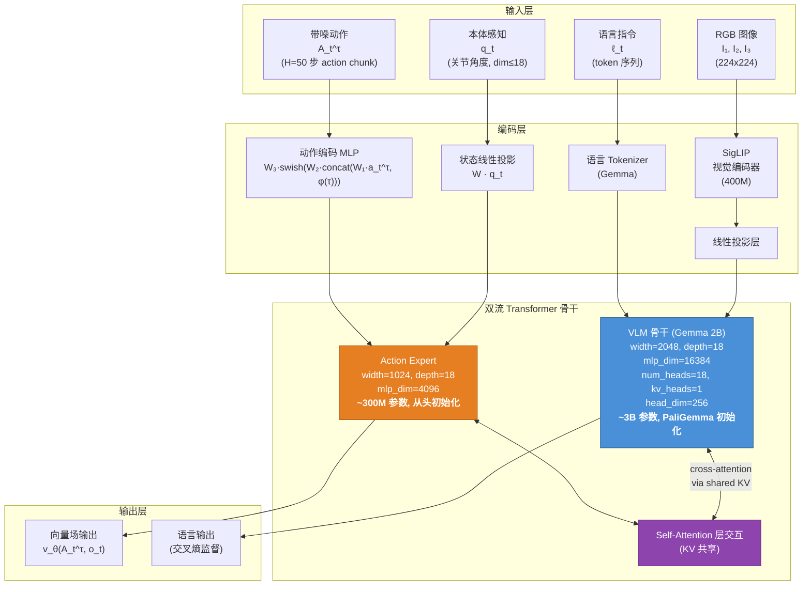
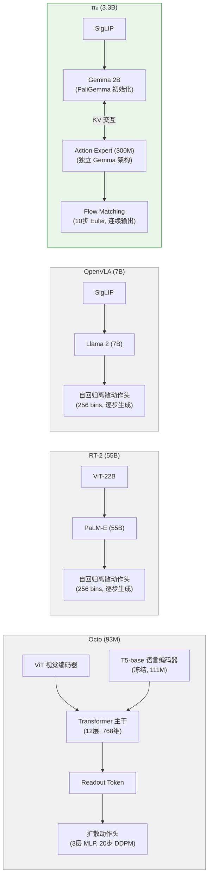
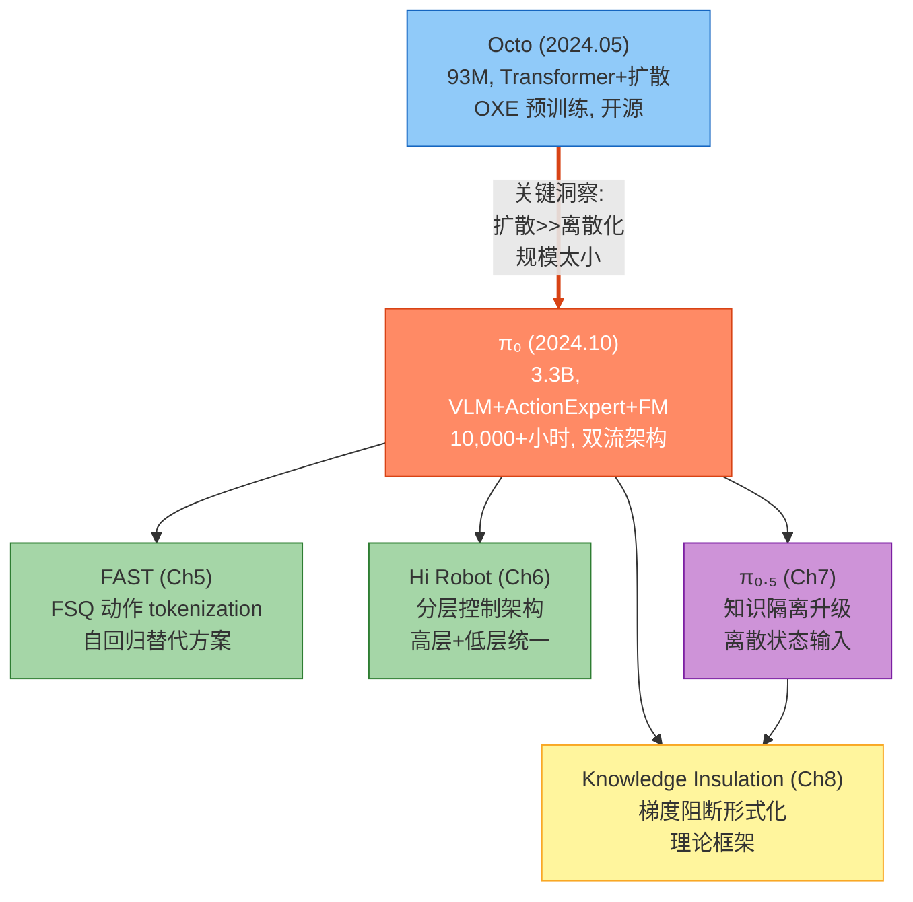

# 第四章：$\pi_0$ — 基于视觉-语言-动作流模型的通用机器人控制

> **本章定位**：$\pi_0$ 是 Physical Intelligence (PI) 系列论文中最核心、最重要的一篇。它标志着 PI 从数据集建设和小规模模型（Octo, 93M 参数）向大规模视觉-语言-动作 (VLA) 基础模型的根本性跨越。本章将对 $\pi_0$ 进行全面深入的技术分析，并与前作 Octo（第三章）、RT-2、OpenVLA 等 VLA 基线进行广泛的横向比较。$\pi_0$ 提出的双流架构 (VLM + Action Expert) 与流匹配动作生成范式，构成了 PI 后续所有工作（FAST、Hi Robot、$\pi_{0.5}$、Knowledge Insulation）的技术基石。

---

## 论文信息

| 项目 | 内容 |
|------|------|
| **论文标题** | $\pi_0$: A Vision-Language-Action Flow Model for General Robot Control |
| **发表时间** | 2024年10月31日 |
| **arXiv** | [2410.24164](https://arxiv.org/abs/2410.24164) |
| **机构** | Physical Intelligence, San Francisco, California, USA |
| **核心作者** | Kevin Black, Noah Brown, Danny Driess, Chelsea Finn, Karol Hausman, Brian Ichter, Sergey Levine, Karl Pertsch, Suraj Nair, Quan Vuong, Lucy Xiaoyang Shi 等 24 人 |
| **模型参数** | 3.3B（VLM 骨干 3B + Action Expert 300M） |
| **训练数据** | 10,000+ 小时，7 种机器人配置，68 个任务 |
| **核心贡献** | 首个将 flow matching 与预训练 VLM 结合的 VLA 模型 |

**作者传承关系**：多位核心作者直接从 Octo 团队（UC Berkeley / Stanford / Google DeepMind）转入 PI。Kevin Black、Karl Pertsch、Suraj Nair 既是 Octo 的核心贡献者，也是 $\pi_0$ 的模型设计主力。Chelsea Finn 和 Sergey Levine 同时担任两篇论文的资深作者。这种人员连续性意味着 $\pi_0$ 的设计决策直接吸取了 Octo 的经验教训——特别是 Octo 消融实验中发现的 "扩散头远超离散化"（83% vs 18%）这一关键洞察。

---

## 1. 解决了什么问题 & 相对前作的定位

### 1.1 核心问题：VLA 的根本设计矛盾

构建通用机器人基础模型面临一个核心设计矛盾：**互联网规模的语义知识**与**高频精确的动作控制**之间的张力。

2024 年之前，这一矛盾在不同路线中表现得尤为突出：

| 路线 | 代表工作 | 语义理解 | 动作精度 | 核心限制 |
|------|----------|----------|----------|----------|
| 小模型 + 扩散 | Octo (93M) | 弱（无 VLM） | 中（扩散头） | 太小，语言理解有限 |
| 大 VLM + 离散化 | RT-2 (55B) | 强（PaLM-E） | 弱（256 bin） | 离散化精度不足，推理极慢 |
| 中等 VLM + 离散化 | OpenVLA (7B) | 中（Llama） | 弱（256 bin） | 不支持 action chunk，灵巧控制失败 |
| 小模型 + 专项 | ACT / Diffusion Policy | 无 | 强 | 无预训练，无泛化，无语言 |

**没有任何现有方法同时具备强语义理解与高精度连续动作控制能力。**

### 1.2 Octo 的局限性

Octo（第三章）作为 $\pi_0$ 的直接前驱，其消融实验提供了至关重要的经验基础，但也暴露了根本性局限：

1. **模型规模过小**（93M 参数）：在跨具身、多任务场景下表征能力严重不足。Octo 在新技能（未见过的操作）上成功率骤降至 5%，揭示了小模型的泛化天花板。
2. **无 VLM 骨干**：使用冻结的 T5-base（111M）编码语言，缺乏视觉-语言联合推理能力。语言条件性能显著低于目标图像条件，且加入更大语言编码器也未改善。
3. **架构限制**：readout token + MLP 扩散头的设计虽然高效，但扩散过程仅在 3 层 MLP 中完成，无法建模复杂的条件动作分布。
4. **本体感知困境**：Octo 加入 proprioception 反而导致性能下降（因果混淆），而 $\pi_0$ 需要 proprioception 来支持 50Hz 灵巧控制。

### 1.3 RT-2 / OpenVLA 路线的失败

自回归离散化路线的核心缺陷在于**将连续动作空间离散化为有限 bin**：

$$a_{\text{discrete}} = \text{quantize}(a_{\text{continuous}}, \text{bins}=256)$$

- **精度损失**：对于 $d=18$ 维动作空间，每个维度仅 256 个离散值，量化误差 $\Delta a = \frac{a_{\max} - a_{\min}}{2 \times 256}$，在灵巧操作（如折叠衣物、装蛋）中造成关键精度不足。
- **不支持 action chunk**：RT-2/OpenVLA 逐步预测单个动作 token，无法利用时间相关性，每个控制步都需要完整的 VLM 前向传播，导致 55B 模型推理频率远低于实时需求。
- **多模态分布建模失败**：交叉熵损失假设单峰分布，无法表示"向左或向右都可以绕过障碍物"这类多模态动作分布。

### 1.4 $\pi_0$ 的解决方案

$\pi_0$ 提出了一种全新的**双流融合架构**：

$$\pi_0 = \underbrace{\text{PaliGemma (3B)}}_{\text{语义理解}} + \underbrace{\text{Action Expert (300M)}}_{\text{动作生成}} + \underbrace{\text{Flow Matching}}_{\text{连续分布建模}}$$

这一设计同时解决了上述所有矛盾：VLM 骨干提供互联网规模的语义知识；Action Expert 专门处理机器人状态和动作，避免训练信号冲突；Flow Matching 生成连续动作分布，支持 50Hz action chunk。

---

## 2. 创新点

### 创新点枚举与重要性评估

| 编号 | 创新点 | 重要性等级 | 说明 |
|------|--------|-----------|------|
| I-1 | Flow Matching 动作生成 | **变革性** | 首次将 flow matching 引入 VLA，替代离散化和标准扩散 |
| I-2 | 双流架构（VLM + Action Expert） | **变革性** | 解决 VLM 与动作生成的训练信号冲突问题 |
| I-3 | 10,000+ 小时跨具身预训练 | **重大** | 截至当时最大规模的机器人学习实验 |
| I-4 | Pre-training / Post-training 训练范式 | **重大** | 将 LLM 的两阶段训练范式引入机器人基础模型 |
| I-5 | PaliGemma 作为 VLM 骨干 | **重大** | 3B 参数的实时控制友好选择 |
| I-6 | 三段式注意力掩码 | **显著** | 最小化分布偏移 + 推理 KV 缓存优化 |
| I-7 | 偏向高噪声的时间步采样 | **显著** | 针对动作预测特性的定制化设计 |

### 创新点 I-1：Flow Matching 动作生成（变革性）

Flow Matching 是 $\pi_0$ 最核心的技术选择。相比三种替代方案：

**vs 自回归离散化（RT-2, OpenVLA）**：
- Flow matching 输出连续值，无量化误差
- 支持 action chunk（$H=50$ 步一次性生成），自回归模型逐步生成
- 建模多模态分布，离散化假设单峰

**vs DDPM 扩散（Octo, Diffusion Policy）**：
- Flow matching 使用线性概率路径 $q(A_t^\tau | A_t) = \mathcal{N}(\tau A_t, (1-\tau)I)$，比 DDPM 的余弦/线性噪声调度更简洁
- 推理仅需 10 步 Euler 积分（vs Octo 的 20 步 DDPM 去噪），速度更快
- 训练目标直接匹配向量场，梯度更稳定

**vs MSE 回归**：
- MSE 假设单峰高斯分布，对多模态动作产生"对冲"行为（Octo 消融：MSE 仅 35%）
- Flow matching 天然建模多模态分布

### 创新点 I-2：双流架构（变革性）

受 Transfusion 和 Mixture of Experts 启发，$\pi_0$ 将 transformer 分为两组权重：

1. **VLM 骨干**（3B, PaliGemma 初始化）：处理图像 $[I_t^1, ..., I_t^n]$ 和语言 $\ell_t$
2. **Action Expert**（300M, 从头初始化）：处理本体感知 $q_t$ 和带噪动作 $A_t^\tau$

两组权重仅通过 self-attention 层的 key-value 交互。这一设计的关键优势：

- **避免训练信号冲突**：flow matching 的回归损失不会干扰 VLM 骨干的预训练表征
- **推理效率**：10 步 flow matching 迭代中，只需重新计算 Action Expert 的前向传播，VLM 骨干的 KV 可缓存
- **模块化扩展**：后续可独立替换 VLM 骨干或 Action Expert

---

## 3. 数据来源、处理方式及其原因

### 3.1 预训练数据组成

$\pi_0$ 的预训练数据集由两大部分组成，总计约 10,000+ 小时：

$$\mathcal{D}_{\text{pretrain}} = \underbrace{\mathcal{D}_{\pi}}_{\text{PI 自有数据 (90.9\%)}} \cup \underbrace{\mathcal{D}_{\text{OXE+}}}_{\text{开源数据 (9.1\%)}}$$

| 数据来源 | 时间步数 | 占比 | 控制频率 | 特点 |
|----------|---------|------|----------|------|
| PI 双臂机器人 | 797M | ~80% | 50 Hz | 灵巧操作：洗衣、餐具、组装 |
| PI 单臂机器人 | 106M | ~11% | 20 Hz | 基础操作：抓取、放置 |
| OXE Magic Soup | ~90M | ~9.1% | 2-10 Hz | 场景/物体多样性：22 种机器人 |
| Bridge v2 | (含于 OXE) | - | 5 Hz | 桌面操作多样性 |
| DROID | (含于 OXE) | - | 10 Hz | 野外场景多样性 |

**与 Octo 的数据规模对比**：

$$\frac{|\mathcal{D}_{\pi_0}|}{|\mathcal{D}_{\text{Octo}}|} = \frac{\sim 993\text{M steps}}{800\text{K trajectories} \times \sim 100\text{ steps}} \approx 12.4\times$$

### 3.2 机器人平台覆盖

7 种机器人配置的统一动作空间设计：

$$\dim(a_t) = \dim(q_t) = 18 \quad \text{(最大维度：双6-DoF臂 + 2夹爪 + 移动底盘 + 升降躯干)}$$

对维度不足 18 的机器人进行零填充（zero-padding），图像不足 3 张的进行 mask 处理。

| 机器人平台 | 手臂配置 | 动作维度 | 相机数 | 控制频率 |
|-----------|---------|---------|--------|---------|
| UR5e | 单 7-DoF | 7 | 2 | 20 Hz |
| 双臂 UR5e | 双 7-DoF | 14 | 3 | 20 Hz |
| Franka | 单 7-DoF | 8 | 2 | 20 Hz |
| 双臂 Trossen | 双 6-DoF (ALOHA) | 14 | 3 | 50 Hz |
| 双臂 ARX/AgileX | 双 6-DoF | 14 | 3 | 50 Hz |
| 移动 Trossen/ARX | 双 6-DoF + 非全向底盘 | 16 | 3 | 50 Hz |
| 移动 Fibocom | 双 6-DoF + 全向底盘 | 17 | 3 | 50 Hz |

### 3.3 数据平衡策略

采用幂律权重平衡不同任务-机器人组合的采样频率：

$$w_{(task, robot)} = n_{(task, robot)}^{0.43}$$

其中 $n$ 为该组合的样本数量。指数 0.43 的选择意味着：
- 若某组合数据量增加 10 倍，其采样权重仅增加 $10^{0.43} \approx 2.7$ 倍
- 有效降低过度表示的组合权重（如洗衣折叠数据过多），同时不完全忽略大数据量任务中包含的丰富行为多样性

### 3.4 语言标注

预训练使用两种语言标签的组合：
1. **任务名称**（task name）：如 "fold laundry"、"bus the table"
2. **段落级标注**（segment annotation）：约 2 秒粒度的子轨迹描述，如 "pick up the napkin"、"place the plate in the bin"

这种双粒度标注策略为后续的语言条件控制和高层 VLM 策略分解提供了基础。

---

## 4. 模型结构及设计原因

### 4.1 总体架构

$\pi_0$ 总参数量为 3.3B，由以下组件构成：

### 4.2 VLM 骨干详细参数

基于 PaliGemma 的 VLM 骨干包含两个子组件：

**SigLIP 视觉编码器**：
- 输入：$n$ 张 RGB 图像（$n \in \{2, 3\}$），分辨率 $224 \times 224$
- 输出：图像 patch 嵌入，投影到 Gemma 嵌入空间

**Gemma 2B 语言模型**：

$$\text{Gemma 2B}: \begin{cases} \text{width} = 2048 \\ \text{depth} = 18 \text{ layers} \\ \text{mlp\_dim} = 16{,}384 \\ \text{num\_heads} = 18 \\ \text{num\_kv\_heads} = 1 \text{ (Multi-Query Attention)} \\ \text{head\_dim} = 256 \end{cases}$$

Multi-Query Attention (MQA) 的使用对推理效率至关重要：所有 18 个 query head 共享 1 个 KV head，大幅减少 KV cache 的内存开销。

### 4.3 Action Expert 详细设计

Action Expert 与 VLM 骨干共享相同的层数（depth=18），但宽度大幅缩减：

$$\text{Action Expert}: \begin{cases} \text{width} = 1024 \quad (\text{vs VLM 的 } 2048) \\ \text{mlp\_dim} = 4{,}096 \quad (\text{vs VLM 的 } 16{,}384) \\ \text{参数量} \approx 300\text{M} \quad (\text{vs VLM 的 } 3\text{B}) \end{cases}$$

**动作编码 MLP**：将带噪动作和 flow matching 时间步编码为 transformer 嵌入：

$$e_{a_t^\tau} = W_3 \cdot \text{swish}\left(W_2 \cdot \text{concat}\left(W_1 \cdot a_{t'}^\tau, \; \phi(\tau)\right)\right)$$

其中 $\phi: \mathbb{R} \to \mathbb{R}^w$ 为正弦位置编码函数，$W_1 \in \mathbb{R}^{w \times d}$, $W_2 \in \mathbb{R}^{w \times 2w}$, $W_3 \in \mathbb{R}^{w \times w}$，$d$ 为动作维度，$w=1024$ 为 Action Expert 宽度。

**与 VLM 骨干的交互机制**：两组权重实现为单个 transformer 的两个 expert（类似 Mixture of Experts），token 路由规则为：
- 图像 token + 语言 token $\to$ VLM 骨干
- 状态 token $q_t$ + 动作 token $A_t^\tau$ $\to$ Action Expert
- 交互**仅通过 self-attention 层的 KV 共享**：Action Expert 的 query 可以 attend 到 VLM 骨干产生的 key-value，反之亦然（受注意力掩码约束）

### 4.4 三段式注意力掩码

$\pi_0$ 使用精心设计的 blockwise causal attention mask，将输入序列分为三个块：

$$\text{Block 1: } [I_t^1, ..., I_t^n, \ell_t] \quad \text{Block 2: } [q_t] \quad \text{Block 3: } [a_t^\tau, ..., a_{t+H-1}^\tau]$$

注意力规则：
- **块内**：完全双向注意力
- **块间**：因果方向（Block 1 不看 Block 2/3，Block 2 不看 Block 3，Block 3 看所有）

设计原因：
1. **Block 1 不看后续块**：最小化与 PaliGemma 预训练的分布偏移——预训练时这些 token 从未见过机器人状态和动作
2. **Block 2 独立成块**：$q_t$ 在 flow matching 的 10 步迭代中不变，其 KV 可被缓存，无需重复计算
3. **Block 3 双向注意力**：动作 chunk 中的 50 个动作 token 互相 attend，建模动作间的时间依赖关系

### 4.5 与前作的架构对比

**核心架构差异总结**：

| 维度 | Octo | RT-2 | OpenVLA | $\pi_0$ |
|------|------|------|---------|---------|
| 总参数量 | 93M | 55B | 7B | 3.3B |
| VLM 骨干 | 无 | PaLM-E | Llama 2 | PaliGemma (Gemma 2B) |
| 视觉编码器 | 浅层 CNN + ViT | ViT-22B | SigLIP | SigLIP |
| 语言编码器 | T5-base (冻结) | PaLM-E 内置 | Llama 2 内置 | Gemma 2B 内置 |
| 动作表示 | 连续（扩散） | 离散（256 bin） | 离散（256 bin） | 连续（flow matching） |
| 动作生成 | DDPM 20 步 | 自回归逐步 | 自回归逐步 | Flow Matching 10 步 |
| Action Chunk | 支持 | 不支持 | 不支持 | 支持（$H=50$） |
| 独立动作权重 | 3 层 MLP 扩散头 | 无 | 无 | 300M Action Expert |
| 推理速度 | 快 | 极慢 | 慢 | 快（73ms on-board） |
| 多模态分布 | 支持 | 不支持 | 不支持 | 支持 |

---

## 5. 训练方法（算法与工程）

### 5.1 Flow Matching 训练目标

$\pi_0$ 的核心训练目标是条件流匹配 (Conditional Flow Matching)。目标是学习一个向量场 $v_\theta$，使得从噪声 $A_t^0 \sim \mathcal{N}(0, I)$ 出发，沿向量场积分可以到达真实动作 $A_t^1 = A_t$。

**线性高斯概率路径**：

$$q(A_t^\tau | A_t) = \mathcal{N}\left(\tau A_t, \; (1-\tau)I\right)$$

即"带噪动作"为真实动作与随机噪声的线性插值：

$$A_t^\tau = \tau A_t + (1-\tau)\epsilon, \quad \epsilon \sim \mathcal{N}(0, I)$$

**条件向量场**（去噪方向）：

$$u(A_t^\tau | A_t) = A_t - \epsilon$$

**训练损失函数**：

$$\boxed{\mathcal{L}_{\text{FM}}(\theta) = \mathbb{E}_{p(A_t|o_t), \; q(A_t^\tau|A_t)} \left\| v_\theta(A_t^\tau, o_t) - u(A_t^\tau | A_t) \right\|^2 = \mathbb{E}_{t, \epsilon} \left\| v_\theta(A_t^\tau, o_t) - (A_t - \epsilon) \right\|^2}$$

实际训练中，采样随机噪声 $\epsilon \sim \mathcal{N}(0,I)$，计算带噪动作 $A_t^\tau$，然后训练网络输出 $v_\theta(A_t^\tau, o_t)$ 逼近去噪向量场 $A_t - \epsilon$。

**与 DDPM 扩散的对比**：

$$\underbrace{\mathcal{L}_{\text{DDPM}} = \mathbb{E}_{t,\epsilon}\|\epsilon_\theta(x_t, t) - \epsilon\|^2}_{\text{预测噪声}} \quad \text{vs} \quad \underbrace{\mathcal{L}_{\text{FM}} = \mathbb{E}_{\tau,\epsilon}\|v_\theta(A_t^\tau, o_t) - (A_t - \epsilon)\|^2}_{\text{预测向量场方向}}$$

Flow matching 的优势在于其线性概率路径使得 ODE 更易求解，推理步数可大幅减少（10 步 vs DDPM 的 20-100 步）。

### 5.2 推理过程

推理时从随机噪声出发，使用 Forward Euler 积分：

$$A_t^{\tau+\delta} = A_t^\tau + \delta \cdot v_\theta(A_t^\tau, o_t)$$

其中 $\delta = 0.1$（共 10 步积分，从 $\tau=0$ 到 $\tau=1$）。关键优化：

- **KV 缓存**：观测 $o_t$ 的 attention key 和 value 在第一步计算后缓存，后续 9 步仅重新计算 Action Expert 的前向传播
- **推理时间分解**（RTX 4090）：

| 阶段 | 耗时 |
|------|------|
| 图像编码器 (SigLIP, 3 张图) | 14 ms |
| 观测前向传播 (VLM 骨干) | 32 ms |
| 10 步 flow matching (Action Expert) | 27 ms |
| 网络延迟 (WiFi 离板) | 13 ms |
| **总计（板上）** | **73 ms** |
| **总计（离板）** | **86 ms** |

Action chunk 的开环执行策略：
- 20Hz 机器人（UR5e, Franka）：每 0.8 秒推理一次，执行 16 个动作
- 50Hz 机器人（双臂/移动）：每 0.5 秒推理一次，执行 25 个动作

论文尝试过 temporal ensembling（将连续 action chunk 的重叠部分加权平均），但发现损害性能，因此选择完全开环执行。

### 5.3 Flow Matching 时间步采样

$\pi_0$ 设计了专门针对动作预测的时间步采样分布：

$$p(\tau) = \text{Beta}\left(\frac{s-\tau}{s}; \; \alpha=1.5, \; \beta=1\right), \quad \tau \in [0, s], \quad s=0.999$$

该分布**偏向低时间步（高噪声）**，与图像生成中偏向中间时间步的 logit-normal 分布形成鲜明对比。

**设计理由**：动作预测与图像生成有本质区别——给定观测 $o_t$（多张图像 + 本体感知 + 语言指令），可能动作的分布被极大地约束，远比"文本标签约束图像分布"更强。因此：
- **高时间步（低噪声）区域**：模型接近学习恒等映射，相对简单
- **低时间步（高噪声）区域**：模型需要从几乎纯噪声中恢复动作方向，更具挑战性

截断阈值 $s=0.999$ 意味着不采样 $\tau > 0.999$ 的时间步，因为只要积分步长 $\delta > 1-s = 0.001$，就不会到达这些时间步。

### 5.4 多目标训练

$\pi_0$ 的完整训练损失为两部分的加权和：

$$\mathcal{L}_{\text{total}} = \mathcal{L}_{\text{FM}} + \lambda \cdot \mathcal{L}_{\text{CE}}$$

- **Flow Matching 损失** $\mathcal{L}_{\text{FM}}$：应用于 Action Expert 输出的动作 token
- **交叉熵损失** $\mathcal{L}_{\text{CE}}$：应用于 VLM 骨干输出的语言 token

这种多目标训练借鉴了 Transfusion 的设计思想：同一个 transformer 同时处理离散（语言）和连续（动作）输出，使用不同的监督信号。

### 5.5 两阶段训练范式

这是论文最重要的方法论贡献之一，直接类比 LLM 的 pre-training / post-training（RLHF alignment）范式：

**预训练阶段**（Pre-training）：
- 数据：完整混合数据集（10,000+ 小时，多机器人、多任务）
- 训练步数：700k 步
- 目标：获得**广泛的跨具身物理操作能力和错误恢复能力**
- 输出：base model，可直接通过语言指令执行多种任务（rudimentary proficiency）

**后训练阶段**（Post-training）：
- 数据：特定任务的高质量策划数据（5-100+ 小时）
- 目标：获得**流畅高效的任务执行策略**
- 输出：specialized model，在特定任务上达到 mastery

**两阶段协同的直觉**：
- 仅用高质量数据训练 $\to$ 脆弱模型，无法从错误中恢复（因为高质量示教几乎没有错误）
- 仅用预训练数据 $\to$ 粗糙模型，无法流畅高效执行（策略不够精练）
- 两阶段结合 $\to$ 模型尽可能模仿高质量数据的流畅策略，同时保留预训练获得的恢复和修正能力

这一洞察与 LLM 领域的经验高度一致：预训练提供"知识"，后训练提供"行为对齐"。

### 5.6 高层 VLM 策略

对于需要语义推理的复杂任务（如 table bussing：判断哪些是垃圾、哪些是餐具），$\pi_0$ 使用独立的 VLM 作为高层策略：

$$\text{High-Level VLM}: \text{"bus the table"} \to [\text{"pick up napkin"}, \text{"throw napkin in trash"}, \text{"pick up plate"}, ...]$$

这些中间语言指令通过 $\pi_0$ 的语言输入接口传递，类似 SayCan 的分层控制范式。

---

## 6. 实验关键发现与效果对比

### 6.1 实验一：Out-of-Box 评估（基础模型直接使用）

在 5 个任务上评估预训练后的基础模型（无后训练），每任务 10 个 episode，归一化得分：

| 任务 | 机器人 | $\pi_0$ (700k) | $\pi_0$ (parity, 160k) | $\pi_0$-small (470M) | OpenVLA (7B) | OpenVLA (UR5e only) | Octo (93M) |
|------|--------|:---------:|:----:|:------:|:-------:|:----------:|:----:|
| Shirt Folding | Bi-ARX | **~0.95** | ~0.80 | ~0.55 | ~0.05 | - | ~0.10 |
| Bussing Easy | UR5e | **~0.90** | ~0.75 | ~0.50 | ~0.15 | ~0.30 | ~0.15 |
| Bussing Hard | UR5e | **~0.70** | ~0.55 | ~0.35 | ~0.05 | ~0.15 | ~0.05 |
| Grocery Bagging | UR5e | **~0.75** | ~0.60 | ~0.40 | ~0.10 | ~0.20 | ~0.10 |
| Toast | Bi-Trossen | **~0.85** | ~0.70 | ~0.45 | ~0.05 | - | ~0.05 |

> 注：上表数值为从论文 Figure 7 柱状图中估读的近似值。

**核心发现**：

1. $\pi_0$ 在所有任务上大幅超越所有基线，部分任务（shirt folding）接近完美
2. 即使仅训练 160k 步的"compute parity"版本（基线训练 160k-320k 步），仍超越所有基线
3. OpenVLA（7B）在这些任务上**近乎完全失败**——自回归离散化不支持 action chunk 和高频控制
4. Octo（93M）虽支持 action chunk，但表征能力严重不足
5. $\pi_0$-small（470M, 无 VLM）虽优于 OpenVLA 和 Octo，但远逊于完整 $\pi_0$

**关键结论**：这一对比揭示了**大规模表达架构 + flow matching 连续动作建模**的组合价值——两者缺一不可。

### 6.2 实验二：语言指令跟随

在 3 个语言条件任务上比较不同引导模式（每任务 10 trial）：

| 条件 | 描述 | $\pi_0$ | $\pi_0$-small |
|------|------|:-------:|:------------:|
| -flat | 仅高层任务描述 | 中等 | 低 |
| -human | 人类专家中间指令 | **高** | 低-中 |
| -HL | 高层 VLM 中间指令 | 中-高 | 低 |

**关键发现**：

1. $\pi_0$ 的语言跟随准确度**显著优于** $\pi_0$-small，验证了 VLM 预训练对语言理解的根本性提升
2. **最重要的发现**：$\pi_0$-small 因语言理解能力有限，**即使配合高层 VLM 策略（-HL）也几乎无法受益**——高层策略发出的中间指令对它来说难以理解
3. $\pi_0$ 在人类专家引导下获得显著提升，在 VLM 引导下也获得提升（虽然不如人类引导明显）
4. 这证明了 VLM 预训练不仅提升了"语言理解"，更打通了与高层规划系统的接口，为分层控制架构奠定了基础

### 6.3 实验三：微调学习新任务

在 5 个新任务上比较多种方法，使用 1/5/10 小时微调数据（每任务 10 trial）：

| 方法 | 类型 | Stack Bowls (Easy) | Towel Folding (Easy) | Tupperware (Medium) | Paper Towel (Hard) | Items in Drawer (Hard) |
|------|------|:--:|:--:|:--:|:--:|:--:|
| $\pi_0$ (pre-trained, 10h) | VLA + FM + 预训练 | **最高** | **最高** | **最高** | **最高** | **最高** |
| $\pi_0$ (scratch, 10h) | VLA + FM + 从头 | 中-高 | 中-高 | 中 | 中 | 中 |
| ACT | 专项 + action chunk | 中 | 中 | 中 | - | - |
| Diffusion Policy | 专项 + 扩散 | 中-低 | - | 中-低 | - | - |
| OpenVLA (OXE pretrained) | VLA + 离散 | 低 | - | 低 | - | - |
| Octo (OXE pretrained) | 小模型 + 扩散 | 低 | - | 低 | - | - |

**核心发现**：

1. **先前表现最好的基线竟是从头训练的方法（ACT / Diffusion Policy）**，而非预训练模型（OpenVLA / Octo）。这说明"利用预训练"对先前方法是巨大挑战——预训练-微调范式并非自动有效，需要正确的架构和训练策略。
2. 预训练 $\pi_0$ 通常优于从头训练的 $\pi_0$，提升幅度有时达 **2 倍**
3. **预训练收益随任务难度递增**：与预训练数据越不相似的"hard"任务，预训练的边际收益越大
4. **小数据量（1 小时）场景下，预训练优势尤为明显**：如 Tupperware 任务，1 小时数据的预训练 $\pi_0$ 显著优于所有基线，但 5 小时时差距缩小

### 6.4 实验四：复杂多阶段任务

最终的高难度评估（任务持续 5-20 分钟），10 trial 平均：

| 任务 | 是否在预训练中 | $\pi_0$ (完整) | $\pi_0$ (Out-of-box) | $\pi_0$ (Scratch) |
|------|:-------------:|:---------:|:----------:|:--------:|
| 洗衣折叠 (Laundry Folding) | 是 | **>0.7** | ~0.4 | ~0.3 |
| 移动洗衣 (Mobile Laundry) | 是 | **>0.6** | ~0.3 | ~0.2 |
| 烘干机卸载 (Dryer Unloading) | 是 | **>0.7** | ~0.3 | ~0.2 |
| 收桌 (Table Bussing) | 否 | **>0.6** | ~0.2 | ~0.3 |
| 组装箱子 (Box Building) | 否 | **~0.5** | N/A | ~0.2 |
| 打包食物 (To-go Box) | 否 | **~0.5** | N/A | ~0.2 |
| 装蛋 (Packing Eggs) | 否 | **~0.5** | N/A | ~0.2 |

> 注：数值为从 Figure 13 估读。

**核心发现**：

1. 完整的 pre-training + post-training 的 $\pi_0$ 在**所有任务上得分超过最高分的 50%**
2. **越难的任务，预训练收益越大**：如 table bussing（不在预训练中），完整版比从头训练版提升巨大
3. 这些任务在端到端机器人学习文献中**前所未有的复杂度**——洗衣折叠需要从任意初始构型出发折叠多件衣物，组装箱子需要双臂协调和利用桌面作为支撑
4. 论文声称这是"端到端机器人学习文献中演示过的最长灵巧任务"

---

## 7. 消融实验的发现

$\pi_0$ 论文的消融实验设计不同于 Octo 的系统化消融——它通过**全系统比较**来验证各组件的价值，而非在小型模型上逐一移除组件。以下按影响程度排序：

### 7.1 VLM 预训练的价值（影响最大）

通过 $\pi_0$ (3.3B, PaliGemma 初始化) vs $\pi_0$-small (470M, 无 VLM 初始化) 的全面对比：

| 评估维度 | $\pi_0$ | $\pi_0$-small | 差距 |
|---------|---------|-------------|------|
| Out-of-box 平均得分 | ~0.83 | ~0.45 | **+84%** |
| 语言跟随准确率 | 显著更高 | 有限 | - |
| 高层 VLM 策略受益 | 显著 | **几乎无** | - |

**重要注意**：这一对比存在混淆因素——模型大小（3.3B vs 470M）与 VLM 初始化不可分离。论文坦承"大模型若无预训练初始化难以有效训练"，因此 VLM 初始化同时发挥了两个作用：(1) 注入语义知识；(2) 使大规模训练不过拟合。

### 7.2 预训练 vs 从头训练（影响很大）

在微调新任务实验（Section VI-C）和复杂任务实验（Section VI-D）中的系统比较：

- 从预训练微调的 $\pi_0$ **通常优于**从头训练的 $\pi_0$，提升有时达 2 倍
- **任务越难、与预训练数据差异越大，预训练的边际收益越大**
- 在小数据量（1 小时）场景，预训练优势尤为突出

### 7.3 训练步数的影响（影响显著）

$\pi_0$ (700k 步) vs $\pi_0$-parity (160k 步)：

- 更长训练带来一致提升（所有任务上 700k > 160k）
- 但即使 160k 步版本**已超越所有基线**（OpenVLA 160k, Octo 320k）
- 这表明模型架构本身的优势是基础性的，不是简单的"训练更久"带来的

### 7.4 Action Expert 分离权重的价值（影响显著）

论文指出使用独立权重处理机器人特有 token（动作和状态）相比共享权重带来了性能提升。这种 MoE 式设计让：
- VLM 骨干专注于视觉-语言理解
- Action Expert 专注于动作生成
- 避免两种训练信号的干扰

### 7.5 Flow Matching 时间步分布（影响显著）

设计了偏向低时间步（高噪声）的 Beta 分布采样，区别于图像生成中的 logit-normal 分布。这一设计基于"动作预测中观测对动作分布的约束力远强于文本对图像的约束"这一洞察。

### 7.6 与 Octo 消融的呼应

$\pi_0$ 的设计决策与 Octo 消融实验形成了精确的呼应关系：

| Octo 消融发现 | $\pi_0$ 的应对 |
|-------------|--------------|
| 扩散头 >> 离散化（83% vs 18%） | 采用 flow matching（扩散的升级版） |
| 更大模型持续提升 | 从 93M 扩大到 3.3B |
| 加入 proprioception 反而降低性能 | 使用 Action Expert 独立处理状态，避免因果混淆 |
| 冻结 T5 语言编码器效果最好 | 替换为 PaliGemma VLM，获得真正的视觉-语言联合理解 |
| 训练数据越多越好 | 从 800K 轨迹扩大到 10,000+ 小时 |

---

## 8. 优化有效性评估

### 8.1 各创新点的实际贡献评估

基于实验证据，对 $\pi_0$ 各创新点的实际有效性进行排序：

**第一梯队（变革性，有直接实验证据）**：

1. **Flow Matching 动作生成**：这是使 50Hz 灵巧控制成为可能的根本技术。OpenVLA（自回归离散化）在相同数据上几乎完全失败（得分接近 0），而 $\pi_0$ 达到 0.7-0.95。没有 flow matching，高频 action chunk 和连续精确控制都不可能实现。

2. **VLM 骨干 + 双流架构**：$\pi_0$ vs $\pi_0$-small 的对比证明了 VLM 骨干的巨大价值（性能提升约 84%）。但这一提升同时包含了模型规模增大和语义知识注入两个效应，难以完全分离。Action Expert 的分离设计确保了 VLM 表征不被 flow matching 训练信号破坏。

**第二梯队（重大，有间接实验证据）**：

3. **Pre-training / Post-training 范式**：在复杂多阶段任务上，完整的两阶段 $\pi_0$ 一致优于仅预训练或仅从头训练的版本。"越难的任务，预训练收益越大"这一发现具有重要的方法论意义。

4. **大规模跨具身数据**：虽然论文未直接消融数据规模，但从 Octo 的经验（25 数据集 >> 11 数据集 >> 单数据集）可以合理推断，10,000+ 小时的数据规模是性能的重要驱动力。

**第三梯队（显著，但缺乏独立验证）**：

5. **三段式注意力掩码**：合理的工程设计，但缺乏"使用 vs 不使用"的消融实验
6. **偏向高噪声的时间步采样**：理论推导合理，但同样缺乏独立消融
7. **推理 KV 缓存优化**：纯工程优化，将 73ms 推理时间降到实时可用

### 8.2 证据强度评估

| 创新点 | 证据类型 | 证据强度 | 备注 |
|--------|---------|---------|------|
| Flow Matching | A/B 对比（vs OpenVLA 离散化） | 强 | 同数据训练，性能差距巨大 |
| VLM 骨干 | 有混淆因素的对比（$\pi_0$ vs $\pi_0$-small） | 中-强 | 大小与初始化不可分离 |
| 双流架构 | 论文声明"带来提升" | 中 | 未提供定量消融数据 |
| 两阶段训练 | 三条件对比（完整 / out-of-box / scratch） | 强 | 多任务一致验证 |
| 数据规模 | 跨论文推断（Octo 消融） | 弱-中 | 无同架构的数据规模消融 |
| 注意力掩码 | 架构设计理由 | 弱 | 无消融 |
| 时间步分布 | 理论分析 | 弱 | 无消融 |

---

## 9. 与后续工作的关联

$\pi_0$ 的双流架构与 flow matching 范式构成了 PI 后续所有工作的技术基石。以下是各后续工作与 $\pi_0$ 的具体关联：

### 9.1 $\to$ FAST（第五章）

**关联**：FAST 为 $\pi_0$ 提供了一种替代的动作表示方式——基于 Finite Scalar Quantization (FSQ) 的动作 tokenization。FAST 不替换 $\pi_0$ 的架构，而是将 flow matching 动作头替换为自回归 token 预测头，同时保留 VLM 骨干 + Action Expert 的双流结构。

**动机**：虽然 flow matching 在灵巧任务上表现出色，但自回归模型在 scaling 和推理效率（无需多步积分）方面有潜在优势。FAST 试图证明：通过更好的离散化方法（FSQ vs 简单 256-bin），自回归路线也能达到 flow matching 的精度。

### 9.2 $\to$ Hi Robot（第六章）

**关联**：Hi Robot 将 $\pi_0$ 扩展为分层控制架构。$\pi_0$ 论文中已初步探索了"高层 VLM 策略 + 低层 $\pi_0$ 执行"的分层模式（Section V-B），但高层策略是外部 VLM，与 $\pi_0$ 训练独立。Hi Robot 将高层和低层策略整合到统一框架中。

### 9.3 $\to$ $\pi_{0.5}$（第七章）

**关联**：$\pi_{0.5}$ 是 $\pi_0$ 的直接升级版。在 openpi 代码库中，$\pi_{0.5}$ 通过 `Pi0Config` 的 `pi05=True` 标志启用。核心改进包括：
- **知识隔离（Knowledge Insulation）**：在 VLM 骨干和 Action Expert 之间引入梯度阻断，更彻底地防止训练信号冲突
- **离散状态输入**：改进了本体感知的编码方式
- 保留了 $\pi_0$ 的整体双流架构和 flow matching 范式

### 9.4 $\to$ Knowledge Insulation（第八章）

**关联**：KI 论文将 $\pi_{0.5}$ 中的梯度阻断策略形式化为理论框架。它的起点正是 $\pi_0$ 中观察到的现象：Action Expert 的 flow matching 训练信号可能通过 self-attention 的反向传播破坏 VLM 骨干的预训练表征。$\pi_0$ 通过分离权重部分缓解了这一问题，但 KI 提供了更严格的解决方案。

### 9.5 技术演进路线图

---

## 10. 总结性评价

### 10.1 $\pi_0$ 的历史地位

$\pi_0$ 在机器人基础模型发展史上占据枢纽位置，其重要性体现在三个层面：

**技术层面**：首次证明了"VLM 骨干 + flow matching 动作生成"的组合可以同时解决语义理解与精确控制的矛盾。这一技术路线在论文发表后迅速成为领域主流。

**规模层面**：10,000+ 小时的训练数据和 3.3B 参数的模型规模，将机器人学习推入了真正的"大规模"时代。此前最大的 Octo 仅 93M 参数，RT-2 虽有 55B 参数但使用离散化动作、无 action chunk。

**范式层面**：pre-training / post-training 两阶段训练范式的引入，为机器人基础模型的开发建立了方法论框架。论文证明了这一范式在机器人领域同样有效：预训练赋予广泛能力和错误恢复，后训练赋予流畅精练的执行策略。

### 10.2 局限性与未解决问题

1. **数据组成的最优化**：论文坦承"将所有可用数据简单混合"，未系统研究数据组成对性能的影响
2. **正迁移的边界**：跨具身预训练是否存在负迁移？在极不相同的领域（如自动驾驶 vs 操作）之间是否仍有正迁移？
3. **消融实验的完整性**：VLM 骨干的价值与模型规模混淆，Action Expert 分离权重缺乏定量消融，flow matching 时间步分布缺乏比较实验
4. **绝对性能的不确定性**：并非所有任务都工作可靠，论文未能回答"多少数据和什么类型的数据才能达到接近完美的性能"
5. **开环执行的局限**：action chunk 采用开环执行（temporal ensembling 反而有害），这在更动态的环境中可能成为瓶颈

### 10.3 从 Octo 到 $\pi_0$ 的认知跃迁

回顾从 Octo 到 $\pi_0$ 的演进，可以识别出一条清晰的认知路径：

$$\underbrace{\text{Octo: 扩散} \gg \text{离散化}}_{\text{消融发现}} \xrightarrow{\text{升级}} \underbrace{\text{Flow Matching}}_{\pi_0\text{: 更好的扩散}}$$

$$\underbrace{\text{Octo: 93M 规模不足}}_{\text{泛化天花板}} \xrightarrow{\text{扩大}} \underbrace{\text{3.3B = VLM(3B) + AE(300M)}}_{\pi_0\text{: 利用 VLM 预训练扩大规模}}$$

$$\underbrace{\text{Octo: proprioception 导致因果混淆}}_{\text{架构缺陷}} \xrightarrow{\text{解决}} \underbrace{\text{Action Expert 独立处理状态}}_{\pi_0\text{: 分离权重避免冲突}}$$

$$\underbrace{\text{Octo: 冻结语言编码器最好}}_{\text{语言能力受限}} \xrightarrow{\text{替换}} \underbrace{\text{PaliGemma VLM 端到端训练}}_{\pi_0\text{: 真正的视觉-语言联合理解}}$$

$\pi_0$ 的每一个关键设计决策都可以追溯到 Octo 消融实验中暴露的具体局限。这种"从经验到系统"的迭代模式，也体现了同一批核心研究者（Kevin Black, Karl Pertsch, Chelsea Finn, Sergey Levine）从学术界（Octo @ Berkeley/Stanford）到产业界（$\pi_0$ @ Physical Intelligence）的知识延续与提升。
