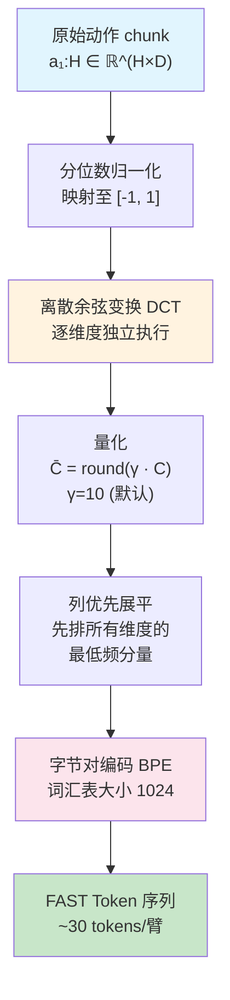
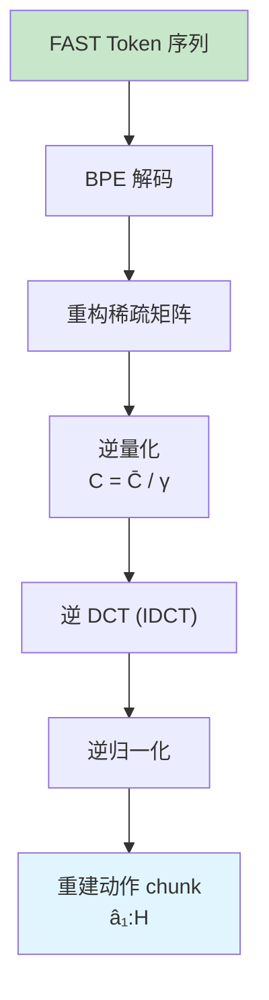
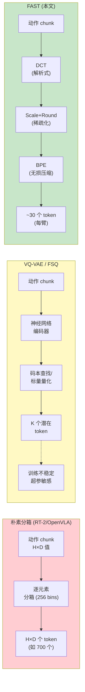
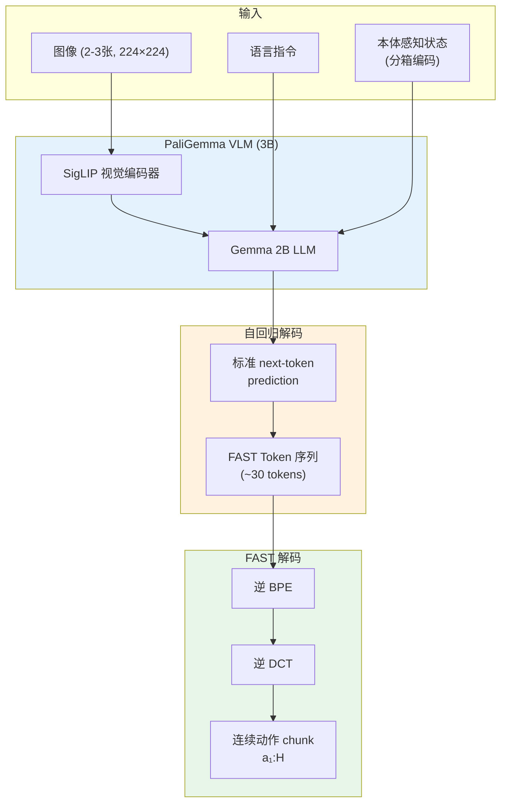

# 第五章：FAST — 频域压缩驱动的动作token化革新

## 论文信息

- **标题**: FAST: Efficient Action Tokenization for Vision-Language-Action Models
- **发表时间**: 2025年1月16日
- **会议**: RSS 2025
- **arXiv**: https://arxiv.org/abs/2501.09747
- **核心作者**: Karl Pertsch\*, Kyle Stachowicz\*（共同核心贡献者）, Brian Ichter, Danny Driess, Suraj Nair, Quan Vuong, Oier Mees, Chelsea Finn, Sergey Levine
- **机构**: Physical Intelligence / UC Berkeley / Stanford

---

## 1. 解决了什么问题 & 相对前作的定位

### 1.1 动作离散化：自回归VLA的阿喀琉斯之踵

第四章分析的 $\pi_0$ 通过引入 flow matching 连续动作生成头，绕开了动作离散化问题，取得了卓越的灵巧操作性能。但这一方案付出的代价是架构复杂性——需要独立的 Action Expert（300M 参数）、专用的注意力掩码设计，以及迭代去噪推理过程。一个自然的问题是：**能否让自回归 VLA 直接生成离散动作 token，同时保持与 flow matching 方案相当的性能？**

这一问题的核心障碍在于动作 token 化（action tokenization）——如何将连续的机器人动作信号映射为 VLM 可以自回归预测的离散 token 序列。此前的主流方案（RT-2、OpenVLA 等采用的逐维度逐时间步分箱方案）存在根本性缺陷：

**朴素分箱（Naive Binning）方案**：对 $D$ 维动作序列 $a_{1:H}$，将每个时间步的每个维度独立离散化为 $N=256$ 个均匀区间之一，生成 token 序列：

$$T_a(a_{1:H}) = [T_{1,1}, \ldots, T_{1,D}, \ldots, T_{H,1}, \ldots, T_{H,D}]$$

总 token 数为 $H \times D$。对于 50Hz 双臂操作任务（$H=50, D=14$），单个 1 秒 action chunk 即产生 700 个 token——这远超典型 LLM 生成长度，使训练和推理都面临巨大挑战。

### 1.2 边际信息量消失：高频token化的根本困境

FAST 论文的核心理论洞察在于：**朴素分箱方案失败的根因不仅是 token 数量过多，更在于相邻 token 之间的边际信息量趋近于零**。

自回归模型的训练目标是最大化条件概率 $P(T_i | T_{1:i-1})$，其学习信号正比于 $T_i$ 在给定 $T_{1:i-1}$ 条件下的边际信息量 $I(T_i ; T_{1:i-1})$。对于平滑的机器人动作信号，当采样频率增高时，相邻时间步的动作值差异按比例缩小：

$$\Delta a_t = a_{t+1} - a_t \propto \frac{1}{f_{\text{control}}}$$

这意味着高频采样下，每个新 token 携带的增量信息极少，模型可以通过简单复制前一个 token 获得极低的预测损失，陷入退化的局部最优。论文通过精心设计的教学实验（didactic experiment）量化了这一现象：在合成三次样条插值任务中，当采样率从 25 提升至 800 时，朴素方案的预测 MSE 急剧飙升，模型最终退化为输出常量。

这解释了为什么 OpenVLA 在低频数据集（BridgeV2，5Hz）上表现良好，却无法有效训练高频 DROID 数据集（15Hz）。

### 1.3 VQ-VAE/FSQ：学习式压缩的局限

另一条路径是使用向量量化自编码器（VQ-VAE）或其简化变体有限标量量化（FSQ）来学习动作的压缩表示。这类方法训练一个编码器-解码器网络，将 action chunk 映射到紧凑的离散码本空间。但论文指出其两个关键问题：

1. **训练不稳定性**：VQ-VAE 的码本利用率（codebook utilization）对超参数极为敏感，常出现模式坍缩（mode collapse），需要精心的数据集特定调参。
2. **高保真度区域退化**：在压缩-重建权衡曲线上，FSQ 在低保真度区域（粗糙重建）比 FAST 更紧凑，但在需要精细控制的高保真度区域性能急剧退化——而灵巧操作恰恰需要高保真度重建。

### 1.4 FAST 的定位：从第一性原理出发的压缩式token化

FAST 的核心洞察优雅而深刻：**机器人动作信号本质上是平滑的时间序列，应在训练前进行压缩，以消除相邻 token 间的冗余并提升每个 token 的信息密度**。这一思路类比了语言模型领域的 Byte-Pair Encoding（BPE）——通过合并高频出现的字节序列来压缩文本。但由于机器人动作是连续信号而非离散符号，对应的压缩策略应采用信号处理中的经典工具——离散余弦变换（DCT），即 JPEG 图像压缩的核心算法。

相对于 $\pi_0$ 的 flow matching 方案，FAST 提供了一条完全不同的技术路径：

| 维度 | $\pi_0$（Flow Matching） | $\pi_0$-FAST（FAST Token化） |
|------|--------------------------|-------------------------------|
| 解码方式 | 迭代去噪（10步 Euler 积分） | 标准自回归 next-token prediction |
| 架构需求 | 独立 Action Expert（300M参数） | 无需额外架构，复用 VLM 骨干 |
| 损失函数 | Flow matching 向量场回归损失 | 标准交叉熵损失 |
| 训练效率 | 基准 | 快 5 倍 |
| 推理延迟 | ~100ms（4090 GPU） | ~750ms（4090 GPU） |
| 语言指令跟随 | 较弱（扩散头可能忽略语言） | 较强（自回归天然与语言对齐） |

---

## 2. 创新点

按重要性排序：

### 创新点 1：基于 DCT 的频域压缩实现动作 token 化 —— 变革性

将信号处理中成熟的离散余弦变换引入机器人动作表示，是 FAST 最核心的贡献。这不是简单的技术移植，而是基于对机器人动作信号物理特性的深刻理解：机器人动作本质上是平滑连续的（受惯性、电机带宽等物理约束），其频谱能量集中在低频分量——这与自然图像中像素平滑变化的特性完全类比，正是 DCT（JPEG 压缩的数学基础）最擅长处理的信号类型。

### 创新点 2：约 10 倍 token 压缩比 —— 变革性

FAST 在保持高重建保真度的同时，将 action chunk 的 token 数量压缩至约 1/10：50Hz 双臂 T 恤折叠任务从 700 个 token 压缩至 53 个（13.2 倍），20Hz 桌面清理从 140 个压缩至 28 个（5 倍）。更优雅的是，FAST 产生的 token 数量与底层动作信号的真实复杂度成正比，而非与采样频率线性增长——每个机器臂始终约产生 30 个 token，无论控制频率如何。

### 创新点 3：与任意自回归 VLM 骨干兼容 —— 显著

FAST 作为纯粹的预处理 tokenizer，不需要修改底层 VLM 的任何架构组件。论文在 PaliGemma-3B（$\pi_0$ 骨干）和 Prismatic-7B（OpenVLA 骨干）上均验证了其有效性。这种即插即用特性使得任何现有或未来的自回归 VLM 都可以直接受益于 FAST token 化。

### 创新点 4：FAST+ 通用动作 tokenizer —— 显著

在 100 万个跨平台动作 chunk（涵盖单臂、双臂、移动操作等形态，关节空间/末端执行器空间/相机坐标系三种参数化，15-50Hz 控制频率）上训练的通用 BPE 词汇表，可作为黑箱 tokenizer 应用于任意新机器人平台，性能与数据集特定 tokenizer 相当。

### 创新点 5：5 倍训练加速 —— 显著

由于 token 序列大幅缩短、损失函数简化为标准交叉熵，$\pi_0$-FAST 的训练收敛速度比扩散式 $\pi_0$ 快 5 倍（以 GPU 小时计），在数千 GPU 小时规模的训练中节省的计算资源极为可观。

---

## 3. 数据来源、处理方式及其原因

### 3.1 评估数据

论文覆盖 7 个评估环境（6 真实机器人 + 1 仿真），按控制频率跨越完整频谱：

| 任务 | 机器人 | 频率 | 维度 | 数据规模 | 特点 |
|------|--------|------|------|---------|------|
| Libero | 仿真 | - | - | 270k 样本 | 标准基准 |
| 桌面清理 | UR5 单臂 | 20Hz | 7 | 大规模 | 精确抓取 |
| T恤折叠 | 双臂 ARX | 50Hz | 14 | ~150件衬衫 | 高频灵巧 |
| 杂货装袋 | UR5 单臂 | 20Hz | 7 | 大规模 | 多样物体 |
| 吐司取出 | 双臂 Trossen | 50Hz | 14 | - | 精确操作 |
| 洗衣折叠 | 双臂 ARX | 50Hz | 14 | - | 最高难度 |
| DROID 零样本 | Franka | 15Hz | 7 | 75k episode/21M 样本 | 零样本泛化 |

### 3.2 FAST+ 通用 tokenizer 训练数据

约 100 万个 1 秒 action chunk，来源覆盖：
- **机器人形态**：单臂（UR5, Franka FR3）、双臂（ARX, AgileX, Trossen）、移动操作（Fibocom, Mobile Trossen）
- **动作空间参数化**：每种形态包含关节空间（Joint）、末端执行器世界坐标系（EE）、末端执行器相机坐标系（CamFrame）三种
- **控制频率**：15-50Hz
- **开源数据集**：ALOHA（5.0%）、DROID（11.2%）、Bridge V2（5.0%）、Open X-Embodiment（3.8%）

### 3.3 数据预处理

**分位数归一化**：将每个动作维度的第 1 和第 99 百分位映射到 $[-1, 1]$：

$$\hat{a}^d = \frac{2(a^d - Q_1^d)}{Q_{99}^d - Q_1^d} - 1$$

选择分位数而非 min-max 归一化是为了对大规模数据集中偶发的离群动作（如操作员控制器故障产生的异常值）保持鲁棒性。归一化后，所有动作填充至 32 维以适配不同维度的动作空间。统一使用 1 秒 action chunk 进行 token 化。

---

## 4. 模型结构及设计原因

### 4.1 FAST token化流水线

FAST tokenizer 本身**不是神经网络，而是一个解析式信号压缩流水线**。这是其相对于 VQ-VAE/FSQ 的根本优势——无需训练复杂的编码器-解码器网络，无模式坍缩风险，仅有两个不敏感的超参数。

完整的 FAST token化流水线如下：

逆过程（解码）完全对称且可逆：

### 4.2 DCT 数学原理：为什么频域天然适合平滑轨迹

离散余弦变换将长度为 $N$ 的时域信号 $x_n$ 转换为频域系数 $X_k$：

$$X_k = \sum_{n=0}^{N-1} x_n \cos\left[\frac{\pi}{N}\left(n + \frac{1}{2}\right)k\right], \quad k = 0, 1, \ldots, N-1$$

其中 $k=0$ 对应直流分量（信号均值），$k$ 越大对应越高的频率分量。逆变换为：

$$x_n = \frac{1}{N}\left[X_0 + 2\sum_{k=1}^{N-1} X_k \cos\left[\frac{\pi}{N}\left(n + \frac{1}{2}\right)k\right]\right]$$

**为什么 DCT 天然适合机器人动作信号？** 这需要从物理学角度理解：

1. **惯性约束**：机器人关节和末端执行器具有物理质量，加速度受电机扭矩限制，因此运动轨迹在物理上必然平滑——高频抖动意味着无穷大的加速度，这在现实中不可能发生。
2. **控制带宽限制**：电机控制器的频率响应有限（典型 PID 控制带宽远低于采样频率），高频控制信号会被物理系统自然滤除。
3. **能量集中**：上述物理约束意味着动作信号的频谱能量高度集中在低频区域。DCT 后，绝大多数高频系数的幅值接近零，可以安全截断。

这与 JPEG 压缩中自然图像的特性完全类比——自然场景中相邻像素值平滑变化，DCT 后大部分能量集中在少数低频系数中，截断高频系数仅造成视觉不可察觉的信息损失。

### 4.3 量化：Scale-and-Round

DCT 系数通过缩放后取整进行量化：

$$\bar{C}_j^i = \text{round}(\gamma \cdot C_j^i)$$

其中缩放因子 $\gamma$（默认值 10）控制压缩率与重建精度之间的权衡：
- $\gamma$ 越大，保留越多细节（量化步长 $1/\gamma$ 越小），但非零系数越多，压缩率越低
- $\gamma$ 越小，压缩越激进，但重建误差越大

量化后的系数矩阵 $\bar{C} \in \mathbb{Z}^{D \times H}$ 高度稀疏——绝大多数条目为零，仅少数低频分量保留显著非零值。

### 4.4 展平顺序与 BPE 压缩

**列优先展平**是一个关键设计决策。$D \times H$ 的 DCT 系数矩阵有两种展平方式：

- **列优先**（论文选择）：$[\bar{C}_1^1, \bar{C}_1^2, \ldots, \bar{C}_1^D, \bar{C}_2^1, \ldots, \bar{C}_H^D]$ —— 先排列所有维度的最低频分量
- **行优先**：$[\bar{C}_1^1, \bar{C}_2^1, \ldots, \bar{C}_H^1, \bar{C}_1^2, \ldots]$ —— 先排列单个维度的所有频率

列优先展平使自回归模型在生成时**先确定动作的整体形状（低频分量），再逐步细化细节（高频分量）**，这产生了更稳定的策略 rollout。这一设计与图像生成中"先粗后细"的渐进式生成策略异曲同工。

**BPE 压缩**：展平后的整数序列通过字节对编码进一步压缩。BPE 是 FAST 中**唯一需要学习的组件**（通过在训练数据上统计频繁共现的整数模式来构建词汇表），但训练仅需数分钟。BPE 实现两个功能：（1）将大量重复的零值"压扁"为少数 token；（2）将频繁出现的系数组合合并为单个 token，进一步提升压缩率。

### 4.5 FAST 算法伪代码

完整算法可形式化为：

$$\text{FAST}(a_{1:H}) = \text{BPE}\left(\text{Flatten}_{\text{col-first}}\left(\text{round}\left(\gamma \cdot \text{DCT}(\hat{a}_{1:H})\right)\right)\right)$$

其中 $\hat{a}_{1:H}$ 为分位数归一化后的动作。

### 4.6 三种 token 化方案的对比

| 对比维度 | 朴素分箱 | VQ-VAE/FSQ | FAST |
|---------|---------|------------|------|
| 压缩率 | 无 (1:1) | 中等 | 高 (最高 13.2x) |
| 训练需求 | 无 | 需训练编码器-解码器 | 仅需 BPE 词表训练（分钟级） |
| 超参敏感度 | 低 | 高（码本大小、潜在维度等） | 低（仅 $\gamma$ 和词表大小） |
| 高保真度重建 | 天然无损 | 急剧退化 | 持续可扩展 |
| 时序相关性处理 | 无（逐时间步独立） | 隐式（编码器学习） | 显式（DCT 去相关） |
| 高频数据适应性 | 完全失败 | 部分成功 | 完全成功 |

### 4.7 $\pi_0$-FAST 策略架构

FAST 作为即插即用的 tokenizer，与 $\pi_0$ 的 VLM 骨干（PaliGemma-3B）结合时，**不需要独立的 Action Expert**。动作 token 直接加入 VLM 的词汇表（覆写最少使用的 token），策略训练等价于标准的 VLM 微调：

注意一个重要的不对称性：本体感知状态作为**输入**仍使用简单分箱编码（因为输入 token 无需自回归预测，不受边际信息量消失问题影响），而动作**输出**使用 FAST token 化。

---

## 5. 训练方法（算法与工程）

### 5.1 训练目标：回归标准交叉熵

$\pi_0$-FAST 的训练目标是标准的自回归交叉熵损失，这与任何语言模型训练完全相同：

$$\mathcal{L}_{\text{FAST}} = -\sum_{i=1}^{K} \log P_\theta(\bar{T}_i | \bar{T}_{1:i-1}, o)$$

其中 $\bar{T}_{1:K}$ 是 FAST token 序列，$o$ 是观测（图像 + 语言指令 + 本体感知状态），$\theta$ 是 VLM 参数。

对比 $\pi_0$ 的 flow matching 损失：

$$\mathcal{L}_{\text{flow}} = \mathbb{E}_{\tau, A_t, A_t^\tau}\left[\|v_\theta(A_t^\tau, o_t, \tau) - u(A_t^\tau | A_t)\|^2\right]$$

FAST 方案将连续回归问题转化为离散分类问题，可以直接利用 LLM 训练基础设施（交叉熵损失、自回归采样、KV 缓存等），无需任何定制化训练代码。

### 5.2 训练配置

| 参数 | 值 |
|------|-----|
| 优化器 | AdamW ($\beta_1=0.9, \beta_2=0.95$) |
| 权重衰减 | 无 |
| 梯度裁剪 | 幅值裁剪至 1 |
| 学习率 | 5e-5（1k步线性warmup后恒定） |
| EMA 衰减 | 0.999 |
| 微调方式 | 全参数，不冻结任何层 |
| DROID 训练 | 3 epoch, 240k 迭代, batch 256, 8×H100 ~4天 |
| Libero 训练 | 40k 迭代, ~40 epoch |

### 5.3 训练效率分析

FAST 带来训练效率提升的机制是多层次的：

1. **序列长度缩短**：自回归 Transformer 的计算复杂度为 $O(n^2 d)$（$n$ 为序列长度），token 数量从数百减至约 30，序列长度方面的计算量减少约一个数量级。
2. **损失函数简化**：交叉熵损失（softmax + 对数）相比 flow matching 的向量场回归损失（MSE 在高维连续空间），计算图更简单，梯度更稳定。
3. **无迭代去噪**：训练时不需要采样噪声时间步 $\tau$、构造带噪动作 $A_t^\tau$，简化了数据流水线。
4. **信息密度提升**：每个 FAST token 携带高信息量，训练信号更有效，收敛更快。

最终结果：$\pi_0$-FAST 在 903M 时间步的跨平台数据集上训练所需 GPU 小时仅为扩散式 $\pi_0$ 的 **1/5**。

### 5.4 推理策略

- **默认**：贪心自回归解码（argmax 采样）
- **双臂任务**（T恤折叠、吐司取出、洗衣折叠）：温度 $\beta = 0.7$ 的采样解码。原因是部分训练数据包含机器人在起始位置静止的片段，需要随机性帮助策略"启动"
- **推理延迟**：~750ms/chunk（4090 GPU），需自回归解码 30-60 个 token，使用完整 2B 参数语言模型骨干。相比扩散式 $\pi_0$ 的 ~100ms（10 步去噪，使用 300M Action Expert），推理速度是当前主要劣势

---

## 6. 实验关键发现与效果对比

### 6.1 压缩率分析

FAST 的压缩率与控制频率正相关，且展现出一个优雅的自适应特性：

| 数据集 | 动作维度 | 控制频率 | 朴素方案 token 数 | FAST token 数 | 压缩比 |
|--------|---------|---------|-------------------|---------------|--------|
| BridgeV2 | 7 | 5 Hz | 35 | 20 | 1.75x |
| DROID | 7 | 15 Hz | 105 | 29 | 3.6x |
| 桌面清理 | 7 | 20 Hz | 140 | 28 | 5.0x |
| T恤折叠 | 14 | 50 Hz | 700 | 53 | 13.2x |

关键发现：**FAST 每个机器臂始终产生约 30 个 token**（双臂约 60 个），无论控制频率如何。这说明 FAST 自动提取了底层动作信号的真实信息复杂度，而非受采样频率支配。从信息论角度，这表明 1 秒动作轨迹的本征信息量（intrinsic information content）约等于 30 个离散 token 的信息容量。

### 6.2 token化方案对比

在所有评估任务上，不同 token 化方案的策略性能呈现清晰的层级结构：

| 任务 | 朴素分箱 | FSQ | FAST | FAST+ |
|------|---------|-----|------|-------|
| T恤折叠 (50Hz) | **完全失败** (~0%) | 中等 | 高 | 高 |
| 桌面清理 (20Hz) | **完全失败** (~0%) | 中等偏高 | 高 | 高 |
| DROID (15Hz) | 低 | 中等 | 高 | 高 |
| Libero | 中等 | 中等偏高 | 高 | 高 |

核心结论：
- 朴素分箱在 20Hz 以上的高频任务中完全失败，策略无法取得任何任务进展
- 压缩式 token 化（FAST 和 FSQ）均能有效训练策略
- FAST 在灵巧高频任务上优于或持平 FSQ，且远比 FSQ 简单（无需训练单独的神经网络）
- FAST+ 通用 tokenizer 在所有任务上与数据集特定 FAST 性能相当

### 6.3 $\pi_0$-FAST vs 扩散式 $\pi_0$

#### 单任务训练

| 任务 | $\pi_0$-FAST | 扩散 $\pi_0$ | 扩散 $\pi_0$ (3x 计算) | 优势方 |
|------|-------------|-------------|----------------------|--------|
| Libero | 相当 | 相当 | 相当 | 持平 |
| T恤折叠 | 相当 | 相当 | 相当 | 持平 |
| 桌面清理 | **高** | 中等 | 高 | FAST（收敛快 3x） |
| DROID | **高** | 中等偏低 | - | FAST（语言跟随更好） |

关键发现：在小数据集（<50h）上两者性能相当；在大数据集上 FAST 收敛显著更快（桌面清理任务需 1/3 训练步数）；在 DROID 评估中，自回归 $\pi_0$-FAST 比扩散 $\pi_0$ 更好地遵循语言指令——扩散模型的 flow matching 头有时会忽略语言条件。

#### 大规模通用策略训练

在 903M 时间步的完整 $\pi_0$ 训练混合数据上训练通用策略：

| 任务 | $\pi_0$-FAST | 扩散 $\pi_0$ |
|------|-------------|-------------|
| T恤折叠 | 相当 | 相当 |
| 桌面清理 | 相当 | 相当 |
| 杂货装袋 | 相当 | 相当 |
| 吐司取出 | 相当 | 相当 |
| 洗衣折叠 | 相当 | 相当 |
| **训练 GPU 小时** | **1x** | **5x** |

$\pi_0$-FAST 在所有任务（包括最具挑战性的洗衣折叠）上匹配扩散 $\pi_0$ 的性能，同时训练计算量仅为后者的 1/5。与计算量匹配的扩散 $\pi_0$ 对比，$\pi_0$-FAST 在所有任务上明显胜出。

### 6.4 首次实现 DROID 零样本泛化

FAST 的一个里程碑式成果是首次成功训练出能在完全未见环境中零样本评估的 DROID 策略——无需微调，仅通过自然语言提示即可执行任务。该策略在 UC Berkeley、Stanford、University of Washington 三个校区的不同场景中均展示了稳健的泛化能力（不同桌面布置、背景、相机视角和物体）。此前的 DROID 论文和 OpenVLA 均仅展示了 co-training 或 fine-tuning 结果。

---

## 7. 消融实验的发现

按影响力从大到小排序：

### 消融 1：DCT 压缩的核心价值（影响力：决定性）

FAST 完整方案 vs 朴素分箱的对比本身就是最重要的消融：DCT 频域变换从根本上消除了高频动作序列中的时序冗余，使每个 token 携带高边际信息量。在教学实验中，DCT token 化在所有采样频率（25-800）上均保持低预测误差，而朴素方案在高频率下急剧退化。

### 消融 2：BPE 压缩步骤（影响力：重要）

移除 BPE 后（仅保留 DCT + 量化），策略在桌面清理和 T 恤折叠任务上的 rollout 性能下降，但仍显著优于朴素方案。这说明：
- DCT 变换本身已将信号信息集中到少数系数中，改善了学习信号质量
- 但没有 BPE 时，大量重复的零值 token 稀释学习信号并降低推理速度（需预测数百个 token）
- BPE 的零值压缩和频繁模式合并对最终性能**重要但非决定性**

### 消融 3：展平顺序（影响力：显著）

列优先展平（先排所有维度的最低频分量）优于行优先展平（先排单维度的所有频率分量）。原因：列优先使自回归生成时先确定动作的全局形状，再逐步细化——这产生了更稳定的策略 rollout，与"先粗后细"的生成范式一致。

### 消融 4：VLA 骨干无关性（影响力：验证性）

在 50Hz T 恤折叠任务上，将 FAST+ 应用于 OpenVLA（Prismatic 7B 骨干），从近乎零的成功率提升到可用水平。这证明 FAST 的改进独立于底层 VLM 架构，是 token 化层面的根本改进。

### 消融 5：通用 vs 数据集特定 tokenizer（影响力：实用性）

FAST+ 在所有评估任务上与针对每个数据集单独训练的 FAST tokenizer 性能相当。在 14 个未见数据集上的离线压缩测试中，FAST+ 对所有数据集均实现至少 2 倍压缩，部分高维高频数据集（如 HumanPlus 的 40 维 50Hz 关节空间）压缩比超过 10 倍。

### 消融 6：压缩-重建权衡曲线（影响力：理论性）

在六个数据集上扫描各 tokenizer 的核心超参数（FAST: 缩放因子 $\gamma$；朴素方案: 降采样频率；FSQ: 潜在 token 数），关键发现是 **FAST 在高保真度区域的缩放特性显著优于 FSQ**：

- FSQ 在低保真度下更紧凑（更少 token 达到同等粗糙重建质量）
- 但 FSQ 在需要精细控制的高保真度区域**性能急剧退化**
- FAST 能持续缩放到更高精度，且在宽广的参数范围内表现稳定

这一差异对灵巧操作至关重要——衣物折叠、精密装配等任务要求毫米级动作精度，FAST 在该区域的优势使其成为更可靠的选择。

---

## 8. 优化有效性评估

### 8.1 核心洞察排序

| 排名 | 优化策略 | 有效性证据 | 影响机制 |
|------|---------|-----------|---------|
| 1 | DCT 频域压缩 | 所有高频任务从完全失败到成功 | 消除时序冗余，提升 token 信息密度 |
| 2 | BPE 无损压缩 | 移除后性能显著下降 | 压缩零值，合并频繁模式 |
| 3 | 列优先展平 | 行优先导致不稳定 rollout | 先粗后细的渐进式生成 |
| 4 | 分位数归一化 | 跨平台 tokenizer 的基础 | 统一动作范围，鲁棒于离群值 |

### 8.2 为什么频域压缩是"正确"的抽象

FAST 的成功不是偶然的工程技巧，而是源于对机器人动作信号物理本质的正确认识。从信号处理理论的角度：

**Parseval 定理**告诉我们，信号在时域和频域的总能量相同：

$$\sum_{n=0}^{N-1} |x_n|^2 = \frac{1}{N} \sum_{k=0}^{N-1} |X_k|^2$$

但能量的**分布**截然不同。对于平滑的机器人轨迹，时域中能量均匀分散在所有时间步（每步变化微小但非零），而频域中能量高度集中在少数低频系数中。这意味着：

- **时域 token 化**（朴素分箱）：每个 token 携带约 $E/N$ 的信息量（$E$ 为总信息量），$N$ 越大则每个 token 越"空洞"
- **频域 token 化**（FAST）：少数低频 token 携带绝大部分信息（可能超过 95%），高频 token 可安全丢弃

从这个视角看，DCT 执行的是**信息重新打包**——将分散在时域中的信息集中到频域的少数系数中，使每个保留的 token 都承载高密度信息。这正是自回归模型所需要的：**每个预测步骤都应是一个有意义的决策，而非对前一步的微小修正。**

### 8.3 与 $\pi_0$ flow matching 的互补性分析

FAST 和 flow matching 代表了处理连续动作生成的两种正交策略：

- **Flow matching**（$\pi_0$）：在**连续空间**中直接建模动作分布，通过学习从噪声到动作的向量场实现生成。优势在于保持动作的连续性和多模态表达能力（flow matching 可建模多峰分布），劣势在于需要迭代去噪和独立的 Action Expert。
- **FAST token 化**（$\pi_0$-FAST）：将连续动作**无损压缩为离散 token**，然后在离散空间中用标准自回归方法生成。优势在于完全复用 LLM 训练基础设施、更好的语言对齐，劣势在于推理时需逐 token 生成（较慢）且量化引入微小信息损失。

两者性能相当但各有优势的实验结果表明，**连续 vs 离散的表示选择本身并非性能瓶颈**——关键在于表示是否高效编码了动作信号的本质信息。

---

## 9. 与后续工作的关联

### 9.1 $\pi_0$-FAST 成为 $\pi_0$ 的标准替代方案

FAST 的成功意味着 Physical Intelligence 的模型体系从此拥有两种等效的动作生成路径：flow matching（适合推理延迟敏感场景）和 FAST 自回归（适合训练效率优先场景和需要强语言对齐的场景）。这种双轨策略在后续工作中得到了持续发展。

### 9.2 Knowledge Insulation（第八章）中的角色

$\pi_{0.5}$ 的知识隔离（Knowledge Insulation）技术利用 FAST token 解决了一个关键问题：如何在不损害 VLM 语言-视觉能力的前提下进行机器人数据训练。FAST 使动作预测成为标准的 token 预测任务，使得 VLM 骨干可以在混合文本-动作数据上联合训练，而知识隔离通过冻结 VLM 低层权重防止遗忘。

### 9.3 $\pi_{0.5}$（第七章）的集成

$\pi_{0.5}$ 将 FAST 作为核心训练选项之一。由于 FAST 使动作预测与文本生成共享同一个自回归框架，$\pi_{0.5}$ 可以在同一个训练循环中同时优化语言理解和动作生成，实现真正的多模态联合训练。这是 flow matching 方案难以直接实现的——flow matching 的连续回归损失与文本的交叉熵损失在数值尺度和梯度特性上存在根本差异。

### 9.4 $\pi_{0.7}$（第十四章）的自回归模式

$\pi_{0.7}$ 采用 FAST 作为其自回归动作生成模式的基础，进一步验证了 FAST token 化在更大规模模型和更复杂任务上的可扩展性。

### 9.5 更广泛的影响

FAST 的成功传递了一个更深层的信息：在机器人学习中，**数据表示的选择**（如何将连续信号编码为模型可处理的格式）可能比模型架构的选择更为关键。一个经过良好设计的 tokenizer 可以将复杂的高频灵巧控制问题简化为标准的 LLM 训练问题，这为利用 LLM 领域的海量工程优化（speculative decoding、量化推理、分布式训练框架等）打开了大门。从这个意义上说，FAST 不仅是一个 tokenizer，更是连接机器人控制与大语言模型生态系统的桥梁。

---
