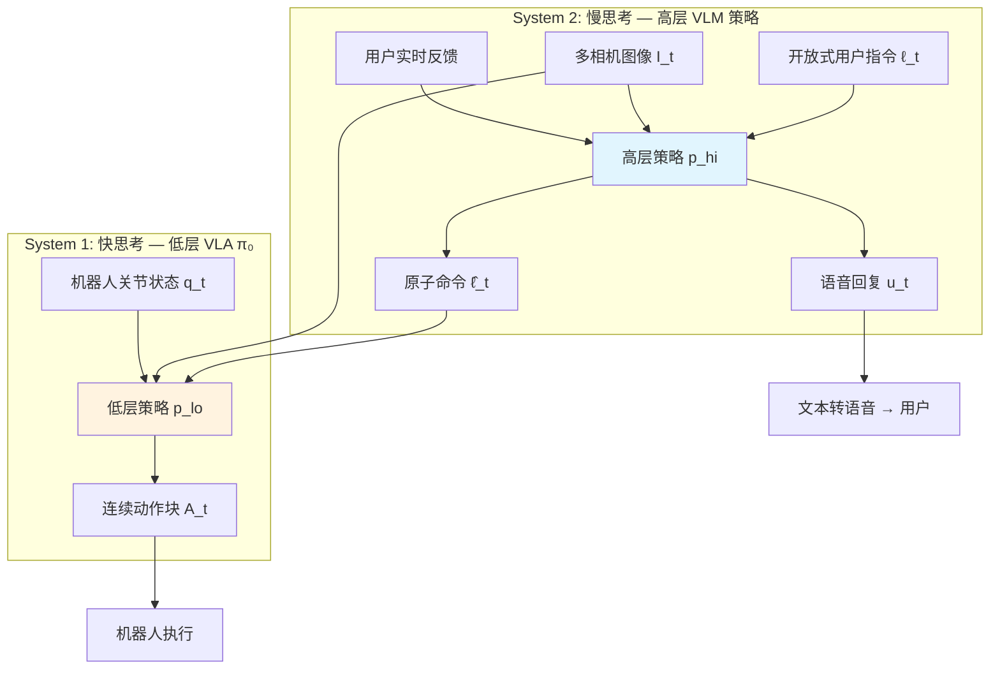
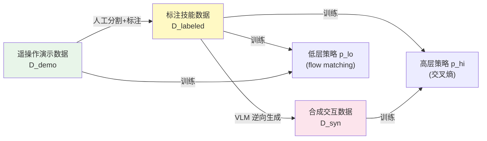
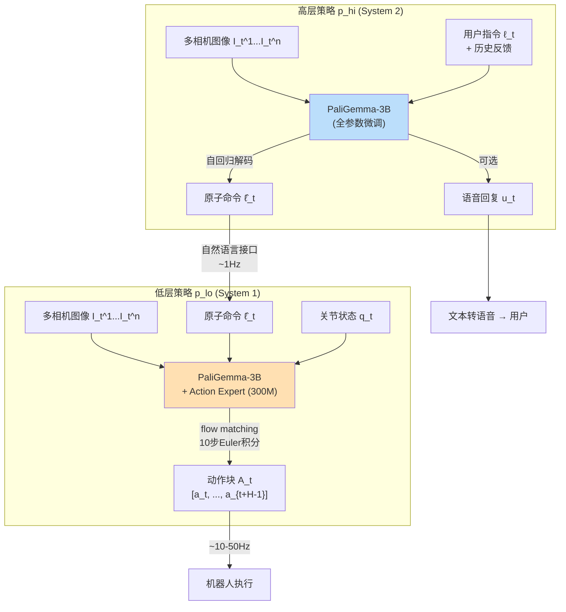
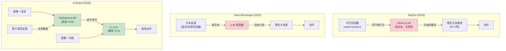

# 第六章：Hi Robot — 层级式VLA：为机器人赋予"快思考"与"慢思考"的双系统认知架构

## 论文信息

- **标题**: Hi Robot: Open-Ended Instruction Following with Hierarchical Vision-Language-Action Models
- **发表时间**: 2025-02-26 (arXiv v1); 2025-07 (ICML 2025, Vancouver)
- **arXiv**: https://arxiv.org/abs/2502.19417
- **核心作者**: Lucy Xiaoyang Shi, Brian Ichter, Michael Equi, Liyiming Ke, Karl Pertsch, Quan Vuong, James Tanner, Anna Walling, Haohuan Wang, Niccolo Fusai, Adrian Li-Bell, Danny Driess, Lachy Groom, Sergey Levine, Chelsea Finn
- **机构**: Physical Intelligence, Stanford University, UC Berkeley
- **项目页**: https://www.pi.website/research/hirobot

> **历史定位**: Hi Robot 是 Physical Intelligence 演化链中的第六篇核心论文，标志着 PI 的研究视野从**单步原子操作**跃迁至**开放式多步推理执行**。如果说 $\pi_0$（第四章）证明了一个 VLA 可以成为极其强大的"手"——以 flow matching 在 50Hz 下精准操控各类机器人，那么 Hi Robot 则为这只"手"装上了"大脑"——一个能理解复杂指令、整合实时反馈、进行情境推理的高层认知系统。这一"System 1 + System 2"的双系统架构不仅解决了 $\pi_0$ 在长时域任务上的根本局限，更为 PI 后续的 $\pi_{0.5}$、MEM、$\pi_{0.7}$ 等工作奠定了层级式任务分解的范式基础。

---

## 1. 解决了什么问题 & 相对前作的定位

### 1.1 核心问题：从原子指令到开放式指令

$\pi_0$（Black et al., 2024）在单步灵巧操作上取得了突破性进展，但其指令跟随能力被限制在**原子级**：模型能理解"拿起杯子"、"把面包放在砧板上"，却无法处理现实世界中人类自然表达的**复杂、多步、带约束、需要推理**的指令。考虑以下真实场景：

| 指令类型 | 示例 | $\pi_0$ 能否处理 | 根本困难 |
|---------|------|:---:|---------|
| 多阶段组合 | "帮我做一个芝士牛肉生菜三明治" | 否 | 需要分解为 10+ 个有序子任务 |
| 带约束条件 | "做个素食三明治，我对泡菜过敏" | 否 | 需要推理排除特定食材 |
| 开放式语义 | "电影之夜！帮我拿些零食和饮料" | 否 | 需要从世界知识推断合适物品 |
| 实时反馈纠正 | "那个不是垃圾！" "别碰那个" | 否 | 需要理解情境、修正当前行为 |
| 否定式任务 | "只清理垃圾，不要碰碗碟" | 否 | 需要推理哪些物体属于哪类 |

这一局限并非 $\pi_0$ 独有，而是所有端到端 VLA 模型的结构性缺陷：**单一策略网络在一次前向传播中同时承担语义推理和动作生成的双重任务，当指令复杂度超过训练分布时必然失败**。

### 1.2 先前层级式方法的困境

在 Hi Robot 之前，学术界已有多种层级式机器人系统试图解决长时域任务分解问题，但它们各有致命缺陷：

| 系统 | 架构方案 | 核心局限 |
|------|---------|---------|
| **SayCan** (Brohan et al., 2023) | LLM 规划器 + 预定义技能 + 可行性打分 | 纯文本规划，无视觉接地；技能库固定，无法泛化新操作 |
| **Inner Monologue** (Huang et al., 2022) | LLM + 文本反馈循环 | 反馈为纯文本描述，非视觉接地；无法处理"那个不是垃圾"等情境性纠正 |
| **Code-as-Policies** (Liang et al., 2023) | LLM 生成代码 + 预定义 API | 依赖手工 API；无法处理灵巧操作 |
| **PaLM-E** (Driess et al., 2023) | 多模态 LLM + 具身推理 | 计划与执行分离；低层控制能力有限 |
| **RT-H** (Belkhale et al., 2024) | 层级式动作生成 | 缺乏实时人机交互反馈整合 |
| **YAY Robot** (Shi et al., 2024) | 高层纠错 + 低层 VLA | 仅支持单一 prompt；纠正类型受限于人工收集数据 |

这些系统的共同范式是**独立的规划模块 + 独立的执行模块**，导致三个系统性问题：

1. **错误级联**：高层的规划错误无法被低层纠正，反之亦然
2. **缺乏接地**：纯文本规划器无法将推理与视觉观测对齐
3. **模块间不兼容**：规划器不了解执行器的能力边界，容易生成不可执行的计划

### 1.3 Hi Robot 的解决方案

Hi Robot 提出了一个优雅的统一方案：**用同一类 VLM 架构同时实现高层推理和低层执行**，两个层级通过自然语言接口通信，借由 Kahneman 的"System 1/System 2"认知框架组织分工：

这一设计的核心洞见是：**推理和执行需要不同的时间尺度和不同的训练信号，但不需要不同的架构**。高层 VLM 在低频（~1Hz）下进行语义推理，低层 VLA 在高频（~10-50Hz）下生成动作——两者共享 PaliGemma-3B 骨干，唯一的差别是低层附加了 flow matching 动作专家头。

---

## 2. 创新点

### 2.1 创新点全景

| 序号 | 创新点 | 类别 | 重要性评估 |
|:---:|--------|:----:|:--------:|
| 1 | 统一架构的层级式 VLA：同一 VLM 骨干同时实现推理和执行 | 架构 | 变革性 |
| 2 | System 1/System 2 认知类比在机器人系统中的实现 | 理论框架 | 重要 |
| 3 | 逆向合成数据生成：从技能标签反推可能的用户指令 | 数据 | 重要 |
| 4 | 自然语言作为层级间接口，实现可解释的推理-执行通信 | 接口设计 | 重要 |
| 5 | 实时语音交互闭环：语音输入 → 推理 → 动作 + 语音回复 | 系统集成 | 有意义 |

### 2.2 核心创新深度分析

**创新1：统一架构的层级式 VLA（变革性）**

Hi Robot 的最根本创新在于证明了**不需要异构模块即可构建层级式机器人系统**。与 SayCan 使用独立的 LLM（PaLM）+ 独立的技能策略（RT-1）不同，Hi Robot 的高层和低层都从同一个 PaliGemma-3B VLM 出发，仅在输出端分化：

$$
\text{高层: } p_{\text{hi}}(\hat{\ell}_t \mid I_t^1, \ldots, I_t^n, \ell_t) \quad \text{（文本输出，交叉熵训练）}
$$

$$
\text{低层: } p_{\text{lo}}(A_t \mid I_t^1, \ldots, I_t^n, \hat{\ell}_t, q_t) \quad \text{（连续动作输出，flow matching 训练）}
$$

这种同源异构设计的意义在于：两个层级共享相同的视觉表征基础（SigLIP 编码器），高层的视觉理解能力直接转化为对低层执行环境的理解，避免了异构系统中"规划器看到的世界"和"执行器看到的世界"不一致的问题。论文在 Discussion 中进一步指出，未来自然的演进方向是**将两个层级融合为一个模型，在推理时通过模式切换区分 System 1 和 System 2 行为**——这正是后续 $\pi_{0.5}$ 所实现的。

**创新2：逆向合成数据生成（重要）**

传统的层级式系统训练需要大量标注好的"复杂指令 → 子任务序列"数据，但这类数据收集极其昂贵。Hi Robot 创造性地**反转了数据生成方向**：

$$
\text{传统方向: } \ell_t \xrightarrow{\text{人工标注}} [\hat{\ell}_1, \hat{\ell}_2, \ldots, \hat{\ell}_T]
$$

$$
\text{Hi Robot: } \hat{\ell}_t \xrightarrow{p_{\text{gen}}} (\ell_t, u_t) \quad \text{（从技能标签反推用户指令和机器人回复）}
$$

具体而言，给定一个已标注的技能标签 $\hat{\ell}_t$（如"拿起 KitKat"）和对应的视觉上下文 $I_t$，使用大型 VLM $p_{\text{gen}}$ 生成可能触发该技能的用户指令（如"帮我拿点甜的东西"）。生成过程还受历史技能标签 $\hat{\ell}_0, \ldots, \hat{\ell}_{t-1}$ 条件约束以保持多步一致性：

$$
p_{\text{gen}}(\ell_t, u_t \mid I_t^1, \ldots, I_t^n, \hat{\ell}_0, \ldots, \hat{\ell}_{t-1}, \hat{\ell}_t, P)
$$

其中 $P$ 是包含任务描述和场景分类的元提示（meta-prompt），指导 $p_{\text{gen}}$ 覆盖否定任务、情境纠正、特定约束等多种交互类型。

---

## 3. 数据来源、处理方式及其原因

### 3.1 三层数据管线

Hi Robot 的数据管线包含三个层次，每层解决一个不同的问题：

**第一层：遥操作演示数据 $D_{\text{demo}}$**

通过遥操作收集完整任务轨迹（如"做三明治"的整个过程），每条轨迹附带粗粒度语言标注描述整体目标。这些数据直接用于训练低层 VLA 策略的 flow matching 目标。

**第二层：标注技能数据 $D_{\text{labeled}}$**

人工将完整演示切分为 1-3 秒的原子级技能片段，每个片段配以精确的技能标签 $\hat{\ell}_t$（如"拿起一片生菜"、"把面包放在砧板上"）。此外，还通过启发式方法从原始动作中提取基础运动原语（如"右臂向左移动"）。$D_{\text{labeled}}$ 同时服务于高层和低层的训练。

**第三层：合成交互数据 $D_{\text{syn}}$**

这是 Hi Robot 最关键的数据创新。将 $D_{\text{labeled}}$ 中的（图像，技能标签）元组输入大型 VLM $p_{\text{gen}}$，逆向生成可能触发该技能的用户指令和机器人语音回复。合成数据采用结构化场景分类和回复分类确保多样性：

| 场景类型 | 示例用户指令 | 对应技能标签 |
|---------|-----------|-----------|
| 否定任务 | "只清理垃圾，不要碰碗碟" | pick up plastic container |
| 情境纠正 | "那个不是垃圾！" | open gripper (放下物品) |
| 特定约束 | "我对泡菜过敏" | pick up lettuce (跳过泡菜) |
| 开放式请求 | "帮我拿点甜的东西" | pick up KitKat |
| 追加请求 | "我还要一个 KitKat" | pick up KitKat |

### 3.2 逆向生成策略的深层原因

为什么不直接收集复杂交互数据？核心原因有三：

1. **成本效率**：每次复杂交互需要人类操作员和对话参与者配合，一小时可能仅产生几十条有效交互；逆向生成可以在几小时内为现有演示数据批量补充数万条多样化指令
2. **组合爆炸**：6 种食材的三明治有 $2^6 - 1 = 63$ 种组合，每种组合又可叠加饮食约束、偏好表达等，人工覆盖几乎不可能
3. **视觉接地**：$p_{\text{gen}}$ 在生成时看到实际的机器人观测图像，因此生成的指令天然与物理场景对齐，避免了纯文本生成可能产生的"幻觉指令"

---

## 4. 模型结构及设计原因

### 4.1 双 VLM 层级架构

Hi Robot 的架构核心是两个共享基础但分工不同的 VLM：

**频率分离设计**：高层策略每 1 秒或在收到新用户反馈时触发一次推理；低层策略以约 10Hz 生成动作块（结合 action chunking 可达 50Hz 控制频率）。这种设计反映了认知科学中的核心洞见：**语义推理和运动控制在时间尺度上天然分离**——人类思考下一步做什么需要数百毫秒到数秒，但肌肉协调只需数十毫秒。

**自然语言作为模块间接口**：两个 VLM 之间通过自然语言 $\hat{\ell}_t$ 通信。这一选择有三个优势：(1) 可解释性——可以直接观察高层向低层发出了什么指令；(2) 可调试性——当系统失败时，可以判断是高层推理错误还是低层执行错误；(3) 可替换性——低层可以被其他语言条件策略替换，高层也可以被更强的 VLM 替换。

### 4.2 与先前层级系统的架构比较

以下表格总结了三种层级架构的核心设计差异：

| 维度 | SayCan | Inner Monologue | Hi Robot |
|------|--------|-----------------|---------|
| 高层模型 | PaLM (LLM, 纯文本) | LLM (纯文本) | PaliGemma VLM (图像+文本) |
| 低层执行 | RT-1 / 手工技能 | 预定义技能 | $\pi_0$ VLA (flow matching) |
| 视觉接地 | 无（高层不看图像） | 无 | 有（高层直接处理图像） |
| 反馈机制 | 可行性函数打分 | 文本成功/失败检测 | 用户实时语音/文本反馈 |
| 技能表示 | 离散技能库 | 离散技能库 | 连续自然语言命令 |
| 权重共享 | 完全独立 | 完全独立 | 共享 VLM 骨干 |
| 灵巧操作 | 受限于 RT-1 | 受限于预定义技能 | $\pi_0$ 级别的灵巧操作 |
| 训练耦合 | 完全解耦 | 完全解耦 | 部分耦合（共享基础数据） |

### 4.3 推理延迟分析

论文详细测量了消费级 GPU（RTX 4090）上的推理延迟：

| 组件 | 延迟 (RTX 4090) | 延迟 (H100) |
|------|:---:|:---:|
| 低层：图像编码 | 14 ms | — |
| 低层：观测处理 | 32 ms | — |
| 低层：动作预测 ($\times 10$ flow steps) | 27 ms | — |
| **低层总计（板载）** | **73 ms** | — |
| **低层总计（WiFi 离板）** | **86 ms** | — |
| 高层：prefill | 47 ms | 17.3 ms |
| 高层：单步解码 | 13.2 ms | 5.7 ms |

这些延迟数据确认了系统在消费级硬件上的实时可行性：低层以 ~13Hz 运行（通过 action chunking 达到 50Hz 控制），高层每秒仅需推理一次，远低于解码速度上限。

---

## 5. 训练方法（算法与工程）

### 5.1 双目标分离训练

Hi Robot 的训练哲学是**层级分离**：高层和低层使用不同的目标函数在不同的数据组合上训练，通过共享的技能标签间接建立联系。

**高层策略训练**：在 $D_{\text{syn}} \cup D_{\text{labeled}}$ 上，使用标准的自回归 next-token prediction 交叉熵损失：

$$
\mathcal{L}_{\text{hi}} = -\sum_{k=1}^{|\hat{\ell}_t|} \log p_{\text{hi}}(x_k \mid x_{<k}, I_t^1, \ldots, I_t^n, \ell_t)
$$

其中 $x_k$ 是原子命令 $\hat{\ell}_t$（和可选的语音回复 $u_t$）的第 $k$ 个 token。PaliGemma-3B 全参数解冻微调。

**低层策略训练**：在 $D_{\text{labeled}} \cup D_{\text{demo}}$ 上，使用 $\pi_0$ 的 flow matching 目标函数：

$$
\mathcal{L}_{\text{lo}} = \mathbb{E}_{\tau \sim p(\tau)} \left[ \| v_\theta(A_t^\tau, o_t) - u(A_t^\tau \mid A_t) \|^2 \right]
$$

其中 $v_\theta$ 是模型预测的速度场，$u$ 是条件 flow matching 的目标速度场，$A_t^\tau$ 是在噪声水平 $\tau$ 下的带噪动作。

### 5.2 训练超参数与效率

| 超参数 | 高层策略 | 低层策略 |
|--------|:------:|:------:|
| 基础模型 | PaliGemma-3B | PaliGemma-3B + Action Expert |
| 优化器 | AdamW ($\beta_1{=}0.9, \beta_2{=}0.95$) | 同 $\pi_0$ |
| 权重衰减 | 0 | 同 $\pi_0$ |
| 梯度裁剪 | 1.0 | 同 $\pi_0$ |
| EMA 衰减 | 0.999 | 同 $\pi_0$ |
| 学习率 | $1 \times 10^{-5}$（1000 步预热后恒定） | 同 $\pi_0$ |
| Batch size | 512 | 同 $\pi_0$ |
| 训练时长 | **~2 小时 (8$\times$H100)** | 取决于数据规模和任务复杂度 |

高层策略训练仅需约 2 小时这一事实极其重要——它意味着在 $\pi_0$ 低层策略已训练完成的前提下，为机器人添加复杂指令跟随能力的边际成本极低。

### 5.3 训练解耦的权衡

高层和低层的解耦训练是一把双刃剑：

**优势**：
- 允许独立迭代——改进高层推理不需要重新训练低层控制
- 降低训练复杂度——避免两种截然不同的损失信号相互干扰
- 高层训练极快（2 小时），支持快速实验

**局限**：
- 两个模型不了解彼此的能力边界——高层可能生成低层无法执行的命令
- 无法端到端优化——高层的推理质量无法通过低层的执行成功率获得梯度反馈
- 论文明确将"让高层感知低层执行成功率"列为关键未来方向

---

## 6. 实验关键发现与效果对比

### 6.1 实验设置

实验跨越三个任务域和三种机器人平台，全面测试了系统在复杂指令跟随、实时反馈整合和多步任务执行上的能力：

| 任务域 | 机器人平台 | 动作维度 | 核心挑战 |
|-------|----------|:------:|---------|
| 餐桌清理 (Table Bussing) | UR5e 单臂 | 7D | 物体分类推理、否定指令、实时纠正 |
| 三明治制作 (Sandwich Making) | 双臂 ARX | 14D | 柔性物体操作、食材约束、组合指令 |
| 杂货购物 (Grocery Shopping) | Mobile ARX | 16D | 开放式语义、导航+操作、动态追加 |

每种方法在每个任务上运行 20 次试验，由盲测人类评估员评分。评估指标包括：
- **指令准确率 (IA)**：高层预测的指令与人类意图的对齐比例
- **任务进度 (TP)**：物体被正确放置的比例

### 6.2 核心定量结果

| 方法 | 餐桌清理 IA | 餐桌清理 TP | 三明治 IA | 三明治 TP | 购物 IA | 购物 TP | **平均 IA** | **平均 TP** |
|------|:---:|:---:|:---:|:---:|:---:|:---:|:---:|:---:|
| Flat VLA ($\pi_0$ 直接) | 低 | 低 | 低 | 低 | 低 | 低 | 最低 | 最低 |
| GPT-4o 高层 | 中 | 中 | 中 | 中 | 中 | 中 | 中 | 中 |
| **Hi Robot** | **高** | **高** | **高** | **高** | **高** | **高** | **高** | **高** |
| 人类专家高层 (Oracle) | 最高 | 最高 | 最高 | 最高 | 最高 | 最高 | 最高 | 最高 |

> 注：论文以柱状图形式呈现结果（Figure 5），未提供精确数值。以下关键差距来自论文文本。

**核心发现**：

**(1) Hi Robot 在指令准确率上平均超过 GPT-4o 高层 40% 以上**。这一结果在直觉上令人惊讶——GPT-4o 是一个参数量远大于 PaliGemma-3B 的 VLM，理论上拥有更强的推理能力。但 GPT-4o 的失败模式揭示了关键原因：它在物理交互开始后频繁丧失情境一致性，发出无意义指令（如"pick up bermuda triangle"），或将所有物体误标为"plate"或"spoon"。这是因为 GPT-4o **缺乏对机器人操作场景的微调接地**——它的视觉理解虽然强大，但不了解具体的机器人工作空间布局和技能语义。

**(2) Flat VLA 完全无法响应实时反馈**。当用户说"别碰那个"或"我还要 KitKat"时，Flat $\pi_0$ 毫无反应，因为这些指令不在其原子命令训练分布内。

**(3) Oracle 实验揭示瓶颈在推理层而非执行层**。当人类专家直接为低层策略提供理想的原子命令时，$\pi_0$ 执行几乎完美。这证明了两个关键论点：(a) $\pi_0$ 的低层控制能力已经足够强大；(b) 系统的主要性能瓶颈在于如何从复杂指令推导出正确的原子命令。

**(4) 跨平台泛化**。Hi Robot 在三种完全不同的机器人平台（7D 单臂、14D 双臂、16D 移动双臂）上均表现出色，验证了层级式设计的通用性。

### 6.3 定性分析：GPT-4o 的典型失败模式

论文 Figure 6 提供了极具启发性的定性对比：

| 场景 | Hi Robot 输出 | GPT-4o 输出 | 无合成数据版本 |
|------|-------------|------------|-------------|
| "做芝士牛肉生菜三明治" (当前需放芝士) | pick up one slice of cheddar cheese | pick up one piece of lettuce (错序) | pick up one slice of cheddar cheese (正确) |
| "电影之夜，拿 Oreo、Twix、薯片" (Oreo 当前在手) | put Oreo into the basket | pick up Twix (忽略手中物品) | put Oreo into the basket (正确) |
| "只清理垃圾不碰碗碟" (所有垃圾已清完) | Done! 所有垃圾已清理 | put the bowl into the bin (碗非垃圾) | pick up the bowl (忽略约束) |
| "不要那个" (用户纠正) | Sorry! open gripper (放下) | pick up chopstick (忽略纠正) | pick up chopstick (忽略纠正) |

这一对比清晰展示了三个维度的差异：(1) GPT-4o 缺乏物理接地导致错误；(2) 无合成数据版本虽然视觉理解正确但忽略语言约束；(3) 完整 Hi Robot 同时实现了视觉接地和语言约束的正确整合。

---

## 7. 消融实验的发现

### 7.1 消融实验总结

| 排名 | 消融因素 | 影响幅度 | 核心发现 |
|:---:|---------|:------:|---------|
| 1 | 合成数据 | IA +46%, TP +39% | 开放式指令跟随的关键使能因素 |
| 2 | 层级结构 | IA +34%, TP +19% | 即使数据相同，层级分解仍然显著优于扁平策略 |

### 7.2 消融A：合成数据是开放式指令跟随的基石

**对比设计**：Hi Robot（人工标注 + 合成数据） vs Hi Robot w/o 合成数据（仅人工标注）

**关键发现**：去除合成数据后，指令准确率平均下降 46 个百分点，任务进度下降 39 个百分点。无合成数据版本的失败模式高度一致：模型能正确识别场景中的物体（视觉理解完好），但完全忽略用户约束——被告知"只清理垃圾不碰碗碟"时仍然清理一切，被告知"我对泡菜过敏"时仍然添加泡菜。

**机制解释**：人工标注的 $D_{\text{labeled}}$ 仅包含"pick up X"、"put X on Y"等原子技能标签，不包含否定指令、约束条件或复杂组合语义。没有合成数据，高层策略只学会了从图像映射到最可能的下一个技能，而未学会将用户意图与技能选择关联。合成数据通过提供 $(\text{复杂指令}, \text{视觉场景}) \rightarrow \text{原子命令}$ 的多样化映射，教会了模型进行**约束推理**。

### 7.3 消融B：层级结构不可或缺

**对比设计**：Hi Robot（层级式） vs Flat VLA w/ 合成数据（扁平但使用相同合成数据训练）

**关键发现**：即使提供了完全相同的合成训练数据，层级式 Hi Robot 在指令准确率上仍然高出 34 个百分点，任务进度高出 19 个百分点。Flat VLA 的典型失败模式是：面对部分指令（如"只清理黄色的东西"）时退化为默认全清行为，且无法处理任务中途的澄清和修改。

**机制解释**：层级结构的核心优势在于**显式的推理-执行分离**。高层策略在每一步都重新审视用户指令和当前视觉观测，将推理结果浓缩为一个明确的原子命令传递给低层。Flat 策略则需要在单次前向传播中同时完成推理和动作生成，当指令复杂度增加时，这两个相互竞争的目标会导致性能退化——模型倾向于忽略复杂约束，退回到训练数据中最频繁出现的默认行为。

### 7.4 两个消融的交互意义

两组消融实验共同揭示了一个深层洞见：**数据多样性和架构分解是互补的必要条件**，缺一不可。

$$
\underbrace{\text{合成数据}}_{\text{提供语言多样性}} + \underbrace{\text{层级结构}}_{\text{提供推理分离}} \xrightarrow{\text{缺一不可}} \text{开放式指令跟随}
$$

没有合成数据，层级结构无法推理未见过的指令类型；没有层级结构，丰富的训练数据也无法被有效利用——因为扁平网络在单次推理中无法同时满足复杂约束推理和精确动作生成的需求。

---

## 8. 优化有效性评估

### 8.1 设计决策有效性排序

| 排名 | 设计决策 | 效果量 | 证据强度 | 评估 |
|:---:|---------|:------:|:------:|:----:|
| 1 | 合成数据生成 | IA +46% | 直接消融对比 | 极其有效 |
| 2 | 层级式推理-执行分离 | IA +34% | 控制数据的消融对比 | 极其有效 |
| 3 | 微调 VLM vs 即用型 VLM | IA +40% (vs GPT-4o) | 直接对比 | 极其有效 |
| 4 | 共享 VLM 骨干 (PaliGemma) | 定性（视觉一致性） | 设计分析 | 有效 |
| 5 | 频率分离（高层 1Hz / 低层 10-50Hz） | 定性（实时性） | 延迟测量 | 有效 |
| 6 | 自然语言层级间接口 | 定性（可解释性） | 定性分析 | 有效 |

### 8.2 最有效设计：微调小模型胜过即用型大模型

Hi Robot 最具实践意义的发现是：**经过针对性微调的 PaliGemma-3B（3B 参数）在机器人指令跟随上大幅超越即用型 GPT-4o**。这一发现与 NLP 领域的"小模型微调 vs 大模型提示"辩论高度相关，但在机器人领域有其特殊性——机器人场景的视觉分布（腕部相机、低角度视角、特定物体集合）与 GPT-4o 训练数据中的自然图像分布差异显著，微调对于**视觉接地**而言至关重要。

### 8.3 论文自述的局限性

论文坦诚讨论了以下局限：

1. **高层-低层解耦训练**：两个模型仅通过训练数据间接了解对方能力，高层可能生成低层无法执行的命令
2. **合成数据依赖 prompt 工程**：$p_{\text{gen}}$ 的合成质量受元提示 $P$ 设计的影响
3. **每个任务独立训练**：当前为每个任务域分别生成合成数据和训练高层策略，尚未实现跨任务统一训练
4. **缺乏长期记忆**：高层策略仅基于当前观测和指令推理，缺乏跨 episode 的记忆（论文附录 C.4 明确列出"difficulty with instructions requiring long-context reasoning, since the current system lacks memory"）
5. **低层偶发忽略指令**：由于训练偏差，低层策略有时会抓取近距离物体而忽略高层约束（如"乳糖不耐受"时仍抓取芝士）

---

## 9. 与后续工作的关联

Hi Robot 建立的 System 1/System 2 层级框架，成为 Physical Intelligence 后续研究的重要思想源泉：

### 9.1 $\pi_{0.5}$（第七章）：从双模型到单模型

Hi Robot 在 Discussion 中明确预言："a natural step for future work is to combine both systems into one model, and draw the System 1 vs System 2 distinction purely at inference time." $\pi_{0.5}$ 正是这一预言的实现——通过在单个 VLA 模型中交替进行文本推理（System 2 模式）和动作生成（System 1 模式），$\pi_{0.5}$ 消除了 Hi Robot 中两个独立模型的解耦局限。关键演进：

| 维度 | Hi Robot | $\pi_{0.5}$ |
|------|---------|------------|
| 高层/低层 | 两个独立模型 | 同一模型的两种模式 |
| 层级间接口 | 自然语言（外部传递） | 内部 token 序列 |
| 端到端训练 | 不支持 | 支持 |
| 推理开销 | 两次模型推理 | 一次模型推理 |

### 9.2 MEM（第十二章）：解决长期记忆缺失

Hi Robot 的一个明确局限是"缺乏长期记忆"——高层策略仅基于当前观测推理，无法记住过去数分钟或数小时的交互历史。MEM 通过引入外部记忆机制，将 Hi Robot 式的层级推理扩展到更长的时间跨度，使机器人能在持续数十分钟的任务中保持一致的行为策略。

### 9.3 $\pi_{0.7}$（第十四章）：Steering prompts 的延伸

$\pi_{0.7}$ 中的 steering prompts 概念——通过文本提示在推理时引导模型行为——与 Hi Robot 中高层策略向低层发送原子命令的机制有深刻的概念关联。Hi Robot 证明了"自然语言可以作为控制信号调节 VLA 行为"，$\pi_{0.7}$ 将这一思想推广到更灵活的推理时行为调控。

### 9.4 对领域的长期影响

Hi Robot 对机器人学习领域的更广泛影响在于确立了三个范式性观点：

1. **"推理瓶颈"而非"执行瓶颈"**：Oracle 实验证明，当高层推理正确时低层执行几乎完美，这重新定向了整个领域的研究重点——从改进底层控制转向改进高层推理
2. **"微调 > 提示工程"**：在机器人领域，针对性微调的小模型比即用型大模型更有效，挑战了"大模型万能"的朴素假设
3. **"合成数据可以替代复杂交互收集"**：逆向合成数据生成范式为解决机器人数据收集的高成本问题提供了可扩展的路径

---

## 附录：关键公式汇总

**层级策略分解**：

$$
p(A_t \mid o_t) = \sum_{\hat{\ell}_t} p_{\text{lo}}(A_t \mid I_t, \hat{\ell}_t, q_t) \cdot p_{\text{hi}}(\hat{\ell}_t \mid I_t, \ell_t)
$$

**高层策略训练目标**：

$$
\mathcal{L}_{\text{hi}} = -\mathbb{E}_{(I_t, \ell_t, \hat{\ell}_t) \sim D_{\text{syn}} \cup D_{\text{labeled}}} \left[ \sum_{k=1}^{|\hat{\ell}_t|} \log p_{\text{hi}}(x_k \mid x_{<k}, I_t, \ell_t) \right]
$$

**低层策略训练目标**：

$$
\mathcal{L}_{\text{lo}} = \mathbb{E}_{\tau \sim p(\tau),\, (I_t, \hat{\ell}_t, q_t, A_t) \sim D_{\text{labeled}} \cup D_{\text{demo}}} \left[ \| v_\theta(A_t^\tau, I_t, \hat{\ell}_t, q_t) - u(A_t^\tau \mid A_t) \|^2 \right]
$$

**合成数据生成**：

$$
(\ell_t, u_t) \sim p_{\text{gen}}(\cdot \mid I_t^1, \ldots, I_t^n, \hat{\ell}_0, \ldots, \hat{\ell}_{t-1}, \hat{\ell}_t, P)
$$
