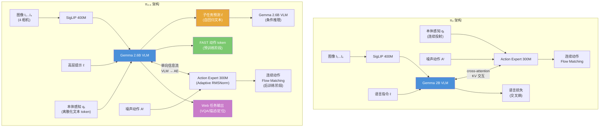
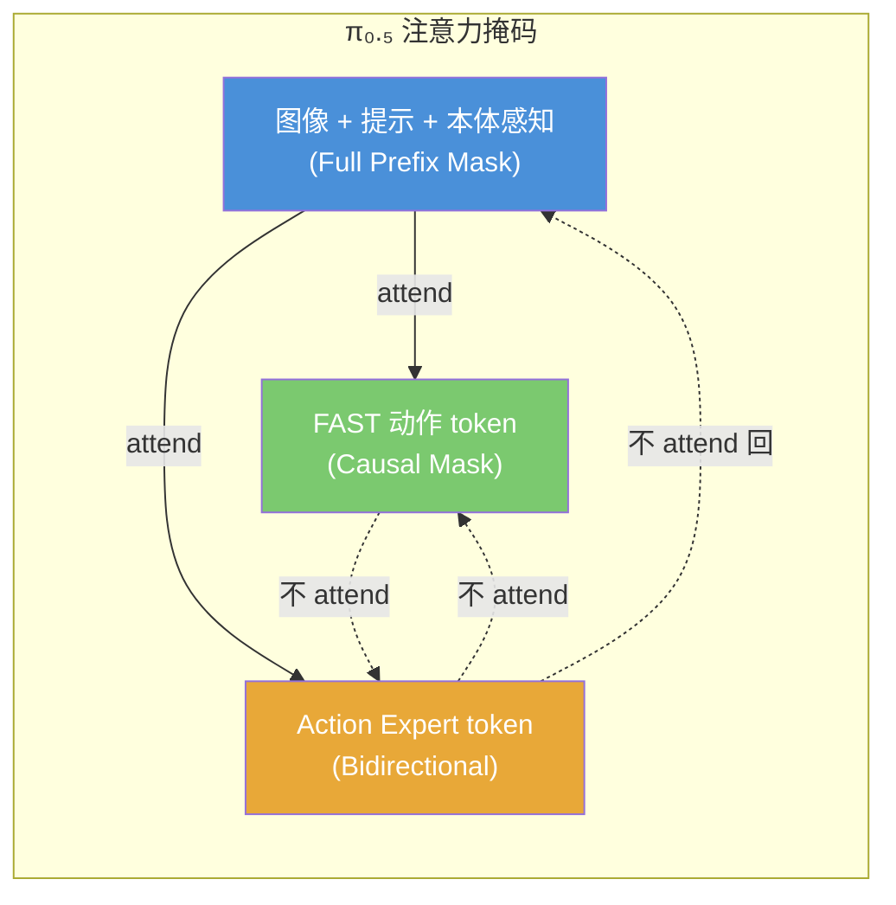
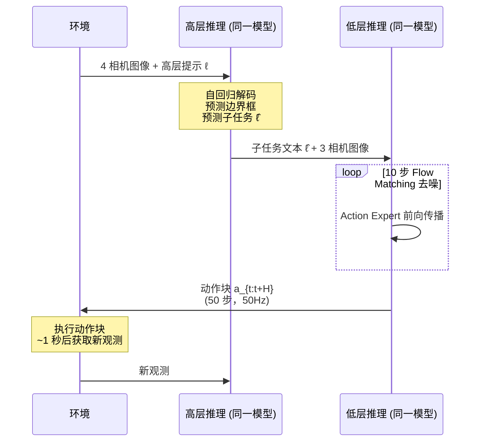
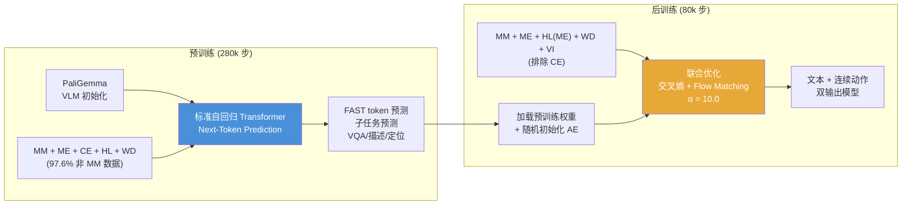

# 第七章：$\pi_{0.5}$ — 面向开放世界泛化的视觉-语言-动作模型

> **本章定位**：$\pi_{0.5}$ 是 Physical Intelligence (PI) 系列论文中的一次质变——它标志着 VLA 模型从"实验室专家"迈向"开放世界通才"的关键一步。如果说 $\pi_0$（第四章）解决了"如何构建一个高精度的通用机器人基础模型"，FAST（第五章）解决了"如何高效地离散化动作以加速训练"，Hi Robot（第六章）解决了"如何让机器人理解复杂的开放式指令"，那么 $\pi_{0.5}$ 的核心命题是：**如何让同一个模型在从未见过的真实家庭中执行持续 10-15 分钟的复杂灵巧操作任务**。$\pi_{0.5}$ 的解决方案是一套系统性的异构数据联合训练（co-training）方案，融合了五大类数据源和层级式推理架构，首次证明端到端学习的机器人系统可以在完全陌生的环境中完成清洁厨房、整理卧室等长时域多阶段任务。本章将在前作比较框架下对 $\pi_{0.5}$ 进行全面深入的技术分析。

---

## 论文信息

| 项目 | 内容 |
|------|------|
| **论文标题** | $\pi_{0.5}$: A Vision-Language-Action Model with Open-World Generalization |
| **发表时间** | 2025年4月22日 |
| **arXiv** | [2504.16054](https://arxiv.org/abs/2504.16054) |
| **会议** | CoRL 2025 |
| **机构** | Physical Intelligence, San Francisco, California, USA |
| **核心作者** | Kevin Black, Noah Brown, Danny Driess, Chelsea Finn, Karol Hausman, Brian Ichter, Sergey Levine, Karl Pertsch, Allen Z. Ren, Lucy Xiaoyang Shi, Jost Tobias Springenberg 等 34 人 |
| **模型参数** | ~3.3B（PaliGemma VLM 骨干 ~3B + Action Expert 300M） |
| **核心贡献** | 首个在完全未见的真实家庭中完成长时域灵巧操作的端到端 VLA 系统 |

**作者传承关系**：$\pi_{0.5}$ 的核心团队高度延续了 $\pi_0$ 的人员配置。Kevin Black、Danny Driess、Karl Pertsch 继续担任核心技术负责人，Chelsea Finn 和 Sergey Levine 继续担任资深作者。值得注意的新增作者包括 Allen Z. Ren（负责标注与辅助数据）、Lucy Xiaoyang Shi（同时是 Hi Robot 第一作者，将层级推理的经验带入 $\pi_{0.5}$）、以及 Jost Tobias Springenberg（负责策略训练研究）。Hi Robot 团队的合流是 $\pi_{0.5}$ 能够将层级推理从外部双模型系统（Hi Robot）内化为单一模型统一推理的关键人员基础。

---

## 1. 解决了什么问题 & 相对前作的定位

### 1.1 核心问题：开放世界泛化的多层次挑战

当移动操作机器人被要求清洁一个从未见过的厨房时，它面临三个层次的泛化挑战：

| 泛化层次 | 具体挑战 | 需要的知识来源 | $\pi_0$ 能否解决 |
|----------|----------|----------------|-----------------|
| **底层操作泛化** | 抓取新物体、适应新桌面高度 | 大规模机器人操作数据 | 部分可以（受限于训练环境） |
| **中层行为泛化** | 将已有技能灵活组合为新任务序列 | 任务分解经验、子任务标注 | 不能（无高层推理机制） |
| **高层语义泛化** | 理解场景语义、判断哪个物体是沥水架 | 互联网视觉-语言知识 | 严重退化（VLM 知识被动作训练侵蚀） |

$\pi_0$ 的根本限制在于：它虽然通过 10,000+ 小时的跨具身预训练获得了强大的底层操作能力，但**在训练数据分布之外的环境中表现急剧下降**。更关键的是，$\pi_0$ 使用了外部独立 VLM 作为高层策略来处理需要语义推理的复杂任务（如 table bussing），这意味着高层推理能力并未内化到模型本身。

### 1.2 为什么仅靠扩大机器人数据不够

一个直观的解决思路是：收集更多环境中的机器人数据。但 $\pi_{0.5}$ 论文提出了深刻的反驳——对于复杂的长时域任务（如清洁整个厨房），通过暴力扩大数据采集来覆盖所有可能场景在经济上和物理上都不可行。这与 NLP 领域的经验形成鲜明对比：GPT-3 的成功并非依赖于覆盖所有可能的对话场景，而是通过互联网规模的文本预训练获得了**通用的语言知识**，然后通过指令微调将其适配到特定任务。

$\pi_{0.5}$ 的核心洞察是：**机器人策略也需要从多种异构知识来源中汲取泛化能力，而非仅依赖同类机器人数据的线性扩展**。

### 1.3 相对前作的精确定位

$\pi_{0.5}$ 在 PI 技术栈中的定位可以通过以下对比来理解：

| 维度 | $\pi_0$ (Ch4) | FAST (Ch5) | Hi Robot (Ch6) | $\pi_{0.5}$ (Ch7) |
|------|--------------|------------|----------------|-------------------|
| **核心目标** | 通用机器人基础模型 | 高效动作 tokenization | 开放式指令跟随 | 开放世界泛化 |
| **泛化范围** | 训练环境内多任务 | 与 $\pi_0$ 相同 | 新指令，非新环境 | 完全未见的新环境 |
| **层级推理** | 外部 VLM 高层策略 | 无 | 独立双模型层级 | 单模型统一层级 |
| **训练数据** | 10K+ 小时机器人数据 | 同 $\pi_0$ 数据 | 合成语言 + 机器人 | 机器人 + Web + HL + VI |
| **动作表示** | 纯 flow matching | 纯 FAST 离散 token | flow matching | FAST 预训练 + flow 后训练 |
| **推理时间** | 73-86ms | ~750ms | 73ms + 高层 | 高层推理 + 10 步去噪 |

**关键演进**：$\pi_{0.5}$ 综合了前三项工作的核心成果——$\pi_0$ 的双流架构和 flow matching 动作生成、FAST 的高效离散 token 预训练、Hi Robot 的层级推理理念——并通过系统性的异构数据联合训练方案将它们统一在单一模型中。

---

## 2. 创新点

### 创新点枚举与重要性评估

| 编号 | 创新点 | 重要性等级 | 说明 |
|------|--------|-----------|------|
| I-1 | 异构数据联合训练 (Co-training) 方案 | **变革性** | 五大类数据源的系统性融合，97.6% 非目标数据驱动泛化 |
| I-2 | 单模型统一层级推理 | **变革性** | 同一模型同时执行高层子任务预测和低层动作生成 |
| I-3 | FAST 预训练 + Flow Matching 后训练 | **重大** | 结合两种动作表示的最佳特性 |
| I-4 | 本体感知状态离散化输入 | **重大** | 将关节位置作为文本 token 输入，统一序列格式 |
| I-5 | 口头指令 (Verbal Instruction) 数据 | **重大** | 高质量的人类"语言遥操作"示范 |
| I-6 | 高层子任务数据 (HL) 与边界框联合预测 | **显著** | chain-of-thought 式推理与视觉定位的结合 |
| I-7 | 网络数据联合训练维持 VLM 能力 | **显著** | 防止动作训练侵蚀视觉-语言知识 |
| I-8 | Adaptive RMSNorm 时间步注入 | **显著** | 改进 $\pi_0$ 的直接融合方式 |

### 创新点 I-1：异构数据联合训练方案（变革性）

$\pi_{0.5}$ 的最核心贡献并非模型架构的革新，而是**训练方案（training recipe）的系统性设计**。论文的关键发现是：通过精心构建的异构数据混合，即使目标平台（移动操作机器人）的数据仅占预训练总量的 2.4%，模型也能在该平台上展现出前所未有的泛化能力。

五大数据源的功能分工如下：

```
MM (移动操作器, 400h, ~2.4%)  → 目标任务直接相关经验
ME (多环境非移动机器人)       → 环境多样性（更多家庭场景）
CE (跨构型实验室数据 + OXE)    → 任务多样性（更多操作技能）
HL (高层子任务预测)           → 推理结构（chain-of-thought）
WD (网络数据: 描述/VQA/定位)   → 语义知识（物体识别/场景理解）
```

这种设计的深层逻辑是：不同数据源在不同抽象层次上贡献泛化能力。底层操作泛化主要依赖 ME 和 CE 的多样化机器人数据，中层行为泛化依赖 HL 的任务分解结构，高层语义泛化依赖 WD 的互联网知识。这种"分层知识注入"的思路与 NLP 中的多任务预训练（如 T5 的 text-to-text 范式）有深刻的类比关系。

### 创新点 I-2：单模型统一层级推理（变革性）

Hi Robot（第六章）已经证明了层级推理对复杂任务的重要性，但其方案依赖**两个独立的 VLM 模型**——一个负责高层推理（输出子任务文本），另一个负责低层执行（输出连续动作）。这种双模型设计存在两个根本问题：(1) 两个模型之间仅通过语言接口连接，无法共享内部表征；(2) 部署复杂度翻倍，推理延迟增加。

$\pi_{0.5}$ 将高层和低层推理统一在**同一个模型**中，通过概率分布的分解来实现：

$$\pi_\theta(a_{t:t+H}, \hat{\ell} | o_t, \ell) = \underbrace{\pi_\theta(\hat{\ell} | o_t, \ell)}_{\text{高层推理}} \cdot \underbrace{\pi_\theta(a_{t:t+H} | o_t, \hat{\ell})}_{\text{低层执行}}$$

其中 $o_t = [I_t^1, ..., I_t^n, q_t]$ 是多相机图像和本体感知状态，$\ell$ 是高层任务提示（如"清洁厨房"），$\hat{\ell}$ 是模型自主预测的子任务文本（如"拿起盘子"），$a_{t:t+H}$ 是动作块。关键设计是：**动作分布不直接依赖高层提示 $\ell$，而仅依赖子任务预测 $\hat{\ell}$**。这迫使模型必须通过显式的语言中间表示来传递任务意图，类似于 chain-of-thought 推理。

与 Hi Robot 的对比：

| 设计维度 | Hi Robot (Ch6) | $\pi_{0.5}$ (Ch7) |
|----------|---------------|-------------------|
| 模型数量 | 2 个独立 VLM | 1 个统一模型 |
| 表征共享 | 仅通过语言接口 | 共享所有内部表征 |
| 高层训练数据 | 合成数据（VLM 反向生成） | HL 标注 + VI 口头指令 |
| 低层动作表示 | flow matching | FAST 预训练 + flow matching |
| 推理频率 | 高层 1Hz / 低层 10-50Hz | 高层 ~1Hz / 低层 50Hz |

### 创新点 I-3：FAST 预训练 + Flow Matching 后训练（重大）

$\pi_{0.5}$ 在动作表示上做出了一项优雅的工程创新：**预训练阶段使用 FAST 离散 token，后训练阶段切换到 flow matching 连续动作**。这一设计直接来源于 FAST 论文（第五章）的核心发现——FAST token 使自回归训练速度提升数倍，但推理时的自回归解码较慢（~750ms vs flow matching 的 ~100ms）。

具体实现：

- **预训练（280k 步，$\alpha = 0$）**：模型作为标准自回归 transformer 训练，动作通过 FAST tokenizer 编码为离散 token，与文本 token 统一在 next-token prediction 目标下。此阶段不启用 Action Expert。
- **后训练（80k 步，$\alpha = 10.0$）**：引入随机初始化的 Action Expert，联合优化交叉熵和 flow matching 损失。此阶段保留 FAST token 预测（交叉熵分支），同时新增连续动作预测（flow matching 分支）。

联合损失函数为：

$$\mathcal{L} = \mathbb{E}_{D, \tau, \omega} \left[ \mathcal{H}(x_{1:M}, f_\theta^\ell(o_t, \ell)) + \alpha \left\| \omega - a_{t:t+H} - f_\theta^a(a_{t:t+H}^{\tau, \omega}, o_t, \ell) \right\|^2 \right]$$

其中 $\mathcal{H}$ 是交叉熵损失（作用于文本 token 和 FAST 动作 token），$f_\theta^a$ 是 Action Expert 的输出，$a_{t:t+H}^{\tau, \omega} = \tau a_{t:t+H} + (1-\tau)\omega$ 是 flow matching 的噪声插值，$\omega \sim \mathcal{N}(0, I)$。注意力掩码确保 FAST token 和连续动作 token 互不 attend，避免信息泄漏。

推理时只使用 flow matching 分支：先自回归解码子任务文本 $\hat{\ell}$，再通过 10 步去噪生成连续动作 $a_{t:t+H}$。

---

## 3. 数据来源、处理方式及其原因

### 3.1 五大数据源全景

$\pi_{0.5}$ 的训练数据组成是其泛化能力的基石。以下是各数据源的详细分析：

| 数据源 | 类型 | 规模 | 预训练占比 | 后训练使用 | 核心贡献 |
|--------|------|------|-----------|-----------|----------|
| **MM** (移动操作器) | 机器人动作 | ~400 小时，~100 个家庭 | ~2.4% | 是 | 目标平台直接经验 |
| **ME** (多环境非移动) | 机器人动作 | 多种家庭环境 | 是 | 是 | 环境多样性迁移 |
| **CE** (跨构型实验室) | 机器人动作 | 含 OXE 数据集 | 是 | 否 | 任务多样性迁移 |
| **HL** (高层子任务) | 文本标注 | 对 MM/ME/CE 的标注 | 是 | 部分（ME 对应） | 推理结构与任务分解 |
| **WD** (网络数据) | 视觉-语言 | CapsFusion/COCO/VQA 等 | 是 | 是 | 语义知识维持 |
| **VI** (口头指令) | 语言示范 | 占 HL 数据 ~11% | 否 | 是 | 高质量高层策略示范 |

### 3.2 数据源设计的深层逻辑

**MM 数据的"少数精锐"策略**：令人瞩目的事实是，在预训练阶段，移动操作器的直接相关数据仅占总样本量的 2.4%。论文的实验证明，即使如此小的占比，只要配合其他数据源的协同训练，模型仍能在移动操作任务上展现强大的泛化能力。这与传统机器学习中"训练数据必须与测试数据高度一致"的直觉形成鲜明对比。

**ME 数据的环境多样性杠杆**：非移动机器人（固定式单臂/双臂）的核心优势在于**部署成本极低**——它们重量轻、易运输，可以快速部署到大量不同家庭中。虽然这些数据来自与目标平台不同的构型，但它们提供了 $\pi_{0.5}$ 在环境理解层面最重要的多样性。消融实验证实移除 ME 数据导致性能显著下降。

**CE 数据的任务多样性杠杆**：实验室跨构型数据（包含 OXE 开源数据集）提供了广泛的操作技能覆盖——从收桌到叠衣的数十种任务。虽然这些数据的环境多样性有限（主要在实验室），但其丰富的任务类型帮助模型建立了**通用的操作技能库**。

**HL 数据的结构化推理注入**：高层子任务预测数据的设计极具匠心。对于 MM/ME/CE 中涉及多步骤的任务，人工标注员将其分解为语义子任务序列（如"清洁卧室" $\rightarrow$ ["调整毯子", "拾起枕头", "放入衣篮"]），同时标注相关物体的边界框。模型被训练为**先预测边界框、再预测子任务标签、最后生成动作**，这种级联结构自然地将 chain-of-thought 推理嵌入到策略中。

**WD 数据的 VLM 知识维持**：网络数据的功能并非直接提升机器人操作能力，而是**防止动作训练过程中 VLM 语义知识的退化**。这一设计直接预示了后续 Knowledge Insulation 论文（第八章）中对"知识遗忘"问题的系统性研究。消融实验表明，WD 对整体任务性能的影响在统计上不显著，但对**分布外物体的语言跟随能力**和**高层子任务推理质量**有显著贡献。

**VI 数据的高质量示范杠杆**：口头指令数据是 $\pi_{0.5}$ 最具创新性的数据类型之一。收集方式为：专家用户通过自然语言**实时"遥操作"**机器人——他们不直接控制关节，而是逐步下达子任务命令（如"拿起盘子"、"放入水槽"），由已训练的低层策略执行。这种"语言遥操作"方式极其高效，能快速生成大量高质量的高层策略示范。虽然 VI 仅占高层移动操作样本的约 11%，但消融实验显示移除它导致性能**不成比例地大幅下降**。

### 3.3 数据处理标准化

所有动作数据采用统一的预处理流水线：

- **归一化**：使用各维度 1%/99% 分位数映射到 $[-1, 1]$，对异常值保持鲁棒
- **动作空间统一**：将动作维度零填充至固定最大值，适配不同机器人构型
- **控制模式标注**：在文本提示中添加 `<control mode> joint/end effector <control mode>` 标记，区分关节空间和末端执行器空间控制
- **本体感知离散化**：机器人关节角度、夹爪姿态、底盘速度等本体感知状态被离散化为文本 token 输入模型

### 3.4 与 $\pi_0$ 数据规模对比

| 数据维度 | $\pi_0$ (Ch4) | $\pi_{0.5}$ (Ch7) | 变化 |
|----------|--------------|-------------------|------|
| 核心机器人数据 | 10,000+ 小时，7 种机器人 | MM 400h + ME + CE (扩展 OXE) | 机器人数据是 $\pi_0$ 的超集 |
| 非机器人数据 | 无 | WD (大量网络视觉-语言数据) | 全新数据类型 |
| 高层标注 | 段落级标注（~2 秒粒度） | HL（语义子任务 + 边界框） | 结构化程度大幅提升 |
| 环境覆盖 | 实验室为主 | ~100 个家庭 + 实验室 | 环境多样性数量级提升 |
| 训练环境数量 | 未明确 | 104 个不同地点 | 首次系统性覆盖 |

---

## 4. 模型结构及设计原因

### 4.1 架构概览

$\pi_{0.5}$ 在 $\pi_0$ 的双流架构基础上进行了针对性的扩展和修改。核心参数保持一致：

| 组件 | 参数 | 说明 |
|------|------|------|
| **VLM 骨干** | ~3B (PaliGemma) | width=2048, depth=18, mlp_dim=16384, num_heads=18, num_kv_heads=1, head_dim=256 |
| **视觉编码器** | SigLIP 400M | 224$\times$224 图像输入 |
| **语言模型** | Gemma 2.6B | 初始化自 PaliGemma 预训练权重 |
| **Action Expert** | 300M | width=1024, mlp_dim=4096，相同深度 |
| **动作维度** | $d = 18\text{-}19$ | 双臂 + 底盘 + 升降 + 夹爪 |
| **动作块长度** | $H = 50$ 步 (49 + 当前帧) | 50Hz 控制频率下对应 1 秒 |

### 4.2 $\pi_{0.5}$ vs $\pi_0$ 架构对比



### 4.3 关键架构差异详解

**差异一：本体感知状态的表示方式**

| 设计选择 | $\pi_0$ | $\pi_{0.5}$ |
|----------|---------|-------------|
| 表示方式 | 连续值线性投射到嵌入空间 | 离散化为文本 token |
| 处理路径 | 经 Action Expert 处理 | 经 VLM 骨干处理 |
| 设计动机 | 保持连续精度 | 统一序列格式，兼容纯自回归预训练 |

$\pi_{0.5}$ 将本体感知状态离散化为文本 token 的设计是为了在预训练阶段（$\alpha = 0$，无 Action Expert）也能处理机器人状态输入。这使得预训练可以作为纯粹的自回归 transformer 训练，简化了训练流程。

**差异二：Flow Matching 时间步注入方式**

$\pi_0$ 将 flow matching 时间步 $\tau$ 直接与噪声动作融合后输入 transformer。$\pi_{0.5}$ 改用**Adaptive RMSNorm** 机制：

$$\text{MLP}(\tau): \text{swish}(W_2 \cdot \text{swish}(W_1 \cdot \phi(\tau)))$$

其中 $\phi: \mathbb{R} \rightarrow \mathbb{R}^w$ 是正弦位置编码函数，$W_1, W_2 \in \mathbb{R}^{w \times w}$。MLP 的输出用于调制 Action Expert 每层的 RMSNorm 参数。这种设计借鉴了扩散模型中 AdaLN（Adaptive Layer Normalization）的成功经验，使时间步信息能更精细地影响每层的特征变换。

**差异三：注意力掩码结构**

$\pi_{0.5}$ 的注意力掩码比 $\pi_0$ 的三段式设计更为精细：



关键约束：(1) FAST 动作 token 和 Action Expert token **互不 attend**，防止两种动作表示之间的信息泄漏；(2) 信息**单向流动**从 VLM 到 Action Expert——VLM 骨干的 embedding 不 attend Action Expert 的输出。这确保了 VLM 的语义表征不被动作训练信号污染，是 Knowledge Insulation（第八章）理念的早期体现。

### 4.4 推理流程

$\pi_{0.5}$ 的推理过程分为两步：



值得注意的技术细节：
- 高层推理使用全部 4 个相机（前方、后方、双腕），低层推理仅使用 3 个（前方、双腕）
- 高层推理在每个动作块执行完后触发，频率约 1Hz
- 低层推理的 10 步 flow matching 去噪中，VLM 骨干的 KV 可缓存，仅需重复计算 Action Expert

---

## 5. 训练方法（算法与工程）

### 5.1 两阶段训练流水线



### 5.2 预训练阶段：纯离散 token 训练

预训练阶段的核心设计原则是**将所有模态统一为离散 token 序列**：

- **图像**：SigLIP 编码为视觉 token
- **文本**：标准 Gemma tokenizer
- **本体感知**：离散化为文本 token
- **动作**：FAST tokenizer 编码为离散 token
- **子任务**：自然语言文本 token
- **边界框**：位置编码为 `<loc0405><loc0011>...` 格式的特殊 token

这种设计使预训练等价于训练一个标准的**多模态自回归语言模型**，无需任何特殊的损失函数或架构修改（$\alpha = 0$），训练过程高度稳定。FAST 论文（第五章）已经证明，使用 FAST token 的训练速度比 flow matching 快约 5 倍，这使得大规模预训练在计算上可行。

预训练的数据混合策略值得特别关注：97.6% 的样本来自非移动操作数据。论文的实验证明，这种"重度不平衡"的数据混合并不会损害目标任务性能，反而是泛化能力的关键来源。

### 5.3 后训练阶段：引入 Flow Matching

后训练阶段实现三个目标：

1. **引入 Action Expert**：随机初始化 300M 参数的 Action Expert，通过 flow matching 损失训练其生成连续动作
2. **专化到目标平台**：将数据范围收窄至 MM + ME（成功 episode，长度低于阈值），排除 CE 以聚焦移动操作
3. **增强高层策略**：新增 VI 数据，提供高质量的高层子任务示范

后训练的损失函数（公式 1 重述）：

$$\mathcal{L} = \mathbb{E}_{D, \tau, \omega} \left[ \mathcal{H}(x_{1:M}, f_\theta^\ell(o_t, \ell)) + 10.0 \cdot \left\| (\omega - a_{t:t+H}) - f_\theta^a(a_{t:t+H}^{\tau, \omega}, o_t, \ell) \right\|^2 \right]$$

其中 $\alpha = 10.0$ 的选择反映了动作预测相对于文本预测的更高权重，这与 $\pi_0$ 的设计一致。

### 5.4 与 $\pi_0$ 训练范式的比较

| 训练维度 | $\pi_0$ (Ch4) | $\pi_{0.5}$ (Ch7) |
|----------|--------------|-------------------|
| **预训练目标** | 交叉熵 + flow matching 联合 | 纯交叉熵（FAST token） |
| **预训练步数** | 700k | 280k |
| **后训练步数** | 任务特定（变化） | 80k |
| **Action Expert 引入** | 预训练开始即存在 | 后训练开始才引入 |
| **动作表示** | 始终 flow matching | 预训练 FAST → 后训练 flow matching |
| **数据类型** | 纯机器人数据 | 机器人 + Web + HL + VI |
| **训练稳定性** | 需要平衡两种损失 | 预训练完全稳定（纯 LM） |

$\pi_{0.5}$ 的两阶段设计在工程上比 $\pi_0$ 更优雅：预训练作为纯语言模型训练，完全避免了 flow matching 损失可能带来的训练不稳定性。Action Expert 仅在后训练阶段引入，此时模型已经具备了强大的视觉-语言理解能力和初步的动作预测能力（通过 FAST token），Action Expert 的训练可以在此基础上快速收敛。

### 5.5 工程细节

- **图像增强**：随机裁剪（95%）$\rightarrow$ 缩放至 224$\times$224 $\rightarrow$ 旋转（$\pm$5 度）$\rightarrow$ 颜色抖动（亮度 0.3、对比度 0.4、饱和度 0.5）
- **Flow matching 时间步采样**：Beta 分布 $p(\tau) = \text{Beta}(\frac{s-\tau}{s}; \alpha=1.5, \beta=1)$，截断阈值 $s = 0.999$，偏向低时间步（高噪声），与 $\pi_0$ 一致
- **控制频率**：50Hz，action chunk 50 步对应 1 秒
- **机器人平台**：两种移动操作器，双 6-DoF 手臂 + 平行夹爪 + 全向底盘 + 升降机构，共 18-19 DoF
- **推理**：高层使用 4 相机，低层使用 3 相机（前方 + 双腕），10 步 flow matching 去噪

---

## 6. 实验关键发现与效果对比

### 6.1 开放世界泛化能力（问题 1）

$\pi_{0.5}$ 在 3 个从未见过的真实家庭中进行了厨房和卧室清洁任务的评估。每个任务持续 2-5 分钟，涉及多个阶段的灵巧操作。这是**端到端学习的机器人系统首次在完全陌生的真实家庭中完成此类复杂任务**。

关键结果：
- 在 mock 环境中的表现与真实家庭一致，验证了评估方法的可靠性
- 模型能自主预测恰当的子任务序列（如"拿起盘子" $\rightarrow$ "放入水槽"）
- 支持多种复杂操作：挂毛巾、整理床铺、将衣物放入洗衣篮

### 6.2 环境数量的 Scaling 规律（问题 2）

论文通过系统性地变化训练环境数量（3、12、22、53、82、104 个地点）揭示了环境泛化的 scaling 行为：

| 训练环境数 | 整体任务表现 | 语言跟随率（分布内） | 语言跟随率（分布外） |
|-----------|-------------|--------------------|--------------------|
| 3 | 低 | 低 | 极低 |
| 12 | 中低 | 中 | 低 |
| 53 | 中高 | 中高 | 中 |
| 104 | 高 | 高 | 中高 |
| 104 + 含测试环境（对照） | 高 | - | - |

**核心发现**：使用 104 个训练环境的模型（不含测试环境）达到了与在测试环境上直接训练的对照模型**相当的性能**，说明 co-training recipe 有效弥合了泛化差距。更进一步，去除 co-training recipe 而仅在 104 个环境上直接训练的基线，其性能**显著低于**完整方案，即使该基线包含了测试环境数据，也远不如完整 $\pi_{0.5}$。这有力地证明了异构数据联合训练对泛化的本质性贡献。

### 6.3 与 $\pi_0$ 的直接对比（问题 4）

论文设计了三个模型进行比较：

| 模型 | 训练方式 | 高层/低层推理 |
|------|----------|-------------|
| **$\pi_0$** | 纯 flow matching，仅机器人数据 | 无高层 |
| **$\pi_0$-FAST+Flow** | FAST 预训练 + flow 后训练，仅机器人数据 | 无高层 |
| **$\pi_{0.5}$** | FAST 预训练 + flow 后训练，完整 co-training | 有高层 |

所有模型使用相同的跨构型机器人训练集，训练步数可比。$\pi_{0.5}$ **显著优于**两个基线。即使将 $\pi_0$ 训练延长到 300k 步也无法追平，这进一步验证了 FAST 论文（第五章）的发现：FAST token 预训练在计算效率上显著优于纯 flow matching 训练。

语言跟随能力的对比更加明显：

| 模型 | 语言跟随率（分布内） | 语言跟随率（分布外） |
|------|--------------------|--------------------|
| $\pi_0$ | 最低 | 最低 |
| $\pi_0$-FAST+Flow | 中等 | 中等 |
| $\pi_{0.5}$ | 最高 | 最高 |

$\pi_0$ 的语言跟随率大幅落后于 $\pi_{0.5}$，证明了**离散 token 训练对语言跟随能力的重要性**——纯 flow matching 训练中，VLM 骨干的语言能力可能被持续的动作损失信号侵蚀。

### 6.4 高层推理的重要性（问题 5）

论文设计了 7 种高层推理变体进行比较：

| 变体 | 描述 | 相对表现 |
|------|------|----------|
| **$\pi_{0.5}$ (完整)** | 模型自主高层 + 低层推理 | **最佳** |
| implicit HL | 训练含 HL 数据，但推理不执行高层 | 第二 |
| human HL | 人类专家提供子任务 | 第三（低于完整模型） |
| no WD | 去除网络数据 | 显著退化 |
| no VI | 去除口头指令数据 | 显著退化 |
| no HL | 完全去除高层数据 | 大幅退化 |
| GPT-4 | 零样本 GPT-4 作为高层策略 | **最差** |

**最令人惊讶的发现**：$\pi_{0.5}$ 的自主高层推理**超过了人类专家 oracle**。这表明模型不仅学会了如何分解任务，还学会了**为低层策略量身定制最优的子任务指令**——它比人类专家更了解自己擅长执行什么样的指令。

**第二个重要发现**：implicit HL（训练含高层数据但推理不执行高层推理）是第二好的变体。这强烈表明 co-training recipe 本身已将大量子任务结构知识**内化**到模型中，即使不显式执行 chain-of-thought 推理，模型也能隐式地利用这些知识。

**GPT-4 的失败**：零样本 GPT-4 作为高层策略表现最差。这与 Hi Robot（第六章）的发现一致——通用大语言模型缺乏物理接地和机器人特定知识，即使参数量远大于 PaliGemma 3B，也无法有效指导机器人执行。GPT-4o 在 Hi Robot 中的指令准确率比微调的 PaliGemma 低 40% 以上，$\pi_{0.5}$ 的实验进一步证实了这一结论。

---

## 7. 消融实验的发现

### 7.1 消融实验总览

$\pi_{0.5}$ 的消融实验围绕两个核心问题展开：(1) 各数据源对泛化的贡献有多大？(2) 各推理组件对性能的影响如何？以下按影响大小排序：

### 7.2 按影响排序的消融发现

| 排名 | 消融变体 | 影响程度 | 影响范围 | 核心洞察 |
|------|----------|----------|----------|----------|
| 1 | no ME or CE | **最大** | 整体性能大幅下降 | 跨构型数据迁移是泛化基石 |
| 2 | no HL (训练+推理) | **很大** | 长时域任务严重退化 | 子任务结构知识不可或缺 |
| 3 | no VI | **大** | 高层策略质量骤降 | 11% 数据的不成比例影响 |
| 4 | no ME | **显著** | 环境泛化退化 | 环境多样性的不可替代性 |
| 5 | no CE | **显著** | 技能泛化退化 | 任务多样性的不可替代性 |
| 6 | no WD (高层) | **显著** | 高层推理和 OOD 物体退化 | 网络数据的语义知识贡献 |
| 7 | no WD (整体) | **不显著** | 整体任务统计不显著 | 网络数据的作用是间接的 |

### 7.3 跨构型数据迁移的深度分析

消融实验中最引人注目的发现是**跨构型数据的巨大迁移价值**。移除 ME（多环境非移动数据）或 CE（实验室跨构型数据）均导致性能显著下降，同时移除两者则伤害更大。

这一发现的深层含义是：**不同构型的机器人在共享的视觉-语言-动作表征空间中具有可迁移的知识结构**。即使固定式单臂机器人与移动双臂操作器在动作空间上完全不同，它们在"如何识别物体"、"如何理解场景布局"、"如何规划操作序列"等更高层次上共享大量知识。$\pi_{0.5}$ 的统一动作空间设计（零填充至最大维度）和 VLM 骨干的跨模态融合能力，使得这种高层知识迁移成为可能。

这与 $\pi_0$（第四章）的跨具身预训练形成了有趣的对比：$\pi_0$ 已经证明了跨具身预训练对泛化的价值，但其评估仍在训练环境分布内进行。$\pi_{0.5}$ 的消融实验进一步证明，跨构型数据在**分布外环境泛化**中同样不可或缺——甚至比目标平台自身的数据更重要。

### 7.4 网络数据的差异化影响

WD（网络数据）的消融结果呈现出有趣的"任务依赖"模式：

- **整体任务评估**：移除 WD 的影响在统计上**不显著**
- **分布外物体语言跟随**：移除 WD 导致 OOD 物体性能**显著恶化**
- **高层推理评估**：移除 WD 导致子任务预测质量**显著退化**

这种差异化影响的解释是：网络数据的核心价值并非直接提升操作技能，而是**维持 VLM 的语义知识**，使模型能够 (1) 识别训练中未见过的物体类别；(2) 生成语义恰当的子任务描述。对于在训练分布内的物体和场景，这些知识已经被机器人数据覆盖，因此 WD 的边际价值较低；但对于分布外物体，WD 提供的广泛物体知识成为模型理解和操作这些物体的唯一来源。

### 7.5 逐任务消融分析

不同任务对数据源的敏感度呈现出清晰的模式：

| 任务 | 对 ME/CE 敏感度 | 对 WD 敏感度 | 对 HL 敏感度 | 解读 |
|------|----------------|-------------|-------------|------|
| Items in Drawer | **极高** | **高** | **高** | 需要广泛的物体识别 + 复杂多步骤序列 |
| Dishes in Sink | **高** | **低** | **中高** | 主要需要操作策略，物体类别相对固定 |
| Laundry Basket | **中** | **低** | **低** | 任务时程较短，语义推理需求较低 |
| Make Bed | **中** | **低** | **低** | 任务结构相对固定 |

Items in Drawer 任务对所有数据源都高度敏感，因为它需要：(1) 识别极其多样的家居物品（需要 WD 的语义知识），(2) 执行开抽屉-放物品-关抽屉的复杂序列（需要 HL 的结构知识），(3) 适应不同家庭中高度差异化的抽屉设计（需要 ME/CE 的环境/操作多样性）。

### 7.6 口头指令数据的杠杆效应

VI（口头指令）数据仅占高层移动操作样本的约 11%，但移除后性能显著下降。这种不成比例的影响可以从数据质量的角度解释：VI 数据是由**专家用户在真实执行场景中实时选择的子任务序列**，每个子任务命令都是经过人类判断后的最优选择。相比之下，HL 数据的子任务标注是事后对已有轨迹的回溯标注，其质量受限于标注员对任务执行策略的理解。VI 数据本质上提供了"理想高层策略"的在线示范，其信息密度远高于离线标注。

---

## 8. 优化有效性评估

### 8.1 各优化措施的效果排序

综合消融实验结果和性能对比数据，$\pi_{0.5}$ 中各优化措施的效果可以按以下顺序排列：

| 排名 | 优化措施 | 效果等级 | 证据 |
|------|----------|----------|------|
| 1 | **异构数据联合训练方案** | 变革性 | 104 环境 co-training $\approx$ 含测试环境直接训练；无 co-training 即使含测试环境数据也远不及 |
| 2 | **单模型统一层级推理** | 变革性 | 完整模型超越人类 oracle 高层；GPT-4 高层最差 |
| 3 | **FAST 预训练 + Flow 后训练** | 重大 | $\pi_{0.5}$ 显著优于 $\pi_0$-FAST+Flow 和 $\pi_0$；$\pi_0$ 300k 步仍无法追平 |
| 4 | **跨构型数据迁移 (ME+CE)** | 重大 | 移除导致最大幅度性能下降 |
| 5 | **口头指令数据 (VI)** | 重大 | 11% 占比的不成比例杠杆效应 |
| 6 | **网络数据联合训练 (WD)** | 显著（条件性） | 对 OOD 物体和高层推理显著，对整体不显著 |
| 7 | **本体感知离散化** | 显著 | 统一序列格式，简化预训练 |
| 8 | **Adaptive RMSNorm** | 中等 | 改进时间步注入，但无独立消融 |

### 8.2 最重要的优化：异构数据联合训练

$\pi_{0.5}$ 最核心的贡献——也是效果最大的优化——是其训练方案而非架构创新。论文的实验数据反复证明一个核心论点：**在开放世界泛化问题上，数据组成的多样性比数据规模的绝对增长更重要**。

具体证据：
1. 仅 2.4% 的 MM 数据占比下，模型仍能在目标平台上强力泛化
2. 104 环境 + co-training 的完整方案 $\approx$ 含测试环境直接训练
3. 104 环境但无 co-training 的方案 $\ll$ 含测试环境直接训练
4. 跨构型数据（来自完全不同机器人的数据）对泛化的贡献超过增加更多同类数据

这一发现对机器人学习领域具有深远意义：它暗示了一条**非线性扩展路径**——不是简单地在更多环境中收集更多目标平台数据，而是通过精心构建异构数据混合来"撬动"更广泛的泛化能力。

### 8.3 VLM 知识保护的重要性

$\pi_{0.5}$ 中网络数据联合训练 + 单向注意力掩码的设计，本质上是在**保护 VLM 的预训练知识不被动作训练信号侵蚀**。这一理念将在 Knowledge Insulation 论文（第八章）中得到系统性的研究和形式化。$\pi_{0.5}$ 的消融实验已经提供了间接证据：

1. WD 对 OOD 物体识别至关重要 $\rightarrow$ 不联合训练 WD 会导致 VLM 的物体知识退化
2. 信息单向流动（VLM $\rightarrow$ AE）$\rightarrow$ 防止 flow matching 梯度影响 VLM 表征
3. 完整 $\pi_{0.5}$ 在语言跟随上远超 $\pi_0$ $\rightarrow$ FAST 预训练阶段的纯文本损失更好地保留了语言能力

---

## 9. 与后续工作的关联

### 9.1 Knowledge Insulation（第八章）

$\pi_{0.5}$ 中多项设计选择——WD 联合训练、单向注意力掩码、FAST 预训练阶段的纯文本损失——都是对"VLM 知识退化"问题的经验性应对。Knowledge Insulation 论文将这一问题提升为系统性的研究命题，提出了更彻底的梯度阻断机制：**显式阻止 Action Expert 的梯度回传到 VLM 骨干**。$\pi_{0.5}$ 的消融实验（WD 对 OOD 物体的重要性、$\pi_0$ 语言跟随能力的退化）为 Knowledge Insulation 的研究动机提供了直接的经验基础。

### 9.2 RECAP / $\pi_{0.6}$（第十章）

RECAP 在 $\pi_{0.5}$ 作为基础模型之上，进一步探索推理能力的增强。$\pi_{0.5}$ 的单模型统一层级推理为 RECAP 的"推理-行动"框架提供了架构基础，而 $\pi_{0.5}$ 中 implicit HL 消融（不执行高层推理但性能仍很好）的发现暗示了推理能力可以通过训练进一步内化，这正是 RECAP 探索的方向。

### 9.3 $\pi_{0.7}$（第十四章）

$\pi_{0.7}$ 在 $\pi_{0.5}$ 的基础上进一步发展了开放世界泛化的能力。$\pi_{0.5}$ 的环境 scaling 实验（3 $\rightarrow$ 104 个环境的单调递增曲线）表明泛化能力尚未饱和，为 $\pi_{0.7}$ 通过更大规模数据和更强模型继续推进提供了方向性指引。

### 9.4 商业部署（第十七章）

$\pi_{0.5}$ 在真实家庭中的成功部署是 PI 商业化路线图的关键里程碑。论文展示的 10-15 分钟长时域家务任务（清洁厨房、整理卧室）直接对应了家用机器人市场的核心场景。$\pi_{0.5}$ 证明的开放世界泛化能力——特别是在从未见过的家庭中开箱即用——是商业部署的必要前提。

### 9.5 对 Hi Robot 的架构超越

$\pi_{0.5}$ 与 Hi Robot（第六章）的关系值得特别讨论。两者都致力于解决复杂任务的层级推理问题，但采取了不同路径：

| 维度 | Hi Robot | $\pi_{0.5}$ |
|------|----------|-------------|
| 层级推理 | 外部双模型 | 内部单模型 |
| 训练耦合 | 高层与低层解耦训练 | 联合训练 |
| 泛化重点 | 新指令类型 | 新环境 |
| 数据策略 | 合成指令数据 | 异构实际数据混合 |

$\pi_{0.5}$ 对 Hi Robot 实现了"架构内化"——将 Hi Robot 的双模型层级设计内化为单模型的统一推理。Hi Robot 的实验表明低层策略在 Oracle 高层下几乎完美，说明瓶颈在推理层。$\pi_{0.5}$ 通过将推理内化到同一模型中，使得推理层和执行层可以通过共享表征相互增强，最终实现了超越人类 Oracle 高层的表现。这是 Hi Robot 双模型设计在原理上无法达到的成就。

---

## 总结：$\pi_{0.5}$ 的历史意义

$\pi_{0.5}$ 在 PI 技术发展谱系中标记了一个质变点。如果将 $\pi_0$ 比作 GPT-2/3（证明了大规模预训练模型的可行性），那么 $\pi_{0.5}$ 更接近于 GPT-3.5/4 的定位——它不仅仅是一个更大的模型，而是通过**系统性的训练方案创新**（异构数据联合训练、层级推理内化、FAST 预训练 + flow matching 后训练），实现了从"实验室专家"到"开放世界通才"的质变。

$\pi_{0.5}$ 的三个里程碑式成就：

1. **首次**证明端到端 VLA 可以在完全未见的真实家庭中执行长时域灵巧操作
2. **首次**通过单一模型同时实现高层语义推理和低层动作控制，且自主推理超越人类 oracle
3. **首次**系统性证明异构数据联合训练（97.6% 非目标数据）对开放世界泛化的变革性价值

然而，$\pi_{0.5}$ 并非没有局限。论文坦率地承认：部分环境仍存在持续性挑战（如不熟悉的抽屉把手），部分行为受制于部分可观测性（如手臂遮挡溢出液体），高层推理偶尔出现"分心"行为（如反复开关抽屉）。这些局限为后续工作——Knowledge Insulation 的知识保护、RECAP 的推理增强、$\pi_{0.7}$ 的规模扩展——提供了明确的改进方向。
