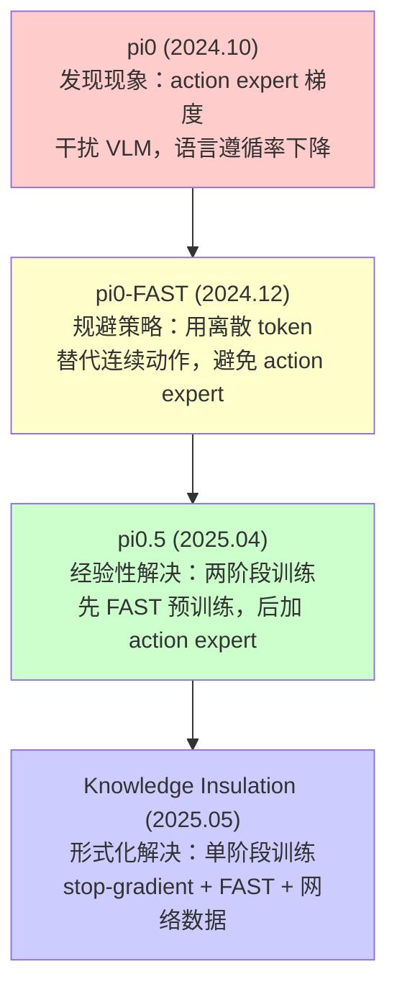
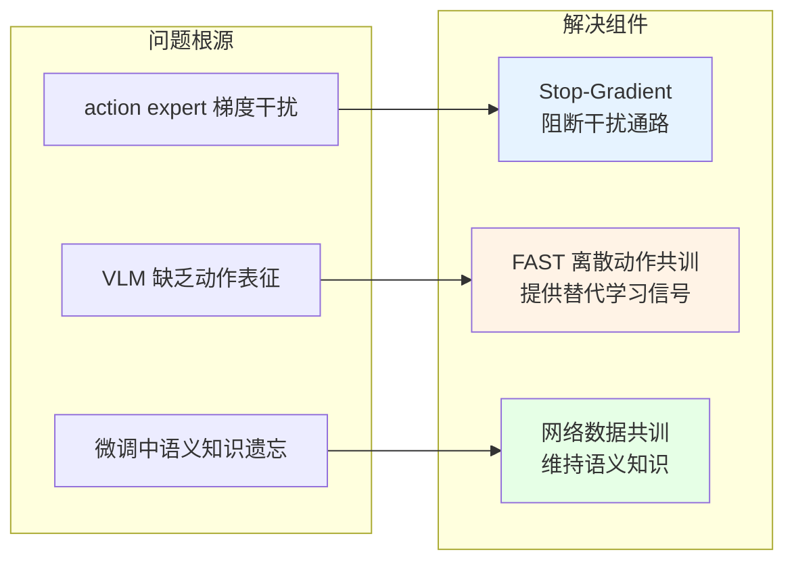
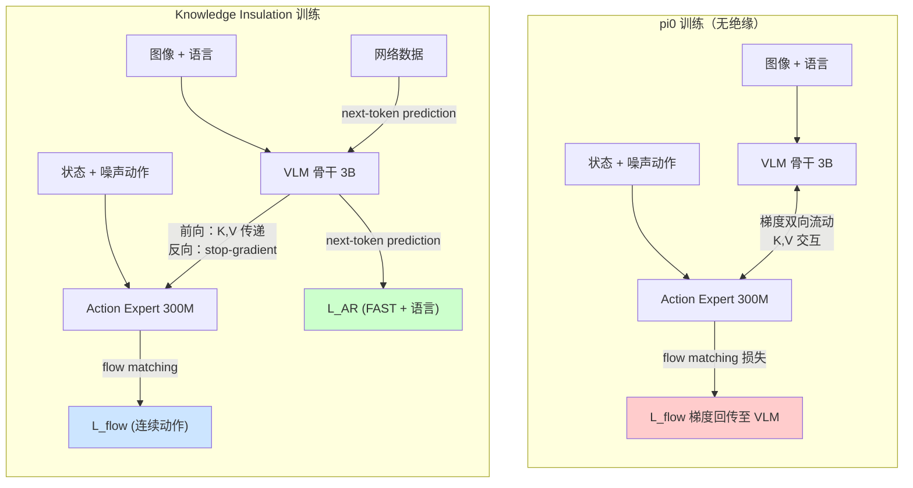
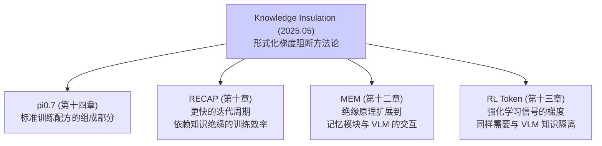

# 第八章：Knowledge Insulation — 知识绝缘：训练更快、推理更快、泛化更优

> **本章定位**：Knowledge Insulation（知识绝缘）是 Physical Intelligence 系列论文中一篇具有方法论范式意义的工作。它将 $\pi_{0.5}$（第七章）中经验性发现的梯度阻断技术形式化为一套完整的理论框架，系统性地回答了一个困扰整个 VLA 领域的根本性问题：**为什么将随机初始化的动作模块嫁接到预训练 VLM 上会破坏其知识，以及如何在不冻结 VLM 的前提下保护这些知识？** 本文提出的三位一体解决方案——梯度阻断 + FAST 离散动作共训 + 网络数据共训——不仅将训练速度提升了 7.5 倍（相对 $\pi_0$），还同时改善了性能和泛化能力，开创了"训练更少参数反而获得更好结果"的反直觉范式。本章将与 $\pi_0$（第四章）、$\pi_{0.5}$（第七章）以及 FAST（第五章）进行深入的横向比较与纵向溯源。

---

## 论文信息

| 项目 | 内容 |
|------|------|
| **论文标题** | Knowledge Insulating Vision-Language-Action Models: Train Fast, Run Fast, Generalize Better |
| **发表时间** | 2025年5月29日 |
| **收录** | NeurIPS 2025 (Spotlight) |
| **arXiv** | [2505.23705](https://arxiv.org/abs/2505.23705) |
| **机构** | Physical Intelligence |
| **核心作者** | Danny Driess, Jost Tobias Springenberg, Brian Ichter, Lili Yu, Adrian Li-Bell, Karl Pertsch, Allen Z. Ren, Homer Walke, Quan Vuong, Lucy Xiaoyang Shi, Sergey Levine |
| **模型架构** | PaliGemma VLM (3B) + Action Expert (300M)，与 $\pi_0$ 同构 |
| **核心贡献** | 首个系统性分析 VLA 知识退化机制并提出形式化解决方案的方法论工作 |

**作者传承关系**：第一作者 Danny Driess 同时是 PaLM-E (2023) 的第一作者和 $\pi_{0.5}$ 的核心贡献者，其从 PaLM-E 的多模态融合到 $\pi_{0.5}$ 的梯度阻断实践，再到本文的形式化理论，形成了完整的学术脉络。Karl Pertsch 是 FAST 分词器的第一作者，其在本文中负责将 FAST 离散动作 token 整合为表示学习目标——这一角色与其在 FAST 论文中的工作形成自然延续。Lili Yu 来自 Meta，是 Mixture-of-Transformers 和 LlamaFusion 的核心贡献者，其在多模态专家分离架构方面的深厚经验直接推动了本文中注意力掩码和梯度流设计的形式化。

---

## 1. 解决了什么问题 & 相对前作的定位

### 1.1 核心问题：VLA 中的知识退化困境

当预训练 VLM 被微调为 VLA 模型时，需要将随机初始化的新模块（如 action expert、扩散头）"嫁接"到已有骨干网络上。这一嫁接过程引发了一个根本性问题：

$$\underbrace{\nabla_{\theta_{\text{VLM}}} \mathcal{L}_{\text{flow}}(\theta_{\text{expert}}, \theta_{\text{VLM}})}_{\text{来自随机初始化模块的噪声梯度}} \rightarrow \text{破坏} \underbrace{\theta_{\text{VLM}}^{\text{pretrained}}}_{\text{互联网规模的语义知识}}$$

这一困境可归纳为三重矛盾：

| 矛盾维度 | 具体表现 | 前作中的体现 |
|----------|----------|------------|
| **知识保护 vs 能力适配** | 冻结 VLM 保护知识但性能为 0%；微调 VLM 获得能力但知识退化 | $\pi_0$ 的语言遵循率低下 |
| **训练速度 vs 动作精度** | 离散 token 训练快但推理慢（$\pi_0$-FAST: 750ms/chunk）；连续动作推理快但训练需 7.5x 步数 | $\pi_0$ vs $\pi_0$-FAST |
| **泛化能力 vs 控制频率** | 自回归 VLA 保持 VLM 知识但频率仅 1.3Hz；Action Expert 实现 10Hz 但泛化退化 | RT-2, OpenVLA vs $\pi_0$ |

### 1.2 问题在前作中的演变轨迹

本文所解决的问题有清晰的前作演变路径：

**从 $\pi_0$ 到 Knowledge Insulation 的认知深化过程**：

1. **$\pi_0$（第四章）**：设计了双流架构但允许梯度自由流动，实验中观察到 action expert 的梯度可能干扰 VLM 表征，但未深入分析，仅在架构设计动机中提及"避免训练信号冲突"。实际评估中，$\pi_0$ 在 table bussing 任务中被指示收拾勺子却去抓垃圾——这一失败直接暴露了知识退化问题。

2. **$\pi_0$-FAST（第五章）**：通过完全移除 action expert 并使用 FAST 离散化来回避问题，但付出了推理速度的代价（RTX 4090 上 750ms/chunk，控制频率仅 1.3Hz），且在灵巧动态任务上性能受限。

3. **$\pi_{0.5}$（第七章）**：经验性地发现两阶段训练（先纯 FAST 预训练 280k 步，再加入 action expert 后训练 80k 步）可以缓解知识退化，但未给出理论解释，也未探索是否存在更优的单阶段方案。$\pi_{0.5}$ 论文中甚至未使用"知识绝缘"这一术语。

4. **Knowledge Insulation（本文）**：首次系统性地回答了三个根本问题——(a) 为什么梯度阻断有效？因为 stop-gradient 在注意力层的 key/value 交互处切断了从随机初始化权重到预训练权重的干扰通路。(b) 梯度阻断是否足够？不够，需要 FAST 离散动作作为替代学习信号来适配 VLM 表征。(c) 能否做得更好？可以，加入网络数据共训进一步维持 VLM 的语义知识。

### 1.3 作为方法论论文的定位

本文不是一个新模型，而是一套**训练方法论**（training recipe）。其架构与 $\pi_0$ 完全相同（PaliGemma 3B + Action Expert 300M），但通过改变梯度流和训练策略，在同一架构上实现了全面超越。这一定位使其具有跨模型的普适价值：任何采用"VLM + 外挂动作模块"架构的 VLA 都可以应用知识绝缘原理。

---

## 2. 创新点

### 创新点枚举与重要性评估

| 编号 | 创新点 | 重要性等级 | 说明 |
|------|--------|-----------|------|
| I-1 | VLA 训练中知识退化机制的形式化分析 | **变革性** | 首次从梯度流角度解释为何 action expert 破坏 VLM 知识 |
| I-2 | 三位一体解决方案：stop-gradient + FAST 共训 + 网络数据 | **变革性** | 将 $\pi_{0.5}$ 的两阶段经验方案提炼为单阶段形式化框架 |
| I-3 | 收敛速度提升 7.5 倍（相对 $\pi_0$），同时性能更优 | **重大** | 打破"更多训练 = 更好结果"的惯性思维 |
| I-4 | 冻结 VLM 推理时可复用 KV-cache 的加速方案 | **重大** | stop-gradient 使 VLM 骨干在 flow matching 迭代中不变，天然支持缓存 |
| I-5 | 损失权重自动解耦（$\alpha = 1$） | **显著** | stop-gradient 使两个损失作用于独立权重集，无需调参 |
| I-6 | 适用于任意 VLA 的通用方法论框架 | **显著** | 不依赖特定架构，可推广至 GROOT、DexVLA 等 |

### 创新点 I-1：知识退化机制的形式化（变革性）

本文的核心理论贡献在于揭示了**模态嫁接时梯度干扰的精确机制**。在标准 $\pi_0$ 训练中，action expert 通过注意力层的 key-value 交互读取 VLM 骨干的特征，而 flow matching 损失的梯度通过相同的路径反传回 VLM：

$$\frac{\partial \mathcal{L}_{\text{flow}}}{\partial \theta_{\text{VLM}}} = \frac{\partial \mathcal{L}_{\text{flow}}}{\partial E_a} \cdot \frac{\partial E_a}{\partial V_b(X_b)} \cdot \frac{\partial V_b(X_b)}{\partial \theta_{\text{VLM}}} + \frac{\partial \mathcal{L}_{\text{flow}}}{\partial P_{ab}} \cdot \frac{\partial P_{ab}}{\partial K_b(X_b)} \cdot \frac{\partial K_b(X_b)}{\partial \theta_{\text{VLM}}}$$

由于 action expert 的参数 $\theta_{\text{expert}}$ 是随机初始化的，其产生的梯度信号本质上是高方差噪声，这些噪声通过上述路径注入到已经高度结构化的 $\theta_{\text{VLM}}^{\text{pretrained}}$ 中，造成预训练知识的系统性退化。

论文用实验直接验证了这一假说：在 items in drawer 任务中，$\pi_0$（允许梯度流动）的语言遵循率显著低于知识绝缘方法，其典型失败模式是忽略语言指令、仅根据视觉输入行动——这恰好是 VLM 语言理解能力退化的直接表征。

### 创新点 I-2：三位一体解决方案（变革性）

本文将解决方案分解为三个正交的组件，每个组件解决知识退化的一个特定维度：

三个组件之间存在**关键的依赖关系**：stop-gradient 阻断了来自 action expert 的梯度，但也切断了 VLM 骨干从动作数据学习的唯一路径。因此，FAST 离散动作共训是 stop-gradient 生效的**必要条件**——它为 VLM 骨干提供了替代的、与语言建模兼容的动作学习信号。网络数据共训则是独立的补充手段，防止 VLM 在长时间动作微调中遗忘语义知识。

**与 $\pi_{0.5}$ 两阶段方案的关键区别**：$\pi_{0.5}$ 的两阶段设计（先纯 FAST 预训练，后加 action expert 联合训练）是一种时间上的分离策略，而本文的 stop-gradient 方案实现了**空间上的分离**——在同一训练步骤内，VLM 骨干和 action expert 各自接收独立的梯度信号，互不干扰。这种空间分离不仅简化了训练流程（无需设计阶段切换策略），还允许 FAST 和 flow matching 在整个训练过程中持续相互受益。

---

## 3. 数据来源、处理方式及其原因

### 3.1 数据组成

训练数据分为两大类，设计上与 $\pi_{0.5}$ 的泛化模型数据配置保持一致：

| 数据类别 | 具体来源 | 作用 |
|---------|---------|------|
| **机器人动作数据** | 12 种机器人构型（单臂/双臂/移动平台）+ OXE 开源数据集 | 训练动作预测能力 |
| **VLM 共训数据** | CapsFusion、COCO（图像描述）；Cambrian-7M、PixMo、VQAv2（视觉问答）；室内场景包围框标注（目标定位） | 维持 VLM 语义知识 |

### 3.2 双重动作表示

数据处理的核心创新在于为每条动作数据同时生成两种表示：

$$a_{1:H} \xrightarrow{\text{原始}} a^{\text{continuous}}_{1:H} \in \mathbb{R}^{H \times d} \quad \text{(用于 flow matching)}$$

$$a_{1:H} \xrightarrow{\text{FAST}} \text{DCT} \rightarrow \text{量化} \rightarrow \text{BPE} \rightarrow t^{\text{discrete}}_{1:K}, \; K \ll H \cdot d \quad \text{(用于表示学习)}$$

FAST 分词器通过离散余弦变换在时间维度上压缩信息，将 $H \times d$ 维的连续动作块压缩为 $K$ 个离散 token（$K$ 远小于 $H \cdot d$），这种压缩带来了两个关键优势：

1. **训练效率**：更少的 token 意味着更短的序列长度和更快的反向传播
2. **更优的学习信号**：DCT 的频域压缩保留了动作的核心时间结构，比朴素逐维离散化提供了更具信息量的梯度信号（消融实验证实 FAST > 朴素分词 > 无离散分支）

### 3.3 数据混合策略

训练过程灵活混合三类样本，通过损失掩码 $M^{\ell}$ 和动作指示符 $M^{\text{act}}$ 实现：

| 样本类型 | 语言损失 $M^{\ell}$ | 动作损失 $M^{\text{act}}$ | 示例 |
|---------|---------------------|--------------------------|------|
| 纯 VLM 数据 | $\checkmark$ | $\times$ | 图像描述、VQA |
| 纯动作数据 | $\times$（动作 token） | $\checkmark$ | 条件于图像的动作预测 |
| 混合数据 | $\checkmark$（含任务描述 + FAST token） | $\checkmark$ | 带语言标注的动作数据 + ECoT 链式推理 |

混合数据中的语言描述标注了"机器人接下来应该做什么"，参考了 Zawalski et al. (2024) 的 Embodied Chain-of-Thought 方法，实现了从 VLM 语义知识到机器人动作生成的**跨模态知识迁移**。

---

## 4. 模型结构及设计原因

### 4.1 架构概览

本文的模型架构与 $\pi_0$ 完全相同，但梯度流设计根本不同。下图展示了 $\pi_0$（无绝缘）与知识绝缘方法的梯度流对比：

### 4.2 物理架构参数

| 组件 | 参数 | 数值 |
|------|------|------|
| **VLM 骨干** | 总参数 | ~3B（SigLIP 400M + Gemma 2B） |
| | width / depth / mlp_dim | 2048 / 18 / 16,384 |
| | num_heads / num_kv_heads / head_dim | 8 / 1 / 256 |
| **Action Expert** | 总参数 | ~300M |
| | width / mlp_dim | 1024 / 4096 |
| | 其余与骨干相同 | depth=18, heads 配置相同 |
| **Action Chunk** | 时间跨度 $H$ | 50 步 |

### 4.3 知识绝缘的注意力机制形式化

这是本文的核心技术贡献。两个模块仅通过 self-attention 的 key-value 交互通信。标准注意力概率矩阵为：

$$P = \text{softmax}\left(Q(X)K(X)^T + A\right) = \begin{pmatrix} P_{bb} & 0 \\ P_{ab} & P_{aa} \end{pmatrix}$$

其中 $P_{bb}$ 为骨干内部注意力，$P_{ab}$ 为 action expert 注意骨干特征，$P_{aa}$ 为 action expert 内部注意力。注意 VLM 骨干不注意 action expert 的 token（上三角为 0），这是信息单向流动的基础设计。

知识绝缘在此基础上插入 stop-gradient 算子 $\text{sg}(\cdot)$：

$$\begin{pmatrix} P_{bb} & 0 \\ P_{ab} & P_{aa} \end{pmatrix} = \text{softmax}\begin{pmatrix} Q_b(X_b)K_b(X_b)^T & 0 \\ Q_a(X_a)\text{sg}\left(K_b(X_b)^T\right) & Q_a(X_a)K_a(X_a)^T \end{pmatrix} + A$$

对应的 value 嵌入计算为：

$$E = \begin{pmatrix} E_b \\ E_a \end{pmatrix} = \begin{pmatrix} P_{bb}V_b(X_b) \\ P_{ab}\text{sg}\left(V_b(X_b)\right) + P_{aa}V_a(X_a) \end{pmatrix}$$

$\text{sg}(\cdot)$ 的精确位置至关重要：它被放置在 action expert 读取 VLM 骨干特征（key 和 value）的交互界面上。这意味着：

- **前向传播**：action expert 正常读取 VLM 骨干的特征表示，功能完全不受影响
- **反向传播**：flow matching 损失 $\mathcal{L}_{\text{flow}}$ 的梯度在 $\text{sg}$ 处被截断，无法传递到 $\theta_{\text{VLM}}$

### 4.4 注意力掩码设计

掩码矩阵 $A$ 确保了三个关键的信息流约束：

| 源 Token | 图像 + 语言 + 状态 | FAST 离散动作 | Action Expert 连续动作 |
|----------|-------------------|--------------|---------------------|
| 图像 + 语言 + 状态 | 全前缀注意力 | $\times$ | $\times$ |
| FAST 离散动作 | 全前缀注意力 | 自回归注意力 | **$\times$** |
| Action Expert 连续动作 | 全前缀注意力 (+ sg) | **$\times$** | 双向注意力 |

**FAST token 与连续动作 token 之间禁止互相注意**——这是一个关键且反直觉的设计。HybridVLA 允许自回归 token 注意连续动作 token，但实验表明这显著损害性能。论文推测原因是：允许两种动作表示互相注意会导致信息泄漏，使离散分支"偷懒"（依赖连续分支的信息而非独立学习表征）或连续分支过度依赖离散分支的量化信息。

### 4.5 与 $\pi_0$ 和 $\pi_{0.5}$ 的架构对比

| 设计维度 | $\pi_0$（第四章） | $\pi_{0.5}$（第七章） | Knowledge Insulation |
|---------|-----------------|-------------------|--------------------|
| 骨干 + Expert 分离 | $\checkmark$ | $\checkmark$ | $\checkmark$ |
| 梯度阻断 | $\times$ | 仅后训练阶段隐式 | $\checkmark$（全程显式 sg） |
| FAST 离散动作分支 | $\times$ | 仅预训练阶段 | $\checkmark$（全程共训） |
| 网络数据共训 | $\times$ | $\checkmark$ | $\checkmark$ |
| 训练阶段 | 单阶段 | 两阶段（280k + 80k） | **单阶段** |
| 推理时使用 | Action Expert | Action Expert | Action Expert |
| FAST 分支角色 | 不存在 | 预训练的主要目标 | 仅作表示学习信号 |

最显著的区别在于**训练阶段数**：$\pi_{0.5}$ 需要精心设计两阶段的切换时机和数据配置，而本文通过 stop-gradient 实现了整个流程的单阶段化，大幅简化了训练流水线。

---

## 5. 训练方法（算法与工程）

### 5.1 联合损失函数

训练的总损失函数为：

$$\mathcal{L}_{\text{CO-VLA}}(\theta) = \mathbb{E}_{D, \tau, \omega}\left[-\sum_{j=1}^{n-1} M_j^{\ell} \log p_{\theta}(\hat{\ell}_{j+1}|x_{1:j}) + \alpha M^{\text{act}} \|\omega - a_{1:H} - f_{\theta}^{a}(a_{1:H}^{\tau,\omega})\|^2\right]$$

其中 $\hat{\ell}$ 包含语言 token 和 FAST 编码的离散动作 token。

**关键简化**：由于 stop-gradient 将两个损失项的作用范围完全分离到不同的权重集合上，损失权重 $\alpha$ 可以直接设为 1，无需任何调参。这与 $\pi_{0.5}$ 后训练阶段需要精心设置 $\alpha = 10.0$ 形成鲜明对比。

$$\underbrace{-\sum_j M_j^{\ell} \log p_{\theta}(\hat{\ell}_{j+1}|x_{1:j})}_{\text{仅更新 } \theta_{\text{VLM}}} + \underbrace{\|\omega - a_{1:H} - f_{\theta}^{a}(a_{1:H}^{\tau,\omega})\|^2}_{\text{仅更新 } \theta_{\text{expert}}}$$

### 5.2 FAST 离散动作作为表示学习目标

本文对 FAST 的使用方式与 $\pi_0$-FAST 和 $\pi_{0.5}$ 有本质区别：

| 方法 | FAST 的角色 | 推理时使用 FAST？ |
|------|-----------|-----------------|
| $\pi_0$-FAST | 唯一动作表示 | 是（自回归解码，慢） |
| $\pi_{0.5}$ 预训练 | 唯一动作表示 | 预训练阶段是 |
| $\pi_{0.5}$ 后训练 | 与 flow matching 共存 | 否 |
| **Knowledge Insulation** | **纯粹的表示学习目标** | **否（仅训练时使用）** |

在知识绝缘框架中，FAST 离散动作 token 的唯一目的是为 VLM 骨干提供与语言建模兼容的学习信号。由于 stop-gradient 切断了 flow matching 梯度到 VLM 的路径，如果没有 FAST 分支，VLM 骨干将完全无法从动作数据中学到任何表征——这就是为什么 stop-gradient 和 FAST 共训必须作为一个整体方案存在。

### 5.3 网络数据共训

VLM 共训数据（图像描述、VQA、目标定位）通过标准 next-token prediction 损失训练 VLM 骨干。这一设计对应知识退化的第三个维度——即使没有 action expert 梯度的干扰，长时间在纯动作数据上微调也会导致 VLM 的语义知识逐渐遗忘（类似 NLP 中持续学习的灾难性遗忘）。网络数据共训通过持续的语义监督信号来对抗这种遗忘。

### 5.4 Flow Matching 时间步采样

沿用 $\pi_0$ 的设计，采用偏向低时间步（高噪声）的 Beta 分布：

$$p(\tau) = \text{Beta}\left(\frac{s - \tau}{s}; \alpha = 1.5, \beta = 1\right), \quad s = 0.999$$

噪声动作通过线性插值构造：$a_{1:H}^{\tau,\omega} = \tau a_{1:H} + (1-\tau)\omega$，$\omega \sim \mathcal{N}(0, I)$，训练目标为向量场 $\omega - a_{1:H}$。推理时通过 10 步 Euler 积分从纯噪声恢复动作。

### 5.5 训练速度分析：为什么"少即是多"

知识绝缘方法相对 $\pi_0$ 实现了 7.5 倍的训练步数减少，这一加速源于多个因素的叠加：

| 加速因素 | 机制 | 贡献估计 |
|---------|------|---------|
| **FAST 离散 token 的学习信号效率** | next-token prediction 的梯度信号比 flow matching 更稳定、更高效 | 主要因素 |
| **VLM 骨干免受噪声梯度干扰** | stop-gradient 消除了随机初始化权重产生的噪声梯度对骨干学习的干扰 | 主要因素 |
| **损失景观简化** | 两个损失作用于独立权重集，消除了多目标优化的梯度冲突 | 次要因素 |

虽然双重动作表示（FAST + flow matching）增加了约 20% 的单步计算成本，但 7.5 倍的步数减少使得总 wall-clock 训练时间大幅缩短：

$$\text{Wall-clock 加速} = \frac{7.5}{1.2} \approx 6.25 \times$$

这一"训练更少参数反而更快更好"的现象，与 NLP 领域 LoRA/Adapter 方法的核心洞察高度一致：在不干扰预训练权重的前提下，仅训练少量新参数往往比全参数微调更高效。知识绝缘可以视为 VLA 领域对这一原理的独立再发现和深化。

---

## 6. 实验关键发现与效果对比

### 6.1 总体性能对比

| 方法 | Items in Drawer | Table Bussing | DROID | LIBERO-90 | LIBERO-Spatial |
|------|----------------|---------------|-------|-----------|----------------|
| $\pi_0$ | 显著低于本方法 | 中等 | 0.49 $\pm$ 0.09 | 85.2 | 96.8 |
| $\pi_0$-FAST | 低于本方法 | 中等（2x wall-clock） | 0.45 $\pm$ 0.09 | 60.2 | 96.4 |
| OpenVLA-OFT | 最低 | 最低 | - | 94.5 | 97.6 |
| HybridVLA | 不可行 | 低于本方法 | - | - | - |
| Transfusion | - | 中等 | - | - | - |
| 冻结骨干 | 0% | - | - | - | - |
| **Knowledge Insulation** | **最高** | **最高** | **0.55 $\pm$ 0.09** | **96.0** (from generalist) | **98.0** (from generalist) |

### 6.2 收敛速度对比

本文最具说服力的实验结果之一是 Fig. 6b 中的训练曲线对比：

| 方法 | 达到目标性能所需训练步数 | 相对加速比 |
|------|---------------------|----------|
| $\pi_0$（纯 flow matching） | $N$ | 1x（基线） |
| $\pi_0$-FAST（纯自回归） | $N / 7.5$ | 7.5x |
| **Knowledge Insulation** | **$N / 7.5$** | **7.5x** |

知识绝缘方法的收敛速度与 $\pi_0$-FAST 相当（因为两者都利用了 FAST token 的高效学习信号），但推理速度是 $\pi_0$-FAST 的数倍（因为推理时使用 action expert 而非自回归解码）。

### 6.3 语言遵循能力

语言遵循能力是衡量 VLM 知识保留程度的最直接指标。本文的发现构成了一个清晰的层级：

| 语言遵循率（高到低） | 解释 |
|---------------------|------|
| Knowledge Insulation（stop-gradient + FAST + VLM 数据） | 三重保护，VLM 知识保留最完整 |
| $\pi_0$-FAST | 无 action expert 干扰，纯自回归保持语言能力 |
| Joint-training + VLM 数据（无 stop-gradient） | VLM 数据提供部分知识保护 |
| Transfusion | 复用骨干权重，新初始化参数少 |
| $\pi_0$（action expert，无保护） | 梯度干扰严重破坏语言理解 |
| Joint-training 无 VLM 数据（无 stop-gradient） | 双重缺失，知识退化最严重 |

一个重要的发现是：如果配合 VLM 数据共训，即使不使用 stop-gradient 的 joint-training 也能获得较好的语言遵循能力。这表明 VLM 数据共训和 stop-gradient 在知识保护方面具有部分可替代性，但两者结合效果最优。

### 6.4 语义泛化（OOD 物体）

在移动操作机器人的 OOD 物体泛化测试中，机器人需要将训练中从未见过的物体从厨房台面移入抽屉。结果显示：

- **有 VLM 数据共训**：OOD 物体遵循率显著提高
- **无 VLM 数据共训**：OOD 物体遵循率大幅下降

这一结果直接验证了 VLA 的核心价值主张——从网络规模的视觉-语言数据中迁移语义知识到机器人策略。知识绝缘框架通过保护 VLM 的语义表征，使这种跨模态知识迁移得以有效实现。

### 6.5 推理效率

| 方法 | 1 秒 Action Chunk 推理时间 | 控制频率 |
|------|--------------------------|---------|
| $\pi_0$-FAST | ~750ms (RTX 4090) | ~1.3 Hz |
| $\pi_0$ | ~73ms（板上） | ~10 Hz |
| Knowledge Insulation | ~73ms（与 $\pi_0$ 相同） | ~10 Hz |

$\pi_0$-FAST 在 table bussing 任务中需要两倍的 wall-clock 时间完成任务，其缓慢的推理导致了动力学不匹配和整体轨迹效率低下。知识绝缘方法保持了 $\pi_0$ 的推理速度优势，同时避免了其知识退化问题。

---

## 7. 消融实验的发现

本文包含了 PI 系列论文中最为系统性的消融实验之一。以下按各组件的影响力从大到小排列：

### 7.1 Stop-Gradient 的效果（影响最大）

| 配置 | Items in Drawer 性能 | Items in Drawer 语言遵循 |
|------|--------------------|-----------------------|
| 有 stop-gradient + VLM 数据 | **最高** | **最高** |
| 无 stop-gradient + 有 VLM 数据 (joint-training) | 显著下降 | 下降，但部分缓解 |
| 无 stop-gradient + 无 VLM 数据 | 大幅下降 | 大幅下降 |

在 items in drawer 这一需要同时具备精确语言理解（识别正确物体）和精细操控（打开抽屉）的任务中，stop-gradient 的效果最为显著。joint-training 基线因无法正确遵循语言指令，出现了与 $\pi_0$ 类似的失败模式。

### 7.2 VLM 数据共训的效果（影响显著）

VLM 数据对不同场景的影响呈现差异化模式：

| 评估维度 | 移除 VLM 数据的影响 |
|---------|-------------------|
| 任务完成率 | 轻微下降 |
| 语言遵循率（joint-training 时） | **大幅下降**（VLM 数据是避免灾难性干扰的关键缓冲） |
| OOD 物体泛化 | **显著下降**（VLM 数据中的广泛物体知识是语义泛化的来源） |

一个值得特别注意的发现是：**VLM 数据共训对 joint-training（无 stop-gradient）的影响远大于对知识绝缘方法的影响**。论文推测，在没有 stop-gradient 保护的情况下，VLM 数据共训成为了对抗 action expert 梯度干扰的唯一防线，因此其移除的影响更为剧烈。

### 7.3 FAST vs 朴素分词作为表示学习信号（影响中等）

| 离散动作表示 | 性能排序 |
|------------|---------|
| FAST 分词 | 最优 |
| 朴素分词 + stride=5 下采样 | 次优（优于密集朴素分词） |
| 密集朴素分词 | 中等（但仍优于纯连续动作） |
| 无离散分支（纯 $\pi_0$） | 最差 |

这一消融结果包含两层启示：

1. **任何形式的离散动作表示学习都优于纯 flow matching 训练**——即使是最简单的朴素分词也能通过为 VLM 骨干提供与语言建模兼容的梯度信号来改善训练
2. **FAST 的时间压缩特性提供了更高效的学习信号**——DCT 变换捕捉了动作的频域结构，比逐维度离散化提供了更紧凑、更具信息量的表示

### 7.4 注意力掩码设计（影响中等偏大）

| 掩码设计 | 性能 |
|---------|------|
| 本文方案（FAST 与连续动作互不 attend） | **最优** |
| HybridVLA（自回归 token 可 attend 连续动作） | 显著下降 |

这一消融直接证伪了 HybridVLA 的设计假设——允许两种动作表示互相注意不仅无益，反而有害。

### 7.5 冻结骨干网络（不可行方案）

完全冻结 VLM 骨干、仅训练 action expert 的方案在所有任务上性能接近 0%。这一结果虽然在预期之内（预训练 VLM 没有接触过机器人数据），但对于定位知识绝缘方法的设计空间至关重要：它表明**解决知识退化的正确方向不是"不训练 VLM"，而是"正确地训练 VLM"**。

### 7.6 状态表示对比（影响较小）

| 状态表示 | 与 Knowledge Insulation 配合 | 与 $\pi_0$ 配合 |
|---------|---------------------------|----------------|
| 文本状态（text state） | 良好 | 较差 |
| 连续状态（continuous state） | 良好 | 较差 |
| 特殊 token 状态 | 最差 | 最差 |

这一消融证明 $\pi_0$ 与 Knowledge Insulation 之间的性能差距**不能归因于状态表示的差异**——本方法在两种主要状态表示下都显著优于 $\pi_0$，差异的根源确实在于梯度流设计。

### 7.7 消融实验的综合影响力排序

$$\text{Stop-Gradient} > \text{FAST 共训} > \text{注意力掩码隔离} > \text{VLM 数据共训} > \text{FAST vs 朴素分词} > \text{状态表示}$$

---

## 8. 优化有效性评估

### 8.1 知识绝缘作为 VLA 领域的 LoRA/Adapter 类比

知识绝缘方法与 NLP 领域的参数高效微调（PEFT）方法共享一个深层洞察：

$$\text{核心原理：保护预训练知识} + \text{最小化新参数对已有权重的干扰}$$

| 对比维度 | NLP 领域 LoRA/Adapter | VLA 领域知识绝缘 |
|---------|----------------------|-----------------|
| 预训练模型 | LLM / VLM | VLM 骨干 |
| 新增模块 | 低秩矩阵 / Adapter 层 | Action Expert (300M) |
| 知识保护机制 | 冻结主干权重 | stop-gradient 阻断梯度 |
| 适配信号来源 | 任务特定损失通过 Adapter | FAST 离散 token 的 next-token prediction |
| "少即是多"效应 | 训练更少参数，泛化更好 | 阻断更多梯度，收敛更快、泛化更强 |

但知识绝缘比 LoRA 更加精妙：VLM 骨干**不是完全冻结**的，它通过 FAST 离散动作和网络数据持续接收适配信号。这种"选择性更新"（selective updating）策略比 LoRA 的"全冻结 + 侧旁"设计更灵活，允许 VLM 骨干在保持语义知识的同时习得机器人控制所需的表征。

### 8.2 "训练更少反而更好"的证据链

本文提供了多层次的证据支持"less is more"这一反直觉结论：

1. **收敛速度**：阻断 VLM 骨干对 flow matching 梯度的接收后，训练步数减少 7.5x
2. **最终性能**：知识绝缘模型在所有基准上 $\geq$ $\pi_0$，在大多数任务上显著超越
3. **语言遵循**：训练更少的 VLM 参数（不接收 flow matching 梯度）反而保持了更好的语言理解
4. **泛化能力**：VLM 知识保留更完整，OOD 物体泛化更强
5. **推理效率**：无额外成本（与 $\pi_0$ 相同的推理路径）

### 8.3 各优化组件的性价比排序

| 排名 | 优化组件 | 性能收益 | 实现成本 | 性价比 |
|------|---------|---------|---------|--------|
| 1 | Stop-Gradient | 极高（知识保护 + 训练加速 + 泛化改善） | 极低（仅需修改注意力层的反向传播） | **极高** |
| 2 | FAST 离散动作共训 | 高（表示学习信号 + 收敛加速） | 低（增加 FAST 编码 + ~20% 计算） | 高 |
| 3 | VLM 数据共训 | 中（语义知识保持 + OOD 泛化） | 中（需要准备和混合额外数据） | 中 |
| 4 | 注意力掩码隔离 | 中（防止信息泄漏） | 极低（修改掩码矩阵） | 高 |

Stop-gradient 以几乎零实现成本带来了最大的综合收益，是本文最具实用价值的单一技术贡献。

---

## 9. 与后续工作的关联

### 9.1 知识绝缘作为 PI 技术栈的基础设施

知识绝缘从一个实验发现演变为 PI 后续所有工作的标准训练组件：

### 9.2 对 VLA 领域的方法论启示

本文的核心启示超越了 PI 的具体架构，适用于任何采用"VLM + 外挂动作模块"设计的 VLA 系统：

1. **GROOT (NVIDIA)**：使用 action expert 类似于 $\pi_0$，可以直接受益于 stop-gradient
2. **DexVLA**：在 VLM 上"插入"扩散专家，面临同样的知识退化问题
3. **RDT-1B**：基于扩散的基础模型，虽然不使用 VLM 骨干，但扩散头与编码器之间的梯度干扰问题类似
4. **Gemini Robotics**：更大规模的 VLM 骨干意味着更多的预训练知识需要保护，知识绝缘的价值可能更大

### 9.3 从 $\pi_0$ 到知识绝缘的演化总结

回顾 PI 在知识保护问题上的认知演化历程：

| 阶段 | 论文 | 认知水平 | 解决方案 |
|------|------|---------|---------|
| 发现现象 | $\pi_0$ (2024.10) | "action expert 的梯度可能干扰 VLM" | 架构分离（双流设计），但梯度仍自由流动 |
| 规避问题 | $\pi_0$-FAST (2024.12) | "移除 action expert 可避免干扰" | 完全放弃 action expert，用离散 token 替代 |
| 经验性解决 | $\pi_{0.5}$ (2025.04) | "先训 FAST 再加 action expert 效果好" | 两阶段训练，经验性的阶段分离 |
| 理论化解决 | **Knowledge Insulation** (2025.05) | "stop-gradient + FAST + 网络数据 = 完整解决方案" | 单阶段形式化框架，可推广至任意 VLA |

这一演化过程展示了一个典型的工程发现到理论化的路径：从偶然观察（$\pi_0$ 的语言遵循问题）到系统性分析（梯度流的形式化）再到通用方法论（知识绝缘原理）。这种从"what works"到"why it works"的深化，正是本文作为方法论论文的核心学术价值。

### 9.4 未解决的问题与局限性

1. **语言遵循仍不完美**：即使使用知识绝缘，模型有时仍会忽略语言指令，可能是因为训练数据中的统计相关性导致模型走"捷径"
2. **20% 的训练开销**：双重动作表示增加了单步计算成本，对于超大规模训练可能不可忽略
3. **FAST 分词器的依赖**：stop-gradient 的有效性依赖于 FAST 提供替代学习信号，如果未来出现更优的动作分词方案，整个框架需要适配
4. **缺乏对更大 VLM 的验证**：所有实验均基于 PaliGemma 3B，知识绝缘对更大模型（如 7B、13B VLM）的效果尚未验证

---

## 附录：关键公式汇总

### A.1 标准 VLA 损失

**自回归 VLA 损失**：

$$\mathcal{L}_{\text{AR-VLA}}(\theta) = \mathbb{E}_{(x,y) \sim D}\left[-\sum_{j=1}^{n-1} M_j \log p_{\theta}(y_{j+1}|x_{1:j})\right]$$

**Flow matching VLA 损失**：

$$\mathcal{L}_{\text{FLOW-VLA}}(\theta) = \mathbb{E}_{D, \tau, \omega}\left[\|\omega - a_{1:H} - f_{\theta}^{a}(a_{1:H}^{\tau,\omega})\|^2\right]$$

### A.2 知识绝缘联合损失

$$\mathcal{L}_{\text{CO-VLA}}(\theta) = \mathbb{E}_{D, \tau, \omega}\left[-\sum_{j=1}^{n-1} M_j^{\ell} \log p_{\theta}(\hat{\ell}_{j+1}|x_{1:j}) + \alpha M^{\text{act}} \|\omega - a_{1:H} - f_{\theta}^{a}(a_{1:H}^{\tau,\omega})\|^2\right]$$

其中 $\alpha = 1$（因 stop-gradient 使两个损失作用于独立权重集）。

### A.3 Stop-Gradient 注意力公式

$$\begin{pmatrix} P_{bb} & 0 \\ P_{ab} & P_{aa} \end{pmatrix} = \text{softmax}\begin{pmatrix} Q_b(X_b)K_b(X_b)^T & 0 \\ Q_a(X_a)\text{sg}(K_b(X_b)^T) & Q_a(X_a)K_a(X_a)^T \end{pmatrix} + A$$

$$\begin{pmatrix} E_b \\ E_a \end{pmatrix} = \begin{pmatrix} P_{bb}V_b(X_b) \\ P_{ab}\text{sg}(V_b(X_b)) + P_{aa}V_a(X_a) \end{pmatrix}$$

### A.4 Flow Matching 时间步采样

$$p(\tau) = \text{Beta}\left(\frac{s - \tau}{s}; \alpha = 1.5, \beta = 1\right), \quad s = 0.999$$

$$a_{1:H}^{\tau,\omega} = \tau a_{1:H} + (1 - \tau)\omega, \quad \omega \sim \mathcal{N}(0, I)$$
