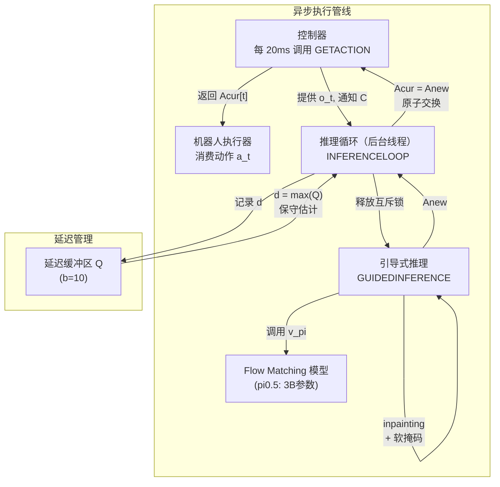
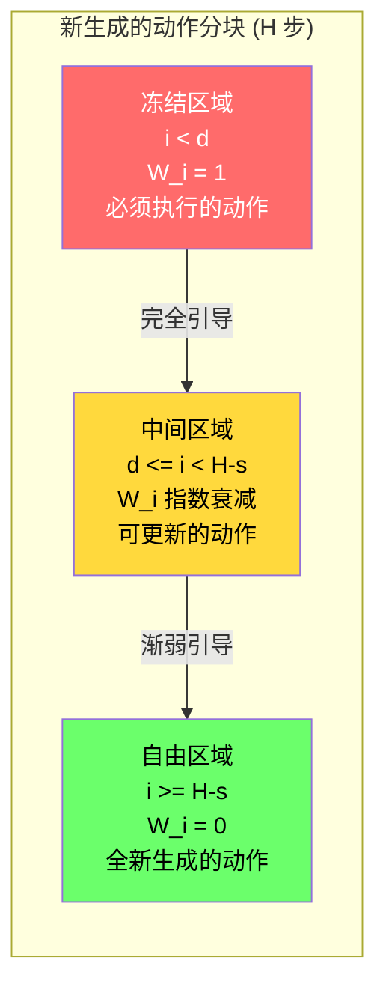
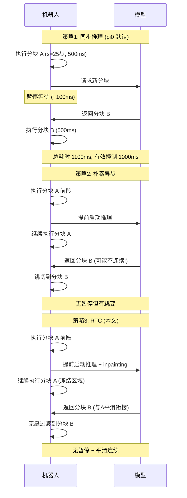
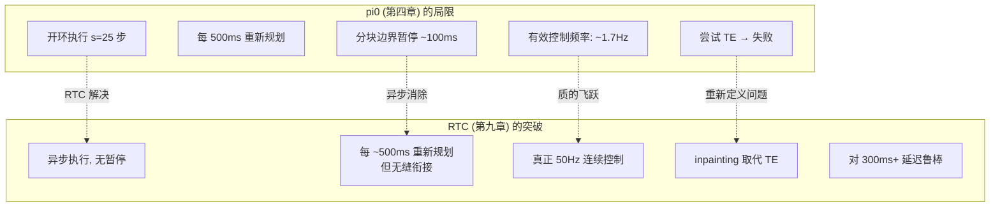

# 第九章：RTC — 动作分块流策略的实时执行

## 论文信息

| 项目 | 内容 |
|------|------|
| 标题 | Real-Time Execution of Action Chunking Flow Policies |
| 发表时间 | 2025年6月（arXiv v1: 2025-06-09, v2: 2025-12-05） |
| 会议 | NeurIPS 2025 (poster) |
| arXiv | https://arxiv.org/abs/2506.07339 |
| 核心作者 | Kevin Black, Manuel Y. Galliker, Sergey Levine |
| 机构 | Physical Intelligence, UC Berkeley |

---

## 1. 解决了什么问题 & 相对前作的定位

### 1.1 动作分块执行的根本困境

RTC 解决的是 flow matching 类 VLA 模型在实时控制中面临的一个结构性矛盾：**时间一致性（temporal consistency）与实时反应性（reactivity）之间不可调和的冲突**。这个问题的根源在于现代大规模 VLA 模型的推理延迟远远超过机器人控制周期。

具体而言，以第四章分析的 $\pi_0$ 为例：该模型在 RTX 4090 上仅 KV cache 预填充就需要 46ms，而目标控制频率为 50Hz（即每 $\Delta t = 20\text{ms}$ 需要一个新动作）。在远程推理场景下，仅网络延迟在理想有线连接条件下就有 13ms，在实际部署中轻易超过 20ms。更大的模型如 7B 参数的 OpenVLA，即使在服务器级 A100 GPU 上经过推理优化，延迟仍高达 321ms。

这意味着一个不可逃避的现实：**模型的单次推理时间 $\delta$ 远大于控制周期 $\Delta t$，实时约束 $\delta \leq \Delta t$ 在当前硬件条件下不可能满足**。

### 1.2 现有方案为何全部失败

$\pi_0$（第四章）采用的是动作分块（action chunking）方案——模型一次生成 $H=50$ 步动作（1秒的50Hz控制信号），然后执行其中的 $s=25$ 步，再重新规划。这种方案部分缓解了延迟问题，但存在三种本质缺陷的执行策略：

**策略一：同步推理（Synchronous Inference）**。这是 $\pi_0$、$\pi_{0.5}$、OpenVLA 等系统的默认策略：执行完 $s$ 个动作后暂停，等待模型生成下一个分块。当 $\delta > \Delta t$ 时（几乎总是如此），这会在分块边界产生可见的暂停。暂停不仅降低执行速度，更严重的是改变了机器人的动力学特性——训练数据中不存在这种"停顿-启动"的运动模式，从而引入训练与评估之间的分布偏移（distribution shift）。

**策略二：朴素异步推理（Naive Async）**。提前启动推理，在执行当前分块的同时计算下一个分块。但由于新分块在生成时无法知道推理期间机器人的实际状态演变，新旧分块在切换点可能出现任意幅度的不连续——例如前一分块计划从障碍物上方绕行，新分块却选择从下方绕行，导致切换瞬间产生超出分布的剧烈加速度跳变。

**策略三：时间集成（Temporal Ensembling）**。保持多个预测分块的缓冲区，对同一时间步的所有预测取平均。这种方法在单模态动作分布下可能有效，但在多模态分布中完全失败——两种都有效的动作策略的平均值本身不一定是有效动作。例如，从障碍物上方和下方绕行都是正确的，但两者的平均会直接穿过障碍物。论文的 Kinetix 基准实验直接证实了这一点：TE 即使在 $d=0$（零延迟）时也表现最差。

### 1.3 RTC 的核心洞察

RTC 提出了一个优雅的重构：**将异步动作分块执行问题转化为 inpainting（修复绘制）问题**。其核心思路是：

1. 在执行当前分块的**同时**，在后台计算下一个分块（异步）。
2. 推理延迟 $d$ 步内的动作已经在执行中，无法更改，因此将其"冻结"。
3. 利用 flow matching 模型固有的迭代去噪特性，通过伪逆引导（pseudoinverse guidance）使新分块在冻结区域与已执行动作保持一致，同时在非冻结区域根据最新观测自由生成。
4. 通过软掩码机制扩展引导范围，确保跨分块的完全连续性。

**最关键的特性是：RTC 不需要任何重新训练**。它是一个纯推理时算法，可以即插即用地应用于任何已有的 diffusion 或 flow matching 策略。这与第四章 $\pi_0$ 的开环执行策略形成了根本对比——$\pi_0$ 论文中曾尝试时间集成但发现损害性能，只能接受开环执行的局限性；RTC 则在不改变模型的前提下从根本上解决了这一问题。

---

## 2. 创新点

### 创新点 1：异步推理管线（变革性）

RTC 构建了一个完整的异步执行系统，将推理与执行解耦。`GETACTION` 函数每 20ms 被控制器调用一次，始终能返回一个动作；`INFERENCELOOP` 在后台线程持续运行推理。系统通过互斥锁（mutex）和条件变量（condition variable）实现线程同步，并维护一个延迟缓冲区（大小 $b=10$），保守地取历史延迟最大值来估计下一次推理延迟。这种设计确保了真正的实时保证：只要 $d \leq H - s$，系统就能保证每个控制周期都有动作可用。

### 创新点 2：基于 Inpainting 的动作分块拼接（变革性）

这是 RTC 最核心的技术贡献。借鉴图像修复领域的伪逆引导方法（PGDM），RTC 在每个去噪步骤中向学习到的速度场添加梯度引导项，使新生成的分块与已执行的动作保持一致。这种方法不需要对训练流程做任何修改，完全利用了 flow matching 模型的迭代去噪特性——这种"免费午餐"的特性使其成为极具实用价值的创新。论文还引入了引导权重裁剪（$\beta=5$），解决了在少步去噪（$n=5$）场景下原始 PGDM 算法不稳定的问题。

### 创新点 3：软掩码机制（显著性）

硬掩码（仅冻结前 $d$ 个动作）的引导信号过弱，特别在低延迟时容易导致策略切换和不连续。软掩码将引导范围扩展到所有 $H-s$ 个重叠动作，权重从 1 指数衰减到 0。这种设计反映了一个直觉：越远的未来应承受越大的不确定性。消融实验证明软掩码在低延迟场景下带来显著提升。

### 创新点 4：即插即用的后处理特性（显著性）

RTC 适用于任何 diffusion 或 flow matching 策略，且 diffusion 策略可在推理时转换为 flow 策略。这意味着整个 PI 的模型系列（$\pi_0$、$\pi_{0.5}$、$\pi_{0.7}$）以及社区中的 Diffusion Policy 等方法都可以直接受益，无需为实时执行重新训练任何模型。

### 创新点 5：高动态仿真基准（有益性）

论文指出现有仿真基准（如 LIBERO）大多是准静态的，标准分块执行即可达到接近完美的成功率。为此构建了基于 Kinetix 模拟器的 12 个高动态任务基准，涵盖投掷、接住、平衡等需要快速反应的动作，并添加执行器噪声使闭环修正成为成功的关键。

---

## 3. 数据来源、处理方式及其原因

### 3.1 无需训练数据——这本身就是核心优势

RTC 作为纯推理时算法，**不需要任何额外的训练数据**。这一特性在实践中至关重要：大规模 VLA 的训练成本极高（$\pi_{0.5}$ 的微调需要 8xH100 约 24 小时），而 RTC 零训练成本即可部署。这与大多数提升控制性能的方法形成鲜明对比——无论是 Consistency Policy（需要蒸馏训练）、Streaming Diffusion Policy（需要专门的训练配方）还是分层 VLA 设计（需要 System 1/System 2 分别训练），都涉及大量训练开销。

### 3.2 仿真评估数据

为构建 Kinetix 基准，作者采用了以下数据生成流程：

- **专家策略**：使用 RPO（Robust Policy Optimization）算法配合二元成功奖励，为 12 个环境各训练 6 个不同种子的专家策略。
- **模仿学习数据集**：每个环境生成 100 万次状态转移的数据集，每个 episode 随机选择一个专家策略。使用多个专家策略的目的是引入策略多样性，模拟真实世界中数据收集者行为风格不同的情况，从而构造多模态动作分布——这恰恰是 TE 方法失效的场景。
- **执行器噪声**：向动作添加高斯噪声，模拟不完美的执行器。这使得纯开环执行不可能成功，闭环修正成为必要条件。

### 3.3 真实世界评估

使用 $\pi_{0.5}$ VLA 作为基础策略，在 6 个双臂灵巧操作任务上评估：

| 任务 | 步数 | 时间限制 | 特点 |
|------|------|----------|------|
| 点蜡烛（Light candle） | 5步 | 40秒 | 精度敏感，不可重试 |
| 插网线（Plug ethernet） | 6步 | 120秒 | 需要重新定向 |
| 整理床铺（Make bed, mobile） | 3步 | 200秒 | 移动操作 |
| 叠衬衫（Shirt folding） | 1步 | 300秒 | 长时间操作 |
| 批量叠衣（Batch folding） | 4步 | 300秒 | 多样化物品 |
| 洗碗（Dishes in sink, mobile） | 8步 | 300秒 | 移动操作，多步骤 |

每个任务和方法各 10 次试验，共 480 个 episode，累计 28 小时纯机器人执行时间。评分方式为每个 episode 完成的子步骤数量，同时记录每个子步骤完成的时间戳，用于计算累积进度和平均吞吐量。

---

## 4. 模型结构及设计原因

### 4.1 RTC 执行管线

RTC 并非一个新的模型架构，而是一个推理时执行系统。其整体执行管线如下：

### 4.2 分块拼接的三个区域

RTC 的核心在于将新旧分块的重叠区域分为三个具有不同处理策略的区域：

**冻结区域**（$i < d$，权重 $W_i = 1$）：这些动作在推理完成前就已经被执行，因此必须与实际执行的动作完全一致。这是确保连续性的硬约束。

**中间区域**（$d \leq i < H-s$，权重指数衰减）：这些动作来自前一个分块但尚未执行，可以被更新以融入新观测信息。指数衰减权重反映了"越远的未来越不确定"的直觉——近期动作应更多遵循已有计划以保持连续性，远期动作则应更多反映新信息。

**自由区域**（$i \geq H-s$，权重 $W_i = 0$）：这些时间步超出前一分块的覆盖范围，必须完全由模型根据新观测生成。

### 4.3 Inpainting 的数学公式

RTC 的引导式推理建立在伪逆引导扩散模型（PGDM）的理论基础上。对于 flow matching 策略，标准的速度场积分为：

$$A^{\tau + \frac{1}{n}}_t = A^\tau_t + \frac{1}{n} v_\pi(A^\tau_t, o_t, \tau) \tag{1}$$

其中 $\tau \in [0,1)$ 是 flow matching 时间步，$n$ 是去噪步数。

RTC 在此基础上添加引导项，修正后的速度场为：

$$v_{\text{RTC}}(A^\tau_t, o_t, \tau) = v_\pi(A^\tau_t, o_t, \tau) + \min\left(\beta, \frac{1-\tau}{\tau \cdot r^2_\tau}\right) \left(Y - \hat{A}^1_t\right)^\top \text{diag}(W) \frac{\partial \hat{A}^1_t}{\partial A^\tau_t} \tag{2}$$

其中：

$$\hat{A}^1_t = A^\tau_t + (1 - \tau) v_\pi(A^\tau_t, o_t, \tau) \tag{3}$$

是对最终去噪动作分块的估计，

$$r^2_\tau = \frac{(1-\tau)^2}{\tau^2 + (1-\tau)^2} \tag{4}$$

是信噪比相关系数，$W$ 是软掩码权重向量，$\beta$ 是引导权重裁剪阈值。

引导项的物理含义是：计算当前去噪估计 $\hat{A}^1_t$ 与目标值 $Y$（前一分块的已知动作）之间的加权误差，然后通过向量-雅可比积（VJP）将该误差反向传播到当前噪声状态 $A^\tau_t$，引导去噪过程向与前一分块一致的方向前进。

**软掩码权重的定义**：

$$W_i = \begin{cases} 1 & \text{if } i < d \\ c_i \cdot \frac{e^{c_i} - 1}{e - 1} & \text{if } d \leq i < H - s \\ 0 & \text{if } i \geq H - s \end{cases}$$

$$\text{其中 } c_i = \frac{H - s - i}{H - s - d + 1}, \quad i \in \{0, \ldots, H-1\} \tag{5}$$

### 4.4 三种执行策略的对比

### 4.5 延迟-反应性权衡的量化分析

定义推理延迟为 $d = \lfloor \delta / \Delta t \rfloor$（推理时间除以控制周期），则异步算法必须满足约束：

$$d \leq s \leq H - d$$

其中 $s$ 是执行 horizon。这揭示了一个关键的工程约束：推理延迟 $d$ 同时限制了执行 horizon 的上下界。$d$ 越大，$s$ 的可选范围越窄。当 $d > H/2$ 时，系统完全无法满足实时约束。

以 $\pi_{0.5}$ 的实际部署为例：$H=50$，基础 $d \approx 6$（约120ms/20ms），因此 $s$ 的范围是 $[6, 44]$，默认设置 $s_{\min}=25$。即使注入 200ms 额外延迟（$d \approx 16$），$s$ 的范围仍为 $[16, 34]$，系统依然可以运行。

---

## 5. 训练方法（算法与工程）

### 5.1 无需训练修改——这是核心设计原则

RTC 最重要的工程决策是**完全不修改训练流程**。这一选择基于两个关键考量：

1. **成本考量**：大规模 VLA 的训练极其昂贵。$\pi_{0.5}$ 的微调需要 8xH100 约 24 小时。如果实时执行需要重新训练，将严重限制其实用性。
2. **通用性考量**：作为后处理方法，RTC 可以立即应用于所有已训练好的 flow-based 或 diffusion-based 模型，无需为每个模型单独训练。

### 5.2 仿真基准中的策略训练

仿真评估所用的模型训练仅服务于基准构建，非 RTC 本身的贡献：

- **架构**：4 层 MLP-Mixer，预测 horizon $H=8$
- **训练**：32 个 epoch 的 flow matching
- **专家数据**：RPO 算法 + 二元成功奖励，每环境 6 个种子

### 5.3 RTC 的推理时计算开销

RTC 的代价体现在推理时的额外计算上：

| 组件 | 无 RTC | 有 RTC | 增幅 |
|------|--------|--------|------|
| 图像编码器（SigLIP） | 18ms | 18ms | 无 |
| LLM 预填充（Gemma 2B） | 44ms | 44ms | 无 |
| 单步去噪 ($\times 5$) | 14ms | 35ms | 2.5x |
| **模型总延迟** | **76ms** | **97ms** | **1.28x** |

每个去噪步骤延迟增加 2.5 倍的原因是 RTC 需要对去噪函数进行反向传播以计算向量-雅可比积。然而，这一额外开销是完全值得的：97ms 的总延迟对应 $d \approx 5$（97ms/20ms），远小于 $H-s = 50-25 = 25$，系统有充足的余量。

### 5.4 部署工程细节

| 场景 | 机器人端电脑 | 推理工作站 | 总延迟 |
|------|-------------|-----------|--------|
| 非移动 | AMD Ryzen 9 7950X | RTX 4090 (bfloat16) | $108.76 \pm 2.34$ms |
| 移动操作 | Intel NUC i7-1260P | RTX 4090 (bfloat16) | $138.98 \pm 6.71$ms |

通信采用 WebSocket 协议，通过有线以太网 LAN 连接。移动场景的额外延迟主要来自 Intel NUC 较慢的 CPU 图像缩放（11.22ms vs 1.44ms）和更长的网络延迟（21.20ms vs 6.89ms）。

### 5.5 训练时 RTC 的探索

值得注意的是，论文 v2 版本（2025年12月）提到了训练时 RTC 变体，用于 $\pi_{0.6}$ 的咖啡演示。这表明推理时方法的成功验证了 inpainting 思路的价值，并推动了将其集成到训练流程中的后续工作。推理时版本作为概念验证和零成本部署方案的价值依然不可替代。

---

## 6. 实验关键发现与效果对比

### 6.1 仿真实验（Kinetix 基准）

12 个高动态任务，每个数据点 2048 次试验，测试推理延迟 $d$ 从 0 到 4 的影响：

**延迟鲁棒性**：

| 方法 | $d=0$ 解题率 | $d=2$ 解题率 | $d=4$ 解题率 | 退化幅度 |
|------|-------------|-------------|-------------|---------|
| RTC（软掩码） | ~0.90 | ~0.87 | ~0.82 | 最小 |
| RTC（硬掩码） | ~0.88 | ~0.85 | ~0.80 | 小 |
| BID | ~0.87 | ~0.82 | ~0.70 | 中等 |
| 朴素异步 | ~0.85 | ~0.75 | ~0.55 | 大 |
| 时间集成（TE） | ~0.60 | ~0.55 | ~0.50 | 始终最差 |

关键发现：

- **TE 在零延迟时即最差**，证明多模态基准中平均有效动作产生无效结果。这直接反驳了第四章 $\pi_0$ 论文未能成功使用 TE 的原因分析——问题不在于实现细节，而在于多模态动作分布下取平均的根本性错误。
- **RTC 与 BID 的差距随延迟增加而扩大**，且 BID 需采样 64 个动作分块（32 强模型 + 32 弱模型），计算量远大于 RTC。
- **执行 horizon 消融**（固定 $d=1$）：只有 RTC 和 BID 能随执行 horizon 减小而严格提升性能，说明 RTC 真正释放了闭环修正的优势。其他方法在短 horizon 下因分块不连续性而性能下降。

### 6.2 真实世界实验

6 个双臂任务，480 个 episode，28 小时执行，使用 $\pi_{0.5}$ (H=50) 作为基础策略。测试 +0ms、+100ms、+200ms 三个注入延迟水平。

**核心结果——平均任务吞吐量（tasks/min）**：

| 方法 | +0ms | +100ms | +200ms |
|------|------|--------|--------|
| **RTC** | **最高** | **最高***| **最高*** |
| 同步推理 | 次优 | 退化 | 明显退化 |
| TE（稀疏） | 略差 | 无法运行 | 无法运行 |
| TE（密集） | 最差 | 无法运行 | 无法运行 |

（* 表示统计显著）

**六个关键发现**：

1. **RTC 对延迟完全鲁棒**：在 +0ms 到 +200ms 的延迟范围内，RTC 的性能无任何退化。同步推理则随延迟线性退化。

2. **TE 变体在高延迟下完全失效**：+100ms 和 +200ms 的注入延迟导致 TE 产生如此剧烈的振荡，以至于触发机器人的保护性停机（protective stop），完全无法运行。这不是性能下降，而是物理上不可执行。

3. **RTC 的提升不仅来自速度**：即使在比较中去除推理暂停时间（以控制器步数而非挂钟时间衡量），RTC 仍比同步推理更快完成任务。这意味着 RTC 产生了更少的错误和更少的重试——连续平滑的动作本身就提升了任务执行质量。

4. **精度敏感任务优势明显**：在点蜡烛任务（唯一不允许重试的任务）中，RTC 展示了最终分数的显著优势，即使在 300ms+ 延迟（占预测 horizon 30%以上）下仍保持高成功率。

5. **运动质量量化提升**：在真实划火柴轨迹上，RTC 的肩关节运动比同步推理快 20%，比所有方法（包括 TE）更平滑（加速度曲线更低、更连续）。

6. **困难任务收益更大**：在最困难的整理床铺任务中，RTC 展示了最终分数的显著优势，尽管该任务允许重试。策略在操作枕头时特别挣扎，RTC 的连续控制信号有效减少了失误。

### 6.3 与 $\pi_0$ 执行策略的直接对比

将 RTC 的结果与第四章 $\pi_0$ 的执行策略对比，可以清晰看到进步的幅度：

---

## 7. 消融实验的发现

### 7.1 引导权重裁剪 $\beta$ 的消融（影响：关键）

这是 RTC 对原始 PGDM 算法最重要的改进。原始公式中 $\frac{1-\tau}{\tau \cdot r^2_\tau}$ 在 $\tau = 0$ 时趋于无穷，在图像生成中（$n=100$ 步去噪）不是问题，因为 $\tau=0$ 的权重很快被后续步骤稀释。但控制问题通常只用 $n=5$ 步去噪，$\tau=0$ 时的过大权重会导致动作分块发散。

实验发现：
- 当 $\beta \geq 50$ 时，$n=5$ 的生成轨迹严重发散
- $\beta$ 超过 5 后无边际收益
- 高 $\beta$ 导致更大的最大加速度（对 325 个动作分块的统计），这是超出分布动作的代理指标
- 论文保守地设置 $\beta = 5$

### 7.2 软掩码衰减策略的消融（影响：显著）

比较四种掩码衰减策略在 Kinetix 基准上的表现：

| 衰减策略 | 低延迟性能 | 高延迟性能 | 整体排名 |
|---------|-----------|-----------|---------|
| 指数衰减（本文方法） | 最优 | 最优 | 1 |
| 线性衰减 | 接近最优 | 接近最优 | 2 |
| 无衰减（所有重叠动作权重相同） | 次优 | 中等 | 3 |
| 立即衰减（硬掩码） | 最差 | 中等 | 4 |

关键发现：
- **硬掩码在低延迟（小 $d$）时性能显著下降**，因为仅有少数几个冻结动作提供的引导信号不足以确保跨分块一致性
- **无衰减也不如指数衰减**，因为它过度约束了较远未来的动作，限制了模型融入新观测信息的能力
- **线性衰减非常接近指数衰减**，说明精确的衰减形式不是关键，关键是有从强到弱的渐变过渡

### 7.3 与 Diffuser inpainting 方法的对比（影响：中等）

Diffuser 的 inpainting 方法在每个去噪步骤直接将部分动作分块覆写为目标值（replacement-based），而非使用梯度引导。虽然这种方法更简单且计算更廉价，但在 Kinetix 基准上被 RTC 的引导式方法明显超越。

这一结果的原因是：直接覆写会在每步去噪中引入不自然的约束，破坏 flow matching 速度场的内在一致性。而基于梯度的引导则是"软性地"鼓励生成结果与目标一致，允许模型在满足约束的前提下找到最自然的动作分布。

### 7.4 延迟开销对比（影响：工程层面重要）

| 方法 | 延迟 | 相对 RTC |
|------|------|---------|
| Vanilla $\pi_{0.5}$ | 76ms | 0.78x |
| **RTC** | **97ms** | **1.00x** |
| BID（无前向对比） | 115ms | 1.19x |
| BID（共享骨干） | 169ms | 1.74x |
| BID（完整） | 223ms | 2.30x |

RTC 的额外开销（+21ms，+28%）主要来自反向传播，远小于 BID 的额外开销。考虑到 RTC 在性能上还优于 BID，其延迟-性能权衡明显更优。

### 消融实验按影响排序

1. **引导权重裁剪 $\beta$**：没有它，算法在少步去噪下完全不稳定——这是使 RTC 在控制场景中可行的必要条件
2. **软掩码 vs 硬掩码**：在低延迟场景下差距显著，是 RTC 全面优于 BID 的关键因素之一
3. **引导式 vs 覆写式 inpainting**：决定了 inpainting 方法能否有效维持跨分块一致性
4. **衰减函数的具体形式**（指数 vs 线性）：影响较小，说明方法对超参数不敏感

---

## 8. 优化有效性评估

### 8.1 异步执行——使能器（Enabler）

异步执行本身并不困难——在后台线程运行推理是标准的并发编程。RTC 的真正贡献不在于异步执行本身，而在于**解决了异步执行引入的分块不连续性问题**。朴素异步和 TE 都实现了异步执行，但因无法解决连续性问题而在高延迟下完全失效。

**有效性证据**：RTC 是唯一能在 +200ms 注入延迟下正常运行的异步方法。TE 变体在此延迟下触发机器人保护性停机。

### 8.2 Inpainting——优雅的零成本解决方案

将 inpainting 从图像领域迁移到动作空间是 RTC 最具洞察力的贡献。这一迁移之所以有效，有三个关键原因：

1. **Flow matching 的迭代去噪特性天然支持 inpainting**：这是 diffusion/flow 模型区别于自回归模型的结构性优势。自回归模型（如 FAST）无法使用 RTC，因为它们不经历迭代去噪过程。
2. **动作分块的时间结构与图像的空间结构具有相似性**：在图像 inpainting 中，已知像素约束未知像素；在动作 inpainting 中，已执行动作约束未来动作。
3. **零重训练成本**使其可以立即部署到所有现有模型。

**有效性证据（强度排序）**：
- RTC 在所有实验条件下均优于所有基线，包括使用显著更多计算的 BID（强）
- 即使去除暂停时间，RTC 仍优于同步推理，说明连续控制信号本身提升了任务执行质量（强）
- 对 300ms+ 延迟完全鲁棒，而其他异步方法在此延迟下物理不可执行（强）
- 运动轨迹比同步推理快 20%、比所有方法更平滑（中）

### 8.3 对生产部署的关键意义

RTC 解决了从研究原型到生产系统的最后一道技术壁垒。在第四章分析的 $\pi_0$ 中，开环执行的分块边界暂停和对扰动的无反应性是限制其在动态环境中部署的主要障碍。RTC 通过以下方式使生产部署成为现实：

| 生产需求 | 无 RTC | 有 RTC |
|---------|--------|--------|
| 50Hz 连续控制 | 不可能（有暂停） | 实现 |
| 对扰动的反应性 | 每 500ms 一次 | 每 ~500ms 一次但无缝衔接 |
| 云端推理兼容 | 高延迟下严重退化 | 对 300ms+ 延迟鲁棒 |
| 边缘设备支持 | 需要强大本地 GPU | 可使用远程推理 |
| 模型升级成本 | 需重新优化部署 | 即插即用 |

---

## 9. 与后续工作的关联

### 9.1 赋能 $\pi_{0.5}$ 和后续模型的实时部署

RTC 的论文本身就使用 $\pi_{0.5}$ 作为基础策略进行评估，证明了两者的无缝集成。对于后续更大的模型（如 $\pi_{0.7}$），推理延迟只会更高，RTC 的价值将更加显著。论文证明系统在 $d \leq H/2$ 的条件下都能有效工作，为模型规模的持续扩大提供了执行层面的保障。

### 9.2 与 FAST（第五章）的互补关系

FAST 通过动作量化和自回归解码实现了高效的动作表示，但其自回归特性使其无法直接使用 RTC 的 inpainting 机制（自回归模型没有迭代去噪过程）。然而，FAST 的低延迟特性意味着它可能不像 flow matching 模型那样迫切需要 RTC。这构成了一个有趣的技术路线分叉：

- **Flow matching 路线**（$\pi_0$/$\pi_{0.5}$）+ RTC：更高的动作质量，通过 RTC 解决延迟问题
- **自回归路线**（FAST）：更低的延迟，可能不需要 RTC

### 9.3 RECAP（第十章）的部署基础

RECAP 使用 RTC 进行策略部署以收集自主数据。RTC 的实时连续控制能力对 RECAP 至关重要——如果策略在执行中频繁暂停或产生不连续动作，收集到的数据质量将受到严重影响，进而影响自主改进循环的效果。

### 9.4 商业部署（第十七章）的技术基石

Physical Intelligence 的商业产品需要在各种网络条件和硬件配置下可靠运行。RTC 对延迟的鲁棒性直接解决了云端推理、网络不稳定、硬件异构等生产环境中不可避免的问题。论文中对移动操作场景（Intel NUC + 远程推理）的评估直接模拟了商业部署中的典型配置。

### 9.5 从推理时到训练时的演进

论文 v2 版本提到的训练时 RTC 变体（用于 $\pi_{0.6}$）暗示了一个重要的技术演进方向：将 RTC 的 inpainting 机制整合到训练过程中，使模型在训练时就学会生成与前一分块一致的动作。这可能进一步减少推理时的额外计算开销（消除反向传播需求），同时保持甚至提升分块拼接质量。

---

## 总结

RTC 是 PI 技术栈中一个看似简单但意义深远的贡献。它没有提出新的模型架构、没有使用新的训练数据、没有改变训练流程——仅仅通过对推理过程的巧妙重构，就解决了困扰 flow matching VLA 从研究走向生产的核心障碍。

其技术贡献的精髓可以用一句话概括：**将异步动作分块的连续性问题转化为 flow matching 天然擅长的 inpainting 问题，通过软掩码引导实现无缝分块拼接，以零训练成本换取真正的实时控制能力**。

从更宏观的视角看，RTC 代表了一种重要的方法论：**当模型本身的能力已经足够强大但推理速度成为瓶颈时，正确的做法不是降低模型质量以换取速度，而是在系统层面设计智能的异步执行策略**。这一思路对整个大规模模型的实时部署领域都具有启发意义。
