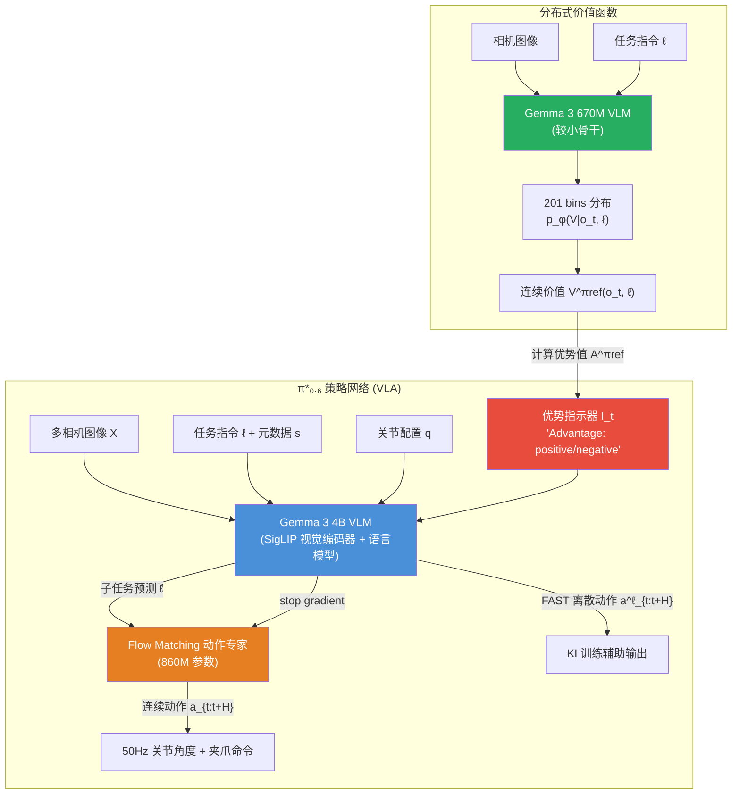
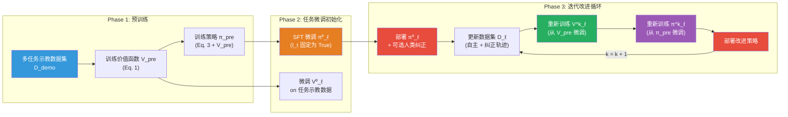
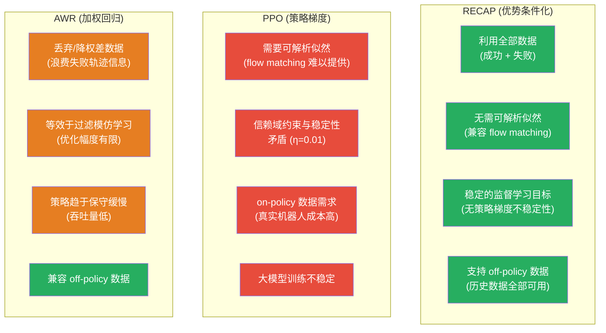
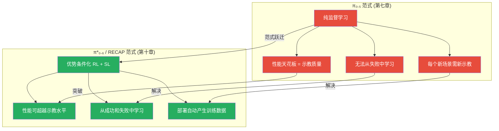

# 第十章：π\*₀.₆ / RECAP -- 从部署经验中自我进化的 VLA

## 论文信息

| 项目 | 内容 |
|------|------|
| 标题 | π\*₀.₆: a VLA That Learns From Experience |
| 方法名称 | RECAP (RL with Experience and Corrections via Advantage-conditioned Policies) |
| 发表时间 | 2025-11-18 |
| arXiv | https://arxiv.org/abs/2511.14759 |
| 核心作者 | Ali Amin, Ashwin Balakrishna, Kevin Black, Chelsea Finn, Sergey Levine, Jost Tobias Springenberg, Karl Pertsch, Allen Z. Ren 等 55 位 (Physical Intelligence) |
| 基础模型 | π₀.₆ VLA (Gemma 3 4B VLM + 860M action expert) |
| 核心主题 | 通过优势条件化离线 RL，使 VLA 从真实世界部署经验中持续自我改进 |

---

## 1. 解决了什么问题 & 相对前作的定位

### 1.1 纯监督学习的天花板

π₀.₅（第七章）代表了 PI 在监督学习范式下的巅峰成就：通过异构多任务联合训练，首次实现了 VLA 在完全陌生的真实家庭中执行长时程灵巧操作。然而，π₀.₅ 的学习范式存在两个根本性瓶颈：

**第一，性能上限被示教数据质量锁死。** 纯模仿学习（IL）训练的策略最多只能达到示教数据的水平。当人类遥操作员本身就不完美时——操作速度受限于人类反应时间、有时会犯错、无法在每种新场景中都提供示教——策略的性能就被永久锁定在一个次优水平。更关键的是，对于每个新的部署场景，系统都需要人类提供新的示教数据，这一过程成本高昂且不可规模化。

**第二，复合误差使策略在分布外状态迅速退化。** 这是模仿学习的经典问题 [7]：策略在执行过程中不可避免地偏离训练分布，但它从未在这些偏离状态上接受过训练，导致错误不断累积。π₀.₅ 通过海量数据和 co-training 在一定程度上缓解了这一问题，但并未从根本上解决。

### 1.2 为什么标准 RL 方法行不通

既然监督学习有天花板，自然的想法是引入强化学习（RL）。然而，将标准 RL 方法直接应用于 3B+ 参数的 VLA 模型面临严峻挑战：

- **PPO 的不稳定性**：PPO 需要可解析的对数似然来计算策略梯度，而 flow matching 模型不提供易于计算的似然函数。即便通过近似手段绕过这一限制，大模型上的 PPO 训练仍极不稳定——在 RECAP 的对比实验中，PPO 需要将信赖域约束压缩到极小值（$\eta = 0.01$）才能稳定训练，但这严重限制了改进幅度。
- **On-policy 数据需求**：PPO 和 REINFORCE 等方法是 on-policy 算法，每更新几步梯度就需要用最新策略重新采集数据。对于真实机器人系统，这意味着极高的数据采集成本和极低的样本效率。
- **RLHF 的局限性**：LLM 领域的 RLHF 依赖奖励模型对文本质量进行评估，但在机器人领域，定义通用的、可泛化的奖励函数远比评判文本质量困难——机器人任务涉及物理交互、长时程依赖、以及难以从单帧图像判断的成功/失败。

### 1.3 RECAP 的核心定位

RECAP 解决的核心问题可以概括为一句话：**如何让一个预训练的 VLA 从自主部署经验中持续改进，同时兼容 flow matching 等先进动作生成架构？** 它的解决方案基于三个关键洞察：

1. **优势条件化取代策略梯度**：不计算难以处理的似然比，而是将优势信号作为额外的文本条件注入模型，将 RL 问题转化为条件化的监督学习问题。
2. **失败数据同样有价值**：通过优势条件化，模型可以从失败轨迹中学习"不应该怎么做"，AWR 等方法则会丢弃大部分"差"数据。
3. **迭代式离线 RL**：避免 on-policy 方法的数据浪费，每轮采集一批数据后离线训练，使所有历史数据都得到利用。

这代表了 PI 技术路线的一个范式性转变：从"仅从示教中学习"到"从部署经验中自我改进"。正如论文引用 Heinlein 的话——"当你不害怕尝试时，能学到的东西令人惊叹"——RECAP 让机器人第一次能够通过实践来精通技能。

---

## 2. 创新点

| 创新点 | 重要性级别 | 说明 |
|--------|-----------|------|
| 面向 VLA 的优势条件化策略学习 | **变革性** | 将 RL 的策略提取问题转化为条件化监督学习，绕过了 flow matching 模型不可解析似然的核心障碍，使大规模 VLA 的端到端 RL 训练首次在真实世界中可行 |
| 可学习的分布式价值函数 | **重要** | 采用 201 bins 的分布式价值函数自动评估轨迹质量，输出步数到成功的负值分布，为优势计算提供可靠信号，同时支持多任务、语言条件化 |
| 可扩展的自主部署自我改进框架 | **变革性** | 建立了完整的"部署-采集-训练-再部署"迭代循环，使 VLA 可以在真实世界中持续自我改进，奠定了数据飞轮的技术基础 |
| 同时从成功和失败中学习 | **重要** | 不同于 AWR 等方法丢弃/降权差数据，优势条件化使模型能从全部数据（包括失败轨迹）中提取信息，大幅提升数据效率 |
| 部署数据飞轮概念的实证验证 | **重要** | 首次在复杂真实任务上证明，机器人的部署数据可以反馈形成正向循环——部署越多，数据越多，模型越好，可部署的场景越多 |
| 整合异构数据源的统一 RL 框架 | **重要** | 在同一框架内融合示教数据、自主轨迹和人类纠正干预三种异构数据源，每种数据通过优势条件化获得不同但一致的处理 |

---

## 3. 数据来源、处理方式及其原因

### 3.1 三层异构数据体系

RECAP 的数据来源具有三重异构性，每一层服务于不同的训练阶段：

**第一层：大规模预训练示教数据。** 继承自 π₀.₅ 的多任务多机器人数据集，包含数万小时的操作示教以及网络视觉-语言协训练数据。这些数据在预训练阶段用于初始化价值函数和策略网络，建立广泛的任务理解和操作基础。

**第二层：自主部署采集的 on-policy 数据。** 将当前策略部署到真实任务中执行自主轨迹采集。关键设计是，每个 episode 仅需标注一个二值成功/失败标签作为稀疏奖励信号——这大幅降低了标注成本，使大规模数据采集成为可能。

**第三层：人类纠正干预数据（coaching corrections）。** 专家遥操作员在机器人自主执行过程中通过 human-gated DAgger 方式实时监控和接管，纠正即将发生或已经发生的严重错误。纠正的核心作用不是提供完美示教，而是帮助策略克服探索瓶颈、避免灾难性失败。

### 3.2 各任务数据量

| 任务 | 自主轨迹 | 纠正轨迹 | 机器人数 | 迭代轮次 |
|------|---------|---------|---------|---------|
| 洗衣（T恤和短裤） | 300/轮 | 0（纯 RL） | 4 | 2 |
| 洗衣（多样化衣物） | 450 | 287 | - | 1 |
| 洗衣（失败模式消除） | ~1000 | 280 + 378 | 3 | 2 |
| 盒子组装 | 600/轮 | 360/轮 | 3 | 2 |
| 咖啡制作 | 414 | 429 | - | 1 |

### 3.3 数据处理的关键设计

**优势指示器的差异化处理**是 RECAP 数据流程的核心。人类纠正动作的优势指示器 $I_t$ 被强制设为 True（positive），基于合理假设：人类专家总是提供好的纠正动作。而自主轨迹中每一步的 $I_t$ 则由价值函数动态计算：

$$I_t = \mathbf{1}\left[A^{\pi_{\text{ref}}}(o_t, a_t, \ell) > \epsilon_\ell\right]$$

其中阈值 $\epsilon_\ell$ 在预训练阶段设为价值函数预测值的第 30 百分位数，在微调阶段调整为约 40% 的数据获得正优势。对于洗衣（T恤和短裤）任务，由于示教数据质量极高导致策略速度慢，阈值被进一步提高至仅约 10% 的数据获得正优势，促使模型更积极地超越示教速度。

**数据聚合策略**遵循 DAgger 范式：所有历史数据（包括示教、自主轨迹、纠正轨迹）被聚合到统一数据集 $D_\ell$ 中。无论轨迹成功还是失败、是否包含纠正、是来自当前还是历史策略，全部纳入训练——优势条件化机制确保模型能从中提取有用信息。

---

## 4. 模型结构及设计原因

### 4.1 整体架构

π\*₀.₆ 的模型架构由三个核心组件构成：策略网络（VLA）、价值函数、以及它们之间的优势条件化接口。

### 4.2 策略网络：从 π₀.₆ 到 π\*₀.₆

π₀.₆ 本身是 π₀.₅ 的直接升级版，三项关键改进：(i) VLM 骨干从 PaliGemma (SigLIP + Gemma 2.6B) 升级为 Gemma 3 4B；(ii) 动作专家从约 300M 参数扩大至 860M 参数；(iii) 预训练数据集扩充了更多机器人平台的数据。模型继续采用 Knowledge Insulation (KI) 训练策略，通过 stop gradient 解耦 flow matching 动作专家与 VLM 骨干。

从 π₀.₆ 到 π\*₀.₆ 的核心扩展是增加了**二值化优势指示器** $I_t$ 作为额外文本输入。这一设计在工程上极其简洁：

- 当 $I_t = \text{True}$ 时，输入文本 "Advantage: positive"
- 当 $I_t = \text{False}$ 时，输入文本 "Advantage: negative"

该指示器在训练序列中的位置经过精心安排：出现在子任务预测 $\hat{\ell}$ 之后、动作输出之前，确保仅影响动作的对数似然，不干扰高层语义推理。训练时以 30% 的概率随机丢弃该指示器（dropout），实现 classifier-free guidance (CFG) 的效果——这使得推理时可以选择不同的 $\beta$ 值来控制策略优化的强度。

### 4.3 分布式价值函数

价值函数采用与 VLA 相同的架构设计，但使用更小的 670M 参数 VLM 骨干（同样初始化自 Gemma 3）。核心设计选择包括：

**分布式输出（201 bins）**：不预测标量值，而是预测一个 $B = 201$ 个离散 bin 的分布 $p_\phi(V|o_t, \ell)$。分布式价值函数 [72] 可以更准确地捕捉回报的不确定性，尤其在成功和失败轨迹混合的数据集中，价值的多模态分布对精确建模至关重要。

**步数到成功的负值表示**：价值函数预测成功 episode 中当前时刻到成功完成的剩余步数的负值，归一化到 $(-1, 0)$ 区间。对于失败 episode 则输出一个很大的负值（由 $C_{\text{fail}}$ 控制）。这种统一的时间度量可跨任务比较。

**语言条件化**：价值函数接受与 VLA 相同的语言输入，使其能够为不同任务提供有意义的价值估计。

**小骨干设计**：670M 参数的骨干使价值函数可在 VLA 训练过程中实时在线推理，计算优势值的额外开销极小。

### 4.4 π\*₀.₆ 的模型对数似然分解

完整的训练似然函数分解为三个独立部分：

$$\log \pi_\theta\left(a_{t:t+H}, a^\ell_{t:t+H}, \hat{\ell} \mid o_t, \ell\right) = \underbrace{\log \pi_\theta\left(\hat{\ell} \mid o_t, \ell\right)}_{\text{子任务预测}} + \underbrace{\log \pi_\theta\left(a^\ell_{t:t+H} \mid o_t, \ell, \hat{\ell}\right)}_{\text{FAST 离散动作}} + \underbrace{\log \pi_\theta\left(a_{t:t+H} \mid o_t, \ell, \hat{\ell}\right)}_{\text{flow matching 连续动作}}$$

引入优势条件化后，优势指示器 $I_t$ 仅影响后两项（动作部分），子任务预测保持不变。连续动作的对数似然通过 flow matching 损失的下界来近似：

$$\log \pi_\theta(a_{t:t+H}, a^\ell_{t:t+H} \mid I_t, o_t, \ell, \hat{\ell}) \geq \mathbb{E}_{\eta, \omega}\left[\log p_\theta(a^\ell_{t:t+H} \mid I_t, o_t, \ell, \hat{\ell}) - \alpha_\eta \left\|\omega - a_{t:t+H} - f_\theta(a^{\eta,\omega}_{t:t+H}, I_t, o_t, \ell, \hat{\ell})\right\|^2\right]$$

其中 $a^{\eta,\omega}_{t:t+H} = \eta a_{t:t+H} + (1-\eta)\omega$，$\omega \sim \mathcal{N}(0, I)$ 是噪声，$\eta \in [0,1]$ 是 flow matching 时间索引。

---

## 5. 训练方法（算法与工程）

### 5.1 RECAP 算法总览

RECAP 的训练流程可分为预训练阶段和迭代改进阶段：

### 5.2 价值函数训练

价值函数通过 Monte Carlo 回报估计进行训练。给定轨迹 $\tau$ 中时刻 $t$ 的经验回报 $R_t(\tau) = \sum_{t'=t}^{T} r_{t'}$，将其离散化到 $B = 201$ 个 bin 中，然后最小化交叉熵损失：

$$\min_\phi \mathbb{E}_{\tau \in D}\left[\sum_{o_t \in \tau} H\left(R^B_t(\tau), p_\phi(V \mid o_t, \ell)\right)\right]$$

奖励函数设计极为简洁且通用：

$$r_t = \begin{cases} 0 & \text{if } t = T \text{ and success} \\ -C_{\text{fail}} & \text{if } t = T \text{ and failure} \\ -1 & \text{otherwise} \end{cases}$$

这使得价值函数本质上预测的是成功 episode 中到达目标的剩余步数的负值（归一化至 $(-1, 0)$ 区间），而失败 episode 则获得一个很大的负值。这种通用设计可以应用于几乎任何任务，不需要任务特定的奖励工程。

连续价值通过期望提取：$V^{\pi_{\text{ref}}}(o_t, \ell) = \sum_{b \in [0,B]} p_\phi(V = b \mid o_t) \cdot v(b)$

### 5.3 优势条件化策略提取

RECAP 的策略提取方法基于正则化 RL 的一个重要理论结果。从正则化目标出发：

$$J(\pi, \pi_{\text{ref}}) = \mathbb{E}_{\tau \sim \rho_{\pi_\theta}}\left[\sum_{t=0}^{T} \gamma^t r_t\right] - \beta \mathbb{E}_{o \sim \rho_{\pi_\theta}}\left[D(\pi(\cdot|o) \| \pi_{\text{ref}}(\cdot|o))\right]$$

当散度 $D$ 为 KL 散度时，最优策略的闭式解为 $\hat{\pi}(a|o) \propto \pi_{\text{ref}}(a|o) \exp(A^{\pi_{\text{ref}}}(o, a)/\beta)$。RECAP 使用一个密切相关但不同的结果：通过贝叶斯规则重写改进概率，可得：

$$\hat{\pi}(a \mid o, \ell) \propto \pi_{\text{ref}}(a \mid o, \ell) \left(\frac{\pi_{\text{ref}}(a \mid I, o, \ell)}{\pi_{\text{ref}}(a \mid o, \ell)}\right)^\beta$$

当 $\beta = 1$ 时，$\hat{\pi}(a \mid o, \ell) = \pi_{\text{ref}}(a \mid I, o, \ell)$。这意味着，如果我们训练策略同时建模条件分布 $\pi_{\text{ref}}(a \mid I, o, \ell)$ 和无条件分布 $\pi_{\text{ref}}(a \mid o, \ell)$，那么推理时直接设 $I_t = \text{True}$ 即可获得改进策略——无需显式计算改进概率或策略梯度。

优势条件化的训练目标为：

$$\min_\theta \mathbb{E}_{D_{\pi_{\text{ref}}}}\left[-\log \pi_\theta(a_t \mid o_t, \ell) - \alpha \log \pi_\theta(a_t \mid I_t, o_t, \ell)\right]$$

$$\text{where } I_t = \mathbf{1}\left[A^{\pi_{\text{ref}}}(o_t, a_t, \ell) > \epsilon_\ell\right]$$

优势值通过 N 步估计计算：

$$A^{\pi}(o_t, a_t) = \sum_{t'=t}^{t+N-1} r_{t'} + V^{\pi}(o_{t+N}) - V^{\pi}(o_t)$$

预训练阶段使用 $N = T$（整个 episode 长度），虽然方差较高但允许单次价值函数推理即可完成计算；微调阶段使用 $N = 50$ 步的 lookahead 来降低方差。

### 5.4 为什么优势条件化优于 PPO 和 AWR

### 5.5 关键工程决策

**每轮从预训练检查点微调**：迭代改进的每一轮中，策略和价值函数都从预训练检查点（而非上一轮模型）开始微调。这一决策防止了多轮迭代中的策略漂移，但代价是无法在上一轮模型的基础上"累积"权重空间的进展。论文指出这是出于稳定性的考虑。

**价值函数在线推理**：由于价值函数使用 670M 的小骨干，可以在 VLA 训练过程中实时推理来计算优势值 $A^{\pi_{\text{ref}}}$，无需预先计算并存储。这简化了训练流程并确保优势值的时效性。

**CFG 推理增强**：训练时的 30% 优势指示器 dropout 使得推理时可以使用 classifier-free guidance (CFG)，通过 $\beta > 1$（典型值 1.5-2.5）进一步锐化改进策略的动作分布：

$$\nabla_a \log \hat{\pi} = \nabla_a \log \pi_\theta(a \mid o, \ell) + \beta \left(\nabla_a \log \pi_\theta(a \mid I, o, \ell) - \nabla_a \log \pi_\theta(a \mid o, \ell)\right)$$

但论文发现过高的 $\beta$ 会将动作分布推向支撑集的边界，导致过于激进的运动，因此主要依赖训练时的阈值 $\epsilon_\ell$ 来控制优化强度。

---

## 6. 实验关键发现与效果对比

### 6.1 评估任务

实验在三大类复杂现实任务上进行评估，每个任务持续 5-15 分钟，涉及布料、液体、纸板等难操控物体：

| 任务 | 描述 | 时限 | 核心挑战 |
|------|------|------|---------|
| 洗衣（T恤和短裤） | 从篮中取出、展平、折叠 | 200s | 可变初始条件 |
| 洗衣（多样化衣物） | 11 种衣物类型折叠 | 500s | 类别泛化（衬衫最难） |
| 洗衣（失败模式消除） | 严格标准折叠（领口朝上） | 200s | 特定行为修正 |
| 咖啡（双份浓缩） | 7+ 步骤制作浓缩咖啡 | 200s | 长时程、精细力控、液体处理 |
| 盒子组装 | 展开→折叠→贴标→堆放 | 600s | 纸板变形、多阶段、工厂部署 |

### 6.2 主要定量结果

**吞吐量（每小时成功完成任务数）对比：**

| 模型 | 洗衣（简单） | 洗衣（多样化） | 咖啡 | 盒子组装 |
|------|------------|--------------|------|---------|
| π₀.₅ (SL baseline) | 基线 | 基线 | 基线 | 基线 |
| π₀.₆ (SL, 更大骨干) | 高于 π₀.₅ | 高于 π₀.₅ | 高于 π₀.₅ | 高于 π₀.₅ |
| π\*₀.₆ (离线 RL 预训练) | 进一步提升 | 进一步提升 | 进一步提升 | 进一步提升 |
| π\*₀.₆ + SFT | 显著提升 | 显著提升 | 显著提升 | 显著提升 |
| **π\*₀.₆ RECAP (完整)** | **最高** | **>2x vs SFT** | **>2x vs SFT** | **2x (2轮后)** |

**成功率对比：**

| 模型阶段 | 洗衣（简单） | 洗衣（多样化） | 咖啡 | 盒子组装 |
|---------|------------|--------------|------|---------|
| π\*₀.₆ + SFT | ~90% | ~50% | ~60% | ~70% |
| π\*₀.₆ RECAP i=1 | >90% | ~65% | ~80% | ~75% |
| **π\*₀.₆ RECAP 最终** | **~95%** | **~75%** | **~90%+** | **~90%+** |

核心发现：RECAP 在最困难的任务上改进最为显著——多样化洗衣和咖啡的吞吐量翻倍以上，失败率减半。所有任务（除多样化洗衣外）最终成功率达到 90% 以上。

### 6.3 迭代改进的效果

实验揭示了两种不同的改进模式：

- **洗衣任务（快速收敛型）**：第一轮迭代即将成功率提升至 90% 以上；第二轮主要改善执行速度，整体吞吐量提升 50%。纯自主 RL（无人类纠正）即可实现。
- **盒子组装任务（需要积累型）**：任务更长、更复杂，第一轮迭代后吞吐量短暂下降（可能因新数据分布与预训练分布偏差较大），但第二轮大幅反弹，最终实现 2 倍吞吐量提升。需要同时使用自主数据和人类纠正。

### 6.4 策略提取方法对比

在洗衣（T恤和短裤）任务上的受控对比实验中，三种方法使用完全相同的数据（且基线方法获得了轻微优势，因为它们可以使用 RECAP 采集的更高质量数据）：

| 方法 | 吞吐量 | 成功率 | 核心问题 |
|------|-------|-------|---------|
| PPO (SPO variant) | 低 | 中等 | 需极小信赖域 $\eta = 0.01$ 才稳定，过度约束限制改进 |
| AWR | 中等 | 合理 | 丢弃差数据导致策略保守缓慢 |
| **RECAP** | **远超其他** | **最高** | 利用全部数据，稳定高效 |

### 6.5 实用级鲁棒性验证

RECAP 训练的 π\*₀.₆ 实现了具有实际应用意义的长时间自主运行：

- 连续自主制作浓缩咖啡 **13 小时不中断**
- 在从未见过的新家庭中折叠各种衣物 **超过 2 小时不中断**
- 在真实工厂中组装实际使用的包装盒

---

## 7. 消融实验的发现

### 7.1 各组件贡献（按影响力排序）

| 排名 | 消融实验 | 发现 | 影响程度 |
|------|---------|------|---------|
| 1 | 优势条件化 vs PPO/AWR | RECAP 在吞吐量上远超两种替代方案，尤其是 PPO 在大模型 off-policy 场景下几乎无法有效优化 | **决定性** |
| 2 | 在线数据采集（RECAP 完整 vs 离线 RL + SFT） | 自主部署数据的加入使吞吐量翻倍、失败率减半，证明部署经验是不可替代的 | **重大** |
| 3 | 离线 RL 预训练的价值（π\*₀.₆ vs π₀.₆ vs π₀.₅） | 每一层改进都带来一致性能提升，仅通过离线 RL 预训练 + SFT 就已显著优于纯 SFT 基线 | **重大** |
| 4 | 多轮迭代 | 两轮迭代持续改进，复杂任务需更多数据但最终收益更大 | **显著** |
| 5 | 失败模式精准消除 | RECAP 纯 RL（无人类纠正）可将特定失败模式从常见行为修正至 3% 失败率（97% 成功率） | **显著** |

### 7.2 失败模式消除的深度分析

失败模式消除实验尤其值得关注。在严格标准的单件折叠任务中（要求领口始终朝上），基线 SFT 策略频繁将领口朝下放置——这是因为示教数据中两种行为都存在，SFT 无法区分哪种更好。RECAP 通过以下机制精准消除了这一失败模式：

1. 自主部署采集的数据中，"领口朝上"的成功 episode 获得高优势值，"领口朝下"的 episode 被标记为失败获得低优势值
2. 优势条件化使模型学会：当条件为 "Advantage: positive" 时，倾向于生成领口朝上的动作
3. 推理时设 $I_t = \text{True}$ 即可选择性地激活这一改进行为

关键在于，这完全通过自主 RL 数据实现，不需要任何新的人类示教或纠正。模型通过自己的失败经验学会了避错。

---

## 8. 优化有效性评估

### 8.1 核心技术评估

**优势条件化是 RECAP 的决定性创新。** 这一方法的优雅之处在于，它将复杂的 RL 策略提取问题转化为一个简单的条件化问题：告诉模型哪些动作是"好的"（$I_t = \text{True}$），让它自己学会在被提示"给出好动作"时生成改进的行为。这种方法：

1. **完全绕过了 flow matching 的似然不可解析问题**——无需计算策略梯度
2. **利用全部数据**——失败轨迹提供负面信号（$I_t = \text{False}$），而非被丢弃
3. **天然支持 off-policy 数据**——不管数据来自哪个策略版本，优势条件化都能提取有用信息
4. **训练目标是标准的监督学习**——不存在策略梯度的高方差和不稳定性

### 8.2 从失败中学习的范式价值

RECAP 证明了一个重要的范式转变：**失败数据不仅不是噪声，而是宝贵的学习信号。** 在传统的行为克隆和 AWR 方法中，失败轨迹要么被完全丢弃（行为克隆只用成功示教），要么被大幅降权（AWR 按指数优势加权）。RECAP 的优势条件化方法则让模型从全部数据中学习：

- 成功轨迹 + positive 优势 → 教模型"怎么做对"
- 失败轨迹 + negative 优势 → 教模型"怎么避错"

这意味着机器人的每一次部署尝试——无论成功还是失败——都在为改进做贡献。

### 8.3 数据飞轮作为商业使能器

RECAP 的技术贡献从商业角度看更为深远。它构建了一个自我强化的正反馈循环：

这一数据飞轮的关键特性：
- **边际成本递减**：每次部署自动产生训练数据，无需额外的人工示教成本
- **质量自我提升**：更好的策略产生更高质量的 on-policy 数据，进一步改进策略
- **失败有价值**：甚至失败数据也有正向贡献，消除了"只有成功才有用"的瓶颈

### 8.4 证据强度排序

| 证据 | 说明 | 强度 |
|------|------|------|
| 多任务一致性改进 | 3 大类 5 种任务变体全部获得显著提升 | 强 |
| 受控方法对比 | RECAP vs PPO vs AWR 使用相同数据，RECAP 远优 | 强 |
| 实用级长时间部署 | 13 小时咖啡、2+ 小时衣物折叠 | 强 |
| 纯 RL 失败模式消除 | 无人类纠正即可达到 97% 成功率 | 中-强 |
| 多轮迭代持续改进 | 2 轮迭代显示一致趋势 | 中 |

---

## 9. 与后续工作的关联

### 9.1 π₀.₇（第十四章）：RECAP 成为标准组件

RECAP 作为 RL 自我改进的通用方法，在后续的 π₀.₇ 中被整合为标准训练流程的一个组件。π₀.₇ 将 RECAP 的迭代改进循环与更大规模的预训练相结合，进一步扩展了数据飞轮的覆盖范围。这验证了 RECAP 设计的通用性——它不仅适用于单个模型版本，而是可以作为一种持续改进的基础设施。

### 9.2 RL Token（第十三章）：RL for VLA 的替代路线

RL Token 采用了与 RECAP 不同的方法将 RL 信号注入 VLA：不是通过条件化输入，而是通过特殊 token 将奖励信息编码到自回归序列中。两种方法的对比揭示了 RL for VLA 的设计空间：

- RECAP：将优势信号作为**条件**（输入端修改），训练目标保持为标准 SL
- RL Token：将奖励信号作为**序列的一部分**（输出端扩展），改变了序列生成的性质

### 9.3 商业部署（第十七章）：数据飞轮的产业化

RECAP 构建的数据飞轮概念在 PI 的商业部署中得到了真正的产业化验证。工厂盒子组装场景已经展示了这一模式的可行性：机器人在实际工作中产生数据，数据反馈训练更好的策略，更好的策略提高工作效率。这一正反馈循环是 PI 商业模式的技术核心。

### 9.4 Human-Robot Transfer（第十一章）：另一种改进数据来源

如果说 RECAP 通过机器人自身的部署经验来改进，那么 Human-Robot Transfer 则提供了另一种数据来源：将人类视频中的操作知识迁移到机器人策略中。两种方法互补——RECAP 擅长精细化已有技能，Human-Robot Transfer 擅长引入全新技能。

### 9.5 从 π₀.₅ 到 π\*₀.₆ 的范式跃迁总结

RECAP / π\*₀.₆ 标志着 PI 技术路线从"学习模仿人"到"通过练习超越人"的根本转变。这不仅是一个算法层面的创新，更是一个系统层面的范式转变——它为机器人学习构建了一条从"数据消费者"到"数据生产者"的自我强化路径。正如人类通过反复练习精通技能一样，RECAP 赋予了 VLA 同样的能力：通过实践变得更好。

---
