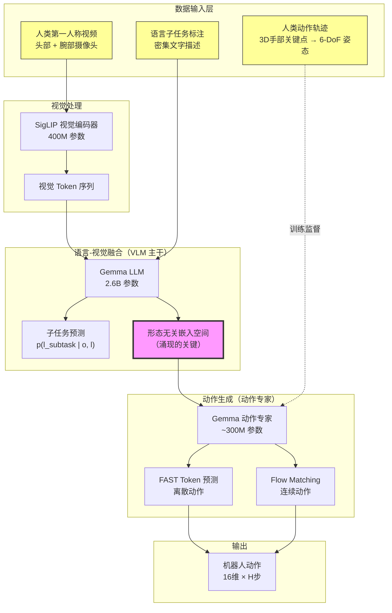
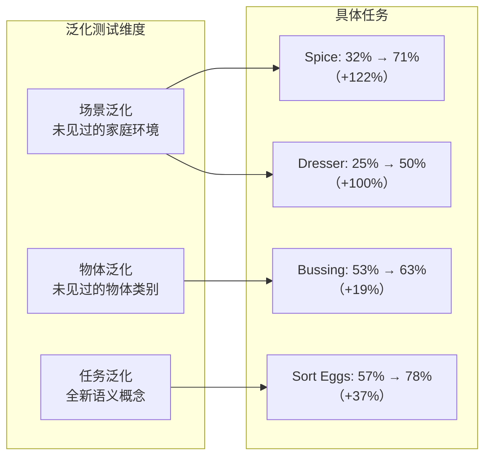
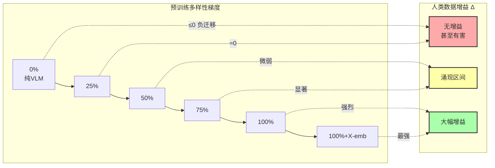
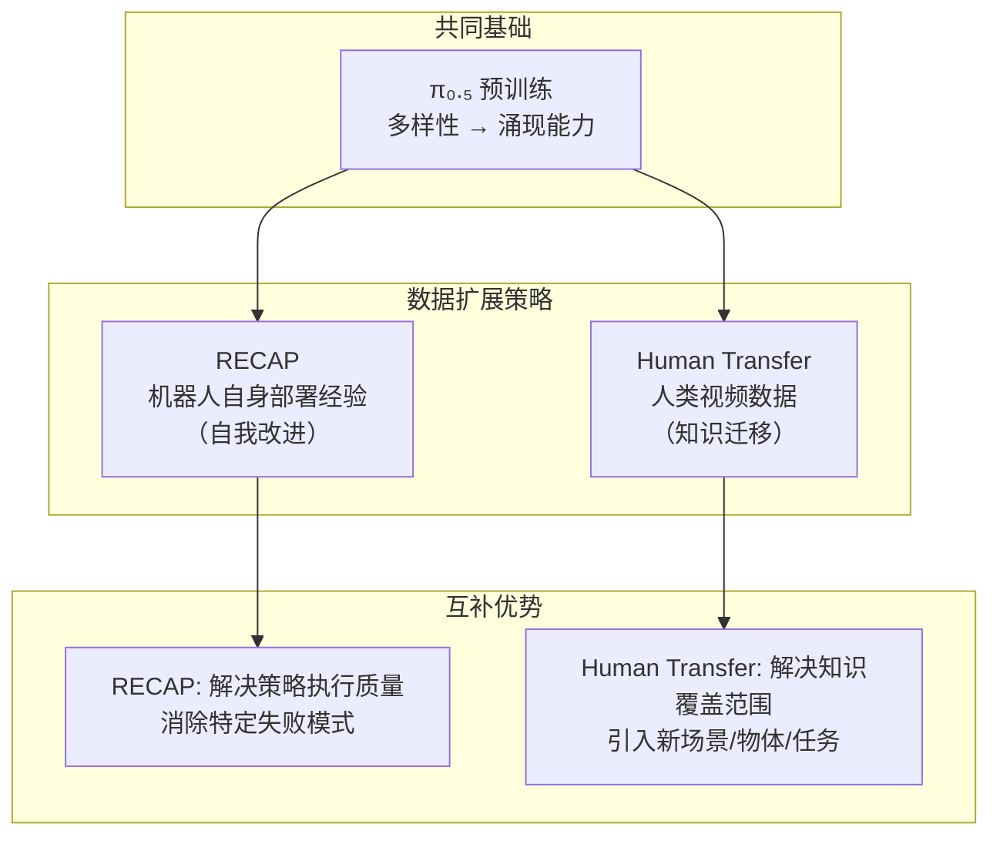

# 第十一章：人类到机器人迁移的涌现 — Emergence of Human to Robot Transfer in VLA Models

## 论文信息

- **标题**: Emergence of Human to Robot Transfer in Vision-Language-Action Models
- **发表时间**: 2025-12-27
- **arXiv**: https://arxiv.org/abs/2512.22414
- **核心作者**: Simar Kareer, Karl Pertsch, James Darpinian, Judy Hoffman, Danfei Xu, Sergey Levine, Chelsea Finn, Suraj Nair
- **机构**: Physical Intelligence, Georgia Institute of Technology
- **基础模型**: 基于 $\pi_{0.5}$ 架构

---

## 1. 解决了什么问题 & 相对前作的定位

### 1.1 机器人数据瓶颈：制约规模化的根本障碍

机器人学习面临一个看似无解的矛盾：行为克隆需要大量高质量的操作示教数据，但机器人数据的采集成本极高。即使是 $\pi_{0.5}$（第七章）动用了约 10,000 小时的机器人遥操作数据、覆盖 100 多个家庭环境，其数据规模与互联网上可获取的人类视频相比仍然微不足道。YouTube 上仅烹饪类视频就有数十亿小时，涵盖了几乎所有日常操作场景。如果机器人能直接从人类视频中学习操作技能，数据瓶颈将在很大程度上被解决。

然而，人类视频与机器人操作之间存在巨大的域差距（domain gap）：

- **视觉差异**: 人类第一人称视角 vs 机器人固定/腕部摄像头视角
- **运动学差异**: 人手五指灵巧操作 vs 机器人末端执行器（平行夹爪/灵巧手）
- **动力学差异**: 人类肌肉驱动的柔顺控制 vs 机器人关节刚性控制
- **形态差异**: 人类身体的自由度远高于当前机器人

### 1.2 先前方法的局限

在本文之前，人类视频到机器人策略的迁移方法大致分为三类，每种都有固有局限：

| 方法类别 | 代表工作 | 核心思路 | 局限性 |
|---------|---------|---------|--------|
| 视觉特征迁移 | R3M, VIP | 用人类视频训练更好的视觉编码器 | 无法直接改善动作预测 |
| 中间表征代理 | Track2Act, MimicPlay | 通过关键点追踪、潜在动作等代理任务间接对齐 | 需要手工设计对齐结构，泛化性受限 |
| 显式域适应 | AR2-D2, EgoBridge | 通过 AR/VR 叠加或对抗训练显式对齐人机域 | 工程复杂度高，适用任务范围窄 |

这些方法的共同问题是：它们都试图通过**人工设计的桥接机制**来跨越人机域差距，而这些机制本身就限制了可迁移的任务类型和泛化范围。

### 1.3 涌现能力的类比与核心发现

本文的核心发现令人惊讶且具有范式转换意义：**人类到机器人的迁移不需要任何专门设计的对齐机制，它作为一种涌现能力（emergent capability），在 VLA 的预训练数据足够多样时自发出现。**

这一发现与大语言模型（LLM）领域的涌现能力高度类似：

$$
\text{LLM涌现} \begin{cases}
\text{少样本学习} & \text{--- 模型规模超过阈值后突然出现} \\
\text{思维链推理} & \text{--- 无需专门训练，自发涌现}
\end{cases}
$$

$$
\text{VLA涌现} \begin{cases}
\text{人类→机器人迁移} & \text{--- 预训练多样性超过阈值后突然出现} \\
\text{形态无关表征} & \text{--- 无需显式对齐，自发形成}
\end{cases}
$$

关键差异在于：LLM 的涌现能力与**模型规模**（参数量）相关，而 VLA 的涌现能力与**数据多样性**（场景、任务、机器人形态的覆盖广度）相关。

### 1.4 与 $\pi_{0.5}$ 和 RECAP 的定位关系

本文与前两章的关系构成了一条清晰的逻辑链：

- **$\pi_{0.5}$（第七章）** 在预训练中包含了人类视频数据，但其初衷是维护 VLM 骨干的视觉-语言知识，而非实现动作迁移。没有人预料到这些数据会使模型获得跨形态迁移能力。
- **RECAP（第十章）** 通过机器人自主部署经验进行强化学习改进，但数据来源被限制在机器人自身的操作经历中。无论迭代多少轮，RECAP 都无法利用海量的人类操作视频。
- **本文** 揭示了一条全新的数据利用路径：通过足够多样的预训练，VLA 自发形成了人机共享的语义空间，使得人类视频可以直接增强机器人策略的泛化能力。

如果将三者放在一起审视，一个宏大的学习范式浮现出来：$\pi_{0.5}$ 提供了基础能力和多样性预训练，人类视频迁移（本文）提供了近乎无限的新场景/新任务知识，RECAP 提供了持续自我改进的机制。三者联合，机器人学习的数据瓶颈和性能上限都将被大幅突破。

---

## 2. 创新点

### 创新点 1：发现人类到机器人迁移的涌现性质 --- 变革性

这是本文最核心的贡献。作者不是"设计"了一种迁移方法，而是"发现"了一种涌现现象：当 VLA 的预训练数据覆盖足够多的场景-任务-形态组合时，模型无需任何显式对齐步骤，就能从人类视频中提取可用于机器人执行的操作知识。这一发现改变了研究社区对人机迁移问题的基本认知——从"需要设计复杂的对齐算法"转向"只需确保预训练足够多样"。

### 创新点 2：阈值效应的量化表征 --- 重要

论文系统地量化了迁移能力的涌现阈值。通过构建从 0% 到 100%+X-emb 的预训练多样性梯度，作者精确地展示了迁移效果在 50%-75% 多样性区间发生质变的过程。这不是一个渐进的线性改善，而是一个存在明确"拐点"的非线性涌现过程：

$$
\Delta_{\text{transfer}}(d) = \text{Score}_{\text{human+robot}}(d) - \text{Score}_{\text{robot-only}}(d) \approx \begin{cases} \leq 0 & d < d_{\text{threshold}} \\ \gg 0 & d \geq d_{\text{threshold}} \end{cases}
$$

其中 $d$ 表示预训练数据多样性，$d_{\text{threshold}}$ 大约对应 50%-75% 的多样性水平。

### 创新点 3：零/少样本人类视频到机器人执行的迁移 --- 重要

在仅有约 14 小时人类视频数据的情况下，通过简单的 50:50 共训练配方，模型在目标任务上的性能几乎翻倍。特别是在 Sort Eggs 任务中，排序这一语义概念**完全不存在**于机器人数据中，仅通过人类视频引入，机器人就掌握了按颜色分拣鸡蛋的能力（准确率从 57% 提升至 78%）。

### 创新点 4：形态无关表征的涌现证据 --- 重要

通过 t-SNE 分析，论文提供了涌现机制的可视化证据：随着预训练多样性增加，人类数据和机器人数据在 VLA 最终层输出的嵌入空间中从明显分离逐渐融合为重叠分布。这表明模型自发形成了**形态无关的统一表征空间**，将人类和机器人的操作映射到共享的语义结构中。

---

## 3. 数据来源、处理方式及其原因

### 3.1 人类数据采集

**采集设备**: 操作员佩戴头戴式高分辨率摄像头提供第一人称视角，以及左右腕部摄像头（可选）提供近距离操作视角，模拟机器人的多相机观测配置。

**采集规模与分配**:

| 任务 | 数据时长 | 泛化测试维度 |
|------|---------|------------|
| Bussing（收拾餐桌） | 3 小时 | 物体泛化 — 引入新物体类别 |
| Spice（整理调料架） | 3 小时 | 场景泛化 — 未见过的厨房 |
| Dresser（整理梳妆台） | 3 小时 | 场景泛化 — 未见过的卧室 |
| Sort Eggs（鸡蛋分拣） | 5 小时 | 任务泛化 — 全新语义概念 |

总计约 14 小时，与 $\pi_{0.5}$ 预训练中的上万小时机器人数据相比微乎其微。

### 3.2 数据处理流水线

人类视频数据经过以下处理步骤，被转化为与机器人数据格式一致的训练样本：

**6D 相机轨迹重建**: 使用 Visual SLAM 从头戴摄像头视频中重建摄像头相对于世界坐标系的 6D 运动轨迹 $e_t \in \mathbb{R}^6$。

**3D 手部关键点提取**: 提取双手各 17 个 3D 关键点 $h_t^{et} \in \mathbb{R}^{3 \times 17}$，以头部摄像头坐标系为参考。

**末端执行器姿态定义**: 从掌心、中指和无名指的关键点构造"末端执行器"的 6-DoF 姿态，用于近似机器人末端执行器的位姿：

$$
a_{\text{human}} = [\underbrace{\Delta p_{\text{left}}, \Delta R_{\text{left}}}_{6\text{-DoF 左手}}, \underbrace{\Delta p_{\text{right}}, \Delta R_{\text{right}}}_{6\text{-DoF 右手}}, \underbrace{\Delta b}_{2\text{-D 底盘}}] \in \mathbb{R}^{H \times 14}
$$

对比机器人动作空间：

$$
a_{\text{robot}} = [\underbrace{\Delta p_{\text{left}}, \Delta R_{\text{left}}, g_{\text{left}}}_{7\text{-DoF 左臂+夹爪}}, \underbrace{\Delta p_{\text{right}}, \Delta R_{\text{right}}, g_{\text{right}}}_{7\text{-DoF 右臂+夹爪}}, \underbrace{\Delta b}_{2\text{-D 底盘}}] \in \mathbb{R}^{H \times 16}
$$

关键设计决策：**不显式估计夹爪动作**。人手在操作过程中的"开合"难以准确估计，因此夹爪动作完全依赖机器人数据学习。这体现了"最小对齐"的设计哲学——只对齐那些可以可靠对齐的维度，其余交给模型自身去学习。

**密集语言标注**: 对人类视频进行子任务级别的文字标注（与 $\pi_{0.5}$ 的标注格式一致），如"拿起红色鸡蛋"、"放入左侧蛋盒"等。

### 3.3 预训练数据多样性梯度

为系统研究涌现阈值，作者构建了六个级别的预训练数据集：

| 多样性级别 | 数据组成 | 目的 |
|-----------|---------|------|
| 0% | 仅 VLM 初始化（无机器人数据） | 基线：纯视觉-语言模型 |
| 25% | 25% [场景-任务] 组合，仅目标形态 | 低多样性参照 |
| 50% | 50% [场景-任务] 组合，仅目标形态 | 中等多样性参照 |
| 75% | 75% [场景-任务] 组合，仅目标形态 | 接近阈值 |
| 100% | 全部 [场景-任务] 组合，仅目标形态 | 高多样性 |
| 100% + X-emb | $\pi_{0.5}$ 完整预训练数据（含多种非目标形态） | 最高多样性 |

其中"目标形态"限定为 ARX 和移动 ARX 机器人。100% + X-emb 额外引入 UR5 等非目标机器人形态的数据，测试跨形态多样性对迁移的影响。

---

## 4. 模型结构及设计原因

### 4.1 架构选择：$\pi_{0.5}$ 不变

本文最引人注目的结论之一是：**实现人类到机器人的迁移不需要任何架构修改**。模型直接使用 $\pi_{0.5}$ 的双流架构——PaliGemma VLM（SigLIP 视觉编码器 + Gemma LLM）与 Gemma 动作专家的组合。这一事实本身就是"涌现"论点的最强证据：迁移能力不是被设计出来的，而是从数据多样性中自发生长出来的。

### 4.2 人类视频如何流经 VLA

下图展示了人类视频数据在 VLA 中的完整处理路径：

### 4.3 涌现的核心机制：形态无关表征

迁移之所以能发生，关键在于 VLM 骨干将人类操作和机器人操作映射到了**同一个语义空间**中。通过对 VLA 最终层输出进行 t-SNE 分析，论文揭示了这一过程：

设 $\phi_\theta(o)$ 为 VLA 对观测 $o$ 的内部表征（均值池化最终 200 个输出 token），定义人机表征对齐度为：

$$
\text{Alignment}(\theta, d) = 1 - \frac{D_{\text{KL}}\left[\phi_\theta^{\text{human}} \| \phi_\theta^{\text{robot}}\right]}{D_{\text{KL}}\left[\phi_{\theta_0}^{\text{human}} \| \phi_{\theta_0}^{\text{robot}}\right]}
$$

其中 $\theta_0$ 为未预训练的初始参数，$d$ 为预训练多样性。实验观察到：

- $d = 0\%$: 人机表征完全分离，模型对两类数据建立独立的内部表示
- $d = 25\% \sim 50\%$: 开始出现微弱的表征重叠
- $d = 75\% \sim 100\%$: 表征显著融合，任务语义结构清晰可见
- $d = 100\% + \text{X-emb}$: 最高对齐度，形态边界几乎消失

这一发现的深层含义是：VLM 骨干本质上是一个**语义压缩器**，当它见过足够多样的"同一任务在不同形态上执行"的案例后，就会自然地学到任务的形态不变表征——就像人类不会因为换了把螺丝刀就不会拧螺丝一样。

---

## 5. 训练方法（算法与工程）

### 5.1 核心方法论：极简共训练

本文的训练方法可以用一句话概括：**将人类视为另一种机器人形态，使用完全相同的训练目标进行共训练。** 没有域适应损失，没有对抗训练，没有表征对齐模块——什么都没有。

**微调配方**: 人类数据与最近邻机器人任务数据以 50:50 比例混合，使用两个训练目标：

$$
\mathcal{L}_{\text{total}} = \underbrace{\mathcal{L}_{\text{CE}}(l_{\text{subtask}})}_{\text{子任务预测}} + \underbrace{\mathcal{L}_{\text{CE}}(a^{\text{FAST}}) + \mathcal{L}_{\text{FM}}(a^{\text{cont}})}_{\text{动作预测}}
$$

其中交叉熵损失 $\mathcal{L}_{\text{CE}}$ 用于离散 FAST token 和子任务文本的 next-token prediction，flow matching 损失 $\mathcal{L}_{\text{FM}}$ 用于连续动作生成。**人类数据和机器人数据使用完全相同的损失函数**。

### 5.2 为什么"什么都不做"反而是最好的选择

这看似反直觉的设计背后有深刻的道理。先前的工作（如 EgoBridge）发现，在小规模数据上共训练人机数据会导致表征分离——模型分别拟合两个分布而非学习共享结构。因此这些工作引入显式对齐损失来强制表征融合。

但本文揭示：**表征分离是预训练不足的症状，而非需要手术治疗的疾病。** 当预训练足够多样时，模型内部自然形成形态无关的表征，共训练自动产生对齐的嵌入，不需要任何外部干预。

这与 LLM 领域的经验一致：早期的小模型需要精心设计的 prompt engineering 才能执行指令跟随，但当模型规模超过阈值后（如 GPT-3 的 175B 参数），简单的 few-shot prompting 就能工作。**规模解决了对齐问题。**

### 5.3 训练流程对比

| 方面 | 传统人机迁移方法 | 本文（$\pi_{0.5}$ + ego） |
|------|----------------|-------------------------|
| 预训练 | 通常不涉及 | 大规模多样性预训练（关键） |
| 对齐机制 | 关键点映射 / 域适应 / 对抗训练 | 无 |
| 微调配方 | 复杂的多阶段流程 | 50:50 简单混合 |
| 损失函数 | 任务损失 + 对齐损失 | 仅标准任务损失 |
| 工程复杂度 | 高 | 极低 |
| 泛化范围 | 受限于对齐结构 | 理论上无限 |

---

## 6. 实验关键发现与效果对比

### 6.1 四维度泛化基准的性能提升

| 任务 | 仅机器人数据 | 机器人+人类数据 | 提升幅度 | 泛化维度 |
|------|------------|---------------|---------|---------|
| Spice | 32% | 71% | +122% | 场景泛化 |
| Dresser | 25% | 50% | +100% | 场景泛化 |
| Bussing | 53% | 63% | +19% | 物体泛化 |
| Sort Eggs | 57% | 78% | +37% | 任务泛化 |

Sort Eggs 任务尤为值得关注：机器人数据中只包含"拿鸡蛋放入蛋盒"的操作，完全没有"按颜色分拣"的概念。仅机器人数据训练的模型只能随机放置鸡蛋（57% 准确率近似随机），而加入人类视频后模型掌握了颜色分拣语义，平均多正确放置 4 个鸡蛋。这是**纯粹的任务级语义迁移**，从人类视频中学到了一个全新的任务概念。

### 6.2 涌现曲线：预训练多样性与迁移效果

这一涌现曲线的核心特征：

1. **负迁移区域**（0%-25%）: 预训练不足时，加入人类数据非但无用，还可能有害。模型无法在人机数据间建立有意义的关联，反而被人类数据的分布外样本干扰。

2. **涌现拐点**（50%-75%）: 迁移效果在此区间急剧增长，从近乎零跃升为显著正增益。这一阈值效应是"涌现"一词的核心依据。

3. **持续增长区域**（75%-100%+X-emb）: 超过阈值后，迁移效果随多样性继续增长，且跨形态数据（X-emb）提供额外收益，暗示更大规模的预训练将带来更强的迁移能力。

### 6.3 Sort Eggs 的特殊洞察

Sort Eggs 任务的缩放分析特别有说明力：

$$
\text{Score}_{\text{robot-only}}(d) \approx \text{const.} \quad \forall d \geq 25\%
$$

$$
\text{Score}_{\text{human+robot}}(d) \propto f(d) \quad \text{(递增函数)}
$$

纯机器人数据微调的性能随预训练多样性增加后迅速饱和——因为"排序"这一概念在机器人数据中根本不存在，再多的预训练多样性也无法无中生有。但加入人类数据后，性能随预训练多样性持续攀升。这证明：**预训练多样性不是直接提供任务知识，而是赋予模型"从异构数据中提取知识"的能力。**

### 6.4 人类数据 vs 目标机器人数据 vs 跨形态机器人数据

| 数据来源 | Sort Eggs | Dresser | Bussing |
|---------|----------|---------|---------|
| 仅基线机器人数据 | 57% | 25% | 53% |
| + 人类数据 | 78% | 50% | 63% |
| + 目标机器人数据（上界） | ~80% | ~55% | 88% |

在 Sort Eggs 和 Dresser 上，人类数据微调的效果接近目标机器人数据，说明对这些任务而言，人类视频几乎可以替代机器人数据。但在 Bussing 任务上差距较大（63% vs 88%），表明涉及精细操作（如准确放入垃圾桶/餐具箱）的任务仍然受益于机器人本体的直接经验。

在 Bussing 任务上的跨形态对比更为有趣：用 UR5 机器人数据向 ARX 迁移的效果与用人类数据迁移的趋势高度相似——都超过基线，但都不及目标机器人数据。这表明**人类到机器人迁移本质上是跨形态迁移的一个实例**，遵循相同的机制和规律。

---

## 7. 消融实验的发现

### 7.1 预训练多样性消融（影响最大）

这是全文最关键的消融实验，其结论已在 6.2 节详述。补充一个重要发现：在某些任务上，**预训练多样性的增加不改善零样本泛化，但改善了从人类数据迁移的能力。** 例如 Dresser 任务在 75%→100% 多样性区间，纯机器人模型的零样本性能几乎未变，但加入人类数据后的迁移增益却显著增加。这意味着预训练多样性的价值不仅在于直接提升性能，更在于**打开了新的学习通道**——使模型能从先前无法利用的数据源中获取知识。

### 7.2 高层 vs 低层迁移消融（影响较大）

在 Spice 和 Dresser 这两个使用层次化策略的任务上，论文测试了四种组合：

| 组合 | 高层策略 | 低层策略 | 效果 |
|------|---------|---------|------|
| 基线 | 仅机器人 | 仅机器人 | 最差 |
| 仅高层迁移 | 共训练 | 仅机器人 | 中等偏差 |
| 仅低层迁移 | 仅机器人 | 共训练 | 中等偏差 |
| 双层迁移 | 共训练 | 共训练 | 最佳 |

失败模式分析揭示了高低层必须协调的原因：
- **仅高层迁移时**: 高层策略能正确生成子任务（如"拿起调料瓶"），但低层策略因未见过人类数据中的场景，会错误执行指令（如拿已经在托盘上的瓶子而非桌上的）。
- **仅低层迁移时**: 低层动作执行可能有所改善，但高层策略因未从人类数据学习，会生成过时或错误的子任务（如反复预测"拿起调料瓶"即使已经拿在手中）。

这一发现的意义在于：人类视频同时提供了**语义知识**（做什么）和**操作知识**（怎么做），两者必须同时迁移才能产生协同效果。

### 7.3 腕部摄像头消融（影响中等）

| 任务 | 无腕部摄像头 | 有腕部摄像头 | 变化 |
|------|------------|------------|------|
| Bussing | 较低 | 较高 | 正向 |
| Dresser | 较低 | 较高 | 正向 |
| Spice | 相当 | 相当 | 无差异 |
| Sort Eggs | 相当 | 相当 | 无差异 |

腕部摄像头的影响因任务而异，取决于任务对近距离观察的依赖程度。作者建议大规模人类数据采集应标配腕部摄像头，以覆盖最广泛的任务空间。

### 7.4 消融发现总排名

按对迁移效果的影响从大到小排列：

1. **预训练数据多样性** — 决定性因素，是涌现的根本驱动力
2. **高低层联合迁移** — 必须同时使用人类数据训练两层策略
3. **跨形态预训练数据** — 非目标形态的数据进一步增强迁移
4. **腕部摄像头** — 对部分任务有帮助，建议标配

---

## 8. 优化有效性评估

### 8.1 预训练多样性：唯一真正重要的"优化"

与传统迁移学习方法不同，本文的"优化"不是某个具体的算法技巧，而是一个宏观层面的发现：**预训练数据的多样性是唯一真正重要的因素。** 不需要设计域适应损失，不需要构建对齐模块，不需要调节迁移超参数——只需要确保预训练覆盖足够多的场景、任务和形态。

这一发现的实践价值在于它大幅降低了人机迁移的工程门槛。研究者不再需要为每个新任务设计专门的迁移管道，只需要将人类数据以标准格式加入训练混合即可。

### 8.2 VLM 骨干：人机域的语义桥梁

VLM 骨干在迁移中扮演的角色值得深入理解。SigLIP 视觉编码器在大规模图像-文本对上预训练，已经学到了丰富的视觉语义知识。当它看到一个人拿起瓶子和一个机器人拿起瓶子时，它能提取出共同的语义——"拿起瓶子"。Gemma LLM 则将这些视觉语义与语言指令关联，建立了任务级别的抽象理解。

$$
\underbrace{\text{SigLIP}}_{\text{共享视觉语义}} + \underbrace{\text{Gemma LLM}}_{\text{语言-任务映射}} + \underbrace{\text{多样性预训练}}_{\text{形态不变性}} \Rightarrow \underbrace{\text{形态无关表征}}_{\text{涌现}}
$$

这三个要素缺一不可：SigLIP 提供视觉共性基础，Gemma 提供语义抽象能力，多样性预训练则通过大量"同一任务不同形态"的训练对迫使模型将形态信息从任务表征中剥离。

### 8.3 与先前方法的根本性差异

| 评估维度 | 显式对齐方法 | 本文涌现方法 |
|---------|------------|------------|
| 核心假设 | 人机域差距需要显式弥合 | 域差距在足够多样性下自动消失 |
| 所需工程量 | 高（每个任务/域需要定制） | 极低（标准共训练） |
| 可扩展性 | 差（对齐模块限制泛化） | 好（多样性增加则迁移增强） |
| 理论解释 | 域适应理论 | 涌现能力理论（类比LLM） |
| 数据效率 | 对齐数据需求高 | 仅需少量人类数据 |

### 8.4 证据强度排名

1. **涌现曲线**（多样性 vs 迁移增益）— 最强证据，直接量化了阈值效应
2. **t-SNE 表征分析** — 可视化解释了涌现机制
3. **Sort Eggs 任务迁移** — 证明了纯语义概念（排序）的跨形态迁移
4. **人类 vs 跨形态机器人对比** — 证明了人类迁移与机器人间迁移遵循相同机制

---

## 9. 与后续工作的关联

### 9.1 $\pi_{0.7}$（第十四章）：从涌现发现到显式利用

本文发现人类视频可以增强 VLA 的泛化能力是"无心插柳"的涌现现象。$\pi_{0.7}$ 则将这一发现转化为**显式的训练策略**，在预训练阶段大规模引入人类视频数据作为正式训练数据源，而非仅在微调阶段使用少量人类视频。这一演进路径清晰地展示了 PI 的研究方法论：先发现涌现现象 → 理解其机制 → 在下一代模型中系统性地利用。

### 9.2 MEM（第十二章）：人类演示作为记忆来源

MEM 探索了将过往经验作为"记忆"注入策略推理过程的方法。本文的发现为 MEM 打开了一个可能性：如果人类操作视频可以直接提升机器人策略，那么人类操作的视频片段也可能作为"记忆"被检索和利用——机器人在面对新任务时，不仅可以回忆自己的经历，还可以"回忆"人类是如何完成类似任务的。

### 9.3 RECAP（第十章）的互补性

RECAP 与本文在数据来源上是完美互补的：

RECAP 的强项是提升已有任务的执行质量（成功率和速度），但它无法引入全新的任务概念。人类视频迁移的强项是扩展模型的知识边界（新场景、新物体、新任务语义），但它不直接解决策略执行的精细化问题。两者结合——先用人类视频扩展知识范围，再用 RECAP 精炼执行质量——构成了一条通往通用机器人智能的完整路径。

### 9.4 数据丰裕性的哲学意义

本文最深远的影响可能不在技术层面，而在认知层面。它暗示了一个根本性的范式转变：

**旧范式**: 机器人必须从头学习每一项技能，数据采集是最大瓶颈。

**新范式**: 人类文明积累的海量操作视频是机器人可以直接利用的知识库。互联网上的烹饪视频、家务视频、手工制作视频——这些都是潜在的机器人训练数据。

如果将这一发现推向极致：**机器人不需要被从零教会一切，它们可以通过观看人类来学习。** 就像人类儿童通过观察成人行为来学习操作技能一样，VLA 通过观看人类视频来掌握新的操作概念。这不是类比——这是本文用实验数据证明了的事实。

### 9.5 开放问题与未来方向

1. **被动人类视频的利用**: 本文使用的是"主动"采集的分集式人类视频，操作员被要求重复执行特定任务。能否利用 YouTube 等平台上的"被动"人类视频（非结构化、自然发生的操作行为）仍待探索。
2. **预训练阶段的人类数据**: 本文仅在微调阶段使用人类数据。在预训练阶段大规模引入人类视频是否能进一步降低涌现阈值？$\pi_{0.7}$ 可能给出答案。
3. **灵巧手的迁移**: 人手的自由度远高于平行夹爪，当机器人配备灵巧手时，人机迁移的效果是否会更好？
4. **涌现阈值的理论解释**: 目前对阈值的理解仍停留在经验观察层面，缺乏严格的理论框架来预测何时何种数据组合会触发涌现。

---

## 总结：涌现的力量

本文的贡献可以凝练为一个核心洞见：**在足够多样的预训练之上，复杂的对齐问题自行解决。** 这与过去十年机器人学领域"为每个问题设计专门算法"的研究范式形成了鲜明对比。就像 GPT 系列证明了"只需要足够大的 Transformer + 足够多的文本数据"就能涌现出令人惊叹的语言能力一样，本文证明了"只需要足够多样的机器人预训练 + 简单的共训练"就能涌现出跨形态迁移能力。

这一发现不仅解决了一个具体的技术问题（如何利用人类视频），更指向了一个更深层的研究方向：**VLA 还有哪些尚未被发现的涌现能力？** 随着预训练规模和多样性的持续增长，我们可能会看到更多超出预期的能力从模型中自发浮现。这正是基础模型研究最令人兴奋的前景。
