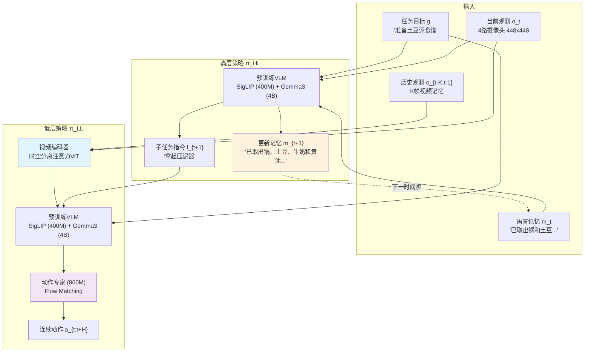
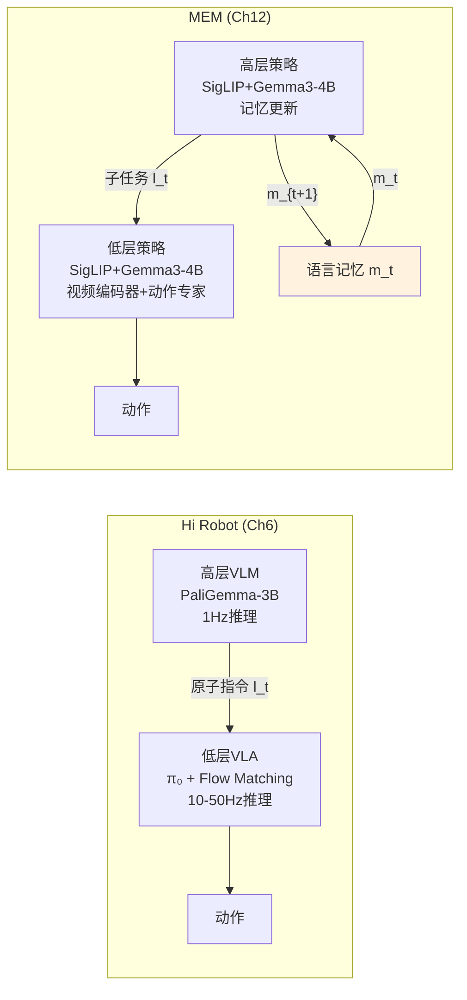
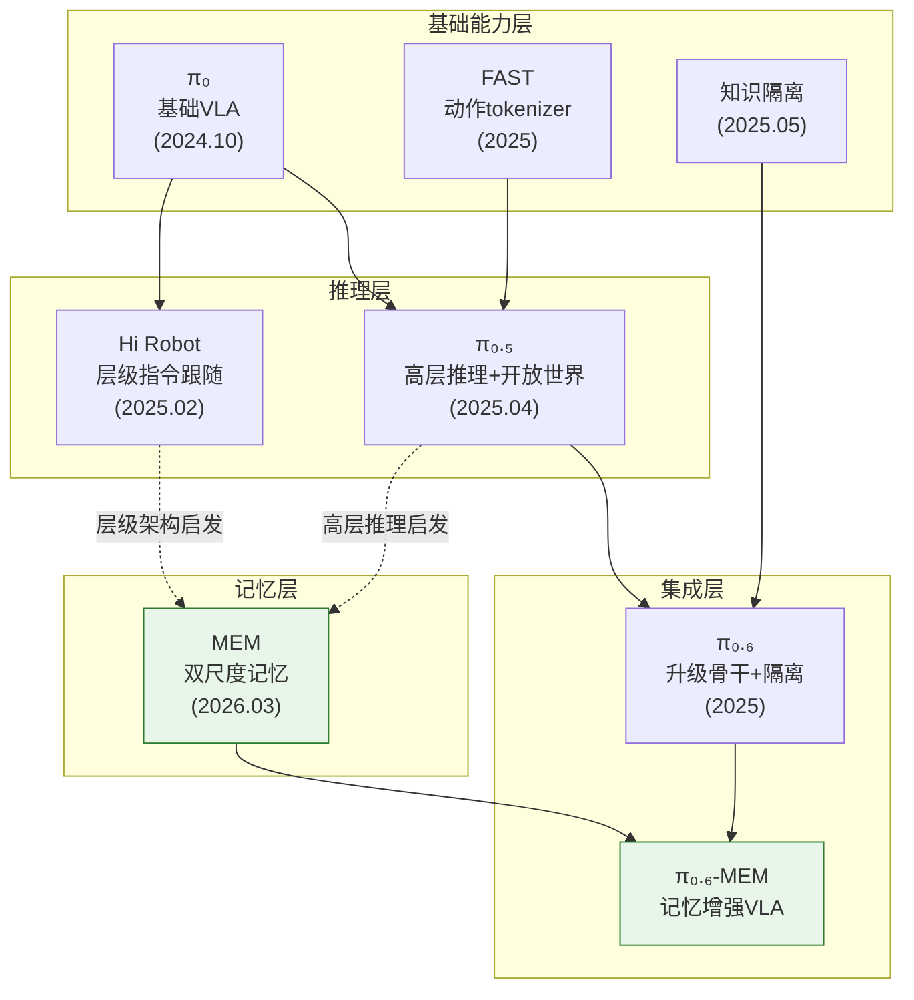

# 第十二章：MEM — 多尺度具身记忆：赋予VLA长时程自主能力

## 论文信息

- **标题**: MEM: Multi-Scale Embodied Memory for Vision Language Action Models
- **发表时间**: 2026年3月4日 (arXiv v2: 2026年3月8日)
- **arXiv**: https://arxiv.org/abs/2603.03596
- **项目主页**: https://pi.website/research/memory
- **核心作者**: Marcel Torne\* (PI/Stanford), Karl Pertsch\* (PI), Homer Walke (UC Berkeley), Kyle Vedder, Suraj Nair, Brian Ichter, Allen Z. Ren, Haohuan Wang, Jiaming Tang (MIT), Kyle Stachowicz, Karan Dhabalia, Michael Equi, Quan Vuong, Jost Tobias Springenberg, Sergey Levine, Chelsea Finn, Danny Driess (Physical Intelligence)
- **贡献说明**: DD与HW启动项目；DD/HW/JTS设计视频编码器与短期记忆系统；KP设计长期语言记忆系统；MT/KP/HW/KV/SN/ME设计评估套件并执行实验

---

## 1. 解决了什么问题 & 相对前作的定位

### 1.1 核心问题：VLA的"金鱼记忆"困境

在真实世界中，大量有价值的操作任务跨度远超当前VLA模型的感知窗口。清理一整个厨房需要10-15分钟——擦拭台面、洗碗、将物品归位、关闭柜门。准备一顿饭需要追踪食谱中已完成和待完成的步骤。制作烤奶酪三明治需要精确计时每面的烹饪时间。这些任务对人类而言司空见惯，但对当前最先进的VLA模型而言，它们构成了根本性的挑战。

问题的本质在于VLA模型缺乏有效的记忆机制。以PI此前发布的模型为例：

- **$\pi_0$（第三章）**: 纯粹的反应式策略，每一步仅根据当前单帧观测生成动作。它完全不知道自己5秒钟前做了什么，更遑论5分钟前。
- **$\pi_{0.5}$（第七章）**: 引入了高层推理能力，能够将复杂任务分解为子任务序列，但其上下文窗口仍然极其有限——仅包含当前观测帧和任务指令。模型能"思考"下一步该做什么，但无法"记住"已经做过什么。如论文所述，$\pi_{0.5}$在mock家庭中执行2-5分钟的任务时表现良好，但这依赖于环境状态本身能暗示进度（如碗已经在水槽里了，所以不需要再搬），而非模型的主动记忆。
- **Hi Robot（第六章）**: 建立了层级式推理架构，高层VLM每秒产生子任务指令，低层VLA执行原子操作。但Hi Robot的高层策略同样缺乏跨时间步的记忆——它在每个决策点独立地观察当前场景并做出判断。如果机器人被打断或环境被外部改变，Hi Robot无法追溯自己此前的行动轨迹。

### 1.2 为什么简单延长上下文窗口行不通

理论上，最直接的解决方案是将所有历史观测编码进模型的上下文窗口。然而，如论文Figure 3所示，这在工程上完全不可行：在$\pi_{0.6}$ VLA上使用4路摄像头时，逐帧编码16帧图像的推理延迟超过4秒。而先前研究已证明，灵巧操作任务要求推理延迟控制在300毫秒以内——超过这个阈值，机器人的执行性能会显著退化。一个15分钟的任务在50Hz控制频率下包含45,000个时间步、每步4个摄像头视角，产生180,000帧图像。将这些全部编码进上下文不仅在延迟上不可行，在内存上同样是灾难性的。

### 1.3 先前记忆方法的局限性

机器人学中已有多种记忆方案的探索，但每种方法都面临单一模态的根本限制：

| 方法类别 | 代表工作 | 核心限制 |
|---------|---------|---------|
| 循环记忆模块 | Rahmatizadeh et al. (2018) | 仅在短时程任务上验证，长期记忆保持能力存疑 |
| 密集观测历史 | Behavior Transformers, Octo | 计算和延迟约束使其无法扩展至长时程 |
| 潜在记忆架构 | CronusVLA, SAM2Act, MemoryVLA | 仅在短时程记忆任务上评估 |
| 本体感知记忆 | TA-VLA | 丢失环境视觉信息（如物体位置） |
| 2D点轨迹 | TraceVLA | 丢失抓取角度和高度等精确空间信息 |
| 关键帧选择 | MeMeR, CycleManip, BPP | 需激进稀疏化，丧失动态估计能力 |
| 纯语言记忆 | OneTwoVLA | 丢失精细空间信息（如修正滑落抓取所需的角度） |

MEM的核心洞见在于：**不同时间尺度的记忆需要不同的表征模态**。短期记忆需要密集的视觉信息来处理遮挡和适应操作策略；长期记忆需要高度压缩的语义信息来追踪任务进度。试图用单一模态解决所有记忆需求必然导致某方面的妥协。

### 1.4 与$\pi_{0.5}$和Hi Robot的关系

MEM不是对$\pi_{0.5}$或Hi Robot的替代，而是对它们的能力补全。从PI技术栈的演进角度来看：

```
π₀ (2024.10): 反应式策略，无推理无记忆
  ↓
π₀.₅ (2025.04): 添加高层推理（子任务分解），但无记忆
  ↓
Hi Robot (2025.02): 外化层级推理为独立VLM，支持人机交互，但无记忆
  ↓
π₀.₆ (2025): 升级骨干至Gemma3-4B，引入知识隔离，仍无记忆
  ↓
π₀.₆-MEM (2026.03): 在π₀.₆基础上添加双尺度记忆，实现15分钟自主
```

值得注意的是，MEM集成在$\pi_{0.6}$而非$\pi_{0.5}$上。$\pi_{0.6}$本身已经整合了知识隔离（Knowledge Insulation，第十章）的设计理念，而MEM进一步继承并延伸了这一原则——记忆模块的梯度同样不回传至VLM骨干。

---

## 2. 创新点

### 创新点1：双尺度混合模态记忆架构 [变革性]

MEM的核心设计是将记忆分解为两个互补的子系统，各自使用最适合其时间尺度的表征模态：

- **短期视频记忆**（秒级）：通过高效视频编码器压缩最近K帧观测，保留密集的空间-时间细节
- **长期文本记忆**（分钟级至小时级）：通过自然语言摘要压缩语义事件历史，保留高层任务进度

这种"视频+文本"的双尺度设计，在概念上类似于人类记忆中的工作记忆（working memory）与情景记忆（episodic memory）的分离。工作记忆容量有限但细节丰富，情景记忆容量巨大但以语义压缩形式存储。MEM首次在机器人策略中实现了这种认知科学启发的记忆分层。

**意义**：这是一个框架级的贡献，为机器人记忆问题提供了原则性的架构范式。它不仅解决了"如何让VLA记住过去"的问题，更重要的是回答了"用什么形式记忆什么"的问题。

### 创新点2：零参数增量的视频编码器 [重要]

MEM的视频编码器在标准ViT基础上进行了精巧的修改：

1. 每4层交替插入因果时间注意力操作
2. 使用时空分离注意力，将复杂度从$O(n^2K^2)$降至$O(Kn^2 + nK^2)$
3. 仅保留当前时间步的token表征传入VLA骨干
4. 不引入任何新的可学习参数——仅修改注意力模式并添加固定正弦时间位置编码

最关键的设计细节是：当$K=1$（单帧输入）时，编码器的初始化与原始预训练VLM完全一致（因为$e(0)=0$）。这保证了记忆能力的添加不会损害单帧性能，实现了从任意预训练VLM的无缝迁移。

**意义**：这使得MEM可以作为一个即插即用的记忆升级方案应用于任何基于ViT的VLA，而不会引入额外的参数初始化问题。

### 创新点3：自更新语言记忆机制 [变革性]

与Hi Robot的高层策略不同，MEM的高层策略$\pi_{HL}$不仅输出子任务指令$l_{t+1}$，还显式输出更新后的语言记忆$m_{t+1}$。这意味着模型自己决定何时更新记忆、更新什么内容、以及丢弃什么信息。

```
高层策略: π_HL(l_{t+1}, m_{t+1} | o_t, m_t, g)

记忆更新示例:
m_t: "我把一个盘子放进了柜子，移到了台面旁。"
  ↓
m_{t+1}: "我把一个盘子放进了柜子，移到了台面旁，拿起了一个碗。"
```

训练数据通过LLM标注管线生成：给定带子任务标注的机器人episode，LLM被指导生成压缩的语义摘要。关键创新在于指导LLM在适当时"遗忘"和压缩信息——例如将"放入了一个浅绿色碗、一个深蓝色碗和一个亮黄色碗"压缩为"放了三个碗到右上柜子"。

**意义**：这是首个在VLA中实现自回归式记忆更新的机制。与朴素的指令拼接相比，这种压缩机制有效解决了训练-推理分布偏移问题——推理时策略可能反复失败导致同一指令重复出现，而自更新记忆在子任务成功前不会更新，从而保持记忆分布与训练时一致。

### 创新点4：记忆模块与动作预测的隔离 [重要]

遵循知识隔离原则（Knowledge Insulation, Driess et al. 2025），MEM中动作专家（860M参数）的梯度不回传至VLM骨干。这意味着记忆模块的训练不会因为动作预测的信号而被扭曲——记忆专注于记忆，动作专注于动作。

**意义**：这一设计选择解释了为什么MEM在添加记忆后不会出现先前文献中广泛报告的"因果混淆"（causal confusion）导致的性能退化。先前的工作报告带记忆的策略经常学会简单地复制先前动作而非真正利用记忆信息，而MEM通过梯度隔离和多样化预训练数据有效避免了这一问题。

### 创新点5：上下文内操作策略适应 [重要]

MEM不仅为长时程任务提供记忆支持，还解锁了一种全新能力：策略可以在执行过程中根据最近的失败经验动态调整操作策略。例如，在抓取扁平物体（筷子）时，如果第一次抓取失败（因为桌面高度异常），策略可以在短期视频记忆中观察到失败的抓取尝试，从而在下一次尝试中调整抓取高度。

**意义**：这本质上是一种无需额外训练的"少样本学习"——模型通过自己的实时经验进行在线适应，而非反复以相同方式失败。这对商业部署至关重要，因为现实环境的变异性使得策略必须能够从错误中快速恢复。

---

## 3. 数据来源、处理方式及其原因

### 3.1 预训练数据

MEM的预训练数据与$\pi_{0.5}$/$\pi_{0.6}$类似，包含多源异构数据混合：

| 数据类别 | 内容 | 角色 |
|---------|------|------|
| 遥操作机器人示范 | 多平台、多任务的人类示范 | 核心操作技能 |
| 策略rollout数据 | 先前策略的自主执行轨迹 | 多样化行为分布 |
| 人类纠正数据 | 策略失败后的人类干预修正 | 错误恢复策略 |
| 视觉-语言任务 | 图像描述、VQA等 | 语义理解能力 |
| 视频-语言任务 | 视频字幕生成等 | 时序理解能力 |

预训练阶段使用6帧观测序列（5帧历史+当前帧），帧间隔1秒，覆盖约5秒的短期记忆窗口。图像分辨率为448$\times$448像素，最多支持4路摄像头流。

### 3.2 语言记忆标注管线

长期语言记忆的训练需要特殊的标注数据。论文开发了一条自动化管线：

```
输入: 机器人episode + 子任务语言标注 l₀:T + 成功/失败标志
  ↓
处理: 预训练LLM逐步摘要
  ↓
输出: 每个时间步的语言记忆 m_t（压缩后的语义历史）
```

LLM被明确指导执行信息压缩策略：
- **属性压缩**："浅绿色碗、深蓝色碗、亮黄色碗" → "三个碗"
- **位置摘要**：保留物品最终位置，丢弃中间移动路径
- **失败过滤**：失败的子任务尝试不进入记忆，仅在成功完成时更新
- **相关性筛选**：仅保留对未来任务执行仍然相关的信息

这种压缩策略服务于两个目的：（1）减少推理时的token数量以保持低延迟；（2）减少训练-推理分布偏移，因为携带的信息位数越少，发生偏移的可能性越低。

### 3.3 后训练数据

后训练阶段针对特定能力收集小规模数据集：

**长时程任务数据**：
- 食谱准备：42个食谱，跨多个厨房场景，每个食谱包含6-7个物品检索步骤
- 厨房清理：约8个子任务（擦拭、洗碗、归位物品、关门等），持续长达15分钟

**上下文适应数据**：
- 筷子拾取：在不同桌面高度收集人类纠正数据——策略失败后人类演示修正抓取策略
- 冰箱开门：收集探索性rollout，演示者初始不知道门的开启方向，数据自然包含失败尝试和后续修正

### 3.4 上下文窗口扩展

一个重要的工程发现是：后训练阶段可以大幅扩展记忆窗口——从预训练时的5秒扩展至最长54秒（18帧）。这借鉴了语言模型领域中位置插值（positional interpolation）的成功经验。模型在预训练时学会了如何利用短窗口记忆，后训练时只需学习将同一能力应用于更长窗口。

$$
\text{预训练}: K_{\text{pre}} = 6 \text{ 帧}, \Delta t = 1\text{s}, T_{\text{pre}} \approx 5\text{s}
$$
$$
\text{后训练}: K_{\text{post}} = 18 \text{ 帧}, \Delta t = 3\text{s}, T_{\text{post}} \approx 54\text{s}
$$

---

## 4. 模型结构及设计原因

### 4.1 整体架构

MEM采用双层级策略架构，集成在$\pi_{0.6}$ VLA中：



整体策略的联合分布被分解为：

$$
\pi(a_{t:t+H}, l_{t+1}, m_{t+1} | o_{t-T:t}, m_t, g) \approx \underbrace{\pi_{LL}(a_{t:t+H} | o_{t-K:t}, l_{t+1}, g)}_{\text{低层策略：动作生成}} \cdot \underbrace{\pi_{HL}(l_{t+1}, m_{t+1} | o_t, m_t, g)}_{\text{高层策略：记忆更新+子任务}}
$$

其中关键约束是$K \ll T$——低层策略仅接收短窗口的密集观测（秒级），而高层策略通过语言记忆$m_t$间接访问长时程信息（分钟级）。

### 4.2 视频编码器的数学表述

视频编码器扩展标准ViT以处理多帧输入。设第$l$层、空间patch $p$、时间步$t$的输入嵌入为$z_{p,t}^{l-1}$，编码过程如下：

**步骤1：添加时间位置编码**

$$
\hat{z}_{p,t}^{l-1} = z_{p,t}^{l-1} + e(t)
$$

其中$e(t)$为固定正弦位置编码，满足边界条件$e(0) = 0$。

**步骤2：计算Query/Key/Value**

$$
q_{p,t}^{l,a} = W_Q^{l,a} \cdot \text{LN}(\hat{z}_{p,t}^{l-1}), \quad k_{p,t}^{l,a} = W_K^{l,a} \cdot \text{LN}(\hat{z}_{p,t}^{l-1}), \quad v_{p,t}^{l,a} = W_V^{l,a} \cdot \text{LN}(\hat{z}_{p,t}^{l-1})
$$

其中$a$索引注意力头，LN为RMSNorm。

**步骤3：时空分离注意力**

定义一般注意力机制为：

$$
\alpha_{p,t}^{l,a}(S, T) = \text{Softmax}\left((q_{p,t}^{l,a})^T \cdot \{k_{p',t'}^{l,a}\}_{p' \in S, t' \in T}\right)
$$

每4层交替执行的注意力操作为：

$$
\text{Output} = \alpha_{p,t}^{l,a}(S=\{1,...,N\}, T=\emptyset)\left[\alpha_{p,t}^{l,a}(S=\{1,...,N\}, T=\{1,...,K\})[\hat{z}]\right]
$$

这是一种嵌套结构：首先执行包含时间维度的时空联合注意力（但时空分离计算），然后在其输出上执行纯空间注意力。

**步骤4：Token裁剪**

编码完成后，仅保留当前时间步$t=0$的patch token，丢弃所有历史时间步的token：

$$
\text{输出token数} = n \quad (\text{与单帧ViT完全一致})
$$

### 4.3 复杂度分析

| 方法 | 注意力复杂度 | 传入VLA骨干的token数 |
|------|------------|-------------------|
| 朴素联合时空注意力 | $O(n^2K^2)$ | $nK$ |
| MEM时空分离注意力 | $O(Kn^2 + nK^2)$ | $n$ |
| 无记忆（单帧） | $O(n^2)$ | $n$ |

当$n$（每帧patch数）远大于$K$（时间步数）时，MEM的计算开销与无记忆版本接近，因为主导项$Kn^2$相对于$n^2$仅增加了常数因子$K$。而传入VLA骨干的token数与单帧完全一致，这意味着记忆的计算代价主要被吸收在ViT编码阶段，不会影响后续的VLA推理。

### 4.4 本体感知状态的编码

$\pi_{0.6}$通常将机器人关节状态以文本形式表示。但对于记忆中的K个历史时间步，文本表示会产生过多token。MEM改为使用线性投影将每个本体感知状态映射到骨干嵌入空间的连续向量：

$$
h_t^{\text{proprio}} = W_{\text{proj}} \cdot q_t, \quad \text{输出token数} = K
$$

### 4.5 与Hi Robot架构的对比



| 维度 | Hi Robot | MEM |
|------|---------|-----|
| 高层输出 | 子任务指令 + 语音回复 | 子任务指令 + 更新记忆 |
| 状态维护 | 无（每步独立决策） | 自回归语言记忆$m_t$ |
| 短期感知 | 单帧 | K帧视频编码 |
| 长期记忆 | 无 | 压缩文本摘要 |
| 人机交互 | 支持实时对话 | 未涉及 |
| 错误恢复 | 依赖人类干预 | 自主上下文适应 |
| 典型任务跨度 | 2-5分钟 | 5-15分钟 |

---

## 5. 训练方法（算法与工程）

### 5.1 预训练阶段

MEM的预训练遵循$\pi_{0.6}$的训练范式，但将视频编码器从一开始就纳入训练：

- **模型初始化**: 从预训练Gemma3-4B VLM权重初始化，视频编码器直接继承ViT权重
- **训练目标**: 联合优化离散FAST action token预测和flow-matching动作专家
- **梯度隔离**: 动作专家的梯度不回传至VLM骨干（知识隔离原则）
- **记忆配置**: 6帧观测序列，帧间隔1秒
- **数据混合**: 遥操作示范 + 策略rollout + 人类纠正 + VL任务 + 视频-语言任务

预训练中纳入视频编码器（而非等到后训练才引入）被证明至关重要。消融实验（Figure 9）显示，即使从相同的$\pi_{0.6}$预训练权重初始化，仅在后训练引入记忆的模型（MEM-Posttrain-Only）在所有6项核心记忆任务上都明显逊于从预训练就具备记忆能力的完整MEM模型。

这一发现呼应了$\pi_{0.5}$中跨构型联合训练的洞见（第七章）：某些能力必须在大规模多样化数据上通过预训练来发展，小规模后训练数据无法替代。

### 5.2 后训练阶段

后训练针对特定任务进行小规模微调：

- **记忆窗口扩展**: 从预训练的5秒扩展至最长54秒（18帧，帧间隔3秒）
- **语言记忆训练**: 使用LLM标注管线生成的压缩摘要作为监督信号
- **上下文适应训练**: 收集包含失败尝试+人类修正的episode，将失败保留在短期记忆中

### 5.3 训练目标的形式化

低层策略的训练结合两个目标：

$$
\mathcal{L}_{LL} = \mathcal{L}_{\text{FAST}}(\hat{a}_{\text{discrete}}, a_{\text{discrete}}) + \alpha \cdot \mathcal{L}_{\text{FM}}(\hat{a}_{\text{continuous}}, a_{\text{continuous}})
$$

高层策略的训练使用标准的next-token prediction：

$$
\mathcal{L}_{HL} = -\sum_{i} \log p(l_{t+1}^{(i)} | l_{t+1}^{(<i)}, o_t, m_t, g) - \sum_{j} \log p(m_{t+1}^{(j)} | m_{t+1}^{(<j)}, l_{t+1}, o_t, m_t, g)
$$

### 5.4 推理工程

所有真机实验使用推理时实时分块（Real-Time Chunking, RTC）或训练时RTC实现异步实时推理：

$$
\text{目标推理延迟}: \leq 300\text{ms (H100 GPU)}
$$

关键的推理延迟对比（在NVIDIA H100上，4路摄像头流）：

| 帧数 | 无视频编码器 | 有视频编码器(MEM) |
|-----|-----------|----------------|
| 1帧 | ~0.25s | ~0.25s |
| 4帧 | ~1.0s | <0.3s |
| 8帧 | ~2.0s | <0.3s |
| 16帧 | ~4.0s | <0.3s |

MEM的视频编码器使16帧输入的推理延迟保持在300ms实时阈值以下——这是一个约13倍的效率提升。

### 5.5 知识隔离原则的继承

MEM完整继承了$\pi_{0.6}$的知识隔离设计。具体表现为：

$$
\frac{\partial \mathcal{L}_{\text{FM}}}{\partial \theta_{\text{VLM}}} = 0 \quad \text{（动作专家的梯度不回传至VLM骨干）}
$$

这一原则在MEM中的意义尤为深远。由于视频编码器是VLM的一部分（使用相同的ViT权重），如果动作预测梯度回传至ViT，可能会扭曲视频编码器学到的时序表征，导致因果混淆。知识隔离确保了视频编码器的训练信号来自更"纯净"的语义和语言任务，而动作专家学习如何利用VLM提供的表征来生成动作。

---

## 6. 实验关键发现与效果对比

### 6.1 长时程任务：15分钟自主操作

MEM在两项需要长达15分钟记忆的挑战性任务上进行了评估：

**食谱准备任务**（42个训练食谱，5个测试食谱在未见厨房中评估）：
- 机器人需根据详细提示从冰箱、柜子、抽屉等多个位置取出6-7个食材和厨具
- 记忆需求：追踪已取出物品、记住关闭已打开的柜门/冰箱

**厨房清理任务**（约8个子任务）：
- 擦拭台面、洗碗（需记住是否已加肥皂、是否已洗正反面）、归位物品、关闭柜门
- 不仅测试记忆，还测试灵巧操作（处理水、肥皂、海绵的精细控制）

| 方法 | 食谱准备进度 | 厨房清理进度 | 平均 |
|------|-----------|-----------|------|
| $\pi_{0.6}$（无记忆） | 低 | 低 | 低 |
| 仅视频记忆 | 中 | 中 | 中 |
| 朴素文本+视频记忆 | 中 | 中 | 中 |
| 仅文本记忆 | 中低 | 中低 | 中低 |
| **$\pi_{0.6}$-MEM（完整）** | **高** | **高** | **高** |

无记忆的$\pi_{0.6}$在这些任务上基本"挣扎"——即使它是当前最先进的通用操作策略，缺乏记忆意味着它无法追踪已完成的步骤，经常重复已做过的动作或遗漏关键步骤。

### 6.2 上下文内操作策略适应

MEM解锁了VLA此前不具备的上下文适应能力：

| 任务 | 无记忆成功率 | 有记忆成功率 | 提升 |
|------|-----------|-----------|------|
| 筷子拾取（异常桌面高度） | 基线 | 基线+11% | +11% |
| 冰箱开门（方向未知） | 基线 | 基线+62% | +62% |

冰箱开门任务的62%提升尤其惊人。无记忆的策略会反复以相同方向尝试开门（因为每次决策都独立于前一次），而有记忆的策略在观察到一个方向失败后，会智能地切换到另一方向。

### 6.3 核心记忆能力基准测试

在6项专门测试记忆能力的任务上（Figure 8），MEM与三种替代方案进行对比：

| 方法 | 三杯交换 | 找物体 | 拆杂货 | 舀咖啡 | 烤奶酪 | 擦窗户 | 平均 |
|------|--------|-------|-------|-------|-------|-------|------|
| 无记忆 | 差 | ~25%（随机） | 差 | ~50%（随机） | 差 | 差 | 差 |
| Pool Memory | 中 | 中 | 中低 | 中 | 中低 | 中低 | 中低 |
| Proprio Memory | 中 | 差 | 差 | 中 | 中低 | 差 | 差 |
| **MEM（ours）** | **好** | **好** | **好** | **好** | **好** | **好** | **好** |

关键观察：
- **Pool Memory** 通过平均池化压缩历史帧为单一token，在需要长期追踪多个物体位置的任务（三杯交换、拆杂货）上表现不佳——平均池化丢失了精确的空间-时间对应关系
- **Proprio Memory** 仅记忆机器人自身关节状态，在需要记忆环境状态的任务（找物体——需记住人类将物品放入哪个抽屉）上完全失效
- **MEM** 是唯一在所有记忆维度上都表现强劲的方法

### 6.4 灵巧操作性能保持

MEM在7项不需要记忆的灵巧操作任务上的表现：

| 任务 | $\pi_{0.6}$ | MEM | 差异 |
|------|-----------|-----|------|
| 桌面清理 | SOTA | 匹配 | 无退化 |
| 衬衫折叠 | SOTA | 匹配 | 无退化 |
| 台面整理 | SOTA | 匹配 | 无退化 |
| 整理床铺 | SOTA | 匹配 | 无退化 |
| 餐具收纳 | SOTA | 匹配 | 无退化 |
| 批量折衣 | SOTA | 匹配 | 无退化 |
| 纸箱组装 | SOTA | 匹配 | 无退化 |

这一结果具有深远意义。此前大量文献报告了向策略添加记忆会导致性能退化的问题（因果混淆）。MEM通过以下手段有效解决了这一问题：
1. 知识隔离（梯度不从动作专家回传至VLM骨干）
2. 多样化预训练数据（包含不同最优性、速度和控制频率的episode以及互联网视频）
3. 视频编码器的零参数增量设计（$K=1$时与原始ViT完全一致）

---

## 7. 消融实验的发现

### 7.1 记忆组件消融（影响排名）

**排名第1：双尺度记忆的完整性**

在长时程任务上分别移除视频记忆或语言记忆：
- **移除视频记忆**：策略无法判断持续性动作的时长（如擦拭或洗碗多长时间），容易陷入无限重复；也失去了上下文适应能力
- **移除语言记忆**：策略无法追踪已完成的语义事件（如食谱已取出哪些食材、是否已关闭柜门）
- **完整MEM**：两种记忆的组合效果显著优于任一单独使用

**排名第2：压缩记忆 vs. 朴素拼接**

将所有历史子任务指令简单拼接（"naive text memory"）的效果远不如MEM的模型预测压缩摘要。问题的核心机制：

$$
\text{训练分布}: l_0 \rightarrow l_1 \rightarrow l_2 \rightarrow \cdots \quad \text{（每个子任务出现一次）}
$$
$$
\text{推理分布}: l_0 \rightarrow l_0 \rightarrow l_0 \rightarrow l_1 \rightarrow \cdots \quad \text{（失败重试导致重复）}
$$

MEM的压缩机制在子任务成功前不更新记忆，有效消除了这种分布偏移。

**排名第3：预训练记忆 vs. 仅后训练引入记忆**

```
MEM（预训练+后训练记忆）>> MEM-Posttrain-Only（仅后训练引入记忆）
```

即使MEM-Posttrain-Only从相同的$\pi_{0.6}$预训练权重初始化，它在所有6项核心记忆任务上都显著逊于在预训练阶段就具备记忆能力的完整MEM。这表明记忆能力需要在大规模多样化数据上通过预训练来发展——它是一种需要"从小培养"的能力，而非可以在后期"嫁接"的模块。

**排名第4：视频编码器架构优势**

在不含预训练的公平对比中（MEM-Posttrain-Only vs. Pool Memory），MEM的时空分离注意力视频编码器仍优于逐帧编码后平均池化。这证明了交替时间注意力在提取和压缩时间信息方面的结构性优势：

$$
\text{MEM视频编码器} > \text{Pool Memory（平均池化）} \quad \text{即使两者均无预训练}
$$

### 7.2 上下文窗口扩展的有效性

预训练时使用5秒记忆窗口，后训练扩展至54秒——这种10倍的窗口扩展仍能有效工作。这与语言模型中的位置插值（Chen et al., 2023）一脉相承，表明transformer模型学到的位置表征具有内在的外推能力。

### 7.3 多样化预训练数据与因果混淆

论文将MEM不出现因果混淆归因于多样化预训练数据。这一数据混合包含：
- 不同最优性水平的episode（从专家示范到次优策略rollout）
- 不同执行速度的数据
- 不同控制频率的数据
- 互联网视频数据

这种多样性打破了"当前动作=上一步动作"的虚假相关，迫使模型学习真正有意义的时序特征。

---

## 8. 优化有效性评估

### 8.1 评估框架

| 设计选择 | 有效性证据 | 评级 |
|---------|----------|------|
| 双尺度记忆（视频+文本） | 消融实验明确证明两者缺一不可 | A（确定性高） |
| 文本作为长期记忆介质 | 15分钟任务成功完成；比视频在长时程更紧凑且语义丰富 | A |
| 压缩记忆 vs. 朴素拼接 | 直接对比证明压缩版本显著优于拼接 | A |
| 预训练纳入记忆 | 与仅后训练引入的对比证明预训练的必要性 | A |
| 零参数视频编码器 | 灵巧操作性能无退化证明设计的保守性有效 | A |
| 知识隔离 | 未出现因果混淆证明隔离原则的有效性 | B+（间接证据） |
| 本体感知连续嵌入 | 减少token数量的工程选择，无直接消融 | B（合理推断） |

### 8.2 文本作为长期记忆介质的深层原因

为什么不用视频来存储长期记忆？论文给出了多层次的论证：

**计算层面**：15分钟任务在50Hz、4摄像头下产生180,000帧图像。即使每帧仅压缩至100个token，总token数也达到1800万——远超任何实际可用的上下文窗口。

**信息层面**：长期记忆的核心需求是"哪些食材已取出"、"哪些台面已擦拭"这类语义级信息。一句话"已取出土豆、牛奶和黄油"的信息密度远高于存储数千帧视频。

**分布稳定性**：语言表征的分布比视觉表征更稳定——不同厨房的视觉外观差异巨大，但"取出食材"的语义描述在任何厨房中都是一致的。

**VLM兼容性**：语言记忆直接以文本token形式输入VLM骨干，无需额外的编码或对齐操作。这与VLM的预训练目标天然一致——VLM本就擅长处理文本条件下的视觉推理。

### 8.3 为什么视频是短期记忆的最佳选择

短期记忆的核心需求与长期不同：
- **遮挡处理**：机械臂遮挡目标物体时，需要几秒钟前的视觉帧来"记住"物体位置——这种空间精度无法用语言描述
- **动态估计**：判断物体运动轨迹、力的大小需要密集的时间序列观测
- **精细操作适应**：修正抓取角度需要看到失败抓取的具体视觉细节，而非"抓取失败了"这样的语义描述

### 8.4 MEM与π₀.₅记忆能力的本质差异

$\pi_{0.5}$虽然也有高层推理，但其"记忆"本质上是隐式的——依赖环境状态本身来暗示进度。如果碗已经在水槽里了，$\pi_{0.5}$可以通过视觉观察推断"不需要再搬碗"。但如果需要追踪的信息无法从当前视觉观测中推断（如"是否已经加过肥皂"——因为肥皂溶于水后不可见），$\pi_{0.5}$就无能为力了。MEM通过显式的语言记忆解决了这一问题——即使环境状态不再包含相关线索，记忆文本仍然保留了关键信息。

---

## 9. 与后续工作的关联

### 9.1 与知识隔离（第十章）的深层联系

MEM的成功在很大程度上依赖于知识隔离原则。这一原则的核心是：不同能力的训练信号不应相互干扰。在MEM中，这体现为：

- 动作预测信号不干扰视频编码器的时序表征学习
- 记忆更新信号不干扰低层动作生成
- 视频编码器的初始化保证不干扰单帧性能

这种"隔离式增量"的设计哲学可能成为PI后续所有能力扩展的指导原则——新能力的添加不应损害已有能力。

### 9.2 与RL Token（第十三章）的潜在协同

强化学习训练通常需要长episode的rollout。如果RL agent具备记忆能力，它可以在更长的episode中保持一致的行为策略，从而学习更复杂的任务序列。MEM的语言记忆机制为RL提供了一种紧凑的状态摘要，可能显著降低RL对长序列的信用分配（credit assignment）难度。

### 9.3 向小时级自主操作的演进

MEM论文在结论中明确指出了未来方向：**将记忆扩展至单个episode之外，跨越数周、数月甚至数年的部署**。这意味着：

```
当前: 15分钟（单episode内记忆）
  ↓
近期: 小时级（跨多个episode的记忆持久化）
  ↓
中期: 天级（跨工作日的环境知识积累）
  ↓
远期: 持续学习（终身学习的知识库）
```

实现这一愿景的关键挑战包括：
1. **记忆的持久化存储**：从模型上下文中的临时状态转变为外部存储
2. **记忆的检索机制**：面对海量历史记忆，如何高效检索相关信息
3. **记忆的遗忘与整合**：如何在不同抽象层级上整合新旧记忆
4. **记忆的迁移**：一个机器人积累的记忆能否迁移给另一个机器人

### 9.4 对商业部署（第十七章）的影响

商业化机器人需要在真实环境中连续工作数小时。MEM的15分钟记忆已经使以下场景成为可能：
- 完整的餐后清理（洗碗、擦桌、归位）
- 食材准备（按食谱从各处取出所有材料）
- 简单烹饪流程（如制作烤奶酪三明治）

但真正的商业价值在于将这些子流程串联成更长的工作序列。当记忆能力从15分钟扩展到2-4小时，机器人就能独立完成一次完整的家庭清洁服务——这正是PI走向商业化的关键能力缺口。

### 9.5 在PI技术栈中的位置



---

## 10. 批判性分析

### 10.1 优势

1. **原则性的架构设计**：双尺度记忆的分解不是临时拼凑，而是基于对记忆本质需求的深入分析。视频用于需要空间精度的短期任务，文本用于需要语义压缩的长期任务——这种分工在认知科学中有坚实的对应物。

2. **工程上的优雅**：视频编码器不引入新参数、保持单帧兼容性、计算开销可控——这些设计使得MEM可以作为现有VLA的非侵入式升级。

3. **全面的实验验证**：论文不仅在长时程任务上验证了记忆的必要性，还确认了记忆不会损害短时程灵巧操作——后者同等重要，因为它消除了实际部署中的顾虑。

### 10.2 局限性

1. **语言记忆的表达能力上限**：自然语言虽然紧凑，但对某些空间关系的描述天然不精确。"碗在柜子的右上角"这种描述可能不足以支撑精确的空间推理。当任务需要记忆精确的3D位置信息时（如装配任务），纯文本记忆可能需要补充结构化空间表征。

2. **LLM标注管线的可扩展性**：当前的记忆标注依赖预训练LLM对子任务序列进行摘要。但哪些信息该保留、哪些该丢弃，本质上取决于下游任务——通用的LLM提示可能无法捕获所有任务特定的记忆需求。

3. **记忆容量的理论分析缺失**：论文缺乏对语言记忆容量极限的系统性分析。当任务复杂度进一步增加（如50+子步骤），语言摘要的长度增长模式、信息丢失率、对下游决策的影响等都未被量化。

4. **单episode限制**：当前的记忆不跨episode持久化。机器人每次开始新任务都从空白记忆启动，无法利用先前episode中积累的环境知识（如"这个冰箱的门向左开"）。

### 10.3 开放问题

- 语言记忆能否支撑超过1小时的任务？随着摘要不断压缩，累积的信息丢失是否会达到临界点？
- 当多个MEM agent在同一环境中工作时，能否共享语言记忆以实现协作？
- 短期视频记忆的帧数$K$和帧间隔$\Delta t$的最优配置是否因任务而异？论文使用固定配置，但直觉上精细操作（需要高频信息）和粗略导航（需要低频但长跨度信息）的最优配置应该不同。

---

## 总结

MEM标志着PI技术栈的一个重要里程碑：从"能做什么"（$\pi_0$的通用操作能力）和"知道做什么"（$\pi_{0.5}$/Hi Robot的推理能力）迈向"记得做过什么"（MEM的记忆能力）。通过将记忆问题分解为短期视觉记忆和长期语义记忆两个互补的子问题，并分别用高效视频编码器和自更新语言摘要来解决，MEM实现了在300ms推理延迟约束下支撑15分钟自主操作的突破。

更重要的是，MEM的设计哲学——"不同能力用不同模态、不同时间尺度的表征"——为后续能力扩展提供了可复用的模板。正如知识隔离原则成为了PI所有后续模型的设计基因，双尺度记忆的思想也可能成为所有长时程具身智能系统的标准配置。从15分钟到15小时、从单episode到终身学习，MEM所开创的记忆架构范式正是通往这一终极目标的第一步。
