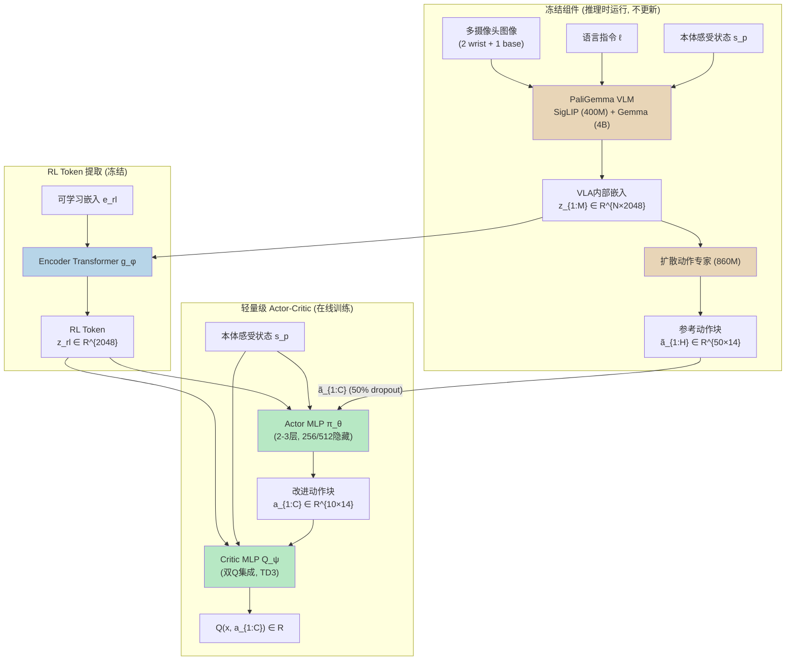
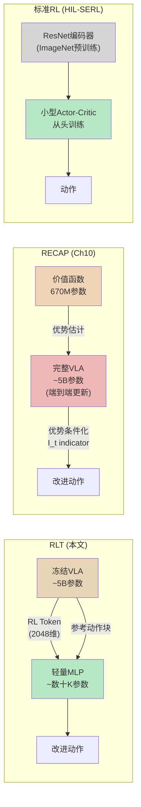
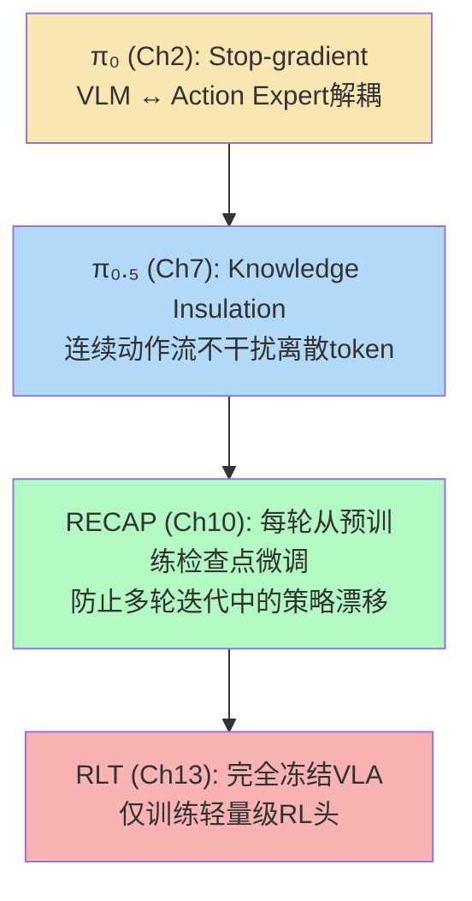
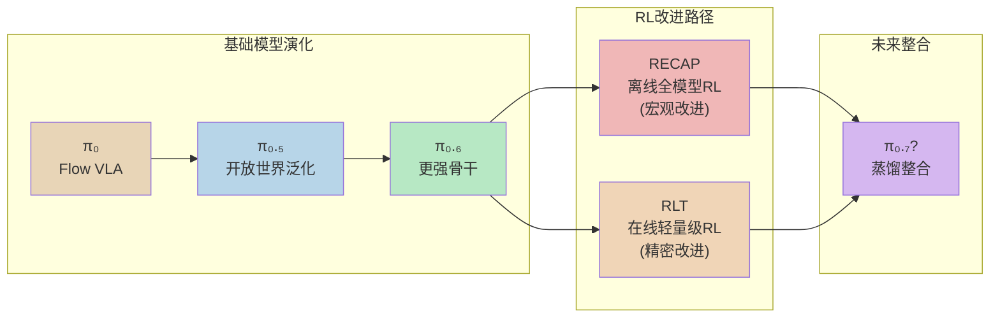

# 第十三章：RL Token — 以在线强化学习引导 VLA 突破精度极限

## 论文信息

- **标题**: RL Token: Bootstrapping Online RL with Vision-Language-Action Models
- **发表时间**: 2026年4月 (arXiv: 2604.23073)
- **核心作者**: Charles Xu, Jost Tobias Springenberg, Michael Equi, Ali Amin, Adnan Esmail, Sergey Levine, Liyiming Ke
- **机构**: Physical Intelligence (PI)
- **关键词**: 在线强化学习、VLA微调、RL Token、样本高效、精密操作

---

## 1. 解决了什么问题 & 相对前作的定位

### 1.1 "最后一毫米"精度难题

大规模视觉-语言-动作（VLA）模型在广泛的操作技能上展现了令人瞩目的泛化能力，但在需要亚毫米精度的关键任务阶段往往陷入瓶颈。这一"最后一毫米"问题表现为三个典型症状：动作缓慢犹豫、反复试探重试、以及微小对准误差在关键接触阶段的灾难性累积。例如，在M3螺钉安装任务中，基础VLA的成功率仅为20%——螺钉头与螺丝刀尖的对准需要亚毫米级精度，而遥操作示范数据本身就包含噪声和不一致性，纯模仿学习无法可靠覆盖这种精度需求。

这一问题的根源在于**示教数据的性能天花板**：VLA的行为上限被训练数据的质量和覆盖率锁死。无论预训练规模多大，模仿学习策略无法发现示范中不存在的更优策略。强化学习（RL）是突破这一天花板的自然途径——通过在目标任务上的反复练习，RL可以发现更快、更精确的操作策略。

### 1.2 为什么RECAP无法解决精度任务

RECAP（第十章）作为PI在VLA强化学习领域的首次系统性尝试，通过离线RL对完整3B参数VLA进行端到端更新，在咖啡制作、洗衣折叠等长时程任务上实现了吞吐量翻倍的显著成果。然而，RECAP的设计哲学使其在精度任务上面临三重根本限制：

**第一，迭代速度过慢**。RECAP采用"部署收集-离线训练-重新部署"的批次迭代流程，每轮需要在多台机器人上收集数百条轨迹、离线训练完整VLA、再重新部署评估。这种重量级迭代周期（通常需要数天）无法支撑精度任务所需的快速实时适应。螺钉安装中一个微小的对准偏差需要即时纠正，而非等待下一轮离线训练。

**第二，全模型更新的样本效率低下**。RECAP更新的是包含数十亿参数的完整VLA模型，在数据稀缺的实时场景中，如此庞大的参数空间需要极大量样本才能收敛。对于仅持续5-20秒的关键精密操作阶段，RECAP的数据效率远远不够。

**第三，离线RL的探索局限**。RECAP的优势条件化策略提取本质上是离线方法——它从已收集的批量经验中学习，而非在线探索新策略。这意味着它只能在已有数据的支撑下改进，无法像在线RL那样通过主动试错发现全新的超人类策略。

### 1.3 RLT的核心洞察

RLT提出了一个优雅的解决方案：**不更新VLA本身，而是从冻结的VLA中提取一个紧凑的"RL Token"表征，在此表征之上训练轻量级actor-critic网络进行在线RL**。这一设计实现了两个世界的最优组合——VLA的广泛泛化能力（感知理解和行为先验）加上轻量级RL的快速适应能力（样本高效的在线学习）。核心哲学可以概括为：VLA提供"知道什么是可能的"，RL解决"如何做到最好"。

与本系列分析中反复出现的**知识隔离原则**（Knowledge Insulation）一脉相承，RLT通过冻结VLA防止在线RL过程中的灾难性遗忘，同时通过RL Token这一信息瓶颈将VLA的丰富内部表征压缩为RL可高效利用的紧凑接口。

---

## 2. 创新点

### 2.1 RL Token：VLA知识的紧凑蒸馏接口 [变革性]

RLT的核心创新是"RL Token"概念——通过在VLA的内部token嵌入序列末尾附加一个可学习的特殊嵌入，经由轻量级encoder-decoder transformer训练产生一个紧凑向量（1x2048维），该向量作为信息瓶颈保留了VLA对当前场景的全部任务相关理解。这一设计将数十亿参数模型的高维内部状态压缩为RL可直接使用的低维状态表征，是连接大型基础模型与高效在线RL的桥梁。

### 2.2 冻结VLA作为特征提取器与行为先验 [重要]

VLA在RL阶段完全冻结，同时承担双重角色：（1）作为感知骨干提供RL Token状态表征；（2）作为行为先验提供参考动作块（reference action chunk）供RL策略改进。这是知识隔离原则在RL微调场景的又一次成功应用——与第七章中$\pi_{0.5}$的stop-gradient设计、第十章中RECAP从预训练检查点微调而非累积训练的策略遥相呼应。

### 2.3 15分钟在线适应 [变革性]

RLT在以太网插入任务上仅消耗5分钟的关键阶段交互数据（总实验时间约40分钟）即超越基础VLA策略，在所有任务上15分钟至数小时内即可完成适应。这一适应速度比RECAP快1-2个数量级，使"现场即时改进"成为可能。

### 2.4 超越人类遥操作速度的涌现策略 [重要]

RLT不仅改进了VLA的策略，还通过在线探索发现了示范数据中从未出现过的全新操作策略——例如在以太网插入中，RL策略学会了利用接触柔顺性微微摆动连接器来加速插入，而非像人类和VLA那样后退重试。RL策略中位执行时间（66步）仅为人类遥操作（146步）的45%。

### 2.5 VLA泛化与RL精度的最优组合 [重要]

通过参考动作条件化和BC正则化，RLT将在线RL限制为VLA行为的**局部编辑**而非无约束搜索，既保留了VLA在非关键阶段的泛化能力，又在关键阶段获得了RL的精度和速度优势。这种分工机制——基础VLA执行简单阶段、RL策略接管精密阶段——为实际部署提供了极其实用的系统架构。

---

## 3. 数据来源、处理方式及其原因

### 3.1 三阶段数据流

RLT的数据管线呈现清晰的三阶段结构，每个阶段的数据性质和用途截然不同：

**阶段一：任务示范数据**。每个目标任务收集1-10小时的人类遥操作示范，用于两个目的：（1）对预训练$\pi_{0.6}$进行任务特定微调；（2）训练RL Token的encoder-decoder表征（2000-10000个梯度步）。

**阶段二：Warmup数据**。冻结VLA后，用基础VLA策略执行若干回合预填充replay buffer，为critic提供初始学习信号。Warmup阶段使用VLA的原始动作块，不经RL策略修改。

**阶段三：在线RL交互数据**。核心数据来源，replay buffer聚合三类异构数据：
- VLA warmup轨迹
- RL策略在线rollout轨迹
- 人类介入纠正轨迹（可选但推荐）

### 3.2 奖励函数设计

RLT采用极简的稀疏二值奖励设计：

$$r_T = \begin{cases} 1 & \text{if task succeeds (human label)} \\ 0 & \text{otherwise} \end{cases}$$

中间步骤不提供任何奖励信号。这一设计的优势在于最小化人类标注负担（每个episode仅需一个成功/失败判断），但对RL算法的信用分配能力提出了极高要求——系统通过动作块级TD学习和高update-to-data ratio来应对这一挑战。

### 3.3 数据增强策略

**动作块子采样**是关键的数据效率技巧。虽然RL策略以$C=10$步为单位执行动作块，但系统记录每一步的中间观测，以stride=2的间隔存储重叠的动作块转移对：

$$\langle x_0, a_{0:C} \rangle, \langle x_2, a_{2:C+2} \rangle, \langle x_4, a_{4:C+4} \rangle, \ldots$$

每秒50Hz数据产生约25个训练样本，在不增加机器人交互成本的前提下大幅提升数据利用率。

### 3.4 与RECAP数据策略的本质差异

| 维度 | RECAP | RLT |
|------|-------|-----|
| **数据收集模式** | 批次迭代（部署-收集-离线训练-重部署） | 实时在线（边执行边学习） |
| **单轮数据量** | 数百条完整轨迹（多台机器人） | 400-1000个episode（单台机器人） |
| **有效交互时间** | 数天至数周 | 15分钟至5小时 |
| **奖励来源** | 分布式价值函数计算优势值 | 人类稀疏二值标注 |
| **数据用途** | 更新完整VLA（数十亿参数） | 更新轻量MLP（数千参数） |
| **异步性** | 离线处理，同步部署 | 异步rollout与学习更新 |

---

## 4. 模型结构及设计原因

### 4.1 整体架构

RLT的架构由三个层次分明的组件构成，每一层承担不同的计算角色：

### 4.2 RL Token提取机制

RL Token的数学构造是本文的核心技术贡献。设$z = f(s, \ell; \theta_{\text{vla}})$为冻结VLA在状态$s$和语言指令$\ell$下产生的最后一层token嵌入序列$z_{1:M} = \{z_1, \ldots, z_M\}$，其中每个$z_i \in \mathbb{R}^{2048}$。RL Token通过以下两步提取：

**编码步骤**：在嵌入序列末尾附加可学习的特殊嵌入$e_{\text{rl}} = e_\phi(\langle\text{rl}\rangle)$，经轻量级encoder transformer $g_\phi$处理后，在特殊token位置读出RL Token：

$$z_{\text{rl}} = g_\phi\left([z_{1:M}, e_{\text{rl}}]\right)_{M+1} \tag{1}$$

**训练目标**：decoder transformer $d_\phi$配合线性投影$h_\phi$，从$z_{\text{rl}}$自回归重建原始VLA嵌入。对VLA嵌入施加stop-gradient操作$\bar{z}_i = \text{sg}(z_i)$，重建损失为：

$$\mathcal{L}_{\text{ro}} = \mathbb{E}_{\mathcal{D}}\left[\sum_{i=1}^{M} \left\| h_\phi\left(d_\phi([z_{\text{rl}}, \bar{z}_{1:i-1}])\right)_i - \bar{z}_i \right\|^2\right] \tag{2}$$

这一信息瓶颈设计的巧妙之处在于：$z_{\text{rl}}$必须保留足够的信息以支持decoder重建所有$M$个VLA嵌入，因此它是VLA完整内部状态的一个有损但高度信息密集的压缩。同时，stop-gradient确保RL Token的训练不会反向影响VLA的预训练表征。

可选地，RL Token训练可与VLA的有监督微调联合进行：

$$\phi^*, \theta_{\text{vla}}^* = \arg\min_{\phi, \theta_{\text{vla}}} \mathcal{L}_{\text{ro}}(\phi) + \alpha \mathcal{L}_{\text{vla}}(\theta_{\text{vla}}) \tag{3}$$

其中$\alpha$控制VLA微调的权重。训练完成后，$\phi$和$\theta_{\text{vla}}$均冻结。

### 4.3 轻量级Actor-Critic

Actor和Critic的参数规模与VLA形成鲜明对比：

| 组件 | 参数量 | 架构 |
|------|--------|------|
| VLA (冻结) | ~5.26B | SigLIP + Gemma + Action Expert |
| RL Token Module (冻结) | ~数M | Encoder-Decoder Transformer |
| Actor MLP (训练) | ~数十K | 2层MLP (256隐藏) 或 3层MLP (512隐藏) |
| Critic MLP (训练) | ~数十K | 双Q集成, 同Actor架构 |

在线RL阶段实际更新的参数仅为VLA总参数量的约0.001%。

### 4.4 RLT vs RECAP vs 标准RL：架构对比

三种范式的根本差异在于**VLA知识的利用方式**：

| 维度 | RLT | RECAP | 标准RL |
|------|-----|-------|--------|
| **VLA状态** | 冻结，作为特征提取器 | 端到端更新 | 不使用VLA |
| **RL更新的参数** | ~数十K (MLP) | ~5B (完整VLA) | ~数百K (小型策略) |
| **VLA知识传递** | RL Token + 参考动作 | 优势条件化文本token | 无 |
| **学习范式** | 在线actor-critic | 离线优势条件化策略提取 | 在线actor-critic |
| **适应速度** | 分钟级 | 天级 | 小时级 |
| **泛化能力** | 继承VLA泛化 | 保留VLA泛化 | 有限 |

---

## 5. 训练方法（算法与工程）

### 5.1 两阶段训练流程

RLT的训练严格分为两个独立阶段，体现了"先压缩表征，再高效学习"的设计哲学。

**阶段一：RL Token表征训练**。在少量任务示范数据上，以自回归重建损失$\mathcal{L}_{\text{ro}}$训练encoder-decoder参数$\phi$，可选地同时微调VLA参数$\theta_{\text{vla}}$。此阶段持续2000-10000个梯度步。

**阶段二：在线RL**。冻结VLA和RL Token模块后，采用off-policy actor-critic算法在线训练轻量级Actor和Critic。

### 5.2 在线RL的核心目标

RL的目标是学习策略$\pi$以最大化期望折扣回报：

$$J(\pi) = \mathbb{E}_{\tau \sim \rho_\pi}\left[\sum_{t=0}^{T} \gamma^t r_t\right] \tag{4}$$

在动作块级别，状态-动作价值函数定义为：

$$Q^\pi(s_t, a_{t:t+C-1}) = \sum_{t'=t}^{t+C-1} \gamma^{t'-t} r_{t'} + \gamma^C \mathbb{E}_{a' \sim \pi | s_{t+C}}\left[Q^\pi(s_{t+C}, a')\right] \tag{5}$$

### 5.3 Critic训练

Critic采用标准off-policy时序差分学习，在replay buffer中采样动作块转移进行更新：

$$\mathcal{L}_Q = \mathbb{E}_{(x, a_{1:C}, x') \sim \mathcal{B}}\left[\left(\hat{Q} - Q_\psi(x, a_{1:C})\right)^2\right] \tag{6}$$

其中TD目标为：

$$\hat{Q} = \sum_{t'=1}^{C} \gamma^{t'-1} r_{t'} + \gamma^C \mathbb{E}_{a' \sim \pi_\theta}\left[Q_{\psi'}(x', a')\right] \tag{7}$$

这里$x = (z_{\text{rl}}, s^p)$为RL状态（RL Token + 本体感受状态），$\psi'$为目标网络参数（TD3风格）。Critic使用双Q函数集成，取最小值计算目标值以抑制过估计。

### 5.4 Actor训练

Actor的设计是RLT最精巧的部分之一。它不是从零生成动作，而是**以VLA的参考动作块为条件输入**，输出高斯动作分布：

$$\pi_\theta(a_{1:C} | x, \tilde{a}_{1:C}) = \mathcal{N}\left(\mu_\theta(x, \tilde{a}_{1:C}), \sigma^2 I\right) \tag{8}$$

Actor的训练目标结合Q值最大化与BC正则化：

$$\mathcal{L}_\pi(\theta) = \mathbb{E}_{\substack{s \sim \mathcal{B} \\ a_{1:C} \sim \pi_\theta}}\left[-Q_\psi(x, a_{1:C}) + \beta \|a_{1:C} - \tilde{a}_{1:C}\|_2^2\right], \quad \tilde{a}_{1:C} \sim \pi_{\text{vla}}(\cdot | s, \ell) \tag{9}$$

这一目标的物理含义极为清晰：Actor试图找到比VLA参考动作更好的动作（最大化Q值），但不能偏离VLA建议太远（BC正则化项$\beta \|a - \tilde{a}\|_2^2$）。系数$\beta$控制改进幅度与稳定性的权衡。

### 5.5 参考动作Dropout

为防止Actor退化为简单复制VLA参考动作，RLT引入了参考动作dropout机制：训练时以50%概率将参考动作块$\tilde{a}$置零。这迫使Actor维持独立的动作生成能力，而非完全依赖VLA建议。实践中，一旦Critic提供有用的价值信号，Actor自然学会在Q值指示时偏离参考动作。

### 5.6 关键阶段定向改进

RLT的一个实用设计是**分阶段执行策略**：基础VLA处理任务的简单阶段（抓取、搬运、粗对准），RL策略仅在关键精密阶段（插入、紧固、旋转）接管。人类操作员在训练时决定切换时机，测试时通过额外训练VLA预测切换点实现自动化。

这种分工策略具有三重优势：
1. **数据效率**：RL数据收集集中在最需要改进的5-20秒关键阶段
2. **信用分配**：避免在30-120秒完整任务中的稀疏奖励传播问题
3. **安全性**：非关键阶段由经过充分验证的VLA执行，减少RL探索风险

### 5.7 工程优化

| 工程决策 | 具体设置 | 原因 |
|----------|----------|------|
| 异步执行 | Rollout与学习更新并行 | 最大化数据效率和墙钟时间利用 |
| Update-to-data ratio | G = 5 | 数据稀缺场景下的关键设置 |
| Critic:Actor更新比 | 2:1 | Critic需要更快收敛以提供有用信号 |
| 动作块长度 | C = 10 (VLA H = 50) | C < H使策略更具反应性 |
| 控制频率 | 50 Hz | 14维动作空间 x 10步 = 140维动作块 |
| 动作块子采样stride | 2 | 每秒产生~25个训练样本 |

---

## 6. 实验关键发现与效果对比

### 6.1 任务与评估框架

实验在四个需要亚毫米精度的真实机器人操作任务上进行：

| 任务 | 精度要求 | 关键阶段时长 | 完整任务时长 | 核心挑战 |
|------|----------|-------------|-------------|----------|
| M3螺钉安装 | 亚毫米对准 | ~10-20s | ~120s | 旋转放大效应、跨臂视觉 |
| 扎带扣紧 | 毫米级 | ~5-15s | ~60s | 双臂协调、柔性物体 |
| 以太网插入 | 毫米级 | ~10s | ~30s | 角度对准、接触动力学 |
| 充电器插入 | 厘米级 | ~5-10s | ~30s | 有限可观测性 |

每个任务评估50个episode，同时进行关键阶段（受控起始状态）和全任务（从home位置开始）两种评估。

### 6.2 核心结果

**发现一：RLT在所有任务上显著提升成功率和速度**

| 任务 | 指标 | 基础VLA | RLT | 改进幅度 |
|------|------|---------|-----|----------|
| 螺钉安装（关键阶段） | 成功率 | ~20% | ~65% | +45% |
| 螺钉安装（全任务） | 成功率 | 低 | +40%提升 | 显著 |
| 扎带扣紧（全任务） | 成功率 | 低 | +60%提升 | 显著 |
| 以太网插入（关键阶段） | 吞吐量 | 基线 | ~3x提升 | 3倍 |
| 充电器插入（关键阶段） | 吞吐量 | 基线 | ~3x提升 | 3倍 |

**发现二：RLT大幅优于所有基线方法**

在以太网插入任务的公平对比中（相同数据量）：

| 方法 | 成功率 | 吞吐量 | 核心限制 |
|------|--------|--------|----------|
| 基础VLA | 高 | 基线 | 速度慢、反复试探 |
| DAgger | 匹配RLT | 远低于RLT | 受限于人类示范速度 |
| DSRL | 匹配RLT | 远低于RLT | 过度约束在VLA附近 |
| HIL-SERL | 失败 | 失败 | 单步动作、50Hz下无法信用分配 |
| PLD | 失败 | 失败 | 单步动作、稀疏奖励horizon过长 |
| **RLT** | **高** | **最高 (2x基线)** | - |

单步RL方法（HIL-SERL、PLD）的完全失败尤为值得注意：在50Hz控制频率下，关键阶段跨越250-1000个控制步，稀疏奖励下的信用分配在如此长的horizon上完全不可行。这一结果强有力地验证了动作块级RL的必要性。

**发现三：涌现的超人类策略**

在以太网插入任务中，RLT发现了示范数据中从未出现的全新操作策略：

| 策略来源 | 中位执行时间 | 行为特征 |
|----------|-------------|----------|
| 人类遥操作 | 146步 | 小心接近、精确对准、插入 |
| 基础VLA | 228步 | 反复"试探"——接近、后退、调整、重试 |
| **RLT** | **66步** | 流畅接近、直接插入、利用柔顺性微调 |

RLT策略的一半episode比所有人类遥操作示范都快。更重要的是，当首次尝试失败时，RLT不像VLA那样后退重新对准，而是施加压力并微微摆动连接器利用接触柔顺性——这种策略完全通过在线探索涌现，是RL超越模仿学习性能天花板的直接证据。

**发现四：极高的样本效率**

RLT在仅消耗5分钟关键阶段数据（总实验时间约40分钟）后即超越基础VLA策略性能。对比RECAP需要在多台机器人上收集数百条轨迹的迭代周期，RLT的数据效率提升了1-2个数量级。

### 6.3 与RECAP的系统性对比

| 维度 | RECAP (Ch10) | RLT (Ch13) |
|------|-------------|------------|
| **目标任务类型** | 长时程多阶段任务（咖啡、洗衣） | 短时高精度关键阶段（螺钉、插入） |
| **改进范围** | 完整任务全局改进 | 关键阶段定向精密改进 |
| **更新对象** | 完整VLA (~5B参数) | 轻量MLP (~数十K参数) |
| **学习范式** | 离线优势条件化 | 在线actor-critic |
| **适应周期** | 数天（多轮迭代） | 15分钟至5小时 |
| **机器人数量** | 3-4台并行 | 1台 |
| **成功率改进** | 吞吐量2x | 成功率+45%、速度3x |
| **知识隔离** | 每轮从预训练检查点微调 | VLA完全冻结 |
| **互补性** | 广泛改进，长时程任务 | 精密改进，短时关键阶段 |

两种方法具有高度互补性：RECAP适合在宏观层面改进完整任务流程的鲁棒性和效率，RLT适合在微观层面针对性地提升关键精密操作的精度和速度。一个理想的系统可以先用RECAP改进整体任务策略，再用RLT对关键精密阶段进行"最后一毫米"的微调。

---

## 7. 消融实验的发现

消融实验在以太网插入任务上系统性地移除四个关键组件，按影响程度排序：

### 7.1 去除BC正则化器 (w/o BC Regularizer, $\beta=0$) --- 影响最大

移除BC正则化是单项消融中性能下降最剧烈的。没有$\beta \|a - \tilde{a}\|_2^2$约束后，Actor被迫仅依赖Q函数梯度在完整140维动作空间中无约束探索。这导致：
- 早期训练极不稳定
- 频繁出现退化行为和灾难性失败
- 学习曲线波动剧烈

**启示**：将RL限制在VLA行为先验附近的局部改进是系统稳定高效学习的关键前提。无约束搜索在高维连续动作空间中的样本效率极低。

### 7.2 去除动作块 (w/o Chunk, $C=1$) --- 影响次大

将动作块从$C=10$退化为单步$C=1$后：
- 有效决策horizon从~25步TD更新膨胀到250+步
- 稀疏奖励下的价值传播完全失效
- 50Hz单步控制使RL Token不可用（需要每步查询VLA），被迫退回ResNet编码器
- 该变体**无法可靠匹配基础策略性能**

**启示**：动作块级RL不仅是性能优化，而是在高频控制+稀疏奖励设定下的必要条件。

### 7.3 去除RL Token (w/o RL Token) --- 影响显著

用ImageNet预训练的ResNet-10替换RL Token后，吞吐量下降50%。

**启示**：VLA内部嵌入经过大规模机器人数据训练后包含的操作相关结构化信息，是通用视觉编码器无法提供的。RL Token编码了"什么位置需要高精度对准"、"接触状态如何"等机器人操作特有的语义理解。

### 7.4 去除参考动作传递 (w/o Pass-Through) --- 影响中等

移除Actor输入中的VLA参考动作$\tilde{a}$后：
- 学习速度显著减慢
- 早期出现探索漂移和偶发退化行为
- 训练过程中经历更多失败

值得注意的是，在以太网这个相对简单的任务上，该消融最终能匹配RLT的最终性能，但代价是更不稳定的学习过程和更多的训练期间失败——对真实机器人而言，每次失败都有物理磨损成本，因此这一代价不可忽视。

**启示**：参考动作传递的主要价值在于加速学习启动和减少探索风险，是实用性而非理论性的关键组件。

### 消融结果汇总

| 消融变体 | 最终性能影响 | 学习速度影响 | 训练稳定性 |
|---------|-------------|-------------|-----------|
| w/o BC Regularizer | 最大下降 | 极慢 | 极不稳定 |
| w/o Chunk (C=1) | 无法匹配基线 | 无法学习 | 不稳定 |
| w/o RL Token | 吞吐量-50% | 较慢 | 尚可 |
| w/o Pass-Through | 最终可匹配 | 明显较慢 | 早期不稳定 |

---

## 8. 优化有效性评估

### 8.1 冻结VLA + 轻量级RL的最优性论证

RLT的实验结果系统性地论证了"冻结VLA + 轻量级RL"是当前在精度任务上改进VLA的最优组合策略。这一论证建立在以下证据链上：

**证据一：纯VLA无法解决精度任务**（强度：决定性）。基础VLA在螺钉安装上仅20%成功率，在以太网插入上虽然成功率尚可但速度慢2.2倍。VLA的行为学习上限被示教数据质量锁死，无法通过增加预训练数据规模来突破。

**证据二：全模型RL更新不可行**（强度：强）。论文虽未直接实验对比全模型在线RL（因为其不可行性在计算上就可以排除），但RECAP的经验表明即使是离线模式的全模型更新也需要数天和多台机器人。RLT在同等任务上仅需单台机器人15分钟至5小时。

**证据三：不使用VLA知识的RL严重受限**（强度：强）。HIL-SERL（使用ResNet编码器、不使用VLA）在四个任务上完全失败，RL Token消融后吞吐量下降50%。VLA的操作知识对RL的样本效率至关重要。

**证据四：知识隔离防止灾难性遗忘**（强度：中强）。冻结VLA确保RL训练不会破坏VLA在非关键阶段的已有能力。RECAP通过每轮从预训练检查点微调来缓解这一问题，而RLT通过完全冻结从根本上消除了这一风险。

**证据五：RL Token的信息压缩优于替代方案**（强度：中）。与直接使用VLA高维嵌入或使用通用视觉编码器相比，RL Token在保留任务相关信息的同时实现了对在线RL友好的低维表征。

### 8.2 知识隔离原则的谱系

RLT中的VLA冻结策略是PI系列工作中知识隔离原则的最新演绎：

这一演化轨迹显示了PI对"如何在不破坏已有知识的前提下获取新能力"这一基础性问题的持续深入探索。从部分解耦（stop-gradient）到完全冻结（RLT），隔离策略越来越激进，但换来的是越来越高的训练效率和稳定性。

---

## 9. 与后续工作的关联

### 9.1 与RECAP的互补路径

RLT和RECAP代表了VLA强化学习的两条互补路径，各自解决不同尺度的问题：

- **RECAP路径**：宏观层面改进完整任务流程，适合长时程多阶段任务的全局优化，代价是较慢的迭代速度和较高的计算资源需求
- **RLT路径**：微观层面精准改进关键阶段，适合需要亚毫米精度的接触密集型操作，优势是极快的在线适应和极低的计算成本

一个成熟的机器人部署管线可能同时使用两种方法：先用RECAP在离线阶段提升整体任务策略的鲁棒性和效率，再在部署现场用RLT对特定精密操作进行实时微调。

### 9.2 对后续模型整合的启示

RLT的核心思想——从冻结VLA提取紧凑表征供下游轻量级模块使用——为后续系统整合提供了重要的架构模式。在$\pi_{0.7}$等后续工作中，从RL专家策略向VLA的知识蒸馏（distillation）可能成为关键技术路径：先用RLT训练任务特定的高精度RL策略，再将其行为蒸馏回VLA以保留泛化能力同时获得精度提升。

### 9.3 迈向真正自适应的机器人

RLT解决了RECAP遗留的一个关键限制——从"需要数天的离线迭代改进"到"15分钟的现场在线适应"。然而RLT自身仍需要人类提供稀疏奖励标注、介入纠正和阶段切换决策。论文在结论中明确指出，开发基于RLT的**全自主RL改进管线**（通过奖励模型和进度预测替代人类监督）是重要的未来方向。

这一技术路线描绘了一个令人期待的愿景：VLA提供足够好的初始化使机器人能够安全探索，RL则在部署过程中持续发现更优的操作策略。预训练阶段只需提供"良好的出发点"，而最终的最优策略通过强化学习自动涌现——正如RLT在以太网任务中展示的那样，机器人可以独立发现比人类遥操作员更快、更高效的操作方式。

### 9.4 技术路线的系统位置

---

## 总结

RL Token论文以一个优雅的架构洞察解决了VLA强化学习领域的核心张力：大型基础模型的丰富知识与在线RL的快速适应之间的矛盾。通过将VLA的高维内部表征压缩为紧凑的RL Token，并在此之上训练轻量级actor-critic网络，RLT实现了"分钟级"的在线适应——在15分钟内将螺钉安装成功率从20%提升至65%，在以太网插入中发现比人类遥操作更快2倍以上的全新操作策略。

从PI研究路线的角度看，RLT与RECAP构成了VLA强化学习的互补双轨：RECAP解决"如何在宏观层面系统性改进整体任务策略"，RLT解决"如何在微观层面快速获得亚毫米级操作精度"。两者共同指向一个统一愿景：机器人不仅能从示范数据中学习，更能在实际工作中持续自我改进。

从技术思想的角度看，RLT对知识隔离原则的极致应用——完全冻结VLA、仅更新万分之一的参数——提供了一个深刻的启示：在大型基础模型时代，最高效的改进往往不是更新整个模型，而是精准地在正确的抽象层次上添加最小的可学习组件。RL Token正是这一思想的完美体现：2048维的紧凑向量，承载了50亿参数VLA的全部任务相关理解，为轻量级RL策略提供了充分的信息基础。
