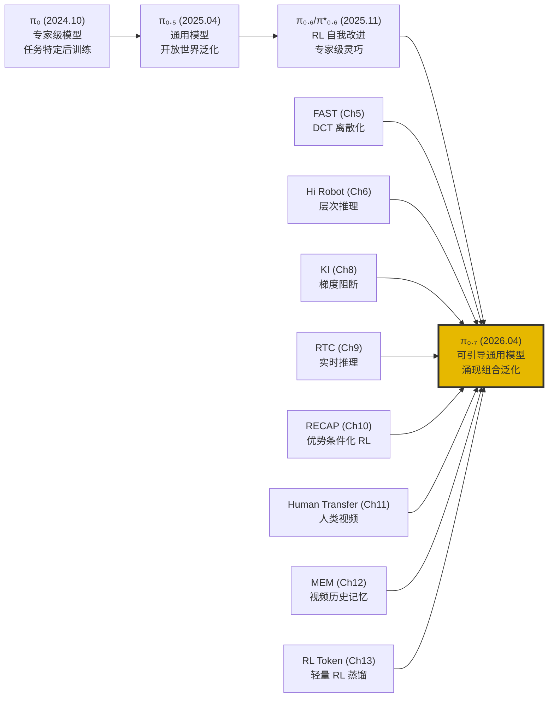
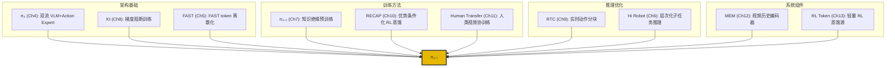
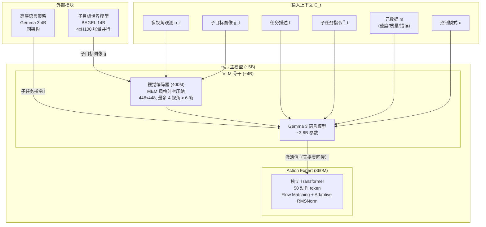
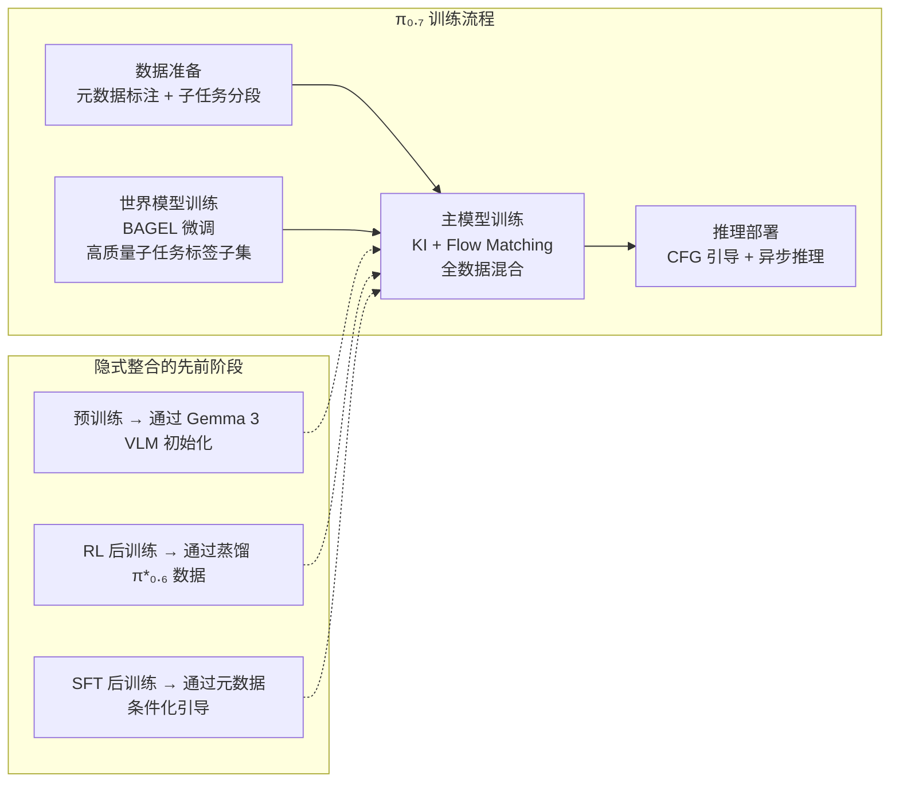
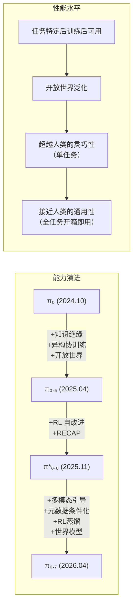

# 第十四章：π₀.₇ — 可引导的通用机器人基础模型与涌现能力

## 论文信息

- **标题**: π₀.₇: A Steerable Generalist Robotic Foundation Model with Emergent Capabilities
- **发表时间**: 2026-04-16（arXiv v2: 2026-04-24）
- **arXiv**: [2604.15483](https://arxiv.org/abs/2604.15483)
- **核心作者**: Bo Ai, Ashwin Balakrishna, Kevin Black, Danny Driess, Chelsea Finn, Karol Hausman, Brian Ichter, Sergey Levine, Karl Pertsch, Allen Z. Ren, Lucy Xiaoyang Shi, Marcel Torne 等 87 位（Physical Intelligence 全员论文）
- **项目主页**: https://pi.website/pi07

---

## 1. 解决了什么问题 & 相对前作的定位

### 1.1 核心问题

π₀.₇ 是 Physical Intelligence（PI）整个研究主线的**集大成之作**，旨在解决机器人基础模型领域最根本性的挑战：**如何构建一个可引导（steerable）的通用机器人基础模型，使其展现出组合泛化（compositional generalization）等涌现能力**。

这一问题在先前所有 VLA 模型（包括 PI 自身的 π₀、π₀.₅、π₀.₆ 系列）中均未被解决。具体而言，存在三个层次的瓶颈：

1. **组合泛化缺失**：先前模型只能执行训练中明确出现过的任务，无法将已学技能重组为新行为。这是 LLM 早已展现但机器人领域始终缺位的关键能力。
2. **异质数据无法有效利用**：真实世界的机器人数据天然包含不同质量、不同策略的演示和自主执行轨迹。朴素训练会导致模型"平均化"这些不同模式，输出次优行为。
3. **跨具身迁移不足**：当目标机器人的形态与训练数据中的机器人差异较大时，先前模型性能急剧下降，无法自动发现适配目标形态的新操作策略。

### 1.2 在 PI 研究谱系中的定位

π₀.₇ 的定位可通过以下演进路线理解：

**从 π₀ 到 π₀.₇ 的本质跃迁**：

| 维度 | π₀ (Ch4) | π₀.₅ (Ch7) | π*₀.₆/RECAP (Ch10) | **π₀.₇** |
|------|---------|------------|-------------------|---------|
| **核心范式** | 预训练 + 任务特定后训练 | 异构协训练 + 开放世界泛化 | RL 自我改进 | 多模态上下文引导 + 涌现泛化 |
| **目标** | 单任务最优 | 多任务通用 | 单任务超越人类 | 全任务开箱即用 + 新任务组合 |
| **数据哲学** | 高质量筛选 | 异构协训练 | 自主交互 + 人类纠正 | 全数据利用（含次优/失败） |
| **后训练需求** | 必需（每任务微调） | 必需（两阶段） | 必需（RL 迭代） | **无需**（开箱即用） |
| **泛化类型** | 有限环境泛化 | 开放世界环境泛化 | 同任务鲁棒性 | **组合泛化 + 跨具身迁移** |

论文开篇引用丁尼生《尤利西斯》的诗句——"I am a part of all that I have met"——精准概括了 π₀.₇ 的设计哲学：模型通过吸收一切所见（包括失败），将所有经验内化为可组合的知识。

---

## 2. 创新点

### 2.1 变革性创新（Transformative）

**创新一：多模态可引导提示（Steerable Multimodal Prompting）**

π₀.₇ 的核心创新是将上下文 $C_t$ 从传统的简短语言指令 $\ell_t$ 扩展为多模态丰富提示：

$$C_t = (\ell_t, \hat{\ell}_t, g_t, m, c)$$

其中 $\hat{\ell}_t$ 为子任务指令，$g_t$ 为多视角子目标图像，$m$ 为 episode 元数据（质量/速度/错误标签），$c$ 为控制模式。这一设计的变革性在于：它将**数据异质性从问题转化为特征**——不同质量和策略的数据不再需要被过滤，而是通过元数据标注成为模型的可控行为模式。

**与 RECAP（Ch10）的对比**：RECAP 使用二值优势指示器 $I_t \in \{\text{positive}, \text{negative}\}$ 区分好坏行为，这是一种粗粒度的条件化。π₀.₇ 将这一思想发展为**连续多维的元数据条件化**（质量 1-5 分、速度连续离散化、错误布尔标签），控制精度远超前者。

**创新二：涌现的组合泛化（Emergent Compositional Generalization）**

π₀.₇ 首次在机器人基础模型中展现出类似 LLM 的组合泛化能力：
- 无需任何任务特定数据即可执行新短期任务（按法压壶柱塞、舀米饭等）
- 通过语言指导（coaching）执行完全未见的长期任务（操作空气炸锅、烤面包片）
- 零样本跨具身迁移中**自动发现**适配目标形态的新操作策略

这是 PI 所有先前工作都未能实现的质变——从"执行训练过的任务"到"重组技能解决新问题"。

### 2.2 重要创新（Significant）

**创新三：升级骨干架构**

从 PaliGemma（SigLIP + Gemma 2B, ~3B 总参数）升级至 Gemma 3（4B VLM 骨干 + 400M 视觉编码器），Action Expert 从 300M 扩展至 860M，总参数从 ~3.3B 提升至 ~5B。这是量变到质变的关键基础设施升级。

**创新四：子目标图像世界模型**

基于 BAGEL（14B mixture-of-transformers）初始化的世界模型，能根据当前观测和子任务指令生成多视角子目标图像。世界模型通过 web 规模预训练继承了丰富的语义知识，能为策略提供语言指令无法表达的视觉细节。

**创新五：RL 专家蒸馏**

通过将 π*₀.₆ RL 训练过程中收集的自主执行数据（包含成功和失败轨迹）纳入训练集，配合元数据标注，π₀.₇ 实现了一种隐式蒸馏——通用模型继承了各个 RL 专家的能力，无需显式 RL 训练即达到专家级性能。

**创新六：语言指导（Coaching）范式**

利用 π₀.₇ 的强语言跟随能力，人类可通过逐步语言指导"教练"模型执行全新任务，随后将指导数据训练为高层策略实现全自主执行——**无需收集任何遥操作数据即可习得新长期任务能力**。

### 2.3 创新溯源：各前作贡献的整合

---

## 3. 数据来源、处理方式及其原因

### 3.1 数据来源的全面性

π₀.₇ 的数据构成是 PI 系列中最为多元的，相比 π₀.₅ 的五类数据源进一步扩展：

| 数据源 | 来源 | 作用 | 对比 π₀.₅ 的变化 |
|--------|------|------|-----------------|
| **高质量人类遥操作** | 多种平台（移动双臂、静态双臂 BiPi、UR5e、单臂），多种环境（实验室/家庭/真实家居） | 核心操作知识 | 显著扩大（新增更多环境和任务） |
| **自主执行数据** | π*₀.₆ RL 策略评估轨迹（成功+失败+次优） | RL 专家蒸馏 + 状态覆盖丰富化 | **全新数据源**（π₀.₅ 未使用） |
| **人类纠正干预** | RL 训练中的 DAgger 式人工接管 | 错误恢复行为学习 | **全新数据源** |
| **开源机器人数据集** | OXE 等 | 跨具身多样性 | 继承 |
| **人类自我中心视频** | 第一人称视角的人类操作视频 | 语义理解 + 跨具身概念 | 扩展 |
| **Web 多模态数据** | 物体定位/属性预测、VQA、文本预测、视频描述 | 语义知识保持 | 继承，新增视频描述 |
| **视频-语言任务数据** | 内部机器人数据和 web 视频的字幕生成 | 视觉-语言对齐 | **新增** |

### 3.2 数据处理的核心创新

**元数据标注系统**：π₀.₇ 对传统 VLA 训练流程进行了根本性突破——不再过滤低质量数据，而是通过结构化标注使所有数据都成为有价值的训练信号。每条轨迹被标注以下维度：

- **整体速度**（Overall speed）：episode 长度按 500 步离散化（如 1750-2250 步标记为"2000 steps"）
- **整体质量**（Overall quality）：1-5 分的人工评分
- **错误标签**（Mistake）：标记子任务段内是否包含操作错误
- **控制模式**（Control mode）：$c \in \{\text{joint}, \text{ee}\}$

**与 RECAP 数据哲学的对比演进**：

$$\underbrace{\text{π₀: 仅高质量数据}}_{\text{丢弃次优}} \rightarrow \underbrace{\text{RECAP: 二值优势标签}}_{\text{好/坏二分}} \rightarrow \underbrace{\text{π₀.₇: 多维连续元数据}}_{\text{完整行为谱}}$$

RECAP 将轨迹分为"positive"和"negative"两类（由价值函数决定阈值），这是一种二值条件化。π₀.₇ 则引入连续多维的元数据空间，使模型能学习到更精细的行为-质量映射关系。例如，同一任务的两条"positive"轨迹可能在速度维度上有显著差异，元数据使模型理解这种差异的含义。

### 3.3 数据规模效应

消融实验揭示了一个深刻的洞察：

- **无元数据**版本：训练数据增多（但平均质量下降）时性能**反而恶化**
- **有元数据**版本：随数据增长**持续改善**，即使平均质量降低

$$\text{性能}(\text{有元数据}) \propto \log(|\mathcal{D}|), \quad \text{性能}(\text{无元数据}) \not\propto \log(|\mathcal{D}|) \text{ 甚至负相关}$$

这意味着**丰富提示从根本上改变了模型的扩展特性**——它使数据扩展定律（scaling law）重新生效，打破了先前"更多数据但质量参差反而有害"的困境。

---

## 4. 模型结构及设计原因

### 4.1 整体架构

π₀.₇ 总参数约 5B，由三个核心组件构成：

### 4.2 架构演进对比

| 组件 | π₀ (Ch4) | π₀.₅ (Ch7) | π*₀.₆ (Ch10) | **π₀.₇** |
|------|---------|------------|-------------|---------|
| **VLM 骨干** | PaliGemma 3B (SigLIP + Gemma 2B) | PaliGemma 3B | Gemma 3 4B | **Gemma 3 4B** |
| **视觉编码器** | SigLIP 400M 224x224 | SigLIP 400M 224x224 | 400M 448x448 | **400M + MEM 时空压缩** 448x448, 6 帧历史 |
| **Action Expert** | Gemma-based 300M width=1024 | Gemma-based 300M width=1024 | 860M | **860M** Adaptive RMSNorm |
| **总参数** | ~3.3B | ~3.3B | ~5B | **~5B** |
| **Action Chunk** | 50 步 | 50 步 | 50 步 | **50 步** |
| **KI（知识绝缘）** | 无 | FAST token 预训练 | 梯度阻断 | **梯度阻断 + FAST token** |
| **记忆系统** | 无 | 无 | 无 | **MEM 视频历史编码器** |
| **子目标图像** | 无 | 无 | 无 | **BAGEL 14B 世界模型** |
| **元数据条件化** | 无 | 无 | 二值优势指示器 | **多维连续元数据** |
| **推理速度** | 73ms (RTX 4090) | ~200ms | ~100ms | **38ms 最简 / 127ms 全功能** (H100) |

### 4.3 关键设计决策分析

**知识绝缘（KI）的标准化应用**

π₀.₇ 继承了 KI（Ch8）的核心理念，但实现更加成熟：

$$\mathcal{L}_{\text{VLM}} = \mathcal{L}_{\text{CE}}(\text{FAST tokens}), \quad \mathcal{L}_{\text{AE}} = \mathcal{L}_{\text{FM}}(\text{flow matching})$$
$$\nabla_{\theta_{\text{VLM}}} \mathcal{L}_{\text{AE}} = 0 \quad (\text{stop gradient})$$

VLM 骨干**仅**通过离散交叉熵损失训练，Action Expert 的 flow matching 梯度不回传至 VLM。这避免了连续损失信号破坏预训练表征——在 π₀ 中这一问题尚未被明确识别，在 KI 论文中被形式化证明，在 π₀.₇ 中成为标准实践。

**Block-Causal 注意力掩码**

π₀.₇ 采用精心设计的 block-causal masking 方案：

1. **观测 token 组**：内部双向注意力
2. **子目标图像 token 组**：内部双向注意力 + 可注意观测 token
3. **文本 token**：因果注意力
4. **FAST token**（仅训练时）：与 flow 动作互不注意
5. **Flow 动作 token**：双向注意力 + 注意 VLM 骨干激活

这种设计相比 π₀ 的三段式 blockwise causal mask 更加精细，特别是子目标图像可注意观测这一设计使得图像条件化具有空间对齐能力。

**本体感知嵌入方式的演进**

$$\underbrace{\text{π₀: 直接融合}}_{\text{简单}} \rightarrow \underbrace{\text{π₀.₆: 离散化 token}}_{\text{统一但损失精度}} \rightarrow \underbrace{\text{π₀.₇: 线性投影嵌入}}_{\text{MEM 风格，保持精度}}$$

π₀.₇ 跟随 MEM（Ch12）使用线性投影将本体感知状态映射到骨干维度，每个历史状态作为独立 token，当历史帧被 dropout 时对应状态 token 也被 mask。

### 4.4 世界模型架构

子目标图像世界模型 $g_\psi$ 是 π₀.₇ 的重要新组件：

- **初始化**: BAGEL 14B（mixture-of-transformers），具备图像理解/编辑/生成能力
- **架构**: 7B LLM 骨干 + 7B 生成骨干，ViT (448x336) + VAE (512x384) 双编码器
- **训练目标**: 条件 flow matching

$$\max_\psi \mathbb{E}_{\mathcal{D}_g}\left[\mathcal{L}_{\text{CFM}}(g_t^*, g_\psi(o_t, \hat{\ell}_t, m))\right]$$

- **推理**: 4xH100 张量并行，所有大矩阵乘法量化至 8-bit，修改版 SageAttention，25 步去噪（含文本和图像 CFG），1.25 秒生成

世界模型的战略价值在于它是**语义知识从 web 规模数据向机器人策略迁移的桥梁**：web 预训练赋予世界模型对"打开空气炸锅应该是什么样子"的理解，这一理解通过生成的子目标图像传递给 π₀.₇ 的动作策略。

---

## 5. 训练方法（算法与工程）

### 5.1 训练范式概览

与 π₀ 的两阶段和 RECAP 的迭代式不同，π₀.₇ 采用**单阶段端到端训练**（辅以独立的世界模型训练），但其数据混合和上下文设计隐式地整合了先前多个阶段的功能：

### 5.2 训练目标

π₀.₇ 的训练目标保持了 PI 系列的标准形式：

$$\max_\theta \mathbb{E}_{\mathcal{D}}\left[\log \pi_\theta(a_{t:t+H} \mid o_{t-T:t}, C_t)\right]$$

其中 flow matching action expert 优化的是上述对数似然的近似下界，VLM 骨干通过 FAST token 的交叉熵损失优化。两部分梯度严格隔离。

### 5.3 Prompt Dropout 策略

训练中的随机丢弃是 π₀.₇ 灵活性的关键来源，同时为推理时的 classifier-free guidance（CFG）提供了"无条件"基准：

| 组件 | Dropout 比例 | 设计原因 |
|------|-------------|---------|
| **子目标图像** | 75%（仅 25% 保留） | 避免模型过度依赖子目标（退化为简单逆动力学问题） |
| **子任务指令**（在有子目标时） | 30% | 视觉子目标通常已蕴含等效信息 |
| **Episode 元数据（整体）** | 15% | 允许推理时无元数据运行 |
| **元数据各组件** | 各 5% | 允许单独丢弃某一维度 |
| **控制模式** | 0%（不丢弃） | 控制模式是必需信息 |
| **历史帧** | 30% | 增强鲁棒性 |
| **后方摄像头** | 30% | 适配无后方摄像头的平台 |

这一设计的精妙之处在于：25% 的子目标图像保留率不是随意选择——论文发现当子目标图像存在时，动作预测任务退化为**逆动力学问题**（给定当前帧和未来帧，推断中间动作），训练速度显著加快但独立决策能力被削弱。低保留率在利用子目标图像加速训练和保持模型自主性之间取得平衡。

### 5.4 子目标图像训练

为弥合训练（真实未来帧）与推理（世界模型生成帧）之间的分布偏移，π₀.₇ 使用混合策略：

- **真实未来帧**（75% 均匀采样未来 0-4 秒，25% 采样段末帧）
- **世界模型生成的图像**（额外构造训练样本）

段末帧的采样与世界模型的预测目标保持一致，而均匀采样提供了不同时间尺度的子目标。

### 5.5 隐式 RL 蒸馏

π₀.₇ 的一个关键训练策略是将 π*₀.₆ RL 训练过程中的策略评估数据纳入训练集。这与 RECAP（Ch10）和 RL Token（Ch13）形成了互补关系：

$$\underbrace{\text{RECAP: 显式 RL}}_{\text{通过优势条件化}}_{\text{训练改进策略}} \quad \longrightarrow \quad \underbrace{\text{π₀.₇: 隐式蒸馏}}_{\text{通过元数据条件化}}_{\text{继承 RL 专家能力}}$$

RECAP 直接训练策略在 RL 目标下改进；π₀.₇ 则将 RL 专家的执行轨迹作为训练数据，通过元数据标注让模型理解"这条轨迹展示了 RL 专家在高质量模式下的行为"，从而在推理时通过设定 Quality=5、Mistake=false 来复现这些行为。

### 5.6 推理时引导

**元数据引导**：推理时设定最优模式：

$$m_{\text{inference}} = \{\text{Speed}: P_{15}(\text{task}), \text{Quality}: 5, \text{Mistake}: \text{false}\}$$

其中速度设为该任务训练数据中第 15 百分位的 episode 长度（偏快但非最快，避免激进策略）。

**Classifier-Free Guidance (CFG)**：对 episode 元数据应用 CFG，增强引导效果：

$$\nabla_a \log \pi_\theta(a \mid o_t, C_t) + \beta \left(\nabla_a \log \pi_\theta(a \mid o_t, C_t) - \nabla_a \log \pi_\theta(a \mid o_t, C_t^{\text{uncond}})\right)$$

使用中等 $\beta \in \{1.3, 1.7, 2.2\}$。CFG 的本质是放大条件分布与无条件分布之间的差异，使模型更强烈地朝向高质量行为模式偏移。

### 5.7 Real-Time Chunking (RTC)

继承自 RTC（Ch9），π₀.₇ 采用**训练时版本**的实时动作分块：

- 训练中模拟 0-12 步延迟（对应 50Hz 机器人上最大 240ms 推理延迟）
- **不增加推理时开销**（与测试时 RTC 不同）
- 生成 50 步 action chunk，执行 $\hat{H} \in \{15, 25\}$ 步

### 5.8 推理系统工程

| 组件 | 硬件 | 延迟 |
|------|------|------|
| π₀.₇ VLA（最简配置） | 1x H100 | 38ms |
| π₀.₇ VLA（全功能：MEM + 子目标） | 1x H100 | 127ms（最坏情况） |
| 高层语言策略 | 与 VLA 共享 H100 | 包含在上述延迟中 |
| 子目标世界模型 | 4x H100（张量并行） | 1.25s |

推理采用**异步策略**：VLA 持续执行动作，世界模型和高层策略在独立线程中生成下一轮子目标和子任务指令。子目标图像每 4 秒或语义意图变化时刷新。

---

## 6. 实验关键发现与效果对比

### 6.1 开箱即用性能：匹配甚至超越 RL 专家

π₀.₇ 作为**单一通用模型**，在以下高灵巧任务上直接匹配或超越针对每个任务单独 RL 微调的 π*₀.₆ 专家策略：

| 任务 | π₀.₇ 成功率 | π*₀.₆ RL 专家成功率 | π₀.₇ 吞吐量（归一化） | 说明 |
|------|-----------|-------------------|---------------------|------|
| 衣物折叠（T恤+短裤） | 相当 | 基准 | **>1.0**（超过专家） | π₀.₇ 更快 |
| 衣物折叠（多样化-最难） | 相当 | 基准 | **>1.0** | π₀.₇ 更快 |
| 制作浓缩咖啡 | 相当 | 基准 | ~1.0 | 基本持平 |
| 组装箱子 | 相当 | 基准 | **>1.0** | π₀.₇ 更快 |

这一结果的惊人之处在于：π*₀.₆ 专家策略经历了**多轮 RL 迭代训练**、每轮数百条自主轨迹的在线数据收集，而 π₀.₇ 作为一个通用模型通过元数据条件化蒸馏直接达到了同等甚至更优的性能。

**与 SFT 专家的对比**：在 Robot Olympics 任务（花生酱三明治、T恤翻面、穿门、切蔬菜、削皮、换垃圾袋）上，π₀.₇ 也匹配了 π₀.₆ SFT 专家的性能。

**与 MEM 专家的对比**：在需要记忆的任务（交换杯子、寻找物体、舀咖啡豆、擦窗）上，π₀.₇ 达到或超越了 MEM（Ch12）微调专家的性能。

### 6.2 指令跟随能力

π₀.₇ 在语言理解和指令执行方面实现了跨代跃升：

**广泛指令跟随**（14 个场景，4 个未见厨房 + 2 个未见卧室）：

| 模型 | 指令跟随成功率 | 环境 |
|------|-------------|------|
| π₀.₅ | 较低 | 未见环境 |
| π₀.₆ | 中等 | 未见环境 |
| **π₀.₇** | **显著最高** | 未见环境 |

**复杂参考指令**（如"拿起我用来喝汤的东西"、"拿起最大盘子上的水果"）：
- π₀.₅/π₀.₆：标准指令可行，复杂指令显著恶化
- π₀.₇：标准和复杂指令均表现优秀
- π₀.₇ (GC)（加子目标图像）：进一步提升复杂指令性能

**反偏见指令**（违反数据集偏见，如将碟子放入垃圾桶）：
- π₀.₅/π₀.₆：接近失败（被数据偏见绑架）
- π₀.₇：显著改善
- π₀.₇ (GC)：在"Reverse Fridge to Microwave"任务中，子目标图像是成功的**关键因素**

### 6.3 零样本跨具身迁移：接近人类专家

这是 π₀.₇ 最引人注目的实验结果。在衬衫折叠任务上，训练数据仅来自轻量静态双臂平台（BiPi），零样本迁移至形态差异巨大的 UR5e 双臂平台：

| 指标 | π₀.₇ (GC) | 人类专家（10 名） | 条件 |
|------|-----------|-----------------|------|
| **任务进度** | **85.6%** | **90.9%** | 均为零样本（首次在 UR5e 上尝试） |
| **成功率** | **80.0%** | **80.6%** | 人类专家：平均 375 小时操作经验，前 2% |

关键观察：

1. **策略发现新操作策略**：π₀.₇ 自动将源机器人上的倾斜抓取策略替换为适合 UR5e 形态的垂直抓取策略
2. **形态差异巨大**：UR5e 比 BiPi 更大、更重、工作空间不同、夹爪形状不同
3. **人类也需适应**：即使经验丰富的人类操作员在首次使用 UR5e 时也只能达到 ~80% 成功率

**实际意义**：灵巧技能可从轻量、低成本、易遥操作的平台迁移到高负载工业臂，而后者的人类示范数据收集极其昂贵和困难。

### 6.4 组合泛化：机器人领域的"涌现能力"

**短期新任务（直接开箱即用）**：

| 新任务 | π₀.₅ | π₀.₆ | π₀.₇ | π₀.₇ (GC) |
|--------|------|------|------|-----------|
| 按法压壶柱塞 | ~0% | ~10% | ~70% | ~70% |
| 舀米饭进电饭锅 | ~0% | ~5% | ~45% | ~55% |
| 擦拭办公用品 | ~0% | ~15% | ~60% | ~55% |
| 旋转铰接物体 | ~0% | ~5% | ~50% | ~45% |

**长期新任务（语言指导 coaching）**：

| 新任务 | π₀.₅ coaching | π₀.₆ coaching | π₀.₇ coaching | π₀.₇ (GC) coaching | π₀.₇ 自主 |
|--------|-------------|-------------|-------------|-------------------|-----------|
| 装空气炸锅 | ~0% | ~5% | ~55% | ~70% | ~60% |
| 卸空气炸锅 | ~5% | ~10% | ~60% | ~75% | ~65% |
| 烤面包 | ~0% | ~5% | ~40% | ~50% | ~40% |

**coaching 到自主执行的转化**：收集 coaching 数据训练高层语言策略后，π₀.₇（autonomous）在所有任务上**近似匹配** coaching 版本的性能——无需任何遥操作数据即获得新长期任务能力。

### 6.5 π₀ → π₀.₅ → π₀.₇ 改进轨迹

---

## 7. 消融实验的发现

### 7.1 Episode 元数据的关键作用

**实验**: π₀.₇ vs π₀.₇ (no metadata)

移除元数据后，在所有灵巧任务上性能均显著下降，**尤其在吞吐量指标上差距最为明显**。元数据使模型能区分高/低质量行为模式，在推理时通过设定 Quality=5、Speed=P15 引导到最优模式。

**与 RECAP 的类比**: 元数据条件化本质上是 RECAP 优势条件化的**泛化形式**。RECAP 使用二值 $I_t$；π₀.₇ 使用连续多维 $m$。两者的核心思想相同——让模型理解数据的质量差异以便在推理时选择最优模式——但 π₀.₇ 的表达力更强。

### 7.2 自主执行数据的蒸馏价值

**实验**: π₀.₇ vs π₀.₇ (no eval data)

移除所有自主评估数据后性能显著下降。这些来自 π*₀.₆ RL 训练的轨迹在元数据条件化下提供了：
1. **RL 专家行为的蒸馏效果**（高质量轨迹标注 Quality=5）
2. **更丰富的状态覆盖**（包括异常状态和失败恢复）
3. **鲁棒性增强**（模型见过更多样的场景和策略）

### 7.3 元数据与数据规模的协同效应

**实验**: 在洗衣折叠任务上按质量分为 4 个子集（前 30%/50%/80%/100%）训练

| 数据子集 | π₀.₇ (有元数据) | π₀.₇ (无元数据) |
|---------|----------------|----------------|
| 前 30%（最高质量） | 基准 | 基准 |
| 前 50% | 改善 | 轻微下降 |
| 前 80% | 进一步改善 | 明显下降 |
| 全部 100% | **最优** | **最差** |

这一发现揭示了**丰富提示策略的可扩展性价值**：它使模型的数据效率特性从**负扩展**（更多=更差）翻转为**正扩展**（更多=更好），即使新增数据的平均质量更低。

### 7.4 任务多样性对泛化的贡献

**实验**: 三组对照

- π₀.₇ (完整数据)
- π₀.₇ (移除任务多样性最高的 20%)
- π₀.₇ (随机移除 20%，数据量对照)

在所有未见短期任务上，π₀.₇ 和随机移除版本**显著优于**移除最多样 20% 的版本。两个对照组数据量相同，这证明**多样性本身（而非数据量）是组合泛化的关键驱动力**。

### 7.5 子目标图像的差异化增益

子目标图像在不同场景下的增益具有系统性差异：

| 场景 | 子目标图像增益 | 原因分析 |
|------|-------------|---------|
| 跨具身迁移（UR5e 衬衫折叠） | **显著** | 世界模型构造了源/目标机器人之间的视觉类比 |
| 反偏见指令（Reverse Fridge to Microwave） | **关键**（决定成败） | 世界模型基于 web 知识生成正确的目标状态 |
| 复杂参考指令 | **中等** | 视觉消歧辅助语言理解 |
| 简单任务 / 强数据偏见一致任务 | **有限** | 语言指令已足够明确 |

### 7.6 消融实验影响力排序

综合所有消融实验，各因素对 π₀.₇ 性能的贡献按影响力从大到小排列：

1. **元数据条件化**：基础性创新，决定了模型能否从混合质量数据中获益
2. **自主执行数据（RL 蒸馏）**：提供了专家级行为的蒸馏和状态覆盖丰富化
3. **任务多样性数据**：组合泛化的核心驱动力
4. **子目标图像**：在特定场景下关键，在一般场景下锦上添花
5. **Prompt dropout 策略**：赋予推理灵活性和 CFG 能力

---

## 8. 优化有效性评估：整个 PI 系列的综合回顾

### 8.1 全系列创新贡献排名

从 π₀.₇ 最终性能的角度回顾整个 PI 系列的创新，按对最终产出的贡献排名：

| 排名 | 创新 | 来源 | 对 π₀.₇ 的贡献 | 证据 |
|------|------|------|---------------|------|
| 1 | **双流 VLM + Action Expert 架构** | π₀ (Ch4) | 基础架构，一切构建其上 | 所有后续模型都继承此设计 |
| 2 | **知识绝缘（KI）训练** | KI (Ch8), π₀.₅ (Ch7) | VLM 表征保护，训练稳定性 | 消融显示 KI 是训练快速收敛和泛化的关键 |
| 3 | **多模态元数据条件化** | π₀.₇ 原创 | 数据扩展特性翻转，核心方法论 | 消融显示无元数据时数据扩展为负 |
| 4 | **RECAP 优势条件化 RL** | RECAP (Ch10) | 提供了蒸馏数据源 + 条件化方法论启发 | π₀.₇ 开箱即用匹配 RL 专家 |
| 5 | **异构数据协训练** | π₀.₅ (Ch7) | 开放世界泛化的基础 | π₀.₇ 继承并扩展了 π₀.₅ 的协训练范式 |
| 6 | **FAST token 离散化** | FAST (Ch5) | 预训练效率和 VLM 骨干稳定性 | 标准组件，所有后续模型使用 |
| 7 | **MEM 视频历史编码** | MEM (Ch12) | 记忆任务能力 + 视觉时间上下文 | π₀.₇ 在记忆任务上匹配 MEM 专家 |
| 8 | **层次化子任务推理** | Hi Robot (Ch6) | coaching 范式和高层策略 | 语言指导实验证实其价值 |
| 9 | **RTC 实时推理** | RTC (Ch9) | 低延迟部署 | 38ms 推理延迟 |
| 10 | **人类视频协训练** | Human Transfer (Ch11) | 跨具身概念和语义丰富性 | 世界模型训练数据的重要组成部分 |

### 8.2 "整合溢价"：整体大于部分之和

π₀.₇ 最深刻的洞察是**各创新之间存在强烈的协同效应**：

1. **元数据 + 数据量的协同**：元数据使数据扩展从负变正
2. **RL 蒸馏 + 元数据的协同**：RL 数据本身质量参差不齐，元数据使其蒸馏成为可能
3. **世界模型 + 语言跟随的协同**：世界模型将 web 知识转化为视觉子目标，弥补语言指令的歧义
4. **多样性数据 + 组合泛化的协同**：任务多样性直接驱动组合泛化
5. **KI + 大规模异构训练的协同**：KI 保护 VLM 表征不被异构数据的嘈杂梯度破坏

论文的消融实验从不同角度验证了这种协同：移除任何单个组件的性能下降通常**大于**该组件在隔离状态下的预期贡献，因为移除一个组件会同时破坏它与其他组件的协同关系。

这一现象类似于 LLM 中观察到的"涌现能力"——当模型规模、数据多样性和训练方法论同时达到某个阈值时，出现了先前不存在的质变能力（如组合泛化）。π₀.₇ 的组合泛化能力不太可能归因于任何单一创新，而是所有创新共同作用达到"临界点"的结果。

### 8.3 从数据过滤到数据利用的范式转变

回顾整个 PI 系列，一条贯穿始终的暗线是数据哲学的演进：

$$\underbrace{\text{π₀}}_{\text{精心筛选}} \rightarrow \underbrace{\text{π₀.₅}}_{\text{异构协训练}} \rightarrow \underbrace{\text{RECAP}}_{\text{从失败中学习}} \rightarrow \underbrace{\text{π₀.₇}}_{\text{一切皆可用}}$$

π₀ 需要精心筛选高质量数据；π₀.₅ 通过协训练利用不同类型的数据但仍需质量过滤；RECAP 通过 RL 从失败中学习但限于单任务；π₀.₇ 通过元数据条件化**使一切数据都成为有价值的训练信号**，包括失败轨迹、次优执行、不同策略的演示。

这一转变的工程意义是深远的：数据收集不再需要追求完美质量，任何合理的机器人交互数据都可以被利用。这大幅降低了数据获取的成本和门槛。

---

## 9. 与后续工作的关联

### 9.1 商业部署路径

π₀.₇ 的开箱即用特性和可引导性使其成为商业部署（Ch17 将讨论）的理想基础模型：
- **无需任务特定后训练**：降低部署成本和周期
- **coaching 范式**：允许终端用户通过自然语言教会机器人新任务
- **跨具身迁移**：同一模型可部署到不同硬件平台

### 9.2 π₀.₇ 之后：开放问题

1. **超越人类专家**：π₀.₇ 在跨具身迁移中接近人类（85.6% vs 90.9%），但尚未超越。RECAP 风格的在线 RL 改进与 π₀.₇ 的组合可能是超越人类的路径。
2. **零样本泛化的上限**：论文坦承零样本任务的成功率（60-80%）仍低于训练任务（>90%）。如何缩小这一差距？
3. **扩展定律**：论文展示了元数据条件化下的正扩展特性，但最终的扩展极限在哪里？更大的模型（10B+）、更多的数据（100k+ 小时）、更丰富的元数据维度能带来什么？
4. **coaching 的规模化**：语言指导范式极具前景，但每个新任务仍需人工 coaching。能否自动化这一过程？
5. **长期自主改进**：结合 RECAP 的 RL 改进和 π₀.₇ 的蒸馏机制，能否构建真正的持续自我改进循环？

### 9.3 更广泛的影响

π₀.₇ 在机器人基础模型领域的意义类似于 GPT-4 在 NLP 领域的意义——它不是提出全新范式，而是将所有先前的创新整合到一个系统中，使其达到实际可用的水平，并展现出涌现能力。如果说 π₀ 证明了"VLA 可行"、π₀.₅ 证明了"VLA 可泛化"、RECAP 证明了"VLA 可超越人类演示"，那么 π₀.₇ 证明的是**"VLA 可以像 LLM 一样组合泛化"**。

π₀.₇ 论文自身也承认了一个有趣的认识论困境：当训练数据如此庞大和多样时，严格界定什么是"真正未见"的任务变得困难——这与 LLM 面临的相同挑战一模一样。论文的回应是：**无论这些行为是真正新颖的还是已见部分的新组合，实际效果是一样的——用户可以通过提示让机器人做想做的事，而不需要为每个新任务收集专门的训练数据**。这正是"组合泛化"的核心价值。

---

## 总结

π₀.₇ 是 Physical Intelligence 从 2024 年 10 月至 2026 年 4 月、历经 18 个月密集研究的**最终结晶**。它将双流 VLM-Action Expert 架构（π₀）、知识绝缘训练（KI）、FAST token 离散化、异构数据协训练（π₀.₅）、优势条件化 RL（RECAP）、视频历史记忆（MEM）、实时推理（RTC）、层次化推理（Hi Robot）等所有先前创新整合为一体，并在此基础上引入了多模态元数据条件化、子目标图像世界模型、RL 专家隐式蒸馏等原创贡献。

最终的 5B 参数模型在无需任何任务特定后训练的情况下，在高灵巧任务上匹配 RL 专家，在跨具身迁移中接近人类专家（85.6% vs 90.9%），并首次展现出机器人领域的组合泛化——通过语言指导即可执行训练中从未出现的新任务。这标志着 VLA 模型从"任务执行器"向"通用物理智能体"的质变。
