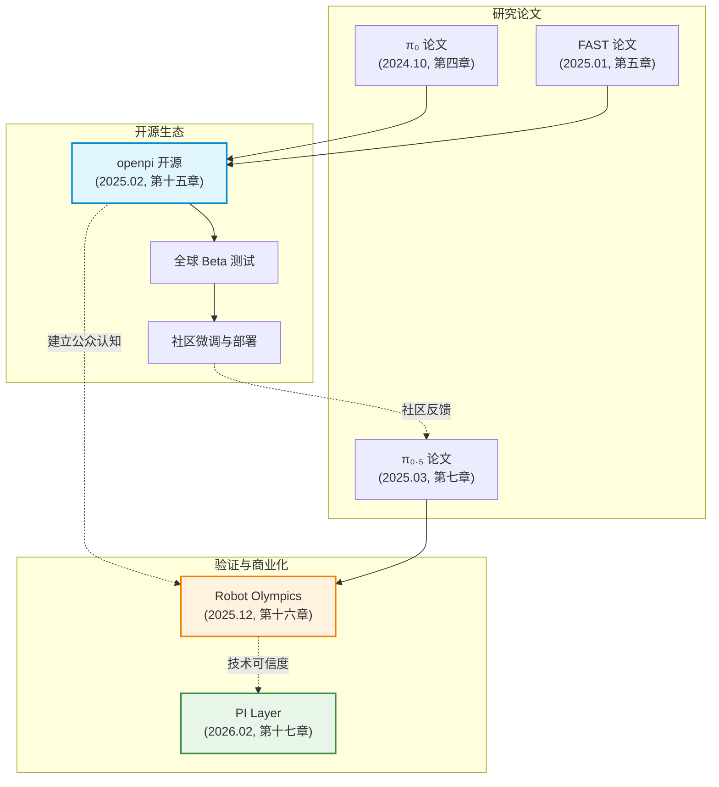
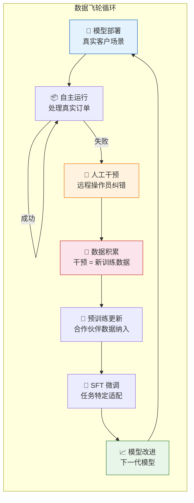
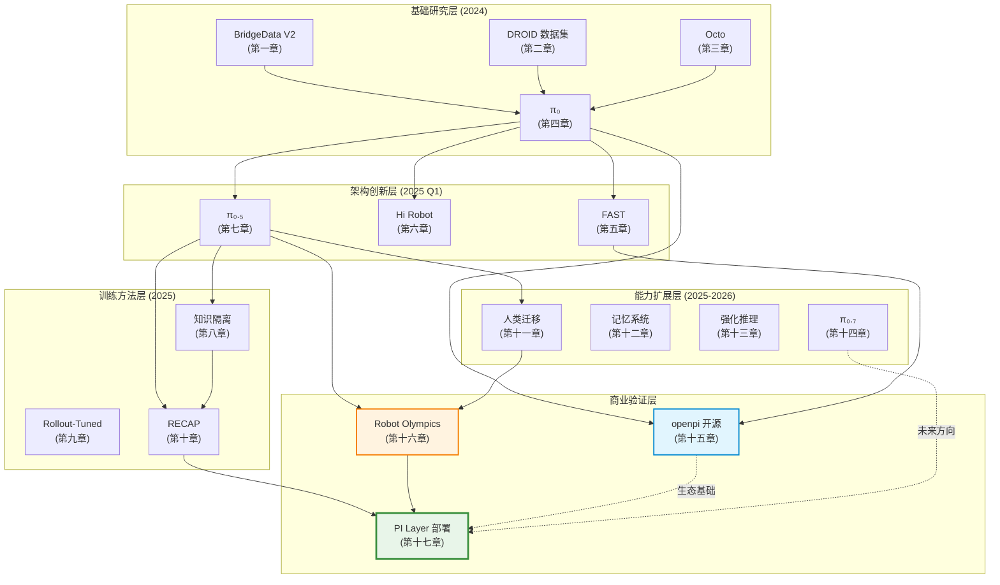

# 第十五至十七章：战略博客文章深度解析

> **章节定位说明**：第十五至十七章分析的对象不是经过同行评审的学术论文，而是 Physical Intelligence (PI) 在关键战略节点发布的三篇博客文章。这些文章分别对应 PI 发展历程中的三个里程碑：开源生态构建（2025.02）、技术路线验证（2025.12）、商业模式落地（2026.02）。它们从不同维度补全了论文无法覆盖的战略叙事，共同构成了一条清晰的技术商业化路径：**从实验室成果 → 开源生态 → 公开验证 → 商业部署**。本章将以学术严谨性审视这些战略性文本，同时充分尊重其作为意见/战略表达而非实验报告的本质属性。

---

# 第十五章：Open Sourcing $\pi_0$ — 机器人基础模型的"GPT-2时刻"

## 文章信息

| 项目 | 内容 |
|------|------|
| 标题 | Open Sourcing π₀ |
| 发表时间 | 2025年2月4日 |
| URL | https://www.pi.website/blog/openpi |
| 代码仓库 | https://github.com/Physical-Intelligence/openpi |
| 文章类型 | 官方博客公告 / 开源发布声明 |

---

## 1. 核心主题：为什么要开源

PI 在这篇博客中宣布将 $\pi_0$ 基础模型的代码与权重以 openpi 仓库的形式向全社区开放。这不是一次简单的代码公开，而是一次经过深思熟虑的战略决策。文章明确阐述了开源的核心信念：

> "future AI systems will be able to interact with the world around them, understand physical interactions and processes at an intuitive level."

团队将 openpi 类比为开源 LLM/VLM 生态的早期阶段，期望引发机器人领域的"寒武纪大爆发"——催生创造性应用、公共数据集共享和新技术涌现。这一类比暗示团队认为机器人基础模型正处于类似 GPT-2 开源时刻的行业拐点。同时，文章以罕见的坦诚声明了局限性："π₀ may or may not work for you, but you are welcome to try it and see"——这在大模型开源公告中极为罕见，反映了团队对机器人领域 sim-to-real gap 和平台差异性的清醒认识。

---

## 2. 与研究论文的关系

openpi 是 PI 技术栈的集中开源实现，将多篇论文的成果统一为可运行的代码库。下表梳理了各开源组件与论文系列的对应关系：

| 开源组件 | 对应论文/章节 | 核心技术 |
|---------|-------------|---------|
| $\pi_0$ base 模型代码与权重 | 第四章 $\pi_0$（2024.10） | PaliGemma VLM + Action Expert 双流架构, flow matching |
| $\pi_0$-FAST base 模型 | 第五章 FAST（2025.01） | FAST tokenizer 自回归离散化 |
| DROID 微调检查点 | 第二章 DROID 数据集（2024.03） | 大规模多环境 Franka 操作数据 |
| ALOHA 微调检查点 | ALOHA 平台 | 双臂灵巧操作（毛巾折叠、食物舀取） |
| Libero 仿真检查点 | Libero 基准 | 标准化仿真评估 |
| WebSocket 推理服务 | openpi 工程创新 | 轻量级客户端-服务端架构 |

值得注意的是，此次发布**尚未包含** $\pi_{0.5}$（第七章，2025.03）的权重——$\pi_{0.5}$ 的开源在后续版本中完成。这一时间差本身就是一个有意义的信号：PI 选择在 $\pi_{0.5}$ 论文发布之前先开源 $\pi_0$，既是为了给社区提供一个相对成熟的基线，也是为了在 $\pi_{0.5}$ 发布时积累社区反馈。

---

## 3. 开源策略分析：开放与保留的边界

### 3.1 开放的内容

PI 的开源范围经过精心设计，最大化社区价值的同时保护核心竞争力：

- **模型架构与权重**：完整的预训练基础模型，社区可直接使用或微调
- **微调流程**：1-20 小时的自有数据即可完成微调，极低的数据门槛使中小实验室也能参与
- **多平台适配代码**：ALOHA、DROID、Libero 的完整示例，覆盖真实硬件和仿真
- **双后端支持**：JAX（Flax NNX）原生实现 + HuggingFace PyTorch 移植版本
- **推理服务架构**：WebSocket 服务端 + 轻量级客户端包，接入过程极其便捷

### 3.2 保留的内容

- **预训练数据**：PI 自有的 7 种机器人平台数据和 10,000+ 小时的操作数据
- **最新模型**：$\pi_{0.5}$ 及后续版本在发布时未同步开源
- **生产级优化**：部署环境中的可靠性优化、人在回路系统等工程积累
- **强化学习流程**：RECAP 等自我改进方法

### 3.3 与 Meta Llama 策略的对比

PI 的开源策略与 Meta 的 Llama 系列有深层的结构性相似：

| 维度 | Meta Llama | PI openpi |
|------|-----------|-----------|
| 开源动机 | 通过生态繁荣巩固技术领导力 | 催生机器人领域"寒武纪大爆发" |
| 开放程度 | 权重 + 代码，但不含训练数据 | 权重 + 代码 + 微调流程，不含预训练数据 |
| 模型延迟 | 最新模型延迟数月开源 | $\pi_{0.5}$ 延后发布 |
| 生态效应 | 催生开源 LLM 生态（llama.cpp 等） | 期望催生机器人应用和数据共享生态 |
| 核心护城河 | 训练数据 + 计算规模 + 迭代速度 | 机器人数据 + 部署经验 + 数据飞轮 |
| 战略意图 | 防止被 OpenAI/Google 锁定 | 建立机器人基础模型的事实标准 |

两者的共同逻辑是：**开源基础模型本身不是护城河，训练数据和迭代速度才是**。通过开源，PI 将社区的注意力和创造力锁定在自己的架构和接口标准上，即使社区产生大量下游创新，也在事实上巩固了 PI 作为基础模型提供者的地位。

---

## 4. 对生态系统的影响

### 4.1 降低准入门槛

openpi 发布前，全球能复现 VLA 基础模型的团队不超过 5 家。发布后，任何拥有标准 GPU 和少量机器人数据的实验室都可以：
- 使用预训练模型进行零样本推理
- 用 1-20 小时自有数据微调适配新任务
- 通过 WebSocket 接口将模型接入任意机器人平台

### 4.2 全球 Beta 测试验证

博客展示了 PI 在正式发布前组织的全球 Beta 测试成果：

| Beta 测试方 | 地点 | 平台 | 任务 |
|------------|------|------|------|
| Moo Jin Kim | -- | ALOHA | 混合坚果舀取微调 |
| 蒙特利尔大学 | 加拿大 | DROID | 零样本部署 |
| 华盛顿大学 | 美国 | DROID | 零样本部署 |
| KAIST | 韩国 | DROID | 零样本部署 |

这些跨越北美和亚洲的零样本部署视频，比论文中的受控实验更具说服力地展示了模型的泛化能力。DROID 微调检查点被描述为"首个能在全新环境中成功跟随指令的 DROID 平台模型"。

### 4.3 长远生态效应

openpi 的发布为 PI 后续的所有工作奠定了社区基础：
- **第十六章**（Robot Olympics）中的技术展示建立在社区对 $\pi_0$ 的广泛认知之上
- **第十七章**（PI Layer）中的商业模式需要合作伙伴对 PI 模型架构的信任
- 第十一章（Human Transfer）的人类-机器人迁移研究基于 $\pi_{0.5}$ 架构展开

---

## 5. 创新点评估

| 创新维度 | 评估 |
|---------|------|
| 开源即战略护城河 | 通过开放基础模型吸引社区围绕自己的架构标准构建，形成网络效应 |
| 极低微调门槛 | 1-20 小时数据即可微调，使机器人基础模型的"民主化"成为可能 |
| 双模型选择 | 同时提供 $\pi_0$（flow matching）和 $\pi_0$-FAST（自回归），用户可根据任务特性选择 |
| 坦诚的局限性声明 | 在 AI 领域的营销性宣传中显得独特，建立了技术可信度 |
| WebSocket 推理架构 | 将模型服务与机器人控制解耦，降低集成复杂度 |

---

## 6. $\pi_0$ vs $\pi_0$-FAST 技术对比

博客首次公开了两者在实践中的具体权衡：

| 维度 | $\pi_0$ base | $\pi_0$-FAST base |
|------|-------------|-------------------|
| 动作生成方式 | Flow matching (连续) | FAST tokenizer (自回归离散化) |
| 适用场景 | 高频灵巧控制 | 语言指令跟随 |
| 语言跟随能力 | 良好 | 略优于 $\pi_0$ |
| 推理成本 | 基准 | 约为 $\pi_0$ 的 4-5 倍 |
| 设计哲学 | 连续动作空间，适合精细操作 | 离散化统一框架，适合复杂指令 |

这一对比为社区提供了明确的选型指南：需要精细操作选 $\pi_0$，需要复杂语言理解选 $\pi_0$-FAST。

---

## 7. 与后续工作的关联

openpi 的发布在 PI 的技术-商业路线图中占据枢纽位置：



openpi 作为连接研究与应用的桥梁，使论文中的算法创新转化为社区可复现、可扩展的工程实践，并为后续的商业部署奠定了生态基础。

---

---

# 第十六章：Moravec's Paradox and the Robot Olympics — 数据稀疏性视角下的范式验证

## 文章信息

| 项目 | 内容 |
|------|------|
| 标题 | Moravec's Paradox and the Robot Olympics |
| 发表时间 | 2025年12月22日 |
| URL | https://www.pi.website/blog/olympics |
| 文章类型 | 技术展示博客 / 理论观点文章 |
| 挑战来源 | Benjie Holson 的 Substack 博客提案 |

---

## 1. 核心主题：重新定义 Moravec 悖论

### 1.1 经典悖论的回顾

Moravec 悖论是人工智能领域最经典的观察之一：对人类而言"困难"的认知任务（下棋、解数学题、编写代码）对机器来说反而"容易"，而人类毫不费力完成的日常物理操作（抓取物体、涂抹花生酱、翻袜子）对机器却极其困难。1996 年 Deep Blue 击败国际象棋世界冠军时，需要一个人类代为移动棋子；AlphaGo 同样无法自己摆放围棋子；现代 LLM 能解决金牌水平的数学奥林匹克题目，却"无法用铅笔写下答案"。

### 1.2 PI 的重新诠释：数据稀疏性声明

文章最深刻的理论贡献在于将 Moravec 悖论**重新定义为一个数据稀疏性声明**（data sparsity statement）：

物理技能之所以"困难"，不是因为它们在计算上更复杂，而是因为：
1. **这些技能无法从互联网数据中学到**——人类不会在网上发布"如何移动手臂来清洗油锅"的详细指令，因为每个人都已经会了，而且我们实际上无法用语言传达这些知识
2. **我们无法通过编程显式地将其写入系统**——试图用代码描述如何操作一块湿滑的海绵，就像试图用文字教会一个人游泳一样徒劳
3. **进化赋予人类的物理操作能力存在于意识的可及范围之外**——我们无法内省并传达自己的感觉运动知识

这一重新定义将问题从"物理操作在计算上是否本质困难"转化为"我们是否拥有足够的训练数据"——后者是一个工程问题，而非理论限制。

---

## 2. 关键技术展示：Robot Olympics 成绩

### 2.1 挑战赛概述

挑战任务来自 Benjie Holson 的博客提案，涵盖 5 个类别共 11 项具体任务。PI 使用其最新基础模型（基于 $\pi_{0.6}$ 架构）进行微调，在 5 个类别中获得 3 枚金牌、2 枚银牌。

### 2.2 详细成绩表

| 类别 | 金牌任务 | 银牌任务 | 铜牌任务 | PI 成绩 |
|------|---------|---------|---------|--------|
| **全身运动** | 通过自闭门 | -- | -- | 🥇 金牌 |
| **洗衣** | 翻衬衫(右面朝外) | 翻袜子 | 折叠T恤 | 🥈 银牌 |
| **基本工具使用** | 使用钥匙 | 花生酱三明治 | 清洁窗户 | 🥇 金牌 |
| **指尖精细操作** | 剥橘子(裸手) | 使用狗便袋 | -- | 🥈 银牌 |
| **湿滑操作** | 清洗油锅 | 清理手指花生酱 | 擦台面 | 🥇 金牌 |

### 2.3 量化性能数据

| 指标 | PI 微调模型 | 标准 VLM 基线(无机器人预训练) |
|------|-----------|--------------------------|
| 平均成功率 | **52%** | 0% (全部失败) |
| 平均任务进度 | **72%** | 9% |
| 大多数任务微调数据量 | < 9 小时 | -- |
| 翻袜子数据量 | ~8 小时 | -- |

52% 的平均成功率看似不高，但必须在两个背景下理解：(1) 基线模型在所有任务上完全失败，说明这些任务确实极其困难；(2) 两个未获金牌的类别（洗衣中的翻衬衫、指尖操作中的裸手剥橘子）是因为机器人夹爪的物理限制而非模型能力不足。

### 2.4 关键任务细节

**使用钥匙（金牌）** 要求精细操控和多步骤物体重新定向——机器人必须在不放下钥匙的情况下调整其方向并插入锁孔。同一任务还在移动机器人平台上进行了演示。

**花生酱三明治（银牌）** 被团队描述为实际上比金牌任务更难——需要精细的刀具操作来舀取、涂抹和收尾，涉及多种可变形材料的交互。

**使用狗便袋（银牌）** 是所有任务中最具挑战性的之一——需要分离袋子边缘、打开袋子、套在夹爪上、拾取物品并翻转。

**清洗油锅（金牌）** 需要同时处理液体、湿海绵和油腻表面，展示了模型对复杂材料物理特性的隐式理解。

---

## 3. 理论贡献：VLA 时代对 Moravec 悖论的消解

### 3.1 进化论视角

文章提供了一个深刻的进化论论证：人类祖先"很少需要计算多变量积分"，但每天都面临严峻的物理生存挑战。数百万年的进化将人类大脑精密调校为出色的物理操作系统，以至于我们几乎意识不到其中的复杂性。正因为人类擅长物理交互，构建复制这种能力的机器才格外困难——我们甚至无法清晰地描述自己是如何做到的。

### 3.2 数据稀疏性的解法

如果 Moravec 悖论本质上是数据稀疏性问题，那么解法就是构建足够丰富多样的物理交互数据基础。VLA 模型如 $\pi_{0.6}$ 从高度多样化的任务库中捕获通用物理知识，为下游任务的少量数据学习创建了基础。这解释了为什么基础模型成功而基线 VLM 完全失败——后者虽然拥有丰富的语言和视觉知识，但缺乏物理交互的数据基础。

### 3.3 瓶颈上移预测

文章前瞻性地指出，随着底层物理技能被通用化地解决，瓶颈将上移至更高层次的任务规划与认知整合。早期信号已在 $\pi_{0.5}$（第七章）的语言指令训练中观察到——当低层操作能力足够强时，通过高层语言指令即可组合出复杂的新行为。

---

## 4. 与研究论文的关系

Robot Olympics 展示是 PI 整个研究路线的综合验证。下表梳理了各项技术与论文的对应关系：

| 展示能力 | 对应论文/章节 | 技术基础 |
|---------|-------------|---------|
| 少量数据微调 | $\pi_0$（第四章）| 预训练+微调范式 |
| 复杂灵巧操作 | FAST（第五章）| 高分辨率动作生成 |
| 语言指令跟随 | $\pi_{0.5}$（第七章）| 离散状态输入与推理 |
| 基线对比的显著差距 | KI（第八章）| 知识隔离防止预训练知识退化 |
| 人类数据的辅助 | Human Transfer（第十一章）| 人类-机器人迁移的涌现 |
| 模型代际提升 | RECAP（第十章）| 自我改进数据飞轮 |

文章明确引用了三项关键技术进展：(1) 强化学习优化可靠性和速度；(2) 人类到机器人迁移的涌现现象；(3) $\pi_{0.5}$ 论文中的语言指令训练协议。这构成了一条清晰的技术演进路线：

```
大规模预训练 → 任务微调 → 强化学习优化 → "预训练-微调-RL"三阶段范式
```

---

## 5. 创新点评估

| 创新维度 | 评估 |
|---------|------|
| Moravec 悖论的数据稀疏性重释 | 将哲学困境转化为工程问题，为机器人基础模型的研究方向提供理论支撑 |
| 基线对比的说服力 | 标准 VLM 微调 0% vs PI 模型 52% 的对比，是预训练价值的最直接证据 |
| 硬件限制的诚实披露 | 明确指出两项失败源于夹爪而非模型，建立了技术可信度 |
| 公开挑战赛的范式 | 接受第三方提出的挑战任务，而非自选演示任务，增强了验证的独立性 |
| 数据效率的展示 | 大多数任务 < 9 小时数据，证明了基础模型的实用价值 |

---

## 6. 与后续工作的关联

Robot Olympics 在 PI 的叙事中扮演着"公开验证"的角色。它在两个方向上产生影响：

**向后验证**：证明了 $\pi_0$ → $\pi_{0.5}$ → $\pi_{0.6}$ 的模型代际提升在真实世界的复杂任务上确实有效。52% 的成功率虽非完美，但证明了研究方向的正确性——这些任务此前被认为对机器人不可能完成。

**向前铺路**：为第十七章（PI Layer）的商业叙事提供了技术可信度基础。当 PI 告诉合作伙伴"我们的模型可以处理复杂的物理操作"时，Robot Olympics 的公开展示比任何论文中的实验室数据都更具说服力。

文章还预测了三个未来方向：(1) 新任务需要更少的数据；(2) 更简单的数据源（如人类视频）可能足够；(3) 自主强化学习经验可以替代部分人类示教。这三点分别对应 Human Transfer（第十一章）、RECAP（第十章）和 RLT（第十三章）的研究成果。

---

---

# 第十七章：The Physical Intelligence Layer — 从研究到商业部署的范式跨越

## 文章信息

| 项目 | 内容 |
|------|------|
| 标题 | The Physical Intelligence Layer |
| 发表时间 | 2026年2月24日 |
| URL | https://www.pi.website/blog/partner |
| 文章类型 | 商业合作公告 / 战略愿景博客 |
| 合作伙伴 | Weave Robotics（家用洗衣）、Ultra（工业仓库） |

---

## 1. 核心主题："物理智能层"概念

### 1.1 核心类比

文章提出了一个极具洞察力的类比：在软件 AI 领域，开发者今天可以通过 API 调用 GPT/Claude 等基础模型来构建语言应用，无需自建整个智能栈。但在机器人领域，每一个应用开发者都必须"implement your own controllers, build out data pipelines, and train your own models"——其中许多组件仍是尚未解决的开放研究问题。

PI 的核心论点是：机器人领域需要一个类似的"**物理智能层**"（Physical Intelligence Layer）——通用的机器人基础模型，使应用开发者能够像调用 LLM API 一样调用物理操作智能。这标志着 PI 从纯研究机构向平台型公司的战略转型。

### 1.2 与 LLM 平台的结构性对比

| 维度 | LLM 平台模式 | PI 物理智能层 |
|------|-------------|-------------|
| 基础模型提供者 | OpenAI, Anthropic, Google | Physical Intelligence |
| 应用层 | SaaS 产品, 聊天机器人, 代码助手 | Weave (洗衣), Ultra (仓库) |
| 接口 | API 调用 | 模型部署 + WebSocket 推理 |
| 数据循环 | 用户反馈 → RLHF | 操作干预 → 训练数据 |
| 适配方式 | Prompt engineering / Fine-tuning | SFT + 合作伙伴数据纳入预训练 |
| 护城河 | 预训练数据 + 用户规模 | 机器人数据 + 部署经验 + 数据飞轮 |

---

## 2. 部署数据：两个垂直领域的量化验证

### 2.1 Weave Robotics：家用/商用洗衣折叠

Weave 构建面向家庭和商业场景的洗衣折叠机器人，已在旧金山湾区实际部署商用单元。洗衣折叠被视为机器人操作中最困难的任务类型之一——它要求处理长时程任务序列、高度可变形的衣物、以及尺寸/面料/颜色/形状的极端多样性。

**核心部署指标：**

| 指标 | $\pi_{0.5}$ SFT | $\pi_{0.6}$ SFT | 改进 |
|------|---------------|---------------|------|
| 自主运行时间占比 | ~57% | ~92.4% | +35.4 个百分点 |

**合作伙伴数据纳入预训练的增量效果：**

| 指标 | 无 Weave 预训练数据 | 含 Weave 预训练数据 (+WPT) | 改进 |
|------|------------------|--------------------------|------|
| 抓取失败序列(每次满载) | 基准 | -- | **减少 42%** |
| 人工干预次数(每次满载) | 基准 | -- | **减少 50%** |

这些数据来自旧金山真实洗衣店的生产环境，机器人正在每天折叠真实客户的衣物并产生收入。

### 2.2 Ultra：工业仓库电商打包

Ultra 构建可集成到现有工作站的工业 AI 机器人，在美国各地仓库拥有创收型机器人舰队。电商打包任务此前被认为无法自动化——因为工作流、物品类型、可变形包装和外部机械交互的高度变异性使传统刚性自动化方案无效。

**核心部署指标：**

| 指标 | $\pi_{0.5}$ SFT | $\pi_{0.6}$ SFT | 改进 |
|------|---------------|---------------|------|
| 成功率 | ~93% | ~97%+ | 显著提升 |
| 全班次自主率 (连续运行) | -- | **96.4%** | -- |

**合作伙伴数据纳入预训练的增量效果：**

| 指标 | $\pi_{0.6}$ 无 Ultra 预训练数据 (-UPT) | $\pi_{0.6}$ 含 Ultra 预训练数据 (+UPT) | 改进 |
|------|-------------------------------------|--------------------------------------|------|
| 打包吞吐量 | ~134 件/小时 | ~165 件/小时 | **+23%** |

### 2.3 模型代际提升的量化证据

Ultra 团队明确表示，从 $\pi_0$ → $\pi_{0.5}$ → $\pi_{0.6}$ 的每一代模型都带来了"a significant step up in intelligence, throughput, and reliability with no signs of slowing down"。这是第一次有外部合作伙伴从部署端独立验证了 PI 的模型代际演进的实际价值。

---

## 3. 技术方法：人在回路数据飞轮

### 3.1 架构设计

部署架构的核心是**人在回路（Human-in-the-Loop）干预系统**与**数据飞轮**的闭环结合：



### 3.2 关键设计要素

**远程操作干预系统**：当模型在真实客户仓库/洗衣店中出现失误时，远程操作专员介入纠错，确保数千个订单的正确性。这实现了双重目的：(1) 保证服务质量不受模型失误的影响；(2) 每次干预本身都生成新的训练数据。

**合作伙伴数据纳入预训练**：关键的技术决策是将合作伙伴的数据纳入 PI 模型的预训练阶段（而非仅做微调）。这一策略带来了远超 SFT 的性能增益——Weave 数据纳入预训练后干预减半，Ultra 数据纳入后吞吐量提升 23%。这与 $\pi_{0.5}$（第七章）和 KI（第八章）中关于多源数据联合预训练提升泛化能力的核心发现完全一致。

**$\pi_{0.6}$ 的质性改进**：除了量化指标的提升，$\pi_{0.6}$ 还展现了更强的指令遵循能力和长尾边缘情况处理能力。Ultra 团队描述模型在异常场景中能"use more intelligent strategies to recover"，从更广泛的策略池中选择恢复方案，且执行更加果断。

---

## 4. 商业模式分析

### 4.1 平台型商业模式

PI 的商业模式可以概括为：**不做终端机器人产品，做底层智能平台**。

```
合作伙伴（Weave/Ultra）         Physical Intelligence
├── 硬件设计                    ├── 通用基础模型（π₀.₆）
├── 垂直场景运营                ├── 预训练数据与流程
├── 客户关系                    ├── 数据飞轮基础设施
├── 领域知识                    ├── 模型迭代与升级
└── 任务特定数据收集             └── SFT 适配支持
```

### 4.2 与研究论文的验证关系

这篇博客是 PI 整个研究路线的商业验证。下表展示了各项部署成果如何回溯到具体的研究论文：

| 部署中展示的能力 | 对应论文/章节 | 验证内容 |
|---------------|-------------|---------|
| 模型代际提升 ($\pi_0$ → $\pi_{0.5}$ → $\pi_{0.6}$) | $\pi_0$（第四章）, $\pi_{0.5}$（第七章） | 架构设计的可持续演进性 |
| 合作伙伴数据纳入预训练的增益 | KI（第八章）| 知识隔离使多源数据联合训练有效 |
| 数据飞轮正反馈循环 | RECAP（第十章）| 部署经验反馈到训练的可行性 |
| 处理可变形物体 | Robot Olympics（第十六章）| 洗衣折叠是 Moravec 悖论的典型挑战 |
| 边缘情况恢复策略 | $\pi_{0.5}$ 的推理能力（第七章）| 高层推理在生产中的实际价值 |
| 人工干预数据的利用 | RECAP（第十章）| 失败经验通过优势条件化转化为学习信号 |

### 4.3 "物理智能层"的战略意义

文章预言，当物理智能层变得易于获取时，机器人应用将迎来"寒武纪大爆发"——"across every area of society, from homes to hospitals, offices, warehouses, and factories"。这一愿景的可信度在于：文中的数据不是实验室演示，而是来自真实客户站点的生产数据，机器人正在每天打包真实订单、折叠真实衣物，并产生收入。

---

## 5. 创新点评估

| 创新维度 | 评估 |
|---------|------|
| "物理智能层"概念 | 将 LLM API 平台模式移植到机器人领域，定义了新的产业分层 |
| 生产数据的公开披露 | 首次以具体数字展示 VLA 在商业环境中的表现 |
| 合作伙伴数据纳入预训练 | 证明了垂直领域数据对通用模型的增量价值远超 SFT |
| 数据飞轮的实证验证 | 从理论概念到可量化的正反馈循环 |
| 外部合作伙伴的第一人称验证 | Ultra 和 Weave 的独立证言增强了技术可信度 |

---

## 6. 技术验证链：从论文到商业的完整闭环

下图展示了 PI 从基础研究到商业部署的完整技术验证链：



---

## 7. 与后续工作的关联

### 7.1 $\pi_{0.7}$ 的商业就绪性

文章中提及的 $\pi^*_{0.6}$ 变体暗示 PI 在持续扩展模型家族。结合第十四章 $\pi_{0.7}$（2026.04）的进展，PI 的模型代际升级正在以约半年的节奏推进。每一代模型的改进都直接转化为合作伙伴的部署指标提升。

### 7.2 规模化部署的前景

Ultra 已拥有"a fleet of revenue-generating robots deployed across the US, scaling toward hundreds of deployments"。这意味着数据飞轮正在加速旋转——更多部署 → 更多数据 → 更好的模型 → 更多可部署的场景。

### 7.3 从两个合作伙伴到生态系统

文章提到 PI 正在与更多未具名的合作伙伴合作。如果 PI 能将 Weave/Ultra 的成功模式复制到医院、办公室、工厂等更多垂直场景，"物理智能层"将从概念走向真正的生态系统。

---

---

# 三章总结：从开源到商业的战略闭环

## 三篇博客的内在逻辑

这三篇博客文章看似独立，实则构成了一条严密的战略叙事链：

| 章节 | 时间 | 战略功能 | 核心信息 |
|------|------|---------|---------|
| 第十五章 openpi | 2025.02 | 生态建设 | "我们的技术是开放的，社区可以信任和使用" |
| 第十六章 Olympics | 2025.12 | 技术验证 | "我们的方法确实能解决此前不可能的任务" |
| 第十七章 PI Layer | 2026.02 | 商业落地 | "我们的模型正在真实环境中创造商业价值" |

这三步构成了一个经典的技术商业化路径：**开放 → 验证 → 变现**。openpi 建立了社区信任和公众认知，Robot Olympics 提供了令人信服的技术证据，PI Layer 则展示了从技术到商业的最终跨越。

## 论文系列与博客的互补关系

PI 的 14 篇研究论文（第一至十四章）提供了严谨的技术细节和受控实验验证。三篇博客文章则补全了论文无法覆盖的维度：

- **开源策略**（论文不讨论）：openpi 如何定位、开放什么、保留什么
- **公开挑战**（论文选择自己的评估基准）：接受第三方提出的任务挑战
- **商业数据**（论文使用实验室指标）：真实客户站点的自主率、吞吐量、干预次数
- **合作伙伴视角**（论文是自我报告）：外部团队的第一人称技术验证
- **战略愿景**（论文聚焦技术贡献）："物理智能层"的产业定位

## 从 Moravec 悖论到物理智能层：一个完整的理论-实践闭环

三篇博客共同构建了一个完整的叙事：

1. **Moravec 悖论是数据稀疏性问题**（第十六章）→ 需要大规模物理交互数据
2. **通过开源降低数据采集和模型使用门槛**（第十五章）→ 社区共同贡献数据和应用
3. **通过商业部署建立数据飞轮**（第十七章）→ 部署本身持续产生训练数据
4. **数据飞轮最终消解 Moravec 悖论**（第十六章的预言）→ 物理技能不再"困难"

这一闭环的核心洞见是：**解决 Moravec 悖论不需要更好的算法，需要的是一个可持续的数据生产机制**。PI 的"物理智能层"商业模式恰恰提供了这样的机制——每一个商业部署都是一个数据采集节点，每一次人工干预都是一个训练信号。当部署规模足够大时，物理操作数据的稀疏性问题将被系统性地解决。

这或许是 PI 最深刻的战略洞察：**商业化不仅是技术的终点，更是技术进步的引擎**。
