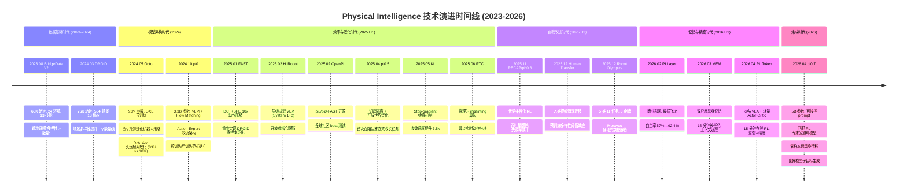
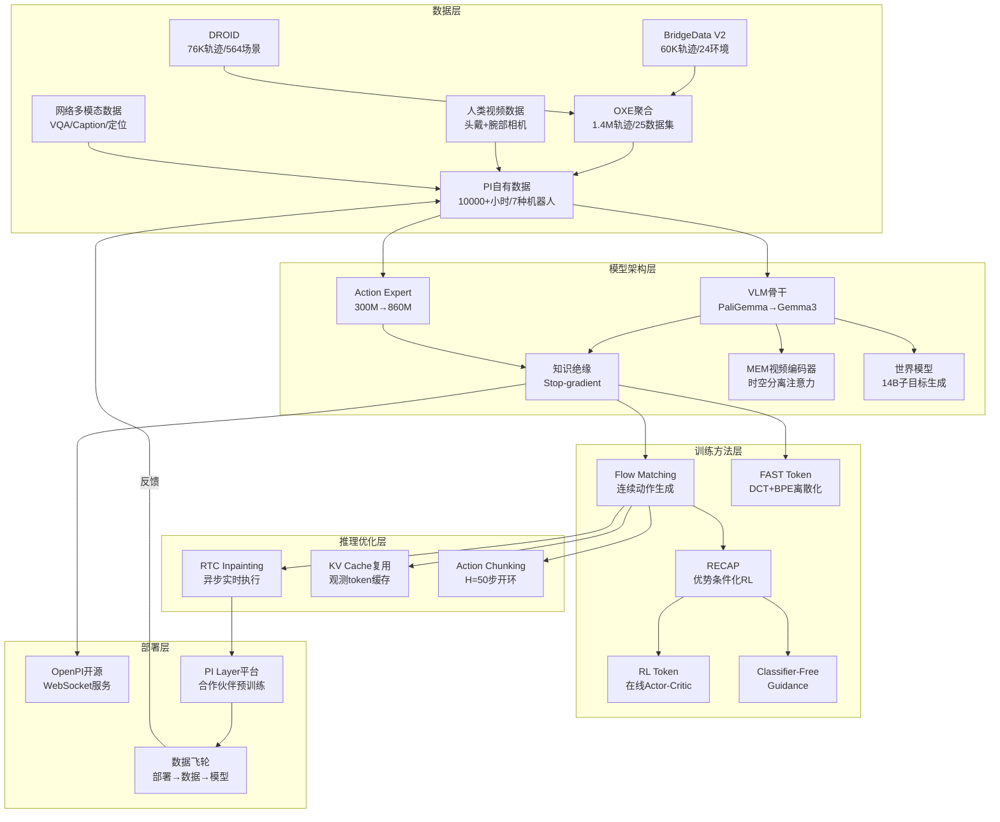
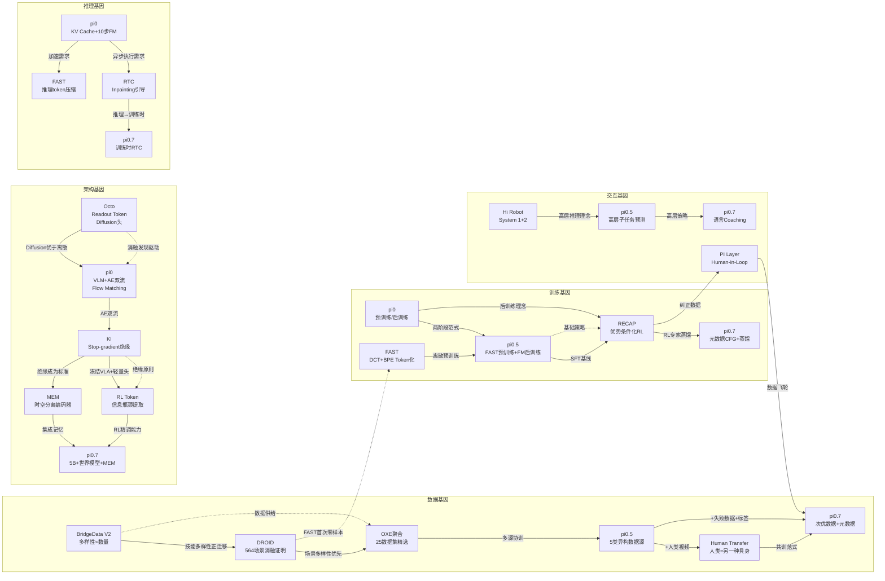

# 总结：技术演进与优化分类学

本章作为全文 17 章分析的终章，旨在从宏观视角审视 Physical Intelligence（PI）自 2023 年至 2026 年的完整技术演化轨迹，构建一套系统化的优化分类学框架，并识别贯穿整个研究序列的方法论模式。我们将通过技术传承图谱追溯每项创新的"基因谱系"，以排名表量化各项优化的实际影响力，最终展望仍未解决的核心挑战。

---

## 一、技术演进总览

### 1.1 从数据到部署：完整演化路径

PI 的研究路径可以划分为七个清晰的阶段，每个阶段都以上一阶段的成果为基础，形成层层递进的技术栈。以下 Mermaid 图展示了从 2023 年到 2026 年的完整演化时间线及论文之间的关键依赖关系。

### 1.2 技术栈全景图

以下 Mermaid 架构图展示了 PI 技术栈各组件之间的逻辑关系，从底层数据基础到顶层部署应用：

### 1.3 模型代际演化

| 代际 | 模型 | 年份 | VLM骨干 | Action Expert | 总参数 | 关键能力跃迁 |
|------|------|------|---------|---------------|--------|-------------|
| Gen 0 | Octo | 2024.05 | T5-base (冻结) | Diffusion头 (3层MLP) | 93M | 首个开源GRP, 微调到新具身 |
| Gen 1 | $\pi_0$ | 2024.10 | PaliGemma 3B | 300M Gemma | 3.3B | Flow matching + VLM, 灵巧操作 |
| Gen 1.5 | $\pi_0$-FAST | 2025.01 | PaliGemma 3B | 自回归解码 | 3B | DROID零样本, 训练效率5x |
| Gen 2 | $\pi_{0.5}$ | 2025.04 | PaliGemma 3B | 300M + KI | 3.3B | 开放世界泛化, 陌生家庭 |
| Gen 3 | $\pi_{0.6}$ | 2025.11 | Gemma 3 4B | 860M + KI | ~5B | RL自我改进, 13小时自主 |
| Gen 4 | $\pi_{0.7}$ | 2026.04 | Gemma 3 4B + MEM | 860M + KI | ~5B | 可操控prompt, 组合泛化, 世界模型 |

从 Octo 到 $\pi_{0.7}$，参数量增长约 54 倍（93M → 5B），但核心双流架构（VLM + Action Expert）自 $\pi_0$ 确立后保持不变。每一代的跃迁都不是单纯的规模扩展，而是伴随着关键方法论创新：$\pi_{0.5}$ 引入知识绝缘和 FAST 预训练，$\pi_{0.6}$ 引入优势条件化 RL，$\pi_{0.7}$ 引入丰富提示和世界模型。

---

## 二、优化分类学

本节从四个正交维度对 17 篇论文中的所有重大优化进行系统分类，构建一套完整的优化分类学（taxonomy of optimizations）。

### 角度一：按技术领域分类

#### 2.1.1 架构创新 (Architecture)

| 优化名称 | 来源论文 | 核心机制 | 影响量级 |
|----------|---------|---------|---------|
| VLM + Action Expert 双流架构 | $\pi_0$ (Ch.4) | 独立权重集处理视觉-语言与动作，通过 self-attention 交互 | 变革性 |
| Readout Token 机制 | Octo (Ch.3) | 可学习 token 被动读取内部嵌入，解耦输入输出模块化 | 重大 |
| 层级式双 VLM | Hi Robot (Ch.6) | System 1 (低层VLA) + System 2 (高层VLM) 异步运行 | 重大 |
| MEM 时空分离视频编码器 | MEM (Ch.12) | 交替空间/因果时间注意力，零新参数初始化 | 重大 |
| RL Token 信息瓶颈 | RL Token (Ch.13) | Encoder-Decoder 提取 VLA 紧凑表征 $z_{rl}$ | 重大 |
| 世界模型子目标生成 | $\pi_{0.7}$ (Ch.14) | 14B MoT 模型生成多视角子目标图像 | 重大 |
| Block-causal 注意力掩码 | $\pi_0$ (Ch.4) | 三段式掩码保护 VLM 预训练分布 | 增量 |
| Adaptive RMSNorm 时间步注入 | $\pi_{0.5}$ (Ch.7) | 替代直接融合的 flow matching 时间步条件化 | 增量 |

#### 2.1.2 训练方法 (Training)

| 优化名称 | 来源论文 | 核心机制 | 影响量级 |
|----------|---------|---------|---------|
| Flow Matching 动作生成 | $\pi_0$ (Ch.4) | 条件 flow matching 建模连续动作分布 $p(A_t|o_t)$ | 变革性 |
| FAST 动作 Token 化 | FAST (Ch.5) | DCT + 量化 + BPE 压缩，10x token 压缩 | 变革性 |
| Knowledge Insulation | KI (Ch.8) | Stop-gradient 阻断 AE→VLM 梯度，双重训练目标 | 变革性 |
| 优势条件化 RL (RECAP) | RECAP (Ch.10) | 二值优势指示器 + CFG，利用全部数据（含失败） | 变革性 |
| 预训练/后训练两阶段范式 | $\pi_0$ (Ch.4) | 类比 LLM pre-/post-training | 重大 |
| Episode 元数据条件化 | $\pi_{0.7}$ (Ch.14) | 质量/速度/错误标签作为 prompt，CFG 引导 | 重大 |
| 动作块级 TD 学习 | RL Token (Ch.13) | $C=10$ 步动作块级时序差分，缩短有效 horizon | 重大 |
| Shifted Beta 时间步采样 | $\pi_0$ (Ch.4) | 偏向高噪声区域训练 flow matching | 增量 |
| 幂律数据平衡 $n^{0.43}$ | $\pi_0$ (Ch.4) | 控制不平衡数据集的采样权重 | 增量 |
| Prompt Dropout | $\pi_{0.7}$ (Ch.14) | 随机丢弃各 prompt 组件实现灵活推理 | 增量 |

#### 2.1.3 数据工程 (Data)

| 优化名称 | 来源论文 | 核心机制 | 影响量级 |
|----------|---------|---------|---------|
| 分布式多机构采集 | DROID (Ch.2) | 13 机构/564 场景/统一硬件 | 变革性 |
| 异构多源协同训练 | $\pi_{0.5}$ (Ch.7) | 机器人+web+物体定位+语义预测 | 变革性 |
| 人类视频共训练 | Human Transfer (Ch.11) | 人类视为"另一种具身"，最小格式对齐 | 重大 |
| 合成交互数据生成 | Hi Robot (Ch.6) | VLM 逆向生成用户指令训练数据 | 重大 |
| 次优数据利用 (元数据条件化) | $\pi_{0.7}$ (Ch.14) | 失败/次优轨迹配合质量标签纳入训练 | 重大 |
| 合作伙伴预训练数据飞轮 | PI Layer (Ch.17) | 部署纠正→预训练→减少干预的正反馈 | 重大 |
| 开放式多任务采集协议 | BridgeData V2 (Ch.1) | 无预定义任务集，操作员自由执行 | 增量 |
| OXE 数据集聚合与筛选 | Octo (Ch.3) | 25 数据集精选 + 多样性加权采样 | 增量 |
| LLM 生成语言记忆标签 | MEM (Ch.12) | 压缩式语义摘要作为记忆训练信号 | 增量 |

#### 2.1.4 推理优化 (Inference)

| 优化名称 | 来源论文 | 核心机制 | 影响量级 |
|----------|---------|---------|---------|
| RTC Inpainting 引导 | RTC (Ch.9) | PGDM 梯度引导 + 软掩码 + 异步系统 | 重大 |
| FAST 推理压缩 | FAST (Ch.5) | 自回归解码步数从数百降至 30-60 | 重大 |
| KV Cache 复用 | $\pi_0$ (Ch.4) | 观测 token 缓存，仅重计算动作 token | 增量 |
| 训练时 RTC | $\pi_{0.7}$ (Ch.14) | 训练中模拟 0-12 步延迟，无推理额外开销 | 增量 |
| CFG 推理增强 | RECAP/pi0.7 (Ch.10/14) | Classifier-free guidance 增强动作质量 | 增量 |

#### 2.1.5 部署工程 (Deployment)

| 优化名称 | 来源论文 | 核心机制 | 影响量级 |
|----------|---------|---------|---------|
| 物理智能层 (PI Layer) | PI Layer (Ch.17) | 通用模型 API + 合作伙伴硬件生态 | 重大 |
| WebSocket 远程推理架构 | OpenPI (Ch.15) | 轻量客户端 + GPU 服务端分离 | 增量 |
| Human-in-the-Loop 纠正系统 | PI Layer (Ch.17) | 远程操作员实时纠错 + 数据回收 | 重大 |
| 语言 Coaching 零数据新任务 | $\pi_{0.7}$ (Ch.14) | 人类语言引导 → 高层策略训练 → 自主执行 | 增量 |

---

### 角度二：按有效性等级分类

#### 变革性创新 (Transformative)

这些创新从根本上改变了机器人学习的范式，其影响超越了单篇论文。

1. **VLM + Flow Matching Action Expert 双流架构** ($\pi_0$)：解决了自回归 VLA 无法进行高频灵巧控制的根本矛盾。$\pi_0$ 在所有任务上大幅超越 OpenVLA (7B) 和 Octo (93M)，即使仅训练 160k 步的版本也超越全部基线。这一架构设计在后续 4 代模型中保持不变。

2. **知识绝缘 (Knowledge Insulation)** (KI)：通过 stop-gradient 实现 VLM 知识保护与动作学习的解耦。训练速度提升 7.5 倍（相比 $\pi_0$），同时显著改善语言遵循能力。这一机制成为 $\pi_{0.5}$ 以后所有模型的标准组件。

3. **FAST 动作 Token 化** (FAST)：从第一性原理出发设计的压缩方案，使自回归 VLA 首次胜任高频灵巧操作。实现约 10x token 压缩（T恤折叠从 700 token 压缩至 53 个），训练 GPU 时间减少 5 倍。此后 $\pi_{0.5}$ 和 $\pi_{0.7}$ 均采用 FAST 作为预训练阶段的离散动作表示。

4. **优势条件化 RL (RECAP)** (RECAP/$\pi^*_{0.6}$)：首次在 VLA 上实现可扩展的自我改进闭环。吞吐量翻倍、失败率减半，连续自主制作咖啡 13 小时。其 advantage conditioning 方法利用全部数据（含失败），避免了 PPO/AWR 的数据浪费和似然计算问题。

5. **"多样性优先"数据工程范式** (DROID/$\pi_{0.5}$)：DROID 的消融实验（同样 7362 条轨迹，564 场景 vs. 20 场景）首次严格证明场景多样性比数据量更重要。这一发现贯穿整个系列，从 BridgeData V2 的技能多样性消融到 $\pi_{0.7}$ 的任务多样性消融。

#### 重大创新 (Significant)

6. **预训练/后训练两阶段范式** ($\pi_0$)：类比 LLM 的 pre-/post-training，预训练赋予广泛能力和错误恢复，后训练赋予流畅执行。越难的任务预训练收益越大。

7. **层级式双 VLM 架构** (Hi Robot)：指令准确率比 GPT-4o 高 40%+，解锁实时人类反馈响应能力。Oracle 实验证明性能瓶颈在推理层而非执行层。

8. **MEM 双尺度记忆** (MEM)：首次使 VLA 具备 15 分钟级长任务能力和上下文内策略调整能力（冰箱开门提升 62%）。不损害灵巧操作性能。

9. **人类到机器人涌现迁移** (Human Transfer)：发现预训练多样性达到阈值时迁移突然涌现，人类数据使目标任务性能几乎翻倍。TSNE 可视化证实形态无关表征的形成。

10. **丰富提示 + 元数据条件化** ($\pi_{0.7}$)：使模型能从更大但更嘈杂的数据中获益，无元数据时增加数据量反而降低性能。单一通用模型匹配 RL 专家。

11. **RL Token 紧凑表征** (RL Token)：从冻结 VLA 提取 1x2048 向量，仅需 15 分钟真机交互即超越基础 VLA，涌现出超越人类示范的策略。

12. **RTC 实时推理算法** (RTC)：纯推理时方法，对 300ms+ 延迟完全鲁棒，动作轨迹比同步推理快 20%、更平滑。

#### 增量创新 (Incremental)

13. **Readout Token** (Octo)：模块化的输入/输出解耦，使微调时灵活增删模态。

14. **合成交互数据生成** (Hi Robot)：VLM 逆向生成训练数据，指令准确率提升 46%。

15. **训练时 RTC** ($\pi_{0.7}$)：在训练中模拟推理延迟，无额外推理开销。

16. **分位数归一化** (FAST)：对离群动作鲁棒的跨平台归一化方案。

17. **动作块子采样** (RL Token)：stride=2 存储重叠转移对，提升数据利用效率。

---

### 角度三：按适用范围分类

#### 通用型 (General-purpose)

适用于任何 VLA 或机器人学习系统的创新：

| 创新 | 适用范围说明 |
|------|-------------|
| Flow Matching 动作生成 | 任何需要连续动作分布建模的控制系统 |
| 知识绝缘 (Stop-gradient) | 任何多目标训练中需要保护预训练知识的场景 |
| FAST Token化 | 任何自回归模型的高频连续信号压缩 |
| 预训练/后训练范式 | 任何基础模型的训练流程设计 |
| "多样性优先"数据策略 | 任何需要泛化能力的机器学习系统 |
| RTC 推理时 inpainting | 任何基于 diffusion/flow 的动作分块策略 |
| 优势条件化 RL | 任何需要从混合质量数据中学习的 RL 系统 |

#### 任务特定型 (Task-specific)

针对特定场景优化的创新：

| 创新 | 特定场景 |
|------|---------|
| 层级式双 VLM | 需要复杂语义推理的多阶段任务 |
| MEM 双尺度记忆 | 超过 1 分钟的长时程任务 |
| 世界模型子目标生成 | 需要跨具身迁移或组合泛化的场景 |
| 语言 Coaching | 需要零数据获取新任务能力的场景 |
| 人类视频共训练 | 目标任务缺乏机器人数据但有人类视频的场景 |

#### 效率型 (Efficiency-oriented)

不引入新能力但显著降低成本的创新：

| 创新 | 效率提升 |
|------|---------|
| FAST 训练压缩 | GPU 时间减少 5x |
| KV Cache 复用 | 推理延迟减少 ~50% |
| KI 收敛加速 | 训练步数减少 7.5x |
| 训练时 RTC | 零推理额外开销的实时控制 |
| RL Token 轻量 Actor-Critic | 15分钟 vs. 数天的微调时间 |
| 合作伙伴数据飞轮 | 部署本身产生训练数据，降低边际数据成本 |

---

### 角度四：按学习范式分类

#### 监督学习 (Supervised Learning)

| 方法 | 来源 | 具体形式 |
|------|------|---------|
| 行为克隆 (BC) | BridgeData V2, Octo, $\pi_0$ | MSE / Diffusion / Flow Matching 损失 |
| 监督微调 (SFT) | $\pi_0$ 后训练, Robot Olympics | 高质量任务特定数据 + Flow Matching |
| Next-Token Prediction | FAST, $\pi_{0.5}$, KI | 自回归交叉熵损失预测 FAST token |
| 子任务预测 | Hi Robot, $\pi_{0.5}$, $\pi_{0.7}$ | 联合预测子任务文本和动作 |

#### 自监督/预训练 (Self-supervised / Pre-training)

| 方法 | 来源 | 具体形式 |
|------|------|---------|
| VLM 预训练知识继承 | $\pi_0$ (PaliGemma), $\pi_{0.7}$ (Gemma3) | 从互联网规模视觉-语言预训练迁移 |
| Web 数据协同训练 | KI, $\pi_{0.5}$, $\pi_{0.7}$ | VQA/Caption/定位任务防止灾难性遗忘 |
| 跨具身预训练 | $\pi_0$, $\pi_{0.5}$, $\pi_{0.7}$ | 7-12 种机器人形态统一训练 |
| RL Token 自回归重建 | RL Token (Ch.13) | Encoder-Decoder 压缩 VLA 嵌入 |
| 世界模型 Web 预训练 | $\pi_{0.7}$ (BAGEL) | 14B 模型继承 Web 规模视觉生成知识 |

#### 强化学习 (Reinforcement Learning)

| 方法 | 来源 | 具体形式 |
|------|------|---------|
| 优势条件化 RL | RECAP (Ch.10) | 二值 $I_t$ + CFG，正则化 RL 闭式解 |
| 在线 Actor-Critic | RL Token (Ch.13) | Off-policy TD 学习，动作块级信用分配 |
| 对比 RL | BridgeData V2 (Ch.1) | CRL 目标条件值函数 (仅基线评估) |
| 元数据 CFG 引导 | $\pi_{0.7}$ (Ch.14) | 推理时 quality/speed/mistake 引导 |

#### 涌现能力 (Emergent Capabilities)

以下能力从未被显式训练，而是在满足特定条件后自发出现：

| 涌现能力 | 来源 | 条件 | 证据 |
|----------|------|------|------|
| 人类→机器人迁移 | Human Transfer (Ch.11) | 预训练多样性超过阈值 | 0-25% 多样性无效，75-100% 显著涌现 |
| 组合泛化 | $\pi_{0.7}$ (Ch.14) | 丰富提示 + 大规模多样数据 | 零样本执行从未见过的任务组合 |
| 跨具身零样本迁移 | $\pi_{0.7}$ (Ch.14) | 元数据条件化 + 世界模型 | BiPi→UR5e 衬衫折叠 85.6% 进度 |
| 超人策略涌现 | RL Token (Ch.13) | 在线 RL 探索 | 以太网插入速度超越所有人类示范 |
| 上下文内策略调整 | MEM (Ch.12) | 视频记忆 + 多样预训练 | 从失败中学习切换抓取角度 |
| 错误恢复能力 | $\pi_0$ (Ch.4) | 预训练阶段的次优数据 | 后训练模型保留从错误恢复的行为 |

---

## 三、有效性排名与分析

以下表格对 PI 系列中最具影响力的 20 项优化进行排名，排名依据为：(1) 性能提升的绝对幅度；(2) 影响的任务/场景范围；(3) 对后续工作的继承程度。

| 排名 | 优化名称 | 来源论文 | 关键证据 | 核心原因分析 |
|------|---------|---------|---------|-------------|
| 1 | VLM + Flow Matching 双流架构 | $\pi_0$ | $\pi_0$ 在所有任务上大幅超越 OpenVLA (7B), Octo (93M); 架构延续 4 代模型不变 | Flow matching 解决了自回归离散化在高频控制上的根本缺陷；独立 action expert 避免训练信号干扰；KV cache 实现高效推理 |
| 2 | 知识绝缘 (KI) | KI (Ch.8) | 收敛速度 7.5x ($\pi_0$ 的 1/7.5 训练步数); LIBERO-90 SOTA 96.0%; DROID 0.55 vs $\pi_0$ 0.49 | Stop-gradient 保护 VLM 语义知识；FAST 离散 token 为骨干提供替代学习信号；VLM 数据协训防止遗忘 |
| 3 | FAST 动作 Token 化 | FAST (Ch.5) | T恤折叠 700→53 token (13.2x); 训练 GPU 时间 5x 减少; 首次 DROID 零样本泛化 | DCT 将时域冗余转为频域稀疏；BPE 压缩零值模式；列优先展平保证先低频后高频的生成顺序 |
| 4 | 场景多样性驱动泛化 | DROID (Ch.2) | 同量数据下 564 场景 >> 20 场景 (OOD 评估); DROID 联合训练比 OXE (18x 数据量) 更优 | 场景多样性提供更有价值的分布覆盖信号；多维度多样性（场景/任务/视角/交互位置）协同作用 |
| 5 | 优势条件化 RL | RECAP (Ch.10) | 吞吐量 2x 提升; 失败率减半; 洗衣成功率 97%; 咖啡 13 小时自主 | 利用全部数据（含失败）训练；二值优势 + CFG 避免似然计算；优于 PPO (稳定性) 和 AWR (数据利用) |
| 6 | 预训练/后训练两阶段范式 | $\pi_0$ (Ch.4) | 越难任务预训练收益越大；仅预训练无后训练的模型执行不够流畅；仅后训练的模型缺乏恢复能力 | 预训练的多样数据提供鲁棒性和错误恢复；后训练的高质量数据提供流畅执行；两者不可替代 |
| 7 | 丰富提示 + 元数据条件化 | $\pi_{0.7}$ (Ch.14) | 无元数据时增加数据反而降低性能; 有元数据时持续改善; 匹配 RL 专家性能 | 消解异质数据歧义；使模型从噪杂数据中获益；推理时 CFG 引导高质量行为 |
| 8 | 异构多源协同训练 | $\pi_{0.5}$ (Ch.7) | 移除 ME/CE 数据均导致显著下降; 从 3→104 训练环境持续提升; OOD 与训练环境表现持平 | 不同数据源提供互补的多样性维度（ME=环境，CE=任务，WD=语义）；跨构型正迁移 |
| 9 | 层级式双 VLM (Hi Robot) | Hi Robot (Ch.6) | 指令准确率比 GPT-4o 高 40%+; 合成数据贡献 IA +46%, TP +39%; 层级架构贡献 IA +34% | 频率分离匹配认知/控制时间尺度；语言接口保证可解释性和模块化；微调VLM远超通用LLM |
| 10 | MEM 双尺度记忆 | MEM (Ch.12) | 冰箱开门 +62%; 食谱/清理任务显著提升; 不损害灵巧操作 | 视频记忆处理短期遮挡和即时调整；语言记忆追踪长期语义进展；时空分离注意力保证计算效率 |
| 11 | RL Token 紧凑表征 | RL Token (Ch.13) | 螺钉成功率 +40%; 以太网速度 3x 提升; 中位执行 66 步 vs 人类 146 步 | VLA 嵌入包含丰富行为先验；信息瓶颈压缩为高效 RL 输入；动作块级 TD 解决稀疏奖励信用分配 |
| 12 | 人类视频涌现迁移 | Human Transfer (Ch.11) | Spice 32%→71%; Eggs 排序准确率 57%→78%; 存在清晰的涌现阈值 | 多样预训练形成形态无关统一表征空间；人类数据同时在高层和低层迁移；与跨具身迁移共享机制 |
| 13 | RTC 实时推理 | RTC (Ch.9) | 对 300ms+ 延迟完全鲁棒; 动作轨迹快 20% 更平滑; TE 在 100ms+ 延迟下完全失效 | 引导式 inpainting 优于直接覆写；软掩码指数衰减平衡一致性与灵活性；异步架构解耦推理与执行 |
| 14 | 数据飞轮部署模式 | PI Layer (Ch.17) | 自主率 57%→92.4% (Weave); 吞吐量 134→165 件/小时 (Ultra); 干预减少 50% | 部署数据纳入预训练（非仅微调）；正反馈循环持续降低边际干预成本；模型代际升级带来阶梯式提升 |
| 15 | 世界模型子目标生成 | $\pi_{0.7}$ (Ch.14) | 跨具身衬衫折叠 85.6% 进度 (接近人类专家 90.9%); 反向任务中子目标是成功关键 | Web 规模预训练知识迁移到机器人策略；视觉子目标消除语言歧义；弥合跨形态策略差异 |
| 16 | Diffusion 头优于离散化 | Octo (Ch.3) | 83% vs 18% (离散) vs 35% (MSE); 后续 $\pi_0$ 直接采用 flow matching | 多模态动作分布建模能力；避免离散化精度损失；避免 MSE 的"对冲"行为 |
| 17 | 技能多样性正迁移 | BridgeData V2 (Ch.1) | 13 技能 65% vs 3 技能 30% (同等数据量) | 多样化技能数据帮助学习更通用的视觉-运动表征；不同技能间存在共享的底层结构 |
| 18 | 口头指令数据杠杆效应 | $\pi_{0.5}$ (Ch.7) | 仅占 11% 高层样本但移除后显著下降 | 高质量人类语言示范对高层策略质量有不成比例的影响 |
| 19 | 合成数据生成 (逆向VLM) | Hi Robot (Ch.6) | IA +46%, TP +39%; 无合成数据的模型完全忽略用户约束 | 逆向生成避免真实交互采集的高成本；结构化场景分类确保多样性 |
| 20 | 次优数据蒸馏 | $\pi_{0.7}$ (Ch.14) | 移除评估数据后性能显著下降; RL 专家策略被"蒸馏"入通用模型 | 元数据消解质量歧义；次优数据丰富状态覆盖增强鲁棒性 |

---

## 四、跨论文技术传承图

以下 Mermaid 图谱追溯每项核心创新的"基因谱系"——即哪项创新从哪篇论文传承到哪篇后续工作，以及传承过程中的演化。

### 关键传承路径解读

**数据→架构→训练的三螺旋**：PI 的技术演化不是线性的，而是数据工程、模型架构和训练方法三条路径的螺旋式交织。例如：

1. **BridgeData V2 的技能多样性消融**（13 技能 65% vs 3 技能 30%）→ 启发 DROID 的分布式多场景采集 → 启发 $\pi_{0.5}$ 的 5 类异构数据源设计。

2. **Octo 的 diffusion 头消融**（83% vs 离散化 18%）→ 直接导致 $\pi_0$ 选择 flow matching → FAST 发现可以用频域压缩让离散化也胜任高频任务 → $\pi_{0.5}$ 将两者结合（FAST 预训练 + FM 后训练）→ KI 形式化了双重训练目标的梯度隔离机制。

3. **$\pi_0$ 的预训练/后训练范式** → 催生 RECAP 的 RL 后训练 → $\pi_{0.7}$ 将 RECAP 的 RL 专家轨迹作为训练数据蒸馏入通用模型 → PI Layer 将部署纠正数据纳入下一代预训练。

**绝缘原则的扩散**：KI 论文提出的 stop-gradient 机制不仅被 $\pi_{0.5}$/$\pi_{0.6}$/$\pi_{0.7}$ 全部采用，还启发了 RL Token 的"冻结 VLA + 轻量头"设计范式和 MEM 的"记忆模块不干扰动作预测"原则。这体现了一个深层方法论洞察：**在大模型中，保护比联合优化更有效**。

---

## 五、方法论模式总结

### 模式一：LLM 类比驱动设计

**定义**：将大语言模型领域已验证的范式系统性地迁移到机器人学习中，作为架构和训练决策的指导原则。

**体现论文**：

- $\pi_0$：预训练/后训练两阶段范式 $\leftarrow$ LLM 的 pre-training / instruction tuning
- Hi Robot：System 1 + System 2 $\leftarrow$ Kahneman 认知理论在 LLM 中的应用（CoT, tool use）
- RECAP：优势条件化 RL $\leftarrow$ RLHF / DPO 的正则化 RL 框架
- $\pi_{0.7}$：RL 专家蒸馏入通用模型 $\leftarrow$ LLM 的模型蒸馏
- OpenPI：开源生态 $\leftarrow$ GPT-2/LLaMA 开源范式
- $\pi_{0.5}$：FAST 离散预训练 + FM 后训练 $\leftarrow$ LLM 先离散 token 预训练再对齐的思路
- MEM：记忆窗口预训练短→后训练扩展 $\leftarrow$ LLM 的上下文窗口扩展技术

**深层原因**：PI 的核心假设是机器人基础模型遵循与语言基础模型相同的 scaling 法则。这一假设至今未被否证——从 Octo (93M) 到 $\pi_{0.7}$ (5B)，每次规模和数据的扩展都带来了持续的性能提升。LLM 类比不仅加速了设计决策，更重要的是建立了一套可预测的技术路线图：当 LLM 领域出现新范式时（如 RLHF, CoT, MoE），PI 可以系统性地评估其在机器人领域的适用性。

### 模式二：绝缘原则

**定义**：在系统的不同组件之间建立单向信息流屏障，防止一个训练目标的梯度信号破坏另一个组件已获得的知识。

**体现论文**：

- KI (Ch.8)：stop-gradient 阻断 Action Expert → VLM 骨干的梯度回传，训练速度提升 7.5x
- RL Token (Ch.13)：冻结整个 VLA，仅训练轻量 actor-critic 头部，15 分钟即超越基础策略
- MEM (Ch.12)：视频编码器独立于动作预测模块，不引入新参数，保证单帧输入时与预训练完全一致
- $\pi_{0.7}$ (Ch.14)：Action Expert 梯度不回传到 VLM 骨干（继承 KI）
- $\pi_0$ (Ch.4)：Action Expert 独立权重集（早期形态，尚未显式 stop-gradient）

**反面证据**：KI 论文的消融实验清晰展示了不使用绝缘的代价——joint-training（无 stop-gradient）在 items in drawer 任务中语言遵循能力严重受损，模型被指示收拾勺子却去抓垃圾。$\pi_0$ 原始论文中也观察到 action expert 的 flow matching 训练信号会"污染" VLM 表征。

**深层原因**：这一模式反映了多任务学习中的根本张力——不同目标函数的梯度方向可能相互冲突。在 VLA 中，flow matching 的 MSE 梯度与交叉熵的离散梯度在表征空间中指向不同方向。绝缘原则通过物理隔离（而非加权平衡）解决了这一冲突，代价是放弃了端到端联合优化的理论优势，但实践证明保护已有知识比追求联合最优更重要。

### 模式三：涌现范式

**定义**：特定能力在模型规模或数据多样性超过某个临界阈值后突然出现，而非通过显式训练目标获得。

**体现论文**：

- Human Transfer (Ch.11)：人类→机器人迁移在预训练多样性 0-25% 时无效甚至有害，75-100% 时突然涌现并显著生效。TSNE 可视化显示表征空间从分离到融合的"相变"。
- $\pi_{0.7}$ (Ch.14)：组合泛化——零样本执行从未见过的任务组合（如操作空气炸锅）；跨具身迁移——BiPi→UR5e 衬衫折叠达到 85.6% 进度。
- RL Token (Ch.13)：超人策略——以太网插入中涌现出从未在示范数据中出现的"施压摆动"策略，中位执行时间仅为人类的 45%。
- MEM (Ch.12)：上下文内策略调整——模型在短期记忆中观察到失败后自动切换抓取策略，尽管从未被显式训练这一行为。
- $\pi_0$ (Ch.4)：错误恢复能力——预训练模型在后训练后保留从错误中恢复的行为，尽管后训练数据几乎不含错误。

**深层原因**：涌现现象暗示机器人能力可能存在类似 LLM 的"相变"机制。当模型内部形成足够通用的表征空间时（例如形态无关的操作语义嵌入），新的能力可以作为已有表征的组合而自然出现。PI 的数据表明，达到这一临界点的关键因素不是参数量，而是**预训练数据的多样性**——涵盖足够多的具身形态、场景和任务才能催生通用表征。

### 模式四：消融驱动工程

**定义**：每篇论文都包含系统性的消融实验，且消融实验的发现直接驱动下一代模型的关键设计决策。

**传承链条**：

1. BridgeData V2 (Ch.1)：技能多样性消融（13 技能 65% vs 3 技能 30%）→ 启发 DROID 强调场景多样性
2. Octo (Ch.3)：Diffusion 头消融（83% vs 离散化 18%）→ $\pi_0$ 直接采用 flow matching
3. $\pi_0$ (Ch.4)：VLM 初始化消融（$\pi_0$ >> $\pi_0$-small）→ KI 研究如何保护 VLM 知识
4. KI (Ch.8)：Stop-gradient 消融 → 成为 $\pi_{0.5}$/$\pi_{0.6}$/$\pi_{0.7}$ 的标准组件
5. RECAP (Ch.10)：优势条件化 vs PPO/AWR 消融 → $\pi_{0.7}$ 采用元数据 CFG 引导
6. MEM (Ch.12)：预训练 vs 仅后训练记忆消融 → 确认记忆能力需要预训练阶段发展
7. $\pi_{0.7}$ (Ch.14)：元数据 + 数据量交互消融 → 证明丰富提示改变了数据规模的 scaling 特性

**深层原因**：机器人学习是一个高度工程化的领域，理论指导有限。消融实验提供了一种"受控实验"的方法论，使研究者能在多个设计选择中做出有证据支撑的决策。PI 的每篇论文通常消融 4-8 个关键维度，每个维度的发现都为后续工作提供了明确的设计指引。这种方法论本身就是 PI 研究序列高效演进的重要原因。

### 模式五：频率分离与异步架构

**定义**：将不同时间尺度的计算过程解耦，在各自的最优频率下独立运行。

**体现论文**：

- Hi Robot (Ch.6)：高层 VLM (1 Hz) + 低层 VLA (10-50 Hz) 异步运行
- RTC (Ch.9)：推理线程（~10 Hz）+ 控制器线程（50 Hz）通过互斥锁同步
- $\pi_{0.7}$ (Ch.14)：世界模型（1.25 秒/次）+ 高层策略 + 低层 VLA 在独立线程运行
- $\pi_0$ (Ch.4)：观测编码（每 chunk 一次）+ flow matching（每步一次）+ 动作执行（50 Hz）
- MEM (Ch.12)：高层语言记忆（每子任务更新）+ 低层视频记忆（5 秒窗口）+ 动作生成

**深层原因**：物理操作中不同层次的决策有截然不同的时间常数——高层语义推理需要秒级思考时间，而精细运动控制需要毫秒级响应。强制将所有计算塞入同一推理循环（如端到端 VLA）会在计算效率和控制频率之间产生不可调和的矛盾。频率分离通过让每个组件在其自然频率下运行来解决这一矛盾。

### 模式六：双重表征桥接

**定义**：在训练和推理中同时维护同一信息的两种互补表征，利用各自的优势。

**体现论文**：

- KI/$\pi_{0.5}$/$\pi_{0.6}$/$\pi_{0.7}$：FAST 离散 token（训练时用于骨干学习）+ 连续动作（推理时用于精确控制）
- RECAP (Ch.10)：二值优势指示器 $I_t$（训练时的条件化标签）+ CFG（推理时的引导信号）
- $\pi_{0.7}$ (Ch.14)：语言子任务指令（语义层）+ 世界模型视觉子目标（视觉层）
- MEM (Ch.12)：语言记忆（长期语义摘要）+ 视频记忆（短期视觉上下文）
- RL Token (Ch.13)：VLA 高维嵌入（源表征）+ $z_{rl}$ 紧凑向量（RL 用压缩表征）

**深层原因**：没有单一表征能同时满足所有需求——离散 token 训练快但推理慢，连续动作推理快但训练时不提供良好的骨干学习信号。双重表征通过在训练/推理的不同阶段使用不同表征来规避"不可能三角"。这一模式的关键工程约束是两种表征之间的信息隔离——KI 发现允许两种动作表示互相 attend 会严重损害性能（vs. HybridVLA 基线）。

### 模式七：最小对齐与格式统一

**定义**：面对异构数据源时，进行最小程度的格式对齐而非复杂的域适应，让模型自身学习跨域映射。

**体现论文**：

- $\pi_0$ (Ch.4)：所有机器人动作零填充至 18 维统一向量
- Human Transfer (Ch.11)：人类视为"另一种具身"，仅做 6-DoF 姿态提取，不做显式域适应
- $\pi_{0.5}$ (Ch.7)：5 类异构数据源使用统一训练目标
- $\pi_{0.7}$ (Ch.14)：失败/次优轨迹不做筛选，配合元数据标签直接纳入训练
- Octo (Ch.3)：缺失相机通道零填充，夹爪语义统一

**深层原因**：复杂的域适应管道（对抗训练、表征对齐损失、手工特征映射）引入了脆弱性和超参数敏感性。Human Transfer 论文的核心发现——迁移能力从预训练多样性中涌现而非从对齐技术中构建——表明，当模型足够大、数据足够多样时，最小对齐反而是最优策略。模型的表征学习能力本身就是最好的"对齐器"。

---

## 六、未解决问题与未来方向

### 6.1 Sim-to-Real 鸿沟

PI 的所有 17 篇论文中，训练数据完全来自真实机器人和人类视频，仿真数据仅在 RTC 论文的 Kinetix 基准中用于推理算法验证。这与 NVIDIA Isaac、DeepMind 等大量使用仿真的路线形成鲜明对比。关键问题包括：

- 仿真数据能否作为 $\pi_{0.7}$ 预训练混合数据的有效补充？
- 仿真生成的多样性能否替代昂贵的真实世界分布式采集？
- 仿真中的接触力学/柔性物体建模精度是否是瓶颈？

$\pi_{0.7}$ 的世界模型（基于 BAGEL 的图像生成模型）已展示了一种"软仿真"路径——不模拟物理，而是生成视觉子目标。未来可能出现"可交互视觉仿真"作为 Sim-to-Real 的中间态。

### 6.2 安全性与可靠性

$\pi_{0.7}$ 在跨具身衬衫折叠中达到 85.6% 任务进度，接近但未超越人类专家的 90.9%。在安全关键场景（医疗辅助、共享空间操作）中，这一差距可能是不可接受的。目前 PI 的研究序列尚未涉及：

- 形式化安全保证（如碰撞避免约束、力限制）
- 对抗鲁棒性（面对蓄意干扰的应对能力）
- 不确定性量化（模型"知道自己不知道"的能力）
- 可预测性（人类能否预判机器人下一步动作）

RECAP 的人类纠正机制和 PI Layer 的 Human-in-the-Loop 系统提供了运行时安全的工程解决方案，但缺乏理论保证。

### 6.3 边缘设备部署的计算效率

$\pi_{0.7}$ 需要至少一块 H100 GPU 进行推理（最简 38ms，最复杂 127ms + 世界模型 4xH100）。对于真正的家庭部署场景，要求每台机器人搭载数据中心级 GPU 在成本和功耗上都不现实。关键技术方向包括：

- 模型蒸馏：将 5B 模型蒸馏到 500M-1B 级别
- 量化：FAST 论文已展示 bfloat16 的可行性，INT8/INT4 是否可行？
- 硬件加速：专用 NPU/FPGA 在 flow matching 推理上的效率
- 混合云-边架构：高层推理在云端，低层控制在边缘

### 6.4 超长时自主运行

MEM 将任务时长推进到 15 分钟，RECAP 展示了 13 小时的单一重复任务自主运行。但真正的家庭/工业场景需要：

- **全天候自主**（8+ 小时，多种任务交替）
- **环境持续变化的适应**（光照变化、人类活动干扰、物体位置改变）
- **长期记忆管理**（MEM 的语言摘要机制能否扩展到数小时？信息压缩 vs. 遗忘的权衡？）
- **能量和硬件退化管理**（电池续航、关节磨损引起的动力学漂移）

### 6.5 多机器人协作

PI 的所有 17 篇论文均聚焦单机器人控制。双臂系统（如 ALOHA、BiPi）虽涉及多关节协调，但本质上是单智能体的多执行器控制。以下场景完全未被探索：

- 多机器人任务分配与调度
- 共享工作空间中的碰撞避免协议
- 分布式感知融合（多机器人视角互补）
- 异构机器人团队协作（移动底盘 + 固定臂 + 空中无人机）

$\pi_{0.7}$ 的跨具身迁移能力（BiPi→UR5e）暗示了多机器人间策略共享的可能性，但从策略共享到协作调度仍有巨大鸿沟。

### 6.6 从分析中新识别的开放问题

#### 6.6.1 涌现能力的可预测性

Human Transfer 论文发现的"涌现阈值"目前是事后观察到的，无法事先预测。关键问题是：

- 能否建立预训练多样性 $\rightarrow$ 涌现能力的定量 scaling law？
- 不同类型的涌现（跨具身迁移 vs. 组合泛化 vs. 超人策略）是否有不同的阈值？
- 是否存在"反向涌现"——某些能力在进一步扩展时突然消失？

#### 6.6.2 世界模型与策略的深度融合

$\pi_{0.7}$ 的世界模型（14B BAGEL）与策略模型（5B VLA）目前仅通过异步生成的子目标图像交互。更深层次的融合可能包括：

- 策略内部的"心理模拟"——在决策前运行世界模型预演多条轨迹
- 世界模型从策略执行反馈中持续学习（闭环训练）
- 用世界模型生成的虚拟经验替代部分真实交互（Model-based RL）

#### 6.6.3 知识绝缘的理论基础

KI 的 stop-gradient 机制在实践中效果显著，但缺乏理论解释。关键问题包括：

- 为什么梯度隔离比联合优化更优？信息论视角能否提供解释？
- 是否存在比 stop-gradient 更优的梯度调制方案（如自适应衰减）？
- 绝缘原则在其他多目标学习场景中是否同样成立？

#### 6.6.4 数据飞轮的收敛性

PI Layer 展示的部署→数据→模型正反馈循环是否有理论收敛保证？关键担忧：

- 模型错误模式是否会通过数据飞轮自我强化（"回声室"效应）？
- 人类纠正的边际价值是否递减？如何确定最优纠正策略？
- 飞轮在面对分布漂移（新物体类型、新场景类型）时的稳定性？

#### 6.6.5 触觉与力反馈的缺席

PI 系列所有模型仅依赖视觉和本体感知（关节角度/速度），完全未使用触觉传感器。考虑到人类操作中触觉的关键角色（判断物体硬度、检测滑动、感知接触状态），这是一个明显的感知瓶颈。Octo 论文中力/力矩传感器的微调实验是唯一的例外，但仅在单一任务上评估。

---

## 七、结语

Physical Intelligence 在 2023-2026 年间发表的 17 篇论文构成了一条从数据基础设施到商业部署的完整技术路径。这条路径的核心叙事可以凝练为三个递进的论点：

**第一**，机器人基础模型遵循与语言基础模型相同的演化逻辑——规模化的多样数据 + 大容量预训练 + 对齐后训练可以产出越来越通用的能力。从 BridgeData V2 的 60K 轨迹到 $\pi_{0.7}$ 的 10,000+ 小时数据，从 Octo 的 93M 参数到 $\pi_{0.7}$ 的 5B 参数，每次扩展都带来了可量化的性能提升，且 scaling 趋势尚未出现饱和迹象。

**第二**，物理智能的关键瓶颈是**数据多样性**而非算法创新。DROID 的场景多样性消融、$\pi_{0.5}$ 的环境数量 scaling 曲线、$\pi_{0.7}$ 的任务多样性消融——所有证据都指向同一结论：在架构和训练方法已经"足够好"的前提下，决定模型泛化能力上限的是训练数据覆盖的分布范围。Moravec 悖论在这一框架下被重新诠释为"数据稀疏性声明"——物理技能之所以"困难"，是因为互联网上没有足够的物理交互数据。

**第三**，通用机器人策略正在从实验室走向真实世界的商业部署。PI Layer 展示的 92.4% 自主率（Weave 洗衣场景）和 96.4% 全班次自主率（Ultra 仓库场景）虽然尚不完美，但已经达到了商业可行性的临界点。数据飞轮机制保证了持续改进的可能性——每一次部署都在为下一代模型积累训练数据。

从优化分类学的角度看，PI 系列的 20 项核心优化可以归结为五个"元优化"：(1) 用 flow matching 替代自回归离散化解决动作建模问题；(2) 用 knowledge insulation 解决多目标训练冲突；(3) 用 FAST 压缩解决 token 效率问题；(4) 用 advantage conditioning 解决自我改进问题；(5) 用元数据条件化解决数据异质性问题。这五个元优化之间存在深层的逻辑关联——它们共同解决了"如何让一个通用模型高效利用大规模异构数据"这一根本性工程挑战。

展望未来，PI 的技术路线图指向三个方向：**向下**，将 5B 参数模型压缩到边缘设备可承受的规模；**向上**，通过世界模型和组合泛化解锁开放式任务执行；**向外**，通过数据飞轮和 PI Layer 平台将物理智能扩展到所有需要物理交互的应用场景。如果 LLM 的历史轨迹可以作为参考，那么我们可能正处于机器人基础模型的"GPT-3 时刻"——模型已经展示出令人印象深刻的能力，但真正的产业变革尚未开始。

---

> **文档统计**: 本综述覆盖 14 篇正式论文 + 3 篇博客文章，涵盖 2023 年 8 月至 2026 年 4 月的 17 项研究成果。分类学包含 4 个正交分类维度、42 项具体优化条目、20 项排名优化、7 种方法论模式、6+5 个未解决问题。技术传承图谱追溯了 30+ 条跨论文创新传承路径。
