# π₀.₅ 设计与实现分析

> 基于 OpenPI 代码库（[Physical-Intelligence/openpi](https://github.com/Physical-Intelligence/openpi)）的深度分析

---

## 目录

1. [概述](#1-概述)
2. [整体架构](#2-整体架构)
3. [模型类设计](#3-模型类设计)
4. [知识隔离：离散状态输入](#4-知识隔离离散状态输入)
5. [AdaRMSNorm 时间步注入](#5-adarmsnorm-时间步注入)
6. [双专家 Transformer 架构](#6-双专家-transformer-架构)
7. [注意力掩码机制](#7-注意力掩码机制)
8. [流匹配训练](#8-流匹配训练)
9. [推理去噪流程](#9-推理去噪流程)
10. [数据处理管道](#10-数据处理管道)
11. [训练配置](#11-训练配置)
12. [π₀ vs π₀.₅ 对比](#12-π₀-vs-π₀₅-对比)
13. [LoRA 微调与 PyTorch 支持](#13-lora-微调与-pytorch-支持)
14. [参考资料](#14-参考资料)
15. [训练参数调优完全指南](#15-训练参数调优完全指南)

---

## 1. 概述

### 1.1 什么是 π₀.₅？

π₀.₅ 是 Physical Intelligence 提出的第二代视觉-语言-动作（VLA）流模型，是 π₀ 的改进版本。它在保持 π₀ 流匹配（Flow Matching）连续动作生成能力的同时，引入了两项关键创新：

1. **知识隔离（Knowledge Insulation）**：将机器人状态从连续向量变为离散语言 token，阻断动作专家梯度对预训练 VLM 知识的破坏
2. **AdaRMSNorm 时间步注入**：用自适应 RMS 归一化替代简单的 MLP 融合，在 Transformer 每一层进行更精细的时间步条件化

### 1.2 代码层面的统一设计

在 OpenPI 代码库中，π₀ 和 π₀.₅ 共享同一个 `Pi0` 类，通过配置标志 `pi05: bool` 切换行为。这种设计最大程度地复用了代码，同时保持了架构差异的清晰表达：

```python
# src/openpi/models/pi0_config.py (L28-L41)
@dataclasses.dataclass(frozen=True)
class Pi0Config(_model.BaseModelConfig):
    # ...
    # Pi05 has two differences from Pi0:
    # - the state input is part of the discrete language tokens rather than a continuous input
    #   that is part of the suffix
    # - the action expert uses adaRMSNorm to inject the flow matching timestep
    pi05: bool = False
    discrete_state_input: bool = None  # type: ignore

    def __post_init__(self):
        if self.max_token_len is None:
            object.__setattr__(self, "max_token_len", 200 if self.pi05 else 48)
        if self.discrete_state_input is None:
            object.__setattr__(self, "discrete_state_input", self.pi05)
```

**设计决策**：`max_token_len` 从 48 增加到 200，因为离散化的状态需要更多 token 空间来编码（每个状态维度被转换为一个整数文本 token）。

---

## 2. 整体架构

### 2.1 组件图

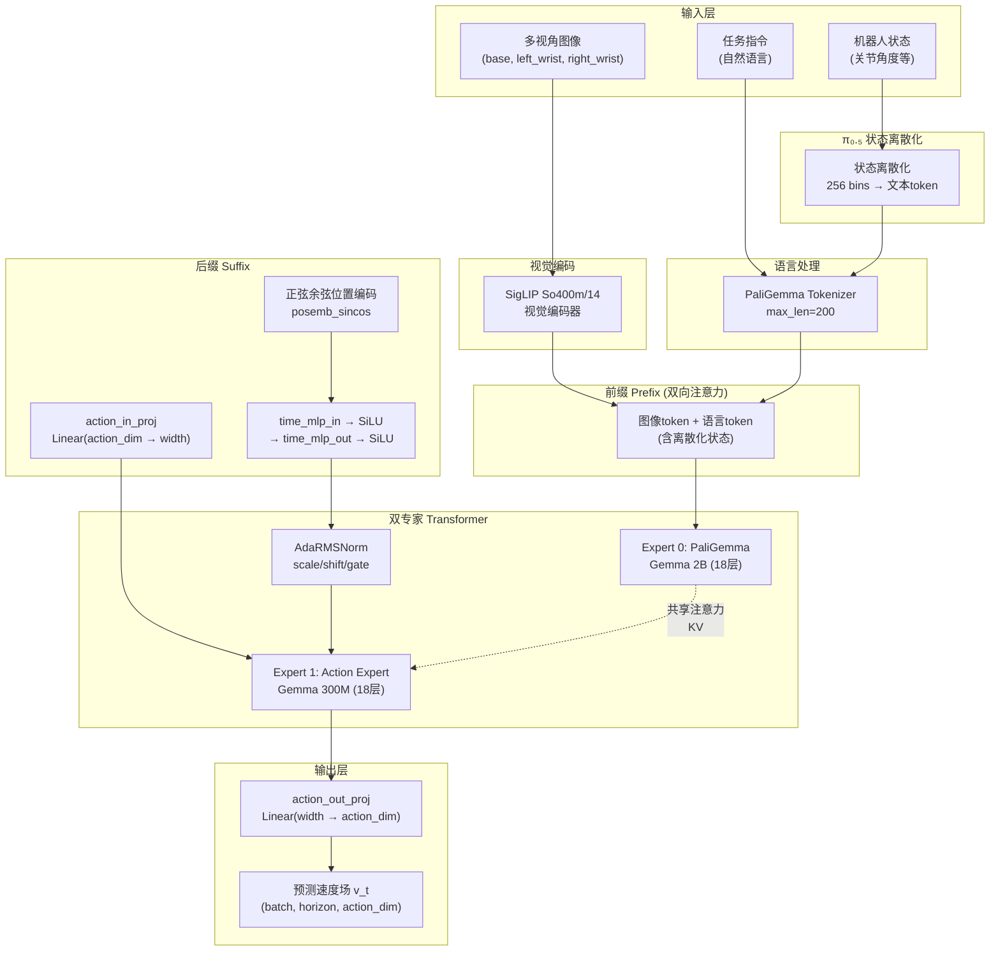
```mermaid
graph TB
    subgraph "输入层"
        IMG["多视角图像<br/>(base, left_wrist, right_wrist)"]
        TASK["任务指令<br/>(自然语言)"]
        STATE["机器人状态<br/>(关节角度等)"]
    end

    subgraph "视觉编码"
        SIGLIP["SigLIP So400m/14<br/>视觉编码器"]
    end

    subgraph "语言处理"
        TOK["PaliGemma Tokenizer<br/>max_len=200"]
    end

    subgraph "π₀.₅ 状态离散化"
        DISC["状态离散化<br/>256 bins → 文本token"]
    end

    subgraph "前缀 Prefix (双向注意力)"
        PREFIX["图像token + 语言token<br/>(含离散化状态)"]
    end

    subgraph "后缀 Suffix"
        ACT_PROJ["action_in_proj<br/>Linear(action_dim → width)"]
        TIME_EMB["正弦余弦位置编码<br/>posemb_sincos"]
        TIME_MLP["time_mlp_in → SiLU<br/>→ time_mlp_out → SiLU"]
    end

    subgraph "双专家 Transformer"
        PG["Expert 0: PaliGemma<br/>Gemma 2B (18层)"]
        AE["Expert 1: Action Expert<br/>Gemma 300M (18层)"]
        ADARMS["AdaRMSNorm<br/>scale/shift/gate"]
    end

    subgraph "输出层"
        OUT_PROJ["action_out_proj<br/>Linear(width → action_dim)"]
        VT["预测速度场 v_t<br/>(batch, horizon, action_dim)"]
    end

    IMG --> SIGLIP --> PREFIX
    TASK --> TOK --> PREFIX
    STATE --> DISC --> TOK

    PREFIX --> PG
    ACT_PROJ --> AE
    TIME_EMB --> TIME_MLP --> ADARMS --> AE

    PG -.-> |"共享注意力<br/>KV"| AE
    AE --> OUT_PROJ --> VT
```

### 2.2 架构设计理由

**为什么使用双专家架构？**

π₀/π₀.₅ 采用双专家设计而非单一模型，核心原因是：

- **Expert 0 (PaliGemma 2B)**：从预训练的 PaliGemma checkpoint 加载，保留了大规模网络数据训练获得的视觉-语言理解能力。权重命名无后缀（如 `attn`, `mlp`），确保与 PaliGemma checkpoint 无缝兼容。
- **Expert 1 (Action Expert 300M)**：随机初始化，专门学习机器人动作生成。权重带后缀 `_1`（如 `attn_1`, `mlp_1`）以区分。
- 两个专家在同一个 Transformer 中运行，共享注意力的 K/V（通过拼接 token 序列实现），但各自有独立的 Q/K/V 投影和 FFN 参数。

**为什么选择 SigLIP 而非 CLIP？**

SigLIP 使用 Sigmoid 损失替代 Softmax 对比损失，在相同模型规模下具有更好的零样本分类性能，且对 batch size 更鲁棒——这对机器人数据的批量大小限制尤为重要。

---

## 3. 模型类设计

### 3.1 类图

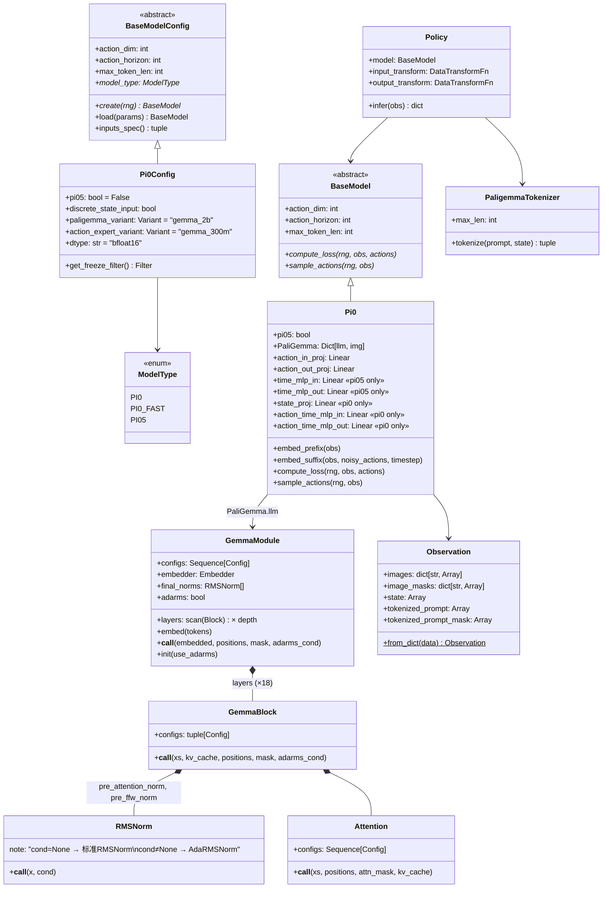
```mermaid
classDiagram
    class BaseModelConfig {
        <<abstract>>
        +action_dim: int
        +action_horizon: int
        +max_token_len: int
        +model_type: ModelType*
        +create(rng) BaseModel*
        +load(params) BaseModel
        +inputs_spec() tuple
    }

    class Pi0Config {
        +pi05: bool = False
        +discrete_state_input: bool
        +paligemma_variant: Variant = "gemma_2b"
        +action_expert_variant: Variant = "gemma_300m"
        +dtype: str = "bfloat16"
        +get_freeze_filter() Filter
    }

    class ModelType {
        <<enum>>
        PI0
        PI0_FAST
        PI05
    }

    class BaseModel {
        <<abstract>>
        +action_dim: int
        +action_horizon: int
        +max_token_len: int
        +compute_loss(rng, obs, actions)*
        +sample_actions(rng, obs)*
    }

    class Pi0 {
        +pi05: bool
        +PaliGemma: Dict[llm, img]
        +action_in_proj: Linear
        +action_out_proj: Linear
        +time_mlp_in: Linear  «pi05 only»
        +time_mlp_out: Linear  «pi05 only»
        +state_proj: Linear  «pi0 only»
        +action_time_mlp_in: Linear  «pi0 only»
        +action_time_mlp_out: Linear  «pi0 only»
        +embed_prefix(obs)
        +embed_suffix(obs, noisy_actions, timestep)
        +compute_loss(rng, obs, actions)
        +sample_actions(rng, obs)
    }

    class GemmaModule {
        +configs: Sequence[Config]
        +embedder: Embedder
        +layers: scan(Block) × depth
        +final_norms: RMSNorm[]
        +adarms: bool
        +embed(tokens)
        +__call__(embedded, positions, mask, adarms_cond)
        +init(use_adarms)
    }

    class GemmaBlock {
        +configs: tuple[Config]
        +__call__(xs, kv_cache, positions, mask, adarms_cond)
    }

    class RMSNorm {
        +__call__(x, cond)
        note: "cond=None → 标准RMSNorm\ncond≠None → AdaRMSNorm"
    }

    class Attention {
        +configs: Sequence[Config]
        +__call__(xs, positions, attn_mask, kv_cache)
    }

    class Observation {
        +images: dict[str, Array]
        +image_masks: dict[str, Array]
        +state: Array
        +tokenized_prompt: Array
        +tokenized_prompt_mask: Array
        +from_dict(data) Observation$
    }

    class PaligemmaTokenizer {
        +max_len: int
        +tokenize(prompt, state) tuple
    }

    class Policy {
        +model: BaseModel
        +input_transform: DataTransformFn
        +output_transform: DataTransformFn
        +infer(obs) dict
    }

    BaseModelConfig <|-- Pi0Config
    BaseModel <|-- Pi0
    Pi0Config --> ModelType
    Pi0 --> GemmaModule : PaliGemma.llm
    Pi0 --> Observation
    GemmaModule *-- GemmaBlock : layers (×18)
    GemmaBlock *-- RMSNorm : pre_attention_norm, pre_ffw_norm
    GemmaBlock *-- Attention
    Policy --> BaseModel
    Policy --> PaligemmaTokenizer
```

### 3.2 关键初始化逻辑

`Pi0.__init__` 根据 `pi05` 标志创建不同的投影层：

```python
# src/openpi/models/pi0.py (L66-L100)
class Pi0(_model.BaseModel):
    def __init__(self, config: pi0_config.Pi0Config, rngs: nnx.Rngs):
        super().__init__(config.action_dim, config.action_horizon, config.max_token_len)
        self.pi05 = config.pi05

        # 双专家 Gemma，pi05 启用 adaRMS
        llm = nnx_bridge.ToNNX(
            _gemma.Module(
                configs=[paligemma_config, action_expert_config],
                embed_dtype=config.dtype,
                adarms=config.pi05,  # π₀.₅ 启用自适应归一化
            )
        )
        llm.lazy_init(rngs=rngs, method="init",
            use_adarms=[False, True] if config.pi05 else [False, False])
        #     Expert 0 (PaliGemma): 不用 adaRMS
        #     Expert 1 (Action Expert): π₀.₅ 用 adaRMS

        self.action_in_proj = nnx.Linear(config.action_dim, action_expert_config.width, rngs=rngs)

        if config.pi05:
            # π₀.₅: 独立的时间步 MLP → adaRMSNorm 条件化
            self.time_mlp_in = nnx.Linear(action_expert_config.width, action_expert_config.width, rngs=rngs)
            self.time_mlp_out = nnx.Linear(action_expert_config.width, action_expert_config.width, rngs=rngs)
        else:
            # π₀: 状态投影 + 动作-时间拼接 MLP
            self.state_proj = nnx.Linear(config.action_dim, action_expert_config.width, rngs=rngs)
            self.action_time_mlp_in = nnx.Linear(
                2 * action_expert_config.width, action_expert_config.width, rngs=rngs)
            self.action_time_mlp_out = nnx.Linear(
                action_expert_config.width, action_expert_config.width, rngs=rngs)

        self.action_out_proj = nnx.Linear(action_expert_config.width, config.action_dim, rngs=rngs)
```

**设计决策**：
- π₀ 需要 `state_proj`（将状态投影到专家维度）和 `action_time_mlp_in/out`（将动作+时间拼接后混合），共 3 个额外线性层
- π₀.₅ 只需 `time_mlp_in/out`（处理时间步），共 2 个额外线性层。状态处理被移到 tokenizer 中（无需可学习参数）

---

## 4. 知识隔离：离散状态输入

### 4.1 问题背景

在 π₀ 中，机器人状态作为连续向量通过 `state_proj` 投影后放入后缀（suffix），与动作 token 一起由 Action Expert 处理。训练时，动作损失的梯度会通过 Action Expert → 共享注意力 → PaliGemma 的路径回传，可能破坏 VLM 预训练获得的世界知识。

π₀.₅ 的论文指出，随机初始化的 Action Expert 在训练初期会产生大量无意义的梯度信号，这些信号通过共享注意力机制传递到 PaliGemma，导致其视觉-语言理解能力退化。

### 4.2 解决方案：离散状态编码

π₀.₅ 将状态信息从连续空间移动到离散语言空间：

```python
# src/openpi/models/tokenizer.py (L22-L48)
class PaligemmaTokenizer:
    def tokenize(self, prompt: str, state: np.ndarray | None = None) -> tuple[np.ndarray, np.ndarray]:
        cleaned_text = prompt.strip().replace("_", " ").replace("\n", " ")
        if state is not None:
            # π₀.₅ 格式：状态离散化为 256 bins 的文本
            discretized_state = np.digitize(state, bins=np.linspace(-1, 1, 256 + 1)[:-1]) - 1
            state_str = " ".join(map(str, discretized_state))
            full_prompt = f"Task: {cleaned_text}, State: {state_str};\nAction: "
            tokens = self._tokenizer.encode(full_prompt, add_bos=True)
        else:
            # π₀ 格式：状态不在 prompt 中
            tokens = self._tokenizer.encode(cleaned_text, add_bos=True) + self._tokenizer.encode("\n")
        # ... 填充/截断处理 ...
```

**离散化过程**：
1. 输入状态经过归一化后范围在 `[-1, 1]`
2. `np.digitize` 将每个维度映射到 `[0, 255]` 共 256 个 bin
3. 转为字符串 `"128 64 200 ..."` 嵌入到 prompt 中
4. 最终格式：`"Task: pick up the cup, State: 128 64 200 ...;\nAction: "`

### 4.3 π₀ vs π₀.₅ 状态处理路径对比

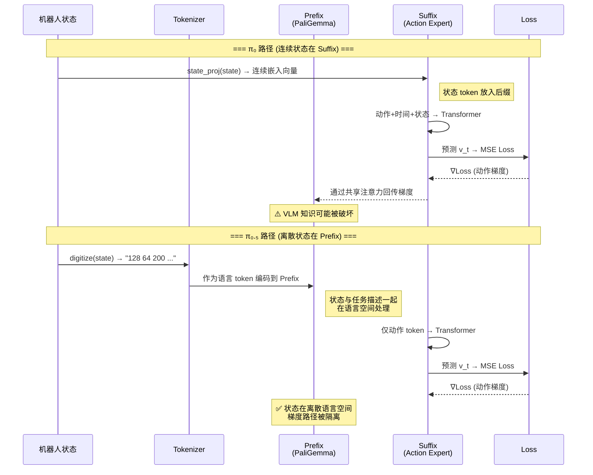
```mermaid
sequenceDiagram
    participant S as 机器人状态
    participant T as Tokenizer
    participant P as Prefix<br/>(PaliGemma)
    participant X as Suffix<br/>(Action Expert)
    participant L as Loss

    Note over S,L: === π₀ 路径 (连续状态在 Suffix) ===
    S->>X: state_proj(state) → 连续嵌入向量
    Note right of X: 状态 token 放入后缀
    X->>X: 动作+时间+状态 → Transformer
    X->>L: 预测 v_t → MSE Loss
    L-->>X: ∇Loss (动作梯度)
    X-->>P: 通过共享注意力回传梯度
    Note over P: ⚠️ VLM 知识可能被破坏

    Note over S,L: === π₀.₅ 路径 (离散状态在 Prefix) ===
    S->>T: digitize(state) → "128 64 200 ..."
    T->>P: 作为语言 token 编码到 Prefix
    Note right of P: 状态与任务描述一起<br/>在语言空间处理
    X->>X: 仅动作 token → Transformer
    X->>L: 预测 v_t → MSE Loss
    L-->>X: ∇Loss (动作梯度)
    Note over P: ✅ 状态在离散语言空间<br/>梯度路径被隔离
```

### 4.4 embed_suffix 中的差异实现

```python
# src/openpi/models/pi0.py (L139-L186)
def embed_suffix(self, obs, noisy_actions, timestep):
    input_mask = []
    ar_mask = []
    tokens = []

    if not self.pi05:
        # π₀: 状态作为连续 token 放入后缀
        state_token = self.state_proj(obs.state)[:, None, :]  # (batch, 1, width)
        tokens.append(state_token)
        input_mask.append(jnp.ones((obs.state.shape[0], 1), dtype=jnp.bool_))
        ar_mask += [True]  # 图像/语言不关注状态

    # 动作 token（π₀ 和 π₀.₅ 共享）
    action_tokens = self.action_in_proj(noisy_actions)
    time_emb = posemb_sincos(timestep, self.action_in_proj.out_features,
                             min_period=4e-3, max_period=4.0)

    if self.pi05:
        # π₀.₅: 时间步通过独立 MLP → AdaRMSNorm 条件化
        time_emb = self.time_mlp_in(time_emb)
        time_emb = nnx.swish(time_emb)
        time_emb = self.time_mlp_out(time_emb)
        time_emb = nnx.swish(time_emb)
        action_expert_tokens = action_tokens
        adarms_cond = time_emb  # 传给每层的 AdaRMSNorm
    else:
        # π₀: 时间步与动作拼接 → MLP 融合
        time_tokens = einops.repeat(time_emb, "b emb -> b s emb", s=self.action_horizon)
        action_time_tokens = jnp.concatenate([action_tokens, time_tokens], axis=-1)
        action_time_tokens = self.action_time_mlp_in(action_time_tokens)
        action_time_tokens = nnx.swish(action_time_tokens)
        action_time_tokens = self.action_time_mlp_out(action_time_tokens)
        action_expert_tokens = action_time_tokens
        adarms_cond = None  # 不使用 AdaRMSNorm

    tokens.append(action_expert_tokens)
    ar_mask += [True] + ([False] * (self.action_horizon - 1))
    return tokens, input_mask, ar_mask, adarms_cond
```

**设计决策**：
- π₀.₅ 的后缀**不再包含状态 token**，仅有动作 token，使后缀更简洁
- 时间步信息不再与动作"混合"，而是通过 `adarms_cond` 在每一层独立注入，提供更精细的条件化

---

## 5. AdaRMSNorm 时间步注入

### 5.1 标准 RMSNorm vs 自适应 RMSNorm

AdaRMSNorm（Adaptive RMS Normalization）的灵感来自 DiT（Scalable Diffusion Models with Transformers）中的 adaLN-Zero 机制。核心思想是让归一化层的缩放和偏移参数由外部条件（时间步）动态控制。

```python
# src/openpi/models/gemma.py (L112-L131)
class RMSNorm(nn.Module):
    @nn.compact
    def __call__(self, x, cond):
        dtype = x.dtype
        # 标准 RMS 归一化计算（float32 精度）
        var = jnp.mean(jnp.square(x.astype(jnp.float32)), axis=-1, keepdims=True)
        normed_inputs = jnp.asarray(x * jnp.reciprocal(jnp.sqrt(var + 1e-06)))

        if cond is None:
            # === 标准 RMSNorm (PaliGemma 和 π₀ 的 Action Expert) ===
            scale = self.param("scale", nn.initializers.zeros_init(), (x.shape[-1]))
            normed_inputs = normed_inputs * (1 + scale)
            return normed_inputs.astype(dtype), None  # gate = None

        # === 自适应 RMSNorm (π₀.₅ 的 Action Expert) ===
        # cond 是时间步嵌入，投影为 3×D 维向量
        modulation = nn.Dense(x.shape[-1] * 3, kernel_init=nn.initializers.zeros, dtype=dtype)(cond)
        scale, shift, gate = jnp.split(modulation[:, None, :], 3, axis=-1)
        normed_inputs = normed_inputs * (1 + scale) + shift  # 仿射变换
        return normed_inputs.astype(dtype), gate  # gate 用于门控残差
```

### 5.2 AdaRMSNorm 流程图

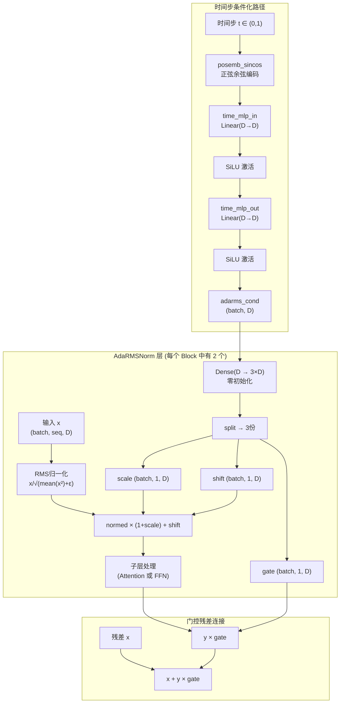
```mermaid
graph TD
    subgraph "时间步条件化路径"
        T["时间步 t ∈ (0,1)"] --> PE["posemb_sincos<br/>正弦余弦编码"]
        PE --> MLP1["time_mlp_in<br/>Linear(D→D)"]
        MLP1 --> SWISH1["SiLU 激活"]
        SWISH1 --> MLP2["time_mlp_out<br/>Linear(D→D)"]
        MLP2 --> SWISH2["SiLU 激活"]
        SWISH2 --> COND["adarms_cond<br/>(batch, D)"]
    end

    subgraph "AdaRMSNorm 层 (每个 Block 中有 2 个)"
        COND --> DENSE["Dense(D → 3×D)<br/>零初始化"]
        DENSE --> SPLIT["split → 3份"]
        SPLIT --> SCALE["scale (batch, 1, D)"]
        SPLIT --> SHIFT["shift (batch, 1, D)"]
        SPLIT --> GATE["gate (batch, 1, D)"]

        X["输入 x<br/>(batch, seq, D)"] --> RMS["RMS归一化<br/>x/√(mean(x²)+ε)"]
        RMS --> AFFINE["normed × (1+scale) + shift"]
        SCALE --> AFFINE
        SHIFT --> AFFINE
        AFFINE --> SUBLAYER["子层处理<br/>(Attention 或 FFN)"]
    end

    subgraph "门控残差连接"
        SUBLAYER --> GATED["y × gate"]
        GATE --> GATED
        X2["残差 x"] --> RESIDUAL["x + y × gate"]
        GATED --> RESIDUAL
    end
```

### 5.3 门控残差连接

AdaRMSNorm 不仅产生 scale 和 shift，还产生 gate 向量。gate 控制子层输出对残差连接的贡献：

```python
# src/openpi/models/gemma.py (L453-L459)
def _gated_residual(x, y, gate):
    assert (x is None) == (y is None)
    if x is None:
        return None
    if gate is None:
        return x + y       # 标准残差 (PaliGemma Expert)
    return x + y * gate    # 门控残差 (π₀.₅ Action Expert)
```

### 5.4 Block 中的完整流程

每个 Transformer Block 执行两次 RMSNorm + 子层：

```python
# src/openpi/models/gemma.py (L293-L333) - 简化版
class Block(nn.Module):
    def __call__(self, xs, kv_cache, positions, attn_mask, adarms_cond, deterministic):
        # 1. Pre-Attention Norm
        pre_attn = []
        gates = []
        for i, x in enumerate(xs):
            if x is not None:
                x, gate = RMSNorm(name=f"pre_attention_norm_{i}")(x, adarms_cond[i])
            pre_attn.append(x)
            gates.append(gate)

        # 2. Multi-Head Attention (共享 K/V)
        post_attn, kv_cache = Attention(configs=self.configs)(pre_attn, positions, attn_mask, kv_cache)

        # 3. 门控残差连接
        xs = [_gated_residual(x, y, gate) for x, y, gate in zip(xs, post_attn, gates)]

        # 4. Pre-FFW Norm + Feed-Forward + 门控残差
        out = []
        gates = []
        for i, (x, config) in enumerate(zip(xs, self.configs)):
            if x is not None:
                x, gate = RMSNorm(name=f"pre_ffw_norm_{i}")(x, adarms_cond[i])
                x = FeedForward(features=config.width, hidden_dim=config.mlp_dim)(x)
            out.append(x)
            gates.append(gate)
        xs = [_gated_residual(x, y, gate) for x, y, gate in zip(xs, out, gates)]

        return xs, kv_cache
```

**设计决策**：
- `nn.initializers.zeros` 初始化 Dense 层意味着训练初始 scale=0, shift=0, gate=0，即 AdaRMSNorm 等价于标准 RMSNorm，gate=0 意味着子层输出被完全抑制。这是 DiT 论文中的 "Zero" 初始化策略，保证模型在训练初期行为与无条件化时一致，有利于稳定训练。
- gate 机制让模型可以学习在不同时间步上调节子层的贡献程度——例如在接近 t=0（数据分布）时，gate 可以更激进地修正动作预测。

---

## 6. 双专家 Transformer 架构

### 6.1 多专家 Gemma Module

Gemma Module 支持任意数量的"专家"，每个专家有独立的参数但共享注意力计算：

```python
# src/openpi/models/gemma.py (L340-L411)
class Module(nn.Module):
    configs: Sequence[Config]  # 每个专家的配置
    adarms: bool = False

    def setup(self):
        # 所有专家必须有相同的 depth（层数）
        assert all(config.depth == self.configs[0].depth for config in self.configs)
        # Embedder 只属于第一个专家（PaliGemma）
        self.embedder = Embedder(vocab_size=PALIGEMMA_VOCAB_SIZE, embed_dim=self.configs[0].width)
        # 扫描式 Block 层
        self.layers = nn.scan(Block, ...)(configs=self.configs)
        self.final_norms = [RMSNorm(name=f"final_norm_{i}") for i in range(len(self.configs))]

    def __call__(self, embedded, positions, mask, adarms_cond=None, *, kv_cache=None):
        if adarms_cond is None:
            adarms_cond = [None] * len(self.configs)
        embedded, kv_cache = self.layers(embedded, kv_cache, positions, mask, adarms_cond)
        return [f(e, a)[0] for f, e, a in zip(self.final_norms, embedded, adarms_cond)], kv_cache
```

### 6.2 权重命名策略

```python
# src/openpi/models/gemma.py (L443-L450)
def _name(name, i):
    # 第一个专家的权重没有后缀 → 兼容 PaliGemma checkpoint
    # 后续专家带后缀 _1, _2, ... → 随机初始化
    if i == 0:
        return name      # "attn", "mlp", "pre_attention_norm"
    return f"{name}_{i}"  # "attn_1", "mlp_1", "pre_attention_norm_1"
```

**设计决策**：这个看似简单的命名约定是整个预训练权重加载策略的关键。Expert 0 的参数路径与原始 PaliGemma checkpoint 完全一致，可以直接 `restore` 而无需任何映射；Expert 1 的参数路径带后缀，在 checkpoint 中不存在，因此自动随机初始化。

### 6.3 共享注意力机制

Attention 模块将所有专家的 token 拼接后进行统一的注意力计算：

```python
# src/openpi/models/gemma.py (L157-L249) - 关键逻辑
class Attention(nn.Module):
    configs: Sequence[Config]

    def __call__(self, xs, positions, attn_mask, kv_cache):
        qkvs = []
        for i, (x, config) in enumerate(zip(xs, self.configs)):
            if x is None:
                continue
            # 每个专家有独立的 Q/K/V 投影参数
            q_einsum = Einsum(shape=..., name=f"q_einsum_{i}")
            kv_einsum = Einsum(shape=..., name=f"kv_einsum_{i}")
            q = q_einsum("BTD,NDH->BTNH", x)
            k, v = kv_einsum("BSD,2KDH->2BSKH", x)
            qkvs.append((q, k, v))

        # 关键：所有专家的 Q/K/V 在 token 维度拼接
        q, k, v = (jnp.concatenate(y, axis=1) for y in zip(*qkvs))
        # 统一计算注意力（使用 attn_mask 控制可见性）
        # ...
```

**为什么共享注意力而非独立注意力？** 共享 K/V 让 Action Expert 可以直接关注 PaliGemma 处理过的图像和语言 token，实现跨模态信息融合。这比分别运行再拼接更高效，也保留了完整的注意力交互。

---

## 7. 注意力掩码机制

### 7.1 make_attn_mask 实现

OpenPI 使用了一种灵活的基于累积求和的掩码机制：

```python
# src/openpi/models/pi0.py (L19-L44)
def make_attn_mask(input_mask, mask_ar):
    """
    mask_ar 控制注意力模式：
    - False: 该 token 与前一个 token 共享注意力组（双向注意力）
    - True:  该 token 开启新的因果注意力组

    示例:
      [0 0 0 1 1 1]: prefix-lm 模式，前 3 个 token 双向，后 3 个因果
      [1 0 1 0 1 0 0 1 0 0]: 4 个块之间因果，块内双向
    """
    mask_ar = jnp.broadcast_to(mask_ar, input_mask.shape)
    cumsum = jnp.cumsum(mask_ar, axis=1)
    attn_mask = cumsum[:, None, :] <= cumsum[:, :, None]
    valid_mask = input_mask[:, None, :] * input_mask[:, :, None]
    return jnp.logical_and(attn_mask, valid_mask)
```

### 7.2 π₀.₅ 的注意力模式

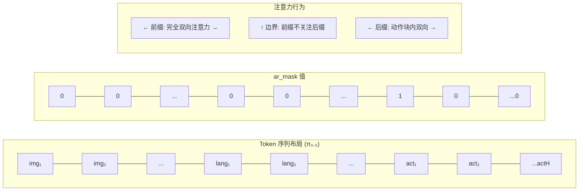
```mermaid
graph LR
    subgraph "Token 序列布局 (π₀.₅)"
        direction LR
        I1["img₁"] --- I2["img₂"] --- IN["..."] --- L1["lang₁"] --- L2["lang₂"] --- LN["..."]
        LN --- A1["act₁"] --- A2["act₂"] --- AH["...actH"]
    end

    subgraph "ar_mask 值"
        direction LR
        M1["0"] --- M2["0"] --- M3["..."] --- M4["0"] --- M5["0"] --- M6["..."]
        M6 --- M7["1"] --- M8["0"] --- M9["...0"]
    end

    subgraph "注意力行为"
        B1["← 前缀: 完全双向注意力 →"]
        B2["↑ 边界: 前缀不关注后缀"]
        B3["← 后缀: 动作块内双向 →"]
    end
```

**具体 ar_mask 构建**（π₀.₅）：

| Token 类型 | ar_mask | 含义 |
|-----------|---------|------|
| 图像 tokens | `[False] * num_image_tokens` | 图像间双向注意力 |
| 语言 tokens（含离散状态） | `[False] * num_lang_tokens` | 语言与图像双向注意力 |
| 动作 token 1 | `[True]` | **因果边界**：前缀不关注动作 |
| 动作 tokens 2~H | `[False] * (H-1)` | 动作块内共享注意力 |

```python
# src/openpi/models/pi0.py (L124-L136) - embed_prefix
ar_mask += [False] * image_tokens.shape[1]   # 图像: 双向
ar_mask += [False] * tokenized_inputs.shape[1]  # 语言: 双向

# src/openpi/models/pi0.py (L180-L182) - embed_suffix (π₀.₅, 无 state token)
ar_mask += [True] + ([False] * (self.action_horizon - 1))  # 动作: 边界+块内双向
```

**设计决策**：
- 让所有前缀 token（图像+语言）完全双向注意力，充分利用视觉-语言交叉理解
- 通过 `[True]` 在动作首 token 设置因果边界，阻止前缀关注到后缀（动作）——这很重要，因为在推理时前缀被缓存，其输出不应依赖于每步变化的动作 token
- 动作 token 之间使用块内双向注意力，让动作序列可以互相参考

---

## 8. 流匹配训练

### 8.1 流匹配原理

流匹配（Flow Matching）是一种基于 ODE 的生成建模方法。与扩散模型类似，它学习一个从噪声分布到数据分布的传输映射，但使用更简单的线性插值路径：

- **前向过程**：`x_t = t · noise + (1-t) · actions`，其中 `t ∈ [0.001, 0.999]`
- **速度场目标**：`u_t = noise - actions`（从数据指向噪声的方向）
- **训练目标**：学习 `v_t ≈ u_t`，即模型预测每个时间步的"速度"
- **推理**：从 `t=1`（纯噪声）出发，沿 `-v_t` 方向积分到 `t=0`（数据分布）

### 8.2 训练流程图

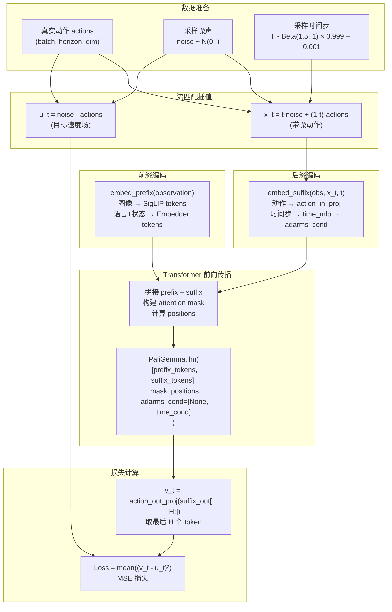
```mermaid
flowchart TD
    subgraph "数据准备"
        A["真实动作 actions<br/>(batch, horizon, dim)"]
        B["采样噪声<br/>noise ~ N(0,I)"]
        C["采样时间步<br/>t ~ Beta(1.5, 1) × 0.999 + 0.001"]
    end

    subgraph "流匹配插值"
        D["x_t = t·noise + (1-t)·actions<br/>(带噪动作)"]
        E["u_t = noise - actions<br/>(目标速度场)"]
    end

    subgraph "前缀编码"
        F["embed_prefix(observation)<br/>图像 → SigLIP tokens<br/>语言+状态 → Embedder tokens"]
    end

    subgraph "后缀编码"
        G["embed_suffix(obs, x_t, t)<br/>动作 → action_in_proj<br/>时间步 → time_mlp → adarms_cond"]
    end

    subgraph "Transformer 前向传播"
        H["拼接 prefix + suffix<br/>构建 attention mask<br/>计算 positions"]
        I["PaliGemma.llm(<br/>  [prefix_tokens, suffix_tokens],<br/>  mask, positions,<br/>  adarms_cond=[None, time_cond]<br/>)"]
    end

    subgraph "损失计算"
        J["v_t = action_out_proj(suffix_out[:, -H:])<br/>取最后 H 个 token"]
        K["Loss = mean((v_t - u_t)²)<br/>MSE 损失"]
    end

    A --> D
    B --> D
    C --> D
    A --> E
    B --> E
    D --> G
    F --> H
    G --> H
    H --> I
    I --> J
    J --> K
    E --> K
```

### 8.3 训练代码

```python
# src/openpi/models/pi0.py (L188-L214)
def compute_loss(self, rng, observation, actions, *, train=False):
    preprocess_rng, noise_rng, time_rng = jax.random.split(rng, 3)
    observation = _model.preprocess_observation(preprocess_rng, observation, train=train)

    batch_shape = actions.shape[:-2]
    noise = jax.random.normal(noise_rng, actions.shape)

    # Beta(1.5, 1) 分布偏向较大的 t 值（更多噪声），有助于模型学习大噪声区域
    time = jax.random.beta(time_rng, 1.5, 1, batch_shape) * 0.999 + 0.001
    time_expanded = time[..., None, None]

    # 线性插值：x_t = t·noise + (1-t)·actions
    x_t = time_expanded * noise + (1 - time_expanded) * actions
    # 速度场目标
    u_t = noise - actions

    # 一次性前向传播 prefix + suffix
    prefix_tokens, prefix_mask, prefix_ar_mask = self.embed_prefix(observation)
    suffix_tokens, suffix_mask, suffix_ar_mask, adarms_cond = self.embed_suffix(observation, x_t, time)

    input_mask = jnp.concatenate([prefix_mask, suffix_mask], axis=1)
    ar_mask = jnp.concatenate([prefix_ar_mask, suffix_ar_mask], axis=0)
    attn_mask = make_attn_mask(input_mask, ar_mask)
    positions = jnp.cumsum(input_mask, axis=1) - 1

    (prefix_out, suffix_out), _ = self.PaliGemma.llm(
        [prefix_tokens, suffix_tokens],
        mask=attn_mask, positions=positions,
        adarms_cond=[None, adarms_cond]  # PaliGemma 不用 adaRMS，Action Expert 用
    )

    # 取后缀输出的最后 action_horizon 个 token
    v_t = self.action_out_proj(suffix_out[:, -self.action_horizon :])
    return jnp.mean(jnp.square(v_t - u_t), axis=-1)
```

**设计决策**：
- **Beta(1.5, 1) 时间采样**：相比均匀采样 `U(0,1)`，Beta(1.5,1) 对高噪声区域（t 接近 1）赋予更多权重。这与 DDPM 文献中的观察一致——模型在高噪声时预测难度较大，需要更多训练样本。
- **训练时前缀+后缀一次性前向传播**（无 KV 缓存）：训练时梯度需要在所有参数上计算，因此不能使用缓存优化。`nn.remat`（梯度检查点）用于控制显存消耗。
- **adarms_cond=[None, adarms_cond]**：明确表示 PaliGemma Expert 不接受时间步条件化（保持标准 RMSNorm），只有 Action Expert 接受。

---

## 9. 推理去噪流程

### 9.1 推理算法

推理过程使用 Euler 方法从噪声逆向积分到数据分布：

1. 初始化 `x_1 ~ N(0, I)`（纯噪声）
2. 预计算前缀的 KV 缓存（只做一次）
3. 循环 `num_steps` 次（默认 10 次）：
   - 预测速度 `v_t = model(x_t, t)`
   - 更新 `x_t = x_t + dt · v_t`（`dt = -1/num_steps`）
   - 更新 `t = t + dt`
4. 返回 `x_0` 作为预测动作

### 9.2 推理序列图

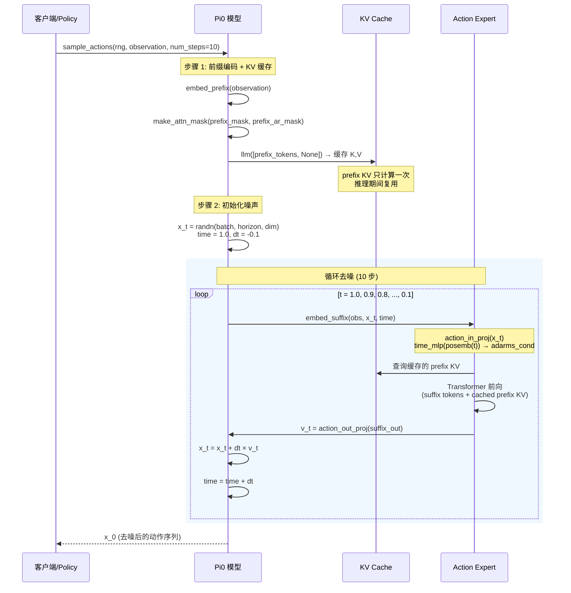
```mermaid
sequenceDiagram
    participant C as 客户端/Policy
    participant M as Pi0 模型
    participant KV as KV Cache
    participant AE as Action Expert

    C->>M: sample_actions(rng, observation, num_steps=10)

    Note over M: 步骤 1: 前缀编码 + KV 缓存
    M->>M: embed_prefix(observation)
    M->>M: make_attn_mask(prefix_mask, prefix_ar_mask)
    M->>KV: llm([prefix_tokens, None]) → 缓存 K,V
    Note over KV: prefix KV 只计算一次<br/>推理期间复用

    Note over M: 步骤 2: 初始化噪声
    M->>M: x_t = randn(batch, horizon, dim)<br/>time = 1.0, dt = -0.1

    rect rgb(240, 248, 255)
        Note over M,AE: 循环去噪 (10 步)
        loop t = 1.0, 0.9, 0.8, ..., 0.1
            M->>AE: embed_suffix(obs, x_t, time)
            Note over AE: action_in_proj(x_t)<br/>time_mlp(posemb(t)) → adarms_cond
            AE->>KV: 查询缓存的 prefix KV
            AE->>AE: Transformer 前向<br/>(suffix tokens + cached prefix KV)
            AE->>M: v_t = action_out_proj(suffix_out)
            M->>M: x_t = x_t + dt × v_t
            M->>M: time = time + dt
        end
    end

    M-->>C: x_0 (去噪后的动作序列)
```

### 9.3 推理代码

```python
# src/openpi/models/pi0.py (L216-L279)
def sample_actions(self, rng, observation, *, num_steps=10, noise=None):
    observation = _model.preprocess_observation(None, observation, train=False)
    # 约定：t=1 是噪声，t=0 是目标分布（与论文相反，代码注释中有说明）
    dt = -1.0 / num_steps
    batch_size = observation.state.shape[0]
    if noise is None:
        noise = jax.random.normal(rng, (batch_size, self.action_horizon, self.action_dim))

    # 步骤 1: 前缀前向传播 → 缓存 KV
    prefix_tokens, prefix_mask, prefix_ar_mask = self.embed_prefix(observation)
    prefix_attn_mask = make_attn_mask(prefix_mask, prefix_ar_mask)
    positions = jnp.cumsum(prefix_mask, axis=1) - 1
    _, kv_cache = self.PaliGemma.llm([prefix_tokens, None], mask=prefix_attn_mask, positions=positions)

    def step(carry):
        x_t, time = carry
        suffix_tokens, suffix_mask, suffix_ar_mask, adarms_cond = self.embed_suffix(
            observation, x_t, jnp.broadcast_to(time, batch_size)
        )
        # 后缀对前缀的注意力掩码
        suffix_attn_mask = make_attn_mask(suffix_mask, suffix_ar_mask)
        prefix_attn_mask = einops.repeat(prefix_mask, "b p -> b s p", s=suffix_tokens.shape[1])
        full_attn_mask = jnp.concatenate([prefix_attn_mask, suffix_attn_mask], axis=-1)

        # 后缀对缓存中位置的偏移
        positions = jnp.sum(prefix_mask, axis=-1)[:, None] + jnp.cumsum(suffix_mask, axis=-1) - 1

        (_, suffix_out), _ = self.PaliGemma.llm(
            [None, suffix_tokens],  # prefix=None 表示使用缓存
            mask=full_attn_mask, positions=positions,
            kv_cache=kv_cache,
            adarms_cond=[None, adarms_cond],
        )
        v_t = self.action_out_proj(suffix_out[:, -self.action_horizon :])
        return x_t + dt * v_t, time + dt  # Euler 步进

    def cond(carry):
        _, time = carry
        return time >= -dt / 2  # 浮点容错

    x_0, _ = jax.lax.while_loop(cond, step, (noise, 1.0))
    return x_0
```

**设计决策**：
- **KV 缓存优化**：前缀（图像+语言）在整个去噪过程中不变，只需计算一次。每个去噪步骤只需要对后缀（动作 token）执行前向传播，显著减少计算量。
- **`jax.lax.while_loop`**：使用 JAX 原语实现循环，确保整个推理过程可以被 JIT 编译为单个 XLA 计算图，避免 Python 循环开销。
- **t=1 是噪声约定**：代码注释承认这与 π₀ 论文的约定相反（论文中 t=0 是噪声），但更符合扩散模型社区的惯例。

---

## 10. 数据处理管道

### 10.1 Transform Pipeline 流程图


```mermaid
flowchart LR
    subgraph "数据源"
        RAW["LeRobot 数据集<br/>(HuggingFace 格式)"]
    end

    subgraph "Step 1: Repack"
        REPACK["RepackTransform<br/>键名映射<br/>(observation.images.top → image/base_0_rgb)"]
    end

    subgraph "Step 2: 机器人特定变换"
        ROBOT["Robot Policy Transforms<br/>AlohaInputs / DroidInputs /<br/>R1ProChassisInputs"]
        DELTA["DeltaActions<br/>(可选: 绝对→相对动作)"]
    end

    subgraph "Step 3: 归一化"
        NORM["Normalize<br/>分位数归一化 → [-1, 1]<br/>quantile: (x-q01)/(q99-q01)*2-1"]
    end

    subgraph "Step 4: 模型变换 (π₀.₅)"
        INJECT["InjectDefaultPrompt<br/>(默认任务提示)"]
        RESIZE["ResizeImages<br/>224×224"]
        TOKEN["TokenizePrompt<br/>discrete_state_input=True<br/>状态 → 256 bins → 文本token"]
        PAD["PadStatesAndActions<br/>填充至 action_dim=32"]
    end

    subgraph "模型输入"
        OBS["Observation 对象<br/>images, state,<br/>tokenized_prompt"]
    end

    RAW --> REPACK --> ROBOT --> DELTA --> NORM --> INJECT --> RESIZE --> TOKEN --> PAD --> OBS
```

### 10.2 ModelTransformFactory 的 PI05 分支

```python
# src/openpi/training/config.py (L128-L140)
case _model.ModelType.PI05:
    assert isinstance(model_config, pi0_config.Pi0Config)
    return _transforms.Group(
        inputs=[
            _transforms.InjectDefaultPrompt(self.default_prompt),
            _transforms.ResizeImages(224, 224),
            _transforms.TokenizePrompt(
                _tokenizer.PaligemmaTokenizer(model_config.max_token_len),
                discrete_state_input=model_config.discrete_state_input,
            ),
            _transforms.PadStatesAndActions(model_config.action_dim),
        ],
    )
```

### 10.3 TokenizePrompt 中的状态处理

```python
# src/openpi/transforms.py (L248-L266)
class TokenizePrompt(DataTransformFn):
    tokenizer: _tokenizer.PaligemmaTokenizer
    discrete_state_input: bool = False

    def __call__(self, data: DataDict) -> DataDict:
        if (prompt := data.pop("prompt", None)) is None:
            raise ValueError("Prompt is required")

        if self.discrete_state_input:
            # π₀.₅: 状态必须存在，作为离散 token 传入 tokenizer
            if (state := data.get("state", None)) is None:
                raise ValueError("State is required.")
        else:
            state = None  # π₀: 不传状态给 tokenizer

        tokens, token_masks = self.tokenizer.tokenize(prompt, state)
        return {**data, "tokenized_prompt": tokens, "tokenized_prompt_mask": token_masks}
```

### 10.4 归一化策略

π₀.₅ 使用**分位数归一化**而非 Z-score：

```python
# src/openpi/transforms.py (L141-L145)
def _normalize_quantile(self, x, stats: NormStats):
    q01, q99 = stats.q01[..., : x.shape[-1]], stats.q99[..., : x.shape[-1]]
    return (x - q01) / (q99 - q01 + 1e-6) * 2.0 - 1.0
```

**设计决策**：分位数归一化使用 1% 和 99% 分位数而非均值/标准差，对异常值更鲁棒。这对跨机器人数据集尤其重要——不同机器人平台的动作范围差异很大，极端值可能导致 Z-score 归一化后大部分数据集中在一个很小的范围内。

---

## 11. 训练配置

### 11.1 π₀.₅ 相关配置汇总

| 配置名称 | action_horizon | action_dim | discrete_state_input | batch_size | lr | 训练步数 | 权重加载 | 说明 |
|---------|:-:|:-:|:-:|:-:|:-:|:-:|---------|------|
| `pi05_aloha` | 50 | 32 | True | 32 | default | - | - | ALOHA 标准配置 |
| `pi05_droid` | 15 | 32 | True | 32 | - | - | - | DROID 推理配置 |
| `pi05_libero` | 10 | 32 | **False** | 256 | 5e-5 | 30k | pi05_base | LIBERO 微调（特殊：不用离散状态） |
| `pi05_aloha_pen_uncap` | 50 | 32 | True | 64 | default | 20k | pi05_base | ALOHA 笔盖任务 |
| `pi05_full_droid_finetune` | 16 | 32 | True | 256 | 5e-5 | 100k | pi05_base | 全 DROID 数据集微调 |
| `pi05_droid_finetune` | 16 | 32 | True | 256 | 5e-5 | - | pi05_droid | DROID 自定义数据集微调 |
| `pi05_r1pro_open_door` | 50 | 32 | True | 64 | 5e-5 | 20k | pi05_base | R1 Pro 开门 |
| `pi05_r1pro_chassis` | 50 | 32 | True | 64 | 5e-5 | 20k | pi05_base | R1 Pro 底盘控制 |

### 11.2 关键超参数说明

- **action_horizon**：不同机器人平台的动作块大小差异很大。ALOHA 使用 50（对应 1 秒 @ 50Hz），LIBERO 使用 10（仿真环境步频较低），DROID 使用 15-16
- **discrete_state_input=False（LIBERO）**：LIBERO 是仿真基准测试，其状态空间与真实机器人不同，使用离散状态反而降低性能
- **权重加载**：大多数微调配置从 `pi05_base` 加载，DROID 微调则从 `pi05_droid` 加载（已在大规模 DROID 数据上预训练）
- **optimizer**：统一使用 AdamW，配合余弦衰减学习率调度和梯度裁剪（norm=1.0）
- **EMA**：部分配置使用 EMA（0.999），提供更稳定的推理权重

---

## 12. π₀ vs π₀.₅ 对比

| 特性 | π₀ | π₀.₅ | 设计理由 |
|------|-----|------|---------|
| **状态输入** | 连续向量 `state_proj` | 离散化 256 bins 文本 token | 知识隔离，防止 VLM 退化 |
| **状态位置** | Suffix（动作专家） | Prefix（语言 token） | 与任务描述统一处理 |
| **时间步注入** | concat + MLP 融合 | 独立 MLP → AdaRMSNorm | 每层精细条件化 |
| **归一化层** | 标准 RMSNorm | AdaRMSNorm (scale/shift/gate) | 更强的条件化能力 |
| **残差连接** | `x + y` | `x + y × gate` | 可学习的层贡献控制 |
| **max_token_len** | 48 | 200 | 离散状态需要更多 token |
| **额外参数** | state_proj + action_time_mlp (×2) | time_mlp (×2) + AdaRMS Dense (每层) | 参数分布更合理 |
| **模型类型枚举** | `ModelType.PI0` | `ModelType.PI05` | 数据管道区分处理 |
| **VLM 骨干** | 可冻结 | 可解冻微调 | 更大数据量支撑 |
| **归一化方式** | Z-score | 分位数归一化 | 对异常值更鲁棒 |

### 12.1 参数差异的代码视角

```
π₀ 独有参数:
├── state_proj: Linear(action_dim → width)          # 状态投影
├── action_time_mlp_in: Linear(2×width → width)     # 动作+时间融合（输入）
└── action_time_mlp_out: Linear(width → width)       # 动作+时间融合（输出）

π₀.₅ 独有参数:
├── time_mlp_in: Linear(width → width)               # 时间步 MLP（输入）
├── time_mlp_out: Linear(width → width)              # 时间步 MLP（输出）
└── 每层 Block 中:
    ├── pre_attention_norm_1/Dense: Linear(D → 3D)   # AdaRMS pre-attn
    └── pre_ffw_norm_1/Dense: Linear(D → 3D)         # AdaRMS pre-FFN

共享参数:
├── PaliGemma.llm (Expert 0 + Expert 1 结构参数)
├── PaliGemma.img (SigLIP)
├── action_in_proj: Linear(action_dim → width)
└── action_out_proj: Linear(width → action_dim)
```

---

## 13. LoRA 微调与 PyTorch 支持

### 13.1 LoRA 配置

OpenPI 支持对 PaliGemma 和 Action Expert 分别启用 LoRA：

```python
# src/openpi/models/gemma.py (L88-L107) - LoRA 变体示例
"gemma_2b_lora":   LoRAConfig(rank=16, alpha=16.0)  # PaliGemma LoRA
"gemma_300m_lora": LoRAConfig(rank=32, alpha=32.0)  # Action Expert LoRA
```

冻结策略通过 `get_freeze_filter()` 实现：当使用 LoRA 时，冻结对应专家的原始参数，只训练 LoRA 分支。这显著降低了微调的显存需求（从 >70GB 降至 ~22.5GB）。

### 13.2 PyTorch 实现

OpenPI 提供了 PyTorch 平行实现：
- `src/openpi/models_pytorch/pi0_pytorch.py`：PyTorch 版 Pi0 模型
- `src/openpi/models_pytorch/gemma_pytorch.py`：PyTorch 版 Gemma
- `scripts/train_pytorch.py`：PyTorch 训练脚本
- `examples/convert_jax_model_to_pytorch.py`：JAX → PyTorch 权重转换

PyTorch 版本支持 `torch.compile` 和分布式训练（`torchrun`），但核心架构与 JAX 版完全一致。

---

## 14. 参考资料

### 论文
- **π₀ 论文**: "π₀: A Vision-Language-Action Flow Model for General Robot Control", Physical Intelligence, 2024. ([PDF](https://www.pi.website/download/pi0.pdf), [arXiv:2410.24164](https://arxiv.org/abs/2410.24164))
- **π₀.₅ 论文**: "π₀.₅: a Vision-Language-Action Model for Open-World Robot Manipulation", Physical Intelligence, 2025. ([PDF](https://www.pi.website/download/pi05.pdf), [arXiv:2504.16054](https://arxiv.org/abs/2504.16054))
- **Flow Matching**: Lipman et al., "Flow Matching for Generative Modeling", ICLR 2023.
- **DiT**: Peebles & Xie, "Scalable Diffusion Models with Transformers", ICCV 2023. (AdaLN-Zero / AdaRMSNorm 灵感来源)
- **SigLIP**: Zhai et al., "Sigmoid Loss for Language Image Pre-Training", ICCV 2023.
- **PaliGemma**: Google DeepMind, 2024.
- **FAST Tokenizer**: Pertsch et al., "Fast Action Tokenizer for Efficient Robot Learning", Physical Intelligence, 2024.

### 博客
- [π₀ 博客](https://www.pi.website/blog/pi0) - Physical Intelligence 官方
- [π₀.₅ 博客](https://www.pi.website/blog/pi05) - Physical Intelligence 官方
- [HuggingFace Blog: π₀ and π₀-FAST](https://huggingface.co/blog/pi0) - 社区分析
- [Mike Kalil: π₀.₅ Analysis](https://mikekalil.com/blog/pi-vla-open-world-generalization/) - 第三方技术分析

### GitHub
- [Physical-Intelligence/openpi](https://github.com/Physical-Intelligence/openpi) - 官方开源实现
- 关键 commit：`4d389c3` / `ab6fb3c`（初始 π₀.₅ 支持），`e061c09`（PyTorch 支持）
- [Knowledge Insulation 研究页](https://www.pi.website/research/knowledge_insulation)

### 相关技术
- [Big Vision](https://github.com/google-research/big_vision) - Gemma / PaliGemma 原始实现
- [LeRobot](https://github.com/huggingface/lerobot) - 机器人数据集格式
- [Open X-Embodiment](https://robotics-transformer-x.github.io/) - 跨机器人数据集

---
---

# 附录 A：训练管道（`scripts/train.py`）设计与实现

> 基于 `doc/pi05_微调.md` 中 R1 Pro 微调流程的深度分析

本章节详细分析 `scripts/train.py` 的完整实现，从命令行解析到训练循环结束。以 `pi05_微调.md` 中的训练命令为切入点：

```bash
CUDA_VISIBLE_DEVICES=0,1,2,3 HF_LEROBOT_HOME=/home/.../data \
  uv run python scripts/train.py pi05_r1pro_chassis \
  --exp_name 0403_chassis --batch_size 128 \
  --num_train_steps 100000 --save_interval 500 --keep_period 2500
```

---

## A.1 训练管道整体架构

### A.1.1 组件图

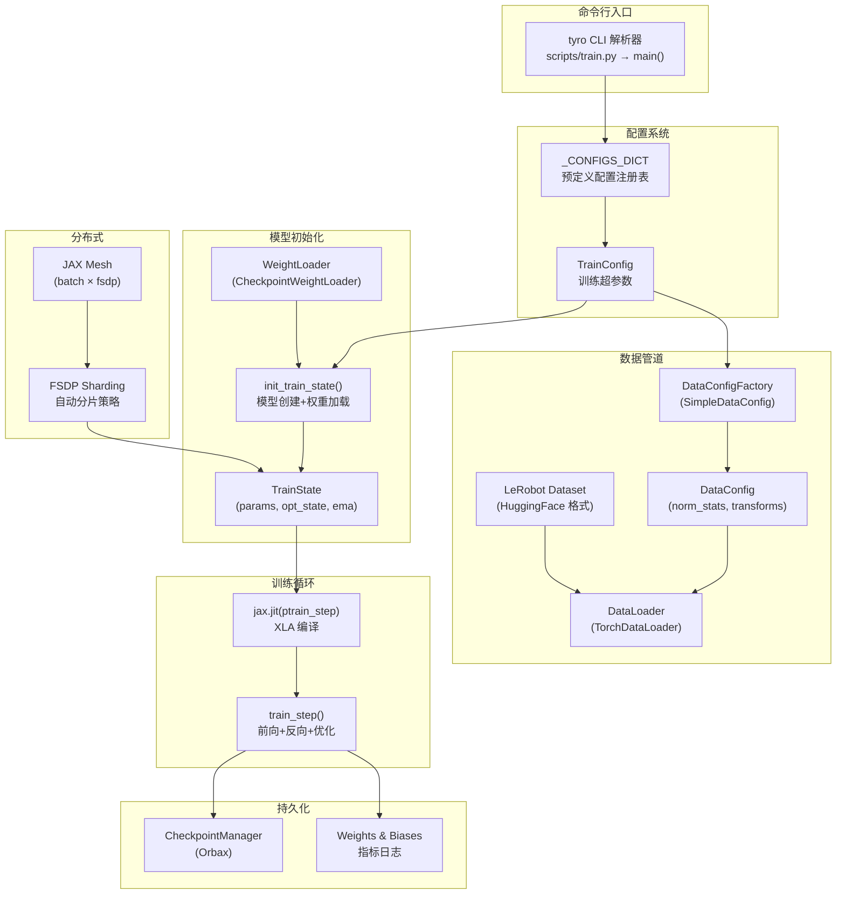
```mermaid
graph TB
    subgraph "命令行入口"
        CLI["tyro CLI 解析器<br/>scripts/train.py → main()"]
    end

    subgraph "配置系统"
        CONFIGS["_CONFIGS_DICT<br/>预定义配置注册表"]
        TC["TrainConfig<br/>训练超参数"]
    end

    subgraph "数据管道"
        DCF["DataConfigFactory<br/>(SimpleDataConfig)"]
        DC["DataConfig<br/>(norm_stats, transforms)"]
        DL["DataLoader<br/>(TorchDataLoader)"]
        LR["LeRobot Dataset<br/>(HuggingFace 格式)"]
    end

    subgraph "模型初始化"
        WL["WeightLoader<br/>(CheckpointWeightLoader)"]
        MI["init_train_state()<br/>模型创建+权重加载"]
        TS["TrainState<br/>(params, opt_state, ema)"]
    end

    subgraph "训练循环"
        STEP["train_step()<br/>前向+反向+优化"]
        JIT["jax.jit(ptrain_step)<br/>XLA 编译"]
    end

    subgraph "持久化"
        CM["CheckpointManager<br/>(Orbax)"]
        WB["Weights & Biases<br/>指标日志"]
    end

    subgraph "分布式"
        MESH["JAX Mesh<br/>(batch × fsdp)"]
        FSDP["FSDP Sharding<br/>自动分片策略"]
    end

    CLI --> CONFIGS --> TC
    TC --> DCF --> DC --> DL
    LR --> DL
    TC --> MI
    WL --> MI
    MI --> TS
    MESH --> FSDP --> TS
    TS --> JIT --> STEP
    STEP --> CM
    STEP --> WB
```

### A.1.2 端到端工作流图

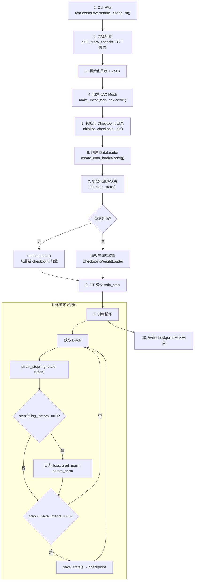
```mermaid
flowchart TD
    A["1. CLI 解析<br/>tyro.extras.overridable_config_cli()"] --> B["2. 选择配置<br/>pi05_r1pro_chassis + CLI 覆盖"]
    B --> C["3. 初始化日志 + W&B"]
    C --> D["4. 创建 JAX Mesh<br/>make_mesh(fsdp_devices=1)"]
    D --> E["5. 初始化 Checkpoint 目录<br/>initialize_checkpoint_dir()"]
    E --> F["6. 创建 DataLoader<br/>create_data_loader(config)"]
    F --> G["7. 初始化训练状态<br/>init_train_state()"]
    G --> H{"恢复训练?"}
    H -- 是 --> I["restore_state()<br/>从最新 checkpoint 加载"]
    H -- 否 --> J["加载预训练权重<br/>CheckpointWeightLoader"]
    I --> K["8. JIT 编译 train_step"]
    J --> K
    K --> L["9. 训练循环"]

    subgraph "训练循环 (每步)"
        L --> L1["获取 batch"]
        L1 --> L2["ptrain_step(rng, state, batch)"]
        L2 --> L3{"step % log_interval == 0?"}
        L3 -- 是 --> L4["日志: loss, grad_norm, param_norm"]
        L3 -- 否 --> L5{"step % save_interval == 0?"}
        L4 --> L5
        L5 -- 是 --> L6["save_state() → checkpoint"]
        L5 -- 否 --> L1
        L6 --> L1
    end

    L --> M["10. 等待 checkpoint 写入完成"]
```

---

## A.2 配置系统设计

### A.2.1 TrainConfig 类图

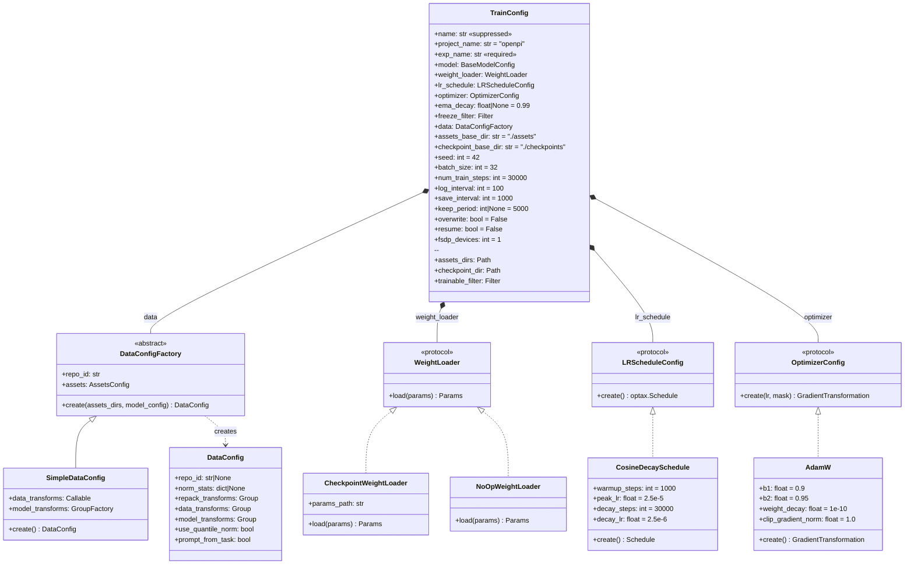
```mermaid
classDiagram
    class TrainConfig {
        +name: str  «suppressed»
        +project_name: str = "openpi"
        +exp_name: str  «required»
        +model: BaseModelConfig
        +weight_loader: WeightLoader
        +lr_schedule: LRScheduleConfig
        +optimizer: OptimizerConfig
        +ema_decay: float|None = 0.99
        +freeze_filter: Filter
        +data: DataConfigFactory
        +assets_base_dir: str = "./assets"
        +checkpoint_base_dir: str = "./checkpoints"
        +seed: int = 42
        +batch_size: int = 32
        +num_train_steps: int = 30000
        +log_interval: int = 100
        +save_interval: int = 1000
        +keep_period: int|None = 5000
        +overwrite: bool = False
        +resume: bool = False
        +fsdp_devices: int = 1
        --
        +assets_dirs: Path
        +checkpoint_dir: Path
        +trainable_filter: Filter
    }

    class DataConfigFactory {
        <<abstract>>
        +repo_id: str
        +assets: AssetsConfig
        +create(assets_dirs, model_config) DataConfig
    }

    class SimpleDataConfig {
        +data_transforms: Callable
        +model_transforms: GroupFactory
        +create() DataConfig
    }

    class DataConfig {
        +repo_id: str|None
        +norm_stats: dict|None
        +repack_transforms: Group
        +data_transforms: Group
        +model_transforms: Group
        +use_quantile_norm: bool
        +prompt_from_task: bool
    }

    class WeightLoader {
        <<protocol>>
        +load(params) Params
    }

    class CheckpointWeightLoader {
        +params_path: str
        +load(params) Params
    }

    class NoOpWeightLoader {
        +load(params) Params
    }

    class LRScheduleConfig {
        <<protocol>>
        +create() optax.Schedule
    }

    class CosineDecaySchedule {
        +warmup_steps: int = 1000
        +peak_lr: float = 2.5e-5
        +decay_steps: int = 30000
        +decay_lr: float = 2.5e-6
        +create() Schedule
    }

    class OptimizerConfig {
        <<protocol>>
        +create(lr, mask) GradientTransformation
    }

    class AdamW {
        +b1: float = 0.9
        +b2: float = 0.95
        +weight_decay: float = 1e-10
        +clip_gradient_norm: float = 1.0
        +create() GradientTransformation
    }

    TrainConfig *-- DataConfigFactory : data
    TrainConfig *-- WeightLoader : weight_loader
    TrainConfig *-- LRScheduleConfig : lr_schedule
    TrainConfig *-- OptimizerConfig : optimizer
    DataConfigFactory <|-- SimpleDataConfig
    DataConfigFactory ..> DataConfig : creates
    WeightLoader <|.. CheckpointWeightLoader
    WeightLoader <|.. NoOpWeightLoader
    LRScheduleConfig <|.. CosineDecaySchedule
    OptimizerConfig <|.. AdamW
```

### A.2.2 CLI 解析流程

```python
# src/openpi/training/config.py (L1067-L1083)
# 所有预定义配置注册到 _CONFIGS 列表
_CONFIGS_DICT = {config.name: config for config in _CONFIGS}

def cli() -> TrainConfig:
    # tyro 解析命令行：第一个位置参数选择配置，后续参数覆盖字段
    return tyro.extras.overridable_config_cli({k: (k, v) for k, v in _CONFIGS_DICT.items()})

# scripts/train.py (L279-L280)
if __name__ == "__main__":
    main(_config.cli())
```

**命令行到配置的映射**：

```
python scripts/train.py pi05_r1pro_chassis \
  --exp_name 0403_chassis \    → config.exp_name = "0403_chassis"
  --batch_size 128 \           → config.batch_size = 128 (覆盖默认的 64)
  --num_train_steps 100000 \   → config.num_train_steps = 100000 (覆盖默认的 30000)
  --save_interval 500 \        → config.save_interval = 500 (覆盖默认的 1000)
  --keep_period 2500           → config.keep_period = 2500 (覆盖默认的 5000)
```

### A.2.3 R1 Pro Chassis 配置定义

```python
# src/openpi/training/config.py (L1024-L1061)
TrainConfig(
    name="pi05_r1pro_chassis",
    model=pi0_config.Pi0Config(pi05=True),  # π₀.₅ 模式
    data=SimpleDataConfig(
        repo_id="r1_pro_data_convert_chassis",  # LeRobot 数据集名
        data_transforms=lambda model: _transforms.Group(
            inputs=[r1pro_chassis_policy.R1ProChassisInputs(model_type=model.model_type)],
            outputs=[r1pro_chassis_policy.R1ProChassisOutputs()],
        ),
        model_transforms=ModelTransformFactory(
            default_prompt="Open the door with a downward-press handle, go through it, and enter the room."
        ),
        base_config=DataConfig(
            prompt_from_task=True,
            action_sequence_keys=("actions",),
        ),
    ),
    weight_loader=weight_loaders.CheckpointWeightLoader(
        "gs://openpi-assets/checkpoints/pi05_base/params"  # 从 π₀.₅ 基础模型加载
    ),
    num_train_steps=30_000,
    batch_size=64,
),
```

**设计决策**：
- `SimpleDataConfig` 是最灵活的数据配置工厂，通过 lambda 接受 model_config 动态生成 transforms
- `prompt_from_task=True` 表示从 LeRobot 数据集的 task 字段提取 prompt（而非使用默认 prompt）
- `weight_loader` 从 GCS 下载 π₀.₅ 基础模型权重——这是微调的起点

---

## A.3 训练状态初始化

### A.3.1 TrainState 数据结构

```python
# src/openpi/training/utils.py (L13-L23)
@struct.dataclass
class TrainState:
    step: int                                    # 当前训练步数
    params: nnx.State                            # 模型参数（NNX State）
    model_def: nnx.GraphDef[BaseModel]          # 模型图定义（架构，不含数据）
    opt_state: optax.OptState                    # 优化器状态（Adam m/v 累积量）
    tx: optax.GradientTransformation             # 优化器（非 pytree 节点，常量）
    ema_decay: float | None                      # EMA 衰减系数（非 pytree 节点）
    ema_params: nnx.State | None = None          # EMA 参数（可选）
```

### A.3.2 初始化序列图

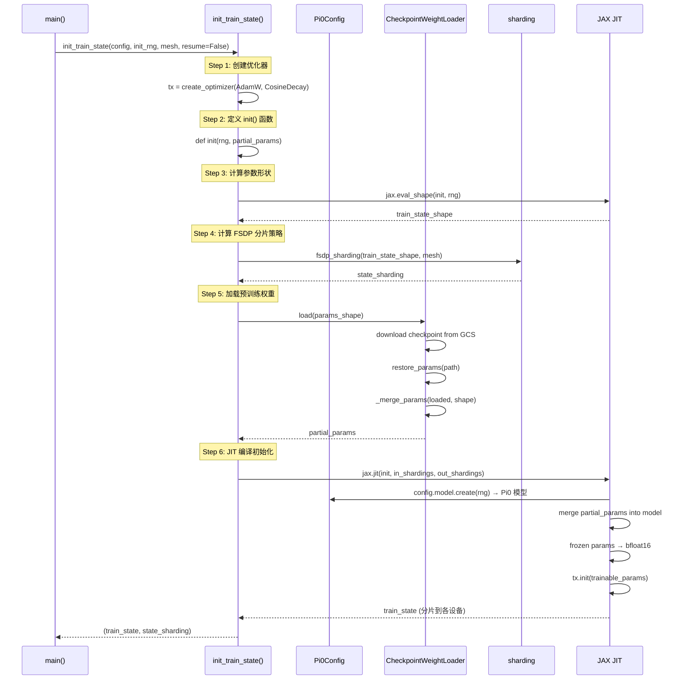
```mermaid
sequenceDiagram
    participant M as main()
    participant I as init_train_state()
    participant C as Pi0Config
    participant W as CheckpointWeightLoader
    participant S as sharding
    participant J as JAX JIT

    M->>I: init_train_state(config, init_rng, mesh, resume=False)

    Note over I: Step 1: 创建优化器
    I->>I: tx = create_optimizer(AdamW, CosineDecay)

    Note over I: Step 2: 定义 init() 函数
    I->>I: def init(rng, partial_params)

    Note over I: Step 3: 计算参数形状
    I->>J: jax.eval_shape(init, rng)
    J-->>I: train_state_shape

    Note over I: Step 4: 计算 FSDP 分片策略
    I->>S: fsdp_sharding(train_state_shape, mesh)
    S-->>I: state_sharding

    Note over I: Step 5: 加载预训练权重
    I->>W: load(params_shape)
    W->>W: download checkpoint from GCS
    W->>W: restore_params(path)
    W->>W: _merge_params(loaded, shape)
    W-->>I: partial_params

    Note over I: Step 6: JIT 编译初始化
    I->>J: jax.jit(init, in_shardings, out_shardings)
    J->>C: config.model.create(rng) → Pi0 模型
    J->>J: merge partial_params into model
    J->>J: frozen params → bfloat16
    J->>J: tx.init(trainable_params)
    J-->>I: train_state (分片到各设备)

    I-->>M: (train_state, state_sharding)
```

### A.3.3 关键代码：init_train_state

```python
# scripts/train.py (L84-L133)
def init_train_state(config, init_rng, mesh, *, resume):
    tx = _optimizer.create_optimizer(config.optimizer, config.lr_schedule, weight_decay_mask=None)

    def init(rng, partial_params=None):
        rng, model_rng = jax.random.split(rng)
        model = config.model.create(model_rng)  # 创建 Pi0 模型（随机初始化）

        # 将预训练权重合并到模型中
        if partial_params is not None:
            graphdef, state = nnx.split(model)
            state.replace_by_pure_dict(partial_params)
            model = nnx.merge(graphdef, state)

        params = nnx.state(model)
        # 冻结参数转为 bfloat16（节省显存）
        params = nnx_utils.state_map(params, config.freeze_filter,
                                     lambda p: p.replace(p.value.astype(jnp.bfloat16)))

        return TrainState(
            step=0, params=params, model_def=nnx.graphdef(model),
            tx=tx,
            opt_state=tx.init(params.filter(config.trainable_filter)),  # 只为可训练参数创建优化器状态
            ema_decay=config.ema_decay,
            ema_params=None if config.ema_decay is None else params,
        )

    # 先计算形状（不实际分配内存）
    train_state_shape = jax.eval_shape(init, init_rng)
    state_sharding = sharding.fsdp_sharding(train_state_shape, mesh, log=True)

    if resume:
        return train_state_shape, state_sharding  # 恢复时稍后加载

    # 加载预训练权重
    partial_params = _load_weights_and_validate(config.weight_loader, train_state_shape.params.to_pure_dict())

    # JIT 编译初始化（带分片约束）
    train_state = jax.jit(
        init,
        donate_argnums=(1,),
        in_shardings=replicated_sharding,
        out_shardings=state_sharding,
    )(init_rng, partial_params)

    return train_state, state_sharding
```

**设计决策**：
- `jax.eval_shape` 先计算参数形状而不分配内存，用于确定分片策略
- `donate_argnums=(1,)` 将 `partial_params` 的内存直接捐赠给输出，避免临时副本
- 冻结参数转 bfloat16 降低显存占用（全精度训练只需可训练参数保持 float32）
- 优化器状态只为 `trainable_filter` 匹配的参数创建（LoRA 微调时仅需很少的优化器状态）

---

## A.4 权重加载机制

### A.4.1 CheckpointWeightLoader 流程

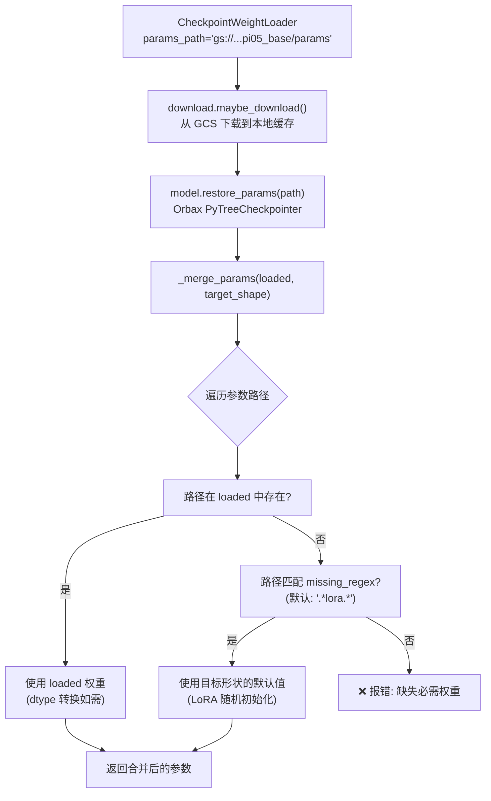
```mermaid
flowchart TD
    A["CheckpointWeightLoader<br/>params_path='gs://...pi05_base/params'"] --> B["download.maybe_download()<br/>从 GCS 下载到本地缓存"]
    B --> C["model.restore_params(path)<br/>Orbax PyTreeCheckpointer"]
    C --> D["_merge_params(loaded, target_shape)"]
    D --> E{"遍历参数路径"}
    E --> F["路径在 loaded 中存在?"]
    F -- 是 --> G["使用 loaded 权重<br/>(dtype 转换如需)"]
    F -- 否 --> H["路径匹配 missing_regex?<br/>(默认: '.*lora.*')"]
    H -- 是 --> I["使用目标形状的默认值<br/>(LoRA 随机初始化)"]
    H -- 否 --> J["❌ 报错: 缺失必需权重"]
    G --> K["返回合并后的参数"]
    I --> K
```

### A.4.2 关键代码

```python
# src/openpi/training/weight_loaders.py (L37-L54)
@dataclasses.dataclass(frozen=True)
class CheckpointWeightLoader(WeightLoader):
    params_path: str  # 本地路径或 GCS 路径

    def load(self, params: at.Params) -> at.Params:
        path = download.maybe_download(self.params_path)
        loaded_params = _model.restore_params(path, restore_type=np.ndarray)
        return _merge_params(loaded_params, params)
```

```python
# src/openpi/training/weight_loaders.py (L76-L104) - 简化版
def _merge_params(loaded, target, missing_regex=".*lora.*"):
    flat_loaded = flatten_dict(loaded)
    flat_target = flatten_dict(target)
    result = {}
    for key in flat_target:
        if key in flat_loaded:
            result[key] = flat_loaded[key]  # 使用预训练权重
        elif re.fullmatch(missing_regex, key_str):
            result[key] = flat_target[key]  # LoRA 权重用默认初始化
        else:
            raise ValueError(f"Missing weight: {key_str}")
    return unflatten_dict(result)
```

**设计决策**：
- `missing_regex=".*lora.*"` 允许预训练 checkpoint 不包含 LoRA 权重——这些权重在模型 `create()` 时已随机初始化，加载时保留即可
- 权重以 `np.ndarray` 形式加载（而非 `jax.Array`），避免在加载阶段占用 GPU 显存

---

## A.5 数据加载管道

### A.5.1 数据加载序列图

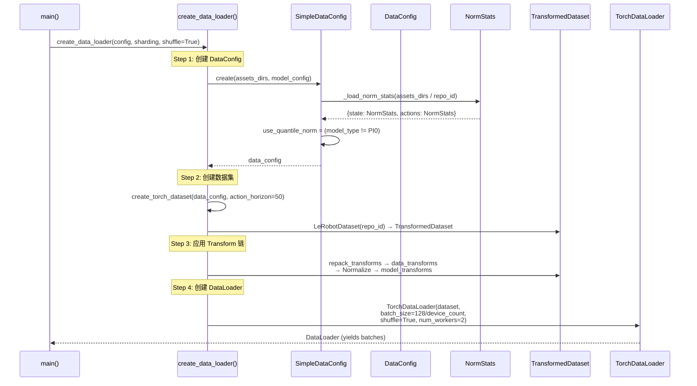
```mermaid
sequenceDiagram
    participant M as main()
    participant DL as create_data_loader()
    participant DCF as SimpleDataConfig
    participant DC as DataConfig
    participant NS as NormStats
    participant TD as TransformedDataset
    participant TDL as TorchDataLoader

    M->>DL: create_data_loader(config, sharding, shuffle=True)

    Note over DL: Step 1: 创建 DataConfig
    DL->>DCF: create(assets_dirs, model_config)
    DCF->>NS: _load_norm_stats(assets_dirs / repo_id)
    NS-->>DCF: {state: NormStats, actions: NormStats}
    DCF->>DCF: use_quantile_norm = (model_type != PI0)
    DCF-->>DL: data_config

    Note over DL: Step 2: 创建数据集
    DL->>DL: create_torch_dataset(data_config, action_horizon=50)
    DL->>TD: LeRobotDataset(repo_id) → TransformedDataset

    Note over DL: Step 3: 应用 Transform 链
    DL->>TD: repack_transforms → data_transforms<br/>→ Normalize → model_transforms

    Note over DL: Step 4: 创建 DataLoader
    DL->>TDL: TorchDataLoader(dataset,<br/>batch_size=128/device_count,<br/>shuffle=True, num_workers=2)
    TDL-->>M: DataLoader (yields batches)
```

### A.5.2 Transform 链的详细展开

对于 `pi05_r1pro_chassis` 配置，完整的 transform 链为：

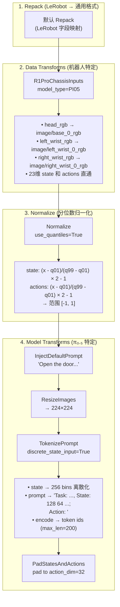
```mermaid
flowchart TD
    subgraph "1. Repack (LeRobot → 通用格式)"
        RP["默认 Repack<br/>(LeRobot 字段映射)"]
    end

    subgraph "2. Data Transforms (机器人特定)"
        R1["R1ProChassisInputs<br/>model_type=PI05"]
        R1A["• head_rgb → image/base_0_rgb<br/>• left_wrist_rgb → image/left_wrist_0_rgb<br/>• right_wrist_rgb → image/right_wrist_0_rgb<br/>• 23维 state 和 actions 直通"]
    end

    subgraph "3. Normalize (分位数归一化)"
        NORM["Normalize<br/>use_quantiles=True"]
        NORMA["state: (x - q01)/(q99 - q01) × 2 - 1<br/>actions: (x - q01)/(q99 - q01) × 2 - 1<br/>→ 范围 [-1, 1]"]
    end

    subgraph "4. Model Transforms (π₀.₅ 特定)"
        INJ["InjectDefaultPrompt<br/>'Open the door...'"]
        RES["ResizeImages<br/>→ 224×224"]
        TOK["TokenizePrompt<br/>discrete_state_input=True"]
        TOKA["• state → 256 bins 离散化<br/>• prompt → 'Task: ..., State: 128 64 ...;\nAction: '<br/>• encode → token ids (max_len=200)"]
        PAD["PadStatesAndActions<br/>pad to action_dim=32"]
    end

    RP --> R1 --> R1A --> NORM --> NORMA --> INJ --> RES --> TOK --> TOKA --> PAD
```

### A.5.3 R1ProChassisInputs 关键代码

```python
# src/openpi/policies/r1pro_chassis_policy.py (L40-L80)
ACTION_DIM = 23  # 7+7+1+1+4+3

@dataclasses.dataclass(frozen=True)
class R1ProChassisInputs(transforms.DataTransformFn):
    model_type: _model.ModelType = _model.ModelType.PI05

    def __call__(self, data: dict) -> dict:
        # 图像映射到标准键名
        result = {
            "image": {
                "base_0_rgb": data["head_rgb"],           # 头部相机
                "left_wrist_0_rgb": data["left_wrist_rgb"],  # 左腕相机
                "right_wrist_0_rgb": data["right_wrist_rgb"],  # 右腕相机
            },
            "image_mask": {
                "base_0_rgb": True,
                "left_wrist_0_rgb": True,
                "right_wrist_0_rgb": True,
            },
            "state": np.asarray(data["state"], dtype=np.float32),  # 23 维
        }
        if "actions" in data:
            result["actions"] = np.asarray(data["actions"], dtype=np.float32)
        if "prompt" in data:
            result["prompt"] = data["prompt"]
        return result
```

### A.5.4 TorchDataLoader 批处理

```python
# src/openpi/training/data_loader.py - 关键逻辑
class TorchDataLoader:
    def __init__(self, dataset, batch_size, sharding, ...):
        # 每个进程的本地 batch 大小
        local_batch_size = batch_size // jax.process_count()
        self._loader = torch.utils.data.DataLoader(
            dataset,
            batch_size=local_batch_size,
            shuffle=shuffle,
            num_workers=num_workers,
            collate_fn=_collate_fn,  # 将 list[dict] → dict[stacked_array]
            ...
        )

    def __iter__(self):
        for batch in self._loader:
            if self._sharding is not None:
                # 将 numpy batch 分片到多 GPU
                batch = jax.tree.map(
                    lambda x: jax.make_array_from_process_local_data(self._sharding, x),
                    batch
                )
            yield Observation.from_dict(batch_obs), batch_actions
```

**设计决策**：
- `batch_size` 是全局值，自动除以设备数得到每设备 batch 大小
- `jax.make_array_from_process_local_data` 将本地数据自动分配到 mesh 中对应的设备
- `collate_fn` 使用 numpy stack（而非 torch stack），避免不必要的 CPU↔GPU 数据传输

---

## A.6 训练步骤详解

### A.6.1 train_step 工作流图

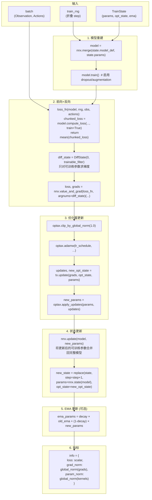
```mermaid
flowchart TD
    subgraph "输入"
        RNG["train_rng<br/>(折叠 step)"]
        STATE["TrainState<br/>(params, opt_state, ema)"]
        BATCH["batch<br/>(Observation, Actions)"]
    end

    subgraph "1. 模型重建"
        MERGE["model = nnx.merge(state.model_def, state.params)"]
        TRAIN["model.train()  # 启用 dropout/augmentation"]
    end

    subgraph "2. 前向+反向"
        LOSS_FN["loss_fn(model, rng, obs, actions):<br/>  chunked_loss = model.compute_loss(..., train=True)<br/>  return mean(chunked_loss)"]
        DIFF["diff_state = DiffState(0, trainable_filter)<br/>只对可训练参数求梯度"]
        GRAD["loss, grads = nnx.value_and_grad(loss_fn, argnums=diff_state)(...)"]
    end

    subgraph "3. 优化器更新"
        CLIP["optax.clip_by_global_norm(1.0)"]
        ADAM["optax.adamw(lr_schedule, ...)"]
        UPDATE["updates, new_opt_state = tx.update(grads, opt_state, params)"]
        APPLY["new_params = optax.apply_updates(params, updates)"]
    end

    subgraph "4. 状态更新"
        NNX_UP["nnx.update(model, new_params)<br/>将更新后的可训练参数合并回完整模型"]
        NEW_STATE["new_state = replace(state,<br/>  step=step+1,<br/>  params=nnx.state(model),<br/>  opt_state=new_opt_state)"]
    end

    subgraph "5. EMA 更新 (可选)"
        EMA["ema_params = decay × old_ema + (1-decay) × new_params"]
    end

    subgraph "6. 指标"
        METRICS["info = {<br/>  loss: scalar,<br/>  grad_norm: global_norm(grads),<br/>  param_norm: global_norm(kernels)<br/>}"]
    end

    RNG --> MERGE
    STATE --> MERGE
    BATCH --> LOSS_FN
    MERGE --> TRAIN --> LOSS_FN
    LOSS_FN --> DIFF --> GRAD
    GRAD --> CLIP --> ADAM --> UPDATE --> APPLY
    APPLY --> NNX_UP --> NEW_STATE
    NEW_STATE --> EMA
    EMA --> METRICS
```

### A.6.2 关键代码：train_step

```python
# scripts/train.py (L136-L191)
def train_step(config, rng, state, batch):
    # 1. 从参数重建模型
    model = nnx.merge(state.model_def, state.params)
    model.train()

    # 2. 定义损失函数
    def loss_fn(model, rng, observation, actions):
        chunked_loss = model.compute_loss(rng, observation, actions, train=True)
        return jnp.mean(chunked_loss)

    # 3. 前向+反向传播（只对可训练参数求梯度）
    train_rng = jax.random.fold_in(rng, state.step)  # 每步不同的随机数
    observation, actions = batch
    diff_state = nnx.DiffState(0, config.trainable_filter)
    loss, grads = nnx.value_and_grad(loss_fn, argnums=diff_state)(
        model, train_rng, observation, actions
    )

    # 4. 优化器更新
    params = state.params.filter(config.trainable_filter)
    updates, new_opt_state = state.tx.update(grads, state.opt_state, params)
    new_params = optax.apply_updates(params, updates)

    # 5. 将更新的可训练参数合并回完整模型
    nnx.update(model, new_params)
    new_params = nnx.state(model)  # 获取完整参数（含冻结部分）

    # 6. 更新训练状态
    new_state = dataclasses.replace(state, step=state.step + 1,
                                    params=new_params, opt_state=new_opt_state)

    # 7. EMA 更新
    if state.ema_decay is not None:
        new_state = dataclasses.replace(new_state,
            ema_params=jax.tree.map(
                lambda old, new: state.ema_decay * old + (1 - state.ema_decay) * new,
                state.ema_params, new_params
            ),
        )

    # 8. 监控指标
    info = {
        "loss": loss,
        "grad_norm": optax.global_norm(grads),
        "param_norm": optax.global_norm(kernel_params),
    }
    return new_state, info
```

**设计决策**：
- `jax.random.fold_in(rng, step)` 为每个训练步生成确定性但不同的随机数，保证可复现性
- `nnx.DiffState(0, trainable_filter)` 是 Flax NNX 的差分机制——只对匹配 filter 的参数计算梯度，冻结参数被自动跳过
- `nnx.update(model, new_params)` 是原地更新：将可训练参数的更新值写回模型，冻结参数保持不变
- EMA 使用简单的指数移动平均 `decay × old + (1-decay) × new`，EMA 参数在推理时可能提供更稳定的行为

---

## A.7 Checkpoint 与恢复训练

### A.7.1 Checkpoint 目录结构

```
checkpoints/
└── pi05_r1pro_chassis/          # config.name
    └── 0403_chassis/             # config.exp_name
        ├── wandb_id.txt          # W&B run ID（用于恢复）
        ├── 500/                  # step 500 的 checkpoint
        │   ├── params/           # 推理用参数（仅模型权重）
        │   ├── train_state/      # 训练状态（含优化器状态）
        │   └── assets/           # 归一化统计量
        │       └── r1_pro_data_convert_chassis/
        │           └── norm_stats.json
        ├── 1000/
        ├── 2500/                 # keep_period=2500 → 永久保留
        ├── 5000/                 # 永久保留
        └── ...
```

### A.7.2 保存与恢复序列图

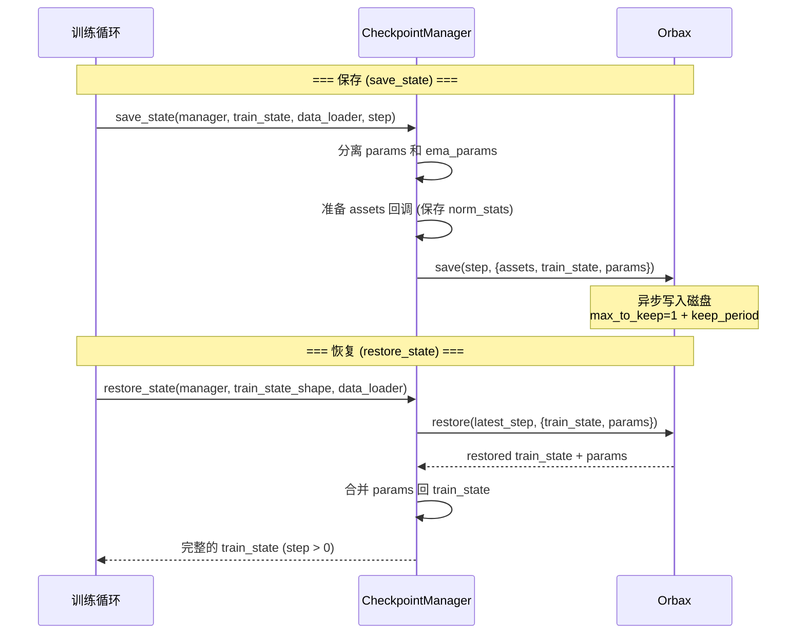
```mermaid
sequenceDiagram
    participant L as 训练循环
    participant CM as CheckpointManager
    participant ORB as Orbax

    Note over L,ORB: === 保存 (save_state) ===
    L->>CM: save_state(manager, train_state, data_loader, step)
    CM->>CM: 分离 params 和 ema_params
    CM->>CM: 准备 assets 回调 (保存 norm_stats)
    CM->>ORB: save(step, {assets, train_state, params})
    Note over ORB: 异步写入磁盘<br/>max_to_keep=1 + keep_period

    Note over L,ORB: === 恢复 (restore_state) ===
    L->>CM: restore_state(manager, train_state_shape, data_loader)
    CM->>ORB: restore(latest_step, {train_state, params})
    ORB-->>CM: restored train_state + params
    CM->>CM: 合并 params 回 train_state
    CM-->>L: 完整的 train_state (step > 0)
```

### A.7.3 恢复训练的关键代码

```python
# scripts/train.py (L240-L241) - 恢复流程
if resuming:
    train_state = _checkpoints.restore_state(checkpoint_manager, train_state, data_loader)
```

```python
# 微调指南中的恢复命令
python scripts/train.py pi05_r1pro_chassis --exp_name v1 --resume
```

`--resume` 标志触发以下流程：
1. `initialize_checkpoint_dir` 检测到目录已存在，设置 `resuming=True`
2. `init_train_state` 仅返回形状和分片策略（不实际初始化）
3. `restore_state` 从最新 checkpoint 恢复完整状态（包括 step、params、opt_state、ema_params）
4. 训练循环从 `start_step = train_state.step` 继续

---

## A.8 多 GPU 分布式训练

### A.8.1 分布式架构图

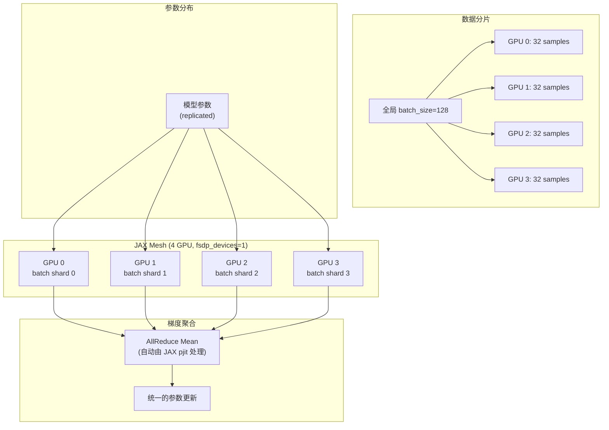
```mermaid
graph TB
    subgraph "JAX Mesh (4 GPU, fsdp_devices=1)"
        direction LR
        G0["GPU 0<br/>batch shard 0"]
        G1["GPU 1<br/>batch shard 1"]
        G2["GPU 2<br/>batch shard 2"]
        G3["GPU 3<br/>batch shard 3"]
    end

    subgraph "数据分片"
        B["全局 batch_size=128"]
        B --> B0["GPU 0: 32 samples"]
        B --> B1["GPU 1: 32 samples"]
        B --> B2["GPU 2: 32 samples"]
        B --> B3["GPU 3: 32 samples"]
    end

    subgraph "参数分布"
        P["模型参数<br/>(replicated)"]
        P --> G0
        P --> G1
        P --> G2
        P --> G3
    end

    subgraph "梯度聚合"
        G0 --> AG["AllReduce Mean<br/>(自动由 JAX pjit 处理)"]
        G1 --> AG
        G2 --> AG
        G3 --> AG
        AG --> UP["统一的参数更新"]
    end
```

### A.8.2 分片设置代码

```python
# scripts/train.py (L208-L210)
mesh = sharding.make_mesh(config.fsdp_devices)  # fsdp_devices 默认=1 → 纯数据并行
data_sharding = jax.sharding.NamedSharding(mesh, jax.sharding.PartitionSpec(sharding.DATA_AXIS))
replicated_sharding = jax.sharding.NamedSharding(mesh, jax.sharding.PartitionSpec())
```

```python
# src/openpi/training/sharding.py (L17-L23)
def make_mesh(num_fsdp_devices: int) -> jax.sharding.Mesh:
    # 例：4 GPU, fsdp=1 → mesh_shape=(4, 1)
    # batch 维度沿 4 个设备分片，模型参数复制到所有设备
    mesh_shape = (jax.device_count() // num_fsdp_devices, num_fsdp_devices)
    return jax.make_mesh(mesh_shape, (BATCH_AXIS, FSDP_AXIS))
```

```python
# scripts/train.py (L243-L248) - JIT 编译训练步骤
ptrain_step = jax.jit(
    functools.partial(train_step, config),
    in_shardings=(replicated_sharding,   # rng: 所有设备相同
                  train_state_sharding,   # state: FSDP 分片或复制
                  data_sharding),         # batch: 沿 batch 维度分片
    out_shardings=(train_state_sharding, replicated_sharding),
    donate_argnums=(1,),  # 捐赠旧 state 的内存给新 state
)
```

**设计决策**：
- `CUDA_VISIBLE_DEVICES=0,1,2,3` 通过环境变量控制哪些 GPU 参与训练
- `fsdp_devices=1`（默认）表示纯数据并行，每个 GPU 持有完整模型副本。当模型过大时可增加 `fsdp_devices` 启用 FSDP 模型分片
- `donate_argnums=(1,)` 将上一步的 `train_state` 内存直接让给本步的输出，避免峰值显存翻倍

---

## A.9 微调指南五步流程总览

基于 `doc/pi05_微调.md` 的完整流程，对应到代码实现：

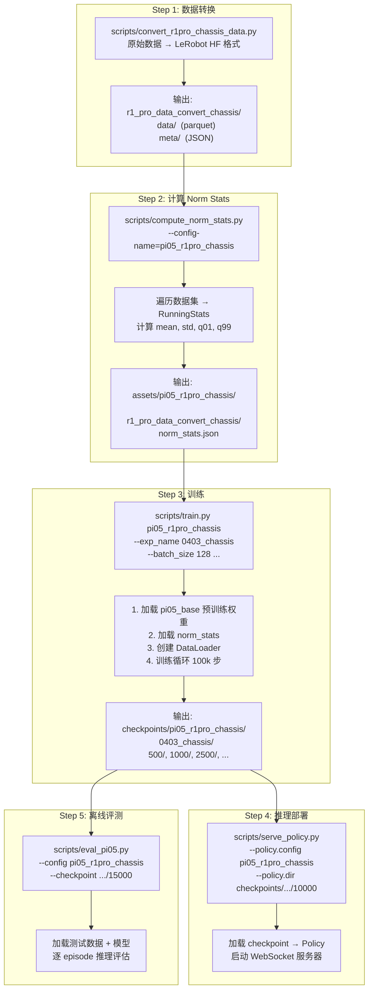
```mermaid
flowchart TD
    subgraph "Step 1: 数据转换"
        S1["scripts/convert_r1pro_chassis_data.py<br/>原始数据 → LeRobot HF 格式"]
        S1A["输出: r1_pro_data_convert_chassis/<br/>  data/  (parquet)<br/>  meta/  (JSON)"]
    end

    subgraph "Step 2: 计算 Norm Stats"
        S2["scripts/compute_norm_stats.py<br/>--config-name=pi05_r1pro_chassis"]
        S2A["遍历数据集 → RunningStats<br/>计算 mean, std, q01, q99"]
        S2B["输出: assets/pi05_r1pro_chassis/<br/>  r1_pro_data_convert_chassis/<br/>    norm_stats.json"]
    end

    subgraph "Step 3: 训练"
        S3["scripts/train.py pi05_r1pro_chassis<br/>--exp_name 0403_chassis<br/>--batch_size 128 ..."]
        S3A["1. 加载 pi05_base 预训练权重<br/>2. 加载 norm_stats<br/>3. 创建 DataLoader<br/>4. 训练循环 100k 步"]
        S3B["输出: checkpoints/pi05_r1pro_chassis/<br/>  0403_chassis/<br/>    500/, 1000/, 2500/, ..."]
    end

    subgraph "Step 4: 推理部署"
        S4["scripts/serve_policy.py<br/>--policy.config pi05_r1pro_chassis<br/>--policy.dir checkpoints/.../10000"]
        S4A["加载 checkpoint → Policy<br/>启动 WebSocket 服务器"]
    end

    subgraph "Step 5: 离线评测"
        S5["scripts/eval_pi05.py<br/>--config pi05_r1pro_chassis<br/>--checkpoint .../15000"]
        S5A["加载测试数据 + 模型<br/>逐 episode 推理评估"]
    end

    S1 --> S1A --> S2
    S2 --> S2A --> S2B --> S3
    S3 --> S3A --> S3B --> S4
    S4 --> S4A
    S3B --> S5 --> S5A
```

### 各步骤对应的代码文件

| 步骤 | 命令/脚本 | 核心实现文件 |
|------|----------|------------|
| Step 1 | `convert_r1pro_chassis_data.py` | `scripts/convert_r1pro_chassis_data.py` |
| Step 2 | `compute_norm_stats.py` | `scripts/compute_norm_stats.py` → `shared/normalize.py` |
| Step 3 | `train.py` | `scripts/train.py` → `training/{config,data_loader,optimizer,checkpoints,sharding}.py` |
| Step 4 | `serve_policy.py` | `scripts/serve_policy.py` → `policies/{policy,policy_config,r1pro_chassis_policy}.py` |
| Step 5 | `eval_pi05.py` | `scripts/eval_pi05.py` → `policies/policy_config.py` |

### 训练命令参数到代码的映射表

以 `doc/pi05_微调.md` Step 3 的命令为例：

```bash
CUDA_VISIBLE_DEVICES=0,1,2,3 \           # → jax.device_count()=4, make_mesh(1)=(4,1)
HF_LEROBOT_HOME=/home/.../data \          # → LeRobot 数据集根目录
uv run python scripts/train.py \
  pi05_r1pro_chassis \                     # → _CONFIGS_DICT["pi05_r1pro_chassis"]
  --exp_name 0403_chassis \                # → config.checkpoint_dir = checkpoints/pi05_r1pro_chassis/0403_chassis
  --batch_size 128 \                       # → 覆盖默认 64, 每 GPU 32 samples
  --num_train_steps 100000 \               # → 覆盖默认 30000
  --save_interval 500 \                    # → 每 500 步保存 checkpoint
  --keep_period 2500                       # → step % 2500 == 0 的 checkpoint 永久保留
```

| 参数 | TrainConfig 字段 | 默认值 | 覆盖值 | 影响 |
|------|-----------------|--------|--------|------|
| 位置参数 | `name` | - | `"pi05_r1pro_chassis"` | 选择预定义配置 |
| `--exp_name` | `exp_name` | MISSING | `"0403_chassis"` | checkpoint 子目录名 |
| `--batch_size` | `batch_size` | 64 | 128 | 全局 batch (128/4GPU=32/GPU) |
| `--num_train_steps` | `num_train_steps` | 30,000 | 100,000 | 总训练步数 |
| `--save_interval` | `save_interval` | 1,000 | 500 | 保存频率 |
| `--keep_period` | `keep_period` | 5,000 | 2,500 | 永久保留间隔 |
| `--resume` | `resume` | False | (可选) | 从最新 checkpoint 恢复 |

---

## 15. 训练参数调优完全指南

> 本节系统梳理通过 `scripts/train.py` 微调 π₀.₅ 时所有可调参数的含义、代码实现路径、对训练质量的影响及调优建议。分析基于 OpenPI 代码库深度阅读，并参考了 π₀/π₀.₅ 原始论文、LoRA VLA 微调研究、OpenVLA-OFT 等工作（完整文献列表见 15.14 节）。

---

### 15.1 参数概览与 CLI 使用方式

#### 15.1.1 tyro CLI 机制

OpenPI 使用 [tyro](https://github.com/brentyi/tyro) 库的 `overridable_config_cli` 实现命令行参数解析：

```python
# src/openpi/training/config.py (L1072-L1073)
def cli() -> TrainConfig:
    return tyro.extras.overridable_config_cli({k: (k, v) for k, v in _CONFIGS_DICT.items()})
```

使用方式分两步：
1. **位置参数**：选择预定义配置名（如 `pi05_r1pro_chassis`），从 `_CONFIGS_DICT` 中加载完整的 `TrainConfig`
2. **覆盖参数**：通过 `--field_name value` 覆盖配置中的任意字段

```bash
# 基本用法
uv run scripts/train.py pi05_r1pro_chassis --exp_name my_run

# 覆盖顶层参数
uv run scripts/train.py pi05_r1pro_chassis \
  --exp_name my_run \
  --batch_size 128 \
  --num_train_steps 50000

# 覆盖嵌套 dataclass 参数（用点号分隔）
uv run scripts/train.py pi05_r1pro_chassis \
  --exp_name my_run \
  --lr_schedule.peak_lr 5e-5 \
  --lr_schedule.warmup_steps 2000 \
  --optimizer.clip_gradient_norm 0.5
```

#### 15.1.2 参数全景表

以下表格列出所有训练相关参数、默认值及其在代码中的精确定义位置。

**A. TrainConfig 可通过 CLI 调整的参数**（定义于 `src/openpi/training/config.py` L468-L559）：

| 参数名 | 类型 | 默认值 | 代码位置 | CLI 示例 |
|--------|------|--------|----------|----------|
| `exp_name` | str | MISSING（必填） | `config.py:474` | `--exp_name run1` |
| `project_name` | str | `"openpi"` | `config.py:472` | `--project_name my_proj` |
| `num_train_steps` | int | `30_000` | `config.py:513` | `--num_train_steps 50000` |
| `batch_size` | int | `32` | `config.py:508` | `--batch_size 128` |
| `seed` | int | `42` | `config.py:506` | `--seed 123` |
| `num_workers` | int | `2` | `config.py:511` | `--num_workers 4` |
| `ema_decay` | float\|None | `0.99` | `config.py:492` | `--ema_decay 0.999` |
| `fsdp_devices` | int | `1` | `config.py:537` | `--fsdp_devices 2` |
| `save_interval` | int | `1000` | `config.py:518` | `--save_interval 500` |
| `keep_period` | int\|None | `5000` | `config.py:520` | `--keep_period 2500` |
| `log_interval` | int | `100` | `config.py:516` | `--log_interval 50` |
| `resume` | bool | `False` | `config.py:525` | `--resume` |
| `overwrite` | bool | `False` | `config.py:523` | `--overwrite` |
| `wandb_enabled` | bool | `True` | `config.py:528` | `--wandb_enabled False` |
| `assets_base_dir` | str | `"./assets"` | `config.py:501` | `--assets_base_dir /data/assets` |
| `checkpoint_base_dir` | str | `"./checkpoints"` | `config.py:503` | `--checkpoint_base_dir /data/ckpt` |
| `pytorch_weight_path` | str\|None | `None` | `config.py:485` | `--pytorch_weight_path /path/to/pt` |
| `pytorch_training_precision` | str | `"bfloat16"` | `config.py:488` | `--pytorch_training_precision float32` |

**B. CosineDecaySchedule 学习率调度参数**（定义于 `src/openpi/training/optimizer.py` L16-L31）：

| 参数名 | 类型 | 默认值 | 代码位置 | CLI 示例 |
|--------|------|--------|----------|----------|
| `lr_schedule.warmup_steps` | int | `1_000` | `optimizer.py:19` | `--lr_schedule.warmup_steps 2000` |
| `lr_schedule.peak_lr` | float | `2.5e-5` | `optimizer.py:20` | `--lr_schedule.peak_lr 5e-5` |
| `lr_schedule.decay_steps` | int | `30_000` | `optimizer.py:21` | `--lr_schedule.decay_steps 50000` |
| `lr_schedule.decay_lr` | float | `2.5e-6` | `optimizer.py:22` | `--lr_schedule.decay_lr 1e-6` |

**C. RsqrtDecaySchedule 学习率调度参数**（定义于 `src/openpi/training/optimizer.py` L35-L53，需通过 `--lr_schedule:rsqrt-decay-schedule` 切换）：

| 参数名 | 类型 | 默认值 | 代码位置 | CLI 示例 |
|--------|------|--------|----------|----------|
| `lr_schedule.warmup_steps` | int | `1_000` | `optimizer.py:38` | `--lr_schedule.warmup_steps 2000` |
| `lr_schedule.peak_lr` | float | `5e-5` | `optimizer.py:39` | `--lr_schedule.peak_lr 1e-4` |
| `lr_schedule.timescale` | float | `10_000` | `optimizer.py:40` | `--lr_schedule.timescale 5000` |

**D. AdamW 优化器参数**（定义于 `src/openpi/training/optimizer.py` L65-L86）：

| 参数名 | 类型 | 默认值 | 代码位置 | CLI 示例 |
|--------|------|--------|----------|----------|
| `optimizer.b1` | float | `0.9` | `optimizer.py:69` | `--optimizer.b1 0.9` |
| `optimizer.b2` | float | `0.95` | `optimizer.py:70` | `--optimizer.b2 0.98` |
| `optimizer.eps` | float | `1e-8` | `optimizer.py:71` | `--optimizer.eps 1e-8` |
| `optimizer.weight_decay` | float | `1e-10` | `optimizer.py:73` | `--optimizer.weight_decay 0.01` |
| `optimizer.clip_gradient_norm` | float | `1.0` | `optimizer.py:74` | `--optimizer.clip_gradient_norm 0.5` |

**E. SGD 优化器参数**（定义于 `src/openpi/training/optimizer.py` L88-L102，需通过 `--optimizer:sgd` 切换）：

| 参数名 | 类型 | 默认值 | 代码位置 | CLI 示例 |
|--------|------|--------|----------|----------|
| `optimizer.lr` | float | `5e-5` | `optimizer.py:92` | `--optimizer.lr 1e-4` |
| `optimizer.momentum` | float | `0.9` | `optimizer.py:93` | `--optimizer.momentum 0.95` |
| `optimizer.nesterov` | bool | `False` | `optimizer.py:94` | `--optimizer.nesterov` |

**F. Pi0Config 模型架构参数**（定义于 `src/openpi/models/pi0_config.py` L18-L48，通常通过选择预定义配置设置，也可 CLI 覆盖）：

| 参数名 | 类型 | 默认值 | 代码位置 | 说明 |
|--------|------|--------|----------|------|
| `model.dtype` | str | `"bfloat16"` | `pi0_config.py:20` | 模型计算精度 |
| `model.paligemma_variant` | Variant | `"gemma_2b"` | `pi0_config.py:21` | PaliGemma 专家变体 |
| `model.action_expert_variant` | Variant | `"gemma_300m"` | `pi0_config.py:22` | Action 专家变体 |
| `model.action_dim` | int | `32` | `pi0_config.py:25` | 动作空间维度 |
| `model.action_horizon` | int | `50` | `pi0_config.py:26` | 预测动作序列长度 |
| `model.max_token_len` | int | `None`→`200`(π₀.₅)/`48`(π₀) | `pi0_config.py:27,38-39` | token 序列上限（自动设置） |
| `model.pi05` | bool | `False` | `pi0_config.py:31` | 启用 π₀.₅ 模式 |
| `model.discrete_state_input` | bool | `None`→跟随`pi05` | `pi0_config.py:33,40-41` | 离散状态输入（自动设置） |
| `model.pytorch_compile_mode` | str\|None | `"max-autotune"` | `pi0_config.py:35` | PyTorch 编译模式 |

**G. LoRA 超参数**（硬编码于 `src/openpi/models/gemma.py` L88-L108，不可 CLI 调整）：

| 变体 | LoRA rank | LoRA alpha | scaling | 应用层 | 代码位置 |
|------|-----------|------------|---------|--------|----------|
| `gemma_2b_lora` | `16` | `16.0` | 1.0 | attn + ffn | `gemma.py:96` |
| `gemma_300m_lora` | `32` | `32.0` | 1.0 | attn + ffn | `gemma.py:107` |

LoRA 基础配置默认值（定义于 `src/openpi/models/lora.py` L12-L25）：

| 字段 | 默认值 | 代码位置 | 说明 |
|------|--------|----------|------|
| `alpha` | `1.0` | `lora.py:18` | 缩放因子（被 gemma.py 覆盖） |
| `init_fn` | `normal(stddev=0.01)` | `lora.py:20` | LoRA 参数初始化 |
| `rslora` | `False` | `lora.py:22` | 是否启用 rank-stabilized LoRA |
| `axes` | `(-2, -1)` | `lora.py:24` | 应用 LoRA 的权重维度 |

**H. 数据增强参数**（硬编码于 `src/openpi/models/model.py` L168-L187，不可 CLI 调整）：

| 增强类型 | 参数 | 默认值 | 代码位置 | 应用范围 |
|---------|------|--------|----------|---------|
| RandomCrop | 裁剪比例 | `0.95`（即 95% 面积） | `model.py:176` | 非腕部相机 |
| Resize | 恢复尺寸 | 原始 width, height | `model.py:177` | 非腕部相机 |
| Rotate | 角度范围 | `(-5, 5)` 度 | `model.py:178` | 非腕部相机 |
| ColorJitter | brightness | `0.3` | `model.py:181` | 所有相机 |
| ColorJitter | contrast | `0.4` | `model.py:181` | 所有相机 |
| ColorJitter | saturation | `0.5` | `model.py:181` | 所有相机 |

**I. Flow Matching 训练参数**（硬编码于 `src/openpi/models/pi0.py` L188-L222，不可 CLI 调整）：

| 参数 | 默认值 | 代码位置 | 说明 |
|------|--------|----------|------|
| 时间分布 | `Beta(1.5, 1)` | `pi0.py:197` | 偏向高噪声端采样 |
| 时间范围缩放 | `* 0.999 + 0.001` | `pi0.py:197` | 映射到 [0.001, 0.999] |
| 噪声类型 | `N(0, I)` 标准高斯 | `pi0.py:196` | `jax.random.normal` |
| 损失函数 | MSE | `pi0.py:214` | `mean(square(v_t - u_t))` |
| 推理去噪步数 | `10` | `pi0.py:222` | `sample_actions` 的 `num_steps` 参数 |
| 时间嵌入 min_period | `4e-3` | `pi0.py:161` | `posemb_sincos` 正弦编码最小周期 |
| 时间嵌入 max_period | `4.0` | `pi0.py:161` | `posemb_sincos` 正弦编码最大周期 |

**J. Checkpoint 管理内部参数**（硬编码，不可 CLI 调整）：

| 参数 | 默认值 | 代码位置 | 说明 |
|------|--------|----------|------|
| `max_to_keep` | `1` | `checkpoints.py:48` | Orbax 最多保留最新 1 个 checkpoint（`keep_period` 的除外） |

**K. FSDP 分片内部参数**（硬编码，不可 CLI 调整）：

| 参数 | 默认值 | 代码位置 | 说明 |
|------|--------|----------|------|
| `min_size_mbytes` | `4` (MiB) | `sharding.py:52` | 小于 4MB 的参数不分片，直接复制 |

---

### 15.2 训练规模参数

#### 15.2.1 num_train_steps

| 属性 | 值 |
|------|-----|
| **类型** | int |
| **默认值** | 30,000 |
| **代码位置** | `config.py:513` (定义), `train.py:251-256` (使用) |

**含义**：总训练迭代步数，每一步消耗一个 batch 的数据。训练循环从 `start_step`（恢复训练时为上次 checkpoint 的 step）运行到 `num_train_steps - 1`。

**代码实现**：
```python
# scripts/train.py (L251-L256)
start_step = int(train_state.step)
pbar = tqdm.tqdm(
    range(start_step, config.num_train_steps),
    initial=start_step,
    total=config.num_train_steps,
    dynamic_ncols=True,
)
```

**对训练的影响**：
- **步数过少**：模型欠拟合，loss 尚未收敛就停止训练
- **步数过多**：在小数据集上容易过拟合，loss 在验证集上开始上升
- **与数据量的关系**：每步看 `batch_size` 个样本，总共看 `num_train_steps × batch_size` 个样本

**调优建议**：
- 全量微调：30k-100k（π₀.₅ 论文中预训练约 1M 步，微调约 20k-100k 步）
- LoRA 微调：20k-30k 通常足够（参考 `pi05_r1pro_open_door_lora` 配置用 30k）
- 大规模 DROID 预训练：100k+（参考 `pi05_full_droid_finetune` 用 100k）
- **关键指标**：监控 W&B 中的 loss 曲线，当 loss 不再显著下降且 grad_norm 趋于稳定时，可考虑提前终止
- **经验公式**：确保每个训练样本至少被看到 10-50 次（epoch 数 = num_train_steps × batch_size / 数据集大小）

#### 15.2.2 batch_size

| 属性 | 值 |
|------|-----|
| **类型** | int |
| **默认值** | 32（预定义配置可覆盖，如 R1Pro 配置默认 64） |
| **代码位置** | `config.py:508` (定义), `train.py:198-201` (整除验证) |

**含义**：全局 batch size，即每个训练步骤中所有 GPU 共同处理的样本总数。必须能被 GPU 数量整除。

**代码实现**：
```python
# scripts/train.py (L198-L201)
if config.batch_size % jax.device_count() != 0:
    raise ValueError(
        f"Batch size {config.batch_size} must be divisible by the number of devices {jax.device_count()}."
    )
```

每个 GPU 实际处理的样本数为 `per_device_batch = batch_size / jax.device_count()`。数据通过 `data_sharding` 自动分配到各设备：

```python
# scripts/train.py (L209)
data_sharding = jax.sharding.NamedSharding(mesh, jax.sharding.PartitionSpec(sharding.DATA_AXIS))
```

**对训练的影响**：
- **更大 batch**：梯度估计更稳定，训练曲线更平滑，但可能收敛到较尖锐的极小值（泛化性可能较差）
- **更小 batch**：梯度噪声更大，有正则化效果，但训练不稳定
- **显存限制**：per_device_batch 过大会导致 OOM
- **吞吐量**：在显存允许范围内，更大 batch 能更好利用 GPU 并行度

**调优建议**：

| GPU 数量 | 推荐 batch_size | per_device_batch | 说明 |
|----------|----------------|-----------------|------|
| 1 | 16-32 | 16-32 | 显存约需 40-80GB |
| 2 | 32-64 | 16-32 | — |
| 4 | 64-128 | 16-32 | R1Pro 默认配置 |
| 8 | 128-256 | 16-32 | 大规模训练 |

- 增大 batch_size 时应按比例增大 peak_lr（**线性缩放规则**：batch 翻倍则 lr 翻倍）
- 参考 OpenVLA-OFT 建议：per_device_batch 不低于 8
- 参考 π₀.₅ DROID 预训练配置：batch_size=256，peak_lr=5e-5

#### 15.2.3 seed

| 属性 | 值 |
|------|-----|
| **类型** | int |
| **默认值** | 42 |
| **代码位置** | `config.py:506` (定义), `train.py:205-206` (使用) |

**含义**：控制训练中所有随机性的种子，包括：权重初始化、数据增强、flow matching 噪声采样。

**代码实现**：
```python
# scripts/train.py (L205-L206)
rng = jax.random.key(config.seed)
train_rng, init_rng = jax.random.split(rng)
```

训练循环中每一步通过 `fold_in` 确保每步有不同的随机性：
```python
# scripts/train.py (L153)
train_rng = jax.random.fold_in(rng, state.step)
```

**调优建议**：通常无需修改。做消融实验时可改变 seed（如 0, 1, 2, ...）来评估训练方差和结果鲁棒性。

#### 15.2.4 num_workers

| 属性 | 值 |
|------|-----|
| **类型** | int |
| **默认值** | 2 |
| **代码位置** | `config.py:511` (定义), `data_loader.py:264` (传递到 DataLoader), `data_loader.py:439` (PyTorch DataLoader 实际使用) |

**含义**：PyTorch DataLoader 的工作进程数，用于并行预处理和加载数据。

**对训练的影响**：
- 增加 → 数据加载更快，减少 GPU 等待时间
- 增加 → 更多 CPU 和内存占用
- **注意**：使用 RLDS 数据加载器时（如 DROID），必须设为 0（RLDS 内部处理多进程）

**调优建议**：
- 默认 2 足够应对大多数场景
- 如果发现 GPU 利用率低（数据加载成为瓶颈），增至 4-8
- 不要超过 CPU 核心数 / GPU 数

---

### 15.3 学习率调度参数

学习率调度是影响训练效果的最关键参数组之一。OpenPI 提供两种调度方案。

#### 15.3.1 CosineDecaySchedule（默认）

```python
# src/openpi/training/optimizer.py (L16-L31)
@dataclasses.dataclass(frozen=True)
class CosineDecaySchedule(LRScheduleConfig):
    warmup_steps: int = 1_000
    peak_lr: float = 2.5e-5
    decay_steps: int = 30_000
    decay_lr: float = 2.5e-6

    def create(self) -> optax.Schedule:
        return optax.warmup_cosine_decay_schedule(
            init_value=self.peak_lr / (self.warmup_steps + 1),
            peak_value=self.peak_lr,
            warmup_steps=self.warmup_steps,
            decay_steps=self.decay_steps,
            end_value=self.decay_lr,
        )
```

学习率变化曲线：

```
lr
^
|     peak_lr ____
|            /    \
|           /      \___
|          /            \_____  decay_lr
|_________/                    ___________
+----+----+----+----+----+----+----+-----> step
0   warmup  decay_steps
```

**各参数详解**：

**warmup_steps（默认 `1_000`，`optimizer.py:19`）**

- 含义：从 `peak_lr / (warmup_steps + 1)` 线性升温到 `peak_lr` 的步数
- 作用：避免训练初期大学习率导致梯度爆炸，让优化器状态（动量）有时间积累
- 调优：
  - 全量微调：1,000（默认即可）
  - LoRA 微调：500-1,000（LoRA 参数量少，不需要太长 warmup）
  - 大 batch 训练：可适当增加至 2,000-5,000
  - 短训练（<10k 步）：减至 200-500，否则 warmup 占比过大

**peak_lr（默认 `2.5e-5`，`optimizer.py:20`）— 最关键参数**

- 含义：学习率的最大值，warmup 结束后达到
- 调优（**最重要的超参数之一**）：

  | 微调模式 | 推荐 peak_lr | 参考配置 |
  |---------|-------------|---------|
  | 全量微调（小数据集） | 2.5e-5 | 默认值 |
  | 全量微调（大数据集） | 5e-5 | `pi05_full_droid_finetune` |
  | LoRA 微调 | 5e-5 ~ 1e-4 | LoRA 参数少，可用更大 lr |
  | 继续预训练 | 1e-5 ~ 2.5e-5 | 避免遗忘已学知识 |

- **与 batch_size 的线性缩放规则**：若 batch_size 从 32 增至 128（4x），peak_lr 也应增至约 4x（如 2.5e-5 → 1e-4）。该规则来自"[Large Batch Training](https://arxiv.org/abs/1706.02677)"的经典结论
- **过大的信号**：loss 震荡不收敛、grad_norm 突然飙升至远超 1.0
- **过小的信号**：loss 下降极慢，grad_norm 持续很小（<0.01）

**decay_steps（默认 `30_000`，`optimizer.py:21`）**

- 含义：从 peak_lr 余弦衰减到 decay_lr 的总步数
- 调优：
  - **推荐设为 ≥ num_train_steps**，确保整个训练过程都有合理的学习率下降
  - 如果 `decay_steps < num_train_steps`，超出部分将以 `decay_lr` 平坦训练
  - 如果 `decay_steps > num_train_steps`，训练结束时学习率尚未降到 decay_lr

**decay_lr（默认 `2.5e-6`，`optimizer.py:22`）**

- 含义：余弦衰减结束后的最终学习率
- 调优：
  - 通常设为 `peak_lr` 的 1/10
  - 太高会导致训练末期不稳定
  - 太低（如 0）则训练末期几乎不更新

#### 15.3.2 RsqrtDecaySchedule（可选）

```python
# src/openpi/training/optimizer.py (L35-L53)
@dataclasses.dataclass(frozen=True)
class RsqrtDecaySchedule(LRScheduleConfig):
    warmup_steps: int = 1_000
    peak_lr: float = 5e-5
    timescale: float = 10_000

    def create(self) -> optax.Schedule:
        return optax.join_schedules(
            [
                optax.linear_schedule(
                    init_value=self.peak_lr / (self.warmup_steps + 1),
                    end_value=self.peak_lr,
                    transition_steps=self.warmup_steps,
                ),
                lambda step: self.peak_lr / jnp.sqrt((self.timescale + step) / self.timescale),
            ],
            [self.warmup_steps],
        )
```

- 衰减公式：`lr(step) = peak_lr / sqrt((timescale + step) / timescale)`
- 特点：衰减速度比 cosine 更缓慢，适合长时间训练或持续学习
- `timescale` 控制衰减速度：值越大衰减越慢

#### 15.3.3 两种调度的选择

| 对比维度 | CosineDecaySchedule | RsqrtDecaySchedule |
|---------|--------------------|--------------------|
| 适用场景 | 固定步数微调 | 长时间训练/持续学习 |
| 衰减形状 | 余弦曲线（先慢后快再慢） | 反平方根（持续缓慢衰减） |
| 是否需要预定义终点 | 是（decay_steps） | 否（持续衰减） |
| 推荐使用 | 大多数微调场景 | 不确定训练步数时 |

---

### 15.4 优化器参数

#### 15.4.1 AdamW（默认优化器）

```python
# src/openpi/training/optimizer.py (L65-L86)
@dataclasses.dataclass(frozen=True)
class AdamW(OptimizerConfig):
    b1: float = 0.9
    b2: float = 0.95
    eps: float = 1e-8
    weight_decay: float = 1e-10
    clip_gradient_norm: float = 1.0

    def create(self, lr, weight_decay_mask=None):
        tx = optax.adamw(lr, b1=self.b1, b2=self.b2, eps=self.eps,
                         weight_decay=self.weight_decay, mask=weight_decay_mask)
        return optax.chain(optax.clip_by_global_norm(self.clip_gradient_norm), tx)
```

**注意执行顺序**：`optax.chain` 中先执行梯度裁剪（`clip_by_global_norm`），再执行 AdamW 更新。

**b1（默认 `0.9`，`optimizer.py:69`）— 一阶动量衰减系数**

- 控制梯度均值的指数移动平均衰减速度
- 0.9 是经典设置，通常无需修改
- 较大值（0.95）：更平滑但响应更慢
- 较小值（0.8）：响应更快但更不稳定

**b2（默认 `0.95`，`optimizer.py:70`）— 二阶动量衰减系数**

- 控制梯度平方均值的指数移动平均衰减速度
- **注意**：OpenPI 使用 0.95 而非 PyTorch 默认的 0.999。这是 Gemma/LLM 训练的常见选择（参考 Google Gemma 论文），对稀疏梯度更敏感，能更快适应梯度分布变化
- 调优：如遇训练不稳定可尝试 b2=0.98 或 0.99

**eps（默认 `1e-8`，`optimizer.py:71`）**

- 数值稳定性常数，防止除以零
- 通常无需调整

**weight_decay（默认 `1e-10`，`optimizer.py:73`）— 权重衰减**

- **实质上被禁用**（1e-10 几乎为零）
- 代码中有明确注释解释原因：
  ```python
  # optimizer.py (L72-L73)
  # Changing this to 0 can cause out-of-memory errors for some reason,
  # so we set it to a negligible value.
  ```
- 这是一个已知的 JAX/optax 问题的 workaround
- 调优建议：
  - 保持默认 1e-10
  - 如确实需要正则化效果，可尝试 1e-4 ~ 1e-2，但需监控显存占用
  - LoRA 微调通常不需要 weight decay（LoRA 参数量已经很少）

**clip_gradient_norm（默认 `1.0`，`optimizer.py:74`）— 梯度裁剪**

- 含义：当全局梯度范数超过此阈值时，按比例缩放所有梯度
- 代码实现：在 AdamW 之前通过 `optax.clip_by_global_norm` 应用
- 作用：防止梯度爆炸，对训练稳定性至关重要
- 调优建议：
  - 默认 1.0 适合大多数场景
  - 如果 W&B 中的 grad_norm 持续远低于 1.0（如 <0.1），可降至 0.5
  - 如果训练出现 loss 突然飙升（spike），考虑降低到 0.5 或 0.3
  - 不建议设为 0（禁用裁剪），可能导致训练不稳定

#### 15.4.2 SGD（备选优化器）

```python
# src/openpi/training/optimizer.py (L88-L102)
@dataclasses.dataclass(frozen=True)
class SGD(OptimizerConfig):
    lr: float = 5e-5
    momentum: float = 0.9
    nesterov: bool = False
```

- 适用场景：极少使用，仅在特殊实验中考虑
- 不支持 weight_decay
- 通过 CLI 切换：`--optimizer:sgd --optimizer.lr 5e-5`

---

### 15.5 EMA（指数移动平均）参数

| 属性 | 值 |
|------|-----|
| **参数** | `ema_decay` |
| **类型** | float \| None |
| **默认值** | 0.99 |
| **代码位置** | `config.py:492` (定义), `train.py:169-175` (更新), `checkpoints.py:145-152` (保存) |

**含义**：维护训练参数的指数移动平均（EMA）副本，用于推理时获得更稳定的模型。设为 `None` 则禁用 EMA。

**更新公式**：
```python
# scripts/train.py (L169-L175)
if state.ema_decay is not None:
    new_state = dataclasses.replace(
        new_state,
        ema_params=jax.tree.map(
            lambda old, new: state.ema_decay * old + (1 - state.ema_decay) * new,
            state.ema_params, new_params
        ),
    )
```

即 `θ_ema = decay × θ_ema_old + (1 - decay) × θ_current`

**重要细节 — checkpoint 保存逻辑**：

当保存 checkpoint 时，如果 EMA 参数存在，则保存 EMA 版本（而非当前训练参数）用于推理：

```python
# src/openpi/training/checkpoints.py (L145-L152)
def _split_params(state: training_utils.TrainState):
    if state.ema_params is not None:
        params = state.ema_params          # 保存 EMA 参数用于推理
        train_state = dataclasses.replace(state, ema_params=None)
    else:
        params = state.params              # 无 EMA 时保存训练参数
        train_state = dataclasses.replace(state, params={})
    return train_state, params
```

**对训练的影响**：
- EMA 参数通常比训练参数更平滑、泛化性更好
- `decay` 越大（如 0.999），EMA 越平滑但更新越慢
- `decay` 越小（如 0.9），EMA 跟踪训练参数越快但平滑效果越弱

**调优建议**：

| 场景 | 推荐 ema_decay | 说明 |
|------|---------------|------|
| 全量微调（<30k 步） | 0.99 | 默认即可 |
| 全量微调（>50k 步） | 0.999 | 长训练需要更慢的平均 |
| 大规模预训练（>100k 步） | 0.999 ~ 0.9999 | 参考 `pi05_full_droid_finetune` 用 0.999 |
| LoRA 微调 | **None** | LoRA 参数量极少，EMA 会导致更新严重滞后 |

**LoRA 微调必须设为 None**：参考 `pi05_r1pro_open_door_lora` 配置（`config.py:1019`），LoRA 只训练很少的参数，EMA 的平均效果会过度抑制有效更新。

---

### 15.6 模型架构参数

这些参数定义在 `Pi0Config`（`src/openpi/models/pi0_config.py:18-48`）中。通常通过选择预定义配置来设置，较少通过 CLI 直接覆盖。

#### 15.6.1 pi05 与 discrete_state_input

```python
# src/openpi/models/pi0_config.py (L31-L41)
pi05: bool = False
discrete_state_input: bool = None  # 自动跟随 pi05

def __post_init__(self):
    if self.max_token_len is None:
        object.__setattr__(self, "max_token_len", 200 if self.pi05 else 48)
    if self.discrete_state_input is None:
        object.__setattr__(self, "discrete_state_input", self.pi05)
```

- `pi05=True` 启用 π₀.₅ 模式（知识隔离 + AdaRMSNorm）
- `discrete_state_input` 自动跟随 `pi05`，将状态输入从连续向量变为离散 token
- 通常不需要手动设置 — 选择 `pi05_*` 前缀的配置即可

#### 15.6.2 action_dim 与 action_horizon

| 参数 | 默认值 | 代码位置（默认值设置处） | 含义 |
|------|--------|------------------------|------|
| `action_dim` | `32` | `pi0_config.py:25`（`action_dim: int = 32`） | 动作空间维度（会自动 pad 到 32） |
| `action_horizon` | `50` | `pi0_config.py:26`（`action_horizon: int = 50`） | 每次预测的动作序列长度（时间步数） |

注意：`BaseModelConfig`（`model.py:217-222`）声明了 `action_dim`、`action_horizon`、`max_token_len` 三个字段但**不提供默认值**，默认值由子类 `Pi0Config`（`pi0_config.py:25-27`）设置。

- `action_dim=32` 是固定的（模型架构约束），实际动作维度通过 `PadStatesAndActions` 变换 pad 到 32
- `action_horizon` 决定模型一次预测多少步未来动作：
  - ALOHA（50Hz）：50 步 = 1 秒
  - DROID：15-16 步
  - LIBERO：10 步
  - R1Pro：50 步

**调优建议**：这两个参数由机器人平台决定，一般不需要修改。如果目标机器人的控制频率与默认配置不同，需要调整 `action_horizon`。

#### 15.6.3 max_token_len

| 模型 | 默认值 | 代码位置（默认值设置处） | 说明 |
|------|--------|------------------------|------|
| π₀ | `48` | `pi0_config.py:38-39`（`200 if self.pi05 else 48`） | 仅语言 prompt |
| π₀.₅ | `200` | `pi0_config.py:38-39`（`200 if self.pi05 else 48`） | 语言 prompt + 离散化状态 token |

字段声明处 `pi0_config.py:27` 设为 `None`，在 `__post_init__`（`pi0_config.py:37-39`）中根据 `pi05` 标志自动赋值。

- 影响 Tokenizer 输出的 token 序列长度上限
- π₀.₅ 需要更长的 token 序列来编码离散化的状态（如 "State: 128 64 200 ..."）
- 增大 `max_token_len` 会增加注意力计算量和显存占用

#### 15.6.4 paligemma_variant 与 action_expert_variant

可选值及对应模型规模：

```python
# src/openpi/models/gemma.py (L55)
Variant = Literal["dummy", "gemma_300m", "gemma_300m_lora", "gemma_2b", "gemma_2b_lora"]
```

| Variant | 参数量 | width | depth | heads | 代码位置（默认值设置处） |
|---------|--------|-------|-------|-------|------------------------|
| `gemma_2b` | ~2B | 2048 | 18 | 8 | `gemma.py:79-87`（PaliGemma Expert 0） |
| `gemma_2b_lora` | 2B+LoRA | 2048 | 18 | 8 | `gemma.py:88-97`（PaliGemma + LoRA） |
| `gemma_300m` | ~311M | 1024 | 18 | 8 | `gemma.py:69-78`（Action Expert 1） |
| `gemma_300m_lora` | 311M+LoRA | 1024 | 18 | 8 | `gemma.py:98-108`（Action Expert + LoRA） |
| `dummy` | 极小 | 64 | 4 | 8 | `gemma.py:60-68`（调试用） |

**LoRA 超参数**（硬编码在 `gemma.py`）：

```python
# src/openpi/models/gemma.py (L88-L108)
# gemma_2b_lora:
lora_configs={"attn": LoRAConfig(rank=16, alpha=16.0),
              "ffn": LoRAConfig(rank=16, alpha=16.0)}

# gemma_300m_lora:
lora_configs={"attn": LoRAConfig(rank=32, alpha=32.0),
              "ffn": LoRAConfig(rank=32, alpha=32.0)}
```

- LoRA 应用于注意力层（Q/K/V/O 投影）和前馈层
- `rank` 控制低秩分解的秩：越大表达能力越强，但参数越多
- `alpha` 控制 LoRA 缩放：`scaling = alpha / rank`（当 alpha=rank 时 scaling=1）
- LoRA 实现位于 `src/openpi/models/lora.py`，支持标准 LoRA 和 rsLoRA（rank-stabilized LoRA，`lora.py:21-22`）

#### 15.6.5 dtype

- 默认 `"bfloat16"`（`pi0_config.py:20`，`dtype: str = "bfloat16"`）
- 训练中，冻结参数被强制转为 bfloat16 以节省显存：
  ```python
  # scripts/train.py (L104)
  params = nnx_utils.state_map(params, config.freeze_filter,
      lambda p: p.replace(p.value.astype(jnp.bfloat16)))
  ```
- 调优：bfloat16 是推荐选择，float32 仅用于调试数值问题

---

### 15.7 冻结与微调策略

#### 15.7.1 freeze_filter 机制

`freeze_filter` 指定哪些参数在训练中被冻结（不更新）。默认值为 `nnx.Nothing`（不冻结任何参数，`config.py:495`：`freeze_filter = dataclasses.field(default_factory=nnx.Nothing)`）。其反集为 `trainable_filter`：

```python
# src/openpi/training/config.py (L552-L554)
@property
def trainable_filter(self) -> nnx.filterlib.Filter:
    return nnx.All(nnx.Param, nnx.Not(self.freeze_filter))
```

训练时，只对 `trainable_filter` 匹配的参数计算梯度：

```python
# scripts/train.py (L157-L158)
diff_state = nnx.DiffState(0, config.trainable_filter)
loss, grads = nnx.value_and_grad(loss_fn, argnums=diff_state)(model, train_rng, observation, actions)
```

#### 15.7.2 get_freeze_filter() 逻辑

当使用 LoRA 变体时，`Pi0Config.get_freeze_filter()` 自动生成冻结规则：

```python
# src/openpi/models/pi0_config.py (L88-L117)
def get_freeze_filter(self) -> nnx.filterlib.Filter:
    # 1. 如果 PaliGemma 用 LoRA → 冻结所有 Gemma 参数（排除 LoRA 参数）
    # 2. 如果 Action Expert 用 LoRA → 冻结 Action Expert 参数（排除 LoRA 参数）
    # 3. 两者都用 LoRA → 冻结两者（排除所有 LoRA 参数）
    # 4. 都不用 LoRA → 不冻结（nnx.Nothing）
```

- `gemma_params_filter = PathRegex(".*llm.*")` — 匹配所有 Gemma 层参数
- `action_expert_params_filter = PathRegex(".*llm.*_1.*")` — 匹配 Action Expert 参数（后缀 `_1`）
- `nnx.Not(PathRegex(".*lora.*"))` — 排除 LoRA 参数不被冻结

#### 15.7.3 四种微调模式对比

| 模式 | paligemma_variant | action_expert_variant | freeze_filter | ema_decay | 可训练参数比例 |
|------|------------------|-----------------------|---------------|-----------|-------------|
| 全量微调 | `gemma_2b` | `gemma_300m` | Nothing | 0.99 | 100% |
| LoRA 双专家 | `gemma_2b_lora` | `gemma_300m_lora` | get_freeze_filter() | None | ~0.1-0.2% |
| LoRA 仅 VLM | `gemma_2b_lora` | `gemma_300m` | get_freeze_filter() | None | ~10% (Action Expert 全量 + VLM LoRA) |
| LoRA 仅 Action Expert | `gemma_2b` | `gemma_300m_lora` | get_freeze_filter() | None | ~90% (VLM 全量 + AE LoRA) |

**选择建议**：

| 条件 | 推荐模式 | 原因 |
|------|---------|------|
| 数据量 <500 episodes | LoRA 双专家 | 防过拟合，参考 LoRA VLA 论文 (arXiv:2512.11921) |
| 数据量 500-5000 episodes | LoRA 仅 VLM + 全量 AE | 平衡泛化与任务适应 |
| 数据量 >5000 episodes | 全量微调 | 充分利用数据 |
| 显存受限（单 GPU <40GB） | LoRA 双专家 | 最少显存 |
| 新机器人平台适配 | 全量微调 | 动作空间差异大，需更新 Action Expert |

---

### 15.8 分布式训练参数

#### 15.8.1 fsdp_devices

| 属性 | 值 |
|------|-----|
| **类型** | int |
| **默认值** | 1 |
| **代码位置** | `config.py:537` (定义), `sharding.py:17-23` (mesh 构建) |

**含义**：FSDP（Fully Sharded Data Parallel）的设备数。控制模型参数如何在多个 GPU 间分片。

**代码实现**：

```python
# src/openpi/training/sharding.py (L17-L23)
def make_mesh(num_fsdp_devices: int) -> jax.sharding.Mesh:
    if jax.device_count() % num_fsdp_devices != 0:
        raise ValueError(...)
    mesh_shape = (jax.device_count() // num_fsdp_devices, num_fsdp_devices)
    return jax.make_mesh(mesh_shape, (BATCH_AXIS, FSDP_AXIS))
```

mesh 形状为 `(数据并行维度, FSDP 维度)`：

| GPU 数量 | fsdp_devices | mesh 形状 | 说明 |
|----------|-------------|-----------|------|
| 4 | 1 | (4, 1) | 纯数据并行，每 GPU 完整模型副本 |
| 4 | 2 | (2, 2) | 2 组 × 2 设备分片，组间数据并行 |
| 4 | 4 | (1, 4) | 纯 FSDP，4 设备共同持有一个模型 |
| 8 | 2 | (4, 2) | 4 组 × 2 设备分片 |

**FSDP 分片策略**（`sharding.py:48-102`）：

```python
# 只对大于 4MB 的参数进行分片
min_size_mbytes: int = 4  # 4 MiB
# 沿最大且可被 fsdp_devices 整除的维度分片
# 小于 4MB 或无合适维度的参数被复制
```

**调优建议**：
- **fsdp_devices=1**（默认）：模型能放入单 GPU 时使用，最简单且通信开销最小
- **fsdp_devices=2**：单 GPU 显存不足时尝试，将模型分片到 2 个 GPU
- **fsdp_devices=4+**：非常大的模型或非常小的 GPU 显存时使用
- fsdp_devices 必须能整除 `jax.device_count()`
- 增大 fsdp_devices 会增加设备间通信开销，可能降低训练速度

---

### 15.9 Checkpoint 与恢复参数

#### 15.9.1 save_interval

| 属性 | 值 |
|------|-----|
| **默认值** | 1,000 |
| **代码位置** | `config.py:518`, `train.py:272-273` |

**代码逻辑**：
```python
# scripts/train.py (L272-L273)
if (step % config.save_interval == 0 and step > start_step) or step == config.num_train_steps - 1:
    _checkpoints.save_state(checkpoint_manager, train_state, data_loader, step)
```

- 每 `save_interval` 步保存一次 checkpoint + 最后一步必定保存
- 调优：训练较长时可设为 500（频繁评估）或 2000（减少 I/O 开销）

#### 15.9.2 keep_period

| 属性 | 值 |
|------|-----|
| **默认值** | 5,000 |
| **代码位置** | `config.py:520`, `checkpoints.py` (Orbax max_to_keep=1) |

- Orbax CheckpointManager 默认只保留最新的 1 个 checkpoint
- 但 `step % keep_period == 0` 的 checkpoint 会被永久保留
- 例如 `keep_period=5000`：step 5000, 10000, 15000, ... 的 checkpoint 永久保留
- 调优：设为 `save_interval` 的 5-10 倍，平衡磁盘空间与可回溯性

#### 15.9.3 resume 与 overwrite

- `resume`：默认 `False`（`config.py:525`，`resume: bool = False`）。设为 `True` 时从 checkpoint 目录中最新的 checkpoint 恢复训练，包括 step、optimizer state、参数
- `overwrite`：默认 `False`（`config.py:523`，`overwrite: bool = False`）。设为 `True` 时删除已存在的 checkpoint 目录重新开始
- 两者互斥（`config.py:557-558`）

---

### 15.10 数据增强（硬编码参数）

以下参数目前硬编码在 `src/openpi/models/model.py:168-187`，不能通过 CLI 调整，但理解它们对训练效果的影响很重要。

```python
# src/openpi/models/model.py (L168-L187)
if train:
    image = image / 2.0 + 0.5  # [-1,1] → [0,1]

    transforms = []
    if "wrist" not in key:
        height, width = image.shape[1:3]
        transforms += [
            augmax.RandomCrop(int(width * 0.95), int(height * 0.95)),  # 裁剪 95%
            augmax.Resize(width, height),                               # 缩放回原始尺寸
            augmax.Rotate((-5, 5)),                                     # 随机旋转 ±5°
        ]
    transforms += [
        augmax.ColorJitter(brightness=0.3, contrast=0.4, saturation=0.5),  # 颜色抖动
    ]
```

**增强策略**：

| 增强类型 | 应用范围 | 参数 | 说明 |
|---------|---------|------|------|
| RandomCrop | 非腕部相机 | 裁剪 95% 面积 | 模拟视角微小偏移 |
| Resize | 非腕部相机 | 恢复原始尺寸 | 配合 RandomCrop |
| Rotate | 非腕部相机 | ±5° | 模拟相机轻微旋转 |
| ColorJitter | 所有相机 | B=0.3, C=0.4, S=0.5 | 模拟光照变化 |

**注意**：
- 腕部相机（`"wrist" in key`）不做几何增强，因为腕部视角变化主要由机械臂运动决定
- 仅在 `train=True` 时启用，推理时不做增强
- 如需修改增强策略（如增加噪声、调整裁剪比例），需直接修改 `model.py`

---

### 15.11 Flow Matching 隐式参数（硬编码）

以下参数硬编码在 `src/openpi/models/pi0.py:188-214`，不能通过 CLI 调整。

#### 15.11.1 时间采样分布

```python
# src/openpi/models/pi0.py (L197)
time = jax.random.beta(time_rng, 1.5, 1, batch_shape) * 0.999 + 0.001
```

- 使用 Beta(1.5, 1) 分布，范围映射到 [0.001, 0.999]
- Beta(1.5, 1) 的概率密度偏向 t→1（接近纯噪声端），让模型在训练中更多地练习从噪声开始的去噪步骤
- 范围限制避免 t=0（完美动作，无学习信号）和 t=1（纯噪声，数值不稳定）

#### 15.11.2 Flow Matching 损失

```python
# src/openpi/models/pi0.py (L196-L214)
noise = jax.random.normal(noise_rng, actions.shape)      # 标准高斯噪声
x_t = time * noise + (1 - time) * actions                # 线性插值
u_t = noise - actions                                     # 速度场目标（真实值）
# ... 前向传播得到 v_t（预测值） ...
loss = jnp.mean(jnp.square(v_t - u_t), axis=-1)          # MSE 损失
```

- 使用条件流匹配（Conditional Flow Matching）
- 目标速度场 `u_t = noise - actions`（从 t=0 的真实动作到 t=1 的噪声的方向）
- 损失函数为 MSE，在动作维度上取平均

#### 15.11.3 推理去噪步数

```python
# src/openpi/models/pi0.py (L222)
num_steps: int | at.Int[at.Array, ""] = 10
```

- 推理时默认使用 10 步 Euler 积分从噪声去噪到动作
- 更多步数 → 更精确但更慢
- 这是推理参数，通过 `sample_actions()` 的 `num_steps` 参数控制，不影响训练

---

### 15.12 日志与监控参数

#### 15.12.1 log_interval

- 默认 `100`（`config.py:516`，`log_interval: int = 100`），每 100 步记录一次训练指标
- 使用处：`train.py:263-269`
- 每次记录时，将累积的 info 做平均后写入 W&B

#### 15.12.2 wandb_enabled

- 默认 `True`（`config.py:528`，`wandb_enabled: bool = True`），启用 Weights & Biases 日志
- 设为 `False` 时调用 `wandb.init(mode="disabled")`（`train.py:52`）
- 调试时可关闭以减少依赖

#### 15.12.3 训练时记录的三个关键指标

```python
# scripts/train.py (L186-L191)
info = {
    "loss": loss,                                    # flow matching MSE 损失
    "grad_norm": optax.global_norm(grads),            # 全局梯度范数
    "param_norm": optax.global_norm(kernel_params),   # 核心权重范数
}
```

- **loss**：flow matching 速度场预测的 MSE 损失，应随训练持续下降
- **grad_norm**：所有可训练参数梯度的全局 L2 范数（裁剪前）
- **param_norm**：核心权重（排除 bias、scale、pos_embedding、1D 参数）的全局 L2 范数

**训练异常信号解读**：

| 现象 | 可能原因 | 建议操作 |
|------|---------|---------|
| loss 持续不下降 | 学习率太小 / 数据有问题 | 增大 peak_lr / 检查数据变换 |
| loss 震荡/发散 | 学习率太大 | 降低 peak_lr 至 1/2 或 1/5 |
| loss 突然飙升（spike） | 梯度爆炸 | 降低 clip_gradient_norm 至 0.5 |
| grad_norm 持续为 0 | 所有参数被冻结 | 检查 freeze_filter 配置 |
| grad_norm 远大于 clip 值 | 训练不稳定 | 降低 peak_lr + 增大 warmup_steps |
| param_norm 持续增长 | 可能过拟合 | 考虑增大 weight_decay 或减少 num_train_steps |
| loss 下降后回升 | 过拟合 | 减少 num_train_steps 或增加数据 |

---

### 15.13 参数组合调优策略

#### 15.13.1 场景一：单任务小数据集微调（<500 episodes）

适用于：在少量演示数据上快速适配一个具体任务（如 "打开门把手"）

```bash
uv run scripts/train.py pi05_r1pro_open_door_lora \
  --exp_name small_data_run \
  --batch_size 32 \
  --num_train_steps 20000 \
  --lr_schedule.peak_lr 5e-5 \
  --lr_schedule.warmup_steps 500 \
  --lr_schedule.decay_steps 20000 \
  --save_interval 1000 \
  --keep_period 5000
```

| 参数 | 值 | 理由 |
|------|-----|------|
| 微调模式 | LoRA 双专家 | 防止在小数据上过拟合（参考 arXiv:2512.11921） |
| batch_size | 32 | 小数据不需要大 batch |
| num_train_steps | 20,000 | 小数据集 20k 步足够（~300 epochs @ 32 batch × 500 episodes） |
| peak_lr | 5e-5 | LoRA 可用稍大学习率 |
| ema_decay | None | LoRA 模式自动禁用 |
| warmup_steps | 500 | 短训练不需要长 warmup |

#### 15.13.2 场景二：多任务大数据集微调（>5000 episodes）

适用于：在大规模混合数据上训练通用策略

```bash
CUDA_VISIBLE_DEVICES=0,1,2,3,4,5,6,7 \
uv run scripts/train.py pi05_r1pro_chassis \
  --exp_name large_scale_run \
  --batch_size 256 \
  --num_train_steps 100000 \
  --lr_schedule.peak_lr 5e-5 \
  --lr_schedule.warmup_steps 2000 \
  --lr_schedule.decay_steps 100000 \
  --lr_schedule.decay_lr 5e-6 \
  --ema_decay 0.999 \
  --save_interval 2000 \
  --keep_period 10000 \
  --fsdp_devices 2
```

| 参数 | 值 | 理由 |
|------|-----|------|
| 微调模式 | 全量微调 | 充分利用大规模数据 |
| batch_size | 256 | 8 GPU × 32/GPU，参考 DROID 配置 |
| num_train_steps | 100,000 | 大数据需要更多步数 |
| peak_lr | 5e-5 | 大 batch 适配的学习率（参考 `pi05_full_droid_finetune`） |
| decay_steps | 100,000 | 与 num_train_steps 对齐 |
| ema_decay | 0.999 | 长训练需要更慢的 EMA |
| fsdp_devices | 2 | 如单卡显存不足 |

#### 15.13.3 场景三：新机器人平台适配

适配新机器人时，除训练参数外还需要：

1. **编写数据转换器**：实现 `DataTransformFn`（参考 `r1pro_chassis_policy.py`）
2. **计算归一化统计量**：运行 `scripts/compute_norm_stats.py`
3. **创建新的预定义配置**：在 `config.py` 的 `_CONFIGS` 列表中添加
4. **注意 action_dim**：实际动作维度由数据转换器决定，模型统一 pad 到 32 维

关键参数调整：
- `action_horizon`：根据控制频率设置（如 50Hz 用 50，10Hz 用 10）
- `data.action_sequence_keys`：匹配 LeRobot 数据集的 key
- `default_prompt`：设置任务描述文本

#### 15.13.4 调优检查清单

按优先级排列，微调 π₀.₅ 时应依次检查：

- [ ] **数据质量**：归一化统计量是否正确？数据变换是否匹配目标平台？
- [ ] **peak_lr**：最关键的超参数。从 2.5e-5 开始，观察 loss 曲线调整
- [ ] **微调模式**：根据数据量选择全量微调或 LoRA
- [ ] **batch_size**：根据 GPU 数量和显存设置，确保能整除 GPU 数
- [ ] **num_train_steps**：确保模型有足够步数收敛（监控 loss 曲线）
- [ ] **decay_steps**：设为 ≥ num_train_steps
- [ ] **ema_decay**：全量微调用 0.99，LoRA 用 None
- [ ] **warmup_steps**：默认 1000 通常足够
- [ ] **save_interval**：平衡评估频率与 I/O 开销
- [ ] **fsdp_devices**：仅在 OOM 时增大

---

### 15.14 参考文献

本节分析参考了以下文献和资源：

**原始论文**：
1. Black, K., et al. "π₀: A Vision-Language-Action Flow Model for General Robot Control." arXiv:2410.24164, 2024. — π₀ 架构设计与训练细节
2. Physical Intelligence. "π₀.₅: A Vision-Language-Action Model with Open-World Generalization." arXiv:2504.16054, 2025. — π₀.₅ 知识隔离与 AdaRMSNorm 创新

**LoRA 与参数高效微调**：
3. Wen, B., et al. "Towards Accessible Physical AI: LoRA Fine-Tuning of VLA Models." arXiv:2512.11921, 2025. — LoRA+4bit 量化在 VLA 上的消融实验，0.1-0.2% 参数即可达到 74-76% 任务成功率
4. "Adaptive Capacity Allocation for VLA Fine-tuning (LoRA-SP)." arXiv:2603.07404, 2026. — 按层自适应 LoRA rank 分配

**VLA 训练优化**：
5. "Fine-Tuning Vision-Language-Action Models: Optimizing Speed and Success (OpenVLA-OFT)." openvla-oft.github.io. — 25-50x 推理加速，batch size 与 learning rate 的缩放实验
6. "StreamingVLA: Action Flow Matching Innovation." arXiv:2603.28565, 2026. — 2.4x 延迟降低的流匹配优化

**实践指南**：
7. Physical Intelligence. OpenPI 官方代码仓库. github.com/Physical-Intelligence/openpi — 源代码与社区讨论
8. Hugging Face. LeRobot π₀/π₀.₅ 文档. huggingface.co/docs/lerobot/pi0, huggingface.co/docs/lerobot/en/pi05 — LeRobot 框架集成指南
9. DigitalOcean. "Fine-Tuning Vision-Language-Action Models for Robotics." digitalocean.com/community/tutorials/vision-language-action-finetuning-robotics — VLA 微调综合教程
10. AMD. "Fine-tuning with ROCm and LeRobot." rocm.blogs.amd.com/artificial-intelligence/rocm-lerobot/README.html — 硬件优化指南
